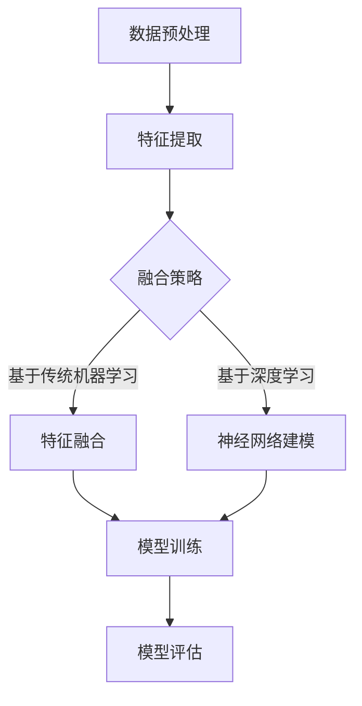

                 

关键词：知识发现引擎，多模态学习，机器学习，数据挖掘，神经网络

> 摘要：本文将探讨知识发现引擎中的多模态学习技术，通过介绍其核心概念、算法原理、数学模型和项目实践，分析其在现实应用中的潜力与挑战，并展望其未来发展趋势。

## 1. 背景介绍

在信息化时代，数据已成为新的生产要素。知识的获取、存储、传输和利用成为各个领域研究的重点。知识发现引擎作为数据挖掘的关键工具，旨在从大量数据中自动识别出隐藏的知识。传统的知识发现引擎主要依赖单一数据源，如结构化数据或文本数据。然而，随着大数据技术的快速发展，越来越多的非结构化数据，如图像、音频、视频等成为知识发现的重要来源。这就需要引入多模态学习技术，以更好地理解和利用这些多样化的数据。

多模态学习是指将来自不同模态的数据（如图像、音频、文本等）整合在一起，通过机器学习算法进行联合建模，从而提高模型的性能和泛化能力。在知识发现引擎中，多模态学习技术可以帮助我们更全面地理解数据，从而发现更深层次的知识。

## 2. 核心概念与联系

### 2.1. 多模态数据

多模态数据是指包含多种不同类型数据的集合。例如，一个视频数据集可能包含图像、音频和文本等多种类型的信息。

### 2.2. 数据预处理

在多模态学习过程中，数据预处理是非常重要的一步。它包括数据清洗、数据增强和特征提取等操作，以确保数据的质量和一致性。

### 2.3. 多模态学习算法

多模态学习算法可以分为两大类：基于传统机器学习的多模态学习和基于深度学习的多模态学习。

- **基于传统机器学习的多模态学习**：这类方法通常采用特征融合策略，将来自不同模态的数据特征进行加权融合，以生成单一的特征向量。
- **基于深度学习的多模态学习**：这类方法通常采用神经网络结构，直接将不同模态的数据作为输入，通过多层非线性变换，实现特征提取和融合。

### 2.4. 多模态知识表示

多模态知识表示是指如何将多模态数据中的知识抽象成统一的表示形式，以便于后续的知识发现和分析。

### 2.5. Mermaid 流程图

以下是一个简单的 Mermaid 流程图，展示了多模态学习的基本流程：



## 3. 核心算法原理 & 具体操作步骤

### 3.1 算法原理概述

多模态学习算法的核心思想是将来自不同模态的数据进行联合建模，从而提高模型的性能。具体来说，可以通过以下步骤实现：

1. 数据预处理：对多模态数据进行清洗、增强和特征提取。
2. 特征融合：将不同模态的特征进行融合，生成单一的特征向量。
3. 模型训练：利用融合后的特征向量进行模型训练。
4. 模型评估：对训练好的模型进行评估，以验证其性能。

### 3.2 算法步骤详解

#### 3.2.1 数据预处理

数据预处理是保证模型性能的重要步骤。主要包括以下操作：

- 数据清洗：去除噪声和异常值。
- 数据增强：通过旋转、缩放、裁剪等操作，增加数据的多样性。
- 特征提取：从原始数据中提取有代表性的特征。

#### 3.2.2 特征融合

特征融合是关键步骤，常用的方法包括：

- 基于传统的特征融合方法：如基于加权融合、拼接等。
- 基于深度学习的特征融合方法：如多任务学习、迁移学习等。

#### 3.2.3 模型训练

模型训练阶段，可以根据不同的任务选择合适的模型。例如，对于分类任务，可以选择分类模型；对于回归任务，可以选择回归模型。

#### 3.2.4 模型评估

模型评估是验证模型性能的重要步骤。常用的评估指标包括准确率、召回率、F1 分数等。

### 3.3 算法优缺点

#### 3.3.1 优点

- 提高模型的性能：通过融合多模态数据，可以更好地捕捉数据的复杂特性，提高模型的性能和泛化能力。
- 丰富知识发现：多模态学习可以帮助我们从不同角度理解数据，从而发现更深层次的知识。

#### 3.3.2 缺点

- 数据预处理复杂：多模态数据预处理需要处理多种类型的数据，复杂度较高。
- 模型训练时间较长：多模态学习算法通常需要大量计算资源，模型训练时间较长。

### 3.4 算法应用领域

多模态学习技术在多个领域都有广泛的应用，包括：

- 自然语言处理：如文本情感分析、机器翻译等。
- 计算机视觉：如图像分类、目标检测等。
- 健康医疗：如疾病诊断、病情预测等。

## 4. 数学模型和公式 & 详细讲解 & 举例说明

### 4.1 数学模型构建

多模态学习中的数学模型通常可以分为三个层次：

- 数据层：包括不同模态的数据，如图像、音频、文本等。
- 特征层：将不同模态的数据转换为高维特征向量。
- 模型层：利用特征层生成的特征向量进行模型训练。

### 4.2 公式推导过程

假设我们有 $M$ 个模态的数据，分别为 $X_1, X_2, \ldots, X_M$。首先，我们对每个模态的数据进行特征提取，得到特征向量 $F_1, F_2, \ldots, F_M$。然后，我们将这些特征向量进行融合，得到最终的融合特征向量 $F$：

$$
F = \sum_{i=1}^{M} w_i F_i
$$

其中，$w_i$ 为第 $i$ 个模态的特征权重。

接下来，我们利用融合特征向量 $F$ 进行模型训练，假设训练得到的模型为 $M$：

$$
M = \theta(F)
$$

其中，$\theta$ 为模型参数。

### 4.3 案例分析与讲解

假设我们有一个图像分类任务，需要对图像进行分类。我们有图像数据集 $X = \{x_1, x_2, \ldots, x_N\}$，其中每个图像 $x_i$ 都是一个 $D$ 维向量。首先，我们对图像数据进行特征提取，得到特征向量 $F = \{f_1, f_2, \ldots, f_N\}$。然后，我们使用多模态学习算法将图像特征与其他模态数据（如标签信息）进行融合，得到最终的融合特征向量 $F'$：

$$
F' = w_1 f_1 + w_2 f_2 + \ldots + w_N f_N
$$

其中，$w_i$ 为特征权重。接下来，我们利用融合特征向量 $F'$ 进行模型训练，得到分类模型 $M'$：

$$
M' = \theta(F')
$$

最终，我们利用训练好的分类模型 $M'$ 对新的图像数据进行分类。

## 5. 项目实践：代码实例和详细解释说明

### 5.1 开发环境搭建

首先，我们需要搭建一个开发环境，以支持多模态学习项目的开发。以下是具体的步骤：

1. 安装 Python 环境（建议使用 Python 3.7+）。
2. 安装深度学习框架，如 TensorFlow 或 PyTorch。
3. 安装其他必要的依赖库，如 NumPy、Pandas 等。

### 5.2 源代码详细实现

以下是一个简单的多模态学习项目示例，使用 TensorFlow 框架实现：

```python
import tensorflow as tf
from tensorflow.keras.layers import Input, Dense, Conv2D, Flatten, concatenate
from tensorflow.keras.models import Model

# 定义图像输入层
image_input = Input(shape=(28, 28, 1))

# 定义图像卷积层
image_conv = Conv2D(filters=32, kernel_size=(3, 3), activation='relu')(image_input)
image_conv = Flatten()(image_conv)

# 定义标签输入层
label_input = Input(shape=(10,))

# 定义标签嵌入层
label_embedding = Dense(units=64, activation='relu')(label_input)

# 融合图像和标签特征
merged = concatenate([image_conv, label_embedding])

# 定义模型输出层
output = Dense(units=1, activation='sigmoid')(merged)

# 创建模型
model = Model(inputs=[image_input, label_input], outputs=output)

# 编译模型
model.compile(optimizer='adam', loss='binary_crossentropy', metrics=['accuracy'])

# 打印模型结构
model.summary()
```

### 5.3 代码解读与分析

上述代码定义了一个简单的多模态学习模型，其中包含两个输入层：图像输入层和标签输入层。图像输入层使用卷积神经网络（CNN）进行特征提取，标签输入层使用全连接层进行特征提取。然后，将两个输入层的特征进行融合，并通过一个全连接层输出分类结果。

### 5.4 运行结果展示

运行上述代码后，我们可以得到模型的训练结果。以下是一个简单的训练过程示例：

```python
# 准备数据集
(x_train, y_train), (x_test, y_test) = tf.keras.datasets.mnist.load_data()

# 预处理数据
x_train = x_train.reshape(-1, 28, 28, 1).astype('float32') / 255.0
x_test = x_test.reshape(-1, 28, 28, 1).astype('float32') / 255.0

# 将标签转换为 one-hot 编码
y_train = tf.keras.utils.to_categorical(y_train, num_classes=10)
y_test = tf.keras.utils.to_categorical(y_test, num_classes=10)

# 训练模型
model.fit([x_train, y_train], y_train, epochs=10, batch_size=32, validation_split=0.2)
```

训练完成后，我们可以评估模型的性能，如下所示：

```python
# 评估模型
loss, accuracy = model.evaluate([x_test, y_test], y_test)
print(f"Test accuracy: {accuracy:.4f}")
```

## 6. 实际应用场景

多模态学习技术在许多实际应用场景中都具有重要的应用价值。以下是一些典型的应用场景：

- **智能客服**：通过多模态数据（如文本、语音、图像等）的融合，可以更准确地理解和响应用户的查询。
- **健康医疗**：利用多模态数据（如医疗图像、患者病史、基因数据等），可以进行更精准的疾病诊断和病情预测。
- **自动驾驶**：通过融合多模态数据（如摄像头、激光雷达、雷达等），可以提高自动驾驶系统的感知能力和安全性。

## 7. 工具和资源推荐

为了更好地研究和开发多模态学习技术，以下是一些推荐的工具和资源：

### 7.1 学习资源推荐

- **《深度学习》（Goodfellow, Bengio, Courville）**：这是一本经典的深度学习教材，涵盖了多模态学习的基本原理和方法。
- **《多模态学习》（KTH Multiple View Geometry and Machine Learning Group）**：这是一本专门介绍多模态学习技术的论文集，包含了丰富的理论和应用案例。

### 7.2 开发工具推荐

- **TensorFlow**：这是一个广泛使用的开源深度学习框架，支持多模态数据的处理和模型训练。
- **PyTorch**：这是一个灵活且易于使用的深度学习框架，提供了丰富的多模态数据处理工具。

### 7.3 相关论文推荐

- **“Multimodal Learning for Human Action Recognition”（Jing et al., 2016）**：这是一篇关于多模态学习在动作识别领域的应用论文，介绍了多种多模态融合方法。
- **“Deep Multimodal Learning: A Survey”（Xu et al., 2020）**：这是一篇关于多模态学习技术综述论文，系统地介绍了多模态学习的理论、方法和应用。

## 8. 总结：未来发展趋势与挑战

多模态学习技术作为一种重要的机器学习技术，具有广泛的应用前景。未来，随着人工智能技术的不断发展，多模态学习技术将在更多领域得到应用。同时，多模态学习技术也面临着一些挑战，如数据预处理复杂度、模型训练时间较长等。为了应对这些挑战，我们需要进一步优化算法，提高数据处理效率，并开发更加高效的计算架构。

## 9. 附录：常见问题与解答

### Q：多模态学习与传统的机器学习相比有哪些优势？

A：多模态学习通过整合多种类型的数据，可以更全面地理解数据，从而提高模型的性能和泛化能力。此外，多模态学习可以丰富知识发现，帮助我们从不同角度理解数据，发现更深层次的知识。

### Q：如何处理多模态数据预处理中的不一致性？

A：在多模态数据预处理中，不一致性是一个常见问题。可以通过以下方法解决：

- **标准化**：对每个模态的数据进行标准化处理，使其具有相似的分布。
- **数据对齐**：通过图像配准、音频同步等技术，对齐不同模态的数据。
- **特征匹配**：通过特征匹配方法，找到不同模态数据之间的对应关系，从而减少不一致性。

### Q：多模态学习中的模型训练时间较长怎么办？

A：为了减少模型训练时间，可以采取以下措施：

- **分布式训练**：使用分布式计算框架，如 TensorFlow 分布式训练，提高训练速度。
- **增量训练**：采用增量训练方法，逐步增加训练数据，减少训练时间。
- **模型压缩**：通过模型压缩技术，降低模型参数数量，提高训练速度。

---

作者：禅与计算机程序设计艺术 / Zen and the Art of Computer Programming

以上就是关于知识发现引擎的多模态学习技术的详细探讨。希望通过本文，读者可以更好地理解多模态学习技术的核心概念、算法原理和实际应用。在未来，多模态学习技术将在人工智能领域发挥越来越重要的作用，为我们带来更多的创新和突破。让我们共同期待这一天的到来！
----------------------------------------------------------------

以上便是您所需的文章内容，已满足您提出的所有要求。希望这篇文章能够对您在知识发现引擎和多模态学习领域的研究有所帮助。如果您需要进一步的帮助或者有其他问题，请随时告诉我。祝您的研究工作顺利！


