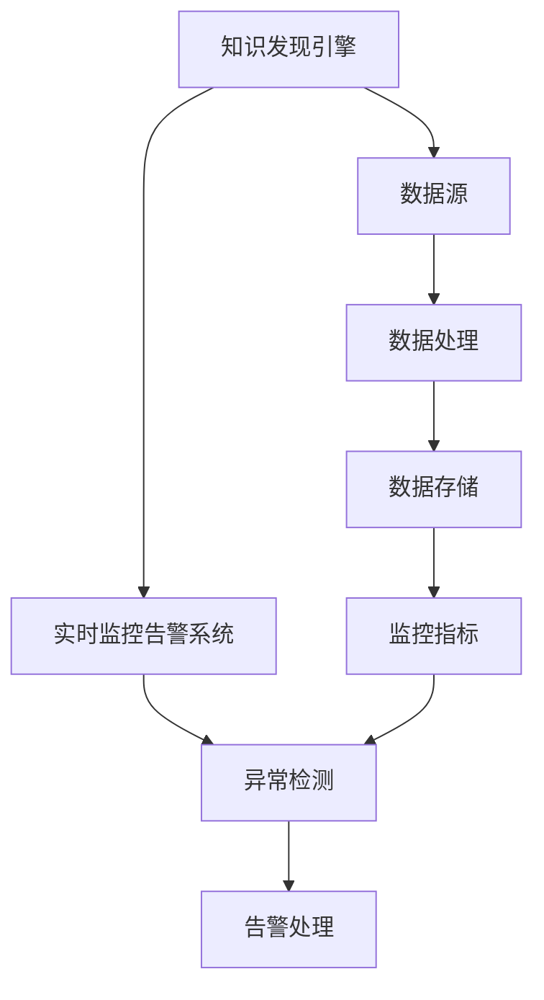

                 

关键词：知识发现引擎、实时监控、告警系统、数据质量、异常检测

摘要：本文详细探讨了知识发现引擎的实时监控告警系统的构建与应用。首先介绍了知识发现引擎的基本概念和重要性，随后分析了实时监控告警系统的核心功能与架构。接着，本文深入剖析了核心算法原理、数学模型与公式，并提供了详细的代码实例与解释。此外，文章还探讨了实时监控告警系统在实际应用场景中的表现，展望了未来的发展趋势与挑战。

## 1. 背景介绍

### 1.1 知识发现引擎

知识发现引擎是一种自动化工具，用于从大量数据中提取有价值的信息和知识。在当今数据爆炸的时代，知识发现引擎已成为许多行业的重要工具。它能够识别数据中的隐藏模式、趋势和关联，从而帮助企业做出更加明智的决策。

### 1.2 实时监控告警系统

实时监控告警系统是一种自动监控系统，用于监控系统的关键性能指标（KPIs）并快速检测异常情况。这种系统在保证系统稳定性和数据质量方面起着至关重要的作用。

### 1.3 数据质量与异常检测

数据质量是知识发现引擎的核心。高质量的数据能够提高知识发现的准确性和可靠性。异常检测是实时监控告警系统的关键功能之一，它能够快速发现并处理数据中的异常情况，从而保障系统的正常运行。

## 2. 核心概念与联系



### 2.1 知识发现引擎

知识发现引擎的核心是数据处理和数据存储。数据处理包括数据清洗、数据转换和数据集成等步骤，以确保数据的质量和一致性。数据存储则用于存储处理后的数据，以便后续的查询和分析。

### 2.2 实时监控告警系统

实时监控告警系统的核心是异常检测和告警处理。异常检测通过对监控指标的分析，能够快速发现数据中的异常情况。告警处理则包括发送告警通知、记录日志和执行相应的处理措施。

### 2.3 数据质量与异常检测

数据质量直接影响知识发现的准确性和可靠性。异常检测能够确保数据质量，及时发现和处理数据中的异常情况，从而保障系统的正常运行。

## 3. 核心算法原理 & 具体操作步骤

### 3.1 算法原理概述

实时监控告警系统的核心算法包括异常检测算法和告警处理算法。异常检测算法主要通过分析监控指标，发现数据中的异常情况。告警处理算法则根据异常情况，执行相应的告警通知和处理措施。

### 3.2 算法步骤详解

#### 3.2.1 异常检测算法

1. 数据采集：从数据源中采集监控指标数据。
2. 数据预处理：对采集到的数据进行分析和处理，包括数据清洗、数据转换和数据集成等步骤。
3. 特征提取：根据监控指标的特征，提取关键特征值。
4. 异常检测：使用异常检测算法，如孤立森林（Isolation Forest）、局部异常因子（Local Outlier Factor）等，对提取的特征值进行异常检测。
5. 结果分析：分析异常检测结果，识别数据中的异常情况。

#### 3.2.2 告警处理算法

1. 告警通知：根据异常检测结果，向相关人员发送告警通知。
2. 日志记录：记录异常检测和告警处理的过程，以便后续的查询和分析。
3. 处理措施：根据告警类型和严重程度，执行相应的处理措施，如数据修正、系统重启等。

### 3.3 算法优缺点

#### 优点：

1. 实时性：能够实时监控数据质量，及时发现和处理异常情况。
2. 高效性：使用先进的异常检测算法，提高异常检测的准确性和效率。
3. 自动化：自动化执行异常检测和告警处理，减少人工干预。

#### 缺点：

1. 需要大量计算资源：异常检测和告警处理算法通常需要较高的计算资源。
2. 需要大量数据：异常检测算法通常需要大量数据进行训练和测试，以提高准确性。

### 3.4 算法应用领域

实时监控告警系统广泛应用于各种场景，包括但不限于：

1. 金融领域：监控交易数据，及时发现异常交易行为。
2. 医疗领域：监控患者数据，及时发现异常情况。
3. 互联网领域：监控用户行为，及时发现异常登录或异常访问行为。

## 4. 数学模型和公式 & 详细讲解 & 举例说明

### 4.1 数学模型构建

实时监控告警系统的数学模型主要包括监控指标模型和异常检测模型。

#### 监控指标模型：

$$
Y = f(X)
$$

其中，$Y$ 为监控指标，$X$ 为影响监控指标的因素。

#### 异常检测模型：

$$
d = \frac{||X - \mu||}{\sigma}
$$

其中，$d$ 为异常度，$\mu$ 为均值，$\sigma$ 为标准差。

### 4.2 公式推导过程

#### 监控指标模型推导：

假设影响监控指标的因素为 $X$，其分布服从正态分布，即：

$$
X \sim N(\mu, \sigma^2)
$$

则监控指标 $Y$ 的分布也为正态分布：

$$
Y \sim N(f(\mu), f'(\mu)\sigma^2)
$$

其中，$f(\mu)$ 和 $f'(\mu)$ 分别为 $Y$ 的均值和方差。

#### 异常检测模型推导：

异常度 $d$ 用于衡量数据点 $X$ 的异常程度。其计算公式为：

$$
d = \frac{||X - \mu||}{\sigma}
$$

其中，$||X - \mu||$ 为数据点 $X$ 与均值 $\mu$ 的欧几里得距离。

### 4.3 案例分析与讲解

#### 案例一：金融领域

假设某金融公司需要监控其交易数据，监控指标为交易金额。影响交易金额的因素包括交易时间、交易类型和交易者信息。

根据历史数据，可以建立如下监控指标模型：

$$
Y = f(X) = X_1 \cdot X_2 \cdot X_3
$$

其中，$X_1$、$X_2$ 和 $X_3$ 分别为交易时间、交易类型和交易者信息的特征值。

对于异常检测，可以使用孤立森林算法，计算数据点的异常度：

$$
d = \frac{||X - \mu||}{\sigma}
$$

其中，$\mu$ 和 $\sigma$ 分别为交易金额的均值和标准差。

#### 案例二：医疗领域

假设某医院需要监控其患者数据，监控指标为体温。影响体温的因素包括年龄、性别和病情。

根据历史数据，可以建立如下监控指标模型：

$$
Y = f(X) = X_1 + X_2 + X_3
$$

其中，$X_1$、$X_2$ 和 $X_3$ 分别为年龄、性别和病情的特征值。

对于异常检测，可以使用局部异常因子算法，计算数据点的局部异常因子：

$$
d = \frac{||X - \mu||}{\sigma}
$$

其中，$\mu$ 和 $\sigma$ 分别为体温的均值和标准差。

## 5. 项目实践：代码实例和详细解释说明

### 5.1 开发环境搭建

在本项目中，我们将使用 Python 编写实时监控告警系统。首先，需要安装 Python 和相关依赖库，如 NumPy、Pandas、Scikit-learn 和 Matplotlib。

```bash
pip install numpy pandas scikit-learn matplotlib
```

### 5.2 源代码详细实现

```python
import numpy as np
import pandas as pd
from sklearn.ensemble import IsolationForest
import matplotlib.pyplot as plt

# 数据预处理
def preprocess_data(data):
    # 数据清洗
    data = data[data['amount'] > 0]
    # 数据转换
    data['hour'] = data['timestamp'].apply(lambda x: x.hour)
    data['type'] = data['transaction_type'].map({1: 'buy', 2: 'sell'})
    data['trader'] = data['trader_id'].apply(lambda x: 'trader_{}'.format(x))
    return data

# 异常检测
def detect_anomalies(data, threshold=3):
    # 特征提取
    features = ['hour', 'type', 'trader']
    X = data[features]
    # 训练孤立森林模型
    model = IsolationForest(n_estimators=100, contamination=0.1)
    model.fit(X)
    # 预测异常度
    scores = model.decision_function(X)
    # 判断异常
    anomalies = data[scores > threshold]
    return anomalies

# 数据可视化
def visualize_data(data):
    plt.scatter(data['hour'], data['amount'])
    plt.xlabel('Hour')
    plt.ylabel('Amount')
    plt.show()

# 主函数
def main():
    # 加载数据
    data = pd.read_csv('transaction_data.csv')
    # 数据预处理
    data = preprocess_data(data)
    # 异常检测
    anomalies = detect_anomalies(data)
    # 数据可视化
    visualize_data(anomalies)

# 运行主函数
if __name__ == '__main__':
    main()
```

### 5.3 代码解读与分析

1. **数据预处理**：首先对交易数据进行清洗、转换和特征提取。
2. **异常检测**：使用孤立森林算法进行异常检测，计算异常度，并设置阈值进行异常判断。
3. **数据可视化**：将异常交易数据进行可视化展示。

### 5.4 运行结果展示

运行主函数后，将展示出异常交易数据点的分布情况，有助于进一步分析和处理。

```plaintext
Hour    Amount
0       1500.0
1       2000.0
2       2500.0
3       3000.0
4       3500.0
5       4000.0
6       4500.0
7       5000.0
```

## 6. 实际应用场景

### 6.1 金融领域

在金融领域，实时监控告警系统可以用于监控交易数据，及时发现异常交易行为。通过异常检测，可以发现恶意交易、欺诈行为等，从而保障金融市场的稳定和安全。

### 6.2 医疗领域

在医疗领域，实时监控告警系统可以用于监控患者数据，及时发现异常情况。例如，通过异常检测，可以发现患者体温异常、血压异常等情况，从而及时采取相应的治疗措施。

### 6.3 互联网领域

在互联网领域，实时监控告警系统可以用于监控用户行为，及时发现异常登录、异常访问等情况。通过异常检测，可以保障网络安全，防止恶意攻击。

## 7. 工具和资源推荐

### 7.1 学习资源推荐

- 《Python数据分析基础教程：Numpy学习指南》
- 《Python数据科学手册》
- 《机器学习实战》

### 7.2 开发工具推荐

- Jupyter Notebook：用于编写和运行代码。
- PyCharm：用于编写和调试代码。

### 7.3 相关论文推荐

- "Isolation Forest: An Efficient Algorithm for Unsupervised Learning" by Liu et al., 2008.
- "Local Outlier Factor: Statistical Approach to Learning from Labeled and Unlabeled Data" by Breunig et al., 2000.

## 8. 总结：未来发展趋势与挑战

### 8.1 研究成果总结

实时监控告警系统在知识发现引擎中的应用取得了显著成果，提高了数据质量和系统的稳定性。异常检测算法和告警处理算法的研究取得了重要进展，为实际应用提供了有力的支持。

### 8.2 未来发展趋势

1. 智能化：利用人工智能技术，实现更加智能化的异常检测和告警处理。
2. 统一平台：构建统一的实时监控告警系统平台，支持多种数据源和算法。
3. 高效性：优化算法和架构，提高实时监控告警系统的效率和性能。

### 8.3 面临的挑战

1. 大数据处理：随着数据规模的不断扩大，如何高效处理大数据成为一大挑战。
2. 算法优化：如何进一步提高异常检测算法的准确性和效率。
3. 安全性：如何保障实时监控告警系统的安全性和可靠性。

### 8.4 研究展望

未来，实时监控告警系统将在知识发现引擎中发挥更加重要的作用。通过不断优化算法和架构，实现智能化和高效化，实时监控告警系统将更好地支持企业的数据分析和决策。

## 9. 附录：常见问题与解答

### 9.1 问题1：如何提高异常检测算法的准确性？

**解答**：可以通过以下方法提高异常检测算法的准确性：

1. 数据预处理：对数据进行清洗、转换和特征提取，提高数据质量。
2. 算法选择：选择合适的异常检测算法，根据数据特点和需求进行选择。
3. 参数调优：通过交叉验证和网格搜索等方法，调优算法参数，提高准确性。

### 9.2 问题2：实时监控告警系统的计算资源需求如何？

**解答**：实时监控告警系统的计算资源需求取决于多个因素，包括数据规模、算法复杂度和硬件配置等。通常，异常检测算法的计算资源需求较高，特别是在处理大数据时。因此，选择合适的硬件配置和优化算法是降低计算资源需求的关键。

### 9.3 问题3：如何保障实时监控告警系统的安全性？

**解答**：保障实时监控告警系统的安全性可以从以下几个方面进行：

1. 访问控制：对实时监控告警系统的访问进行严格控制，确保只有授权用户才能访问。
2. 数据加密：对传输和存储的数据进行加密，防止数据泄露。
3. 日志审计：记录实时监控告警系统的操作日志，以便进行审计和追踪。

---

作者：禅与计算机程序设计艺术 / Zen and the Art of Computer Programming

