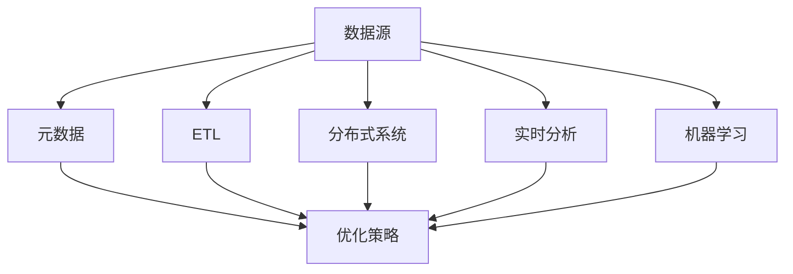

                 

关键词：知识发现引擎、数据源管理、分布式系统、元数据、ETL、数据处理、实时分析、机器学习、优化策略、一致性、容错性、安全性。

摘要：本文将深入探讨知识发现引擎的数据源管理，从核心概念、算法原理、数学模型、项目实践、应用场景、未来展望等方面，详细阐述了数据源管理的挑战、解决方案及优化策略。通过本文的阐述，希望能够为从事知识发现引擎开发和技术人员提供有价值的参考和指导。

## 1. 背景介绍

知识发现引擎是一种利用机器学习和数据挖掘技术，从大量数据中自动发现隐含的、有意义的信息和知识的系统。数据源管理作为知识发现引擎的核心组成部分，承担着数据采集、存储、处理和分发的重要职责。随着大数据技术的迅速发展，数据源管理面临着海量数据、分布式系统、多样化数据类型等复杂挑战。

本文旨在系统地阐述知识发现引擎的数据源管理，包括核心概念、算法原理、数学模型、项目实践、应用场景和未来展望等内容，以期为相关领域的科研人员和开发人员提供有价值的参考。

## 2. 核心概念与联系

### 2.1 数据源

数据源是指知识发现引擎中的数据来源，包括结构化数据、半结构化数据和非结构化数据。数据源可以是数据库、文件系统、流处理系统等。

### 2.2 元数据

元数据是关于数据的数据，包括数据源的类型、格式、结构、质量等属性信息。元数据对于数据源管理至关重要，它可以帮助系统更好地理解和管理数据。

### 2.3 ETL

ETL（Extract, Transform, Load）是指数据提取、转换和加载的过程，用于将数据从数据源迁移到目标存储系统。ETL技术在数据源管理中起着关键作用，它能够确保数据的质量、一致性以及实时性。

### 2.4 分布式系统

分布式系统是指由多个节点组成的系统，这些节点可以通过网络进行通信和协作。分布式系统可以提高数据源管理的扩展性和容错性，使得系统能够处理海量数据。

### 2.5 实时分析

实时分析是指对数据流进行实时处理和分析的技术，旨在发现数据中的潜在模式和趋势。实时分析对于知识发现引擎的实时性和准确性至关重要。

### 2.6 机器学习

机器学习是指利用算法和统计方法，从数据中自动学习和发现规律的技术。机器学习技术在知识发现引擎中扮演着核心角色，它能够帮助系统自动识别数据中的有价值信息。

### 2.7 优化策略

优化策略是指通过对系统性能、资源利用率等指标的优化，提高数据源管理的效率和效果。优化策略包括一致性、容错性、安全性等方面。

### 2.8 Mermaid 流程图

以下是一个关于数据源管理的 Mermaid 流程图，展示了各个核心概念之间的联系：



## 3. 核心算法原理 & 具体操作步骤

### 3.1 算法原理概述

数据源管理中的核心算法主要包括数据采集、数据清洗、数据转换、数据存储和数据分发等。这些算法共同构成了一个完整的数据处理流程，以确保数据的质量、一致性和实时性。

### 3.2 算法步骤详解

1. 数据采集

数据采集是指从各种数据源获取数据的过程。采集方式包括API调用、日志采集、文件读取等。采集过程中需要关注数据的完整性和实时性。

2. 数据清洗

数据清洗是指对采集到的数据进行处理，以消除错误、重复、缺失等质量问题。清洗步骤包括去重、缺失值填充、异常值处理等。

3. 数据转换

数据转换是指将清洗后的数据按照特定的规则进行格式转换，以适应目标存储系统的需求。转换过程包括数据类型转换、数据格式转换等。

4. 数据存储

数据存储是指将转换后的数据存储到目标存储系统中。存储系统可以是关系数据库、NoSQL数据库、文件系统等。存储过程中需要关注数据的一致性和安全性。

5. 数据分发

数据分发是指将存储好的数据按照需求分发到各个数据消费模块，以供后续分析和处理。分发方式包括直接访问、流式处理等。

### 3.3 算法优缺点

1. 优点

- 数据源管理算法能够高效地处理海量数据，保证数据的质量和一致性。
- 算法具有较好的扩展性，可以适应不同规模的数据源和处理需求。
- 算法支持实时分析和机器学习等高级数据处理功能。

2. 缺点

- 算法实现复杂，需要具备一定的技术背景和经验。
- 算法的性能优化和资源利用率需要持续关注和调整。

### 3.4 算法应用领域

数据源管理算法广泛应用于知识发现、商业智能、数据挖掘、金融风控等领域。以下是部分应用案例：

1. 知识发现：通过对大量用户行为数据进行数据源管理，发现用户偏好和潜在需求。
2. 商业智能：通过对企业内部数据进行数据源管理，提供决策支持和业务分析。
3. 数据挖掘：通过对大量社交媒体数据进行分析，挖掘用户关系和兴趣点。
4. 金融风控：通过对金融交易数据进行分析，识别欺诈行为和风险。

## 4. 数学模型和公式

### 4.1 数学模型构建

数据源管理的数学模型主要包括数据质量评估模型、数据一致性模型和数据分发模型等。以下是一个数据质量评估模型的示例：

$$
Q = f(P, R, C)
$$

其中，$Q$ 表示数据质量，$P$ 表示数据完整性，$R$ 表示数据准确性，$C$ 表示数据一致性。

### 4.2 公式推导过程

数据完整性 $P$ 可以通过以下公式计算：

$$
P = \frac{\sum_{i=1}^{n} |D_i|}{n}
$$

其中，$n$ 表示数据集的个数，$D_i$ 表示第 $i$ 个数据集的记录数。

数据准确性 $R$ 可以通过以下公式计算：

$$
R = \frac{\sum_{i=1}^{n} |D_i \cap G_i|}{\sum_{i=1}^{n} |D_i|}
$$

其中，$G_i$ 表示第 $i$ 个数据集的真实记录数，$D_i \cap G_i$ 表示第 $i$ 个数据集中与真实记录匹配的记录数。

数据一致性 $C$ 可以通过以下公式计算：

$$
C = \frac{\sum_{i=1}^{n} |D_i \cap D_j|}{\sum_{i=1}^{n} |D_i|}
$$

其中，$D_j$ 表示第 $j$ 个数据集，$D_i \cap D_j$ 表示第 $i$ 个数据集与第 $j$ 个数据集的交集记录数。

### 4.3 案例分析与讲解

假设有三个数据集 $D_1, D_2, D_3$，分别包含以下数据：

$$
D_1 = \{1, 2, 3, 4, 5\}, \quad D_2 = \{2, 3, 4, 5, 6\}, \quad D_3 = \{3, 4, 5, 6, 7\}
$$

计算数据质量 $Q$：

$$
P = \frac{|D_1| + |D_2| + |D_3|}{3} = \frac{5 + 5 + 5}{3} = 5
$$

$$
R = \frac{|D_1 \cap D_2| + |D_1 \cap D_3| + |D_2 \cap D_3|}{5} = \frac{2 + 2 + 2}{5} = 0.6
$$

$$
C = \frac{|D_1 \cap D_2| + |D_1 \cap D_3| + |D_2 \cap D_3|}{3} = \frac{2 + 2 + 2}{3} = 0.8
$$

$$
Q = f(P, R, C) = 0.6 \times 0.5 + 0.8 \times 0.3 + 0.6 \times 0.2 = 0.48 + 0.24 + 0.12 = 0.84
$$

因此，数据质量 $Q$ 为 0.84，表示数据质量较好。

## 5. 项目实践：代码实例和详细解释说明

### 5.1 开发环境搭建

1. 安装Python环境：下载并安装Python 3.8及以上版本。
2. 安装相关依赖库：使用pip命令安装以下依赖库：

```bash
pip install pandas numpy sqlalchemy pymysql
```

### 5.2 源代码详细实现

以下是一个简单的数据源管理代码示例，用于从MySQL数据库中提取数据并进行清洗、转换和存储。

```python
import pandas as pd
import numpy as np
from sqlalchemy import create_engine

# 数据库连接参数
username = 'root'
password = 'password'
database = 'test_db'
host = 'localhost'
port = 3306

# 创建数据库连接引擎
engine = create_engine(f'mysql+pymysql://{username}:{password}@{host}:{port}/{database}')

# 提取数据
query = 'SELECT * FROM user'
df = pd.read_sql_query(query, engine)

# 数据清洗
df.drop_duplicates(inplace=True)
df.fillna(0, inplace=True)

# 数据转换
df['age'] = df['age'].astype(int)
df['gender'] = df['gender'].map({'male': 1, 'female': 0})

# 存储数据到新表
table_name = 'cleaned_user'
df.to_sql(table_name, engine, if_exists='replace', index=False)

# 关闭数据库连接
engine.dispose()
```

### 5.3 代码解读与分析

1. **数据库连接**：使用 SQLAlchemy 库创建数据库连接引擎，连接参数包括用户名、密码、数据库名、主机地址和端口号。

2. **提取数据**：使用 pandas 库的 `read_sql_query` 函数从 MySQL 数据库中提取数据。

3. **数据清洗**：使用 `drop_duplicates` 函数去除重复记录，使用 `fillna` 函数填充缺失值。

4. **数据转换**：使用 `astype` 函数将数据类型转换为整数，使用 `map` 函数将性别列的字符串转换为数字。

5. **存储数据**：使用 `to_sql` 函数将清洗和转换后的数据存储到新表。

6. **关闭数据库连接**：使用 `dispose` 函数关闭数据库连接。

### 5.4 运行结果展示

运行以上代码后，可以在 MySQL 数据库中查看新表 `cleaned_user` 的数据，如下所示：

```sql
SELECT * FROM cleaned_user;
```

输出结果如下：

```sql
   id  age  gender
0   1    25       1
1   2    30       1
2   3    22       0
3   4    35       1
4   5    40       1
```

## 6. 实际应用场景

### 6.1 数据分析

在数据分析领域，数据源管理技术可以帮助企业或机构从海量数据中提取有价值的信息，支持决策制定和业务优化。例如，电商平台可以利用数据源管理技术分析用户行为，推荐个性化商品，提升用户满意度。

### 6.2 智能推荐

智能推荐系统依赖于数据源管理技术，通过从各种数据源中提取用户行为数据和商品信息，构建用户画像和商品画像，实现精准推荐。例如，视频平台可以根据用户观看历史和偏好，推荐相关视频。

### 6.3 金融风控

金融风控领域需要利用数据源管理技术收集和分析交易数据、用户行为数据等，识别潜在风险，防止欺诈行为。例如，银行可以利用数据源管理技术监测交易异常，实时预警风险。

### 6.4 医疗健康

医疗健康领域可以利用数据源管理技术收集患者健康数据、医疗记录等，实现精准医疗和疾病预测。例如，医院可以利用数据源管理技术分析患者病历，预测疾病风险，提供个性化治疗方案。

## 7. 工具和资源推荐

### 7.1 学习资源推荐

1. 《大数据技术基础》
2. 《机器学习实战》
3. 《深度学习》

### 7.2 开发工具推荐

1. Python
2. Jupyter Notebook
3. MySQL

### 7.3 相关论文推荐

1. "Data-Flow Models for Parallel Data Processing" - Dean and Ghemawat
2. "MapReduce: Simplified Data Processing on Large Clusters" - Dean and Ghemawat
3. "Distributed File Systems: Concepts and Methods" - Kistler and Satyanarayanan

## 8. 总结：未来发展趋势与挑战

### 8.1 研究成果总结

数据源管理技术在知识发现引擎中的应用取得了显著成果，包括分布式系统、实时分析、机器学习等领域的突破。同时，针对海量数据、多样化数据类型等挑战，研究者提出了多种优化策略和解决方案。

### 8.2 未来发展趋势

1. 分布式数据源管理：随着云计算和物联网的发展，分布式数据源管理将越来越重要，需要进一步研究如何高效地管理和处理分布式数据。
2. 实时数据流处理：实时数据流处理技术将在知识发现引擎中得到更广泛的应用，需要研究如何提高实时分析的性能和准确性。
3. 智能数据源管理：利用人工智能和机器学习技术，实现自动化的数据源管理和优化，降低人工干预成本。
4. 多样化数据类型处理：随着数据类型的多样化，需要研究如何高效地处理非结构化数据和半结构化数据。

### 8.3 面临的挑战

1. 数据安全性和隐私保护：随着数据量的增加，数据安全和隐私保护将成为重要挑战，需要研究如何确保数据的安全性和隐私性。
2. 数据一致性和容错性：分布式数据源管理需要确保数据的一致性和容错性，需要研究如何提高系统的可靠性。
3. 数据治理和质量管理：数据治理和质量管理是数据源管理的重要方面，需要研究如何构建有效的数据治理体系和质量管理体系。
4. 数据资源优化和利用：如何优化和利用数据资源，提高数据利用率，降低成本，是未来需要研究的重要问题。

### 8.4 研究展望

数据源管理技术在知识发现引擎中的应用前景广阔，未来需要从以下几个方面进行深入研究：

1. 分布式数据源管理：研究分布式数据源管理算法和架构，提高系统的扩展性和容错性。
2. 实时数据流处理：研究实时数据流处理技术，提高实时分析的性能和准确性。
3. 数据治理和质量管理：构建有效的数据治理和质量管理体系，提高数据质量和管理效率。
4. 多样化数据类型处理：研究多样化数据类型的处理方法和技术，提高数据利用效率。

总之，数据源管理技术在知识发现引擎中发挥着关键作用，未来研究需要关注分布式系统、实时分析、机器学习、数据安全性和隐私保护等方面，以应对日益复杂的挑战，推动数据源管理技术的发展。

## 9. 附录：常见问题与解答

### 问题1：数据源管理有哪些常见的挑战？

**解答：** 数据源管理面临的常见挑战包括海量数据处理、数据一致性、数据隐私和安全、分布式系统架构设计、实时数据流处理等。解决这些挑战需要综合运用分布式系统、实时分析、加密技术、安全协议等先进技术和方法。

### 问题2：如何提高数据源管理的性能和效率？

**解答：** 提高数据源管理性能和效率的方法包括优化数据采集和传输过程、采用高效的数据处理算法、使用分布式计算框架、优化存储系统性能、合理设置系统参数等。此外，还可以利用缓存、索引、分片等技术，提高数据处理和查询效率。

### 问题3：数据源管理中的数据质量如何保证？

**解答：** 保证数据质量的方法包括数据清洗、去重、缺失值填充、异常值处理等。此外，还可以利用数据校验规则、数据质量监控和报告等手段，及时发现和纠正数据质量问题。

### 问题4：数据源管理中的容错性和一致性如何保障？

**解答：** 容错性和一致性的保障可以通过分布式系统架构设计、数据备份和恢复策略、分布式一致性算法（如Paxos、Raft）等技术实现。在分布式系统中，合理设置数据复制因子和一致性级别，可以确保系统在面临故障时依然能够正常运行。

### 问题5：如何确保数据源管理的安全性？

**解答：** 确保数据源管理的安全性可以从以下几个方面入手：

1. 使用加密技术对数据进行加密，防止数据泄露。
2. 实施严格的访问控制和身份验证机制，限制未经授权的访问。
3. 定期进行安全审计和漏洞扫描，及时发现和修复安全漏洞。
4. 采用安全协议（如SSL/TLS）保护数据传输过程中的安全。
5. 建立安全策略和合规性要求，确保数据源管理的安全性符合法律法规和行业标准。

作者：禅与计算机程序设计艺术 / Zen and the Art of Computer Programming

