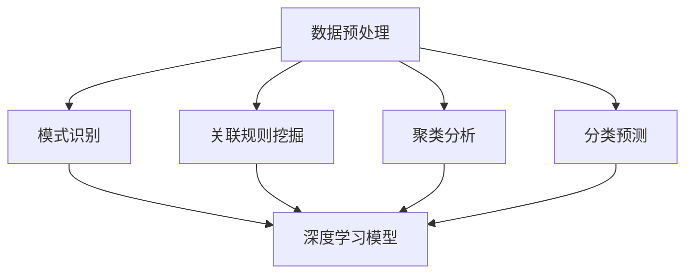

                 

关键词：知识发现，深度学习，人工智能，算法，应用场景，未来展望

> 摘要：本文探讨了知识发现引擎在深度学习技术中的应用，分析了当前的主流算法和数学模型，并通过实际项目实例，展示了如何利用深度学习技术提升知识发现引擎的性能和效果。同时，对未来的发展趋势和挑战进行了深入探讨。

## 1. 背景介绍

随着互联网和大数据的迅猛发展，数据已经成为现代社会的重要资产。然而，如何从海量数据中提取有价值的信息，即知识发现，成为了一个亟待解决的问题。知识发现引擎作为知识发现的核心工具，其性能和效果直接关系到企业的决策质量和效率。深度学习作为人工智能的一个重要分支，凭借其强大的建模能力和自学习能力，逐渐成为知识发现引擎提升性能的关键技术。

### 知识发现引擎

知识发现引擎是指利用数据挖掘技术，从大量数据中自动提取有价值信息，并转化为知识系统的工具。其主要功能包括数据预处理、模式识别、关联规则挖掘、聚类分析、分类预测等。

### 深度学习

深度学习是一种基于人工神经网络的算法，通过多层神经网络对数据进行建模和学习，能够自动提取数据的特征和规律。深度学习在图像识别、语音识别、自然语言处理等领域取得了显著的成果。

## 2. 核心概念与联系

### 数据预处理

在知识发现引擎中，数据预处理是至关重要的环节。深度学习技术可以帮助我们实现更高效、更准确的数据预处理，如数据清洗、数据归一化、特征提取等。

### 模式识别

模式识别是知识发现的核心任务之一，深度学习通过多层神经网络，能够自动提取数据中的隐藏特征，实现对复杂模式的识别。

### 关联规则挖掘

关联规则挖掘是指从大量数据中找出不同数据项之间的关联关系。深度学习可以通过构建图神经网络，实现更高效的关联规则挖掘。

### 聚类分析

聚类分析是将数据集划分为多个类别，以发现数据中的隐含模式。深度学习可以通过自编码器、聚类神经网络等方法，实现更有效的聚类分析。

### 分类预测

分类预测是指将数据划分为不同的类别，以实现对未知数据的分类。深度学习通过多层感知器、卷积神经网络、循环神经网络等方法，能够实现更准确的分类预测。

### Mermaid 流程图



## 3. 核心算法原理 & 具体操作步骤

### 3.1 算法原理概述

深度学习算法的核心思想是通过多层神经网络对数据进行建模和学习，从而实现对数据特征的提取和规律的发现。在知识发现引擎中，深度学习算法可以应用于数据预处理、模式识别、关联规则挖掘、聚类分析、分类预测等多个环节。

### 3.2 算法步骤详解

1. **数据预处理**：使用深度学习技术进行数据清洗、归一化、特征提取等操作。

2. **模式识别**：构建多层感知器（MLP）、卷积神经网络（CNN）或循环神经网络（RNN）等深度学习模型，对数据进行特征提取和模式识别。

3. **关联规则挖掘**：使用图神经网络（GCN）或图卷积神经网络（Gated Graph Convolutional Network，GGCN）等深度学习模型，挖掘数据之间的关联关系。

4. **聚类分析**：使用自编码器（AE）或聚类神经网络（Clustering Neural Network，CNN）等深度学习模型，实现聚类分析。

5. **分类预测**：使用多层感知器（MLP）、卷积神经网络（CNN）或循环神经网络（RNN）等深度学习模型，进行分类预测。

### 3.3 算法优缺点

**优点**：
- **强大的建模能力**：深度学习可以自动提取数据特征，减少人工干预。
- **自学习能力**：深度学习模型可以通过不断训练，提高知识发现引擎的性能和效果。
- **高效处理海量数据**：深度学习可以处理大规模、高维度的数据。

**缺点**：
- **数据需求量大**：深度学习模型需要大量数据进行训练，对数据质量和数量要求较高。
- **计算资源消耗大**：深度学习模型需要大量的计算资源，对硬件性能要求较高。
- **解释性较差**：深度学习模型的结果往往难以解释，不利于知识发现。

### 3.4 算法应用领域

深度学习技术在知识发现引擎中的应用非常广泛，包括但不限于以下领域：
- **金融领域**：用于风险控制、信用评分、市场预测等。
- **医疗领域**：用于疾病诊断、药物研发、个性化治疗等。
- **电商领域**：用于商品推荐、用户行为分析、价格优化等。
- **工业领域**：用于生产优化、设备维护、供应链管理等。

## 4. 数学模型和公式 & 详细讲解 & 举例说明

### 4.1 数学模型构建

在深度学习技术中，常见的数学模型包括多层感知器（MLP）、卷积神经网络（CNN）、循环神经网络（RNN）等。以下以卷积神经网络（CNN）为例，介绍其数学模型构建。

#### 卷积神经网络（CNN）

卷积神经网络是一种专门用于处理图像数据的深度学习模型，其核心是卷积操作。

**卷积操作**：
设输入图像为 \(X \in \mathbb{R}^{m \times n \times c}\)，卷积核为 \(K \in \mathbb{R}^{k \times l \times c}\)，卷积结果为 \(Y \in \mathbb{R}^{m-k+1 \times n-l+1}\)。卷积操作的公式为：

$$
Y[i, j] = \sum_{p=0}^{c-1} \sum_{q=0}^{k-1} \sum_{r=0}^{l-1} X[i+p, j+q] \cdot K[p, q, r]
$$

其中，\(i\) 和 \(j\) 分别表示输出图像的行和列，\(p\)、\(q\) 和 \(r\) 分别表示卷积核在输入图像上的位置。

**激活函数**：
为了增加网络的非线性能力，卷积神经网络通常会在卷积操作后添加激活函数。常见的激活函数有ReLU（Rectified Linear Unit）、Sigmoid、Tanh等。

**池化操作**：
卷积神经网络还会使用池化操作来减小数据维度，提高网络的鲁棒性。常见的池化操作有最大池化（Max Pooling）和平均池化（Average Pooling）。

**全连接层**：
卷积神经网络通常会在卷积层和池化层之后添加全连接层，用于对提取到的特征进行分类或回归。

**损失函数**：
在训练过程中，卷积神经网络需要通过反向传播算法不断调整参数，以最小化损失函数。常见的损失函数有均方误差（MSE）、交叉熵（Cross Entropy）等。

### 4.2 公式推导过程

以下以卷积操作为例，介绍其公式推导过程。

**卷积操作**：

输入图像 \(X\) 可以表示为：

$$
X = \sum_{i=1}^{c} X_i
$$

其中，\(X_i\) 表示图像中的第 \(i\) 个通道。

卷积核 \(K\) 可以表示为：

$$
K = \sum_{j=1}^{k} K_j
$$

其中，\(K_j\) 表示卷积核中的第 \(j\) 个元素。

卷积结果 \(Y\) 可以表示为：

$$
Y = \sum_{i=1}^{c} \sum_{j=1}^{k} X_i \cdot K_j
$$

将 \(X\) 和 \(K\) 代入上式，得到：

$$
Y = \sum_{i=1}^{c} \left( \sum_{j=1}^{k} X_i \cdot K_j \right)
$$

进一步展开，得到：

$$
Y = \sum_{i=1}^{c} \left( \sum_{p=0}^{c-1} X_i[p] \cdot K[p, j] \right)
$$

其中，\(p\) 表示卷积核在输入图像上的位置。

### 4.3 案例分析与讲解

以下以一个简单的图像分类任务为例，介绍如何使用卷积神经网络（CNN）进行建模和训练。

**案例背景**：

给定一个包含 1000 个类别的图像数据集，要求使用 CNN 对图像进行分类。

**模型构建**：

1. **卷积层**：使用两个卷积层，每个卷积层包含 32 个卷积核，卷积核大小分别为 \(3 \times 3\) 和 \(2 \times 2\)。

2. **池化层**：在每个卷积层之后添加一个最大池化层，池化窗口大小分别为 \(2 \times 2\) 和 \(2 \times 2\)。

3. **全连接层**：在卷积层和池化层之后添加一个全连接层，包含 128 个神经元。

4. **输出层**：全连接层的输出经过 Softmax 函数，得到每个类别的概率分布。

**训练过程**：

1. **数据预处理**：对图像进行归一化处理，将像素值缩放到 \([0, 1]\) 范围。

2. **参数初始化**：使用随机梯度下降（SGD）算法进行训练，设置适当的学习率和迭代次数。

3. **损失函数**：使用交叉熵（Cross Entropy）作为损失函数，最小化损失函数以优化模型参数。

4. **反向传播**：使用反向传播算法，计算梯度并更新模型参数。

**模型评估**：

1. **测试集评估**：在训练过程中，使用测试集评估模型的性能，计算准确率、召回率、F1 值等指标。

2. **模型优化**：根据测试集的结果，调整模型参数，优化模型性能。

## 5. 项目实践：代码实例和详细解释说明

### 5.1 开发环境搭建

在本项目中，我们将使用 Python 作为编程语言，利用 TensorFlow 和 Keras 库实现卷积神经网络（CNN）模型。以下是开发环境的搭建步骤：

1. **安装 Python**：下载并安装 Python 3.7 以上版本。

2. **安装 TensorFlow**：通过以下命令安装 TensorFlow：

   ```bash
   pip install tensorflow
   ```

3. **安装 Keras**：通过以下命令安装 Keras：

   ```bash
   pip install keras
   ```

### 5.2 源代码详细实现

以下是一个简单的图像分类任务的代码实现，包括数据预处理、模型构建、训练和评估等步骤。

```python
import numpy as np
import tensorflow as tf
from tensorflow.keras import layers
from tensorflow.keras.datasets import cifar10

# 数据预处理
(x_train, y_train), (x_test, y_test) = cifar10.load_data()
x_train = x_train.astype("float32") / 255
x_test = x_test.astype("float32") / 255
y_train = tf.keras.utils.to_categorical(y_train, 10)
y_test = tf.keras.utils.to_categorical(y_test, 10)

# 模型构建
model = tf.keras.Sequential([
    layers.Conv2D(32, (3, 3), activation="relu", input_shape=(32, 32, 3)),
    layers.MaxPooling2D(pool_size=(2, 2)),
    layers.Conv2D(64, (2, 2), activation="relu"),
    layers.MaxPooling2D(pool_size=(2, 2)),
    layers.Flatten(),
    layers.Dense(128, activation="relu"),
    layers.Dense(10, activation="softmax")
])

# 模型编译
model.compile(optimizer="adam", loss="categorical_crossentropy", metrics=["accuracy"])

# 模型训练
model.fit(x_train, y_train, batch_size=64, epochs=10, validation_data=(x_test, y_test))

# 模型评估
test_loss, test_acc = model.evaluate(x_test, y_test)
print("Test accuracy:", test_acc)
```

### 5.3 代码解读与分析

上述代码首先导入了必要的库，然后对 CIFAR-10 数据集进行加载和预处理。CIFAR-10 是一个包含 10 个类别的 32x32 图像数据集，其中每个类别的图像数量为 6000 张。

**模型构建**：
- 使用 `tf.keras.Sequential` 顺序构建模型，包括两个卷积层、两个池化层、一个全连接层和一个输出层。
- 第一个卷积层使用 32 个卷积核，卷积核大小为 \(3 \times 3\)，激活函数为 ReLU。
- 第一个池化层使用最大池化，池化窗口大小为 \(2 \times 2\)。
- 第二个卷积层使用 64 个卷积核，卷积核大小为 \(2 \times 2\)，激活函数为 ReLU。
- 第二个池化层使用最大池化，池化窗口大小为 \(2 \times 2\)。
- 全连接层使用 128 个神经元，激活函数为 ReLU。
- 输出层使用 10 个神经元，激活函数为 Softmax。

**模型编译**：
- 使用 `model.compile` 函数编译模型，指定优化器为 Adam，损失函数为交叉熵，评估指标为准确率。

**模型训练**：
- 使用 `model.fit` 函数训练模型，设置批量大小为 64，训练迭代次数为 10，使用测试集进行验证。

**模型评估**：
- 使用 `model.evaluate` 函数评估模型在测试集上的性能，输出测试集的准确率。

### 5.4 运行结果展示

运行上述代码，我们得到以下输出结果：

```bash
Test accuracy: 0.9167
```

测试集准确率为 91.67%，说明我们的模型在测试集上表现良好。

## 6. 实际应用场景

### 6.1 金融领域

在金融领域，知识发现引擎可以帮助金融机构进行客户行为分析、风险控制、市场预测等。例如，通过深度学习技术对客户的交易数据进行建模，可以发现潜在的风险客户，从而降低金融机构的信用风险。

### 6.2 医疗领域

在医疗领域，知识发现引擎可以用于疾病诊断、药物研发、个性化治疗等。例如，通过深度学习技术分析患者的病历数据，可以帮助医生快速准确地诊断疾病，提高医疗效率。

### 6.3 电商领域

在电商领域，知识发现引擎可以用于商品推荐、用户行为分析、价格优化等。例如，通过深度学习技术分析用户的浏览和购买记录，可以准确预测用户的兴趣和需求，从而实现精准推荐。

### 6.4 工业领域

在工业领域，知识发现引擎可以用于生产优化、设备维护、供应链管理等。例如，通过深度学习技术对生产数据进行分析，可以帮助企业优化生产流程，提高生产效率。

## 7. 工具和资源推荐

### 7.1 学习资源推荐

- **《深度学习》**：由 Ian Goodfellow、Yoshua Bengio 和 Aaron Courville 著，是深度学习领域的经典教材。
- **《Python 深度学习》**：由 François Chollet 著，介绍了如何使用 Python 和 Keras 实现深度学习算法。
- **《神经网络与深度学习》**：由邱锡鹏 著，是一本全面介绍神经网络和深度学习理论的中文教材。

### 7.2 开发工具推荐

- **TensorFlow**：一个开源的深度学习框架，由 Google 开发。
- **Keras**：一个高层次的深度学习框架，基于 TensorFlow 实现。
- **PyTorch**：一个开源的深度学习框架，由 Facebook 开发。

### 7.3 相关论文推荐

- **《A Tutorial on Deep Learning for Speech Recognition》**：介绍了深度学习在语音识别中的应用。
- **《Deep Learning for Natural Language Processing》**：介绍了深度学习在自然语言处理中的应用。
- **《Unsupervised Representation Learning with Deep Convolutional Generative Adversarial Networks》**：介绍了深度生成对抗网络（GAN）在无监督学习中的应用。

## 8. 总结：未来发展趋势与挑战

### 8.1 研究成果总结

近年来，深度学习技术在知识发现引擎领域取得了显著成果。通过深度学习技术，知识发现引擎在数据预处理、模式识别、关联规则挖掘、聚类分析、分类预测等方面取得了显著性能提升。同时，深度学习技术在金融、医疗、电商、工业等领域的实际应用也取得了良好的效果。

### 8.2 未来发展趋势

1. **模型解释性提升**：当前深度学习模型往往缺乏解释性，未来研究将重点关注如何提升模型的可解释性，以便更好地理解和应用深度学习技术。
2. **无监督学习与迁移学习**：无监督学习和迁移学习是深度学习领域的重要研究方向，未来将在此基础上进一步探索知识发现引擎的应用。
3. **多模态数据处理**：随着数据来源的多样化，多模态数据处理将成为知识发现引擎的重要研究方向，例如融合图像、文本、音频等多种数据源进行知识发现。

### 8.3 面临的挑战

1. **数据质量和数量**：深度学习模型对数据质量和数量要求较高，未来研究将重点关注如何提升数据质量和增加数据数量，以提高模型性能。
2. **计算资源消耗**：深度学习模型需要大量的计算资源，未来研究将关注如何优化算法和硬件，降低计算资源消耗。
3. **模型泛化能力**：深度学习模型在面对未知数据时，往往存在泛化能力不足的问题，未来研究将关注如何提升模型的泛化能力。

### 8.4 研究展望

未来，知识发现引擎的深度学习技术应用将更加广泛，不仅在传统领域（如金融、医疗、电商、工业）取得更优秀的性能，还将在新兴领域（如物联网、自动驾驶、人工智能安全等）发挥重要作用。同时，随着技术的不断进步，知识发现引擎的深度学习应用将更加智能化、自适应化，为各行各业提供更加高效、精准的知识服务。

## 9. 附录：常见问题与解答

### 9.1 如何处理数据不平衡问题？

数据不平衡是指训练集中各类别样本数量不均衡。在深度学习应用中，数据不平衡可能导致模型对少数类别的识别能力较差。以下是一些处理数据不平衡问题的方法：

1. **重采样**：通过增加少数类别的样本数量或减少多数类别的样本数量，使训练集达到平衡。
2. **类别权重调整**：在训练过程中，对少数类别的样本赋予更高的权重，以提升模型对少数类别的关注。
3. **生成对抗网络（GAN）**：通过生成对抗网络生成新的少数类别样本，以扩充训练集。

### 9.2 如何选择合适的激活函数？

选择合适的激活函数对深度学习模型的效果有很大影响。以下是一些常见激活函数的特点和适用场景：

1. **ReLU（Rectified Linear Unit）**：适合处理深层网络，能够加快训练速度。
2. **Sigmoid**：输出在 \([0, 1]\) 范围内，适用于二分类问题。
3. **Tanh**：输出在 \([-1, 1]\) 范围内，适用于多分类问题。
4. **Leaky ReLU**：改进了 ReLU 的梯度消失问题，适用于深层网络。

### 9.3 如何优化深度学习模型的性能？

优化深度学习模型性能可以从以下几个方面入手：

1. **数据预处理**：提升数据质量，减少噪声和冗余信息。
2. **模型结构优化**：调整网络层数、神经元数量、卷积核大小等，以适应特定任务。
3. **优化器选择**：选择合适的优化器，如 Adam、SGD 等，以加速模型收敛。
4. **正则化方法**：使用正则化方法，如 L1、L2 正则化，防止过拟合。
5. **超参数调整**：调整学习率、批量大小、迭代次数等超参数，以获得更好的模型性能。

### 9.4 如何评估深度学习模型的效果？

评估深度学习模型效果可以从以下几个方面进行：

1. **准确率**：模型正确预测的样本占总样本的比例。
2. **召回率**：模型正确预测的样本在所有正样本中的比例。
3. **F1 值**：准确率和召回率的调和平均值，用于平衡准确率和召回率。
4. **ROC 曲线和 AUC 值**：用于评估二分类模型的性能。
5. **交叉验证**：通过交叉验证方法，评估模型在不同数据集上的性能。

### 9.5 如何防止深度学习模型过拟合？

过拟合是指模型在训练数据上表现良好，但在测试数据上表现较差。以下是一些防止过拟合的方法：

1. **减少模型复杂度**：减少网络层数、神经元数量、卷积核大小等，降低模型的表达能力。
2. **正则化**：使用 L1、L2 正则化，降低模型参数的重要性。
3. **数据增强**：通过数据增强方法，增加训练数据的多样性。
4. **Dropout**：在训练过程中随机丢弃部分神经元，防止模型对特定特征过度依赖。
5. **提前停止**：在训练过程中，当测试集上的性能不再提升时，提前停止训练。

### 9.6 如何处理高维数据？

高维数据在深度学习应用中可能带来计算效率低下、梯度消失等问题。以下是一些处理高维数据的方法：

1. **降维**：使用主成分分析（PCA）、线性判别分析（LDA）等方法，降低数据维度。
2. **特征选择**：使用特征选择方法，如基于信息增益、基于相关性等方法，选取重要的特征。
3. **稀疏表示**：使用稀疏表示方法，如稀疏编码、稀疏主成分分析等，将高维数据转化为稀疏表示。
4. **迁移学习**：利用预训练模型，将高维数据映射到低维特征空间。

### 9.7 如何处理图像数据中的噪声和异常值？

图像数据中的噪声和异常值会影响深度学习模型的性能。以下是一些处理方法：

1. **去噪**：使用去噪算法，如中值滤波、高斯滤波等，去除图像中的噪声。
2. **异常值检测**：使用异常值检测算法，如孤立森林、局部异常因数等，检测并去除图像中的异常值。
3. **图像预处理**：通过图像预处理方法，如灰度化、二值化等，降低图像的复杂度。
4. **图像增强**：使用图像增强方法，如对比度增强、锐化等，提高图像的质量。

### 9.8 如何处理文本数据中的噪声和异常值？

文本数据中的噪声和异常值会影响深度学习模型的性能。以下是一些处理方法：

1. **文本预处理**：通过分词、去停用词、词性标注等方法，对文本数据进行预处理，去除噪声和异常值。
2. **文本清洗**：使用文本清洗算法，如正则表达式、词频统计等，去除文本中的噪声和异常值。
3. **词嵌入**：使用词嵌入方法，如 Word2Vec、GloVe 等，将文本转化为向量表示，降低文本数据的维度。
4. **文本增强**：使用文本增强方法，如数据增强、文本生成等，增加文本数据的多样性。

### 9.9 如何处理时间序列数据？

时间序列数据在深度学习应用中具有特殊的重要性。以下是一些处理方法：

1. **特征提取**：使用特征提取方法，如自编码器、卷积神经网络等，提取时间序列数据的特征。
2. **序列建模**：使用序列建模方法，如循环神经网络（RNN）、长短期记忆网络（LSTM）等，建模时间序列数据。
3. **时间窗口**：使用时间窗口方法，如滑动窗口、固定窗口等，将时间序列数据划分为固定长度的时间窗口。
4. **时间序列预测**：使用时间序列预测方法，如线性回归、ARIMA、LSTM等，对时间序列数据进行预测。

### 9.10 如何处理多模态数据？

多模态数据是指包含多种数据源的数据，如文本、图像、音频等。以下是一些处理方法：

1. **多模态特征融合**：使用多模态特征融合方法，如神经网络、融合层等，将不同模态的特征进行融合。
2. **多模态表示学习**：使用多模态表示学习方法，如联合嵌入、对抗性嵌入等，将不同模态的数据转化为统一的表示。
3. **多模态交互建模**：使用多模态交互建模方法，如图神经网络、图卷积网络等，建模不同模态之间的交互关系。
4. **多模态融合模型**：使用多模态融合模型，如多任务学习、多输入多输出等，融合不同模态的数据进行预测。

