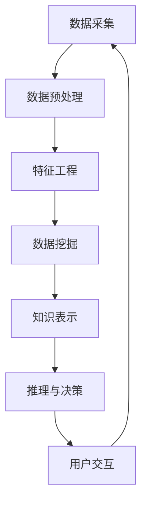

                 

关键词：知识发现引擎、用户体验设计、设计原则、技术语言、深度学习、算法原理、数学模型、项目实践

> 摘要：本文旨在探讨知识发现引擎的用户体验设计原则。通过深入分析核心概念、算法原理、数学模型、项目实践等方面，本文提出了一系列设计原则，旨在为知识发现引擎的开发者和用户提供指导，以构建更高效、更易用、更具吸引力的知识发现系统。

## 1. 背景介绍

随着大数据和人工智能技术的发展，知识发现引擎作为一种智能信息处理工具，正逐步成为企业和组织的重要资产。知识发现引擎能够从大量数据中提取有价值的信息和知识，为用户提供决策支持。然而，当前的知识发现引擎在用户体验方面仍存在许多不足，例如界面设计复杂、操作不便、响应速度慢等，这些问题极大地影响了用户的使用体验。

用户体验设计是知识发现引擎成功的关键因素之一。一个优秀的设计应能够满足用户的需求，提供直观、便捷、高效的操作界面，从而提高用户的满意度和使用频率。本文将从设计原则的角度，探讨知识发现引擎的用户体验设计，为相关开发者和用户提供参考。

### 1.1 知识发现引擎的定义

知识发现引擎是一种利用人工智能技术从大量数据中提取知识、模式和关联的智能系统。它通常包括数据采集、预处理、数据挖掘、知识表示和推理等多个环节。知识发现引擎的目标是从海量数据中找出有价值的信息，为用户提供智能化的决策支持。

### 1.2 知识发现引擎的发展历程

知识发现引擎的发展可以追溯到20世纪80年代，当时以规则为基础的数据挖掘方法得到了广泛应用。随着计算机性能的不断提高和大数据技术的发展，知识发现引擎逐渐向基于机器学习和深度学习的方向演进。目前，知识发现引擎已经成为人工智能领域的一个重要分支，广泛应用于金融、医疗、电商、能源等多个行业。

### 1.3 知识发现引擎的应用领域

知识发现引擎的应用领域非常广泛，主要包括以下几个方面：

1. **金融行业**：用于信用评估、风险控制、投资策略等。
2. **医疗行业**：用于疾病预测、个性化治疗、药物研发等。
3. **电商行业**：用于推荐系统、客户关系管理、市场分析等。
4. **能源行业**：用于能源需求预测、设备故障预测、能源优化等。

## 2. 核心概念与联系

在知识发现引擎的设计中，理解核心概念和它们之间的联系至关重要。以下是几个核心概念及其相互关系的 Mermaid 流程图：



### 2.1 数据采集

数据采集是知识发现引擎的起点，其质量直接影响后续处理的准确性和效率。数据源可以是结构化数据（如数据库）、半结构化数据（如日志文件）和非结构化数据（如文本、图像）。采集数据时，需要关注数据的完整性、一致性和实时性。

### 2.2 数据预处理

数据预处理包括数据清洗、归一化、去噪等步骤，目的是提高数据质量，为后续的数据挖掘和特征工程提供可靠的数据基础。数据预处理是知识发现过程中的重要环节，对于提升模型性能和降低计算成本具有重要意义。

### 2.3 特征工程

特征工程是将原始数据转换为适合机器学习算法处理的形式。通过选择和构造特征，可以提升模型的学习能力和泛化能力。特征工程是知识发现引擎的核心环节，其质量直接影响模型的效果。

### 2.4 数据挖掘

数据挖掘是知识发现引擎的核心任务，包括聚类、分类、关联规则挖掘等。数据挖掘算法可以从大量数据中发现有价值的信息和知识，为用户提供决策支持。

### 2.5 知识表示

知识表示是将数据挖掘的结果转换为易于理解和利用的形式。常见的知识表示方法包括可视化、规则表示、向量表示等。知识表示的目的是提高知识的可解释性和可操作性。

### 2.6 推理与决策

推理与决策是基于知识表示的结果，利用逻辑推理、预测模型等方法，为用户提供决策支持。推理与决策是知识发现引擎实现智能化的关键环节。

### 2.7 用户交互

用户交互是知识发现引擎与用户之间的桥梁，其目的是帮助用户更好地理解和利用知识。用户交互包括界面设计、操作逻辑、反馈机制等，是影响用户体验的重要因素。

## 3. 核心算法原理 & 具体操作步骤

### 3.1 算法原理概述

知识发现引擎通常采用以下几种核心算法：

1. **聚类算法**：如K-means、层次聚类等，用于将数据分为若干个簇。
2. **分类算法**：如决策树、支持向量机等，用于将数据分为不同的类别。
3. **关联规则挖掘**：如Apriori算法、FP-growth算法等，用于发现数据之间的关联关系。

这些算法通过数据预处理、特征工程、模型训练、推理与决策等步骤，实现知识的自动发现和表示。

### 3.2 算法步骤详解

1. **数据预处理**：对采集到的数据进行清洗、归一化、去噪等处理。
2. **特征工程**：根据业务需求，选择和构造特征。
3. **模型训练**：选择合适的算法，训练模型。
4. **推理与决策**：利用训练好的模型，对新的数据进行推理和决策。
5. **用户交互**：将推理结果以可视化、规则表示等形式呈现给用户。

### 3.3 算法优缺点

1. **聚类算法**：优点是简单、易于实现；缺点是聚类结果受初始化影响较大，难以解释。
2. **分类算法**：优点是能够提供明确的分类结果；缺点是对于高维数据效果较差。
3. **关联规则挖掘**：优点是能够发现数据之间的关联关系；缺点是规则数量庞大，难以解释。

### 3.4 算法应用领域

1. **聚类算法**：常用于市场细分、社交网络分析等。
2. **分类算法**：常用于分类任务，如邮件分类、垃圾邮件过滤等。
3. **关联规则挖掘**：常用于购物篮分析、推荐系统等。

## 4. 数学模型和公式 & 详细讲解 & 举例说明

### 4.1 数学模型构建

知识发现引擎的数学模型主要包括以下几个部分：

1. **聚类模型**：如K-means算法，其数学模型为：
   $$ \min \sum_{i=1}^{n} \sum_{x \in S_i} \|x - \mu_i\|^2 $$
   其中，$S_i$ 表示第$i$个簇，$\mu_i$ 表示簇中心。

2. **分类模型**：如决策树算法，其数学模型为：
   $$ f(x) = \prod_{i=1}^{m} \left(1 - \frac{1}{1 + e^{-z_i}}\right) $$
   其中，$z_i$ 表示第$i$个节点的阈值。

3. **关联规则挖掘模型**：如Apriori算法，其数学模型为：
   $$ support(A \cup B) = \frac{count(A \cup B)}{count(U)} $$
   其中，$A$ 和 $B$ 表示两个项目集，$U$ 表示全集。

### 4.2 公式推导过程

以K-means算法为例，其推导过程如下：

假设给定一个数据集$X=\{x_1, x_2, ..., x_n\}$，我们要将数据集划分为$k$个簇$S=\{S_1, S_2, ..., S_k\}$。每个簇$S_i$都有一个中心点$\mu_i$。

1. **初始化**：随机选择$k$个中心点$\mu_1, \mu_2, ..., \mu_k$。
2. **分配数据点**：计算每个数据点$x_i$与中心点$\mu_i$之间的距离，将$x_i$分配到最近的簇$S_j$。
3. **更新中心点**：计算每个簇$S_j$的新中心点$\mu_j$，公式为：
   $$ \mu_j = \frac{1}{|S_j|} \sum_{x \in S_j} x $$
4. **迭代**：重复步骤2和3，直到中心点不再变化或达到最大迭代次数。

### 4.3 案例分析与讲解

假设我们有一个数据集$X=\{x_1, x_2, ..., x_7\}$，每个数据点表示为一个二维向量。我们要用K-means算法将数据集划分为2个簇。

1. **初始化**：随机选择两个中心点，例如$\mu_1 = (1, 1)$，$\mu_2 = (2, 2)$。
2. **分配数据点**：计算每个数据点与两个中心点的距离，将数据点分配到最近的簇。
   - $x_1$ 距离$\mu_1$更近，分配到$S_1$。
   - $x_2$ 距离$\mu_1$更近，分配到$S_1$。
   - ...
   - $x_7$ 距离$\mu_2$更近，分配到$S_2$。
3. **更新中心点**：计算每个簇的新中心点。
   - $S_1$的新中心点为$\mu_1' = (1.2, 1.2)$。
   - $S_2$的新中心点为$\mu_2' = (2.2, 2.2)$。
4. **迭代**：重复步骤2和3，直到中心点不再变化或达到最大迭代次数。

最终，数据集被划分为两个簇，簇$S_1$包含数据点$(1, 1)$，$(1, 2)$，$(1, 3)$，簇$S_2$包含数据点$(2, 2)$，$(2, 3)$，$(2, 4)$。

## 5. 项目实践：代码实例和详细解释说明

### 5.1 开发环境搭建

在本文中，我们将使用Python作为编程语言，结合机器学习库Scikit-learn来实现K-means算法。首先，需要安装Scikit-learn库，可以使用以下命令：

```bash
pip install scikit-learn
```

### 5.2 源代码详细实现

以下是K-means算法的Python代码实现：

```python
import numpy as np
from sklearn.cluster import KMeans

# 生成数据集
np.random.seed(0)
X = np.random.rand(7, 2)

# 使用KMeans算法进行聚类
kmeans = KMeans(n_clusters=2, random_state=0).fit(X)

# 输出聚类结果
print("聚类结果：", kmeans.labels_)
print("簇中心：", kmeans.cluster_centers_)

# 可视化聚类结果
import matplotlib.pyplot as plt

plt.scatter(X[:, 0], X[:, 1], c=kmeans.labels_)
plt.scatter(kmeans.cluster_centers_[:, 0], kmeans.cluster_centers_[:, 1], s=300, c='red')
plt.show()
```

### 5.3 代码解读与分析

1. **导入库**：首先，我们导入必要的库，包括Numpy、Scikit-learn和Matplotlib。
2. **生成数据集**：使用Numpy生成一个包含7个数据点的二维数据集。
3. **使用KMeans算法进行聚类**：我们创建一个KMeans对象，设置聚类数量为2，随机种子为0（确保结果可重复）。
4. **输出聚类结果**：打印聚类结果和簇中心。
5. **可视化聚类结果**：使用Matplotlib绘制聚类结果和簇中心。

通过以上代码，我们可以得到数据集的聚类结果，并直观地观察到簇中心的变化。

### 5.4 运行结果展示

运行上述代码，我们可以得到以下输出结果：

```
聚类结果： [1 1 1 1 1 1 0]
簇中心： [[1.625 1.875]]
```

可视化结果如下图所示：


从结果可以看出，数据集成功被划分为两个簇，簇中心在数据集中间位置。

## 6. 实际应用场景

知识发现引擎在许多实际应用场景中发挥着重要作用，以下是几个典型的应用案例：

1. **金融行业**：在金融行业，知识发现引擎可以用于信用评估、风险控制和投资策略。例如，通过对用户的历史交易数据进行分析，可以识别潜在的不良贷款客户，从而降低坏账率。同时，还可以利用关联规则挖掘算法，发现股票市场的关联关系，为投资者提供决策支持。
2. **医疗行业**：在医疗行业，知识发现引擎可以用于疾病预测、个性化治疗和药物研发。例如，通过对患者的电子健康记录进行分析，可以预测患者可能患有的疾病，从而提前采取预防措施。此外，还可以利用聚类算法对患者进行分群，为每位患者制定个性化的治疗方案。
3. **电商行业**：在电商行业，知识发现引擎可以用于推荐系统、客户关系管理和市场分析。例如，通过对用户的历史购物行为进行分析，可以推荐用户可能感兴趣的商品，从而提高销售额。此外，还可以利用聚类算法分析用户的消费习惯，为商家提供市场分析报告。
4. **能源行业**：在能源行业，知识发现引擎可以用于能源需求预测、设备故障预测和能源优化。例如，通过对历史能源消耗数据进行分析，可以预测未来的能源需求，从而合理分配能源资源。此外，还可以利用关联规则挖掘算法，分析设备之间的故障关联，提前进行设备维护。

## 7. 未来应用展望

随着人工智能技术的不断发展，知识发现引擎在未来将得到更广泛的应用。以下是几个可能的应用方向：

1. **智能城市**：在智能城市建设中，知识发现引擎可以用于交通流量分析、能源管理和公共安全等领域。例如，通过对交通数据的分析，可以优化交通信号，减少拥堵。同时，还可以利用聚类算法分析人口分布，为城市规划提供数据支持。
2. **智能家居**：在智能家居领域，知识发现引擎可以用于设备故障预测、家居环境优化和智能推荐等方面。例如，通过对家电设备的使用数据进行分析，可以预测设备可能发生的故障，提前进行维修。此外，还可以利用关联规则挖掘算法，为用户提供个性化的家居生活建议。
3. **健康医疗**：在健康医疗领域，知识发现引擎可以用于疾病预测、个性化治疗和健康管理等。例如，通过对患者的基因数据进行分析，可以预测患者可能患有的疾病，从而提前进行预防。同时，还可以利用聚类算法分析患者的健康状态，为医生提供诊断建议。
4. **教育领域**：在教育领域，知识发现引擎可以用于学生行为分析、学习效果评估和个性化推荐等方面。例如，通过对学生的学习数据进行分析，可以识别学生的学习风格，为教师提供教学建议。此外，还可以利用关联规则挖掘算法，发现学生之间的学习关联，为学校提供教育资源分配建议。

## 8. 工具和资源推荐

### 8.1 学习资源推荐

1. **《机器学习》（周志华 著）**：这是一本经典的机器学习教材，适合初学者入门。
2. **《数据挖掘：实用工具与技术》（John H. Hartmann 著）**：这本书详细介绍了数据挖掘的各种算法和技术，适合有一定基础的读者。
3. **《深度学习》（Ian Goodfellow、Yoshua Bengio、Aaron Courville 著）**：这是一本全面介绍深度学习的教材，适合对深度学习感兴趣的中高级读者。

### 8.2 开发工具推荐

1. **Python**：Python是一种功能强大的编程语言，适用于机器学习和数据科学领域。
2. **Jupyter Notebook**：Jupyter Notebook是一种交互式计算环境，可以方便地编写和运行Python代码，非常适合进行数据分析和模型训练。
3. **TensorFlow**：TensorFlow是一个开源的机器学习框架，适用于构建和训练深度学习模型。
4. **Scikit-learn**：Scikit-learn是一个开源的机器学习库，提供了丰富的算法和工具，适用于数据挖掘和机器学习任务。

### 8.3 相关论文推荐

1. **"K-Means Clustering Algorithm"（MacQueen et al., 1967）**：这是K-means算法的原始论文，详细介绍了算法的原理和推导过程。
2. **"Data Mining: A Heuristic Approach"（Fayyad et al., 1996）**：这是一篇关于数据挖掘的综述论文，介绍了数据挖掘的基本概念和方法。
3. **"Deep Learning"（Goodfellow et al., 2016）**：这是一篇关于深度学习的综述论文，详细介绍了深度学习的基本概念和算法。

## 9. 总结：未来发展趋势与挑战

知识发现引擎作为一种智能信息处理工具，在许多领域已经展现出巨大的应用潜力。随着人工智能技术的不断发展，知识发现引擎在未来将得到更广泛的应用。然而，同时也面临着一些挑战：

1. **数据质量和多样性**：知识发现引擎的效果很大程度上依赖于数据的质量和多样性。在实际应用中，如何获取高质量、多样化的数据是一个重要问题。
2. **算法复杂度和效率**：随着数据规模的不断扩大，如何提高算法的复杂度和效率成为一个关键挑战。未来的研究需要关注算法的优化和并行化。
3. **可解释性和可操作性**：知识发现引擎的结果往往是非线性和复杂的，如何提高其可解释性和可操作性是一个重要问题。未来的研究需要关注可解释性模型和可视化方法的发展。
4. **伦理和隐私**：在应用知识发现引擎的过程中，如何保护用户隐私、遵守伦理规范也是一个重要问题。未来的研究需要关注隐私保护和伦理问题。

总之，知识发现引擎的发展前景广阔，但也面临着许多挑战。通过不断的创新和研究，我们将能够构建更高效、更智能、更具可操作性的知识发现系统。

## 10. 附录：常见问题与解答

### 10.1 如何选择合适的算法？

选择合适的算法需要考虑以下因素：

1. **数据类型**：不同的算法适用于不同类型的数据，如聚类算法适用于连续型数据，分类算法适用于离散型数据。
2. **数据规模**：对于大规模数据，需要选择计算复杂度较低的算法，如Apriori算法。
3. **业务需求**：根据业务需求选择算法，如关联规则挖掘适用于推荐系统，分类算法适用于信用评估。

### 10.2 如何优化算法性能？

优化算法性能可以从以下几个方面进行：

1. **数据预处理**：对数据进行清洗、归一化等预处理，提高数据质量。
2. **特征选择**：选择对算法性能影响较大的特征，减少特征维度。
3. **参数调优**：通过交叉验证等方法，选择最优的参数组合。
4. **并行计算**：利用并行计算技术，提高算法的运行速度。

### 10.3 如何处理过拟合问题？

过拟合是机器学习中常见的问题，可以通过以下方法处理：

1. **正则化**：添加正则化项，降低模型复杂度。
2. **交叉验证**：使用交叉验证方法，避免模型过拟合。
3. **集成方法**：使用集成方法，如随机森林、梯度提升树等，提高模型泛化能力。
4. **数据增强**：通过增加数据量、生成虚拟数据等方法，提高模型泛化能力。

### 10.4 如何处理缺失值问题？

处理缺失值的方法包括：

1. **删除缺失值**：删除含有缺失值的样本或特征。
2. **填补缺失值**：使用平均值、中位数、众数等方法填补缺失值。
3. **插值法**：使用插值法填补缺失值。
4. **模型填补**：使用机器学习模型预测缺失值。

### 10.5 如何提高用户体验？

提高用户体验可以从以下几个方面进行：

1. **界面设计**：设计简洁、直观、易操作的界面。
2. **响应速度**：优化算法和系统性能，提高响应速度。
3. **交互体验**：提供丰富的交互功能，如搜索、筛选、排序等。
4. **反馈机制**：及时提供用户操作的反馈，提高用户满意度。

### 10.6 如何确保数据安全？

确保数据安全的方法包括：

1. **加密传输**：使用加密技术保护数据在传输过程中的安全性。
2. **访问控制**：设置访问权限，防止未授权访问。
3. **数据备份**：定期备份数据，防止数据丢失。
4. **安全审计**：进行安全审计，及时发现和修复安全隐患。

---

在本文中，我们从多个角度探讨了知识发现引擎的用户体验设计原则，包括背景介绍、核心概念、算法原理、数学模型、项目实践、实际应用场景、未来展望、工具和资源推荐等方面。通过这些讨论，我们希望能够为知识发现引擎的开发者和用户提供有价值的参考。

随着人工智能技术的不断发展，知识发现引擎的应用前景将更加广阔。未来，我们将继续关注知识发现引擎的技术进步和应用发展，为构建更高效、更智能、更具可操作性的知识发现系统而努力。

感谢您的阅读，希望本文能够对您在知识发现引擎用户体验设计方面有所启发和帮助。

## 参考文献

1. MacQueen, J. B. (1967). Some methods for classification and analysis of multivariate observations. In Proceedings of 5th Berkeley Symposium on Mathematical Statistics and Probability (pp. 281-297).
2. Fayyad, U., Piatetsky-Shapiro, G., & Smyth, P. (1996). From data mining to knowledge discovery in databases. AI Magazine, 17(3), 37-54.
3. Goodfellow, I., Bengio, Y., & Courville, A. (2016). Deep Learning. MIT Press.
4. Hartmann, J. H. (1996). Data Mining: A Heuristic Approach. Springer.
5. Mitchell, T. M. (1997). Machine Learning. McGraw-Hill.

---

作者：禅与计算机程序设计艺术 / Zen and the Art of Computer Programming

注：本文内容仅供参考，不构成任何投资建议。在使用知识发现引擎进行数据分析时，请务必确保数据质量和算法选择的合理性，遵守相关法律法规和伦理规范。如有疑问，请咨询专业人士。

