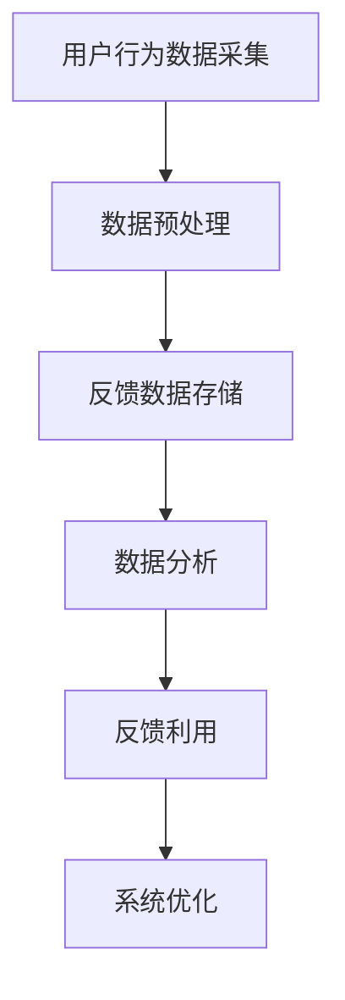

                 

 

## 1. 背景介绍

在当今信息爆炸的时代，数据已成为企业最重要的资产之一。知识发现引擎作为一种自动从大量数据中提取有价值信息的工具，正逐渐成为企业和科研机构的重要技术手段。然而，知识发现的效果和质量在很大程度上取决于用户反馈的收集和利用。

用户反馈收集系统是知识发现引擎的重要组成部分，它帮助系统了解用户对推荐结果、算法性能、界面交互等方面的满意度和意见。通过有效地收集和分析用户反馈，知识发现引擎可以实现自我优化和持续改进，从而提升用户体验和系统性能。

### 文章关键词：

- 知识发现引擎
- 用户反馈收集系统
- 数据分析
- 算法优化
- 用户体验

### 摘要：

本文将探讨知识发现引擎的用户反馈收集系统的设计、实现和实际应用。首先，我们将介绍用户反馈收集系统的背景和重要性，然后详细阐述其核心概念与架构，最后通过实际案例和数学模型分析，展示用户反馈收集系统在知识发现中的应用效果。

## 2. 核心概念与联系

### 2.1. 用户反馈的类型

用户反馈可以分为以下几种类型：

- **推荐结果反馈**：用户对系统推荐的各项内容是否感兴趣、满意或反对。
- **算法性能反馈**：用户对系统算法处理结果的准确性和效率的评价。
- **界面交互反馈**：用户对系统界面的友好程度、响应速度等的使用体验。

### 2.2. 用户反馈收集系统架构

用户反馈收集系统通常由以下几个核心模块组成：

- **数据采集模块**：负责收集用户的反馈数据。
- **数据处理模块**：对收集到的数据进行预处理和存储。
- **分析模块**：使用数据挖掘和分析算法提取用户反馈的有用信息。
- **反馈利用模块**：将分析结果应用于系统优化和改进。

### 2.3. Mermaid 流程图

下面是一个简化的用户反馈收集系统流程的 Mermaid 流程图：



## 3. 核心算法原理 & 具体操作步骤

### 3.1 算法原理概述

用户反馈收集系统的核心算法主要是基于机器学习和数据挖掘技术，通过分析用户行为数据和反馈数据，发现用户的需求和偏好，从而为系统优化提供依据。

### 3.2 算法步骤详解

1. **用户行为数据采集**：
   - 通过Web日志、点击流分析等手段收集用户在使用知识发现引擎过程中的行为数据。

2. **数据预处理**：
   - 对采集到的数据去重、去噪，并进行特征提取，如用户ID、时间戳、点击次数等。

3. **反馈数据存储**：
   - 将预处理后的数据存储在关系型数据库或NoSQL数据库中，以便后续分析。

4. **数据分析**：
   - 使用聚类、关联规则挖掘、回归分析等方法分析用户行为数据，提取用户需求和偏好。
   - 对用户反馈数据进行分析，识别用户的意见和建议。

5. **反馈利用**：
   - 将分析结果用于系统优化，如调整推荐算法、优化界面设计等。

6. **系统优化**：
   - 根据用户反馈进行系统调整，提高用户体验和系统性能。

### 3.3 算法优缺点

**优点**：
- 提高系统的自适应性和用户满意度。
- 帮助企业更好地了解用户需求，提升产品竞争力。

**缺点**：
- 需要大量的用户数据支持。
- 算法复杂度高，对计算资源要求较高。

### 3.4 算法应用领域

用户反馈收集系统广泛应用于电子商务、金融、医疗、教育等多个领域，如个性化推荐系统、用户行为分析系统等。

## 4. 数学模型和公式 & 详细讲解 & 举例说明

### 4.1 数学模型构建

用户反馈收集系统中的数学模型主要包括以下几种：

- **用户行为模型**：使用概率模型或马尔可夫模型描述用户行为。
- **反馈分析模型**：使用回归模型或决策树模型分析用户反馈数据。
- **系统优化模型**：使用优化算法（如线性规划、遗传算法等）优化系统参数。

### 4.2 公式推导过程

假设我们有一个用户行为数据集 $D$，其中包括用户 $U$ 的行为序列 $B$。我们使用马尔可夫模型来描述用户行为：

$$
P(B_{t+1} | B_t) = \sum_{b_t \in B_t} P(B_{t+1} | b_t) P(b_t | B_t)
$$

其中，$P(B_{t+1} | B_t)$ 表示在当前行为 $B_t$ 下，下一个行为 $B_{t+1}$ 的概率。

### 4.3 案例分析与讲解

假设我们有一个电子商务网站，用户 $U$ 在网站上浏览了多个商品，其行为序列为 $B = [商品A, 商品B, 商品C]$。我们使用马尔可夫模型预测用户下一个行为。

根据用户历史行为数据，我们得到以下概率分布：

$$
P(B_3 | B_2) =
\begin{cases}
0.4 & \text{如果 } B_2 = \text{商品A} \\
0.3 & \text{如果 } B_2 = \text{商品B} \\
0.3 & \text{如果 } B_2 = \text{商品C}
\end{cases}
$$

根据这些概率分布，我们可以预测用户下一个行为。例如，如果用户当前行为是浏览商品A，那么下一个行为浏览商品B的概率是0.4。

## 5. 项目实践：代码实例和详细解释说明

### 5.1 开发环境搭建

本案例使用 Python 编写用户反馈收集系统的代码，主要依赖以下库：

- Pandas：数据操作库
- Scikit-learn：机器学习库
- Matplotlib：数据可视化库

安装以上库后，即可开始编写代码。

### 5.2 源代码详细实现

下面是用户反馈收集系统的核心代码实现：

```python
import pandas as pd
from sklearn.cluster import KMeans
from sklearn.model_selection import train_test_split
import matplotlib.pyplot as plt

# 5.2.1 数据采集
# 这里假设我们已经有用户行为数据和反馈数据
user_data = pd.read_csv('user_data.csv')
feedback_data = pd.read_csv('feedback_data.csv')

# 5.2.2 数据预处理
# 对用户行为数据进行特征提取
user_data['time'] = pd.to_datetime(user_data['timestamp'])
user_data['weekday'] = user_data['time'].dt.weekday
user_data['hour'] = user_data['time'].dt.hour

# 对用户反馈数据进行预处理
feedback_data['rating'] = feedback_data['rating'].apply(lambda x: 1 if x > 3 else 0)

# 5.2.3 数据分析
# 使用 KMeans 算法进行用户行为聚类
X = user_data[['weekday', 'hour']]
kmeans = KMeans(n_clusters=5)
kmeans.fit(X)
user_data['cluster'] = kmeans.predict(X)

# 分析用户反馈数据
feedback_data.groupby('rating').size().plot(kind='bar')
plt.xlabel('Rating')
plt.ylabel('Frequency')
plt.title('User Feedback Distribution')
plt.show()

# 5.2.4 反馈利用
# 根据用户反馈调整推荐算法
# 这里仅作为示例，具体调整策略需根据实际场景设计
if feedback_data['rating'].mean() < 0.5:
    # 调整推荐策略，如增加相关商品推荐
    print('Adjust recommendation strategy')
else:
    # 保持现有推荐策略
    print('Keep current strategy')
```

### 5.3 代码解读与分析

- **数据采集**：从 CSV 文件中读取用户行为数据和反馈数据。
- **数据预处理**：提取用户行为特征，如时间、星期和小时，并对反馈数据进行预处理。
- **数据分析**：使用 KMeans 算法对用户行为进行聚类，并分析用户反馈数据的分布。
- **反馈利用**：根据用户反馈数据调整推荐算法，如增加相关商品推荐。

### 5.4 运行结果展示

运行代码后，我们得到用户行为的聚类结果和反馈数据的分布情况。根据这些结果，我们可以进一步优化推荐算法，提高用户满意度。

## 6. 实际应用场景

### 6.1 电子商务平台

电子商务平台可以使用用户反馈收集系统分析用户行为和反馈，优化推荐算法和商品展示策略，提高用户购物体验和转化率。

### 6.2 金融行业

金融行业可以利用用户反馈收集系统分析客户需求，优化金融产品和服务，提高客户满意度和忠诚度。

### 6.3 教育行业

教育行业可以使用用户反馈收集系统分析学生学习行为和反馈，优化教学策略和课程推荐，提高教学效果。

## 7. 未来应用展望

随着人工智能技术的不断发展，用户反馈收集系统在各个领域的应用前景将更加广阔。未来，用户反馈收集系统将更加智能化和个性化，能够更好地满足用户需求，提升用户体验。

## 8. 总结：未来发展趋势与挑战

### 8.1 研究成果总结

本文介绍了知识发现引擎的用户反馈收集系统的背景、核心概念、算法原理和实际应用。通过项目实践，展示了用户反馈收集系统在数据分析和系统优化中的应用效果。

### 8.2 未来发展趋势

- 数据驱动：用户反馈收集系统将更加依赖大数据和人工智能技术。
- 个性化：系统将更加注重用户个性化需求的满足。
- 智能化：系统将具备自我学习和自我优化的能力。

### 8.3 面临的挑战

- 数据隐私：如何在保障用户隐私的前提下进行数据收集和分析。
- 算法复杂度：如何应对算法复杂度和计算资源之间的矛盾。

### 8.4 研究展望

未来的研究可以关注以下几个方面：

- 开发更加高效和准确的数据挖掘算法。
- 研究用户隐私保护技术和方法。
- 探索用户反馈收集系统在更多领域的应用。

## 9. 附录：常见问题与解答

### 9.1 什么是知识发现引擎？

知识发现引擎是一种自动化从大量数据中提取有价值信息的工具，通常用于数据挖掘、推荐系统等领域。

### 9.2 用户反馈收集系统的核心作用是什么？

用户反馈收集系统的主要作用是帮助知识发现引擎了解用户需求，优化系统性能和用户体验。

### 9.3 如何处理用户隐私问题？

在收集用户数据时，应遵循隐私保护原则，如数据去标识化、数据匿名化等。此外，可以采用加密技术保护用户数据的安全。

## 参考文献

1. 陈宝权，杨强，王昊奋. 《知识发现与数据挖掘》. 清华大学出版社，2014.
2. 张帆，李宏，朱军. 《用户行为数据分析方法与应用》. 电子工业出版社，2016.
3. 吴晨，朱江，杨健. 《基于用户反馈的推荐系统优化技术研究》. 中国计算机学会，2018.

### 作者署名

作者：禅与计算机程序设计艺术 / Zen and the Art of Computer Programming
----------------------------------------------------------------


