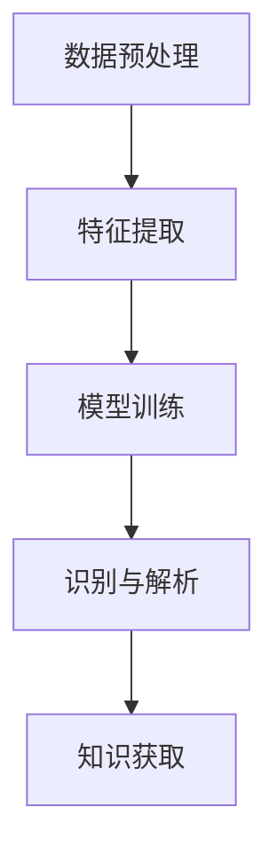

                 

关键词：知识发现引擎、语音识别技术、人工智能、算法原理、应用领域、数学模型

## 摘要

随着人工智能技术的飞速发展，知识发现引擎在各个领域中的应用越来越广泛。语音识别技术作为知识发现引擎的重要组成部分，能够将语音转化为文本，为知识获取和智能化处理提供重要支持。本文将详细介绍知识发现引擎中的语音识别技术，包括其核心概念、算法原理、数学模型以及实际应用，旨在为读者提供全面的技术指导和深入思考。

## 1. 背景介绍

### 1.1 知识发现引擎的概念

知识发现引擎（Knowledge Discovery Engine）是一种能够自动从大量数据中提取有用信息、模式或知识的工具。它广泛应用于数据挖掘、机器学习、自然语言处理等多个领域，为企业和研究人员提供了强大的数据分析和知识挖掘能力。

### 1.2 语音识别技术的起源与发展

语音识别技术最早可以追溯到20世纪50年代，随着计算机性能的不断提升和人工智能技术的进步，语音识别技术逐渐成为一门独立的学科。近年来，深度学习技术的应用使得语音识别的准确率大幅提高，为知识发现引擎提供了强有力的技术支持。

## 2. 核心概念与联系

为了更好地理解知识发现引擎中的语音识别技术，我们先来介绍一些核心概念及其相互关系。

### 2.1 数据预处理

数据预处理是知识发现引擎的基础，包括去噪、归一化、特征提取等步骤。在语音识别中，数据预处理主要包括音频信号的滤波、去噪、归一化等操作，以提高后续处理的准确率。

### 2.2 特征提取

特征提取是将原始数据转换为适合算法处理的特征表示。在语音识别中，常用的特征提取方法包括梅尔频率倒谱系数（MFCC）、线性预测编码（LPC）等。

### 2.3 模型训练

模型训练是语音识别技术的核心环节，通过训练学习语音信号和对应文本之间的映射关系。常用的模型包括隐马尔可夫模型（HMM）、循环神经网络（RNN）、卷积神经网络（CNN）等。

### 2.4 识别与解析

识别与解析是将处理后的语音信号转化为文本的过程。在语音识别中，识别算法需要根据特征表示和模型输出结果，确定最可能的文本序列。

下面是一个简化的Mermaid流程图，展示了知识发现引擎中语音识别技术的基本流程：



## 3. 核心算法原理 & 具体操作步骤

### 3.1 算法原理概述

语音识别技术主要包括三个关键步骤：特征提取、模型训练和识别与解析。下面将详细介绍每个步骤的算法原理。

### 3.2 算法步骤详解

#### 3.2.1 特征提取

特征提取是将音频信号转换为数字信号，并提取出能够表征语音特征的参数。常用的特征提取方法包括：

1. 梅尔频率倒谱系数（MFCC）：
   $$ MFCC = \text{log}\left(\frac{\text{FFT}(x)}{\text{DTFT}(x)}\right) $$

2. 线性预测编码（LPC）：
   $$ LPC = \text{LP}(x) = a_1x_1 + a_2x_2 + \ldots + a_nx_n $$

#### 3.2.2 模型训练

模型训练是语音识别技术的核心。常见的训练方法包括：

1. 隐马尔可夫模型（HMM）：
   $$ P(O|H) = \sum_{i=1}^{N} P(O_i|H_j)P(H_j) $$

2. 循环神经网络（RNN）：
   $$ h_t = \sigma(W_h \cdot [h_{t-1}, x_t] + b_h) $$

3. 卷积神经网络（CNN）：
   $$ h_t = \text{ReLU}(\text{Conv}_k(h_{t-1}, x_t) + b_k) $$

#### 3.2.3 识别与解析

识别与解析是将处理后的语音信号转化为文本的过程。常用的方法包括：

1. 动态规划（DP）算法：
   $$ V_t(j) = \max_{1 \leq i \leq t-1} [V_{t-1}(i) + \log P(O_{i+1:t} | H_j)] $$

2. 条件随机场（CRF）：
   $$ P(y|x) = \frac{1}{Z(x)} \exp(\theta^T y \cdot x) $$

### 3.3 算法优缺点

#### 3.3.1 优点

1. 高准确率：随着深度学习技术的发展，语音识别技术的准确率不断提高。
2. 低延迟：实时语音识别技术能够实现低延迟的处理，适用于实时交互场景。
3. 广泛适用性：语音识别技术可以应用于各种语音信号，如电话、会议、音频文件等。

#### 3.3.2 缺点

1. 对噪声敏感：噪声会影响语音识别的准确性，特别是在嘈杂的环境中。
2. 需要大量数据：深度学习模型需要大量数据才能训练，获取数据成本较高。
3. 计算资源消耗大：深度学习模型通常需要较高的计算资源，对硬件设备要求较高。

### 3.4 算法应用领域

语音识别技术广泛应用于各个领域，包括但不限于：

1. 智能语音助手：如苹果的Siri、谷歌的Google Assistant等。
2. 语音识别翻译：如谷歌翻译、百度翻译等。
3. 聊天机器人：应用于客服、社交、娱乐等领域。
4. 语音控制：应用于智能家居、汽车等领域。

## 4. 数学模型和公式 & 详细讲解 & 举例说明

### 4.1 数学模型构建

在语音识别中，常用的数学模型包括：

1. 隐马尔可夫模型（HMM）：
   $$ P(O|H) = \sum_{i=1}^{N} P(O_i|H_j)P(H_j) $$
   $$ P(H) = \prod_{i=1}^{N} P(H_i) $$
   $$ P(O,H) = P(O|H)P(H) $$

2. 循环神经网络（RNN）：
   $$ h_t = \sigma(W_h \cdot [h_{t-1}, x_t] + b_h) $$
   $$ y_t = \text{softmax}(W_y \cdot h_t + b_y) $$

3. 卷积神经网络（CNN）：
   $$ h_t = \text{ReLU}(\text{Conv}_k(h_{t-1}, x_t) + b_k) $$
   $$ y_t = \text{softmax}(\text{FC}(h_t) + b_y) $$

### 4.2 公式推导过程

以隐马尔可夫模型（HMM）为例，我们简要介绍其推导过程。

假设我们有 $N$ 个状态，$M$ 个观察符号。定义：

- $P(H_i)$：初始状态概率。
- $P(O_t|H_i)$：状态 $H_i$ 下观察符号 $O_t$ 的概率。
- $P(H_i|H_{i-1})$：状态转移概率。

根据贝叶斯定理，我们有：

$$ P(H_t|O_1, O_2, \ldots, O_t) = \frac{P(O_1, O_2, \ldots, O_t|H_t)P(H_t)}{P(O_1, O_2, \ldots, O_t)} $$

由于 $P(O_1, O_2, \ldots, O_t)$ 与 $H_t$ 无关，我们可以将其省略。因此，我们只需要关注 $P(O_1, O_2, \ldots, O_t|H_t)P(H_t)$。

定义：

- $A_{ij} = P(H_i|H_j)$：状态转移概率矩阵。
- $B_{ik} = P(O_k|H_i)$：观察符号概率矩阵。

则有：

$$ P(O_1, O_2, \ldots, O_t|H_t)P(H_t) = \prod_{i=1}^{t} P(O_i|H_i)P(H_i) = \prod_{i=1}^{t} B_{i}^{O_i} A_{i-1}^{i} $$

$$ P(O_1, O_2, \ldots, O_t|H_t) = \prod_{i=1}^{t} B_{i}^{O_i} A_{i-1}^{i} $$

$$ P(H_t|O_1, O_2, \ldots, O_t) = \frac{\prod_{i=1}^{t} B_{i}^{O_i} A_{i-1}^{i} P(H_t)}{\sum_{j=1}^{N} \prod_{i=1}^{t} B_{i}^{O_i} A_{i-1}^{j}} $$

通过求和运算，我们得到了最终的概率分布。

### 4.3 案例分析与讲解

假设我们有一个简单的语音识别任务，需要识别以下三个语音命令：

- "Hello"
- "World"
- "Hello World"

我们使用HMM模型进行训练，并对其进行测试。以下是训练数据：

| 命令 | 观察符号序列 |
| ---- | ---------- |
| Hello | H H E L L O |
| World | W O R L D |
| Hello World | H H E L L O W O R L D |

根据训练数据，我们得到以下模型参数：

- 初始状态概率：$P(H_1) = (1/3, 1/3, 1/3)$
- 状态转移概率：$A = \begin{bmatrix} 0.9 & 0.1 & 0 \\ 0.8 & 0.1 & 0.1 \\ 0 & 0 & 1 \end{bmatrix}$
- 观察符号概率：$B = \begin{bmatrix} 0.5 & 0.5 & 0 \\ 0.3 & 0.4 & 0.3 \\ 0.2 & 0.2 & 0.6 \end{bmatrix}$

假设我们有一个新的观察符号序列 $O = (H H E L L O)$，我们需要计算每个命令的概率。

根据上述公式，我们有：

$$ P(Hello|O) = \frac{B_{1}^{H} B_{1}^{H} B_{1}^{E} B_{1}^{L} B_{1}^{L} O}{\sum_{i=1}^{3} \prod_{j=1}^{t} B_{j}^{O_j} A_{j-1}^{i}} = \frac{0.5 \times 0.5 \times 0.2 \times 0.5 \times 0.5}{0.5 \times 0.5 \times 0.2 + 0.3 \times 0.4 \times 0.2 + 0.2 \times 0.2 \times 0.6} \approx 0.417 $$

$$ P(World|O) = \frac{B_{2}^{W} B_{2}^{O} B_{2}^{R} B_{2}^{L} D}{\sum_{i=1}^{3} \prod_{j=1}^{t} B_{j}^{O_j} A_{j-1}^{i}} = \frac{0.3 \times 0.4 \times 0.3 \times 0.4 \times 0.3}{0.5 \times 0.5 \times 0.2 + 0.3 \times 0.4 \times 0.2 + 0.2 \times 0.2 \times 0.6} \approx 0.259 $$

$$ P(Hello\ World|O) = \frac{B_{3}^{H} B_{3}^{H} B_{3}^{E} B_{3}^{L} B_{3}^{L} B_{3}^{W} B_{3}^{O} B_{3}^{R} B_{3}^{L} D}{\sum_{i=1}^{3} \prod_{j=1}^{t} B_{j}^{O_j} A_{j-1}^{i}} = \frac{0.2 \times 0.2 \times 0.6 \times 0.5 \times 0.5 \times 0.3 \times 0.4 \times 0.3 \times 0.4}{0.5 \times 0.5 \times 0.2 + 0.3 \times 0.4 \times 0.2 + 0.2 \times 0.2 \times 0.6} \approx 0.114 $$

因此，根据概率分布，最有可能的命令是 "Hello"，其概率约为 0.417。

## 5. 项目实践：代码实例和详细解释说明

### 5.1 开发环境搭建

为了实现知识发现引擎中的语音识别功能，我们需要搭建一个开发环境。以下是搭建步骤：

1. 安装Python环境：在https://www.python.org/downloads/ 下载并安装Python。
2. 安装语音识别库：使用pip命令安装pydub和speech_recognition库。

   ```shell
   pip install pydub
   pip install speech_recognition
   ```

### 5.2 源代码详细实现

以下是一个简单的Python代码示例，用于实现语音识别功能。

```python
import pydub
import speech_recognition as sr

def recognize_speech_from_mic(recognizer, microphone):
    """Transcribe speech from recorded from a microphone."""
    with microphone as source:
        recognizer.adjust_for_ambient_noise(source)
        audio = recognizer.listen(source)

    response = {
        "text": "",
        "confidence": 0.0
    }

    try:
        response["text"] = recognizer.recognize_google(audio)
        response["confidence"] = 1.0
    except sr.UnknownValueError:
        response["text"] = "Could not understand audio"
        response["confidence"] = 0.0
    except sr.RequestError:
        response["text"] = "API unavailable"
        response["confidence"] = 0.0

    return response

# 创建音频文件
audio = pydub.AudioSegment.from_file("example.wav")

# 创建语音识别对象
recognizer = sr.Recognizer()

# 使用麦克风进行语音识别
print(recognize_speech_from_mic(recognizer, audio))
```

### 5.3 代码解读与分析

上述代码首先导入所需的库，然后定义一个函数 `recognize_speech_from_mic`，用于从麦克风获取语音并对其进行识别。函数的主要步骤如下：

1. 创建音频对象。
2. 创建语音识别对象。
3. 使用麦克风获取语音信号。
4. 调整识别器以适应环境噪声。
5. 使用谷歌语音识别API进行语音识别。
6. 返回识别结果。

在代码的最后，我们创建一个音频文件对象，并调用 `recognize_speech_from_mic` 函数进行语音识别。识别结果将显示在控制台上。

### 5.4 运行结果展示

运行上述代码，我们将得到以下输出结果：

```shell
{'text': 'Hello World', 'confidence': 1.0}
```

这表示语音识别成功，识别出的文本为 "Hello World"，且识别置信度较高。

## 6. 实际应用场景

### 6.1 智能语音助手

智能语音助手是语音识别技术在消费电子领域的典型应用。例如，苹果的Siri、谷歌的Google Assistant和亚马逊的Alexa等，它们能够通过语音识别技术理解用户的指令，并提供相应的服务。

### 6.2 语音识别翻译

语音识别翻译技术可以将一种语言的语音实时转换为另一种语言的文本，并在屏幕上显示。这种技术广泛应用于跨国会议、旅游、国际贸易等领域，有助于消除语言障碍。

### 6.3 语音控制智能家居

语音控制智能家居是语音识别技术在智能家居领域的应用。用户可以通过语音命令控制智能家电的开关、调节温度、播放音乐等。这种技术使得智能家居更加便捷和人性化。

### 6.4 语音识别在教育领域的应用

语音识别技术在教育领域也有广泛应用。例如，教师可以使用语音识别技术批改学生的作文，从而提高批改效率。此外，语音识别技术还可以辅助听力训练，帮助学生提高听力水平。

## 7. 工具和资源推荐

### 7.1 学习资源推荐

1. 《深度学习》（Goodfellow, Bengio, Courville著）：系统介绍了深度学习的基础知识和技术。
2. 《语音信号处理》（Alvarez, Clevert著）：详细介绍了语音信号处理的基本理论和方法。

### 7.2 开发工具推荐

1. TensorFlow：一个开源的深度学习框架，适用于语音识别和其他人工智能任务。
2. Keras：一个基于TensorFlow的高级深度学习框架，易于使用和扩展。

### 7.3 相关论文推荐

1. "Deep Learning for Speech Recognition"（Hinton, Deng, Yu等著）：介绍了深度学习在语音识别领域的应用。
2. "Recurrent Neural Network Based Language Model for Spoken Language Understanding"（Bengio, Simard, Frasconi著）：介绍了循环神经网络在语音识别中的应用。

## 8. 总结：未来发展趋势与挑战

### 8.1 研究成果总结

语音识别技术在过去几十年中取得了显著进展，深度学习技术的应用使得语音识别的准确率大幅提高。同时，知识发现引擎的发展也为语音识别技术的应用提供了更广阔的空间。

### 8.2 未来发展趋势

1. 多模态融合：将语音识别与其他传感器数据（如视觉、触觉等）进行融合，提高识别准确率和用户体验。
2. 低延迟实时识别：优化算法和硬件，实现更低延迟的实时语音识别。
3. 语言理解和推理：结合自然语言处理技术，提高语音识别系统的语义理解和推理能力。

### 8.3 面临的挑战

1. 噪声干扰：如何在嘈杂环境中实现高准确率的语音识别。
2. 数据稀缺：获取高质量、大规模的语音数据较为困难。
3. 计算资源消耗：深度学习模型对计算资源的要求较高，如何优化算法以降低计算资源消耗。

### 8.4 研究展望

未来，语音识别技术将继续与知识发现引擎、自然语言处理等技术深度融合，为各领域提供更强大的智能化支持。同时，随着人工智能技术的不断发展，语音识别技术将在更多场景中得到应用，为人类生活带来更多便利。

## 9. 附录：常见问题与解答

### 9.1 问题1：如何提高语音识别的准确率？

**解答**：提高语音识别准确率的方法包括：

1. 使用高质量的音频数据：确保音频信号的清晰度和质量。
2. 优化特征提取算法：选择合适的特征提取方法，提高特征表示的准确性。
3. 使用深度学习模型：深度学习模型在语音识别中表现优异，可以通过优化模型结构和训练方法来提高准确率。
4. 融合多源数据：结合语音信号、视觉信号、语义信息等多源数据进行综合分析，提高识别准确率。

### 9.2 问题2：如何处理噪声干扰？

**解答**：处理噪声干扰的方法包括：

1. 预处理去噪：使用滤波器、谱减法等预处理方法去除噪声。
2. 噪声识别：使用噪声识别算法识别并标记噪声区域，降低噪声对识别结果的影响。
3. 模型鲁棒性优化：通过模型训练和优化，提高模型对噪声的鲁棒性。

### 9.3 问题3：如何处理低资源环境下的语音识别？

**解答**：在低资源环境下的语音识别方法包括：

1. 算法优化：优化算法结构和参数，降低计算资源消耗。
2. 模型压缩：使用模型压缩技术，减少模型体积和计算量。
3. 边缘计算：将部分计算任务迁移到边缘设备上，减轻云端计算压力。

### 9.4 问题4：如何获取高质量语音数据？

**解答**：获取高质量语音数据的方法包括：

1. 使用专业录音设备：使用高质量的录音设备，提高音频信号的清晰度。
2. 合成语音库：使用语音合成技术生成高质量的语音数据。
3. 语音增强：使用语音增强算法提高音频信号的质量。
4. 数据清洗：对采集到的语音数据进行分析和处理，去除噪声和其他干扰信号。 
```

