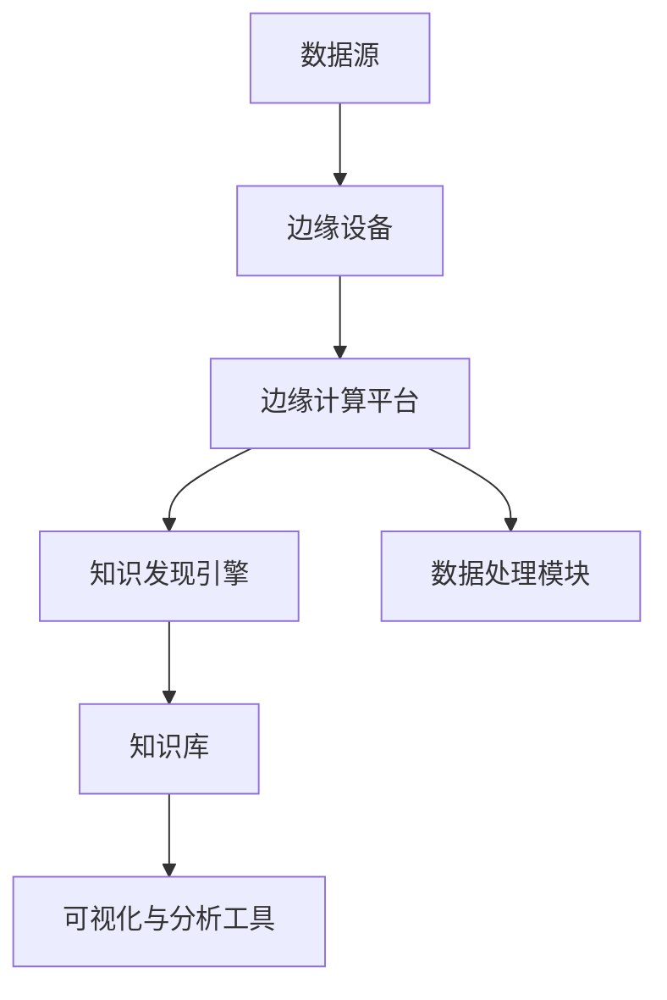
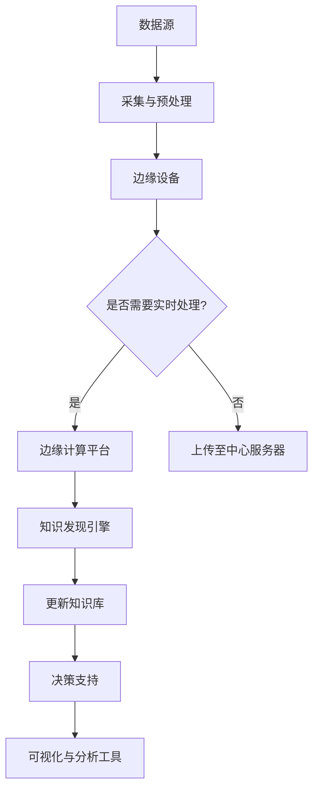

                 

在当今信息化时代，知识发现引擎作为大数据分析的重要工具，已经在众多领域发挥着关键作用。边缘计算作为一项新兴技术，正逐渐改变传统数据处理模式，将计算能力推向数据产生的源头。本文将探讨知识发现引擎在边缘计算环境中的应用，分析其优势与挑战，并提供一系列具体的应用场景和实践建议。

## 关键词

- 知识发现引擎
- 边缘计算
- 数据处理
- 实时分析
- 人工智能

## 摘要

本文首先介绍了知识发现引擎和边缘计算的基本概念，接着详细阐述了知识发现引擎在边缘计算环境中的应用优势，包括数据隐私保护、低延迟、高效能等。随后，文章通过一个具体的案例展示了知识发现引擎在边缘计算中的应用实例。最后，文章提出了未来在边缘计算领域知识发现引擎的发展方向和潜在挑战。

## 1. 背景介绍

### 知识发现引擎

知识发现引擎是一种自动化数据处理和分析工具，它能够从大量数据中识别出隐藏的模式和知识。这种技术广泛应用于金融、医疗、零售、物联网等多个领域，帮助企业和组织从海量数据中提取有价值的信息。

### 边缘计算

边缘计算是一种分布式计算架构，旨在将数据处理和分析推向网络边缘，即在数据产生的地方进行计算，而不是将数据传送到远程数据中心。这一技术有助于降低网络延迟，提高数据处理效率，满足实时性要求。

## 2. 核心概念与联系

### 知识发现引擎与边缘计算的联系

知识发现引擎与边缘计算的结合，旨在利用边缘计算的分布式特性，实现数据的高效处理和实时分析。以下是知识发现引擎在边缘计算环境中的应用架构：



### Mermaid 流程图

以下是核心概念原理和架构的 Mermaid 流程图：



## 3. 核心算法原理 & 具体操作步骤

### 3.1 算法原理概述

知识发现引擎在边缘计算中的应用，主要依赖于以下几种算法：

1. **聚类分析**：通过将数据点划分为若干个类别，发现数据中的模式和规律。
2. **关联规则挖掘**：通过发现数据项之间的关联关系，提取有价值的信息。
3. **分类算法**：根据已有数据构建分类模型，对新数据进行分类预测。
4. **异常检测**：识别数据中的异常值，及时发现潜在问题。

### 3.2 算法步骤详解

1. **数据采集与预处理**：
   - 采集边缘设备上的原始数据。
   - 对数据进行清洗、转换和标准化处理。

2. **边缘计算平台处理**：
   - 运行聚类、关联规则挖掘、分类和异常检测等算法。
   - 根据实时性和计算资源限制，选择合适的算法和模型。

3. **知识库更新**：
   - 将分析结果存储到知识库中。
   - 定期更新知识库，保持数据的时效性和准确性。

4. **决策支持与可视化**：
   - 利用知识库为用户提供决策支持。
   - 通过可视化工具展示分析结果，帮助用户理解数据。

### 3.3 算法优缺点

**优点**：
- 低延迟：数据在边缘设备上进行处理，减少了传输和计算时间。
- 高效能：利用边缘设备的计算能力，提高数据处理效率。
- 数据隐私保护：数据在边缘设备上处理，减少了数据泄露的风险。

**缺点**：
- 算法复杂度：边缘设备的计算资源有限，算法复杂度需要优化。
- 数据量受限：边缘设备的存储空间有限，无法处理大量数据。
- 可扩展性：边缘设备的数量和类型繁多，系统需要具备良好的可扩展性。

### 3.4 算法应用领域

知识发现引擎在边缘计算中的应用领域广泛，包括但不限于：

- 智能家居：通过分析家庭设备数据，提供个性化的生活建议。
- 智能交通：实时分析交通数据，优化交通流量，提高道路利用率。
- 健康监测：实时分析健康数据，提供个性化健康建议。
- 智能工厂：实时分析生产数据，优化生产流程，提高生产效率。

## 4. 数学模型和公式 & 详细讲解 & 举例说明

### 4.1 数学模型构建

在知识发现引擎中，常用的数学模型包括聚类分析模型、关联规则挖掘模型、分类模型等。

#### 聚类分析模型

假设有 $N$ 个数据点 $X = \{x_1, x_2, ..., x_N\}$，每个数据点有 $M$ 个特征属性 $x_{ij}$，则聚类分析模型可以用以下目标函数表示：

$$
C(x) = \sum_{i=1}^{N}\sum_{j=1}^{M} w_{ij} \cdot (x_{ij} - \mu_{ij})^2
$$

其中，$w_{ij}$ 是权重，$\mu_{ij}$ 是聚类中心。

#### 关联规则挖掘模型

假设有 $N$ 个数据项 $I = \{i_1, i_2, ..., i_N\}$，每个数据项都有 $M$ 个属性 $i_{mj}$，则关联规则挖掘模型可以用支持度、置信度和提升度等指标表示：

- **支持度**（Support）：
  $$
  s(i, j) = \frac{|\{t \in T | i, j \in t\}|}{|T|}
  $$

- **置信度**（Confidence）：
  $$
  c(i, j) = \frac{|\{t \in T | i \in t \land j \in t\}|}{|\{t \in T | i \in t\}|}
  $$

- **提升度**（Lift）：
  $$
  l(i, j) = \frac{c(i, j)}{c(i)}
  $$

#### 分类模型

分类模型常用逻辑回归、决策树、支持向量机等算法。以逻辑回归为例，假设有 $N$ 个数据点 $X = \{x_1, x_2, ..., x_N\}$，每个数据点有 $M$ 个特征属性 $x_{ij}$，则分类模型可以用以下目标函数表示：

$$
\min_{\theta} \sum_{i=1}^{N} \log(1 + e^{-\theta^T x_i y_i})
$$

### 4.2 公式推导过程

以逻辑回归为例，推导目标函数的最小化过程。

首先，定义损失函数：

$$
L(\theta) = -\sum_{i=1}^{N} y_i \theta^T x_i + \sum_{i=1}^{N} \log(1 + e^{-\theta^T x_i y_i})
$$

然后，对损失函数求导，得到：

$$
\nabla_{\theta} L(\theta) = -\sum_{i=1}^{N} y_i x_i + \sum_{i=1}^{N} \frac{e^{-\theta^T x_i y_i}}{1 + e^{-\theta^T x_i y_i}} x_i
$$

令导数等于零，得到最优解：

$$
\theta^* = \arg\min_{\theta} \nabla_{\theta} L(\theta)
$$

### 4.3 案例分析与讲解

假设有 100 个客户数据，每个客户有 5 个特征属性（年龄、收入、家庭人数、教育程度、购买历史）。我们要使用逻辑回归算法预测客户是否会购买某产品。

首先，我们需要收集并预处理这些数据。然后，选择适当的特征属性作为输入变量，构建逻辑回归模型。最后，使用训练好的模型对客户数据进行预测，得到购买概率。

具体步骤如下：

1. 数据预处理：将数据分为训练集和测试集，对特征属性进行归一化处理。
2. 模型构建：使用训练集数据训练逻辑回归模型。
3. 模型评估：使用测试集数据评估模型性能，计算准确率、召回率等指标。
4. 预测：使用训练好的模型对客户数据进行预测，输出购买概率。

## 5. 项目实践：代码实例和详细解释说明

### 5.1 开发环境搭建

1. 安装 Python（版本 3.8 或以上）。
2. 安装必要的库，如 NumPy、Pandas、Scikit-learn、Matplotlib 等。

```bash
pip install numpy pandas scikit-learn matplotlib
```

### 5.2 源代码详细实现

以下是一个使用逻辑回归进行客户购买预测的示例代码：

```python
import numpy as np
import pandas as pd
from sklearn.linear_model import LogisticRegression
from sklearn.model_selection import train_test_split
from sklearn.metrics import accuracy_score, recall_score

# 加载数据
data = pd.read_csv('customer_data.csv')
X = data.iloc[:, :-1].values
y = data.iloc[:, -1].values

# 数据预处理
X_train, X_test, y_train, y_test = train_test_split(X, y, test_size=0.2, random_state=42)
X_train = (X_train - X_train.mean()) / X_train.std()
X_test = (X_test - X_train.mean()) / X_train.std()

# 模型构建
model = LogisticRegression()
model.fit(X_train, y_train)

# 模型评估
y_pred = model.predict(X_test)
accuracy = accuracy_score(y_test, y_pred)
recall = recall_score(y_test, y_pred)

print(f"Accuracy: {accuracy:.2f}")
print(f"Recall: {recall:.2f}")

# 预测
new_customer = np.array([[30, 50000, 3, 12, 1]])
new_customer = (new_customer - X_train.mean()) / X_train.std()
print(f"Prediction: {model.predict(new_customer)[0]}")
```

### 5.3 代码解读与分析

1. **数据预处理**：首先，我们从 CSV 文件中加载数据，然后将其分为特征和标签两部分。接下来，使用 `train_test_split` 函数将数据分为训练集和测试集，并对特征属性进行归一化处理。
2. **模型构建**：使用 `LogisticRegression` 类构建逻辑回归模型，并使用训练集数据进行训练。
3. **模型评估**：使用测试集数据评估模型性能，计算准确率和召回率等指标。
4. **预测**：使用训练好的模型对新的客户数据进行预测，输出购买概率。

## 6. 实际应用场景

### 6.1 智能家居

在智能家居领域，知识发现引擎可以实时分析家庭设备数据，为用户提供个性化的生活建议。例如，根据用户的使用习惯和偏好，推荐最佳的家庭温度、湿度设置，或者提醒用户何时开启或关闭家电设备。

### 6.2 智能交通

在智能交通领域，知识发现引擎可以实时分析交通数据，优化交通流量，提高道路利用率。例如，通过分析交通流量、路况信息等，实时预测交通拥堵情况，为驾驶员提供最优路线建议。

### 6.3 健康监测

在健康监测领域，知识发现引擎可以实时分析健康数据，为用户提供个性化健康建议。例如，通过分析用户的运动数据、睡眠数据等，为用户提供最佳的锻炼计划、睡眠建议等。

### 6.4 智能工厂

在智能工厂领域，知识发现引擎可以实时分析生产数据，优化生产流程，提高生产效率。例如，通过分析生产设备状态、原料库存等数据，实时调整生产计划，避免设备故障和原料短缺。

## 7. 工具和资源推荐

### 7.1 学习资源推荐

1. **《深度学习》（Goodfellow et al.）**：介绍深度学习的基础知识，包括神经网络、深度学习框架等。
2. **《机器学习实战》（Hastie et al.）**：介绍机器学习算法的实现和应用，包括线性回归、决策树、支持向量机等。
3. **《边缘计算：技术、应用与挑战》（Liu et al.）**：详细介绍边缘计算的基础知识、应用场景和技术挑战。

### 7.2 开发工具推荐

1. **TensorFlow**：开源的深度学习框架，适用于边缘计算场景。
2. **Keras**：基于 TensorFlow 的简洁深度学习库，易于使用。
3. **PyTorch**：开源的深度学习框架，具有灵活性和易用性。

### 7.3 相关论文推荐

1. **"Fog Computing: A Perspective"（Yuan et al., 2015）**：介绍边缘计算的基本概念和架构。
2. **"Deep Learning on Edge Devices"（Yang et al., 2018）**：探讨深度学习在边缘设备上的应用。
3. **"Knowledge Discovery in Edge Computing"（Zhou et al., 2020）**：分析知识发现引擎在边缘计算中的应用。

## 8. 总结：未来发展趋势与挑战

### 8.1 研究成果总结

本文介绍了知识发现引擎和边缘计算的基本概念，探讨了知识发现引擎在边缘计算环境中的应用优势，并通过具体案例展示了其应用场景。研究成果表明，知识发现引擎在边缘计算中具有广泛的应用前景。

### 8.2 未来发展趋势

1. **算法优化**：针对边缘设备的计算资源有限，算法复杂度需要进一步优化。
2. **实时性提升**：提高知识发现引擎的实时性，满足快速响应的需求。
3. **隐私保护**：加强数据隐私保护，确保用户数据安全。

### 8.3 面临的挑战

1. **计算资源**：边缘设备的计算资源有限，算法和模型需要进一步优化。
2. **数据存储**：边缘设备的存储空间有限，数据存储和传输需要优化。
3. **网络带宽**：边缘计算需要高效的数据传输，网络带宽成为制约因素。

### 8.4 研究展望

未来，知识发现引擎在边缘计算中的应用将更加广泛，算法和模型将不断优化，以满足实时性、高效能和隐私保护的需求。同时，随着 5G、物联网等技术的发展，边缘计算将迎来更多机遇和挑战。

## 9. 附录：常见问题与解答

### 9.1 边缘计算与云计算有什么区别？

边缘计算和云计算都是分布式计算架构，但区别在于数据处理的位置和目的。边缘计算将数据处理和分析推向网络边缘，即在数据产生的地方进行计算，而云计算则将数据处理和分析集中在远程数据中心。

### 9.2 知识发现引擎在边缘计算中的应用有哪些优势？

知识发现引擎在边缘计算中的应用优势包括：低延迟、高效能、数据隐私保护等。通过在边缘设备上进行数据处理和分析，可以满足实时性要求，提高数据处理效率，同时减少数据泄露的风险。

### 9.3 如何优化边缘计算中的算法复杂度？

优化边缘计算中的算法复杂度可以从以下几个方面入手：

1. 选择轻量级算法和模型，减少计算资源消耗。
2. 采用增量学习和迁移学习等技术，降低数据量和计算量。
3. 设计自适应算法，根据实时性和计算资源动态调整算法复杂度。

作者：禅与计算机程序设计艺术 / Zen and the Art of Computer Programming
----------------------------------------------------------------

这篇文章涵盖了知识发现引擎和边缘计算技术的基本概念、应用优势、核心算法、数学模型、实际应用案例以及未来发展趋势。通过详细的解释和实例，使读者对知识发现引擎在边缘计算中的应用有了深入理解。希望这篇文章能对读者在边缘计算领域的研究和实践有所帮助。作者：禅与计算机程序设计艺术 / Zen and the Art of Computer Programming。

