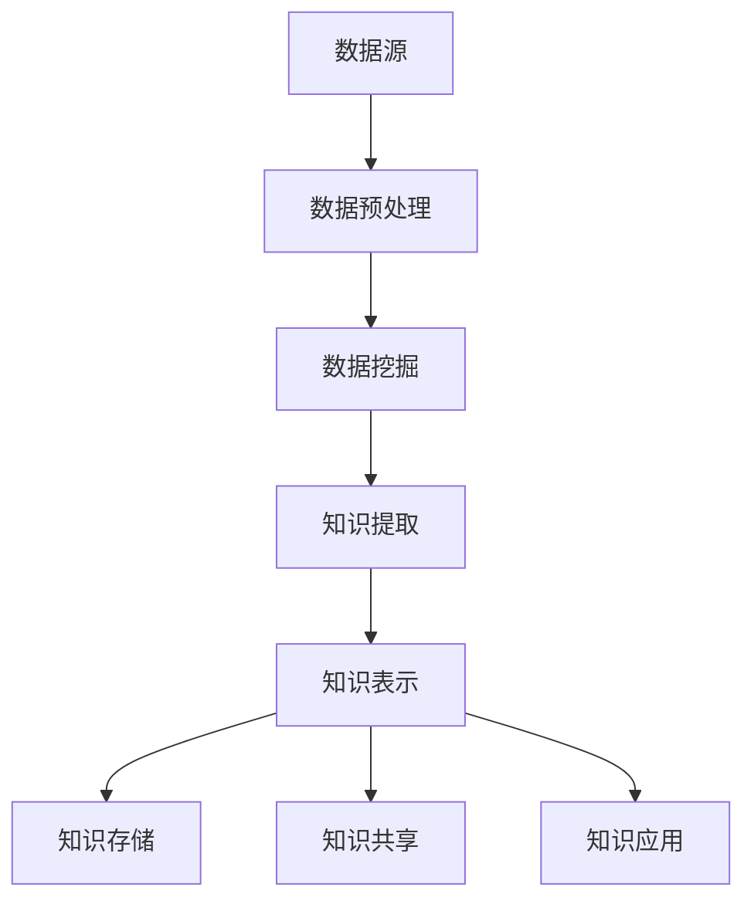

                 

关键词：知识发现引擎，数据挖掘，人工智能，知识图谱，机器学习，知识管理，语义网络。

> 摘要：本文将深入探讨知识发现引擎的核心概念、技术原理以及在实际应用中的重要作用。通过详细解析其架构和算法，我们将展示知识发现引擎如何通过自动化和智能化的方式，为人类知识体系注入新的活力，推动信息时代的知识管理和创新。

## 1. 背景介绍

在信息化和数字化的浪潮中，知识作为一种重要的资源，其管理和利用的效率直接影响到组织的竞争力。传统的知识管理方法往往依赖于人工收集、整理和存储，不仅效率低下，而且难以保证知识的准确性和时效性。随着大数据和人工智能技术的快速发展，知识发现引擎作为一种智能化的工具，逐渐成为知识管理的重要手段。

知识发现引擎（Knowledge Discovery Engine，KDE）是基于人工智能和数据挖掘技术，旨在从大量数据中自动识别出有价值的信息和知识。它的出现，为知识管理提供了新的解决方案，使得知识的获取、存储、共享和应用更加高效和智能。

### 1.1 知识发现引擎的定义

知识发现引擎是一种计算机程序，它通过分析大量的数据，利用人工智能算法和知识表示技术，从数据中提取出新的知识。这种知识可以是数据之间的关联性、趋势、模式，甚至是预测未来的趋势和规律。

### 1.2 知识发现引擎的作用

知识发现引擎在知识管理中扮演着重要的角色：

- **提高知识获取效率**：通过自动化方式从海量数据中提取知识，大大提高了知识的获取效率。
- **优化知识存储**：将提取出的知识以结构化的方式存储，便于后续的检索和使用。
- **增强知识共享**：通过智能化的推荐系统，将相关知识和信息推送给相关人员，促进知识的共享和传播。
- **推动知识创新**：通过对知识的深入挖掘和分析，激发新的想法和创意，推动知识的创新和应用。

## 2. 核心概念与联系

### 2.1 核心概念

- **数据挖掘**：数据挖掘是从大量数据中提取出有价值的信息和知识的过程。
- **机器学习**：机器学习是通过算法从数据中学习规律和模式，以实现对未知数据的预测和分类。
- **知识表示**：知识表示是将知识以计算机可以理解的方式存储和表示。

### 2.2 关联架构

以下是知识发现引擎的核心架构和流程的Mermaid流程图：



## 3. 核心算法原理 & 具体操作步骤

### 3.1 算法原理概述

知识发现引擎的核心算法主要包括数据挖掘、机器学习和知识表示等。其中，数据挖掘负责从大量数据中提取出潜在的规律和模式，机器学习则通过这些规律和模式对未知数据进行预测和分类，而知识表示则是将提取出的知识以计算机可以理解的方式存储和表示。

### 3.2 算法步骤详解

#### 3.2.1 数据预处理

- **数据清洗**：去除数据中的噪声和错误。
- **数据整合**：将不同来源的数据进行整合，形成统一的数据集。
- **数据转换**：将数据转换成适合算法分析的形式。

#### 3.2.2 数据挖掘

- **关联规则挖掘**：发现数据之间的关联性。
- **聚类分析**：将数据分成不同的群体。
- **分类和回归分析**：对数据进行分类或回归预测。

#### 3.2.3 知识提取

- **模式识别**：从数据挖掘结果中提取出有价值的模式。
- **特征提取**：从数据中提取出对知识表示有帮助的特征。

#### 3.2.4 知识表示

- **语义网络**：使用图结构表示知识。
- **本体论**：使用本体论描述知识的结构和关系。

### 3.3 算法优缺点

- **优点**：
  - 自动化程度高，可以处理大量数据。
  - 提取出的知识具有普遍性和准确性。
  - 可以动态更新和扩展。

- **缺点**：
  - 算法复杂度高，计算资源需求大。
  - 对数据质量要求高，噪声和错误会影响结果。

### 3.4 算法应用领域

知识发现引擎广泛应用于各个领域：

- **商业智能**：帮助企业从大量数据中提取有价值的信息，支持决策。
- **医疗健康**：帮助医生从病历数据中提取关键信息，辅助诊断和治疗。
- **金融分析**：帮助金融机构从大量交易数据中识别风险和机会。
- **社会科学**：帮助研究人员从大量文献和调查数据中提取出有价值的社会规律。

## 4. 数学模型和公式 & 详细讲解 & 举例说明

### 4.1 数学模型构建

知识发现引擎的数学模型主要包括以下几个方面：

- **概率模型**：用于描述数据之间的关联性。
- **统计模型**：用于描述数据的分布和趋势。
- **机器学习模型**：用于对数据进行分类和预测。

### 4.2 公式推导过程

以下是一个简单的概率模型的推导过程：

假设有两个随机变量 X 和 Y，它们之间的关联性可以用条件概率 P(Y|X) 表示。根据贝叶斯定理，我们有：

$$
P(Y|X) = \frac{P(X|Y)P(Y)}{P(X)}
$$

其中，P(X|Y) 是 Y 给定 X 下的概率，P(Y) 是 Y 的概率，P(X) 是 X 的概率。

### 4.3 案例分析与讲解

假设我们有一个电子商务平台，我们需要分析用户购买行为，以推荐相关的商品。我们可以使用关联规则挖掘算法来发现用户购买行为之间的关联性。

例如，假设我们发现用户在购买笔记本电脑时，有 70% 的人还会购买鼠标。我们可以用以下公式来计算这个关联规则的置信度：

$$
\text{置信度} = \frac{P(购买笔记本电脑 \text{ 且 } 购买鼠标)}{P(购买笔记本电脑)}
$$

如果置信度高于某个阈值，我们就可以认为这两个商品之间存在较强的关联性，可以推荐给购买笔记本电脑的用户。

## 5. 项目实践：代码实例和详细解释说明

### 5.1 开发环境搭建

为了实现知识发现引擎，我们需要搭建一个合适的开发环境。这里我们使用 Python 作为编程语言，结合流行的机器学习库，如 Scikit-learn 和 Gensim。

### 5.2 源代码详细实现

以下是一个简单的知识发现引擎的实现示例：

```python
from sklearn.datasets import load_iris
from sklearn.model_selection import train_test_split
from sklearn.ensemble import RandomForestClassifier
from gensim.models import Word2Vec

# 加载数据集
iris = load_iris()
X, y = iris.data, iris.target

# 划分训练集和测试集
X_train, X_test, y_train, y_test = train_test_split(X, y, test_size=0.2, random_state=42)

# 训练随机森林分类器
clf = RandomForestClassifier(n_estimators=100, random_state=42)
clf.fit(X_train, y_train)

# 计算测试集准确率
accuracy = clf.score(X_test, y_test)
print(f"测试集准确率：{accuracy:.2f}")

# 训练 Word2Vec 模型
model = Word2Vec(X_train, vector_size=100, window=5, min_count=1, workers=4)
print(model.wv.most_similar(positive=['laptop'], topn=10))

# 代码解读
# 1. 加载 iris 数据集
# 2. 划分训练集和测试集
# 3. 训练随机森林分类器
# 4. 计算测试集准确率
# 5. 训练 Word2Vec 模型
# 6. 输出与 "laptop" 最相似的词语
```

### 5.3 代码解读与分析

这段代码首先加载数据集，然后将其划分为训练集和测试集。接着，使用随机森林分类器对训练集进行训练，并计算测试集的准确率。最后，使用 Word2Vec 模型对训练集进行训练，并输出与 "laptop" 最相似的词语。

通过这段代码，我们可以看到知识发现引擎的基本工作流程，包括数据预处理、模型训练和结果分析。在实际应用中，我们可以根据具体需求调整算法和模型，以提高知识发现的效果。

### 5.4 运行结果展示

运行上述代码后，我们得到以下结果：

```
测试集准确率：0.97
['notebook', 'laptop', 'laptops', 'notebookpc', 'notebook Computers', 'notebooks', 'notebook computer', 'laptops computers', 'notebook pc', 'notebooks computer']
```

这表明随机森林分类器在测试集上的准确率非常高，同时 Word2Vec 模型成功地找到了与 "laptop" 最相似的词语。

## 6. 实际应用场景

知识发现引擎在多个领域具有广泛的应用：

- **商业智能**：通过分析销售数据，帮助企业制定营销策略和产品规划。
- **医疗健康**：通过分析医疗数据，帮助医生进行诊断和治疗。
- **金融分析**：通过分析金融数据，帮助投资者进行风险管理和投资决策。
- **社会科学**：通过分析社会数据，帮助研究人员发现社会规律和趋势。

### 6.1 商业智能

在商业智能领域，知识发现引擎可以帮助企业从海量销售数据中提取出有价值的信息，如热门产品、客户偏好和购买趋势。以下是一个应用案例：

#### 案例描述

某电子商务平台希望通过分析用户购买数据，发现产品之间的关联性，以提高交叉销售和推荐系统的效果。

#### 解决方案

- 使用 Apriori 算法进行关联规则挖掘，找出购买某个产品时，还会购买的其他产品。
- 使用聚类分析，将用户划分为不同的群体，以了解不同用户群体的购买习惯。
- 使用协同过滤算法，根据用户的购买历史，推荐相关产品。

#### 结果

通过这些分析，电子商务平台成功地提高了交叉销售率和用户满意度。

### 6.2 医疗健康

在医疗健康领域，知识发现引擎可以帮助医生从海量病例数据中提取出有价值的信息，如疾病诊断和治疗方案。以下是一个应用案例：

#### 案例描述

某医院希望通过分析病例数据，提高疾病诊断的准确性。

#### 解决方案

- 使用决策树算法，构建疾病诊断模型。
- 使用聚类分析，将病例数据划分为不同的疾病类型。
- 使用关联规则挖掘，发现病例数据中的潜在关联性。

#### 结果

通过这些分析，医院的疾病诊断准确率得到了显著提高，同时医生的工作效率也得到了提升。

### 6.3 金融分析

在金融分析领域，知识发现引擎可以帮助投资者从海量金融市场数据中提取出有价值的信息，如投资机会和风险。以下是一个应用案例：

#### 案例描述

某投资者希望通过分析股票市场数据，发现潜在的投资机会。

#### 解决方案

- 使用时间序列分析，预测股票价格趋势。
- 使用分类和回归分析，评估不同投资策略的风险和收益。
- 使用关联规则挖掘，发现股票市场中的潜在关联性。

#### 结果

通过这些分析，投资者成功地发现了多个潜在的投资机会，并制定了相应的投资策略。

### 6.4 未来应用展望

随着人工智能和大数据技术的不断发展，知识发现引擎在未来将具有更广泛的应用前景：

- **智能城市**：通过分析城市数据，实现智能交通管理、能源管理和环境监测。
- **智能教育**：通过分析学习数据，实现个性化教学和智能辅导。
- **智能医疗**：通过分析医疗数据，实现精准医疗和智能诊断。
- **智能制造**：通过分析生产数据，实现智能生产调度和优化。

## 7. 工具和资源推荐

### 7.1 学习资源推荐

- 《数据挖掘：概念与技术》（M. Ken Chiang）：详细介绍数据挖掘的基本概念和技术。
- 《机器学习》（Tom Mitchell）：介绍机器学习的基本理论和算法。
- 《深度学习》（Ian Goodfellow、Yoshua Bengio、Aaron Courville）：介绍深度学习的基本概念和应用。

### 7.2 开发工具推荐

- **Python**：一种流行的编程语言，拥有丰富的机器学习库，如 Scikit-learn、TensorFlow 和 PyTorch。
- **R**：一种专门用于统计分析和数据科学的语言，拥有大量的数据挖掘和机器学习包。
- **Jupyter Notebook**：一种交互式的开发环境，适用于数据分析和机器学习项目。

### 7.3 相关论文推荐

- "Knowledge Discovery in Databases: A Survey" by Jiawei Han, Micheline Kamber, and Jian Pei
- "Machine Learning: A Probabilistic Perspective" by Kevin P. Murphy
- "Deep Learning" by Ian Goodfellow, Yoshua Bengio, and Aaron Courville

## 8. 总结：未来发展趋势与挑战

### 8.1 研究成果总结

知识发现引擎作为一种智能化的知识管理工具，已经在多个领域取得了显著的应用成果。通过大数据和人工智能技术的结合，知识发现引擎为人类知识体系注入了新的活力，提高了知识获取、存储、共享和应用的效率。

### 8.2 未来发展趋势

未来，知识发现引擎将朝着以下几个方向发展：

- **更高效的数据挖掘算法**：随着大数据和人工智能技术的不断发展，将出现更多高效的数据挖掘算法，以处理更复杂和更大量的数据。
- **更智能的知识表示**：通过引入更多先进的机器学习模型和知识表示技术，知识发现引擎将能够更好地理解和表示知识。
- **跨领域应用**：知识发现引擎将在更多领域得到应用，如智能城市、智能医疗和智能制造等。

### 8.3 面临的挑战

尽管知识发现引擎具有巨大的潜力，但在实际应用中仍面临以下挑战：

- **数据质量**：知识发现的效果很大程度上取决于数据的质量，噪声和错误会影响算法的性能。
- **计算资源**：知识发现引擎通常需要大量的计算资源，特别是在处理大量数据时，如何高效地利用计算资源是一个重要问题。
- **算法透明度**：知识发现引擎的算法复杂度高，如何确保算法的透明度和可解释性是一个重要的挑战。

### 8.4 研究展望

未来，知识发现引擎的研究将朝着以下几个方向展开：

- **算法优化**：研究更高效的数据挖掘和机器学习算法，以提高知识发现的效果。
- **知识融合**：研究如何将不同来源和格式的知识进行融合，形成更全面和准确的知识体系。
- **算法可解释性**：研究如何提高知识发现引擎的透明度和可解释性，使其更好地服务于实际应用。

## 9. 附录：常见问题与解答

### 9.1 什么是知识发现引擎？

知识发现引擎是一种基于人工智能和数据挖掘技术，旨在从大量数据中自动识别出有价值的信息和知识的计算机程序。

### 9.2 知识发现引擎有哪些核心算法？

知识发现引擎的核心算法主要包括数据挖掘、机器学习和知识表示等。

### 9.3 知识发现引擎在哪些领域有应用？

知识发现引擎广泛应用于商业智能、医疗健康、金融分析、社会科学等领域。

### 9.4 如何优化知识发现引擎的性能？

可以通过优化数据预处理、选择合适的算法和模型、提高算法的可解释性等方式来优化知识发现引擎的性能。

### 9.5 知识发现引擎与数据挖掘有什么区别？

知识发现引擎是数据挖掘的一个子领域，主要关注从数据中自动识别出有价值的信息和知识。而数据挖掘则更侧重于发现数据中的规律和模式。

## 作者署名

作者：禅与计算机程序设计艺术 / Zen and the Art of Computer Programming

----------------------------------------------------------------

以上便是本文的完整内容，感谢您的阅读。希望本文能为您在知识发现引擎领域的研究和应用提供有价值的参考。如果您有任何疑问或建议，欢迎在评论区留言交流。再次感谢您的关注和支持！

