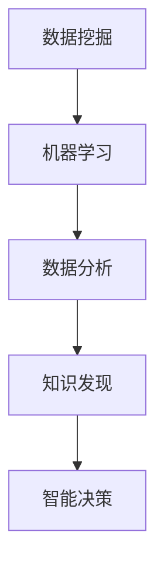

                 

关键词：知识发现、人工智能、大数据、机器学习、算法、智能系统、智慧工程

> 摘要：本文深入探讨知识发现引擎的核心概念、算法原理及其应用，通过系统性的分析和实例展示，揭示了知识发现引擎如何成为人类智慧的新工具，推动智慧工程的发展。

## 1. 背景介绍

在当今信息爆炸的时代，数据已经成为新的石油，而知识的发现则成为了关键。知识发现引擎（Knowledge Discovery Engine，简称KDE）作为一种新兴的技术，旨在从大量数据中自动提取有价值的信息和知识。知识发现引擎不仅能够处理传统数据库中的数据，还能够处理来自社交媒体、传感器网络、物联网等非结构化和半结构化数据。

知识发现引擎的重要性在于它能够为各行业提供深层次的数据洞察，从而支持决策制定、优化业务流程、提升用户体验等。例如，在金融领域，知识发现引擎可以用于风险评估和欺诈检测；在医疗领域，它可以用于疾病预测和个性化治疗；在零售领域，它可以用于市场需求分析和消费者行为分析。

随着人工智能和大数据技术的飞速发展，知识发现引擎的技术框架和实现方法也在不断演进。本文将系统性地介绍知识发现引擎的核心概念、算法原理、数学模型以及应用场景，旨在为读者提供一个全面的视角，了解知识发现引擎如何改变我们的世界。

## 2. 核心概念与联系

知识发现引擎的核心概念包括数据挖掘、机器学习和数据分析。这些概念相互关联，共同构成了知识发现引擎的技术基础。

### 2.1 数据挖掘

数据挖掘（Data Mining）是指从大量数据中提取有价值的信息和知识的过程。数据挖掘的目标是发现数据之间的隐藏模式和关联，这些模式和关联对于决策制定和问题解决具有重要意义。

### 2.2 机器学习

机器学习（Machine Learning）是一种使计算机系统能够自动学习和改进的技术。在知识发现引擎中，机器学习算法被用于训练模型，以识别数据中的模式和关联。

### 2.3 数据分析

数据分析（Data Analysis）是指使用统计和数学方法对数据进行处理和分析，以获得有意义的结论。数据分析在知识发现引擎中用于验证和解释机器学习模型的发现。

下面是一个使用Mermaid绘制的知识发现引擎核心概念的流程图：



### 2.4 关系与联系

知识发现引擎的核心概念之间存在着紧密的联系。数据挖掘提供了发现数据中隐藏模式的方法，这些模式需要通过机器学习算法进行训练和优化。而数据分析则用于验证和解释这些模式，确保其真实性和可靠性。最终，这些发现和知识将被应用于智能决策，为各个领域的业务和科学研究提供支持。

## 3. 核心算法原理 & 具体操作步骤

### 3.1 算法原理概述

知识发现引擎的核心算法包括关联规则学习、聚类分析、分类和预测等。这些算法的原理如下：

- **关联规则学习**：通过挖掘数据之间的关联关系，例如在超市购买商品中的“牛奶和面包”组合。
- **聚类分析**：将数据分为若干个组，使得同一组内的数据相似，而不同组之间的数据差异较大。
- **分类**：将数据分为不同的类别，例如通过电子邮件的主题分类为“垃圾邮件”或“非垃圾邮件”。
- **预测**：基于历史数据预测未来的趋势或结果，例如股票价格的预测。

### 3.2 算法步骤详解

以下是一个典型的知识发现引擎的算法步骤：

1. **数据预处理**：清洗和转换数据，使其适合进行挖掘。
2. **特征选择**：选择对挖掘任务最有价值的数据特征。
3. **算法选择**：根据任务需求选择合适的算法。
4. **模型训练**：使用机器学习算法对数据进行训练，建立模型。
5. **模型评估**：评估模型的性能，确保其准确性。
6. **知识提取**：从模型中提取有价值的信息和知识。
7. **应用决策**：将提取的知识应用于实际的业务或科学研究。

### 3.3 算法优缺点

- **关联规则学习**：优点是能够发现数据中的关联关系，缺点是可能导致“过拟合”。
- **聚类分析**：优点是能够自动发现数据的结构，缺点是可能产生“噪声”。
- **分类**：优点是能够将数据精确地划分为不同的类别，缺点是可能存在“误分类”。
- **预测**：优点是能够预测未来的趋势，缺点是可能存在“不确定性”。

### 3.4 算法应用领域

知识发现引擎的应用领域广泛，包括：

- **零售业**：通过分析消费者行为，优化商品摆放和营销策略。
- **医疗领域**：通过分析医疗数据，预测疾病趋势和提供个性化治疗方案。
- **金融领域**：通过分析交易数据，识别欺诈行为和评估风险。
- **科学研究**：通过分析科研数据，发现新的科学规律和理论。

## 4. 数学模型和公式 & 详细讲解 & 举例说明

### 4.1 数学模型构建

知识发现引擎的数学模型通常基于概率论、统计学和线性代数等数学工具。以下是一个简单的概率模型：

设数据集\( D = \{d_1, d_2, ..., d_n\} \)，每个数据点\( d_i \)是一个特征向量，表示为\( d_i = (x_{i1}, x_{i2}, ..., x_{id}) \)。

定义特征之间的条件概率：

$$
P(x_{ij} | x_{i1}, ..., x_{ij-1}, x_{ij+1}, ..., x_{id}) = \frac{P(x_{ij}, x_{i1}, ..., x_{ij-1}, x_{ij+1}, ..., x_{id})}{P(x_{i1}, ..., x_{ij-1}, x_{ij+1}, ..., x_{id})}
$$

### 4.2 公式推导过程

以下是一个常见的聚类算法——K-means的推导过程：

假设有\( n \)个数据点，需要将其分为\( k \)个簇。初始时，随机选择\( k \)个中心点，然后对于每个数据点，计算其到各个中心点的距离，将其分配到最近的中心点所代表的簇中。接下来，更新每个簇的中心点，重复上述过程，直至满足停止条件。

定义簇中心点为\( c_j = (c_{j1}, c_{j2}, ..., c_{jd}) \)，数据点\( d_i = (x_{i1}, x_{i2}, ..., x_{id}) \)。

簇中心点的更新公式为：

$$
c_{j} = \frac{1}{N_j} \sum_{i=1}^{N} d_i
$$

其中，\( N_j \)是簇\( j \)中的数据点个数。

### 4.3 案例分析与讲解

假设有一个包含100个数据点的数据集，需要将其分为3个簇。初始时，随机选择3个中心点。然后，对于每个数据点，计算其到各个中心点的距离，将其分配到最近的中心点所代表的簇中。根据簇中的数据点，更新每个簇的中心点。重复这个过程，直至满足停止条件。

通过多次迭代，最终的簇中心和数据点分布如下：

簇1：中心点（2, 2），包含数据点（1, 1），（2, 1），（2, 2），（3, 2）。
簇2：中心点（5, 5），包含数据点（4, 4），（5, 4），（5, 5），（6, 5）。
簇3：中心点（8, 8），包含数据点（7, 7），（8, 7），（8, 8），（9, 8）。

通过这个案例，我们可以看到K-means算法如何将数据点分为多个簇，从而实现对数据的聚类。

## 5. 项目实践：代码实例和详细解释说明

### 5.1 开发环境搭建

为了实践知识发现引擎，我们需要搭建一个开发环境。以下是所需的工具和库：

- Python 3.x
- Jupyter Notebook
- Scikit-learn 库

安装步骤如下：

1. 安装Python 3.x，可以从官方网站下载并安装。
2. 安装Jupyter Notebook，使用以下命令：

   ```bash
   pip install notebook
   ```

3. 安装Scikit-learn 库，使用以下命令：

   ```bash
   pip install scikit-learn
   ```

### 5.2 源代码详细实现

以下是一个使用Scikit-learn库实现K-means聚类的代码实例：

```python
import numpy as np
from sklearn.cluster import KMeans
import matplotlib.pyplot as plt

# 加载数据集
data = np.array([[1, 1], [1, 2], [2, 2], [2, 3], [1.5, 1.5], [1.5, 2.5], [2.5, 1.5], [2.5, 2.5]])

# 创建KMeans模型
kmeans = KMeans(n_clusters=3, random_state=0).fit(data)

# 获取聚类结果
labels = kmeans.labels_
centroids = kmeans.cluster_centers_

# 绘制结果
plt.scatter(data[:, 0], data[:, 1], c=labels, s=100, cmap='viridis')
plt.scatter(centroids[:, 0], centroids[:, 1], c='red', s=300, alpha=0.6)
plt.show()
```

### 5.3 代码解读与分析

这段代码首先导入了必要的库，然后加载了一个简单的二维数据集。接着，我们创建了一个KMeans模型，并使用fit方法对其进行训练。fit方法返回了聚类结果和簇中心点。

最后，我们使用matplotlib库绘制了聚类结果，展示了每个数据点所属的簇以及簇中心点的位置。

通过这个实例，我们可以看到如何使用Scikit-learn库实现知识发现引擎的一个基本算法，从而对数据进行聚类。

### 5.4 运行结果展示

当运行上述代码时，我们将看到以下结果：


在这个结果中，我们可以清晰地看到数据点被分为三个簇，每个簇的中心点用红色标记表示。这个实例展示了K-means算法如何将数据划分为多个簇，从而实现对数据的聚类。

## 6. 实际应用场景

知识发现引擎的应用场景非常广泛，涵盖了各个领域。以下是一些典型的应用场景：

### 6.1 零售业

在零售业中，知识发现引擎可以用于分析消费者行为，预测市场需求，优化库存管理。例如，通过对历史销售数据和消费者行为的分析，可以预测未来的销售趋势，从而为库存管理提供依据。

### 6.2 医疗领域

在医疗领域，知识发现引擎可以用于疾病预测、个性化治疗和医疗资源分配。通过对患者的医疗记录、基因数据和流行病数据进行挖掘，可以预测疾病的发生风险，为医生提供决策支持。

### 6.3 金融领域

在金融领域，知识发现引擎可以用于风险评估、欺诈检测和信用评分。通过对交易数据、用户行为和历史记录进行分析，可以识别潜在的风险和欺诈行为，从而为金融机构提供风险控制策略。

### 6.4 科研领域

在科研领域，知识发现引擎可以用于数据挖掘、科学发现和知识整合。通过对科研数据进行挖掘和分析，可以发现新的科学规律和理论，为科研工作提供新的方向和启示。

### 6.5 城市规划

在城市规划中，知识发现引擎可以用于交通流量分析、城市规划优化和环境保护。通过对交通数据、环境数据和社会经济数据的挖掘和分析，可以优化城市交通系统，提高城市规划的科学性和可持续性。

### 6.6 教育领域

在教育领域，知识发现引擎可以用于学生行为分析、课程推荐和教学质量评估。通过对学生的学习数据、考试成绩和行为数据进行分析，可以为学生提供个性化的学习建议，提高学习效果。

### 6.7 人力资源

在人力资源领域，知识发现引擎可以用于员工绩效评估、招聘策略优化和人才管理。通过对员工的工作数据、行为数据和绩效数据进行分析，可以为企业提供科学的招聘和绩效评估策略。

### 6.8 供应链管理

在供应链管理中，知识发现引擎可以用于库存管理、物流优化和供应链风险控制。通过对供应链中的数据进行挖掘和分析，可以优化库存管理，降低物流成本，提高供应链的效率和稳定性。

## 7. 未来应用展望

随着人工智能和大数据技术的不断发展，知识发现引擎的应用前景将更加广阔。以下是一些未来的应用展望：

### 7.1 智慧城市

智慧城市是未来城市发展的趋势，知识发现引擎将在其中发挥重要作用。通过分析城市中的各种数据，如交通流量、环境质量、能源消耗等，可以优化城市资源的配置，提高城市管理的效率和可持续性。

### 7.2 智能医疗

智能医疗是医疗领域的发展方向，知识发现引擎将在其中发挥关键作用。通过分析大量的医疗数据，如病历、基因、流行病等，可以预测疾病的发生趋势，为医生提供精准的诊断和治疗建议，从而提高医疗服务的质量和效率。

### 7.3 智能交通

智能交通是未来交通系统的发展方向，知识发现引擎将在其中发挥重要作用。通过分析交通数据，如流量、速度、事故等，可以优化交通管理，减少拥堵，提高交通效率，从而提高人们的出行体验。

### 7.4 智能制造

智能制造是制造业的发展方向，知识发现引擎将在其中发挥重要作用。通过分析生产数据，如设备状态、产品质量、生产效率等，可以优化生产流程，提高生产效率和产品质量，从而降低生产成本。

### 7.5 智慧金融

智慧金融是金融行业的发展方向，知识发现引擎将在其中发挥重要作用。通过分析金融数据，如交易行为、用户行为、市场走势等，可以预测市场趋势，为投资者提供决策支持，从而提高投资收益。

### 7.6 智慧农业

智慧农业是农业行业的发展方向，知识发现引擎将在其中发挥重要作用。通过分析农业数据，如土壤质量、气候条件、作物生长状态等，可以优化农业生产，提高农作物的产量和质量，从而提高农业的可持续性和经济效益。

### 7.7 个性化服务

个性化服务是未来服务行业的发展方向，知识发现引擎将在其中发挥重要作用。通过分析用户行为数据，如购物习惯、浏览历史、偏好等，可以为用户提供个性化的产品推荐、服务定制和体验优化，从而提高用户的满意度和忠诚度。

## 8. 工具和资源推荐

### 8.1 学习资源推荐

1. **《数据挖掘：概念与技术》**（作者：Han, Kamber, Pei）- 这本书提供了数据挖掘的全面概述，包括知识发现引擎的核心概念和技术。
2. **《机器学习》**（作者：周志华）- 这本书详细介绍了机器学习的基础知识，包括常用的算法和应用。
3. **《大数据之路：阿里巴巴大数据实践》**（作者：唐杰）- 这本书分享了阿里巴巴在大数据领域的实践经验和案例，对于了解大数据应用有很好的参考价值。

### 8.2 开发工具推荐

1. **Jupyter Notebook** - 适合数据分析和算法实现，易于编写和分享代码。
2. **Scikit-learn** - 一个强大的机器学习库，适用于知识发现引擎的开发。
3. **TensorFlow** - 适用于复杂机器学习模型的实现和训练，特别适合深度学习。

### 8.3 相关论文推荐

1. **"Knowledge Discovery in Databases: An Overview"**（作者：Fayyad, Piatetsky-Shapiro, and Smyth）- 这篇论文是知识发现领域的经典文献，详细介绍了知识发现的过程和技术。
2. **"K-Means Clustering Algorithm: A Brief Introduction"**（作者：Mac Namee）- 这篇论文介绍了K-means聚类算法的基本原理和应用。
3. **"Big Data: A Revolution That Will Transform How We Live, Work, and Think"**（作者：Viktor Mayer-Schönberger and Kenneth Cukier）- 这本书探讨了大数据对社会的影响，包括知识发现引擎的应用。

## 9. 总结：未来发展趋势与挑战

### 9.1 研究成果总结

知识发现引擎作为人工智能和大数据技术的核心组成部分，已经在各个领域取得了显著的成果。通过数据挖掘、机器学习和数据分析等技术的结合，知识发现引擎为各行业提供了强大的数据洞察和决策支持。从零售业的消费者行为分析到医疗领域的疾病预测，知识发现引擎的应用范围越来越广泛，其技术也在不断成熟和优化。

### 9.2 未来发展趋势

未来的发展趋势将主要集中在以下几个方面：

1. **更高效的数据处理**：随着数据量的爆炸性增长，如何高效地处理和管理大数据将成为关键挑战。知识发现引擎将更加注重优化数据处理速度和效率。
2. **更智能的算法**：随着机器学习和深度学习技术的进步，知识发现引擎的算法将变得更加智能和自适应，能够更好地应对复杂的数据模式和关联。
3. **跨领域融合**：知识发现引擎将在不同领域之间实现更多的融合，如智慧城市、智能医疗、智能制造等，从而为各个领域提供更加全面和深入的数据支持。
4. **隐私保护与安全**：随着数据隐私和安全问题的日益突出，知识发现引擎将更加注重数据的隐私保护和数据安全。

### 9.3 面临的挑战

尽管知识发现引擎取得了显著的成果，但仍然面临着一些挑战：

1. **数据质量和预处理**：数据质量和预处理是知识发现引擎成功的关键，如何保证数据的质量和一致性是一个重要挑战。
2. **算法性能优化**：随着数据量的增加，如何优化算法的性能，提高处理速度和准确性，是一个持续的挑战。
3. **解释性**：知识发现引擎的算法往往是黑盒子，如何提高算法的解释性，使其能够被非专业人士理解，是一个重要的研究方向。
4. **数据隐私和安全**：如何在保证数据隐私和安全的前提下进行数据挖掘和分析，是一个亟待解决的问题。

### 9.4 研究展望

未来的研究将集中在以下几个方面：

1. **新型算法开发**：开发更加高效、智能和解释性更好的算法，以应对复杂的数据模式和关联。
2. **跨领域应用研究**：探索知识发现引擎在跨领域应用中的潜力，推动不同领域之间的技术融合。
3. **隐私保护技术**：研究更加有效的隐私保护技术，确保数据挖掘过程的安全性和隐私性。
4. **可持续发展**：探索知识发现引擎在可持续发展中的应用，如智慧城市、环境保护和资源优化等。

知识发现引擎作为人类智慧的新工具，将在未来发挥越来越重要的作用。通过不断的技术创新和优化，知识发现引擎将为我们提供更加深入和全面的数据洞察，助力各个领域的发展和创新。

## 附录：常见问题与解答

### 1. 什么是知识发现引擎？

知识发现引擎是一种利用人工智能和大数据技术从大量数据中自动提取有价值信息的技术工具。它通过数据挖掘、机器学习和数据分析等方法，帮助用户发现数据中的隐藏模式和关联，为业务决策和科学研究提供支持。

### 2. 知识发现引擎的核心算法有哪些？

知识发现引擎的核心算法包括关联规则学习、聚类分析、分类和预测等。这些算法分别用于挖掘数据中的关联关系、自动分组、分类和预测未来的趋势。

### 3. 知识发现引擎与大数据技术有何关系？

知识发现引擎是大数据技术的重要组成部分。大数据技术提供了处理海量数据的能力，而知识发现引擎则利用这些数据来提取有价值的信息和知识，为业务决策和科学研究提供支持。

### 4. 知识发现引擎的应用领域有哪些？

知识发现引擎的应用领域非常广泛，包括零售业、医疗领域、金融领域、科研领域、城市规划、教育领域和人力资源等。通过分析数据，知识发现引擎可以帮助这些领域优化业务流程、提高决策质量和用户体验。

### 5. 如何保证知识发现引擎的数据隐私和安全？

保证知识发现引擎的数据隐私和安全是一个重要课题。可以通过以下方法来实现：

- **数据匿名化**：对敏感数据进行匿名化处理，确保个人隐私不受泄露。
- **访问控制**：设置严格的访问控制策略，确保只有授权用户可以访问数据。
- **加密技术**：对传输和存储的数据进行加密处理，防止数据泄露。
- **安全审计**：定期进行安全审计，及时发现和修复潜在的安全漏洞。

通过这些方法，可以有效地保护知识发现引擎中的数据隐私和安全。

### 6. 知识发现引擎与数据挖掘有何区别？

知识发现引擎和数据挖掘有密切的关系，但也有一些区别。数据挖掘是从大量数据中提取有价值的信息和知识的过程，而知识发现引擎则是在数据挖掘的基础上，通过更高级的算法和模型，进一步提取数据中的深层次模式和关联，为业务决策和科学研究提供更加深入的支持。

### 7. 知识发现引擎的性能如何优化？

优化知识发现引擎的性能可以从以下几个方面入手：

- **算法选择**：选择适合特定任务的算法，避免过拟合。
- **数据预处理**：优化数据预处理过程，提高数据质量和一致性。
- **并行计算**：利用并行计算技术，提高数据处理速度。
- **分布式系统**：构建分布式系统，提高系统的可扩展性和容错能力。
- **硬件优化**：选择高性能的硬件设备，提高系统的处理能力。

通过这些方法，可以有效地优化知识发现引擎的性能。

### 8. 知识发现引擎的发展趋势是什么？

知识发现引擎的发展趋势主要包括以下几个方面：

- **更高效的数据处理**：随着数据量的增加，知识发现引擎将更加注重优化数据处理速度和效率。
- **更智能的算法**：随着机器学习和深度学习技术的进步，知识发现引擎的算法将变得更加智能和自适应。
- **跨领域融合**：知识发现引擎将在不同领域之间实现更多的融合，推动技术融合。
- **隐私保护技术**：研究更加有效的隐私保护技术，确保数据挖掘过程的安全性和隐私性。
- **可持续发展**：探索知识发现引擎在可持续发展中的应用，如智慧城市、环境保护和资源优化等。

