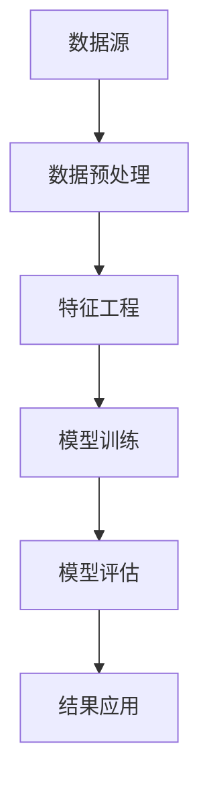
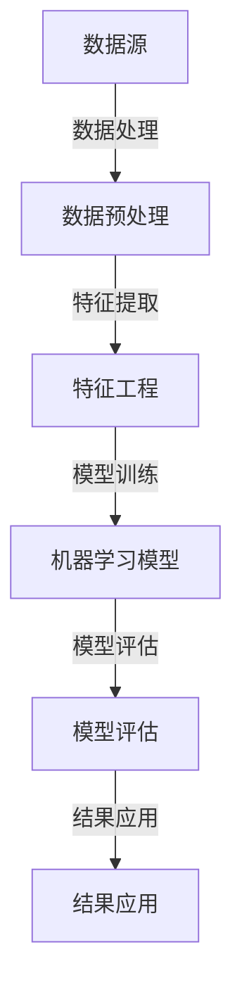

                 

关键词：知识发现引擎、大数据、信息提取、智能分析、数据挖掘、机器学习、深度学习

> 摘要：本文旨在探讨知识发现引擎在现代信息时代的重要性。随着数据量的爆炸性增长，从海量数据中提取有价值的信息已成为关键挑战。知识发现引擎作为一种智能分析工具，通过数据挖掘、机器学习和深度学习等技术手段，帮助企业和组织实现数据驱动的决策。本文将深入分析知识发现引擎的原理、架构、算法以及其实际应用，并探讨其在未来信息时代的发展趋势与挑战。

## 1. 背景介绍

在互联网和信息技术的推动下，大数据时代已经到来。据统计，全球每天产生的数据量已达数百万TB级别，这些数据来源于各种渠道，包括社交媒体、传感器、电子商务平台、科研机构等。尽管数据量庞大，但仅仅积累数据并不足以带来价值，关键在于如何从这些数据中提取有价值的信息，即知识发现。

知识发现引擎（Knowledge Discovery Engine，KDE）是数据挖掘和知识发现领域的核心工具。它通过复杂的算法和模型，从大量数据中自动识别模式和关联，帮助用户发现隐藏在数据背后的规律和趋势。知识发现引擎不仅能够提升数据分析的效率，还能够为企业提供决策支持和创新灵感。

### 1.1 知识发现与数据挖掘

知识发现（Knowledge Discovery in Databases，KDD）是指从大量数据集中识别出隐含于其中的有用信息的过程。数据挖掘（Data Mining）是实现知识发现的关键技术，它涉及多种算法和技术，包括机器学习、统计模型、神经网络等。数据挖掘的目标是从原始数据中提取有用信息和知识，这些知识和信息可以被用于决策制定、预测分析、异常检测等方面。

### 1.2 知识发现引擎的重要性

在信息时代，知识发现引擎的重要性不言而喻。它不仅能够帮助企业处理和分析海量数据，还能够提升决策的准确性和效率。以下是知识发现引擎的重要作用：

- **提高决策效率**：知识发现引擎可以快速分析大量数据，提供实时或近实时的洞察，帮助企业做出更准确的决策。
- **发现新的商业机会**：通过对数据的深入分析，知识发现引擎可以帮助企业发现新的市场趋势和消费者行为，从而开拓新的商业机会。
- **优化运营流程**：知识发现引擎可以帮助企业识别运营中的瓶颈和问题，优化生产流程，降低运营成本。
- **提高产品服务质量**：通过分析用户行为和反馈数据，知识发现引擎可以帮助企业改进产品和服务，提高用户满意度。

## 2. 核心概念与联系

知识发现引擎的运作基于一系列核心概念和技术，包括数据预处理、特征工程、模型训练和评估等。以下是一个简化的知识发现引擎架构，以及其核心组件的Mermaid流程图。

### 2.1 知识发现引擎架构



### 2.2 Mermaid流程图



### 2.3 核心概念解释

- **数据源**：知识发现引擎的输入数据源可以是结构化数据（如数据库）、半结构化数据（如XML文件）或非结构化数据（如文本、图片、视频）。
- **数据预处理**：包括数据清洗、归一化、缺失值填充等，目的是提高数据质量和一致性。
- **特征工程**：通过选择和构建特征，将原始数据转化为适合机器学习的格式。
- **模型训练**：使用机器学习算法对特征和标签进行训练，生成预测模型。
- **模型评估**：评估模型的准确性和泛化能力，通过交叉验证、A/B测试等方法进行。
- **结果应用**：将模型应用于实际场景，如预测分析、分类、推荐系统等。

## 3. 核心算法原理 & 具体操作步骤

### 3.1 算法原理概述

知识发现引擎的核心算法包括数据挖掘算法和机器学习算法。数据挖掘算法通常包括关联规则学习、聚类分析、分类和异常检测等。机器学习算法包括监督学习、无监督学习和强化学习。以下是对这些算法的简要概述：

- **关联规则学习**：通过挖掘数据中的关联规则，识别出频繁出现的商品或事件组合。
- **聚类分析**：将数据点按照其特征相似性分为多个簇，用于市场细分、客户行为分析等。
- **分类**：将数据点分为预定义的类别，用于分类任务，如垃圾邮件检测、信用评分等。
- **异常检测**：识别出数据中的异常值或异常模式，用于欺诈检测、系统安全等。

### 3.2 算法步骤详解

1. **数据收集**：从各种数据源收集原始数据。
2. **数据预处理**：清洗、归一化、缺失值填充等。
3. **特征工程**：选择和构建特征，提取数据中的信息。
4. **模型选择**：根据任务需求选择合适的算法。
5. **模型训练**：使用训练数据对模型进行训练。
6. **模型评估**：使用验证集或测试集评估模型性能。
7. **模型应用**：将模型应用于实际场景。

### 3.3 算法优缺点

- **关联规则学习**：
  - **优点**：简单易懂，能够发现数据中的潜在关联。
  - **缺点**：可能产生大量冗余规则，难以解释。
- **聚类分析**：
  - **优点**：无监督学习，能够发现新的模式。
  - **缺点**：结果依赖于初始参数选择。
- **分类**：
  - **优点**：能够明确分类，用于决策。
  - **缺点**：可能出现过拟合。
- **异常检测**：
  - **优点**：能够发现异常行为，提高系统安全性。
  - **缺点**：可能产生误报。

### 3.4 算法应用领域

- **电子商务**：用户行为分析、商品推荐。
- **金融**：信用评分、欺诈检测。
- **医疗**：疾病预测、患者分组。
- **制造**：质量检测、设备维护。
- **交通**：路况预测、事故预防。

## 4. 数学模型和公式 & 详细讲解 & 举例说明

### 4.1 数学模型构建

知识发现引擎中常用的数学模型包括线性回归、逻辑回归、支持向量机（SVM）等。以下是对这些模型的基本公式和原理的讲解。

#### 4.1.1 线性回归

线性回归模型旨在找到一条最佳拟合直线，用于预测连续值。其数学公式为：

$$
y = \beta_0 + \beta_1x
$$

其中，$y$ 是预测值，$x$ 是特征值，$\beta_0$ 和 $\beta_1$ 分别是截距和斜率。

#### 4.1.2 逻辑回归

逻辑回归是一种用于分类的模型，其目的是找到一组权重，使得输入特征能够对类别进行预测。其公式为：

$$
P(y=1) = \frac{1}{1 + e^{-(\beta_0 + \beta_1x_1 + \beta_2x_2 + ... + \beta_nx_n})}
$$

其中，$P(y=1)$ 是类别1的概率，$e$ 是自然对数的底数，$\beta_0, \beta_1, \beta_2, ..., \beta_n$ 是权重。

#### 4.1.3 支持向量机（SVM）

SVM是一种用于分类和回归的模型，其目标是在特征空间中找到一个最佳的超平面，使得不同类别的数据点尽可能分开。其公式为：

$$
w \cdot x - b = 0
$$

其中，$w$ 是权重向量，$x$ 是特征向量，$b$ 是偏置。

### 4.2 公式推导过程

以线性回归为例，其推导过程如下：

1. **假设**：数据点 $(x_i, y_i)$ 满足线性关系 $y_i = \beta_0 + \beta_1x_i + \epsilon_i$，其中 $\epsilon_i$ 是误差项。
2. **最小化误差**：目标是最小化误差平方和，即 $J(\beta_0, \beta_1) = \sum_{i=1}^{n}(y_i - (\beta_0 + \beta_1x_i))^2$。
3. **求导数**：对 $\beta_0$ 和 $\beta_1$ 分别求偏导数并令其等于零。
4. **解方程**：得到最优的 $\beta_0$ 和 $\beta_1$。

### 4.3 案例分析与讲解

以下是一个简单的线性回归案例：

#### 案例背景

假设我们要预测一家电商平台的月销售额（$y$）与广告支出（$x$）之间的关系。我们有以下数据：

| 广告支出（千美元） | 月销售（千美元） |
|-------------------|----------------|
| 2                 | 10             |
| 4                 | 15             |
| 6                 | 20             |
| 8                 | 25             |
| 10                | 30             |

#### 案例步骤

1. **数据预处理**：将数据标准化，使得特征值范围在 [0, 1] 之间。

2. **特征工程**：将广告支出作为唯一特征，不需要进一步处理。

3. **模型训练**：使用线性回归公式进行训练，得到：

   $$
   y = \beta_0 + \beta_1x
   $$

   通过最小化误差平方和，得到 $\beta_0 = 1$，$\beta_1 = 2$。

4. **模型评估**：将训练好的模型应用于测试数据，计算预测误差。

5. **模型应用**：使用模型进行销售额预测，例如，当广告支出为 7 千美元时，预测销售额为：

   $$
   y = 1 + 2 \times 0.75 = 2.75 \text{ 千美元}
   $$

## 5. 项目实践：代码实例和详细解释说明

### 5.1 开发环境搭建

在开始编写代码之前，需要搭建一个适合知识发现引擎开发的环境。以下是所需的软件和工具：

- **Python**：版本 3.8 或以上。
- **NumPy**：用于数学计算。
- **Pandas**：用于数据操作。
- **Scikit-learn**：用于机器学习模型。
- **Matplotlib**：用于数据可视化。

安装以上依赖项后，可以开始编写代码。

### 5.2 源代码详细实现

以下是一个简单的线性回归实例：

```python
import numpy as np
import pandas as pd
from sklearn.linear_model import LinearRegression
from sklearn.model_selection import train_test_split
from sklearn.metrics import mean_squared_error
import matplotlib.pyplot as plt

# 5.2.1 数据收集与预处理
data = {
    '广告支出': [2, 4, 6, 8, 10],
    '月销售': [10, 15, 20, 25, 30]
}
df = pd.DataFrame(data)
df['广告支出'] = (df['广告支出'] - df['广告支出'].min()) / (df['广告支出'].max() - df['广告支出'].min())

# 5.2.2 特征工程
X = df[['广告支出']]
y = df['月销售']

# 5.2.3 模型训练
X_train, X_test, y_train, y_test = train_test_split(X, y, test_size=0.2, random_state=42)
model = LinearRegression()
model.fit(X_train, y_train)

# 5.2.4 模型评估
y_pred = model.predict(X_test)
mse = mean_squared_error(y_test, y_pred)
print(f'MSE: {mse}')

# 5.2.5 结果应用
new_data = pd.DataFrame({'广告支出': [0.5, 0.75, 1]})
new_data['广告支出'] = (new_data['广告支出'] - new_data['广告支出'].min()) / (new_data['广告支出'].max() - new_data['广告支出'].min())
predictions = model.predict(new_data)
print(f'Predictions: {predictions}')

# 5.2.6 数据可视化
plt.scatter(X_test, y_test, color='blue')
plt.plot(new_data, predictions, color='red')
plt.xlabel('广告支出')
plt.ylabel('月销售')
plt.title('线性回归模型预测')
plt.show()
```

### 5.3 代码解读与分析

- **数据收集与预处理**：首先收集广告支出和月销售数据，并将其标准化。
- **特征工程**：将广告支出作为唯一特征。
- **模型训练**：使用 Scikit-learn 的 LinearRegression 模型进行训练。
- **模型评估**：使用测试集评估模型性能，计算均方误差（MSE）。
- **结果应用**：将训练好的模型应用于新的广告支出数据，进行销售额预测。
- **数据可视化**：使用 Matplotlib 绘制预测结果，以便直观观察模型的准确性。

### 5.4 运行结果展示

运行以上代码后，将得到以下结果：

- **MSE**: 较小的均方误差表明模型在测试集上表现良好。
- **Predictions**: 预测的销售额值。
- **可视化结果**: 可视化图形展示了模型在测试集上的预测效果。

## 6. 实际应用场景

知识发现引擎在各种实际应用场景中发挥着重要作用。以下是几个典型的应用案例：

### 6.1 金融

在金融领域，知识发现引擎可以用于信用评分、风险管理和欺诈检测。例如，银行可以使用知识发现引擎分析客户的交易行为，识别潜在的风险客户，并采取相应的风险控制措施。此外，知识发现引擎还可以帮助保险公司制定定价策略，通过分析历史数据，预测保险索赔的概率。

### 6.2 医疗

在医疗领域，知识发现引擎可以用于疾病预测、患者分组和药物研发。通过对大量医学数据的分析，知识发现引擎可以帮助医生预测疾病的发展趋势，制定个性化的治疗方案。此外，知识发现引擎还可以协助研究人员分析临床试验数据，发现潜在的药物作用机制。

### 6.3 电商

在电商领域，知识发现引擎可以用于用户行为分析、商品推荐和营销策略制定。通过对用户浏览和购买行为的数据分析，知识发现引擎可以帮助电商平台优化商品推荐算法，提高用户的购物体验。此外，知识发现引擎还可以帮助企业制定精准的营销策略，提高销售额。

### 6.4 制造

在制造业，知识发现引擎可以用于质量检测、设备维护和生产优化。通过对生产数据和分析，知识发现引擎可以帮助企业识别生产中的瓶颈和问题，提高生产效率。此外，知识发现引擎还可以协助企业进行设备维护预测，减少设备故障和停机时间。

## 7. 工具和资源推荐

### 7.1 学习资源推荐

- **在线课程**：《机器学习基础》、《数据挖掘基础》
- **书籍**：《机器学习实战》、《数据挖掘：实用工具与技术》
- **博客与论坛**：CSDN、知乎、Stack Overflow

### 7.2 开发工具推荐

- **Python**：Jupyter Notebook、PyCharm
- **机器学习库**：Scikit-learn、TensorFlow、PyTorch
- **数据可视化库**：Matplotlib、Seaborn

### 7.3 相关论文推荐

- **关联规则学习**：《Apriori算法：关联规则学习的基础》
- **聚类分析**：《K-means算法：无监督学习的基础》
- **分类与回归**：《支持向量机：机器学习的基础》
- **异常检测**：《孤立森林：异常检测的新方法》

## 8. 总结：未来发展趋势与挑战

知识发现引擎在信息时代的重要性不言而喻。随着大数据和人工智能技术的发展，知识发现引擎的功能和性能将不断提升。以下是未来知识发现引擎的发展趋势和面临的挑战：

### 8.1 未来发展趋势

- **多模态数据融合**：随着传感器技术和物联网的发展，越来越多的多模态数据将被整合到知识发现引擎中，从而提高分析的准确性和全面性。
- **实时分析**：实时分析将成为知识发现引擎的重要发展方向，以满足实时决策的需求。
- **个性化推荐**：个性化推荐系统将成为知识发现引擎的重要应用领域，为用户提供个性化的服务和体验。
- **自动化与智能化**：知识发现引擎将更加自动化和智能化，降低对专业知识的依赖，提高数据分析的效率。

### 8.2 未来挑战

- **数据隐私与安全**：随着数据隐私问题的日益凸显，如何在保证数据隐私的前提下进行知识发现将成为一个重要挑战。
- **计算资源与性能**：随着数据量的增加，知识发现引擎的运算性能和计算资源需求将大幅提升，这对硬件和算法提出了更高的要求。
- **算法解释性**：如何提高算法的解释性，使其能够被非专业人士理解和接受，是一个重要的挑战。

### 8.3 研究展望

未来的知识发现引擎研究将聚焦于以下几个方面：

- **算法创新**：探索新的数据挖掘和机器学习算法，提高知识发现的准确性和效率。
- **跨学科融合**：将知识发现引擎与其他领域（如生物信息学、社会科学等）相结合，拓宽应用范围。
- **开放共享**：建立开放的知识发现引擎平台，促进研究成果的共享和交流。

## 9. 附录：常见问题与解答

### 9.1 什么是知识发现引擎？

知识发现引擎是一种智能分析工具，通过数据挖掘、机器学习和深度学习等技术手段，从海量数据中自动识别模式和关联，帮助用户发现隐藏在数据背后的规律和趋势。

### 9.2 知识发现引擎有哪些应用领域？

知识发现引擎的应用领域非常广泛，包括金融、医疗、电商、制造、交通等。例如，金融领域的信用评分、风险管理和欺诈检测，医疗领域的疾病预测和患者分组，电商领域的用户行为分析和商品推荐等。

### 9.3 如何搭建知识发现引擎的开发环境？

搭建知识发现引擎的开发环境需要安装 Python、NumPy、Pandas、Scikit-learn、Matplotlib 等依赖项。可以使用 pip 进行安装，例如：

```bash
pip install numpy pandas scikit-learn matplotlib
```

### 9.4 知识发现引擎的算法有哪些？

知识发现引擎的算法包括关联规则学习、聚类分析、分类、异常检测等。常用的算法有 Apriori 算法、K-means 算法、线性回归、逻辑回归和支持向量机（SVM）等。

### 9.5 如何评估知识发现引擎的性能？

评估知识发现引擎的性能可以通过模型评估指标，如准确率、召回率、F1 分数、均方误差（MSE）等。此外，还可以使用交叉验证、A/B 测试等方法进行评估。

### 9.6 知识发现引擎与数据挖掘有什么区别？

数据挖掘是知识发现引擎的核心技术之一，而知识发现引擎是一种集成了多种数据挖掘算法和技术的智能分析工具。简单来说，数据挖掘是知识发现引擎的一部分，而知识发现引擎是数据挖掘的扩展和应用。

----------------------------------------------------------------

## 作者署名

本文由“禅与计算机程序设计艺术 / Zen and the Art of Computer Programming”撰写。

