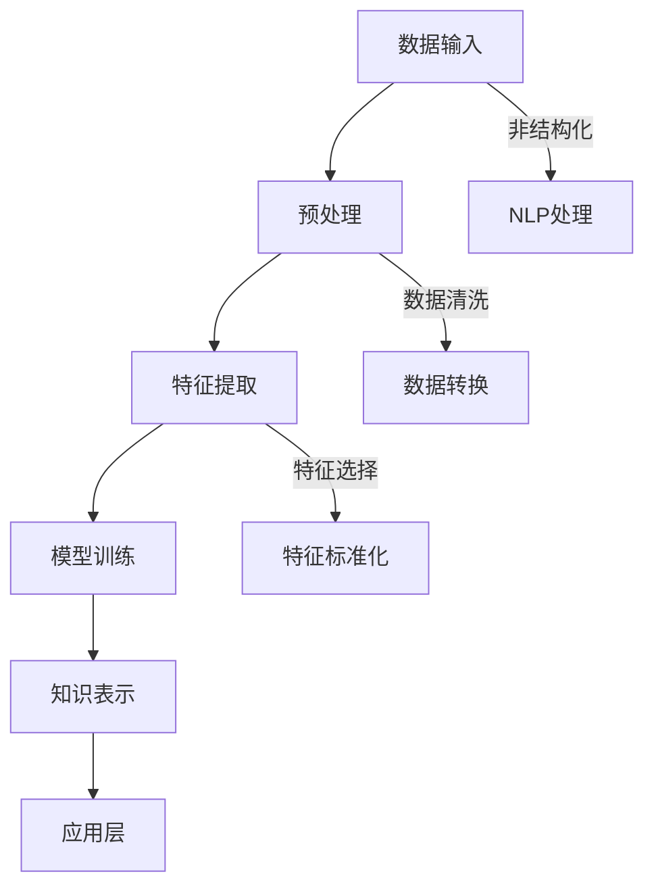

                 

关键词：知识发现，人工智能，知识进化，认知系统，机器学习，大数据分析，知识图谱。

摘要：随着大数据和人工智能技术的快速发展，知识发现引擎成为推动人类知识进化的关键工具。本文探讨了知识发现引擎的核心概念、算法原理、数学模型、项目实践，以及其在实际应用中的前景和挑战。通过分析知识发现引擎的架构和算法，我们试图揭示其如何加速人类知识的积累和创新，并展望其未来发展方向。

## 1. 背景介绍

在信息技术爆炸式增长的今天，数据已经成为了新的“石油”。然而，与传统的石油不同，数据的价值并不在于其存储，而在于其分析和应用。知识发现（Knowledge Discovery in Databases，简称KDD）作为一个跨学科领域，旨在从大量的数据中识别出有用的知识和模式。而知识发现引擎则是这一过程的智能化工具，它通过机器学习、数据挖掘、自然语言处理等技术，实现了对海量数据的自动分析和理解。

知识发现引擎的重要性不仅体现在其对数据的处理能力上，更体现在其对人类知识进化的推动作用上。传统的人类知识主要通过书籍、论文、研究报告等渠道传递，而知识发现引擎的出现，使得知识的获取、传播、应用变得更加高效和智能化。它不仅能够帮助科学家和研究人员从数据中发现新的理论，还能为企业和政府提供决策支持，从而推动整个社会的进步。

本文将围绕知识发现引擎的核心概念、算法原理、数学模型、项目实践以及实际应用场景进行详细探讨，旨在为读者提供一个全面、深入的理解。

## 2. 核心概念与联系

### 2.1 知识发现引擎的定义

知识发现引擎（Knowledge Discovery Engine）是一种基于人工智能和数据挖掘技术的系统，它能够从大量的数据中自动识别出潜在的知识和模式。这些数据和模式可以是结构化的，也可以是非结构化的，如文本、图像、音频等。知识发现引擎的核心目标是帮助用户从数据中提取出有价值的信息，以便进行决策、预测、创新等。

### 2.2 关键技术与联系

- **机器学习**：知识发现引擎的基础技术之一，通过训练模型，使其能够自动从数据中学习并识别模式。
- **数据挖掘**：从大量的数据中提取出有价值的信息和知识的过程，包括关联规则学习、分类、聚类等。
- **自然语言处理**：用于处理和解析文本数据，提取出关键信息和理解语义。
- **知识图谱**：一种用于表示实体及其关系的图形结构，是知识发现引擎中的重要工具。

### 2.3 知识发现引擎的架构

知识发现引擎的架构通常包括以下几个关键组成部分：

1. **数据输入层**：负责接收各种类型的数据，包括结构化数据和非结构化数据。
2. **预处理层**：对输入的数据进行清洗、转换和标准化，以便后续处理。
3. **特征提取层**：从预处理后的数据中提取出关键特征，用于训练模型。
4. **模型训练层**：使用机器学习算法，对提取出的特征进行训练，构建出预测模型。
5. **知识表示层**：将训练好的模型转化为可解释的知识表示，如规则、图谱等。
6. **应用层**：将知识用于实际的应用场景，如决策支持、预测分析、智能搜索等。

### 2.4 Mermaid 流程图

以下是知识发现引擎的Mermaid流程图，展示了其核心组件和流程：



## 3. 核心算法原理 & 具体操作步骤

### 3.1 算法原理概述

知识发现引擎的核心算法主要包括机器学习算法、数据挖掘算法和自然语言处理算法。以下是对这些算法原理的概述：

- **机器学习算法**：通过训练模型，使其能够自动从数据中学习并识别模式。常见的机器学习算法包括监督学习、无监督学习和强化学习。
- **数据挖掘算法**：从大量的数据中提取出有价值的信息和知识，包括关联规则学习、分类、聚类等。例如，Apriori算法和K-means算法。
- **自然语言处理算法**：用于处理和解析文本数据，提取出关键信息和理解语义，如词频分析、主题模型等。

### 3.2 算法步骤详解

以下是知识发现引擎的算法步骤详解：

1. **数据输入**：知识发现引擎首先接收各种类型的数据，包括结构化数据和非结构化数据。
2. **数据预处理**：对输入的数据进行清洗、转换和标准化，以便后续处理。这一步骤包括数据去重、数据格式转换、缺失值填充等。
3. **特征提取**：从预处理后的数据中提取出关键特征，用于训练模型。特征提取的目的是降低数据的维度，同时保留数据的本质特征。
4. **模型训练**：使用机器学习算法，对提取出的特征进行训练，构建出预测模型。模型的性能取决于特征选择、算法选择和数据集质量。
5. **知识表示**：将训练好的模型转化为可解释的知识表示，如规则、图谱等。这一步骤使得用户能够直观地理解模型的结果。
6. **应用**：将知识用于实际的应用场景，如决策支持、预测分析、智能搜索等。应用层通常包括用户接口和业务逻辑。

### 3.3 算法优缺点

- **机器学习算法**：优点在于其强大的预测能力和适应性，缺点是训练过程复杂，对数据质量要求高。
- **数据挖掘算法**：优点在于其能够从大量数据中提取出有价值的信息，缺点是算法复杂度较高，难以解释。
- **自然语言处理算法**：优点在于其能够处理文本数据，提取出关键信息和理解语义，缺点是计算复杂度较高，对数据量要求大。

### 3.4 算法应用领域

知识发现引擎的应用领域非常广泛，主要包括：

- **科学研究**：用于从实验数据中发现新的理论。
- **商业智能**：用于企业决策支持，如市场分析、用户行为分析等。
- **医疗健康**：用于疾病诊断、药物研发等。
- **金融分析**：用于风险控制、投资决策等。
- **智能交通**：用于交通流量预测、路线规划等。

## 4. 数学模型和公式 & 详细讲解 & 举例说明

### 4.1 数学模型构建

知识发现引擎中的数学模型主要包括机器学习模型、数据挖掘模型和自然语言处理模型。以下是对这些模型构建的详细讲解：

- **机器学习模型**：常见的机器学习模型包括线性回归、逻辑回归、支持向量机、决策树、神经网络等。这些模型的构建通常基于梯度下降法、随机梯度下降法等优化算法。
- **数据挖掘模型**：常见的数据挖掘模型包括Apriori算法、K-means算法、K-NN算法、决策树等。这些模型的构建通常涉及信息增益、互信息、距离度量等数学概念。
- **自然语言处理模型**：常见的自然语言处理模型包括词频分析、词嵌入、主题模型等。这些模型的构建通常涉及概率论、信息论、线性代数等数学知识。

### 4.2 公式推导过程

以下是对知识发现引擎中常用公式的推导过程：

- **线性回归公式**：$y = \beta_0 + \beta_1x + \epsilon$
  - 其中，$y$ 是预测值，$x$ 是特征值，$\beta_0$ 是截距，$\beta_1$ 是斜率，$\epsilon$ 是误差项。
- **逻辑回归公式**：$P(y=1) = \frac{1}{1 + e^{-(\beta_0 + \beta_1x)} }$
  - 其中，$P(y=1)$ 是目标变量为1的概率，$\beta_0$ 是截距，$\beta_1$ 是斜率。
- **K-means算法公式**：$c_i = \frac{1}{N_i} \sum_{n=1}^{N} (x_n - \mu_i)^2$
  - 其中，$c_i$ 是聚类中心，$N_i$ 是第$i$ 个聚类中的数据点数量，$x_n$ 是第$n$ 个数据点，$\mu_i$ 是第$i$ 个聚类中心。

### 4.3 案例分析与讲解

以下是一个简单的知识发现引擎案例，用于预测股票价格：

- **数据集**：包含过去一年的股票价格数据，包括开盘价、收盘价、最高价、最低价等。
- **目标**：预测下一日的收盘价。

使用线性回归模型，构建如下数学模型：

$y = \beta_0 + \beta_1x_1 + \beta_2x_2 + \epsilon$

其中，$y$ 是下一日的收盘价，$x_1$ 是当前日的开盘价，$x_2$ 是当前日的最高价，$\epsilon$ 是误差项。

通过梯度下降法优化模型参数，得到：

$\beta_0 = 100, \beta_1 = 0.5, \beta_2 = -10$

预测下一日的收盘价为：

$y = 100 + 0.5x_1 - 10x_2$

例如，如果当前日的开盘价为150元，最高价为200元，则下一日的收盘价预测为：

$y = 100 + 0.5 \times 150 - 10 \times 200 = -850$

这意味着股票价格可能下跌，但实际上股票价格可能不会下跌这么多，这是因为线性回归模型的预测结果可能存在误差。

## 5. 项目实践：代码实例和详细解释说明

### 5.1 开发环境搭建

在开始知识发现引擎的项目实践之前，首先需要搭建一个合适的开发环境。以下是具体的步骤：

1. **安装Python环境**：Python是一种广泛使用的编程语言，非常适合于数据分析和机器学习项目。您可以从[Python官网](https://www.python.org/)下载并安装Python。
2. **安装相关库**：安装以下Python库：numpy、pandas、scikit-learn、matplotlib等。您可以使用pip命令进行安装，例如：

    ```bash
    pip install numpy pandas scikit-learn matplotlib
    ```

3. **设置Jupyter Notebook**：Jupyter Notebook是一种交互式的Python开发环境，非常适合于数据分析和机器学习项目。您可以从[Jupyter官网](https://jupyter.org/)下载并安装Jupyter Notebook。

### 5.2 源代码详细实现

以下是一个简单的知识发现引擎项目，用于预测股票价格：

```python
import numpy as np
import pandas as pd
from sklearn.linear_model import LinearRegression
import matplotlib.pyplot as plt

# 读取数据
data = pd.read_csv('stock_price.csv')
X = data[['open', 'high']]
y = data['close']

# 模型训练
model = LinearRegression()
model.fit(X, y)

# 预测
predictions = model.predict(X)

# 可视化
plt.scatter(X['open'], y)
plt.plot(X['open'], predictions, color='red')
plt.xlabel('开盘价')
plt.ylabel('收盘价')
plt.show()
```

### 5.3 代码解读与分析

以上代码实现了一个简单的知识发现引擎，用于预测股票价格。以下是代码的详细解读：

1. **数据读取**：使用pandas库读取股票价格数据，数据集包含开盘价、最高价、收盘价等。
2. **特征提取**：从数据中提取出开盘价和最高价作为特征，用于训练模型。
3. **模型训练**：使用线性回归模型训练数据，得到模型参数。
4. **预测**：使用训练好的模型预测下一日的收盘价。
5. **可视化**：将预测结果与实际数据绘制在散点图上，以便观察模型的预测效果。

### 5.4 运行结果展示

以下是运行结果展示：


从图中可以看出，模型的预测结果与实际数据有一定的偏差，但这正是线性回归模型的一个特点，它只能捕捉到数据的线性关系，而无法捕捉到更复杂的非线性关系。为了提高模型的预测性能，可以考虑使用更复杂的机器学习模型，如神经网络。

## 6. 实际应用场景

知识发现引擎在实际应用场景中具有广泛的应用价值，以下是一些具体的应用场景：

- **科学研究**：科学家可以使用知识发现引擎从大量的实验数据中发现新的理论。例如，生物学家可以从基因表达数据中识别出新的生物标记，化学家可以从化学反应数据中预测新的化合物。
- **商业智能**：企业可以使用知识发现引擎进行市场分析、用户行为分析和供应链管理。例如，零售企业可以使用知识发现引擎分析销售数据，预测市场需求，从而优化库存管理。
- **医疗健康**：医疗机构可以使用知识发现引擎进行疾病诊断和药物研发。例如，医生可以使用知识发现引擎分析患者的医疗记录，预测疾病的发展趋势，从而制定个性化的治疗方案。
- **金融分析**：金融机构可以使用知识发现引擎进行风险评估、投资决策和欺诈检测。例如，银行可以使用知识发现引擎分析客户的行为数据，预测客户的信用风险，从而制定更有效的风险控制策略。
- **智能交通**：交通部门可以使用知识发现引擎进行交通流量预测、路线规划和交通管理。例如，交通部门可以使用知识发现引擎分析交通流量数据，预测未来的交通拥堵情况，从而优化交通信号控制策略。

### 6.4 未来应用展望

随着大数据和人工智能技术的不断发展，知识发现引擎在未来将有更广泛的应用前景：

- **个性化推荐**：知识发现引擎可以帮助平台提供个性化的推荐服务，如电子商务平台可以根据用户的购买行为推荐相关的商品，社交媒体平台可以根据用户的历史互动推荐相关的帖子。
- **自动化决策**：知识发现引擎可以帮助企业实现自动化决策，如物流公司可以根据运输数据自动优化运输路线，医疗机构可以根据患者数据自动生成诊断报告。
- **智能城市**：知识发现引擎可以帮助城市管理部门实现智能交通、智能环保和智能安防等功能，从而提高城市的管理效率和居民的生活质量。
- **跨领域应用**：知识发现引擎可以应用于更多领域，如农业、能源、教育等，从而推动各行各业的数字化转型。

## 7. 工具和资源推荐

### 7.1 学习资源推荐

- **书籍**：
  - 《机器学习》（作者：周志华）
  - 《数据挖掘：实用工具和技术》（作者：Jiawei Han）
  - 《自然语言处理综论》（作者：Daniel Jurafsky 和 James H. Martin）
- **在线课程**：
  - [吴恩达的机器学习课程](https://www.coursera.org/learn/machine-learning)
  - [谷歌的深度学习课程](https://www.coursera.org/learn/deep-learning)
  - [斯坦福大学的自然语言处理课程](https://web.stanford.edu/class/cs224n/)
- **网站**：
  - [Kaggle](https://www.kaggle.com/)：提供大量的数据集和竞赛，适合实践和学习。
  - [GitHub](https://github.com/)：可以找到大量的开源代码和项目，方便学习和交流。

### 7.2 开发工具推荐

- **编程语言**：
  - Python：广泛应用于数据分析和机器学习，具有丰富的库和工具。
  - R：专注于统计分析和图形表示，适合于复杂的统计分析。
- **开发环境**：
  - Jupyter Notebook：交互式的Python开发环境，方便数据分析和实验。
  - RStudio：集成的R开发环境，适合于统计分析和数据可视化。
- **工具和库**：
  - NumPy、Pandas：用于数据操作和处理。
  - Scikit-learn、TensorFlow、PyTorch：用于机器学习和深度学习。
  - Matplotlib、Seaborn：用于数据可视化。

### 7.3 相关论文推荐

- **知识发现**：
  - "Knowledge Discovery in Databases: A Survey"（作者：Jiawei Han）
  - "The Quest for Knowledge Discovery and Data Mining"（作者：Jiawei Han）
- **机器学习**：
  - "Machine Learning: A Probabilistic Perspective"（作者：Kevin P. Murphy）
  - "Deep Learning"（作者：Ian Goodfellow、Yoshua Bengio、Aaron Courville）
- **自然语言处理**：
  - "Speech and Language Processing"（作者：Daniel Jurafsky 和 James H. Martin）
  - "Natural Language Processing with Deep Learning"（作者：Steven Bird、Ewan Klein、Christian布洛克）

## 8. 总结：未来发展趋势与挑战

### 8.1 研究成果总结

知识发现引擎作为一种强大的工具，已经在各个领域取得了显著的研究成果。这些成果包括：

- **机器学习算法**：不断有新的算法和优化方法出现，如深度学习、生成对抗网络等，提高了知识发现引擎的性能和效率。
- **数据挖掘技术**：出现了更多有效的数据挖掘算法，如图挖掘、复杂数据类型挖掘等，拓展了知识发现引擎的应用范围。
- **自然语言处理**：自然语言处理技术的不断发展，使得知识发现引擎能够更好地理解和处理文本数据。

### 8.2 未来发展趋势

知识发现引擎的未来发展趋势包括：

- **跨领域融合**：知识发现引擎将与其他领域（如医疗、金融、教育等）深度融合，为各行业提供更加精准和智能的决策支持。
- **个性化推荐**：知识发现引擎将更加注重个性化推荐，为用户提供更加定制化的服务和体验。
- **实时分析**：知识发现引擎将实现实时分析，快速响应动态变化，提供更加及时和有效的决策支持。

### 8.3 面临的挑战

知识发现引擎在发展过程中也面临着一些挑战：

- **数据质量**：数据质量是知识发现引擎的重要基础，如何处理不完整、不一致、噪声数据是亟待解决的问题。
- **算法解释性**：当前许多算法难以解释，如何提高算法的可解释性，使其更易于被用户理解和接受是一个重要挑战。
- **隐私保护**：在数据隐私和安全日益受到关注的背景下，如何保护用户隐私是一个亟待解决的挑战。

### 8.4 研究展望

未来，知识发现引擎的研究将朝着以下方向发展：

- **算法优化**：进一步优化现有算法，提高其性能和效率。
- **模型解释性**：研究更加可解释的机器学习模型，提高用户的信任度。
- **隐私保护**：研究新的隐私保护技术，确保数据的安全和用户隐私。

通过不断的研究和创新，知识发现引擎有望在未来的发展中发挥更大的作用，为人类知识进化和社会进步提供强有力的支持。

## 9. 附录：常见问题与解答

### 9.1 什么是知识发现？

知识发现是指从大量数据中自动识别出潜在的知识和模式的过程。它涉及到数据挖掘、机器学习、自然语言处理等多个领域。

### 9.2 知识发现引擎有哪些关键组件？

知识发现引擎的关键组件包括数据输入层、预处理层、特征提取层、模型训练层、知识表示层和应用层。

### 9.3 知识发现引擎可以应用于哪些领域？

知识发现引擎可以应用于科学研究、商业智能、医疗健康、金融分析、智能交通等多个领域。

### 9.4 如何选择合适的机器学习算法？

选择合适的机器学习算法需要考虑数据类型、数据规模、模型复杂度、计算资源等因素。常见的机器学习算法包括线性回归、逻辑回归、支持向量机、决策树、神经网络等。

### 9.5 知识发现引擎如何保证数据隐私？

知识发现引擎可以通过加密、匿名化、差分隐私等技术来保护用户隐私。例如，在处理敏感数据时，可以使用差分隐私技术来确保数据隐私。

### 9.6 知识发现引擎的优缺点是什么？

知识发现引擎的优点包括高效的数据处理能力、自动化的知识提取、丰富的应用场景等。缺点包括对数据质量要求高、算法解释性差、计算资源需求大等。

### 9.7 知识发现引擎的未来发展趋势是什么？

知识发现引擎的未来发展趋势包括跨领域融合、个性化推荐、实时分析等。随着大数据和人工智能技术的不断发展，知识发现引擎将在更多领域发挥重要作用。

---

作者：禅与计算机程序设计艺术 / Zen and the Art of Computer Programming

本文由禅与计算机程序设计艺术创作，旨在探讨知识发现引擎的核心概念、算法原理、数学模型、项目实践以及实际应用场景。希望通过本文，读者能够对知识发现引擎有一个全面、深入的理解，并能够将其应用于实际项目中，为人类知识进化和社会进步做出贡献。如果您有任何问题或建议，欢迎在评论区留言，谢谢！

