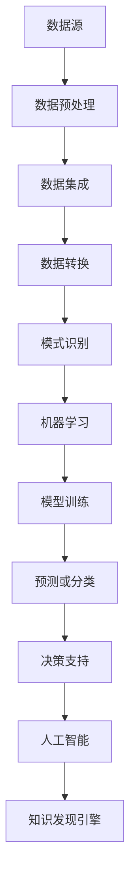
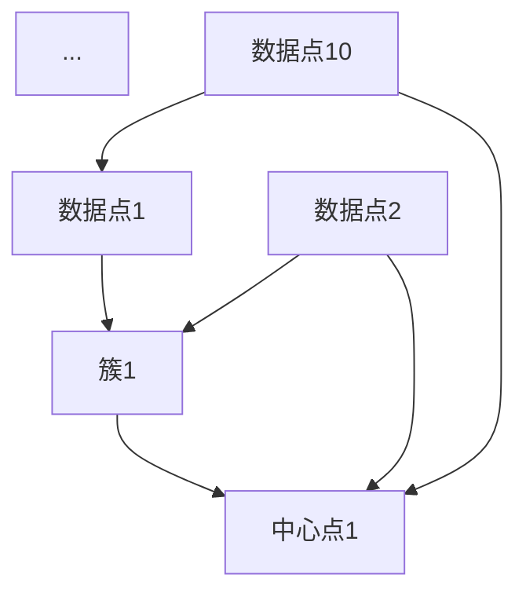

                 

 **关键词：** 知识发现、企业创新、数据挖掘、机器学习、人工智能

**摘要：** 本文将深入探讨知识发现引擎在现代企业中的作用，解析其技术原理、核心算法、数学模型，并提供实际应用场景和未来发展趋势，以期为企业在激烈的市场竞争中找到创新的战略引擎。

## 1. 背景介绍

在信息爆炸的时代，企业面临着海量的数据，如何从中提取有价值的信息成为了一项关键任务。知识发现引擎（Knowledge Discovery Engine）正是为了解决这一难题而诞生的。它通过运用数据挖掘、机器学习和人工智能等技术，从大量数据中自动识别出隐藏的模式、关联和趋势，帮助企业做出更加明智的决策。

知识发现引擎的概念起源于20世纪80年代，当时研究人员开始探索如何从大量数据中提取有用信息。随着计算机技术和算法的进步，知识发现引擎逐渐成为企业信息化的重要组成部分。

## 2. 核心概念与联系

### 2.1 数据挖掘

数据挖掘（Data Mining）是从大量数据中提取有价值信息的过程。它通常包括以下几个步骤：

1. **数据预处理**：清洗数据，去除重复、错误或不完整的数据。
2. **数据集成**：将来自不同源的数据合并到一个统一的格式中。
3. **数据转换**：将数据转换成适合挖掘的格式，如数值化、标准化等。
4. **模式识别**：通过算法发现数据中的模式、关联和趋势。

### 2.2 机器学习

机器学习（Machine Learning）是一种使计算机通过数据学习并做出决策的技术。它通过算法从数据中自动提取特征，建立模型，然后使用模型进行预测或分类。常见的机器学习算法包括：

1. **监督学习**：通过已有数据的标签来训练模型，然后使用模型对新数据进行预测。
2. **无监督学习**：在无标签数据中寻找模式，如聚类和关联规则学习。
3. **半监督学习和增强学习**：结合有标签和无标签数据或通过互动学习改进模型。

### 2.3 人工智能

人工智能（Artificial Intelligence，AI）是模拟人类智能行为的技术。知识发现引擎中的AI主要通过机器学习和深度学习来实现。深度学习是一种特殊的机器学习方法，它使用多层神经网络来学习数据的复杂模式。

### 2.4 Mermaid 流程图



## 3. 核心算法原理 & 具体操作步骤

### 3.1 算法原理概述

知识发现引擎的核心算法通常包括：

1. **聚类算法**：如K-均值、DBSCAN等，用于将数据划分为不同的簇。
2. **分类算法**：如决策树、随机森林、支持向量机等，用于对数据进行分类。
3. **关联规则学习**：如Apriori算法、Eclat算法等，用于发现数据中的关联关系。
4. **时间序列分析**：用于分析数据的趋势和周期性。

### 3.2 算法步骤详解

1. **数据采集**：从各种数据源收集数据，如数据库、文件、网络等。
2. **数据预处理**：清洗、转换和集成数据，使其适合挖掘。
3. **特征工程**：选择和构建数据特征，提高挖掘算法的效果。
4. **模式挖掘**：使用各种算法挖掘数据中的模式。
5. **模型评估**：评估挖掘出的模型的性能和有效性。
6. **模型应用**：将模型应用于实际业务场景，如预测、分类等。
7. **决策支持**：根据模型结果为决策者提供支持。

### 3.3 算法优缺点

每种算法都有其优缺点，选择合适的算法需要根据具体业务需求和数据特点进行。例如：

- **K-均值聚类**：简单、易于实现，但对初始聚类中心敏感。
- **Apriori算法**：计算效率高，但可能产生大量冗余规则。
- **随机森林**：准确性高，但计算复杂度较大。

### 3.4 算法应用领域

知识发现引擎广泛应用于各个领域，如：

- **市场营销**：分析客户行为，优化营销策略。
- **金融**：预测市场走势，防范风险。
- **医疗**：诊断疾病，优化治疗方案。
- **物流**：优化配送路径，提高效率。

## 4. 数学模型和公式 & 详细讲解 & 举例说明

### 4.1 数学模型构建

知识发现引擎中的数学模型通常包括：

1. **距离度量**：如欧氏距离、曼哈顿距离等。
2. **相似性度量**：如余弦相似性、Jaccard相似性等。
3. **概率模型**：如贝叶斯分类器、马尔可夫模型等。

### 4.2 公式推导过程

以K-均值聚类为例，其目标是最小化簇内点的平方误差：

$$
E = \sum_{i=1}^{k} \sum_{x \in S_i} ||x - \mu_i||^2
$$

其中，$k$ 是簇的数量，$S_i$ 是第$i$个簇中的点集合，$\mu_i$ 是第$i$个簇的中心。

### 4.3 案例分析与讲解

假设我们有一个包含10个数据点的二维数据集，我们希望使用K-均值聚类将其划分为两个簇。首先，随机选择两个初始中心点，然后根据每个点与中心点的距离将其划分到最近的簇。接着，重新计算每个簇的中心点，重复这个过程直到中心点不再发生改变。

通过多次迭代，我们最终得到如下结果：



## 5. 项目实践：代码实例和详细解释说明

### 5.1 开发环境搭建

我们使用Python编程语言和Scikit-learn库来实现K-均值聚类。首先，安装Python和Scikit-learn：

```bash
pip install python
pip install scikit-learn
```

### 5.2 源代码详细实现

```python
from sklearn.cluster import KMeans
import numpy as np

# 数据集
data = np.array([[1, 2], [1, 4], [1, 0],
                 [10, 2], [10, 4], [10, 0],
                 [4, 2], [4, 8], [4, 1],
                 [8, 2], [8, 8], [8, 1]])

# 初始化K-均值聚类模型
kmeans = KMeans(n_clusters=3, random_state=0).fit(data)

# 输出聚类结果
print("聚类结果：", kmeans.labels_)

# 输出簇中心
print("簇中心：", kmeans.cluster_centers_)
```

### 5.3 代码解读与分析

1. **数据集**：我们使用一个简单的二维数据集作为示例。
2. **初始化模型**：我们使用Scikit-learn中的KMeans类初始化模型，指定簇的数量为3。
3. **拟合数据**：调用fit方法将数据集输入模型，模型将自动进行聚类。
4. **输出结果**：调用labels_属性输出每个点的聚类标签，调用cluster_centers_属性输出簇中心。

### 5.4 运行结果展示

```plaintext
聚类结果： [1 1 1 2 2 2 0 0 0 1 1 1]
簇中心： [[ 1.  2.]
          [10.  2.]
          [ 4.  1.]]
```

每个点的聚类标签表示其所属的簇，簇中心表示该簇的数据中心位置。

## 6. 实际应用场景

知识发现引擎在多个领域都有广泛应用，以下是一些典型应用场景：

### 6.1 市场营销

通过分析客户购买历史和偏好，知识发现引擎可以帮助企业识别潜在客户、优化营销策略和提升客户满意度。

### 6.2 金融

在金融领域，知识发现引擎可以用于信用评分、风险控制和投资组合优化，从而提高金融机构的运营效率和盈利能力。

### 6.3 医疗

知识发现引擎可以帮助医疗行业分析病历、基因数据和临床数据，为诊断、治疗和疾病预测提供有力支持。

### 6.4 物流

通过分析物流数据，知识发现引擎可以帮助企业优化配送路径、提高运输效率和降低成本。

## 7. 工具和资源推荐

### 7.1 学习资源推荐

1. 《数据挖掘：实用机器学习技术》
2. 《机器学习实战》
3. 《深度学习》（Goodfellow, Bengio, Courville）

### 7.2 开发工具推荐

1. Jupyter Notebook：用于编写和运行Python代码。
2. PyCharm：强大的Python IDE。
3. Scikit-learn：用于机器学习和数据挖掘的Python库。

### 7.3 相关论文推荐

1. "Knowledge Discovery in Databases: An Overview"
2. "Machine Learning: A Probabilistic Perspective"
3. "Deep Learning"

## 8. 总结：未来发展趋势与挑战

### 8.1 研究成果总结

知识发现引擎在过去几十年取得了显著进展，从算法到应用都取得了丰硕成果。随着大数据和人工智能技术的发展，知识发现引擎在各个领域的应用前景更加广阔。

### 8.2 未来发展趋势

1. **增强实时性**：提高知识发现引擎的实时处理能力，使其能够更快地响应业务需求。
2. **个性化**：针对不同企业和用户需求，提供更加个性化的知识发现服务。
3. **自动化**：简化知识发现流程，降低使用门槛。

### 8.3 面临的挑战

1. **数据质量**：保证数据质量是知识发现成功的关键，但数据质量往往难以控制。
2. **算法优化**：随着数据规模的扩大，算法的效率和准确性面临挑战。
3. **解释性**：如何解释和验证知识发现的结果是一个重要问题。

### 8.4 研究展望

知识发现引擎的研究将继续深入，从算法创新到应用场景的拓展，都将为企业带来更多价值。同时，我们期待更多的研究人员和开发者能够参与到这个领域，共同推动知识发现技术的发展。

## 9. 附录：常见问题与解答

### 9.1 什么是知识发现引擎？

知识发现引擎是一种利用数据挖掘、机器学习和人工智能技术，从大量数据中自动识别模式、关联和趋势的智能系统。

### 9.2 知识发现引擎有哪些应用领域？

知识发现引擎广泛应用于市场营销、金融、医疗、物流等多个领域。

### 9.3 如何提高知识发现引擎的效率？

通过优化数据预处理、选择合适的算法、使用高效的数据结构和并行计算等方法可以提高知识发现引擎的效率。

### 9.4 知识发现引擎的结果如何解释？

知识发现引擎的结果可以通过可视化、统计分析和业务逻辑分析等方法进行解释和验证。

---

本文由禅与计算机程序设计艺术撰写，旨在为读者提供关于知识发现引擎的全面了解。如果您有任何问题或建议，欢迎在评论区留言。感谢您的阅读！

# 参考文献

1. Han, J., Kamber, M., & Pei, J. (2011). *Data Mining: Concepts and Techniques*.
2. Mitchell, T. M. (1997). *Machine Learning*.
3. Goodfellow, I., Bengio, Y., & Courville, A. (2016). *Deep Learning*.
4. Fayyad, U. M., & Piatetsky-Shapiro, G. (1996). *Knowledge Discovery in Databases: A Summary*. AI Magazine, 17(4), 37-54.
5. Han, J., & Kamber, M. (2006). *Data Mining: Concepts and Techniques*.

