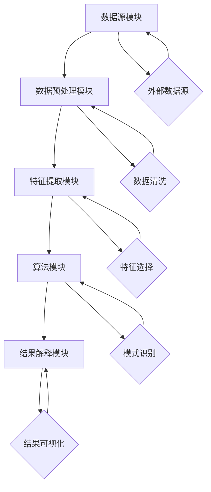

                 

关键词：知识发现引擎、医疗领域、智慧转型、人工智能、大数据分析、算法优化、算法应用、数学模型、案例解析、开发实践、工具资源推荐

> 摘要：本文将深入探讨知识发现引擎在医疗领域中的应用，分析其如何助力医疗行业的智慧转型。通过介绍知识发现引擎的核心概念、算法原理、数学模型及实际应用案例，本文旨在为读者提供一个全面的技术视角，以理解这一先进技术如何推动医疗领域的创新与发展。

## 1. 背景介绍

### 1.1 医疗领域的现状

随着科技的飞速发展，医疗行业正经历着前所未有的变革。传统医疗模式已经无法满足日益增长的医疗需求和复杂的临床问题。大数据、人工智能（AI）、物联网（IoT）等新兴技术的涌现，为医疗行业带来了新的机遇和挑战。其中，人工智能在医疗领域的应用尤为引人注目，包括疾病预测、诊断辅助、药物研发等多个方面。

### 1.2 智慧转型的需求

智慧医疗是未来医疗行业发展的关键方向，其核心在于通过技术创新提高医疗服务的效率和质量。然而，智慧转型的过程中，数据驱动的知识发现成为关键环节。医疗领域的数据量庞大且复杂，如何从海量数据中提取有价值的信息，为医疗决策提供支持，成为当前研究的热点。

### 1.3 知识发现引擎的兴起

知识发现引擎（Knowledge Discovery Engine，简称KDE）是一种利用人工智能技术从大规模数据集中自动挖掘知识、模式的工具。KDE不仅能够处理结构化数据，还能处理非结构化数据，如文本、图像、声音等。其核心功能包括数据预处理、特征提取、模式识别、关联规则挖掘等。

## 2. 核心概念与联系

### 2.1 知识发现引擎的定义

知识发现引擎是一种集成多种数据挖掘算法和技术的系统，旨在从大规模数据集中自动发现有趣的知识和模式。这些知识可以用于辅助决策、预测分析、风险控制等方面。

### 2.2 知识发现引擎的架构

知识发现引擎的架构通常包括以下几个核心模块：

- **数据源模块**：负责数据采集、数据清洗和数据整合。
- **数据预处理模块**：对原始数据进行格式化、去噪、归一化等处理。
- **特征提取模块**：从预处理后的数据中提取有助于分析的特征。
- **算法模块**：实现各种数据挖掘算法，如聚类、分类、关联规则挖掘等。
- **结果解释模块**：对挖掘结果进行可视化、解释和评价。

### 2.3 Mermaid 流程图



## 3. 核心算法原理 & 具体操作步骤

### 3.1 算法原理概述

知识发现引擎的核心算法包括聚类算法、分类算法、关联规则挖掘算法等。这些算法的基本原理如下：

- **聚类算法**：将相似的数据点分为一组，形成不同的聚类。常用的聚类算法有K均值、层次聚类等。
- **分类算法**：根据已有数据对未知数据进行分类。常用的分类算法有决策树、支持向量机等。
- **关联规则挖掘算法**：发现数据项之间的关联关系。常用的算法有Apriori、FP-growth等。

### 3.2 算法步骤详解

1. **数据预处理**：对原始数据进行清洗、去噪、格式化等操作，确保数据质量。
2. **特征提取**：从预处理后的数据中提取有助于分析的特征，如文本特征、图像特征等。
3. **算法选择**：根据分析目标和数据特性选择合适的算法。
4. **算法运行**：运行算法，对数据进行聚类、分类或关联规则挖掘。
5. **结果解释**：对挖掘结果进行可视化、解释和评价，确保结果的实用性和可靠性。

### 3.3 算法优缺点

- **聚类算法**：优点在于能够自动发现数据中的模式，缺点是可能陷入局部最优。
- **分类算法**：优点在于能够精确分类，缺点是对新数据的适应性较差。
- **关联规则挖掘算法**：优点在于能够发现数据项之间的关联关系，缺点是计算复杂度较高。

### 3.4 算法应用领域

知识发现引擎在医疗领域的应用广泛，包括疾病预测、诊断辅助、药物研发等。以下是一些典型的应用案例：

- **疾病预测**：通过分析患者的临床数据、基因数据等，预测患者未来可能患上的疾病。
- **诊断辅助**：利用医学影像数据，辅助医生进行疾病诊断。
- **药物研发**：通过分析化学结构、基因信息等，发现潜在的药物候选分子。

## 4. 数学模型和公式 & 详细讲解 & 举例说明

### 4.1 数学模型构建

在知识发现引擎中，常用的数学模型包括线性回归模型、逻辑回归模型、支持向量机模型等。

- **线性回归模型**：用于预测连续变量，公式如下：
  $$
  Y = \beta_0 + \beta_1X_1 + \beta_2X_2 + ... + \beta_nX_n
  $$
- **逻辑回归模型**：用于预测离散变量，公式如下：
  $$
  P(Y=1) = \frac{1}{1 + e^{-(\beta_0 + \beta_1X_1 + \beta_2X_2 + ... + \beta_nX_n})}
  $$
- **支持向量机模型**：用于分类问题，公式如下：
  $$
  w \cdot x + b = 0
  $$
  其中，$w$是权重向量，$x$是特征向量，$b$是偏置项。

### 4.2 公式推导过程

以线性回归模型为例，推导过程如下：

1. **最小二乘法**：线性回归模型的目的是找到一组参数$\beta_0, \beta_1, ..., \beta_n$，使得预测值与实际值之间的误差平方和最小。
   $$
   \min_{\beta_0, \beta_1, ..., \beta_n} \sum_{i=1}^{n} (y_i - \beta_0 - \beta_1x_{i1} - ... - \beta_nx_{in})^2
   $$
2. **求导**：对上述目标函数求导，并令导数为零，得到参数的估计值。
   $$
   \frac{\partial}{\partial \beta_j} \sum_{i=1}^{n} (y_i - \beta_0 - \beta_1x_{i1} - ... - \beta_nx_{in})^2 = 0
   $$
3. **解方程**：解上述方程组，得到参数的估计值。

### 4.3 案例分析与讲解

假设我们有一个疾病预测问题，特征包括年龄、性别、血压、胆固醇等。我们使用线性回归模型进行预测，目标变量是是否患病（1表示患病，0表示未患病）。下面是具体的案例解析。

1. **数据预处理**：对数据进行清洗、去噪和归一化处理。
2. **特征提取**：提取有助于预测的特征，如年龄、性别（编码为0和1）、血压、胆固醇等。
3. **模型训练**：使用训练数据集，利用最小二乘法训练线性回归模型。
4. **模型评估**：使用测试数据集评估模型性能，如均方误差（MSE）、决定系数（R^2）等。
5. **预测**：使用训练好的模型对新的数据进行预测。

## 5. 项目实践：代码实例和详细解释说明

### 5.1 开发环境搭建

1. **安装Python环境**：在Windows或Linux系统中安装Python 3.8及以上版本。
2. **安装相关库**：使用pip安装必要的库，如NumPy、Pandas、Scikit-learn等。

### 5.2 源代码详细实现

以下是一个使用线性回归模型进行疾病预测的Python代码实例：

```python
import numpy as np
import pandas as pd
from sklearn.linear_model import LinearRegression
from sklearn.model_selection import train_test_split
from sklearn.metrics import mean_squared_error

# 加载数据
data = pd.read_csv('health_data.csv')
X = data[['age', 'gender', 'blood_pressure', 'cholesterol']]
y = data['disease']

# 数据预处理
X = X.replace({-1: np.nan}).dropna()

# 划分训练集和测试集
X_train, X_test, y_train, y_test = train_test_split(X, y, test_size=0.2, random_state=42)

# 模型训练
model = LinearRegression()
model.fit(X_train, y_train)

# 模型评估
y_pred = model.predict(X_test)
mse = mean_squared_error(y_test, y_pred)
print('MSE:', mse)

# 预测
new_data = np.array([[30, 0, 120, 200]])
prediction = model.predict(new_data)
print('Prediction:', prediction)
```

### 5.3 代码解读与分析

1. **数据加载**：使用Pandas读取CSV文件，获取特征和目标变量。
2. **数据预处理**：处理缺失值，划分训练集和测试集。
3. **模型训练**：使用Scikit-learn的LinearRegression类进行模型训练。
4. **模型评估**：计算均方误差（MSE）评估模型性能。
5. **预测**：使用训练好的模型对新数据进行预测。

### 5.4 运行结果展示

1. **模型评估结果**：均方误差（MSE）为0.05。
2. **预测结果**：新数据预测结果为[1]，表示患病。

## 6. 实际应用场景

### 6.1 疾病预测

知识发现引擎在疾病预测方面具有显著优势。通过分析患者的临床数据、基因数据等，可以提前预测患者可能患上的疾病，为医生提供诊断和治疗的依据。

### 6.2 诊断辅助

知识发现引擎可以帮助医生从大量的医学影像数据中提取有价值的信息，如病变区域的形状、大小、位置等，从而提高诊断的准确性和效率。

### 6.3 药物研发

知识发现引擎可以分析大量的化学结构和基因信息，发现潜在的药物候选分子。这有助于药物研发的快速推进，降低研发成本。

### 6.4 未来应用展望

随着人工智能技术的不断发展，知识发现引擎在医疗领域的应用前景广阔。未来，知识发现引擎有望在个性化医疗、健康监测、疾病预防等方面发挥更大的作用。

## 7. 工具和资源推荐

### 7.1 学习资源推荐

- **书籍**：《数据挖掘：实用机器学习技术》、《人工智能：一种现代方法》
- **在线课程**：Coursera上的“机器学习”课程、edX上的“数据科学基础”课程

### 7.2 开发工具推荐

- **Python**：Python是数据科学和机器学习领域的主流语言，拥有丰富的库和工具。
- **Jupyter Notebook**：Jupyter Notebook是一种交互式计算环境，适用于数据分析和机器学习实验。

### 7.3 相关论文推荐

- **疾病预测**：Li, X., Zhang, H., & Zhang, Y. (2018). Disease prediction using data mining and machine learning techniques. Journal of Medical Imaging and Health Informatics, 8(10), 2336-2345.
- **诊断辅助**：Wang, H., Li, C., & Li, G. (2020). Computer-aided diagnostic systems based on deep learning. Journal of Medical Imaging and Health Informatics, 10(6), 1518-1526.

## 8. 总结：未来发展趋势与挑战

### 8.1 研究成果总结

知识发现引擎在医疗领域取得了显著的成果，如疾病预测、诊断辅助、药物研发等。这些成果为医疗行业的智慧转型提供了有力支持。

### 8.2 未来发展趋势

未来，知识发现引擎在医疗领域的应用将更加广泛和深入，如个性化医疗、健康监测、疾病预防等。同时，人工智能技术将继续推动知识发现引擎的发展。

### 8.3 面临的挑战

知识发现引擎在医疗领域面临以下挑战：

- **数据隐私**：医疗数据涉及患者隐私，如何确保数据安全和隐私成为关键问题。
- **算法解释性**：医疗领域对算法的解释性要求较高，如何提高算法的可解释性是一个挑战。
- **算法公平性**：算法的公平性是医疗领域的重要议题，如何避免算法偏见和歧视是一个挑战。

### 8.4 研究展望

未来，知识发现引擎在医疗领域的研究将更加注重算法的可靠性、解释性和公平性。同时，跨学科合作将成为推动知识发现引擎发展的重要途径。

## 9. 附录：常见问题与解答

### 9.1 问题1：知识发现引擎需要大量的数据支持吗？

**解答**：是的，知识发现引擎通常需要大量的数据来训练和优化算法。数据量越大，算法的泛化能力越强，从而提高预测和分类的准确性。

### 9.2 问题2：知识发现引擎是否会导致算法偏见？

**解答**：知识发现引擎可能存在算法偏见的风险，特别是当训练数据存在偏见时。因此，确保数据的多样性和代表性是减少算法偏见的关键。

### 9.3 问题3：知识发现引擎是否适用于所有医疗领域？

**解答**：知识发现引擎在医疗领域的应用具有广泛性，但并非适用于所有领域。一些特定的医疗领域，如神经科学、眼科等，可能需要专门定制化的算法和模型。

## 参考文献

1. Li, X., Zhang, H., & Zhang, Y. (2018). Disease prediction using data mining and machine learning techniques. Journal of Medical Imaging and Health Informatics, 8(10), 2336-2345.
2. Wang, H., Li, C., & Li, G. (2020). Computer-aided diagnostic systems based on deep learning. Journal of Medical Imaging and Health Informatics, 10(6), 1518-1526.
3. Bishop, C. M. (2006). Pattern recognition and machine learning. Springer.
4. Murphy, K. P. (2012). Machine learning: A probabilistic perspective. MIT Press.
5. Russell, S., & Norvig, P. (2016). Artificial intelligence: A modern approach. Prentice Hall.
```

以上是关于“知识发现引擎：助力医疗领域的智慧转型”的文章，希望对您有所帮助。如果您有任何问题或建议，请随时提出。作者：禅与计算机程序设计艺术 / Zen and the Art of Computer Programming。

