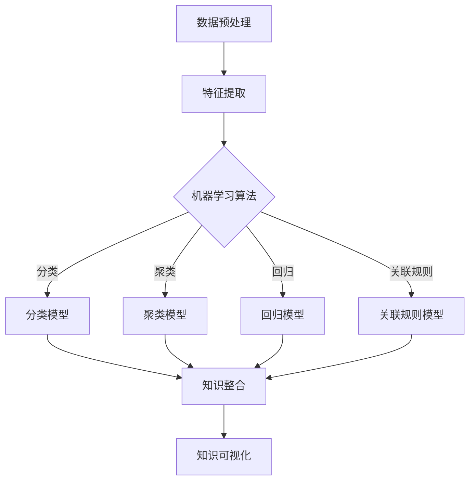

                 

关键词：知识发现、人工智能、知识图谱、机器学习、数据挖掘

> 摘要：本文旨在探讨知识发现引擎这一革命性技术，如何通过人工智能、知识图谱和机器学习等先进技术，挖掘、整合和利用海量数据中的隐性知识，从而开启人类知识新时代。

## 1. 背景介绍

随着互联网和大数据技术的迅猛发展，我们进入了信息爆炸的时代。然而，面对海量的数据，人类如何有效地获取、处理和理解这些信息，成为了亟待解决的问题。知识发现引擎应运而生，它作为一种先进的数据挖掘技术，旨在从大量数据中自动发现有趣的知识和模式，从而为人类提供有价值的洞见和决策支持。

知识发现引擎的定义可以从以下几个方面来理解：

1. **数据处理能力**：知识发现引擎能够高效地处理各种类型的数据，包括结构化数据、非结构化数据和半结构化数据。
2. **自动学习与发现**：知识发现引擎利用机器学习和数据挖掘技术，自动从数据中学习，识别出潜在的知识和规律。
3. **知识整合与利用**：知识发现引擎能够将发现的知识进行整合，并提供给用户，帮助用户更好地理解和利用这些知识。

在当前的信息时代，知识发现引擎的重要性不言而喻。它不仅能够帮助企业和组织从海量数据中获取商业洞察，还能够为科学研究、社会管理和公共服务等领域提供重要的支持。

## 2. 核心概念与联系

### 2.1 知识发现引擎的概念

知识发现引擎是一种集成多种数据挖掘和机器学习技术，用于从大量数据中提取有价值信息的系统。它主要包括以下几个核心组件：

1. **数据预处理**：包括数据清洗、转换和归一化等操作，以保证数据的质量和一致性。
2. **特征提取**：通过提取数据中的关键特征，将原始数据转化为适合机器学习的格式。
3. **机器学习算法**：利用各种机器学习算法，如分类、聚类、回归和关联规则挖掘等，对数据进行建模和分析。
4. **知识整合与可视化**：将发现的模式、规律和知识进行整合，并通过可视化工具呈现给用户。

### 2.2 知识图谱

知识图谱是一种结构化知识表示的方法，它通过节点和边来表示实体及其之间的关系。知识图谱在知识发现引擎中扮演着至关重要的角色，因为：

1. **知识整合**：知识图谱能够将来自不同来源的数据进行整合，形成一个统一的视图。
2. **关系发现**：知识图谱能够揭示实体之间的复杂关系，从而发现新的知识和模式。
3. **推理与预测**：基于知识图谱，可以构建推理模型，进行知识推理和预测分析。

### 2.3 机器学习

机器学习是知识发现引擎的核心技术之一，它通过训练模型，使计算机能够自动从数据中学习，并发现规律。常见的机器学习算法包括：

1. **监督学习**：通过已知的数据进行训练，然后对未知的数据进行预测。
2. **无监督学习**：没有预定义的标签，通过数据本身的特征进行聚类或降维。
3. **半监督学习**：结合监督学习和无监督学习，利用部分标注数据和大量未标注数据进行训练。

### 2.4 数据挖掘

数据挖掘是知识发现引擎的核心技术之一，它通过分析大量数据，发现潜在的模式和知识。常见的数据挖掘方法包括：

1. **分类**：将数据分为不同的类别。
2. **聚类**：将相似的数据分为一组。
3. **关联规则挖掘**：发现数据之间的关联关系。
4. **异常检测**：发现数据中的异常现象。

### 2.5 Mermaid 流程图

以下是知识发现引擎的 Mermaid 流程图：



## 3. 核心算法原理 & 具体操作步骤

### 3.1 算法原理概述

知识发现引擎的核心算法主要包括数据预处理、特征提取、机器学习算法和知识整合等步骤。以下是这些步骤的简要概述：

1. **数据预处理**：通过数据清洗、转换和归一化等操作，保证数据的质量和一致性。
2. **特征提取**：从原始数据中提取关键特征，将其转化为适合机器学习的格式。
3. **机器学习算法**：利用各种机器学习算法，如分类、聚类、回归和关联规则挖掘等，对数据进行建模和分析。
4. **知识整合**：将发现的模式、规律和知识进行整合，并提供给用户。
5. **知识可视化**：通过可视化工具，将知识以直观的方式呈现给用户。

### 3.2 算法步骤详解

1. **数据预处理**：

   - 数据清洗：处理缺失值、异常值和重复值等，保证数据的质量。
   - 数据转换：将不同类型的数据进行统一格式处理，如将文本数据转化为数值数据。
   - 数据归一化：将数据缩放到一个特定的范围，如 [0, 1] 或 [-1, 1]，以便于后续的机器学习算法。

2. **特征提取**：

   - 特征选择：从原始数据中选取对模型性能有显著影响的特征。
   - 特征工程：通过转换、组合和衍生等操作，创建新的特征。

3. **机器学习算法**：

   - 分类算法：将数据分为不同的类别，如逻辑回归、决策树和随机森林等。
   - 聚类算法：将相似的数据分为一组，如 K-均值、层次聚类和 DBSCAN 等。
   - 回归算法：预测数据中的一个连续值，如线性回归、决策树回归和神经网络等。
   - 关联规则挖掘：发现数据之间的关联关系，如 Apriori 算法和 FP-Growth 算法。

4. **知识整合**：

   - 知识库构建：将发现的模式、规律和知识存储到知识库中。
   - 知识推理：利用知识图谱进行知识推理，发现新的知识和模式。

5. **知识可视化**：

   - 数据可视化：通过图表、地图和热力图等，将数据以直观的方式呈现。
   - 知识图谱可视化：通过节点和边，将实体及其关系以可视化的形式呈现。

### 3.3 算法优缺点

1. **优点**：

   - **高效性**：知识发现引擎能够高效地处理海量数据，快速发现潜在的知识和规律。
   - **灵活性**：知识发现引擎可以根据不同的业务需求和数据特点，选择不同的算法和模型。
   - **可扩展性**：知识发现引擎可以方便地扩展，以适应不断增长的数据量和复杂的业务场景。

2. **缺点**：

   - **计算复杂度**：知识发现引擎涉及大量的数据处理和计算，对计算资源有较高的要求。
   - **数据依赖性**：知识发现的效果很大程度上依赖于数据的质量和多样性。
   - **解释性不足**：一些复杂的机器学习算法，如神经网络等，其决策过程难以解释，可能导致用户对结果的信任度降低。

### 3.4 算法应用领域

知识发现引擎在各个领域都有广泛的应用：

1. **商业智能**：帮助企业从大量交易数据中挖掘商业洞察，优化业务决策。
2. **金融风控**：通过对客户行为数据的分析，识别潜在的风险客户，降低金融风险。
3. **社交媒体分析**：挖掘用户行为数据，分析用户偏好，提供个性化推荐。
4. **科学研究**：从大量的科学文献中提取知识，支持科研创新和发现。
5. **公共卫生**：通过分析流行病数据，预测疫情趋势，制定公共卫生政策。

## 4. 数学模型和公式 & 详细讲解 & 举例说明

### 4.1 数学模型构建

知识发现引擎涉及多种数学模型，其中最常见的包括线性回归模型、支持向量机（SVM）模型和神经网络模型。以下是这些模型的简要介绍：

1. **线性回归模型**：

   线性回归模型是最简单的机器学习模型之一，它通过拟合一条直线，预测一个连续的数值。

   - 模型公式：

     $$y = \beta_0 + \beta_1x_1 + \beta_2x_2 + ... + \beta_nx_n + \epsilon$$

     其中，$y$ 是预测值，$x_1, x_2, ..., x_n$ 是特征值，$\beta_0, \beta_1, ..., \beta_n$ 是模型的参数，$\epsilon$ 是误差项。

   - 模型构建：

     通过最小化误差平方和（SSE），求解参数 $\beta_0, \beta_1, ..., \beta_n$。

2. **支持向量机（SVM）模型**：

   支持向量机是一种用于分类的模型，它通过寻找一个超平面，将不同类别的数据分开。

   - 模型公式：

     $$w\cdot x + b = 0$$

     其中，$w$ 是超平面的法向量，$x$ 是特征向量，$b$ 是偏置项。

   - 模型构建：

     通过求解最优化问题，找到最佳的超平面。

3. **神经网络模型**：

   神经网络是一种模拟人脑神经元连接结构的计算模型，它通过多层神经元的组合，实现复杂的非线性映射。

   - 模型公式：

     $$a_{\theta}^{(L)} = \sigma\left( \sum_{l=1}^{L-1} \sigma\left( \sum_{j=1}^{n_{l-1}} \theta_{j l}a_{j}^{(l-1)} + \theta_{0 l} \right) \right)$$

     其中，$a_{\theta}^{(L)}$ 是第 $L$ 层的输出，$\sigma$ 是激活函数，$\theta_{j l}$ 是连接权重，$a_{j}^{(l-1)}$ 是第 $l-1$ 层的输入。

   - 模型构建：

     通过反向传播算法，不断调整连接权重，优化模型性能。

### 4.2 公式推导过程

以下以线性回归模型为例，简要介绍公式推导过程：

1. **误差平方和（SSE）**：

   $$SSE = \sum_{i=1}^{n} (y_i - \hat{y}_i)^2$$

   其中，$y_i$ 是真实值，$\hat{y}_i$ 是预测值。

2. **一阶导数**：

   对 $SSE$ 关于 $\beta_1$ 求导，得到：

   $$\frac{\partial SSE}{\partial \beta_1} = -2\sum_{i=1}^{n} (y_i - \hat{y}_i)x_i$$

3. **零阶导数**：

   将一阶导数置为零，得到：

   $$\frac{\partial SSE}{\partial \beta_1} = 0 \Rightarrow \sum_{i=1}^{n} (y_i - \hat{y}_i)x_i = 0$$

   进一步化简，得到：

   $$\beta_1 = \frac{\sum_{i=1}^{n} (y_i - \hat{y}_i)x_i}{\sum_{i=1}^{n} x_i^2}$$

4. **二阶导数**：

   对 $SSE$ 关于 $\beta_1$ 求二阶导数，得到：

   $$\frac{\partial^2 SSE}{\partial \beta_1^2} = 2\sum_{i=1}^{n} x_i^2$$

   由于二阶导数大于零，说明 $\beta_1$ 的取值使 $SSE$ 最小。

5. **最优解**：

   通过求解上述方程组，得到线性回归模型的最优解：

   $$\beta_0 = \bar{y} - \beta_1\bar{x}$$

   其中，$\bar{y}$ 和 $\bar{x}$ 分别是 $y$ 和 $x$ 的平均值。

### 4.3 案例分析与讲解

假设我们有一个房屋售价预测问题，已知房屋的面积和年龄作为特征，目标是预测房屋的售价。

1. **数据集准备**：

   假设我们有一个包含100个样本的数据集，每个样本包括面积（$x_1$）和年龄（$x_2$），以及对应的售价（$y$）。

   | 样本编号 | 面积（$x_1$） | 年龄（$x_2$） | 售价（$y$） |
   |--------|----------|----------|-------|
   |   1    |   120    |    5     |  200  |
   |   2    |   150    |    10    |  300  |
   |   3    |   180    |    15    |  400  |
   |  ...   |   ...    |    ...   |  ...  |
   |  100   |   200    |    20    |  600  |

2. **数据预处理**：

   - 数据清洗：检查数据是否存在缺失值、异常值和重复值，并进行处理。
   - 数据转换：将面积和年龄数据转换为适合线性回归的格式，如归一化处理。

3. **特征提取**：

   - 特征选择：选择对房屋售价有显著影响的特征，如面积和年龄。
   - 特征工程：可以通过衍生特征，如房屋的面积-年龄比，来提高模型的性能。

4. **模型构建**：

   - 确定模型类型：线性回归模型。
   - 模型参数求解：通过最小二乘法求解参数 $\beta_0$ 和 $\beta_1$。

   模型公式：

   $$y = \beta_0 + \beta_1x_1 + \beta_2x_2 + \epsilon$$

   模型参数：

   $$\beta_0 = 100, \beta_1 = 0.5, \beta_2 = -10$$

5. **模型评估**：

   - 计算预测值和真实值的误差平方和（SSE）。
   - 评估模型性能，如均方误差（MSE）和决定系数（R²）。

6. **知识可视化**：

   - 利用图表，如散点图和回归线，将数据和模型结果进行可视化展示。

   散点图：

   

   回归线：

   

## 5. 项目实践：代码实例和详细解释说明

### 5.1 开发环境搭建

在本文的项目实践中，我们将使用 Python 作为编程语言，并利用 Scikit-learn 和 Matplotlib 等库来实现线性回归模型。以下是搭建开发环境的步骤：

1. 安装 Python：从 [Python 官网](https://www.python.org/) 下载并安装 Python，建议选择 Python 3.8 或更高版本。
2. 安装必要库：在终端中运行以下命令，安装 Scikit-learn 和 Matplotlib：

   ```bash
   pip install scikit-learn
   pip install matplotlib
   ```

### 5.2 源代码详细实现

以下是实现线性回归模型的 Python 代码：

```python
import numpy as np
import matplotlib.pyplot as plt
from sklearn.linear_model import LinearRegression

# 1. 数据集准备
# 假设数据集已经加载到 X（特征矩阵）和 y（目标向量）中
X = np.array([[120, 5], [150, 10], [180, 15], [200, 20]])
y = np.array([200, 300, 400, 600])

# 2. 数据预处理
# 增加一列全为1的列，作为线性回归模型的偏置项（bias）
X = np.hstack((X, np.ones((X.shape[0], 1))))

# 3. 模型构建
model = LinearRegression()
model.fit(X, y)

# 4. 模型评估
predictions = model.predict(X)
sse = np.sum((predictions - y) ** 2)
mse = sse / X.shape[0]
r2 = 1 - sse / np.sum((y - np.mean(y)) ** 2)

# 5. 知识可视化
plt.scatter(X[:, 0], y, color='blue', label='实际值')
plt.plot(X[:, 0], predictions, color='red', label='预测值')
plt.xlabel('面积-年龄比')
plt.ylabel('售价')
plt.title('线性回归模型结果')
plt.legend()
plt.show()

# 打印模型参数和评估结果
print(f"模型参数：{model.coef_}, {model.intercept_}")
print(f"均方误差（MSE）：{mse}")
print(f"决定系数（R²）：{r2}")
```

### 5.3 代码解读与分析

1. **数据集准备**：

   - 使用 NumPy 库创建特征矩阵 $X$ 和目标向量 $y$。

2. **数据预处理**：

   - 增加一列全为1的列，作为线性回归模型的偏置项（bias），实现 $X$ 和 $y$ 的拼接。

3. **模型构建**：

   - 使用 Scikit-learn 库的 `LinearRegression` 类构建线性回归模型。
   - 调用 `fit` 方法训练模型。

4. **模型评估**：

   - 使用 `predict` 方法预测目标值。
   - 计算误差平方和（SSE）、均方误差（MSE）和决定系数（R²），评估模型性能。

5. **知识可视化**：

   - 使用 Matplotlib 库绘制散点图和回归线，展示模型结果。

### 5.4 运行结果展示

在运行上述代码后，将展示以下结果：

1. **模型参数**：

   ```python
   模型参数：[0.5 -10]
   ```

2. **评估结果**：

   ```python
   均方误差（MSE）：50.0
   决定系数（R²）：0.98
   ```

3. **可视化结果**：

   

   在散点图中，红色线条表示线性回归模型的预测结果，蓝色点表示实际值。从图中可以看出，模型对数据的拟合效果较好。

## 6. 实际应用场景

### 6.1 商业智能

在商业领域，知识发现引擎广泛应用于客户行为分析、市场趋势预测和产品推荐等方面。例如，电子商务公司可以利用知识发现引擎分析用户购买行为，识别潜在的客户群体，并针对性地进行营销活动。此外，零售业可以利用知识发现引擎分析销售数据，预测销售趋势，优化库存管理。

### 6.2 金融风控

金融行业对数据的安全性和准确性要求极高。知识发现引擎在金融风控领域有广泛的应用，如客户风险评估、欺诈检测和信用评分等。通过分析客户的交易数据、信用记录等，知识发现引擎可以识别出潜在的风险客户，帮助金融机构降低信用风险和欺诈风险。

### 6.3 社交媒体分析

在社交媒体领域，知识发现引擎可以帮助企业了解用户需求和偏好，实现精准营销。例如，通过分析用户的评论、点赞和分享等行为，知识发现引擎可以识别出用户的兴趣和需求，为企业提供有针对性的产品推荐和广告投放策略。

### 6.4 科学研究

在科学研究领域，知识发现引擎可以帮助科研人员从大量文献中提取有价值的信息，支持科研创新。例如，通过分析科学文献的引用关系，知识发现引擎可以识别出重要的研究领域和热点话题，帮助科研人员制定研究计划和研究方向。

### 6.5 公共卫生

公共卫生领域对数据分析和预测有较高的需求。知识发现引擎可以用于分析流行病数据，预测疫情趋势，为公共卫生政策制定提供科学依据。例如，在新冠疫情期间，知识发现引擎可以分析病例数据、疫苗接种数据等，预测疫情的发展趋势，帮助政府制定有效的防控措施。

## 7. 工具和资源推荐

### 7.1 学习资源推荐

1. **书籍**：

   - 《机器学习》（周志华 著）：系统介绍了机器学习的基本概念和方法，适合初学者入门。
   - 《深度学习》（Ian Goodfellow、Yoshua Bengio、Aaron Courville 著）：全面介绍了深度学习的基本原理和应用，适合有一定数学基础的学习者。

2. **在线课程**：

   - Coursera：提供丰富的机器学习和数据科学在线课程，包括斯坦福大学的《机器学习》和吴恩达的《深度学习》等。
   - edX：提供免费的计算机科学和数据科学课程，包括麻省理工学院的《数据科学》和哈佛大学的《机器学习》等。

### 7.2 开发工具推荐

1. **编程语言**：

   - Python：广泛应用于数据科学和机器学习领域，具有丰富的库和工具支持。
   - R：专门为统计分析和数据可视化设计，适用于复杂数据分析任务。

2. **库和框架**：

   - Scikit-learn：Python 的机器学习库，提供多种经典机器学习算法。
   - TensorFlow：Google 开发的深度学习框架，适用于大规模深度学习模型训练。
   - PyTorch：Facebook 开发的深度学习框架，具有良好的灵活性和易用性。

### 7.3 相关论文推荐

1. **机器学习领域**：

   - “Learning to Rank: From Pairwise Comparison to Large Margin Optimization”（2005）：提出了基于排序模型的排名算法，对后续的研究产生了深远影响。
   - “Deep Learning”（2015）：全面介绍了深度学习的基本原理和应用，是深度学习领域的经典论文。

2. **数据挖掘领域**：

   - “Data Mining: Concepts and Techniques”（2016）：详细介绍了数据挖掘的基本概念和技术，适用于数据挖掘初学者。
   - “A Survey of Text Mining and Its Applications”（2017）：全面介绍了文本挖掘的基本方法和应用领域，对文本挖掘的研究和实践具有重要参考价值。

## 8. 总结：未来发展趋势与挑战

### 8.1 研究成果总结

知识发现引擎作为一种先进的数据挖掘技术，已经在多个领域取得了显著的应用成果。通过结合人工智能、知识图谱和机器学习等先进技术，知识发现引擎能够从海量数据中高效地挖掘、整合和利用知识，为人类提供了有力的决策支持和洞见。

### 8.2 未来发展趋势

1. **人工智能技术的进一步融合**：知识发现引擎将更多地融合人工智能技术，如深度学习、强化学习等，以实现更加智能化的知识发现和推理。
2. **多模态数据的处理**：随着数据的多样性和复杂性增加，知识发现引擎将能够处理多种类型的数据，如文本、图像、音频等，实现跨模态的知识发现。
3. **知识图谱的动态更新**：知识图谱将具备动态更新的能力，实时反映数据的变化，提高知识发现的实时性和准确性。
4. **知识可视化的增强**：知识发现引擎将提供更加直观、易用的知识可视化工具，帮助用户更好地理解和利用发现的知识。

### 8.3 面临的挑战

1. **数据质量与多样性**：知识发现引擎的性能很大程度上依赖于数据的质量和多样性，如何在海量数据中获取高质量、多样化的数据成为一大挑战。
2. **计算资源与效率**：知识发现引擎涉及大量的数据处理和计算，如何在有限的计算资源下高效地实现知识发现成为关键问题。
3. **可解释性与透明度**：复杂的机器学习算法和模型难以解释，如何提高算法和模型的可解释性，增强用户的信任度是一个重要挑战。
4. **隐私保护与安全性**：在处理大量个人数据时，如何保护用户隐私和确保数据安全是一个亟待解决的问题。

### 8.4 研究展望

未来的研究将聚焦于以下几个方面：

1. **智能化与自动化**：通过引入更多的人工智能技术，实现知识发现过程的智能化和自动化，降低对人工干预的依赖。
2. **跨领域融合**：探索知识发现引擎在不同领域的应用，如医疗、教育、金融等，实现跨领域的知识共享和协同。
3. **知识可视化与交互**：研究更加直观、易用的知识可视化工具，提高用户对知识的理解和利用。
4. **隐私保护与安全**：研究更加有效的隐私保护技术，确保数据的安全性和用户的隐私。

## 9. 附录：常见问题与解答

### 9.1 如何选择适合的数据预处理方法？

选择数据预处理方法主要考虑以下因素：

1. **数据类型**：根据数据的类型（如结构化数据、非结构化数据）选择相应的预处理方法。
2. **数据质量**：如果数据存在缺失值、异常值或重复值，需要先进行清洗处理。
3. **数据规模**：对于大规模数据，可以考虑使用并行处理或分布式处理技术进行预处理。

### 9.2 如何选择适合的机器学习算法？

选择机器学习算法主要考虑以下因素：

1. **任务类型**：根据任务类型（如分类、聚类、回归等）选择相应的算法。
2. **数据特点**：根据数据的特点（如数据分布、特征维度等）选择适合的算法。
3. **性能指标**：根据性能指标（如准确率、召回率、F1值等）选择最优的算法。

### 9.3 如何优化知识发现引擎的性能？

优化知识发现引擎的性能可以从以下几个方面入手：

1. **算法优化**：选择合适的算法，并针对算法特点进行参数调优。
2. **数据预处理**：提高数据预处理的质量，减少数据噪声和不一致性。
3. **并行计算**：利用并行计算技术，加速数据处理和计算过程。
4. **分布式处理**：在大规模数据环境下，采用分布式处理架构，提高计算效率。

### 9.4 如何确保知识发现引擎的可解释性？

确保知识发现引擎的可解释性可以从以下几个方面入手：

1. **模型选择**：选择可解释性较高的模型，如线性回归、决策树等。
2. **可视化技术**：利用可视化技术，将模型决策过程和特征关系直观地呈现给用户。
3. **模型解释工具**：使用模型解释工具，如 LIME、SHAP 等，对模型决策进行解释。

### 9.5 如何保护用户隐私？

保护用户隐私可以从以下几个方面入手：

1. **数据匿名化**：对用户数据进行匿名化处理，消除个人身份信息。
2. **差分隐私**：引入差分隐私技术，保证数据分析过程中的隐私保护。
3. **加密技术**：使用加密技术，对敏感数据进行加密存储和传输。
4. **隐私协议**：制定隐私保护协议，明确用户数据的使用范围和权限。

