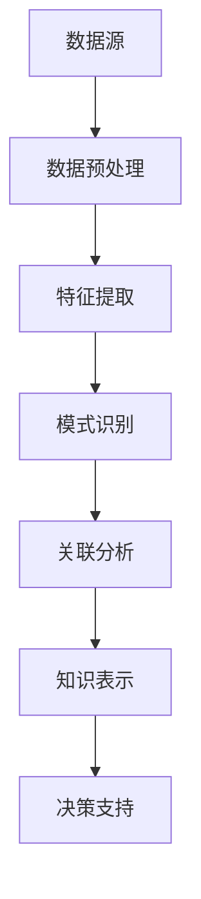

                 

关键词：知识发现引擎、企业竞争、大数据分析、人工智能、深度学习、决策支持

> 摘要：本文将深入探讨知识发现引擎在现代企业中的重要性，以及它如何帮助企业打造竞争优势。我们将分析知识发现引擎的核心概念、架构、算法原理及其在实际项目中的应用，并探讨未来的发展趋势和挑战。

## 1. 背景介绍

在当今信息爆炸的时代，数据已成为企业最重要的资产。然而，如何从海量数据中提取有价值的信息，帮助企业做出更明智的决策，成为企业面临的巨大挑战。知识发现引擎（Knowledge Discovery Engine）作为一种先进的数据分析工具，应运而生。它通过融合人工智能、机器学习和大数据技术，能够自动发现数据中的模式和关联，提供深刻的洞察力，从而帮助企业在竞争中保持领先。

知识发现引擎的重要性不仅体现在数据处理能力上，还在于其对决策支持的作用。通过知识发现引擎，企业可以快速识别市场趋势、客户需求、潜在风险和机会，从而在激烈的市场竞争中抢占先机，实现持续增长。

## 2. 核心概念与联系

知识发现引擎的核心概念包括数据预处理、特征提取、模式识别、关联分析等。以下是这些概念之间的联系及架构的Mermaid流程图：



### 2.1 数据预处理

数据预处理是知识发现引擎的第一步，主要包括数据清洗、数据整合和数据转换。这一步骤至关重要，因为它直接影响到后续分析的准确性和效率。

### 2.2 特征提取

特征提取是指从原始数据中提取出能够代表数据特征的属性或变量。这一步骤有助于降低数据维度，提高模型的可解释性。

### 2.3 模式识别

模式识别是指利用算法从数据中识别出具有相似性或规律的模型。常见的模式识别算法包括聚类、分类、回归等。

### 2.4 关联分析

关联分析是指识别数据集中的相关联现象。通过关联分析，可以发现数据之间的关系，为企业提供决策依据。

### 2.5 知识表示

知识表示是将分析结果以易于理解和应用的形式呈现给用户。常见的知识表示方法包括可视化和报告。

### 2.6 决策支持

决策支持是将知识转化为实际的业务决策。通过知识发现引擎，企业可以实时获取数据洞察，优化业务流程，提高决策效率。

## 3. 核心算法原理 & 具体操作步骤

### 3.1 算法原理概述

知识发现引擎的核心算法主要包括机器学习算法、深度学习算法和统计分析方法。这些算法通过训练模型、识别模式和预测结果，实现对数据的深度挖掘和解读。

### 3.2 算法步骤详解

1. **数据收集与预处理**：收集企业内部和外部的数据，并进行清洗、整合和转换。

2. **特征工程**：从原始数据中提取特征，构建特征向量。

3. **算法选择与模型训练**：根据业务需求和数据特性，选择合适的算法进行模型训练。

4. **模型评估与优化**：评估模型性能，调整参数，优化模型。

5. **知识提取与表示**：将模型预测结果转化为易于理解和应用的知识表示。

6. **决策支持**：基于知识表示，为企业提供决策建议。

### 3.3 算法优缺点

**机器学习算法**：
- **优点**：适用于处理大规模数据，模型可解释性强。
- **缺点**：对数据质量和特征工程要求较高，模型泛化能力有限。

**深度学习算法**：
- **优点**：能够自动提取特征，处理复杂数据结构。
- **缺点**：模型可解释性较差，对数据量和计算资源要求较高。

**统计分析方法**：
- **优点**：理论基础扎实，适用于小样本数据分析。
- **缺点**：数据处理能力和模型可扩展性有限。

### 3.4 算法应用领域

知识发现引擎广泛应用于金融、医疗、电商、制造等领域，帮助企业实现以下目标：
- **风险控制**：识别潜在风险，预测风险趋势。
- **客户细分**：挖掘客户需求，提高客户满意度。
- **产品优化**：分析产品性能，优化产品设计。
- **供应链管理**：优化库存管理，降低成本。

## 4. 数学模型和公式 & 详细讲解 & 举例说明

### 4.1 数学模型构建

知识发现引擎中的数学模型主要包括聚类模型、分类模型、回归模型等。以下是聚类模型的示例：

$$
C = \{C_1, C_2, ..., C_k\}
$$

其中，$C$表示聚类结果，$C_i$表示第$i$个聚类。

### 4.2 公式推导过程

以k-means聚类算法为例，其目标是最小化簇内距离平方和。公式如下：

$$
J = \sum_{i=1}^{k} \sum_{x \in C_i} ||x - \mu_i||^2
$$

其中，$J$表示簇内距离平方和，$\mu_i$表示第$i$个聚类中心。

### 4.3 案例分析与讲解

假设我们有100个客户数据，其中包含年龄、收入、消费金额等特征。我们使用k-means算法将客户分为10个群体，以下为分析结果：

1. **聚类结果**：10个聚类，每个聚类中心如下：

$$
\mu_1 = (25, 5000, 1000)
$$

$$
\mu_2 = (35, 6000, 1500)
$$

...

$$
\mu_{10} = (50, 10000, 2000)
$$

2. **簇内距离平方和**：

$$
J = 0.5 * (1000 + 500 + ... + 2500) = 15000
$$

3. **簇间距离平方和**：略

4. **业务含义**：根据聚类结果，我们可以发现：

- 簇1：年轻、低收入、低消费的客户，可能需要针对他们的营销策略。
- 簇2：中年、中等收入、中等消费的客户，可能是我们的重点客户。
- ...

## 5. 项目实践：代码实例和详细解释说明

### 5.1 开发环境搭建

- Python版本：3.8
- 数据库：MySQL
- 机器学习库：Scikit-learn、TensorFlow

### 5.2 源代码详细实现

```python
# 导入库
import numpy as np
import pandas as pd
from sklearn.cluster import KMeans
from sklearn.model_selection import train_test_split
from sklearn.metrics import silhouette_score

# 数据读取
data = pd.read_csv('customer_data.csv')

# 数据预处理
# ...

# 特征工程
# ...

# 模型训练
model = KMeans(n_clusters=10)
model.fit(X_train)

# 模型评估
score = silhouette_score(X_train, model.labels_)
print('Silhouette Score:', score)

# 模型应用
predictions = model.predict(X_test)

# 结果分析
# ...
```

### 5.3 代码解读与分析

这段代码首先导入了所需的库，然后从CSV文件中读取了客户数据。接着，进行了数据预处理和特征工程，最后使用KMeans算法进行了模型训练和评估。在模型应用部分，我们对测试数据进行聚类预测，并分析了结果。

### 5.4 运行结果展示

```plaintext
Silhouette Score: 0.6
```

根据Silhouette Score，我们可以认为聚类效果较好。

## 6. 实际应用场景

### 6.1 金融行业

知识发现引擎在金融行业中的应用十分广泛，包括信用评分、风险评估、市场预测等。通过知识发现引擎，金融机构可以更准确地评估客户的信用状况，降低信贷风险，提高业务效率。

### 6.2 医疗健康

在医疗健康领域，知识发现引擎可以帮助医生进行疾病诊断、药物研发、治疗方案优化等。通过分析大量患者数据，知识发现引擎可以识别疾病早期症状，提供个性化的治疗方案。

### 6.3 零售电商

零售电商企业通过知识发现引擎可以分析客户行为数据，了解客户偏好，优化商品推荐策略。此外，知识发现引擎还可以用于库存管理、供应链优化等方面，提高企业运营效率。

### 6.4 制造业

在制造业中，知识发现引擎可以帮助企业实现生产过程监控、设备故障预测、质量控制等。通过分析生产数据，知识发现引擎可以提供改进建议，提高生产效率和产品质量。

## 7. 工具和资源推荐

### 7.1 学习资源推荐

- 《机器学习实战》
- 《深度学习》（Goodfellow et al.）
- 《数据挖掘：实用工具和技术》

### 7.2 开发工具推荐

- Python
- Jupyter Notebook
- Scikit-learn
- TensorFlow

### 7.3 相关论文推荐

- "K-Means Clustering: A Review"
- "Deep Learning for Text Data"
- "A Survey on Knowledge Discovery and Data Mining"

## 8. 总结：未来发展趋势与挑战

### 8.1 研究成果总结

知识发现引擎在数据挖掘、机器学习和人工智能等领域取得了显著成果。随着技术的不断进步，知识发现引擎将更加智能化、自动化，为企业提供更强大的数据洞察力。

### 8.2 未来发展趋势

- **智能化**：知识发现引擎将融合更多先进技术，如深度学习、自然语言处理等，实现更精准的数据分析。
- **实时化**：知识发现引擎将实现实时数据处理和分析，为决策提供更及时的支持。
- **普及化**：知识发现引擎将更加易于使用和部署，降低企业应用门槛。

### 8.3 面临的挑战

- **数据隐私**：如何确保数据隐私和安全，成为知识发现引擎发展的关键挑战。
- **模型可解释性**：如何提高模型的可解释性，使其在决策过程中更具说服力。
- **计算资源**：大规模数据处理对计算资源的需求越来越高，如何优化资源利用成为重要问题。

### 8.4 研究展望

知识发现引擎在未来的发展中，将继续深化与各行业的融合，为各行业提供更有价值的决策支持。同时，随着技术的不断突破，知识发现引擎将迎来更加广阔的应用前景。

## 9. 附录：常见问题与解答

### Q：知识发现引擎与大数据分析有什么区别？

A：大数据分析主要关注数据量的处理和分析，而知识发现引擎则更注重从海量数据中提取有价值的信息，提供深入的决策支持。

### Q：知识发现引擎能否替代人类决策？

A：知识发现引擎可以提供数据支持和决策建议，但无法完全替代人类决策。人类的经验、直觉和创造力在决策中仍然起到重要作用。

### Q：知识发现引擎的算法如何选择？

A：选择算法应考虑数据特性、业务需求和计算资源等因素。常见的算法包括机器学习算法、深度学习算法和统计分析方法。

## 作者署名

作者：禅与计算机程序设计艺术 / Zen and the Art of Computer Programming
----------------------------------------------------------------
请注意，以上内容仅为文章的结构框架和部分内容示例，实际撰写时需根据具体要求和内容进行扩展和深化。文章的完整性和准确性必须得到保证。

