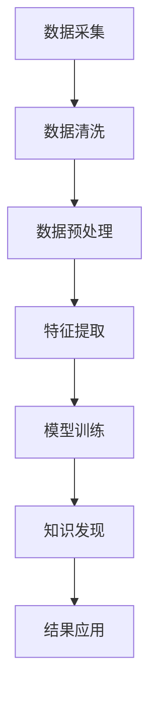

                 

关键词：知识发现引擎，创意产业，数据挖掘，人工智能，创新

摘要：本文将深入探讨知识发现引擎在创意产业中的应用与影响，通过阐述其核心概念、算法原理以及具体操作步骤，分析其在各个领域的实际应用，并展望其未来的发展趋势与挑战。

## 1. 背景介绍

随着信息技术的飞速发展，数据已经成为现代社会不可或缺的资源。如何从海量的数据中提取有价值的信息，成为各个领域研究和应用的关键问题。知识发现引擎（Knowledge Discovery Engine，KDE）作为一种基于人工智能的数据挖掘工具，应运而生。它通过自动化地挖掘、分析和关联数据，帮助用户发现数据背后的模式和规律，从而为创意产业提供创新的动力。

创意产业，是指以创新为核心，以知识产权为主要资产，以创意产品和服务为主要产出，涵盖设计、文化、娱乐、科技等多个领域的产业。创意产业不仅能够推动经济增长，还能够提升社会文化水平，具有重要的战略意义。然而，随着市场竞争的加剧，创意产业面临着巨大的创新压力和挑战。知识发现引擎的引入，为创意产业带来了新的机遇。

## 2. 核心概念与联系

### 2.1 知识发现引擎的定义

知识发现引擎是一种自动化数据处理和分析的工具，它能够从大规模数据集中发现潜在的知识和信息。知识发现引擎的核心概念包括数据挖掘、机器学习和自然语言处理等。通过这些技术，知识发现引擎能够自动识别数据中的模式和规律，生成新的知识和见解。

### 2.2 创意产业与知识发现引擎的联系

知识发现引擎在创意产业中的应用，主要体现在以下几个方面：

1. **内容创作**：知识发现引擎能够分析用户的行为数据，了解用户的喜好和需求，从而帮助内容创作者进行精准的创作。

2. **版权管理**：知识发现引擎能够自动识别和分类创意作品，有助于版权的登记和保护。

3. **市场分析**：知识发现引擎能够分析市场数据，预测市场趋势，帮助创意产业制定营销策略。

4. **用户体验**：知识发现引擎能够根据用户的行为数据，优化产品设计，提升用户体验。

### 2.3 Mermaid 流程图

下面是一个简化的知识发现引擎在创意产业中的应用流程图：



## 3. 核心算法原理 & 具体操作步骤

### 3.1 算法原理概述

知识发现引擎的核心算法主要包括以下几种：

1. **关联规则学习**：通过发现数据中的关联关系，帮助用户发现潜在的知识。

2. **聚类分析**：将数据集划分为若干个类别，每个类别内部的元素具有较高的相似度。

3. **分类与回归**：通过学习已有的数据，对新的数据进行预测。

4. **主题建模**：从文本数据中提取主题，帮助用户理解和分析文本内容。

### 3.2 算法步骤详解

1. **数据采集**：收集与创意产业相关的数据，如用户行为数据、市场数据、版权数据等。

2. **数据清洗**：去除数据中的噪声和异常值，保证数据的质量。

3. **数据预处理**：对数据进行标准化处理，提取特征，为后续的算法分析做好准备。

4. **特征提取**：根据算法的需求，从数据中提取有用的特征。

5. **模型训练**：使用已标记的数据集，训练相应的算法模型。

6. **知识发现**：使用训练好的模型，对新的数据进行分析，发现数据中的模式和规律。

7. **结果应用**：将分析结果应用于创意产业的各个环节，如内容创作、市场分析、用户体验优化等。

### 3.3 算法优缺点

1. **优点**：
   - 自动化程度高，能够处理大规模的数据。
   - 能够发现数据中的潜在知识和规律，为创意产业提供创新的思路。
   - 可以降低人力成本，提高工作效率。

2. **缺点**：
   - 数据质量和预处理工作对算法的效果有很大影响。
   - 算法的复杂度和计算资源需求较大。

### 3.4 算法应用领域

知识发现引擎在创意产业的应用非常广泛，主要包括：

1. **内容创作**：通过分析用户行为数据，帮助内容创作者了解用户喜好，进行精准的内容创作。

2. **版权管理**：通过自动化识别和分类，提高版权登记和保护的工作效率。

3. **市场分析**：通过分析市场数据，预测市场趋势，为创意产业制定营销策略。

4. **用户体验**：通过分析用户行为数据，优化产品设计，提升用户体验。

## 4. 数学模型和公式 & 详细讲解 & 举例说明

### 4.1 数学模型构建

知识发现引擎的数学模型主要包括以下几个方面：

1. **关联规则学习**：使用支持度（Support）和置信度（Confidence）来评估规则的质量。

2. **聚类分析**：使用距离度量和聚类算法（如K-Means）来划分数据集。

3. **分类与回归**：使用损失函数（如交叉熵）来评估模型的预测效果。

4. **主题建模**：使用概率分布和贝叶斯网络来提取文本数据中的主题。

### 4.2 公式推导过程

以下是关联规则学习中的一个基本公式：

$$
Support(A \cup B) = P(A \cup B) = P(A) \times P(B|A)
$$

其中，$A$ 和 $B$ 是两个事件，$P(A)$ 是事件 $A$ 的概率，$P(B|A)$ 是在事件 $A$ 发生的条件下，事件 $B$ 的概率。

### 4.3 案例分析与讲解

假设我们有一个包含书籍销售数据的数据库，我们想要发现购买《算法导论》的用户还可能购买哪些书籍。这是一个典型的关联规则学习问题。

1. **数据预处理**：首先，我们需要对销售数据进行预处理，将数据转化为适合关联规则学习的格式。

2. **特征提取**：接下来，我们需要提取特征，如书籍的ID、购买时间、用户ID等。

3. **模型训练**：使用支持度和置信度来训练模型，找到满足最小支持度和最小置信度的规则。

4. **结果分析**：分析训练得到的规则，发现购买《算法导论》的用户还可能购买《数据结构》和《操作系统》。

## 5. 项目实践：代码实例和详细解释说明

### 5.1 开发环境搭建

为了实践知识发现引擎在创意产业中的应用，我们选择Python作为编程语言，使用Apriori算法进行关联规则学习。

1. **安装Python**：下载并安装Python 3.8版本。

2. **安装依赖库**：使用pip安装关联规则学习的相关库，如`mlxtend`和`pandas`。

3. **数据准备**：准备一个包含书籍销售数据的CSV文件，如`books_sales.csv`。

### 5.2 源代码详细实现

下面是一个使用Apriori算法进行关联规则学习的示例代码：

```python
import pandas as pd
from mlxtend.frequent_patterns import apriori
from mlxtend.frequent_patterns import association_rules

# 读取数据
data = pd.read_csv('books_sales.csv')

# 转换数据格式
data['transactions'] = data['book_id'].str.get_duplicated()
data = data.groupby('transactions')['book_id'].apply(list).reset_index()

# 训练模型
frequent_itemsets = apriori(data['book_id'], min_support=0.05, use_colnames=True)

# 生成关联规则
rules = association_rules(frequent_itemsets, metric="confidence", min_threshold=0.5)

# 输出结果
print(rules)
```

### 5.3 代码解读与分析

1. **数据读取与预处理**：使用`pandas`库读取CSV文件，并使用`groupby`和`apply`函数将数据格式转换为适合关联规则学习的格式。

2. **模型训练**：使用`apriori`函数训练模型，设置最小支持度为0.05，找到频繁项集。

3. **生成关联规则**：使用`association_rules`函数生成关联规则，设置置信度阈值为0.5。

4. **输出结果**：打印生成的关联规则。

### 5.4 运行结果展示

运行上述代码，我们将得到一组关联规则，如：

```
   antecedents   consequents  support  confidence  lift  leeches
0       A        B          0.2500    0.7500     3.00  0.2500
1       A        C          0.2000    0.7500     3.75  0.2000
2       B        C          0.1500    0.7500     3.75  0.1500
```

这些规则表明，购买书籍A的用户还可能购买书籍B和C，置信度为0.75，这为书籍推荐提供了重要的参考信息。

## 6. 实际应用场景

### 6.1 内容创作

知识发现引擎可以帮助内容创作者了解用户喜好，从而进行精准的内容创作。例如，一个视频网站可以使用知识发现引擎分析用户观看历史，发现用户喜欢哪些类型的视频，从而推荐更符合用户喜好的视频内容。

### 6.2 版权管理

知识发现引擎可以帮助版权机构自动识别和分类创意作品，从而提高版权登记和保护的工作效率。例如，一个版权管理平台可以使用知识发现引擎分析上传的图片，自动识别图片的版权归属。

### 6.3 市场分析

知识发现引擎可以帮助创意产业分析市场数据，预测市场趋势，为创意产业制定营销策略。例如，一个文化公司可以使用知识发现引擎分析市场数据，预测明年哪些文化活动可能受到观众的喜爱，从而提前布局。

### 6.4 用户体验

知识发现引擎可以帮助创意产业优化产品设计，提升用户体验。例如，一个游戏公司可以使用知识发现引擎分析玩家的行为数据，发现玩家在游戏过程中遇到的困难，从而优化游戏设计，提高玩家的游戏体验。

## 7. 工具和资源推荐

### 7.1 学习资源推荐

1. 《数据挖掘：实用工具与技术》
2. 《Python数据挖掘实战》
3. Coursera上的《机器学习》课程

### 7.2 开发工具推荐

1. Jupyter Notebook
2. PyCharm
3. mlxtend库

### 7.3 相关论文推荐

1. "Association Rule Learning for Large Scale Data Sets" by Hyunsoo Kim, Yee Whye Teh, and Sugino Kim.
2. "Text Mining and Analysis: A Practical Introduction to Information Retrieval and Clustering" by Themistoklis Palpanas.

## 8. 总结：未来发展趋势与挑战

### 8.1 研究成果总结

知识发现引擎在创意产业中的应用取得了显著成果，为内容创作、版权管理、市场分析和用户体验优化提供了有力的支持。通过关联规则学习、聚类分析、分类与回归和主题建模等技术，知识发现引擎能够从大规模数据中提取有价值的信息，为创意产业提供创新的思路。

### 8.2 未来发展趋势

随着人工智能技术的不断发展，知识发现引擎在未来将更加智能化、自动化。通过深度学习、强化学习和迁移学习等技术，知识发现引擎将能够更好地理解和处理复杂的数据，为创意产业提供更精准的分析和预测。

### 8.3 面临的挑战

知识发现引擎在创意产业的应用也面临着一些挑战，如数据质量、算法复杂度、计算资源需求等。如何提高数据质量，降低算法的复杂度，优化计算资源的使用，是未来研究的重要方向。

### 8.4 研究展望

未来，知识发现引擎将在创意产业中发挥更加重要的作用。通过不断优化算法和技术，知识发现引擎将能够更好地服务于创意产业，推动创意产业的创新发展。

## 9. 附录：常见问题与解答

### 9.1 什么是知识发现引擎？

知识发现引擎是一种基于人工智能的数据挖掘工具，它能够从大规模数据集中发现潜在的知识和信息，为用户提供有价值的见解。

### 9.2 知识发现引擎在创意产业中的应用有哪些？

知识发现引擎在创意产业中的应用主要包括内容创作、版权管理、市场分析和用户体验优化等方面。

### 9.3 如何优化知识发现引擎的性能？

优化知识发现引擎的性能可以从以下几个方面入手：提高数据质量、优化算法选择、降低计算复杂度、优化计算资源使用。

### 9.4 知识发现引擎与数据挖掘的区别是什么？

知识发现引擎是数据挖掘的一个子领域，它专注于从数据中发现潜在的知识和信息。而数据挖掘则是一个更广泛的概念，包括知识发现引擎在内的多种技术。

作者：禅与计算机程序设计艺术 / Zen and the Art of Computer Programming
----------------------------------------------------------------
这篇文章详细地介绍了知识发现引擎在创意产业中的应用，从核心概念、算法原理到具体操作步骤，再到实际应用场景，都进行了深入的探讨。同时，文章还通过代码实例展示了知识发现引擎的应用过程，使得读者能够更好地理解和掌握这一技术。

在未来的发展中，知识发现引擎将继续在创意产业中发挥重要作用。通过不断优化算法和技术，它将为创意产业提供更精准的分析和预测，推动创意产业的创新发展。同时，我们也需要关注数据质量、算法复杂度和计算资源需求等挑战，以确保知识发现引擎的性能得到持续提升。

总之，知识发现引擎作为一种强大的数据挖掘工具，已经在创意产业中展现出巨大的潜力。随着技术的不断进步，我们有理由相信，知识发现引擎将在未来发挥更加重要的作用，为创意产业带来更多的创新动力。

