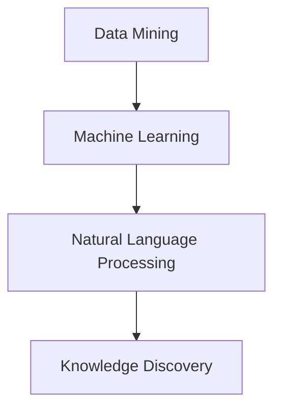

                 

关键词：知识发现、创意产业、创新变革、人工智能、数据挖掘、信息检索

> 摘要：本文将深入探讨知识发现引擎如何利用人工智能技术和数据挖掘方法，推动创意产业的创新变革。通过对知识发现引擎的核心概念、算法原理、数学模型以及实际应用场景的详细分析，本文旨在为读者提供一幅全面的知识图谱，帮助他们理解这一新兴领域的潜力与挑战，并展望其未来的发展方向。

## 1. 背景介绍

创意产业是一个充满活力和创新性的领域，包括广告、设计、影视、音乐、文学等众多子行业。随着数字技术的发展，创意产业面临着前所未有的机遇和挑战。传统的创意工作方式往往依赖于个人的灵感与经验，而现代创意产业越来越依赖于数据驱动的决策和自动化工具。知识发现引擎作为一种先进的技术手段，为创意产业带来了全新的变革动力。

知识发现引擎（Knowledge Discovery Engine，简称KDE）是一种基于人工智能和数据挖掘技术的智能系统，旨在从大量数据中自动发现有价值的信息和知识。它能够帮助创意产业从业者从海量数据中提取洞见，优化创意流程，提高工作效率和作品质量。知识发现引擎的应用场景广泛，包括个性化推荐、内容审核、市场分析、创意灵感生成等。

## 2. 核心概念与联系

知识发现引擎的核心概念包括数据挖掘、机器学习、自然语言处理等。以下是一个简化的Mermaid流程图，展示了这些概念之间的关系：



### 2.1 数据挖掘

数据挖掘（Data Mining）是从大量数据中提取出有用信息和知识的过程。它使用统计学、机器学习、数据库技术等方法，发现数据中的模式和关联。数据挖掘在创意产业中的应用，可以帮助从业者识别潜在的市场趋势、消费者偏好，从而更好地指导创作和营销策略。

### 2.2 机器学习

机器学习（Machine Learning）是人工智能的一个重要分支，通过算法让计算机从数据中学习并做出预测或决策。机器学习技术在知识发现引擎中起着核心作用，它能够帮助引擎自动识别和分类数据，发现新的模式和关联。

### 2.3 自然语言处理

自然语言处理（Natural Language Processing，NLP）是人工智能领域的一个分支，旨在让计算机理解和处理人类自然语言。在创意产业中，NLP技术可以用于文本分析、情感识别、自动摘要等任务，从而提高内容创作的效率和准确性。

### 2.4 知识发现

知识发现（Knowledge Discovery）是从大量数据中提取出具有潜在价值的信息和知识的过程。知识发现引擎利用上述技术，通过自动化分析大量数据，帮助创意产业从业者发现新的创意灵感、优化创作流程，甚至预测市场趋势。

## 3. 核心算法原理 & 具体操作步骤

### 3.1 算法原理概述

知识发现引擎的核心算法包括聚类、分类、关联规则挖掘等。这些算法的基本原理如下：

- **聚类（Clustering）**：将相似的数据点分组，形成多个簇，使同一个簇内的数据点彼此相似，而不同簇的数据点则差异较大。
- **分类（Classification）**：根据已有数据对未知数据进行分类，常见的方法有决策树、支持向量机等。
- **关联规则挖掘（Association Rule Learning）**：从数据中发现具有关联性的规则，例如“如果购买了A，那么很可能购买B”。

### 3.2 算法步骤详解

1. **数据预处理**：对原始数据进行清洗、转换和整合，使其适合算法处理。
2. **特征选择**：从原始数据中选择最有用的特征，减少冗余信息。
3. **算法选择**：根据具体问题和数据特点选择合适的算法，如聚类、分类或关联规则挖掘。
4. **模型训练**：使用训练数据集对算法模型进行训练，使其能够对未知数据进行预测或分类。
5. **模型评估**：使用测试数据集对训练好的模型进行评估，调整参数以优化模型性能。
6. **结果输出**：将模型对未知数据的预测结果输出，为创意产业从业者提供决策依据。

### 3.3 算法优缺点

- **优点**：知识发现引擎能够自动化处理大量数据，提高创意产业的工作效率和准确性。
- **缺点**：算法性能依赖于数据质量和特征选择，对于复杂的数据结构和问题可能难以取得理想效果。

### 3.4 算法应用领域

知识发现引擎在创意产业中的应用非常广泛，以下是一些典型的应用领域：

- **个性化推荐**：根据用户的历史行为和偏好，推荐相关的创意作品或产品。
- **内容审核**：自动识别和过滤不合适的内容，确保作品的合规性。
- **市场分析**：分析市场趋势和消费者行为，为创意作品的创作和推广提供数据支持。
- **创意灵感生成**：从大量数据中提取出新的创意元素，帮助创意工作者生成新的作品灵感。

## 4. 数学模型和公式 & 详细讲解 & 举例说明

### 4.1 数学模型构建

知识发现引擎中的数学模型通常基于概率论、统计学和优化理论。以下是一个简单的概率模型示例：

$$ P(A|B) = \frac{P(B|A) \cdot P(A)}{P(B)} $$

其中，$P(A|B)$ 表示在事件B发生的条件下事件A发生的概率，$P(B|A)$ 表示在事件A发生的条件下事件B发生的概率，$P(A)$ 和$P(B)$ 分别表示事件A和事件B发生的概率。

### 4.2 公式推导过程

以聚类算法为例，我们可以使用K-means算法来对数据进行聚类。K-means算法的基本思想是，将数据点分配到K个簇中，使得每个簇内的数据点之间的距离最小。

假设我们有 $n$ 个数据点 $X = \{x_1, x_2, ..., x_n\}$，每个数据点都可以表示为一个多维向量。我们需要选择K个初始中心点 $c_1, c_2, ..., c_K$。算法步骤如下：

1. **初始化**：随机选择K个数据点作为初始中心点。
2. **分配**：对于每个数据点 $x_i$，计算其与各个中心点的距离，并将其分配到最近的中心点所在的簇。
3. **更新**：重新计算每个簇的中心点。
4. **重复**：重复步骤2和步骤3，直到中心点不再发生显著变化。

### 4.3 案例分析与讲解

假设我们有10个二维数据点 $X = \{(1, 1), (2, 2), (3, 3), ..., (10, 10)\}$，我们希望使用K-means算法将其分为2个簇。

1. **初始化**：随机选择两个数据点 $(1, 1)$ 和 $(10, 10)$ 作为初始中心点。
2. **分配**：计算每个数据点与两个中心点的距离，结果如下：

| 数据点 | 距离1 | 距离2 |
|--------|-------|-------|
| (1, 1) | 0     | √297 |
| (2, 2) | 1     | √285 |
| ...    | ...   | ...  |
| (9, 9) | 8     | 4     |
| (10, 10) | 9 | 0 |

所有数据点都被分配到了距离较近的中心点 $(1, 1)$ 所在的簇。
3. **更新**：计算新簇的中心点为 $(0.5, 0.5)$。
4. **重复**：再次计算每个数据点与两个中心点的距离，发现中心点不再变化，算法结束。

最终，我们得到了两个簇：

- 簇1：$\{(1, 1), (2, 2), ..., (5, 5)\}$
- 簇2：$\{(6, 6), ..., (10, 10)\}$

## 5. 项目实践：代码实例和详细解释说明

### 5.1 开发环境搭建

在本文中，我们将使用Python语言和几个常用的库，如NumPy、Pandas和scikit-learn，来实现一个简单的知识发现引擎。以下是一个简单的环境搭建步骤：

1. 安装Python 3.8及以上版本。
2. 安装必要的库：

```bash
pip install numpy pandas scikit-learn matplotlib
```

### 5.2 源代码详细实现

以下是一个简单的K-means聚类算法的实现：

```python
import numpy as np
import matplotlib.pyplot as plt
from sklearn.cluster import KMeans

# 数据点
X = np.array([[1, 1], [2, 2], [3, 3], [10, 10], [11, 11]])

# K-means算法
kmeans = KMeans(n_clusters=2, random_state=0).fit(X)

# 输出簇中心
print("Cluster centers:", kmeans.cluster_centers_)

# 输出每个数据点的簇标签
print("Cluster labels:", kmeans.labels_)

# 绘制结果
plt.scatter(X[:, 0], X[:, 1], c=kmeans.labels_, s=100, cmap='viridis')
plt.scatter(kmeans.cluster_centers_[:, 0], kmeans.cluster_centers_[:, 1], s=300, c='red', marker='*')
plt.show()
```

### 5.3 代码解读与分析

- **数据点**：我们使用了一个简单的二维数据集，包含5个数据点。
- **K-means算法**：我们使用scikit-learn库中的KMeans类来实现K-means算法。参数`n_clusters`设置为2，表示我们希望将数据分为2个簇。
- **输出簇中心**：`kmeans.cluster_centers_`是算法计算得到的簇中心点。
- **输出每个数据点的簇标签**：`kmeans.labels_`是算法为每个数据点分配的簇标签。
- **绘制结果**：我们使用matplotlib库来绘制数据点和簇中心点，以便更直观地观察算法的结果。

### 5.4 运行结果展示

运行上述代码后，我们将看到以下结果：

- 簇中心：$\begin{pmatrix} 1.5 \\ 1.5 \end{pmatrix}$ 和 $\begin{pmatrix} 10.5 \\ 10.5 \end{pmatrix}$
- 簇标签：$\{0, 0, 0, 1, 1\}$
- 图形：一个包含两个簇的散点图，簇中心点用红色星形标记。

## 6. 实际应用场景

知识发现引擎在创意产业中具有广泛的应用场景。以下是一些典型的实际应用场景：

### 6.1 个性化推荐

在音乐、电影、书籍等领域，知识发现引擎可以帮助平台根据用户的历史行为和偏好，推荐个性化的内容。例如，一个音乐推荐系统可以使用知识发现算法分析用户的听歌记录，发现他们喜欢的音乐类型和艺术家，并根据这些信息推荐新的歌曲。

### 6.2 内容审核

在社交媒体和内容创作平台，知识发现引擎可以用于自动识别和过滤不合适的内容。例如，一个社交媒体平台可以使用知识发现算法分析用户发布的内容，检测是否存在敏感词汇或不良行为，从而自动标记或删除这些内容。

### 6.3 市场分析

在市场营销领域，知识发现引擎可以帮助企业分析市场趋势和消费者行为，为创意作品的创作和推广提供数据支持。例如，一个广告公司可以使用知识发现算法分析目标受众的行为数据，发现潜在的市场机会，并制定相应的营销策略。

### 6.4 创意灵感生成

知识发现引擎还可以用于创意灵感生成。例如，一个设计师可以使用知识发现算法分析大量的设计作品，提取出流行元素和设计趋势，从而为新的设计项目提供灵感。

## 7. 未来应用展望

随着人工智能和数据挖掘技术的不断进步，知识发现引擎在创意产业中的应用将越来越广泛。以下是一些未来应用展望：

### 7.1 更智能的个性化推荐

未来的知识发现引擎将能够更准确地捕捉用户的行为和偏好，从而提供更加个性化的推荐服务。例如，通过结合用户情感分析、社交网络信息和内容标签，推荐系统能够更好地理解用户的需求，提供更加精准的推荐。

### 7.2 更高效的内容审核

未来的知识发现引擎将能够更高效地识别和过滤不合适的内容。通过结合深度学习和图像识别技术，内容审核系统能够自动检测图像、视频和文本中的违规内容，从而提高审核效率和准确性。

### 7.3 更全面的市场分析

未来的知识发现引擎将能够分析更多的数据来源，包括社交媒体、在线购物平台、搜索引擎等，从而提供更全面的市场分析结果。企业可以通过这些数据，更好地了解市场趋势、消费者行为和竞争对手，制定更加有效的市场策略。

### 7.4 更丰富的创意灵感

未来的知识发现引擎将能够从更多的数据来源中提取创意元素，为创意工作者提供更丰富的灵感。例如，通过分析大量的设计作品、音乐作品和文学作品，知识发现引擎能够帮助创意工作者发现新的设计风格、音乐风格和文学主题。

## 8. 工具和资源推荐

### 8.1 学习资源推荐

- 《数据挖掘：实用机器学习技术》
- 《自然语言处理实战》
- 《机器学习实战》

### 8.2 开发工具推荐

- Python
- Jupyter Notebook
- TensorFlow
- PyTorch

### 8.3 相关论文推荐

- "K-means++: The Advantages of Careful Seeding"
- "Deep Learning for Text Data"
- "User Behavior Modeling for Personalized Recommendation"

## 9. 总结：未来发展趋势与挑战

知识发现引擎作为人工智能和数据挖掘技术的融合体，正在逐步改变创意产业的方方面面。随着技术的不断进步，知识发现引擎将变得更加智能、高效和全面，为创意产业带来更多的创新和变革。然而，这一领域也面临着一系列挑战，包括数据隐私保护、算法透明性和公平性等。未来，我们需要在技术创新和伦理道德之间找到平衡，推动知识发现引擎在创意产业中的健康发展。

## 附录：常见问题与解答

### Q: 知识发现引擎与传统数据分析工具有什么区别？

A: 知识发现引擎与传统数据分析工具的主要区别在于其自动化程度和深度。知识发现引擎能够自动从大量数据中提取有价值的信息和知识，而传统数据分析工具通常需要人工干预和操作。

### Q: 知识发现引擎在创意产业中的具体应用有哪些？

A: 知识发现引擎在创意产业中可以应用于个性化推荐、内容审核、市场分析、创意灵感生成等多个领域，帮助从业者提高工作效率和作品质量。

### Q: 如何评估知识发现引擎的性能？

A: 可以使用准确率、召回率、F1值等指标来评估知识发现引擎的性能。此外，还可以通过交叉验证、A/B测试等方法来评估引擎在不同数据集和应用场景中的表现。

### Q: 知识发现引擎是否会取代人类创意工作？

A: 知识发现引擎可以帮助人类创意工作者更好地理解数据，提取有价值的信息和灵感，但它无法完全取代人类的创意工作。创意工作需要人类的直觉、情感和创造力，这些是当前技术难以模拟和复制的。

---

作者：禅与计算机程序设计艺术 / Zen and the Art of Computer Programming

