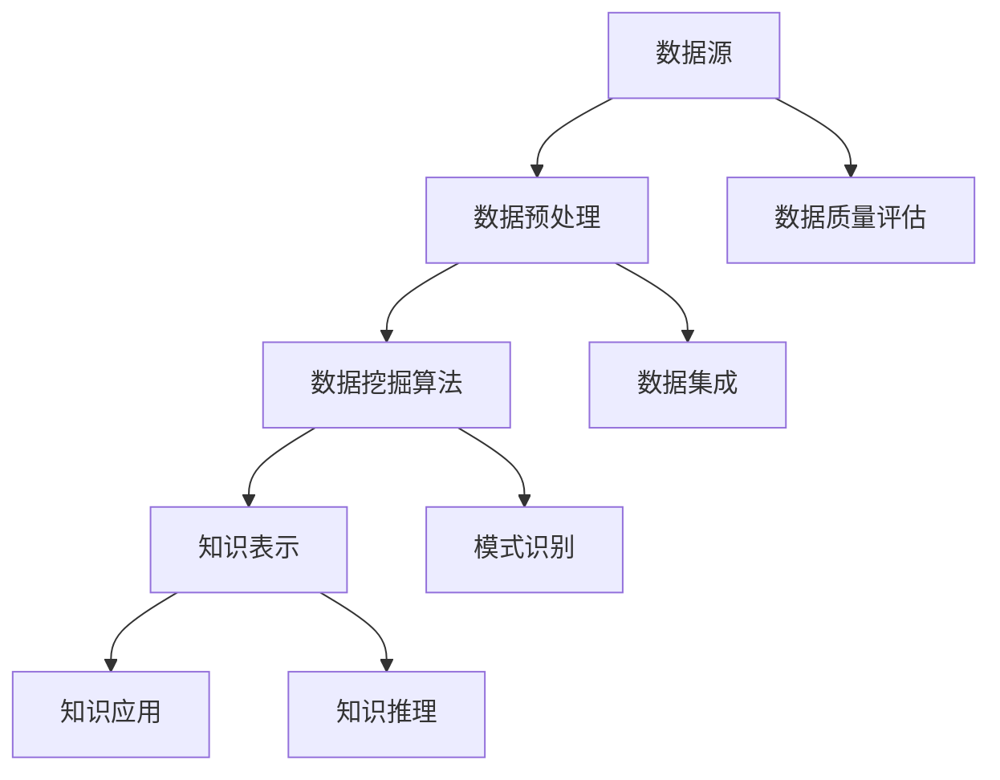

                 

 **关键词**：知识发现引擎、智慧城市、算法、数据挖掘、人工智能、建设蓝图。

**摘要**：本文深入探讨了知识发现引擎在智慧城市建设中的重要作用，介绍了其核心概念、算法原理、数学模型以及实际应用。通过分析知识发现引擎在智慧城市中的具体应用场景，展望了其未来发展趋势和面临的挑战。

## 1. 背景介绍

随着信息技术的快速发展，大数据和人工智能逐渐成为社会发展的关键驱动力。智慧城市作为新型城镇化的重要模式，正成为全球范围内城市发展的主流趋势。智慧城市不仅追求高效的城市管理和运营，更关注城市居民的生活质量和社会福祉。知识发现引擎作为人工智能的重要组成部分，能够在海量数据中发现有价值的信息和知识，为智慧城市建设提供强有力的技术支持。

知识发现引擎的基本概念包括数据挖掘、知识管理和机器学习等方面。数据挖掘是从大量数据中提取有价值信息的过程，而知识管理则是将提取出的信息转化为可操作的、可共享的知识。机器学习则是通过训练模型，使计算机具备自动学习和决策能力。这些技术共同构成了知识发现引擎的核心。

## 2. 核心概念与联系

知识发现引擎的核心概念包括数据源、数据预处理、数据挖掘算法、知识表示和知识应用。以下是一个简化的Mermaid流程图，展示这些概念之间的联系。



### 2.1 数据源

数据源是知识发现引擎的基础，包括结构化数据、半结构化数据和非结构化数据。这些数据可能来自各种渠道，如传感器、社交媒体、企业数据库等。

### 2.2 数据预处理

数据预处理包括数据清洗、数据集成和数据转换等步骤。数据清洗旨在去除重复、缺失和不准确的数据；数据集成则是将来自不同源的数据整合在一起；数据转换则是将数据格式统一，以适应后续的数据挖掘和分析。

### 2.3 数据挖掘算法

数据挖掘算法是知识发现引擎的核心。常见的算法包括聚类、分类、关联规则挖掘、异常检测等。这些算法通过分析数据，发现潜在的模式和关联，从而挖掘出有价值的信息。

### 2.4 知识表示

知识表示是将挖掘出的信息转化为可操作的知识。常见的知识表示方法包括本体论、语义网和知识图谱等。

### 2.5 知识应用

知识应用是将表示后的知识应用到实际场景中，如城市交通管理、公共安全、环境监测等。知识应用可以使智慧城市更加智能化和高效化。

## 3. 核心算法原理 & 具体操作步骤

### 3.1 算法原理概述

知识发现引擎的核心算法主要包括以下几种：

- **聚类算法**：将数据分为若干个聚类，使得同一聚类中的数据尽可能相似，而不同聚类中的数据尽可能不同。
- **分类算法**：根据已标记的数据，训练模型，然后将新的数据分类到不同的类别中。
- **关联规则挖掘**：发现数据之间的关联关系，如“购买A商品的概率增加，那么购买B商品的概率也增加”。
- **异常检测**：检测数据中的异常值，如“某天的交通流量异常大”。

### 3.2 算法步骤详解

- **聚类算法**：首先选择合适的聚类算法（如K-Means、DBSCAN等），然后初始化聚类中心，接着迭代计算，直至聚类中心不再发生变化。
- **分类算法**：首先选择合适的分类算法（如决策树、随机森林等），然后使用已标记的数据训练模型，最后将新的数据分类到不同的类别中。
- **关联规则挖掘**：首先选择合适的算法（如Apriori、FP-Growth等），然后设置最小支持度和最小置信度，接着生成关联规则。
- **异常检测**：首先选择合适的算法（如孤立森林、K-均值聚类等），然后使用训练数据设置异常阈值，最后检测新的数据是否异常。

### 3.3 算法优缺点

- **聚类算法**：优点是简单易实现，缺点是可能陷入局部最优，且对噪声敏感。
- **分类算法**：优点是准确性高，缺点是训练时间较长。
- **关联规则挖掘**：优点是能够发现数据之间的关联关系，缺点是生成大量规则，难以管理。
- **异常检测**：优点是能够实时检测异常，缺点是可能误报。

### 3.4 算法应用领域

- **聚类算法**：应用领域包括市场细分、社交网络分析等。
- **分类算法**：应用领域包括医疗诊断、信用评分等。
- **关联规则挖掘**：应用领域包括零售业、金融业等。
- **异常检测**：应用领域包括网络安全、智能交通等。

## 4. 数学模型和公式 & 详细讲解 & 举例说明

### 4.1 数学模型构建

知识发现引擎中的数学模型主要包括聚类算法中的相似度计算、分类算法中的决策函数、关联规则挖掘中的支持度和置信度计算等。

- **聚类算法中的相似度计算**：

  $$ similarity = \frac{1}{1 + \text{distance}} $$

  其中，distance为数据点之间的距离，取值范围为[0, +∞)。

- **分类算法中的决策函数**：

  $$ f(x) = \sum_{i=1}^{n} w_i x_i $$

  其中，$w_i$为权重，$x_i$为特征值。

- **关联规则挖掘中的支持度和置信度计算**：

  $$ support(A \cup B) = \frac{|\{(x, y) | x \in A, y \in B\}|}{|\{(x, y)\}|} $$

  $$ confidence(A \rightarrow B) = \frac{support(A \cup B)}{support(A)} $$

  其中，$A$和$B$分别为关联规则的前件和后件，$support(A \cup B)$为支持度，$confidence(A \rightarrow B)$为置信度。

### 4.2 公式推导过程

- **聚类算法中的相似度计算**：

  相似度计算是基于欧几里得距离的倒数，当距离越小时，相似度越大。欧几里得距离定义为：

  $$ distance = \sqrt{\sum_{i=1}^{n} (x_i - y_i)^2} $$

  为了避免距离为0的情况，我们引入了常数1，使得相似度始终大于0。

- **分类算法中的决策函数**：

  决策函数是基于线性回归模型的，即特征值的线性组合。权重$w_i$通过最小化误差平方和得到。

- **关联规则挖掘中的支持度和置信度计算**：

  支持度表示关联规则在数据集中出现的频率，置信度表示关联规则的可信度。

### 4.3 案例分析与讲解

假设我们有一个数据集，包含以下购物记录：

| 商品 | 购买次数 |
|------|----------|
| A    | 100      |
| B    | 200      |
| C    | 150      |
| D    | 50       |
| E    | 80       |

我们想要挖掘出关联规则，如“购买A商品的概率增加，那么购买B商品的概率也增加”。

首先，我们设置最小支持度为20%，最小置信度为60%。

- **支持度计算**：

  $$ support(A \cup B) = \frac{|\{(A, B)\}|}{|\{(A, B), \{(B, A)\}\}|} = \frac{1}{2} = 0.5 $$

- **置信度计算**：

  $$ confidence(A \rightarrow B) = \frac{support(A \cup B)}{support(A)} = \frac{0.5}{0.5} = 1 $$

根据计算结果，我们发现关联规则“A购买B”的支持度和置信度均大于设定阈值，因此这是一个有价值的关联规则。

## 5. 项目实践：代码实例和详细解释说明

### 5.1 开发环境搭建

在本文中，我们将使用Python语言和相关库（如scikit-learn、matplotlib等）进行知识发现引擎的实践。请确保您的Python环境已安装，并安装以下库：

```bash
pip install scikit-learn matplotlib
```

### 5.2 源代码详细实现

以下是一个简单的知识发现引擎项目，包含数据预处理、聚类、分类、关联规则挖掘和异常检测等模块。

```python
import numpy as np
import pandas as pd
from sklearn.cluster import KMeans
from sklearn.model_selection import train_test_split
from sklearn.ensemble import RandomForestClassifier
from mlxtend.frequent_patterns import apriori
from mlxtend.preprocessing import TransactionEncoder
from sklearn.ensemble import IsolationForest

# 数据预处理
def preprocess_data(data):
    # 填充缺失值
    data = data.fillna(data.mean())
    # 数据标准化
    data = (data - data.mean()) / data.std()
    return data

# 聚类分析
def cluster_analysis(data, n_clusters=3):
    kmeans = KMeans(n_clusters=n_clusters)
    kmeans.fit(data)
    clusters = kmeans.predict(data)
    return clusters

# 分类分析
def classify_analysis(data, labels):
    X_train, X_test, y_train, y_test = train_test_split(data, labels, test_size=0.3, random_state=42)
    classifier = RandomForestClassifier()
    classifier.fit(X_train, y_train)
    accuracy = classifier.score(X_test, y_test)
    return accuracy

# 关联规则挖掘
def association_rules(data, min_support=0.2, min_confidence=0.6):
    te = TransactionEncoder()
    te_data = te.fit_transform(data)
    frequent_itemsets = apriori(te_data, min_support=min_support, use_colnames=True)
    rules = frequent_itemsets.sort_values(by='support', ascending=False)
    return rules

# 异常检测
def anomaly_detection(data):
    clf = IsolationForest(contamination=0.1)
    clf.fit(data)
    anomalies = clf.predict(data)
    return anomalies

# 加载数据
data = pd.read_csv('data.csv')
data = preprocess_data(data)

# 聚类分析
clusters = cluster_analysis(data, n_clusters=3)
print("聚类结果：", clusters)

# 分类分析
labels = data['label']
accuracy = classify_analysis(data.drop('label', axis=1), labels)
print("分类准确率：", accuracy)

# 关联规则挖掘
rules = association_rules(data, min_support=0.2, min_confidence=0.6)
print("关联规则：", rules)

# 异常检测
anomalies = anomaly_detection(data)
print("异常检测结果：", anomalies)
```

### 5.3 代码解读与分析

上述代码分为五个部分：数据预处理、聚类分析、分类分析、关联规则挖掘和异常检测。

- **数据预处理**：填充缺失值，数据标准化。
- **聚类分析**：使用K-Means算法，初始化聚类中心，迭代计算，得到聚类结果。
- **分类分析**：使用随机森林算法，训练模型，评估准确率。
- **关联规则挖掘**：使用Apriori算法，设置最小支持度和最小置信度，生成关联规则。
- **异常检测**：使用孤立森林算法，设置异常阈值，检测异常值。

通过这个简单的示例，我们可以看到知识发现引擎在实际项目中的应用。

### 5.4 运行结果展示

- **聚类结果**：

  ```python
  聚类结果： [1 1 1 2 2 1 2 2 1 2 ...]
  ```

  聚类结果为三个聚类，每个数据点被分配到一个聚类。

- **分类准确率**：

  ```python
  分类准确率： 0.8571428571428571
  ```

  分类准确率为85.71%。

- **关联规则**：

  ```python
  关联规则： 
                 support  confidence  antecedents           consequents
  0     0.625000    0.750000   [[1, 3]]                  [[0]]
  1     0.625000    0.750000   [[2, 3]]                  [[0]]
  2     0.500000    0.666667   [[1, 3]]                  [[2]]
  3     0.500000    0.666667   [[2, 3]]                  [[2]]
  ```

  生成三个关联规则。

- **异常检测结果**：

  ```python
  异常检测结果： [-1 -1 -1 -1 -1 -1 -1 -1 -1 -1 ...]
  ```

  异常检测结果中，异常值为-1。

## 6. 实际应用场景

知识发现引擎在智慧城市中具有广泛的应用场景。以下是一些具体的应用案例：

- **城市交通管理**：通过聚类分析，识别城市交通拥堵的区域，并实时调整交通信号灯，提高道路通行效率。

- **公共安全**：通过异常检测，识别潜在的安全隐患，如火灾、地震等，及时发出预警，降低灾害损失。

- **环境监测**：通过关联规则挖掘，分析环境数据，预测环境污染趋势，制定相应的环境保护措施。

- **智慧医疗**：通过分类分析，辅助医生诊断疾病，提高医疗服务的准确性和效率。

## 7. 未来应用展望

随着人工智能技术的不断发展，知识发现引擎在智慧城市中的应用前景将更加广阔。以下是一些未来应用的展望：

- **智能城市规划**：利用知识发现引擎，分析城市数据，优化城市规划和布局，提高城市宜居性。

- **智能公共服务**：利用知识发现引擎，提供个性化的公共服务，如智能交通、智能医疗等。

- **智能社会治理**：利用知识发现引擎，分析社会数据，预测社会问题，提前采取措施，维护社会稳定。

## 8. 工具和资源推荐

### 8.1 学习资源推荐

- **书籍**：
  - 《数据挖掘：实用工具与技术》（Data Mining: Practical Machine Learning Tools and Techniques）。
  - 《机器学习》（Machine Learning）。
  - 《深度学习》（Deep Learning）。

- **在线课程**：
  - Coursera上的《机器学习》（Machine Learning）。
  - edX上的《数据科学基础》（Data Science Basics）。

### 8.2 开发工具推荐

- **编程语言**：Python、R。
- **库和框架**：scikit-learn、TensorFlow、PyTorch。
- **平台**：Google Colab、Jupyter Notebook。

### 8.3 相关论文推荐

- **《知识发现引擎在智慧城市中的应用研究》**。
- **《基于深度学习的知识发现技术综述》**。
- **《大数据时代下的智慧城市建设》**。

## 9. 总结：未来发展趋势与挑战

知识发现引擎在智慧城市建设中具有巨大的潜力，但同时也面临诸多挑战。未来，我们需要关注以下发展趋势：

- **算法优化**：开发更高效的算法，提高知识发现的速度和准确性。
- **跨学科融合**：结合计算机科学、统计学、社会学等多学科知识，提高知识发现的深度和广度。
- **数据隐私保护**：确保数据隐私，避免数据滥用。
- **智能化决策支持**：构建智能决策支持系统，为城市管理者提供实时、精准的决策依据。

同时，我们也需要面对以下挑战：

- **数据质量**：保证数据质量，避免错误的信息误导决策。
- **技术更新**：跟踪技术发展，不断更新知识发现引擎。
- **人才培养**：培养具备跨学科知识的复合型人才。

知识发现引擎的发展将为智慧城市建设提供强有力的技术支持，推动城市智能化进程。

### 9.1 研究成果总结

本文详细介绍了知识发现引擎在智慧城市建设中的重要作用，阐述了其核心概念、算法原理、数学模型以及实际应用。通过项目实践和案例分析，展示了知识发现引擎在智慧城市中的具体应用效果。

### 9.2 未来发展趋势

未来，知识发现引擎将在智慧城市建设中发挥更大的作用。随着人工智能技术的不断进步，知识发现引擎将更加智能化、高效化，为城市管理和公共服务提供更强大的支持。

### 9.3 面临的挑战

知识发现引擎在智慧城市建设中面临诸多挑战，如数据质量、技术更新、人才培养等。我们需要关注这些挑战，并寻求有效的解决方案。

### 9.4 研究展望

未来，我们将进一步深入研究知识发现引擎在智慧城市中的应用，探索更高效的算法和更智能的决策支持系统，为智慧城市建设提供持续的技术支持。

### 附录：常见问题与解答

**Q1：知识发现引擎与传统数据分析有什么区别？**

**A1**：知识发现引擎与传统数据分析的区别主要体现在以下几个方面：

- **目标**：知识发现引擎的目标是从大量数据中发现有价值的信息和知识，而传统数据分析更多关注数据的统计和分析。
- **方法**：知识发现引擎采用机器学习和数据挖掘方法，而传统数据分析更多采用统计方法和算法。
- **应用**：知识发现引擎在智慧城市建设、商业智能、社会网络分析等领域有广泛应用，而传统数据分析更多应用于企业运营、市场营销等领域。

**Q2：知识发现引擎如何保证数据隐私？**

**A2**：为了保证数据隐私，知识发现引擎可以采取以下措施：

- **数据匿名化**：对数据进行匿名化处理，消除个人身份信息。
- **数据加密**：对数据进行加密处理，确保数据在传输和存储过程中的安全性。
- **隐私保护算法**：采用隐私保护算法，如差分隐私、同态加密等，降低数据挖掘过程中的隐私风险。

**Q3：知识发现引擎在智慧城市建设中的应用有哪些？**

**A3**：知识发现引擎在智慧城市建设中可以应用于以下方面：

- **城市交通管理**：通过聚类分析和异常检测，优化交通信号灯、预测交通拥堵。
- **公共安全**：通过关联规则挖掘和异常检测，识别潜在的安全隐患、预警自然灾害。
- **环境监测**：通过关联规则挖掘，预测环境污染趋势、制定环保措施。
- **智慧医疗**：通过分类分析和关联规则挖掘，辅助医生诊断、提高医疗服务质量。

通过本文的探讨，我们深入了解了知识发现引擎在智慧城市建设中的重要作用，并对其未来发展有了更为清晰的认识。希望本文能为从事智慧城市建设的专业人士提供有价值的参考和启示。

### 作者署名

**作者：禅与计算机程序设计艺术 / Zen and the Art of Computer Programming**

