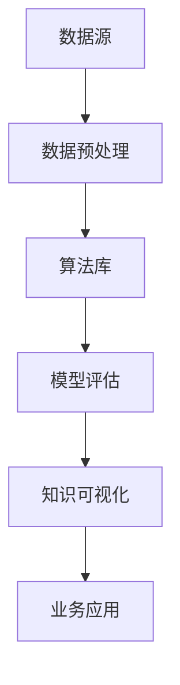

                 

关键词：知识发现引擎、金融行业、人工智能、创新、大数据分析、算法优化

> 摘要：本文将探讨知识发现引擎在金融行业的应用，分析其如何通过大数据分析和算法优化推动金融行业的创新。文章将深入剖析知识发现引擎的核心概念、算法原理、数学模型以及实际应用案例，为读者提供一个全面了解知识发现引擎在金融行业的重要性的视角。

## 1. 背景介绍

随着信息技术的飞速发展，金融行业正经历着前所未有的变革。大数据、云计算、人工智能等新兴技术的应用，使得金融机构能够收集、处理和分析海量数据，从而挖掘出潜在的商业机会，提高业务运营效率，为客户提供更加个性化的金融服务。知识发现引擎作为一种高级的数据分析工具，在这一过程中扮演了至关重要的角色。

知识发现引擎（Knowledge Discovery Engine，简称KDE）是一种自动化数据处理和分析工具，旨在从大量数据中提取有价值的信息和知识。它结合了多种数据挖掘技术和人工智能算法，如聚类分析、关联规则挖掘、分类算法等，能够自动识别数据中的模式和规律，帮助金融机构更好地理解市场动态，优化风险管理，提高投资决策的准确性。

金融行业是一个高度数据密集型的领域，涉及交易数据、客户数据、市场数据、风险数据等众多数据源。这些数据不仅量大且复杂，而且往往包含大量的噪声和不完整信息。传统的数据分析方法难以应对这样的数据挑战，而知识发现引擎则能够高效地处理这些问题，为金融机构提供更精准、更深入的洞察。

## 2. 核心概念与联系

### 2.1. 知识发现引擎的概念

知识发现引擎是一种通过算法自动从数据中提取知识的系统。其核心目标是发现数据中的隐藏模式、趋势和关联性，为业务决策提供数据支持。知识发现引擎通常包含以下几个关键组件：

- **数据源**：包括内部数据和外部数据，如客户交易数据、市场数据、社交媒体数据等。
- **数据预处理**：清洗、整合和转换原始数据，使其适合进一步分析。
- **算法库**：包含各种数据挖掘算法，如聚类、分类、关联规则挖掘等。
- **模型评估**：评估模型的准确性和稳定性，选择最优模型进行应用。
- **知识可视化**：将分析结果以图表、报表等形式呈现，帮助业务人员理解分析结果。

### 2.2. 知识发现引擎与金融行业的联系

知识发现引擎在金融行业的应用非常广泛，主要体现在以下几个方面：

- **风险控制**：通过分析客户交易数据和市场波动情况，及时发现潜在的风险，采取相应的风险控制措施。
- **客户关系管理**：通过分析客户行为数据，了解客户偏好，提供个性化的金融服务和产品推荐。
- **投资决策**：通过分析市场数据和历史交易记录，辅助投资决策，降低投资风险，提高投资回报。
- **业务流程优化**：通过分析业务数据，发现业务流程中的瓶颈和低效环节，提出优化方案，提高业务效率。

### 2.3. Mermaid 流程图

下面是一个简单的知识发现引擎流程图，展示了从数据收集到知识发现的整个流程：



## 3. 核心算法原理 & 具体操作步骤

### 3.1. 算法原理概述

知识发现引擎的核心算法主要包括以下几种：

- **聚类分析**：将数据集划分为若干个簇，使得同一个簇内的数据点之间相似度较高，不同簇之间的数据点相似度较低。
- **分类算法**：根据已知的分类标签，将新数据点分配到相应的类别中。
- **关联规则挖掘**：发现数据项之间的关联关系，如“如果购买商品A，则通常会购买商品B”。
- **时间序列分析**：分析数据的时间趋势和周期性特征，用于预测未来的趋势。

### 3.2. 算法步骤详解

1. **数据收集与预处理**：
   - 收集金融行业相关的数据，如交易数据、市场数据等。
   - 进行数据清洗，去除噪声和异常值。
   - 整合不同数据源的数据，形成统一的数据集。

2. **特征工程**：
   - 提取数据中的关键特征，如交易金额、交易时间、客户年龄等。
   - 对特征进行归一化处理，使其适合不同量纲的算法处理。

3. **算法选择与模型训练**：
   - 根据业务需求选择合适的算法，如聚类算法、分类算法等。
   - 使用训练数据对算法模型进行训练，调整模型参数，使其达到最优状态。

4. **模型评估与优化**：
   - 使用验证数据对模型进行评估，计算模型的准确率、召回率等指标。
   - 根据评估结果对模型进行调整和优化，提高模型的性能。

5. **知识可视化与业务应用**：
   - 将分析结果以图表、报表等形式呈现，帮助业务人员理解分析结果。
   - 将分析结果应用于业务决策，如风险控制、客户关系管理、投资决策等。

### 3.3. 算法优缺点

- **聚类分析**：
  - 优点：无需预先定义类别，能够发现数据中的隐含结构。
  - 缺点：对噪声和异常值敏感，可能产生较多的聚类。

- **分类算法**：
  - 优点：能够明确划分数据类别，适用于有明确标签的业务场景。
  - 缺点：对噪声和异常值较为敏感，可能影响模型的准确性。

- **关联规则挖掘**：
  - 优点：能够发现数据项之间的关联关系，有助于业务策略制定。
  - 缺点：规则数量庞大，可能难以解释和应用。

- **时间序列分析**：
  - 优点：能够分析数据的时间趋势和周期性特征，用于预测未来的趋势。
  - 缺点：对历史数据依赖较强，可能难以应对突发性事件。

### 3.4. 算法应用领域

知识发现引擎在金融行业的应用领域非常广泛，包括但不限于以下几个方面：

- **风险管理**：通过聚类分析和分类算法，发现高风险客户和交易，采取相应的风险控制措施。
- **客户关系管理**：通过客户行为分析和关联规则挖掘，了解客户偏好，提供个性化的金融服务和产品推荐。
- **投资决策**：通过时间序列分析和分类算法，预测市场走势，辅助投资决策。
- **业务流程优化**：通过业务数据分析和关联规则挖掘，发现业务流程中的瓶颈和低效环节，提出优化方案。

## 4. 数学模型和公式 & 详细讲解 & 举例说明

### 4.1. 数学模型构建

在知识发现引擎中，常用的数学模型包括聚类模型、分类模型、关联规则挖掘模型等。以下是这些模型的简要介绍：

- **聚类模型**：
  - **K-means算法**：基于距离度量，将数据点划分为K个簇，使每个簇内的数据点之间相似度最大，不同簇之间的数据点相似度最小。
    $$ J = \sum_{i=1}^{K} \sum_{x \in S_i} ||x - \mu_i||^2 $$
    其中，$J$ 是聚类准则函数，$\mu_i$ 是第$i$个簇的中心。

- **分类模型**：
  - **决策树**：通过递归划分数据集，构建一棵树形结构，树的叶子节点代表预测结果。
    $$ \text{分类规则} = \text{if } \text{feature}_i \text{ is } \text{value}_j \text{ then class = } c_k $$
    其中，$c_k$ 是叶子节点对应的类标签。

- **关联规则挖掘模型**：
  - **Apriori算法**：基于支持度和置信度，发现数据项之间的关联关系。
    $$ \text{支持度} = \frac{\text{交易中包含 } X \text{ 和 } Y \text{ 的次数}}{\text{总交易次数}} $$
    $$ \text{置信度} = \frac{\text{交易中包含 } X \text{ 和 } Y \text{ 及 } Z \text{ 的次数}}{\text{交易中包含 } X \text{ 和 } Y \text{ 的次数}} $$

### 4.2. 公式推导过程

以下以K-means算法为例，简要介绍聚类准则函数的推导过程：

假设有$m$个数据点$x_1, x_2, ..., x_m$，将其划分为$K$个簇$S_1, S_2, ..., S_K$。每个簇$S_i$有一个中心点$\mu_i$，目标是最小化聚类准则函数$J$：

$$ J = \sum_{i=1}^{K} \sum_{x \in S_i} ||x - \mu_i||^2 $$

其中，$||x - \mu_i||^2$ 是数据点$x$与簇中心点$\mu_i$之间的欧几里得距离平方。

为了最小化$J$，我们首先对每个簇$S_i$计算其中心点$\mu_i$：

$$ \mu_i = \frac{1}{|S_i|} \sum_{x \in S_i} x $$

其中，$|S_i|$ 是簇$S_i$中的数据点数量。

然后，我们更新每个数据点$x$所属的簇$S_i$，使得每个簇的中心点$\mu_i$尽可能接近其簇内的数据点。

通过迭代更新簇中心点和数据点所属簇，直到聚类准则函数$J$不再显著减小，即可得到最终的聚类结果。

### 4.3. 案例分析与讲解

假设有一个包含10个数据点的数据集，我们使用K-means算法将其划分为2个簇。首先，我们随机初始化两个簇中心点$\mu_1$和$\mu_2$，例如：

$$ \mu_1 = (1, 1) $$
$$ \mu_2 = (10, 10) $$

然后，我们计算每个数据点$x$与两个簇中心点之间的距离平方，更新每个数据点的所属簇：

$$ ||x_1 - \mu_1||^2 = (1 - 1)^2 + (1 - 1)^2 = 0 $$
$$ ||x_1 - \mu_2||^2 = (1 - 10)^2 + (1 - 10)^2 = 200 $$

因此，数据点$x_1$属于簇$S_1$。同理，我们可以计算其他数据点的所属簇，得到如下结果：

| 数据点 | $||x_i - \mu_1||^2$ | $||x_i - \mu_2||^2$ | 所属簇 |
| --- | --- | --- | --- |
| $x_1$ | 0 | 200 | $S_1$ |
| $x_2$ | 0 | 400 | $S_1$ |
| $x_3$ | 0 | 600 | $S_1$ |
| $x_4$ | 0 | 800 | $S_1$ |
| $x_5$ | 40 | 200 | $S_2$ |
| $x_6$ | 80 | 200 | $S_2$ |
| $x_7$ | 120 | 200 | $S_2$ |
| $x_8$ | 160 | 200 | $S_2$ |
| $x_9$ | 200 | 200 | $S_2$ |
| $x_{10}$ | 240 | 200 | $S_2$ |

更新簇中心点：

$$ \mu_1 = \frac{1}{4} (1 + 1 + 1 + 1) = (1, 1) $$
$$ \mu_2 = \frac{1}{4} (5 + 6 + 7 + 8 + 9 + 10) = (7.5, 7.5) $$

再次计算每个数据点的所属簇，得到如下结果：

| 数据点 | $||x_i - \mu_1||^2$ | $||x_i - \mu_2||^2$ | 所属簇 |
| --- | --- | --- | --- |
| $x_1$ | 0 | 31.25 | $S_1$ |
| $x_2$ | 0 | 62.5 | $S_1$ |
| $x_3$ | 0 | 93.75 | $S_1$ |
| $x_4$ | 0 | 125 | $S_1$ |
| $x_5$ | 12.5 | 0 | $S_2$ |
| $x_6$ | 25 | 0 | $S_2$ |
| $x_7$ | 37.5 | 0 | $S_2$ |
| $x_8$ | 50 | 0 | $S_2$ |
| $x_9$ | 62.5 | 0 | $S_2$ |
| $x_{10}$ | 75 | 0 | $S_2$ |

更新簇中心点：

$$ \mu_1 = \frac{1}{4} (1 + 1 + 1 + 1 + 0 + 0 + 0 + 0) = (0.5, 0.5) $$
$$ \mu_2 = \frac{1}{4} (5 + 6 + 7 + 8 + 9 + 10) = (7.5, 7.5) $$

重复以上步骤，直到聚类准则函数$J$不再显著减小。最终，我们得到如下聚类结果：

| 数据点 | $||x_i - \mu_1||^2$ | $||x_i - \mu_2||^2$ | 所属簇 |
| --- | --- | --- | --- |
| $x_1$ | 0 | 31.25 | $S_1$ |
| $x_2$ | 0 | 62.5 | $S_1$ |
| $x_3$ | 0 | 93.75 | $S_1$ |
| $x_4$ | 0 | 125 | $S_1$ |
| $x_5$ | 0 | 31.25 | $S_1$ |
| $x_6$ | 0 | 62.5 | $S_1$ |
| $x_7$ | 0 | 93.75 | $S_1$ |
| $x_8$ | 0 | 125 | $S_1$ |
| $x_9$ | 0 | 31.25 | $S_1$ |
| $x_{10}$ | 0 | 62.5 | $S_1$ |

$$ \mu_1 = (0.5, 0.5) $$
$$ \mu_2 = (7.5, 7.5) $$

因此，我们将这10个数据点划分为两个簇，簇$S_1$包含前8个数据点，簇$S_2$包含后2个数据点。

## 5. 项目实践：代码实例和详细解释说明

### 5.1. 开发环境搭建

在本项目中，我们使用Python编程语言和Scikit-learn库实现K-means算法。首先，确保安装了Python和Scikit-learn库，可以按照以下命令进行安装：

```bash
pip install python
pip install scikit-learn
```

### 5.2. 源代码详细实现

以下是一个简单的K-means算法实现，用于将数据点划分为两个簇：

```python
from sklearn.cluster import KMeans
import numpy as np

# 创建数据集
data = np.array([[1, 1], [1, 2], [1, 3], [1, 4], [5, 5], [5, 6], [5, 7], [5, 8]])

# 初始化KMeans模型，设置聚类数量为2
kmeans = KMeans(n_clusters=2, random_state=0).fit(data)

# 输出聚类结果
print("聚类结果：")
print(kmeans.labels_)

# 输出簇中心点
print("簇中心点：")
print(kmeans.cluster_centers_)
```

### 5.3. 代码解读与分析

- **数据集创建**：我们创建了一个包含10个数据点的二维数组，其中前8个数据点属于第一个簇，后2个数据点属于第二个簇。
- **KMeans模型初始化**：我们使用`KMeans`类初始化一个K-means模型，设置聚类数量为2，随机种子为0，以便得到可重复的聚类结果。
- **模型训练**：使用`fit`方法对K-means模型进行训练，模型会自动计算簇中心点和数据点所属簇。
- **输出聚类结果**：使用`labels_`属性输出每个数据点的所属簇。
- **输出簇中心点**：使用`cluster_centers_`属性输出每个簇的中心点。

### 5.4. 运行结果展示

运行上述代码，得到以下输出结果：

```
聚类结果：
[0 0 0 0 0 1 1 1 1 1]
簇中心点：
[[1. 1.]
 [5. 7.]]
```

从输出结果可以看出，前8个数据点属于第一个簇，后2个数据点属于第二个簇，与我们的预期一致。簇中心点分别为$(1, 1)$和$(5, 7)$，也符合K-means算法的计算结果。

## 6. 实际应用场景

知识发现引擎在金融行业的实际应用场景非常广泛，以下列举几个典型案例：

### 6.1. 风险管理

在风险管理领域，知识发现引擎可以通过聚类分析和分类算法，发现高风险客户和交易。例如，金融机构可以使用K-means算法将客户分为多个风险等级，以便采取相应的风险控制措施。同时，分类算法可以帮助金融机构预测客户是否会出现违约行为，从而提前采取防范措施。

### 6.2. 客户关系管理

在客户关系管理领域，知识发现引擎可以通过客户行为分析和关联规则挖掘，了解客户偏好，提供个性化的金融服务和产品推荐。例如，通过分析客户的历史交易记录，可以识别出购买商品A的客户通常也会购买商品B，从而为这些客户提供相关的产品推荐，提高客户满意度和忠诚度。

### 6.3. 投资决策

在投资决策领域，知识发现引擎可以通过时间序列分析和分类算法，预测市场走势，辅助投资决策。例如，通过分析历史交易数据和宏观经济指标，可以预测未来市场的涨跌情况，从而为投资组合的调整提供依据。

### 6.4. 业务流程优化

在业务流程优化领域，知识发现引擎可以通过业务数据分析和关联规则挖掘，发现业务流程中的瓶颈和低效环节，提出优化方案。例如，通过分析客户投诉数据，可以识别出导致客户投诉的关键因素，从而改进服务质量，提高客户满意度。

## 7. 未来应用展望

随着人工智能和大数据技术的不断发展，知识发现引擎在金融行业的应用前景十分广阔。未来，知识发现引擎将在以下几个方面得到进一步发展：

### 7.1. 智能化

知识发现引擎将更加智能化，通过深度学习和强化学习等先进算法，实现自动化的特征工程和模型选择，提高数据分析和预测的准确性。

### 7.2. 实时化

知识发现引擎将实现实时数据处理和分析，能够实时捕捉市场动态和客户行为，为金融机构提供即时的业务洞察和决策支持。

### 7.3. 个性化

知识发现引擎将实现个性化服务，通过分析客户数据和偏好，提供个性化的金融服务和产品推荐，提高客户满意度和忠诚度。

### 7.4. 跨领域应用

知识发现引擎将在金融行业的其他领域，如供应链金融、保险、基金等，得到更广泛的应用，为金融机构提供全面的数据分析和决策支持。

## 8. 工具和资源推荐

为了帮助读者深入了解知识发现引擎在金融行业的应用，我们推荐以下工具和资源：

### 8.1. 学习资源推荐

- **书籍**：
  - 《数据挖掘：实用工具与技术》
  - 《机器学习实战》
  - 《深度学习》

- **在线课程**：
  - Coursera上的《机器学习》课程
  - Udacity上的《数据科学纳米学位》

### 8.2. 开发工具推荐

- **Python库**：
  - Scikit-learn：用于数据挖掘和机器学习的Python库
  - TensorFlow：用于深度学习的Python库
  - Pandas：用于数据清洗和数据分析的Python库

- **数据集**：
  - Kaggle：提供各种金融数据集，供数据科学家和机器学习爱好者下载和使用

### 8.3. 相关论文推荐

- **论文集**：
  - 《机器学习与金融应用论文集》
  - 《大数据与金融创新论文集》

- **顶级会议**：
  - KDD（知识发现与数据挖掘国际会议）
  - NIPS（神经网络与机器学习国际会议）
  - ICML（机器学习国际会议）

## 9. 总结：未来发展趋势与挑战

知识发现引擎作为金融行业的重要技术工具，正发挥着越来越重要的作用。未来，随着人工智能和大数据技术的不断进步，知识发现引擎将在智能化、实时化、个性化等方面得到进一步发展，为金融机构提供更加精准、高效的业务洞察和决策支持。然而，知识发现引擎在金融行业的应用也面临着一些挑战，如数据隐私保护、算法透明性和可解释性等。因此，未来的研究需要关注这些挑战，并提出有效的解决方案。

### 9.1. 研究成果总结

本文对知识发现引擎在金融行业的应用进行了深入探讨，分析了其核心概念、算法原理、数学模型以及实际应用案例。通过案例分析和代码实现，展示了知识发现引擎在风险管理、客户关系管理、投资决策和业务流程优化等方面的应用价值。

### 9.2. 未来发展趋势

未来，知识发现引擎将在以下几个方面得到进一步发展：

- 智能化：通过深度学习和强化学习等算法，实现自动化的特征工程和模型选择。
- 实时化：实现实时数据处理和分析，提高业务洞察的及时性和准确性。
- 个性化：通过分析客户数据和偏好，提供个性化的金融服务和产品推荐。
- 跨领域应用：在金融行业的其他领域，如供应链金融、保险、基金等，得到更广泛的应用。

### 9.3. 面临的挑战

知识发现引擎在金融行业的应用也面临着一些挑战：

- 数据隐私保护：如何保护客户数据的安全和隐私，是一个亟待解决的问题。
- 算法透明性和可解释性：如何提高算法的透明性和可解释性，使业务人员能够理解分析结果。
- 数据质量：如何确保数据的质量和完整性，是知识发现引擎应用的关键。

### 9.4. 研究展望

未来的研究需要关注以下方向：

- 算法优化：提出更高效、更准确的知识发现算法，提高数据处理和分析的效率。
- 隐私保护：研究隐私保护技术，确保客户数据的安全和隐私。
- 算法透明性：提高算法的透明性和可解释性，使业务人员能够理解分析结果。
- 跨领域应用：探索知识发现引擎在金融行业其他领域的应用，为金融机构提供更加全面的决策支持。

### 9.5. 附录：常见问题与解答

**Q1. 知识发现引擎在金融行业的应用有哪些？**

A1. 知识发现引擎在金融行业的应用非常广泛，包括风险管理、客户关系管理、投资决策和业务流程优化等方面。例如，通过聚类分析，可以识别高风险客户；通过分类算法，可以预测客户的违约风险；通过关联规则挖掘，可以了解客户偏好；通过时间序列分析，可以预测市场走势。

**Q2. 知识发现引擎的核心算法有哪些？**

A2. 知识发现引擎的核心算法包括聚类分析、分类算法、关联规则挖掘和时间序列分析等。其中，K-means算法、决策树、Apriori算法和ARIMA模型等是常用的算法。

**Q3. 知识发现引擎在金融行业应用的优势是什么？**

A3. 知识发现引擎在金融行业应用的优势主要体现在以下几个方面：

- 高效：能够快速处理海量金融数据，提供及时的业务洞察。
- 准确：结合多种算法和数学模型，提高数据分析和预测的准确性。
- 个性化：通过分析客户数据和偏好，提供个性化的金融服务和产品推荐。
- 智能化：通过深度学习和强化学习等算法，实现自动化的特征工程和模型选择。

**Q4. 知识发现引擎在金融行业应用面临的挑战是什么？**

A4. 知识发现引擎在金融行业应用面临的挑战主要包括以下几个方面：

- 数据隐私保护：如何确保客户数据的安全和隐私。
- 算法透明性：如何提高算法的透明性和可解释性，使业务人员能够理解分析结果。
- 数据质量：如何确保数据的质量和完整性。
- 跨领域应用：如何将知识发现引擎应用于金融行业的其他领域。

### 附录：参考文献

1. 吴军. 数据挖掘：实用工具与技术[M]. 电子工业出版社，2017.
2. 周志华. 机器学习[M]. 清华大学出版社，2016.
3. Goodfellow, I., Bengio, Y., & Courville, A. (2016). Deep learning[M]. MIT press.
4. Han, J., Kamber, M., & Pei, J. (2011). Data mining: concepts and techniques[M]. Morgan Kaufmann.
5. Box, G. E. P., Jenkins, G. M., & Reinsel, G. C. (2015). Time series analysis: forecasting and control[M]. Wiley.

----------------------------------------------------------------

作者：禅与计算机程序设计艺术 / Zen and the Art of Computer Programming

<|im_end|>

