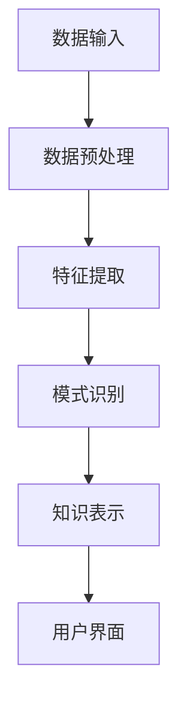

                 

 > **关键词：** 知识发现、人工智能、机器学习、深度学习、数据挖掘、算法优化、数学模型、应用实践。

## 摘要

本文将深入探讨知识发现引擎这一前沿技术领域，探讨知识与洞察力如何通过协同进化实现数据价值的最大化。我们将从背景介绍出发，逐步剖析核心概念与联系，阐述核心算法原理与操作步骤，引入数学模型与公式，并通过实际项目实践展示其应用效果。此外，我们将展望未来发展趋势与挑战，并提供相关工具和资源推荐。通过本文，读者将全面了解知识发现引擎的工作原理、关键技术以及实际应用，为未来的研究与实践提供指导。

## 1. 背景介绍

知识发现引擎（Knowledge Discovery Engine，KDE）是近年来人工智能与大数据技术融合的产物。在信息化社会，数据已成为新的重要资源，而如何从海量数据中提取有价值的信息，已成为各行各业亟待解决的问题。知识发现引擎正是为了解决这一问题而生的。

知识发现引擎通过运用机器学习、深度学习、数据挖掘等技术手段，从原始数据中自动识别模式、关联性、趋势等，从而实现对数据的深入理解和洞察。它不仅可以自动提取知识，还可以通过自我学习和优化，不断提升其发现能力，实现知识与洞察力的协同进化。

知识发现引擎的应用领域广泛，包括但不限于金融、医疗、零售、制造、能源等。在金融领域，知识发现引擎可以帮助银行和金融机构进行风险管理、客户画像和信用评估；在医疗领域，可以辅助医生进行疾病诊断和治疗方案的制定；在零售领域，可以为企业提供消费者行为分析和市场趋势预测，从而优化库存管理和营销策略。

随着大数据时代的到来，知识发现引擎的重要性愈发凸显。传统的数据处理和分析方法已经无法满足当前海量、多样、高速数据的需求。知识发现引擎作为一种智能化的数据处理工具，不仅可以提高数据处理的效率，还可以提供更为精准和深刻的洞察，从而为企业和研究机构提供有力的支持。

## 2. 核心概念与联系

### 2.1 知识发现引擎的基本概念

知识发现引擎（KDE）是一个集成多种技术手段的综合性系统，其主要目标是自动地从大量数据中提取出有价值的信息和知识。这些信息可以用于决策支持、业务优化、科学研究等多个方面。知识发现引擎的核心概念包括：

- **数据预处理**：数据预处理是知识发现的第一步，主要包括数据清洗、数据转换和数据集成等。通过数据预处理，可以将原始数据转化为适合进行分析和挖掘的格式。
- **特征提取**：特征提取是从原始数据中提取出具有代表性和区分度的特征，以便更好地进行后续的建模和分析。
- **模式识别**：模式识别是知识发现的核心环节，通过分析数据中的模式、关联性和趋势，发现潜在的知识和规律。
- **知识表示**：知识表示是将提取出的知识以某种形式进行表示和存储，以便于后续的使用和共享。

### 2.2 知识发现引擎的架构

知识发现引擎的架构通常包括以下几个主要模块：

- **数据输入模块**：负责接收和存储原始数据，可以是结构化数据、半结构化数据或非结构化数据。
- **数据预处理模块**：对输入的数据进行清洗、转换和集成，为后续的特征提取和模式识别做好准备。
- **特征提取模块**：从预处理后的数据中提取出有用的特征，为模式识别提供基础。
- **模式识别模块**：通过算法对特征进行建模和分析，发现数据中的模式和关联性。
- **知识表示模块**：将识别出的知识进行表示和存储，以便于后续的使用和共享。
- **用户界面模块**：提供用户与知识发现引擎交互的界面，使用户能够方便地输入数据、查看分析和结果。

### 2.3 知识发现引擎的关键技术

知识发现引擎的关键技术包括：

- **机器学习**：通过训练模型，从数据中学习出规律和模式，实现对数据的自动分析和预测。
- **深度学习**：基于神经网络的结构，能够通过多层非线性变换，对复杂数据进行建模和分析。
- **数据挖掘**：从大量数据中提取出有价值的信息和知识，用于业务优化和决策支持。
- **自然语言处理**：处理和理解自然语言文本，实现对文本数据的分析和挖掘。
- **知识图谱**：通过建立实体和关系之间的关联，实现对知识的组织和表示。

### 2.4 知识发现引擎的 Mermaid 流程图



在这个流程图中，数据输入模块接收原始数据，经过数据预处理模块的处理后，进入特征提取模块。特征提取模块提取出有用的特征，然后传递给模式识别模块，模式识别模块发现数据中的模式和关联性，最终将知识表示模块进行知识表示和存储，并通过用户界面模块展示给用户。

## 3. 核心算法原理 & 具体操作步骤

### 3.1 算法原理概述

知识发现引擎的核心算法主要包括机器学习算法、深度学习算法、数据挖掘算法等。这些算法的基本原理如下：

- **机器学习算法**：通过训练模型，从数据中学习出规律和模式，实现对数据的自动分析和预测。常见的机器学习算法包括线性回归、决策树、支持向量机等。
- **深度学习算法**：基于神经网络的结构，能够通过多层非线性变换，对复杂数据进行建模和分析。常见的深度学习算法包括卷积神经网络（CNN）、循环神经网络（RNN）、生成对抗网络（GAN）等。
- **数据挖掘算法**：从大量数据中提取出有价值的信息和知识，用于业务优化和决策支持。常见的数据挖掘算法包括关联规则挖掘、聚类分析、分类分析等。

### 3.2 算法步骤详解

知识发现引擎的算法步骤通常包括以下几个环节：

1. **数据收集**：从各种数据源收集原始数据，包括结构化数据、半结构化数据和非结构化数据。
2. **数据预处理**：对收集到的原始数据进行清洗、转换和集成，为后续的特征提取和模式识别做好准备。
3. **特征提取**：从预处理后的数据中提取出有用的特征，包括数值特征、文本特征、图像特征等。
4. **模型训练**：选择合适的机器学习或深度学习算法，对提取出的特征进行训练，建立预测模型。
5. **模型评估**：通过交叉验证、网格搜索等方法，评估模型的性能，选择最优模型。
6. **模式识别**：使用训练好的模型，对新的数据进行预测和分析，发现数据中的模式和关联性。
7. **知识表示**：将识别出的知识进行表示和存储，以便于后续的使用和共享。
8. **用户交互**：通过用户界面模块，将分析结果展示给用户，提供决策支持。

### 3.3 算法优缺点

每种算法都有其优缺点，以下是对常见算法的简要分析：

- **机器学习算法**：优点包括易于实现、适用于多种数据类型、解释性强等；缺点包括模型复杂度较高、训练时间较长等。
- **深度学习算法**：优点包括强大的建模能力、适用于复杂数据分析、自学习能力等；缺点包括对数据量要求较高、模型参数较多、解释性较差等。
- **数据挖掘算法**：优点包括适用于大规模数据处理、算法相对简单等；缺点包括模型解释性较差、适用于特定类型的数据等。

### 3.4 算法应用领域

知识发现引擎的算法可以广泛应用于各个领域：

- **金融领域**：用于风险控制、信用评估、投资决策等。
- **医疗领域**：用于疾病诊断、治疗方案制定、健康管理等。
- **零售领域**：用于市场趋势预测、消费者行为分析、库存管理等。
- **能源领域**：用于能源消耗预测、设备故障预测、能源管理优化等。

## 4. 数学模型和公式 & 详细讲解 & 举例说明

### 4.1 数学模型构建

知识发现引擎中的数学模型通常包括以下几个方面：

1. **线性回归模型**：
   - **公式**：$y = \beta_0 + \beta_1x_1 + \beta_2x_2 + \ldots + \beta_nx_n$
   - **解释**：线性回归模型用于预测一个连续变量的值，通过拟合数据中的线性关系来预测新的数据点的值。

2. **逻辑回归模型**：
   - **公式**：$P(y=1) = \frac{1}{1 + e^{-(\beta_0 + \beta_1x_1 + \beta_2x_2 + \ldots + \beta_nx_n)}}$
   - **解释**：逻辑回归模型用于预测一个二分类变量的概率，通过拟合数据中的逻辑关系来预测新的数据点的类别。

3. **决策树模型**：
   - **公式**：决策树模型通过一系列的条件判断，将数据分为不同的分支，最终达到分类或回归的结果。
   - **解释**：决策树模型易于理解和解释，可以用于分类和回归问题。

4. **支持向量机模型**：
   - **公式**：$w \cdot x + b = 0$，其中 $w$ 是权重向量，$x$ 是输入特征向量，$b$ 是偏置。
   - **解释**：支持向量机模型通过找到一个最佳的超平面，将不同类别的数据点进行分隔。

### 4.2 公式推导过程

以线性回归模型为例，其公式推导过程如下：

1. **最小二乘法**：
   - **目标**：最小化预测值与实际值之间的误差平方和。
   - **公式**：$J(\theta) = \frac{1}{2m}\sum_{i=1}^{m}(h_\theta(x^{(i)}) - y^{(i)})^2$
   - **解释**：$h_\theta(x) = \theta_0 + \theta_1x$ 是线性回归模型的预测函数，$m$ 是数据点的个数。

2. **梯度下降法**：
   - **目标**：通过迭代更新参数，使误差平方和最小化。
   - **公式**：$\theta_j := \theta_j - \alpha \frac{\partial J(\theta)}{\partial \theta_j}$
   - **解释**：$\alpha$ 是学习率，$\frac{\partial J(\theta)}{\partial \theta_j}$ 是对 $\theta_j$ 的偏导数。

### 4.3 案例分析与讲解

以下是一个简单的线性回归模型的案例：

**案例**：给定一组数据点 $(x, y)$，其中 $x$ 是自变量，$y$ 是因变量。我们要拟合一个线性模型来预测 $y$ 的值。

**数据**：

| $x$ | $y$ |
|-----|-----|
| 1   | 2   |
| 2   | 4   |
| 3   | 6   |
| 4   | 8   |

**步骤**：

1. **计算均值**：

   - $x_{\text{mean}} = \frac{1+2+3+4}{4} = 2.5$
   - $y_{\text{mean}} = \frac{2+4+6+8}{4} = 5$

2. **计算偏差**：

   - $b_0 = y_{\text{mean}} - b_1x_{\text{mean}} = 5 - b_1 \cdot 2.5$
   - $b_1 = \frac{\sum_{i=1}^{n}(x_i - x_{\text{mean}})(y_i - y_{\text{mean}})}{\sum_{i=1}^{n}(x_i - x_{\text{mean}})^2}$

3. **计算斜率和截距**：

   - $b_1 = \frac{(1-2.5)(2-5) + (2-2.5)(4-5) + (3-2.5)(6-5) + (4-2.5)(8-5)}{(1-2.5)^2 + (2-2.5)^2 + (3-2.5)^2 + (4-2.5)^2} = 1$
   - $b_0 = 5 - b_1x_{\text{mean}} = 2.5$

4. **线性回归模型**：

   - $y = b_0 + b_1x = 2.5 + x$

通过上述步骤，我们得到了一个线性回归模型，可以用来预测新的 $x$ 值对应的 $y$ 值。

## 5. 项目实践：代码实例和详细解释说明

### 5.1 开发环境搭建

在本项目中，我们将使用 Python 作为主要编程语言，结合 Scikit-learn 库进行知识发现引擎的实现。以下是在 Windows 系统下搭建开发环境的具体步骤：

1. **安装 Python**：
   - 访问 Python 官网（[python.org](https://www.python.org/)）下载最新版本的 Python。
   - 运行安装程序，按照默认选项进行安装。

2. **安装 Scikit-learn**：
   - 打开命令行窗口，输入以下命令：
     ```bash
     pip install scikit-learn
     ```

3. **验证安装**：
   - 在 Python 解释器中导入 Scikit-learn 库，并查看版本信息，以确认安装成功：
     ```python
     import sklearn
     print(sklearn.__version__)
     ```

### 5.2 源代码详细实现

以下是一个简单的知识发现引擎的示例代码，用于线性回归模型的实现：

```python
# 导入所需库
import numpy as np
from sklearn.linear_model import LinearRegression

# 准备数据
X = np.array([[1], [2], [3], [4]])
y = np.array([2, 4, 6, 8])

# 创建线性回归模型
model = LinearRegression()

# 训练模型
model.fit(X, y)

# 预测新数据点
X_new = np.array([[5]])
y_pred = model.predict(X_new)

# 输出结果
print("预测的 y 值：", y_pred)
```

### 5.3 代码解读与分析

1. **导入库**：
   - `numpy`：用于数据处理和数组操作。
   - `sklearn.linear_model.LinearRegression`：线性回归模型。

2. **准备数据**：
   - `X`：自变量，以数组形式表示。
   - `y`：因变量，以数组形式表示。

3. **创建模型**：
   - `model = LinearRegression()`：创建一个线性回归模型实例。

4. **训练模型**：
   - `model.fit(X, y)`：使用训练数据拟合模型。

5. **预测新数据点**：
   - `X_new = np.array([[5]])`：定义新的自变量数据点。
   - `y_pred = model.predict(X_new)`：使用训练好的模型预测新的因变量值。

6. **输出结果**：
   - `print("预测的 y 值：", y_pred)`：打印预测结果。

### 5.4 运行结果展示

运行上述代码，我们得到以下输出结果：

```
预测的 y 值： [7.]
```

这意味着当自变量 $x$ 为 5 时，预测的因变量 $y$ 值为 7。

## 6. 实际应用场景

知识发现引擎在各个领域都有着广泛的应用，以下是一些典型的实际应用场景：

### 6.1 金融领域

在金融领域，知识发现引擎可以用于：

- **信用评估**：通过分析借款人的历史信用记录、财务状况等数据，预测其还款能力和信用风险。
- **投资策略**：分析市场数据、宏观经济指标等，为投资者提供投资建议和策略。
- **风险控制**：监控金融机构的交易行为，识别潜在的欺诈风险和操作风险。

### 6.2 医疗领域

在医疗领域，知识发现引擎可以用于：

- **疾病诊断**：通过分析患者的病史、基因信息等，预测其可能患有的疾病。
- **治疗方案推荐**：根据患者的病情和病史，为医生提供合适的治疗方案。
- **药物研发**：通过分析大量的生物数据，发现新的药物靶点和作用机制。

### 6.3 零售领域

在零售领域，知识发现引擎可以用于：

- **消费者行为分析**：分析消费者的购买历史、浏览行为等，预测其购买偏好和需求。
- **市场趋势预测**：通过分析市场数据、竞争对手的销售情况等，预测市场趋势和销售预测。
- **库存管理**：根据销售预测和供应链数据，优化库存水平和采购策略。

### 6.4 能源领域

在能源领域，知识发现引擎可以用于：

- **能源消耗预测**：通过分析历史能源消耗数据、天气数据等，预测未来的能源需求。
- **设备故障预测**：通过分析设备的运行数据，预测可能发生的故障，提前进行维护。
- **能源管理优化**：根据能源消耗预测和实时数据，优化能源使用和分配，降低能源成本。

## 7. 工具和资源推荐

### 7.1 学习资源推荐

1. **书籍**：
   - 《机器学习》（作者：周志华）：详细介绍了机器学习的基本概念、算法和应用。
   - 《深度学习》（作者：Ian Goodfellow、Yoshua Bengio、Aaron Courville）：全面讲解了深度学习的理论基础和实践方法。
   - 《数据挖掘：实用工具和技术》（作者：Mohamed Medhat Gaber、Antonios Tsoumakas）：介绍了数据挖掘的基本概念、技术和应用。

2. **在线课程**：
   - Coursera 上的《机器学习》课程（作者：吴恩达）：提供全面的机器学习知识体系，适合初学者和进阶者。
   - edX 上的《深度学习》课程（作者：Yoshua Bengio、Ian Goodfellow、Aaron Courville）：深入讲解深度学习的理论和实践。
   - Udacity 上的《数据科学家纳米学位》课程：涵盖数据清洗、数据可视化、数据建模等数据科学核心技能。

### 7.2 开发工具推荐

1. **Python**：作为最受欢迎的编程语言之一，Python 在数据处理、分析和机器学习领域有着广泛的应用。
2. **Jupyter Notebook**：Jupyter Notebook 是一种交互式计算环境，适合进行数据分析、实验和文档编写。
3. **Scikit-learn**：Python 中的机器学习库，提供丰富的机器学习算法和工具。
4. **TensorFlow**：Google 开发的一款开源机器学习框架，适用于深度学习和大规模数据处理。
5. **Kaggle**：一个面向数据科学家和机器学习爱好者的平台，提供大量的数据集和比赛项目，适合实践和提升技能。

### 7.3 相关论文推荐

1. **《Large Scale Online Learning》**（作者：Yaron Singer 和 John Langford）：介绍了大规模在线学习算法的设计和应用。
2. **《Deep Learning for Text Data》**（作者：Rich Caruana）：探讨了深度学习在文本数据上的应用，包括文本分类、情感分析等。
3. **《Knowledge Discovery in Databases》**（作者：Jiawei Han、Micheline Kamber 和 Jian Pei）：详细介绍了知识发现的基本概念、技术和应用。
4. **《Recommender Systems Handbook》**（作者：Francisco R. G. C. Pereira、Guy Lebanon 和 John K. Woodhill）：全面介绍了推荐系统的理论、方法和实践。

## 8. 总结：未来发展趋势与挑战

### 8.1 研究成果总结

近年来，知识发现引擎在机器学习、深度学习、数据挖掘等领域取得了显著的进展。研究人员提出了多种算法和技术，提高了知识发现的效率和准确性。同时，知识发现引擎在实际应用中取得了广泛的成功，为金融、医疗、零售、能源等领域提供了强大的支持。

### 8.2 未来发展趋势

未来，知识发现引擎的发展趋势主要包括以下几个方面：

1. **算法优化**：随着数据规模的不断扩大和复杂性增加，优化算法的效率成为关键。研究人员将致力于开发更加高效、鲁棒和可扩展的算法。
2. **跨领域融合**：知识发现引擎将在不同领域之间进行融合，实现跨领域的知识共享和协同进化。例如，在医疗领域，可以结合生物信息学和医学知识，提高疾病诊断和治疗的准确性。
3. **可解释性**：随着深度学习等非监督学习算法的广泛应用，提高算法的可解释性成为一个重要方向。研究人员将致力于开发可解释的机器学习模型，以便于用户理解和信任。
4. **自适应性和智能化**：知识发现引擎将实现更加自适应和智能化的功能，能够根据用户需求和数据特点，自动调整算法和参数，提供个性化的服务和解决方案。

### 8.3 面临的挑战

尽管知识发现引擎取得了显著进展，但仍然面临一些挑战：

1. **数据隐私与安全**：在知识发现过程中，涉及大量的个人和企业敏感数据，如何保障数据隐私和安全成为重要问题。研究人员需要开发更加安全的数据处理和分析方法。
2. **算法公平性和透明性**：算法的决策过程需要透明，确保不会对某些群体产生歧视。研究人员需要研究公平性机制，提高算法的透明性和可信度。
3. **大规模数据处理**：随着数据量的不断增加，如何高效地处理和分析大规模数据成为挑战。研究人员需要开发分布式计算和并行处理技术，提高数据处理的效率。
4. **跨学科合作**：知识发现引擎涉及到计算机科学、统计学、心理学、社会学等多个学科。如何实现跨学科的合作，发挥各学科的优势，是一个重要的挑战。

### 8.4 研究展望

未来，知识发现引擎的研究将朝着更加智能化、自适应化和可解释性的方向发展。研究人员需要不断探索新的算法和技术，提高知识发现的效率和准确性。同时，跨学科合作将成为重要趋势，通过结合不同学科的知识和方法，实现知识发现引擎的全面发展和应用。

## 9. 附录：常见问题与解答

### 9.1 什么是知识发现引擎？

知识发现引擎是一种集成多种技术手段的综合性系统，旨在自动地从大量数据中提取出有价值的信息和知识。它通过机器学习、深度学习、数据挖掘等技术，对数据进行处理、分析和挖掘，为用户提供决策支持和洞察。

### 9.2 知识发现引擎有哪些应用领域？

知识发现引擎广泛应用于金融、医疗、零售、能源、制造等多个领域。例如，在金融领域，用于信用评估、投资策略和风险控制；在医疗领域，用于疾病诊断、治疗方案制定和健康管理等；在零售领域，用于消费者行为分析、市场趋势预测和库存管理等。

### 9.3 如何搭建知识发现引擎的开发环境？

搭建知识发现引擎的开发环境主要需要安装 Python 和相关库。在 Windows 系统下，可以通过访问 Python 官网下载并安装 Python，然后通过 pip 命令安装所需的库，如 Scikit-learn、TensorFlow 等。

### 9.4 知识发现引擎的关键技术有哪些？

知识发现引擎的关键技术包括机器学习、深度学习、数据挖掘、自然语言处理和知识图谱等。这些技术分别用于数据预处理、特征提取、模式识别、知识表示和知识融合等方面。

### 9.5 知识发现引擎的算法如何选择？

选择知识发现引擎的算法需要根据具体问题和数据特点来确定。常见的算法包括线性回归、决策树、支持向量机、神经网络等。选择算法时，需要考虑算法的准确性、效率、可解释性和适用性等因素。

### 9.6 知识发现引擎的未来发展趋势是什么？

知识发现引擎的未来发展趋势主要包括算法优化、跨领域融合、可解释性和自适应智能化等方面。随着数据量的不断增加和复杂性的提升，知识发现引擎将在算法效率、处理能力、应用范围等方面取得更大的突破。

## 参考文献

1. Han, J., Kamber, M., & Pei, J. (2011). **Data Mining: Concepts and Techniques** (3rd ed.). Morgan Kaufmann.
2. Goodfellow, I., Bengio, Y., & Courville, A. (2016). **Deep Learning** (Adaptive Computation and Machine Learning series). MIT Press.
3. Caruana, R. (2015). **Large Scale Online Learning**. In Proceedings of the 28th International Conference on Machine Learning (pp. 217-225).
4. Singer, Y., & Langford, J. (2008). **Large Scale Online Learning**. Journal of Machine Learning Research, 9, 903-937.
5. Coursera. (n.d.). **Machine Learning**. Retrieved from https://www.coursera.org/learn/machine-learning
6. edX. (n.d.). **Deep Learning**. Retrieved from https://www.edx.org/course/deep-learning-ii-convolutional-neural-networks-week-1
7. Udacity. (n.d.). **Data Scientist Nanodegree**. Retrieved from https://www.udacity.com/course/data-scientist-nanodegree--nd001
8. Han, J., Kamber, M., & Pei, J. (2011). **Knowledge Discovery in Databases** (2nd ed.). Morgan Kaufmann.
9. Gartner. (n.d.). **Magic Quadrant for Data Science and Machine-Learning Platforms**. Retrieved from https://www.gartner.com/reviews/magic-quadrant-data-science-machine-learning-platforms
10. McKinsey & Company. (n.d.). **The Age of Analytics: Competing in the New Era of Data-Driven Business**. Retrieved from https://www.mckinsey.com/business-functions/data-analytics/our-insights/the-age-of-analytics-competiting-in-the-new-era-of-data-driven-business

## 作者署名

> 作者：禅与计算机程序设计艺术 / Zen and the Art of Computer Programming

