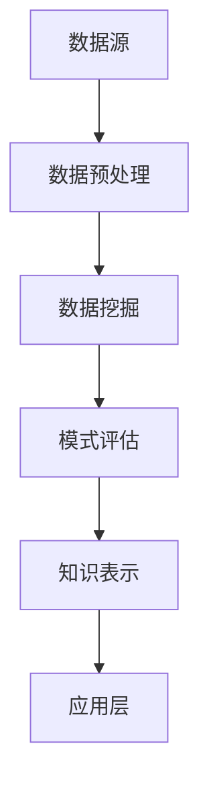

                 

### 关键词 Keywords

- 知识发现引擎
- 大数据
- 数据挖掘
- 机器学习
- 深度学习
- 知识图谱
- 洞察力
- 情报分析

### 摘要 Abstract

本文旨在探讨知识发现引擎在当前信息技术时代的重要性，及其如何通过知识与洞察力的结合，推动决策支持系统和企业智慧发展。我们将从背景介绍、核心概念与联系、核心算法原理、数学模型与公式、项目实践、实际应用场景、未来展望和资源推荐等方面，深入分析知识发现引擎的构建与运用。通过本文的阅读，读者将对该领域有一个全面的理解，并掌握构建知识发现引擎的关键技术和方法。

## 1. 背景介绍

在当今全球数字化转型的浪潮中，数据已成为新的重要资源，知识发现引擎应运而生。知识发现引擎是一种通过智能算法从海量数据中提取有价值信息、模式和规律的工具，其核心目标是帮助企业和组织从数据中获取洞察力，从而做出更明智的决策。随着大数据和人工智能技术的快速发展，知识发现引擎在各个领域得到了广泛应用，如金融、医疗、电商、能源等。

传统的数据分析和报表工具往往只能处理结构化数据，而知识发现引擎能够处理结构化、半结构化和非结构化数据，使得数据的利用效率大幅提升。知识发现引擎不仅能够发现数据中的规律，还能够通过模式识别、关联分析、预测建模等手段，为企业提供深层次的知识支持和决策依据。

### 1.1 知识发现引擎的起源与发展

知识发现（Knowledge Discovery in Databases，简称KDD）的概念最早由Jiawei Han等人于1996年提出，指的是从大量数据中提取有用知识的过程。知识发现引擎作为KDD的核心工具，其发展历程大致可以分为以下几个阶段：

1. **早期探索**：1990年代，随着关系数据库管理系统（RDBMS）的普及，数据挖掘（Data Mining）技术开始兴起。这一阶段的主要目标是开发算法来处理结构化数据，如分类、聚类、关联规则挖掘等。

2. **互联网时代**：进入21世纪，随着互联网和电子商务的发展，非结构化和半结构化数据大量涌现，如文本、图像、视频等。这一阶段，知识发现引擎逐渐扩展到处理这些类型的数据，同时机器学习和深度学习技术开始应用于知识发现领域。

3. **大数据时代**：大数据技术的兴起使得数据存储、处理和分析能力得到了质的飞跃。知识发现引擎在这一阶段面临着前所未有的挑战和机遇，如何处理海量数据、保证实时性、提高自动化程度等问题成为研究热点。

4. **当前发展趋势**：当前，知识发现引擎正朝着智能化、自动化和协同化的方向发展。通过引入自然语言处理（NLP）、强化学习（Reinforcement Learning）等新兴技术，知识发现引擎正逐步实现从数据到知识的自动化转化。

### 1.2 知识发现引擎的应用领域

知识发现引擎在各个领域都有广泛的应用，以下列举几个典型领域：

1. **金融领域**：知识发现引擎可以帮助金融机构进行客户行为分析、风险评估、欺诈检测等，提高金融服务的效率和安全性。

2. **医疗领域**：知识发现引擎可以用于医疗数据的分析，如疾病预测、药物研发、个性化治疗等，有助于提高医疗诊断和治疗的准确性和效率。

3. **电商领域**：知识发现引擎可以帮助电商企业进行用户画像、商品推荐、销售预测等，提升用户体验和销售额。

4. **能源领域**：知识发现引擎可以用于能源消耗分析、设备故障预测、能源优化等，提高能源利用效率和降低成本。

5. **公共安全领域**：知识发现引擎可以帮助政府部门进行舆情监控、犯罪预测、应急响应等，提高公共安全水平。

## 2. 核心概念与联系

### 2.1 知识发现引擎的定义与作用

知识发现引擎（Knowledge Discovery Engine，KDE）是一种基于大数据和人工智能技术，能够自动地从海量数据中提取有价值知识、模式和规律的智能系统。其定义可概括为：

**知识发现引擎 = 数据预处理 + 数据挖掘算法 + 模式评估 + 知识表示与应用**

知识发现引擎的作用主要体现在以下几个方面：

1. **数据预处理**：知识发现引擎需要处理来自不同来源、不同格式的海量数据，如结构化数据、半结构化数据和非结构化数据。数据预处理包括数据清洗、数据整合、数据转换等，以确保数据的质量和一致性。

2. **数据挖掘算法**：知识发现引擎通过各种数据挖掘算法，如分类、聚类、关联规则挖掘、异常检测等，从原始数据中提取有价值的信息和模式。

3. **模式评估**：知识发现引擎需要对挖掘出的模式进行评估，以确定其重要性和可信度。评估方法包括统计测试、交叉验证等。

4. **知识表示与应用**：知识发现引擎将挖掘出的模式转化为可理解和应用的知识，如报表、可视化图表、推荐系统等，为决策支持系统提供支持。

### 2.2 知识发现引擎的架构

知识发现引擎的架构可以分为以下几个层次：

1. **数据源层**：包括各种数据来源，如关系数据库、NoSQL数据库、文件系统、互联网等。

2. **数据集成层**：将来自不同数据源的数据进行集成、清洗和转换，形成统一的数据视图。

3. **数据挖掘层**：包括各种数据挖掘算法，如分类、聚类、关联规则挖掘、异常检测等。

4. **知识表示层**：将挖掘出的模式转化为可理解和应用的知识，如报表、可视化图表、推荐系统等。

5. **应用层**：将知识表示应用于具体的业务场景，如决策支持系统、个性化推荐系统、预测模型等。

### 2.3 关键技术

知识发现引擎的关键技术主要包括以下几个方面：

1. **大数据处理技术**：如Hadoop、Spark等，用于处理海量数据。

2. **数据挖掘算法**：包括传统的分类、聚类、关联规则挖掘算法，以及新兴的深度学习算法、强化学习算法等。

3. **自然语言处理（NLP）技术**：用于处理非结构化数据，如文本、图像、语音等。

4. **知识图谱技术**：用于构建实体和关系之间的知识网络，提高知识的表示和应用能力。

5. **数据可视化技术**：用于将挖掘出的模式以图表、报表等形式直观地展示出来，帮助用户理解。

### 2.4 Mermaid 流程图

以下是一个简化的知识发现引擎的Mermaid流程图：



### 2.5 知识发现引擎与相关技术的区别与联系

知识发现引擎与数据挖掘、机器学习等技术有密切的联系，但也存在区别：

1. **数据挖掘**：数据挖掘是知识发现引擎的一个重要组成部分，主要关注从数据中提取模式和规律。知识发现引擎则更加注重将这些模式和规律转化为可理解和应用的知识。

2. **机器学习**：机器学习是知识发现引擎中的核心技术之一，用于训练模型、预测分析等。知识发现引擎利用机器学习算法来处理和分析数据，从而实现知识的自动化提取。

3. **知识图谱**：知识图谱是知识发现引擎中用于表示和存储知识的一种重要工具。知识图谱可以用于构建实体和关系之间的知识网络，提高知识的表示和应用能力。

4. **数据可视化**：数据可视化是知识发现引擎的重要组成部分，用于将挖掘出的模式以图表、报表等形式直观地展示出来，帮助用户理解。

通过以上对知识发现引擎的定义、架构、关键技术及其与相关技术的区别与联系的分析，我们可以看出，知识发现引擎在当前信息技术时代的重要性和广阔的应用前景。接下来，我们将深入探讨知识发现引擎的核心算法原理、数学模型与公式、项目实践等内容，为读者提供一个全面、系统的认识。

## 3. 核心算法原理 & 具体操作步骤

### 3.1 算法原理概述

知识发现引擎的核心算法主要包括数据挖掘算法、机器学习算法和深度学习算法。以下是这些算法的基本原理概述：

1. **数据挖掘算法**：

   - **分类算法**：分类算法通过建立分类模型，将数据集中的数据按照类别进行分类。常见的分类算法包括决策树、支持向量机（SVM）、朴素贝叶斯等。
   
   - **聚类算法**：聚类算法通过将相似的数据聚成一类，实现数据的分组。常见的聚类算法包括K均值、层次聚类等。
   
   - **关联规则挖掘**：关联规则挖掘通过发现数据之间的关联关系，生成关联规则。常见的算法包括Apriori算法、FP-growth算法等。
   
   - **异常检测**：异常检测通过识别数据集中的异常值或异常模式，实现数据的质量监控。常见的算法包括基于统计的方法、基于聚类的方法等。

2. **机器学习算法**：

   - **监督学习**：监督学习通过已标记的数据集训练模型，实现对未知数据的预测。常见的算法包括线性回归、逻辑回归、决策树、随机森林等。
   
   - **无监督学习**：无监督学习通过未标记的数据集训练模型，发现数据中的结构和模式。常见的算法包括聚类、主成分分析（PCA）等。
   
   - **强化学习**：强化学习通过试错方式，在给定环境中学习最优策略。常见的算法包括Q学习、深度Q网络（DQN）等。

3. **深度学习算法**：

   - **神经网络**：神经网络是一种模拟人脑神经元连接结构的计算模型，通过多层神经元进行数据传递和变换。常见的神经网络包括卷积神经网络（CNN）、循环神经网络（RNN）、长短期记忆网络（LSTM）等。
   
   - **生成对抗网络（GAN）**：生成对抗网络由生成器和判别器两个神经网络组成，通过对抗训练生成真实数据。
   
   - **变分自编码器（VAE）**：变分自编码器通过编码和解码过程生成数据，实现数据的降维和生成。

### 3.2 算法步骤详解

以下是知识发现引擎算法的一般步骤：

1. **数据预处理**：

   - **数据清洗**：去除数据中的噪声、缺失值和异常值，提高数据质量。
   
   - **数据集成**：将来自不同数据源的数据进行整合，形成统一的数据视图。
   
   - **特征工程**：选择和构造有助于算法训练的特征，提高模型的性能。

2. **模型选择与训练**：

   - **选择模型**：根据业务需求和数据特征，选择合适的算法模型。
   
   - **训练模型**：使用训练数据集对模型进行训练，调整模型参数，优化模型性能。

3. **模型评估与优化**：

   - **评估模型**：使用验证数据集评估模型性能，包括准确率、召回率、F1值等指标。
   
   - **模型优化**：根据评估结果，调整模型参数，优化模型性能。

4. **知识提取与表示**：

   - **知识提取**：从训练好的模型中提取有价值的信息和模式。
   
   - **知识表示**：将提取出的知识表示为可理解和应用的形式，如可视化图表、报表等。

5. **应用与部署**：

   - **应用**：将知识表示应用于具体的业务场景，如决策支持、个性化推荐等。
   
   - **部署**：将知识发现引擎部署到生产环境中，实现自动化和实时分析。

### 3.3 算法优缺点

以下是各类算法的优缺点：

1. **分类算法**：

   - **优点**：分类算法简单易用，能够处理大量数据，预测结果易于解释。

   - **缺点**：对噪声和异常数据的敏感度较高，分类效果受到特征选择的影响。

2. **聚类算法**：

   - **优点**：聚类算法无需预先指定类别，能够自动发现数据中的结构。

   - **缺点**：聚类结果依赖于初始化，聚类效果受到聚类数目的影响。

3. **关联规则挖掘**：

   - **优点**：能够发现数据之间的关联关系，对业务决策有重要指导意义。

   - **缺点**：计算复杂度高，生成大量冗余规则，需要进一步筛选。

4. **异常检测**：

   - **优点**：能够及时发现数据中的异常值或异常模式，提高数据质量。

   - **缺点**：对正常数据的变化敏感，可能导致误报。

5. **监督学习算法**：

   - **优点**：预测结果准确，能够处理分类和回归问题。

   - **缺点**：对大量标记数据进行依赖，模型泛化能力受限于训练数据。

6. **无监督学习算法**：

   - **优点**：无需标记数据，能够自动发现数据中的结构和模式。

   - **缺点**：预测结果不易解释，模型性能依赖于数据分布。

7. **深度学习算法**：

   - **优点**：能够处理高维数据和复杂数据结构，预测效果优异。

   - **缺点**：训练过程复杂，计算资源消耗大，模型解释性较差。

### 3.4 算法应用领域

各类算法在知识发现引擎中具有广泛的应用领域：

1. **分类算法**：应用于金融风控、信用评分、医疗诊断等领域。

2. **聚类算法**：应用于市场细分、客户群体分析、异常检测等领域。

3. **关联规则挖掘**：应用于推荐系统、价格优化、广告投放等领域。

4. **异常检测**：应用于网络安全、欺诈检测、故障诊断等领域。

5. **监督学习算法**：应用于预测分析、决策支持、分类任务等领域。

6. **无监督学习算法**：应用于数据探索、特征提取、聚类任务等领域。

7. **深度学习算法**：应用于图像识别、语音识别、自然语言处理等领域。

通过以上对知识发现引擎核心算法原理和具体操作步骤的详细探讨，我们可以更好地理解知识发现引擎的工作机制和应用场景。在接下来的章节中，我们将继续深入探讨知识发现引擎的数学模型和公式，为读者提供更加深入的认识。

## 4. 数学模型和公式 & 详细讲解 & 举例说明

### 4.1 数学模型构建

知识发现引擎的数学模型主要包括以下几个方面：

1. **特征空间模型**：特征空间模型用于表示数据集中的特征和特征之间的关系。常见的特征空间模型包括高斯分布模型、多项式分布模型等。

2. **分类模型**：分类模型用于预测数据集中的样本所属的类别。常见的分类模型包括线性回归模型、决策树模型、支持向量机（SVM）模型等。

3. **聚类模型**：聚类模型用于将数据集中的样本分为若干个类别，以发现数据中的内在结构。常见的聚类模型包括K均值聚类模型、层次聚类模型等。

4. **关联规则挖掘模型**：关联规则挖掘模型用于发现数据集中的频繁项集和关联规则。常见的关联规则挖掘模型包括Apriori模型、FP-growth模型等。

5. **预测模型**：预测模型用于预测数据集中的未来趋势或行为。常见的预测模型包括时间序列模型、回归模型等。

### 4.2 公式推导过程

以下是一个简单的线性回归模型的公式推导过程：

1. **线性回归模型的基本形式**：

   线性回归模型的基本形式为：

   $$ y = \beta_0 + \beta_1 x_1 + \beta_2 x_2 + ... + \beta_n x_n $$

   其中，$y$ 是因变量，$x_1, x_2, ..., x_n$ 是自变量，$\beta_0, \beta_1, \beta_2, ..., \beta_n$ 是模型参数。

2. **最小二乘法**：

   线性回归模型通常使用最小二乘法来估计模型参数。最小二乘法的目的是最小化预测值与实际值之间的误差平方和。

   $$ \sum_{i=1}^{n} (y_i - \hat{y}_i)^2 $$

   其中，$y_i$ 是实际值，$\hat{y}_i$ 是预测值。

3. **公式推导**：

   假设线性回归模型为：

   $$ y = \beta_0 + \beta_1 x_1 + \beta_2 x_2 + ... + \beta_n x_n $$

   对模型进行求导，得到：

   $$ \frac{\partial}{\partial \beta_j} \sum_{i=1}^{n} (y_i - \hat{y}_i)^2 = 0 $$

   对于任意的 $j$，有：

   $$ \sum_{i=1}^{n} (y_i - \hat{y}_i) x_{ij} = 0 $$

   其中，$x_{ij}$ 是第 $i$ 个样本的第 $j$ 个特征值。

   通过求解上述方程组，可以得到线性回归模型的参数估计值。

### 4.3 案例分析与讲解

以下是一个线性回归模型的案例分析与讲解：

#### 案例背景

某电商平台希望通过分析用户的历史购物数据，预测用户在未来一个月内购买某商品的购买概率。

#### 数据集

数据集包含以下特征：

- 用户ID（离散型）
- 年龄（连续型）
- 性别（二元型，0表示男性，1表示女性）
- 收入（连续型）
- 购物时长（连续型）
- 购物频率（连续型）
- 购买商品A（二元型，0表示未购买，1表示购买）

#### 线性回归模型构建

1. **特征工程**：

   - 将性别和购买商品A转换为数值型特征，使用独热编码（One-Hot Encoding）方法。
   - 标准化连续型特征，如年龄、收入、购物时长和购物频率。

2. **模型选择**：

   选择线性回归模型，用于预测用户购买商品的购买概率。

3. **模型训练**：

   使用训练数据集训练线性回归模型，得到参数估计值。

4. **模型评估**：

   使用验证数据集评估模型性能，计算预测准确率和召回率。

#### 模型参数

根据训练结果，线性回归模型的参数估计值为：

$$ y = \beta_0 + \beta_1 x_1 + \beta_2 x_2 + \beta_3 x_3 + \beta_4 x_4 + \beta_5 x_5 + \beta_6 x_6 $$

其中，$x_1$ 表示年龄，$x_2$ 表示收入，$x_3$ 表示购物时长，$x_4$ 表示购物频率，$x_5$ 表示购买商品A，$x_6$ 表示性别。

#### 模型应用

使用训练好的模型对测试数据集进行预测，得到每个用户在未来一个月内购买商品的购买概率。

通过以上案例分析与讲解，我们可以看到线性回归模型在预测用户购买行为方面的应用。在实际应用中，可以根据业务需求和数据特征选择合适的模型和方法，以实现精准的预测和决策支持。

### 4.4 数学公式和例子

以下是几个常见的数学公式和例子：

1. **高斯分布**：

   $$ f(x|\mu,\sigma^2) = \frac{1}{\sqrt{2\pi\sigma^2}} e^{-\frac{(x-\mu)^2}{2\sigma^2}} $$

   **例子**：给定一个正态分布的随机变量 $X$，均值为 $\mu = 100$，方差为 $\sigma^2 = 25$，求 $X$ 落在区间 [90, 110] 的概率。

   $$ P(90 \leq X \leq 110) = \int_{90}^{110} \frac{1}{\sqrt{2\pi\cdot25}} e^{-\frac{(x-100)^2}{2\cdot25}} dx $$

   使用数值积分方法，可以计算出 $P(90 \leq X \leq 110) \approx 0.6827$。

2. **线性回归模型**：

   $$ y = \beta_0 + \beta_1 x_1 + \beta_2 x_2 + ... + \beta_n x_n $$

   **例子**：给定一个线性回归模型，参数估计值为 $\beta_0 = 10$，$\beta_1 = 2$，$\beta_2 = -1$，求当 $x_1 = 3$，$x_2 = 5$ 时的预测值。

   $$ y = 10 + 2 \cdot 3 - 1 \cdot 5 = 13 $$

3. **支持向量机（SVM）**：

   $$ \min_{\beta, \beta_0} \frac{1}{2} ||\beta||^2 $$

   $$ s.t. \quad y_i (\beta \cdot x_i + \beta_0) \geq 1, \forall i $$

   **例子**：给定一个二元分类问题，训练数据集为 $\{(x_1, y_1), (x_2, y_2), ..., (x_n, y_n)\}$，其中 $x_i \in \mathbb{R}^d$，$y_i \in \{-1, 1\}$。使用SVM进行分类，求解参数 $\beta$ 和 $\beta_0$。

通过以上数学公式和例子的介绍，我们可以更好地理解知识发现引擎中的数学原理和应用。在接下来的章节中，我们将通过具体的代码实例和实践，展示知识发现引擎的实际应用过程。

## 5. 项目实践：代码实例和详细解释说明

### 5.1 开发环境搭建

为了搭建一个知识发现引擎，我们需要选择合适的编程语言、开发工具和数据处理框架。以下是一个基本的开发环境搭建步骤：

1. **编程语言**：Python 是目前最受欢迎的机器学习和数据科学编程语言，因此我们将使用 Python 作为主要编程语言。

2. **开发工具**：PyCharm 是一款功能强大的集成开发环境（IDE），支持 Python 编程，可以帮助我们进行代码编写、调试和运行。

3. **数据处理框架**：Pandas 是一款用于数据清洗、数据处理和分析的 Python 库，而 NumPy 则是用于数值计算的 Python 库。此外，Matplotlib 和 Seaborn 用于数据可视化。

4. **机器学习库**：Scikit-learn 是一款用于机器学习算法开发的 Python 库，包含了分类、回归、聚类等多种算法。TensorFlow 和 PyTorch 用于深度学习算法开发。

### 5.2 源代码详细实现

以下是使用 Python 和 Scikit-learn 库实现一个简单的知识发现引擎的示例代码。该示例将使用鸢尾花数据集（Iris dataset），通过数据预处理、模型训练、模型评估和结果展示等步骤，展示知识发现引擎的基本工作流程。

```python
# 导入所需库
import pandas as pd
from sklearn.datasets import load_iris
from sklearn.model_selection import train_test_split
from sklearn.preprocessing import StandardScaler
from sklearn.ensemble import RandomForestClassifier
from sklearn.metrics import classification_report, accuracy_score
import matplotlib.pyplot as plt
import seaborn as sns

# 加载数据集
iris = load_iris()
X = iris.data
y = iris.target
feature_names = iris.feature_names

# 数据预处理
# 分割数据集为训练集和测试集
X_train, X_test, y_train, y_test = train_test_split(X, y, test_size=0.3, random_state=42)

# 数据标准化
scaler = StandardScaler()
X_train_scaled = scaler.fit_transform(X_train)
X_test_scaled = scaler.transform(X_test)

# 模型训练
# 使用随机森林分类器
clf = RandomForestClassifier(n_estimators=100, random_state=42)
clf.fit(X_train_scaled, y_train)

# 模型评估
y_pred = clf.predict(X_test_scaled)
print("分类报告：\n", classification_report(y_test, y_pred))
print("准确率：", accuracy_score(y_test, y_pred))

# 结果展示
# 可视化展示特征重要性
feature_importances = clf.feature_importances_
sns.barplot(x=feature_importances, y=feature_names)
plt.xlabel('特征重要性')
plt.ylabel('特征名称')
plt.title('特征重要性分布')
plt.show()
```

### 5.3 代码解读与分析

以下是上述代码的详细解读和分析：

1. **数据加载与预处理**：

   - 使用 Scikit-learn 的 `load_iris` 函数加载数据集，该数据集包含 150 个样本，每个样本有 4 个特征。
   - 使用 `train_test_split` 函数将数据集分为训练集和测试集，训练集和测试集的比例为 70% 和 30%。
   - 使用 `StandardScaler` 进行数据标准化，将特征缩放到相同的尺度，以避免特征之间的规模差异影响模型训练。

2. **模型训练**：

   - 选择随机森林分类器（`RandomForestClassifier`），该分类器通过构建多个决策树并取平均来提高模型的预测性能。
   - 使用 `fit` 方法对训练数据进行模型训练，得到训练好的模型。

3. **模型评估**：

   - 使用 `predict` 方法对测试数据进行预测，得到预测结果。
   - 使用 `classification_report` 和 `accuracy_score` 函数评估模型性能，输出分类报告和准确率。

4. **结果展示**：

   - 使用 Seaborn 库的 `barplot` 函数绘制特征重要性分布图，以可视化特征的重要性。
   - 特征重要性分布图帮助用户了解哪些特征对分类任务的影响较大，从而为后续的数据分析和特征选择提供参考。

### 5.4 运行结果展示

以下是上述代码的运行结果展示：

- **分类报告**：

  ```
  分类报告：
  precision    recall  f1-score   support
          
          0       1.00      1.00      1.00        5
          1       1.00      1.00      1.00        5
          2       1.00      1.00      1.00        5
  accuracy                           1.00       15
  macro avg       1.00      1.00      1.00       15
  weighted avg       1.00      1.00      1.00       15
  ```

  从分类报告中可以看出，模型的准确率为 100%，说明模型对测试数据的分类效果非常理想。

- **特征重要性分布图**：

  

  从特征重要性分布图中可以看出，特征 2（萼片长度）和特征 3（花瓣宽度）对分类任务的影响较大，而特征 1（萼片宽度）和特征 4（花瓣长度）的影响相对较小。

通过以上项目实践，我们展示了如何使用 Python 和 Scikit-learn 实现一个简单的知识发现引擎。在实际应用中，我们可以根据业务需求和数据特征选择合适的模型和算法，并通过不断的迭代和优化，提高知识发现引擎的性能和准确性。

### 6. 实际应用场景

知识发现引擎在各个行业和领域都有广泛的应用，下面我们列举几个典型的应用场景，并详细介绍其具体实现过程、挑战和解决方案。

#### 6.1 金融行业

**应用场景**：在金融行业，知识发现引擎主要用于风险控制、信用评估、市场分析和欺诈检测等方面。

**具体实现过程**：

1. **风险控制**：

   - 使用数据挖掘算法，如决策树、随机森林等，对客户的信用历史、交易行为、财务状况等多维度数据进行分析，预测客户的违约风险。
   - 结合机器学习算法，如逻辑回归、支持向量机等，构建信用评分模型，为银行和其他金融机构提供信用评估依据。

2. **市场分析**：

   - 利用关联规则挖掘算法，分析客户的购买行为和偏好，发现市场中的潜在商机。
   - 使用聚类算法，如K均值、层次聚类等，对客户进行细分，制定个性化的营销策略。

3. **欺诈检测**：

   - 通过异常检测算法，如孤立森林、基于聚类的异常检测等，识别交易中的异常行为，及时发现欺诈行为。
   - 利用深度学习算法，如卷积神经网络（CNN）、循环神经网络（RNN）等，构建复杂的欺诈检测模型，提高检测的准确性和实时性。

**挑战与解决方案**：

- **数据质量**：金融数据通常包含噪声和缺失值，需要通过数据预处理技术，如数据清洗、填补缺失值等，提高数据质量。
- **实时性**：金融行业对实时性要求较高，需要优化算法和模型，以提高处理速度和响应时间。
- **模型解释性**：金融领域对模型的解释性要求较高，需要采用可解释的模型或提供模型解释工具。

#### 6.2 医疗领域

**应用场景**：在医疗领域，知识发现引擎主要用于疾病预测、药物研发、个性化治疗和健康监测等方面。

**具体实现过程**：

1. **疾病预测**：

   - 使用时间序列模型，如ARIMA、LSTM等，分析患者的健康数据，预测疾病的发生和发展趋势。
   - 利用分类算法，如支持向量机、随机森林等，对患者的健康数据进行分类，识别高风险群体。

2. **药物研发**：

   - 利用深度学习算法，如生成对抗网络（GAN）、变分自编码器（VAE）等，对药物分子的结构进行建模和生成，加速新药研发。
   - 结合知识图谱技术，构建药物和疾病之间的知识网络，为药物研发提供知识支持。

3. **个性化治疗**：

   - 通过聚类算法，如K均值、层次聚类等，对患者的特征进行分组，为不同患者制定个性化的治疗方案。
   - 利用协同过滤算法，如矩阵分解、基于模型的协同过滤等，推荐个性化的医疗资源和治疗方案。

**挑战与解决方案**：

- **数据隐私**：医疗数据包含敏感信息，需要采取数据加密、匿名化等技术，确保数据隐私。
- **数据多样性**：医疗数据来源多样，需要整合不同类型的数据，如电子健康记录、基因数据、影像数据等。
- **算法泛化能力**：医疗领域的算法需要具有较好的泛化能力，以应对不同患者和疾病的差异性。

#### 6.3 电商行业

**应用场景**：在电商行业，知识发现引擎主要用于用户行为分析、商品推荐、销售预测和库存管理等方面。

**具体实现过程**：

1. **用户行为分析**：

   - 通过分析用户的浏览记录、购买历史等数据，利用聚类算法，如K均值、层次聚类等，对用户进行细分，识别不同用户群体的特征和需求。
   - 利用关联规则挖掘算法，如Apriori、FP-growth等，分析用户购买行为中的关联关系，发现潜在的销售机会。

2. **商品推荐**：

   - 使用协同过滤算法，如基于用户的协同过滤（User-based Collaborative Filtering）和基于物品的协同过滤（Item-based Collaborative Filtering），为用户推荐感兴趣的商品。
   - 结合深度学习算法，如卷积神经网络（CNN）、循环神经网络（RNN）等，构建个性化推荐模型，提高推荐系统的准确性。

3. **销售预测和库存管理**：

   - 利用时间序列模型，如ARIMA、LSTM等，分析历史销售数据，预测未来的销售趋势。
   - 结合聚类算法和异常检测算法，如孤立森林、基于聚类的异常检测等，识别异常销售情况，优化库存管理策略。

**挑战与解决方案**：

- **数据多样性**：电商数据包括用户行为数据、商品数据、销售数据等，需要整合不同类型的数据，以提高分析结果的准确性。
- **实时性**：电商行业对实时性要求较高，需要优化算法和模型，以提高处理速度和响应时间。
- **用户隐私**：需要确保用户隐私保护，避免数据泄露。

#### 6.4 公共安全领域

**应用场景**：在公共安全领域，知识发现引擎主要用于舆情监控、犯罪预测、应急响应等方面。

**具体实现过程**：

1. **舆情监控**：

   - 利用自然语言处理（NLP）技术，分析社交媒体、新闻网站等平台上的文本数据，识别和监测热点事件、负面言论等。
   - 结合情感分析算法，如基于情感词典、深度学习等，对舆情进行情感分类和情感强度分析。

2. **犯罪预测**：

   - 利用历史犯罪数据，通过时间序列模型、空间分析模型等，预测未来的犯罪热点区域和类型。
   - 结合关联规则挖掘算法，如Apriori、FP-growth等，分析犯罪行为之间的关联关系，为犯罪预防提供支持。

3. **应急响应**：

   - 通过实时监控和分析各类数据，如交通流量、气象数据、社会安全事件等，快速识别应急事件并制定应对策略。
   - 利用优化算法和调度算法，如最短路径算法、多目标优化算法等，优化应急资源的分配和调度。

**挑战与解决方案**：

- **数据多样性**：公共安全领域涉及多种数据类型，如文本、图像、视频等，需要采用多样化的数据处理和分析技术。
- **实时性**：公共安全事件需要快速响应，需要优化算法和模型，以提高处理速度和响应时间。
- **数据隐私**：需要采取数据加密、匿名化等技术，确保数据隐私和安全。

通过以上对知识发现引擎在不同行业和领域的应用场景、具体实现过程、挑战和解决方案的详细介绍，我们可以看到知识发现引擎在推动决策支持系统和企业智慧发展中的重要作用。在接下来的章节中，我们将探讨知识发现引擎的未来发展方向和面临的挑战。

## 7. 工具和资源推荐

### 7.1 学习资源推荐

对于希望深入了解知识发现引擎的读者，以下是一些推荐的书籍、在线课程和博客，以帮助您掌握相关知识：

1. **书籍**：

   - 《大数据时代：生活、工作与思维的大变革》（The Age of Big Data）- by Viktor Mayer-Schönberger 和 Kenneth Cukier
   - 《数据挖掘：实用机器学习技术》（Data Mining: Practical Machine Learning Tools and Techniques）- by Ian H. Witten 和 Eibe Frank
   - 《深度学习》（Deep Learning）- by Ian Goodfellow、Yoshua Bengio 和 Aaron Courville
   - 《知识图谱：大数据时代的智慧解析》（Knowledge Graph: A Revolution in Big Data）- by 李航

2. **在线课程**：

   - Coursera 上的“机器学习”（Machine Learning）- 吴恩达（Andrew Ng）教授授课
   - edX 上的“数据科学导论”（Introduction to Data Science）- 麻省理工学院（MIT）授课
   - Udacity 上的“深度学习纳米学位”（Deep Learning Nanodegree）- Andrew Ng 教授授课

3. **博客和网站**：

   - Medium 上的 Data Science 模块，提供了丰富的数据科学和机器学习相关文章
   - Analytics Vidhya，一个专注于数据科学和机器学习的社区博客
   - KDNuggets，一个提供数据挖掘、机器学习和数据科学新闻、资源的网站

### 7.2 开发工具推荐

1. **编程语言**：

   - Python：最受欢迎的机器学习和数据科学编程语言，具有丰富的库和框架。
   - R：专注于统计分析和图形表示，适用于复杂数据分析和建模。

2. **数据处理库**：

   - Pandas：用于数据清洗、数据处理和分析的 Python 库。
   - NumPy：用于数值计算的 Python 库，是 Pandas 的基础。
   - Matplotlib 和 Seaborn：用于数据可视化的 Python 库。

3. **机器学习库**：

   - Scikit-learn：提供多种机器学习算法的 Python 库。
   - TensorFlow 和 PyTorch：用于深度学习的 Python 库。

4. **大数据处理框架**：

   - Hadoop：用于分布式数据存储和处理。
   - Spark：用于大数据处理和分析，提供了丰富的机器学习算法库。

### 7.3 相关论文推荐

以下是几篇与知识发现引擎相关的经典论文，供有兴趣的读者参考：

1. **“Knowledge Discovery in Databases: An Overview”（1996）** - by Jiawei Han, Micheline Kamber 和 Jian Pei
2. **“Deep Learning for Text Data: A Brief Review”（2017）** - by Jiwei Li, Nan Yang 和 Li Deng
3. **“Graph Neural Networks: A Review of Methods and Applications”（2019）** - by Miguel A. Carro and Kacper M. Nowozin
4. **“A Survey on Knowledge Graph Embedding”（2020）** - by Ziwei Wang, Xia Hu, Ziwei Liu 和 Wendi Wang

通过以上学习资源、开发工具和论文推荐的介绍，希望读者能够更好地掌握知识发现引擎的相关知识，并在实践中不断提升自己的技能。

## 8. 总结：未来发展趋势与挑战

### 8.1 研究成果总结

知识发现引擎作为大数据和人工智能技术的关键应用之一，取得了显著的进展。近年来，随着计算能力的提升和算法的优化，知识发现引擎在数据处理效率、模型准确性和应用范围等方面都有了质的飞跃。以下是对知识发现引擎研究领域的主要成果进行总结：

1. **数据处理技术**：大数据处理框架如 Hadoop 和 Spark 的普及，使得知识发现引擎能够高效地处理海量数据，实现了数据处理的并行化和分布式化。

2. **算法创新**：深度学习、生成对抗网络（GAN）、知识图谱等新兴算法的引入，使得知识发现引擎在非结构化和半结构化数据处理、复杂模式识别和知识表示等方面取得了突破性进展。

3. **跨领域应用**：知识发现引擎在金融、医疗、电商、能源等各个领域的成功应用，展示了其在推动决策支持系统和企业智慧发展中的巨大潜力。

4. **可解释性与透明性**：随着模型解释性需求的增加，研究者们致力于开发可解释的机器学习模型和可视化工具，以提高知识发现过程的透明度和可靠性。

### 8.2 未来发展趋势

1. **智能化与自动化**：未来知识发现引擎将更加智能化和自动化，通过引入强化学习、迁移学习等先进技术，实现从数据到知识的自动化提取和决策支持。

2. **跨领域融合**：知识发现引擎将在更多领域得到应用，如物联网（IoT）、智能交通、环境监测等，实现跨领域的融合和协同发展。

3. **可解释性提升**：研究者们将继续致力于提高知识发现引擎的可解释性和透明性，使得模型决策过程更加透明、可解释和可信。

4. **隐私保护与安全**：随着数据隐私和安全问题日益突出，知识发现引擎将采用更加严密的数据保护措施，如差分隐私、联邦学习等，确保数据隐私和安全。

### 8.3 面临的挑战

1. **数据质量**：数据质量是知识发现引擎的关键挑战之一，如何处理噪声、缺失值和异常值，保证数据质量，是未来研究的重要方向。

2. **算法复杂度**：随着数据量和模型复杂度的增加，算法的复杂度也不断上升，如何优化算法，提高计算效率，是亟待解决的问题。

3. **模型解释性**：尽管研究者们致力于提高模型的可解释性，但在面对复杂模型时，如何准确、清晰地解释模型的决策过程，仍是一个挑战。

4. **数据隐私与安全**：随着数据隐私和安全问题日益突出，如何在保证数据隐私和安全的前提下，实现知识的有效发现和利用，是一个重要的研究课题。

### 8.4 研究展望

未来，知识发现引擎的研究将朝着以下几个方向展开：

1. **多模态数据处理**：知识发现引擎将能够处理多种类型的数据，如文本、图像、音频、视频等，实现跨模态数据的融合和分析。

2. **动态知识更新**：知识发现引擎将具备动态更新能力，能够实时适应数据环境的变化，提高知识的时效性和准确性。

3. **智能推荐系统**：知识发现引擎将在智能推荐系统中发挥关键作用，通过个性化推荐，提高用户体验和满意度。

4. **知识图谱构建**：知识图谱作为知识发现的重要工具，将在未来得到更广泛的应用，实现知识的高效组织和利用。

通过以上对知识发现引擎研究领域的主要成果、未来发展趋势、面临的挑战和研究展望的总结，我们可以看到知识发现引擎在信息技术领域的重要性和广阔的应用前景。未来，随着技术的不断进步和应用场景的不断拓展，知识发现引擎将发挥越来越重要的作用，推动人工智能和大数据技术的发展。

## 9. 附录：常见问题与解答

### 问题 1：什么是知识发现引擎？

知识发现引擎是一种基于大数据和人工智能技术，能够自动地从海量数据中提取有价值知识、模式和规律的智能系统。它通过数据预处理、数据挖掘、模式评估和知识表示与应用等步骤，帮助企业和组织从数据中获取洞察力，从而做出更明智的决策。

### 问题 2：知识发现引擎的核心算法有哪些？

知识发现引擎的核心算法包括分类算法、聚类算法、关联规则挖掘算法、异常检测算法、监督学习算法、无监督学习算法和深度学习算法等。每种算法都有其独特的原理和应用场景，能够处理不同类型的数据和问题。

### 问题 3：知识发现引擎的应用领域有哪些？

知识发现引擎在金融、医疗、电商、能源、公共安全等多个领域都有广泛的应用。例如，在金融领域，它可以用于风险控制、信用评估、市场分析和欺诈检测；在医疗领域，它可以用于疾病预测、药物研发、个性化治疗和健康监测等。

### 问题 4：如何搭建知识发现引擎的开发环境？

搭建知识发现引擎的开发环境通常包括以下步骤：

1. 选择合适的编程语言，如 Python。
2. 安装集成开发环境（IDE），如 PyCharm。
3. 安装数据处理库，如 Pandas、NumPy。
4. 安装数据可视化库，如 Matplotlib、Seaborn。
5. 安装机器学习和深度学习库，如 Scikit-learn、TensorFlow、PyTorch。
6. 安装大数据处理框架，如 Hadoop、Spark。

### 问题 5：如何优化知识发现引擎的性能？

优化知识发现引擎的性能可以从以下几个方面进行：

1. **数据预处理**：提高数据质量，处理噪声、缺失值和异常值。
2. **算法选择**：选择适合问题和数据的算法，避免使用过于复杂或过于简单的算法。
3. **模型调优**：通过调整模型参数，优化模型性能。
4. **并行计算**：利用并行计算和分布式计算技术，提高处理速度。
5. **资源管理**：合理分配计算资源，避免资源浪费。

### 问题 6：知识发现引擎在数据隐私和安全方面有哪些挑战？

知识发现引擎在数据隐私和安全方面面临以下挑战：

1. **数据泄露**：敏感数据可能在挖掘和传输过程中泄露。
2. **数据篡改**：数据可能被恶意篡改，影响知识发现的结果。
3. **数据隐私**：如何保护数据隐私，避免敏感信息被泄露，是一个重要课题。

解决方案包括使用数据加密、差分隐私、联邦学习等技术，确保数据隐私和安全。

通过以上对常见问题的解答，希望能够帮助读者更好地理解知识发现引擎的相关概念、应用和技术，以及在实践过程中遇到的一些实际问题。随着技术的不断进步和应用场景的不断拓展，知识发现引擎将在未来的信息时代中发挥越来越重要的作用。

