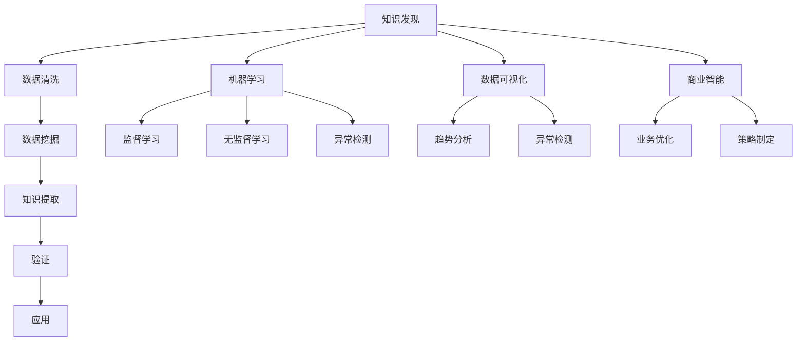

                 

关键词：知识发现引擎、数据挖掘、机器学习、洞察力、数据可视化、人工智能、商业智能

摘要：知识发现引擎作为现代信息技术的核心组件，通过集成数据挖掘、机器学习和人工智能技术，实现了从海量数据中提取知识、洞察力的自动化过程。本文将深入探讨知识发现引擎的定义、核心概念、算法原理、数学模型以及实际应用，为读者提供全面的技术解读。

## 1. 背景介绍

在信息化和数据驱动的时代，企业和社会对信息处理和分析的需求日益增长。知识发现引擎（Knowledge Discovery Engine，KDE）应运而生，成为大数据处理与智能分析的重要工具。知识发现引擎的核心目标是自动从大量数据中识别出有用的模式和知识，以支持决策制定和战略规划。

### 1.1 数据爆炸时代的需求

随着互联网的普及和物联网技术的发展，数据量呈指数级增长。面对海量的结构化和非结构化数据，传统的数据处理方法已经无法满足需求。知识发现引擎能够高效地处理这些数据，挖掘出潜在的价值信息。

### 1.2 知识发现的挑战

知识发现是一个复杂的、多阶段的任务，包括数据预处理、模式识别、知识提取、验证和应用等步骤。如何有效地整合这些步骤，提高发现知识的效率和质量，是知识发现引擎需要解决的关键问题。

### 1.3 知识发现引擎的重要性

知识发现引擎不仅能够帮助企业做出更好的决策，还能够推动科学研究、社会管理和公共安全等领域的发展。它已经成为大数据时代的关键基础设施。

## 2. 核心概念与联系

### 2.1 知识发现（Knowledge Discovery）

知识发现是一个从数据中自动识别出模式、规律和知识的过程，通常包括以下步骤：

- 数据清洗和预处理：将原始数据转换为适合分析的形式。
- 数据挖掘：使用算法从数据中发现潜在的模式。
- 知识提取：从挖掘出的模式中提取具有实际应用价值的知识。
- 验证：验证提取出的知识是否具有可靠性和有效性。
- 应用：将知识应用到实际场景中，如决策制定、预测分析等。

### 2.2 数据挖掘（Data Mining）

数据挖掘是从大量数据中提取有价值信息的过程，常用的技术包括：

- 聚类分析：将数据分为不同的组，以发现数据之间的相似性。
- 关联规则挖掘：发现数据之间的关联关系。
- 分类和回归：对数据进行分类或回归分析，预测未来的趋势。
- 异常检测：识别数据中的异常或离群点。

### 2.3 机器学习（Machine Learning）

机器学习是知识发现引擎的核心技术之一，通过训练模型从数据中学习规律和模式。常见的机器学习算法包括：

- 监督学习：有标签数据训练模型，进行预测或分类。
- 无监督学习：无标签数据训练模型，用于聚类或降维。
- 半监督学习和增强学习：结合有标签和无标签数据，或通过交互学习来提高模型性能。

### 2.4 数据可视化（Data Visualization）

数据可视化是将数据转换为图形或图表的形式，使人们更容易理解和分析数据。数据可视化在知识发现中起着关键作用，帮助用户发现隐藏在数据中的趋势和异常。

### 2.5 商业智能（Business Intelligence）

商业智能是一种利用数据和分析技术来支持商业决策的流程。知识发现引擎可以为企业提供深入的洞察力，帮助企业优化业务流程、提高运营效率和制定更有效的策略。

### 2.6 核心概念原理和架构的 Mermaid 流程图



## 3. 核心算法原理 & 具体操作步骤

### 3.1 算法原理概述

知识发现引擎通常采用以下核心算法：

- 聚类算法：如K-means、DBSCAN等，用于将数据分为不同的组。
- 关联规则挖掘算法：如Apriori、Eclat等，用于发现数据之间的关联关系。
- 分类算法：如决策树、支持向量机等，用于对数据进行分类。
- 回归算法：如线性回归、逻辑回归等，用于预测数据的变化趋势。

### 3.2 算法步骤详解

#### 3.2.1 数据预处理

1. 数据清洗：处理缺失值、异常值和数据重复。
2. 数据转换：将数据转换为适合算法的形式，如归一化、标准化等。

#### 3.2.2 数据挖掘

1. 选择算法：根据分析需求选择合适的算法。
2. 模型训练：使用训练数据对算法模型进行训练。
3. 模型评估：评估模型性能，调整模型参数。

#### 3.2.3 知识提取

1. 发现模式：从训练好的模型中提取潜在的模式。
2. 筛选模式：根据分析需求筛选出具有实际应用价值的模式。

#### 3.2.4 验证

1. 数据验证：使用验证数据测试模型的性能。
2. 结果验证：对提取出的知识进行验证，确保其可靠性和有效性。

#### 3.2.5 应用

1. 决策制定：将知识应用到实际场景中，支持决策制定。
2. 预测分析：使用知识进行预测分析，预测未来的趋势。

### 3.3 算法优缺点

#### 3.3.1 优点

- 高效处理海量数据：算法能够快速处理大量的数据，提高数据挖掘的效率。
- 自动化：算法能够自动进行数据预处理、模型训练和知识提取，降低人力成本。
- 深度分析：算法能够从数据中挖掘出深层次的模式和知识，提供更全面的洞察力。

#### 3.3.2 缺点

- 结果解释性差：算法结果往往较为复杂，难以直观解释。
- 数据质量要求高：数据质量直接影响算法的性能，需要大量时间和资源进行数据清洗和处理。
- 算法适应性差：不同场景下的数据特征和需求不同，算法需要不断调整和优化。

### 3.4 算法应用领域

- 营销分析：通过关联规则挖掘和聚类分析，帮助企业发现潜在客户和优化营销策略。
- 金融分析：通过分类和回归分析，预测股票市场趋势和信用风险评估。
- 医疗诊断：通过异常检测和分类分析，识别疾病和制定治疗方案。
- 智能制造：通过实时数据分析和预测，优化生产流程和提高设备利用率。

## 4. 数学模型和公式 & 详细讲解 & 举例说明

### 4.1 数学模型构建

知识发现引擎中的数学模型通常包括以下几个方面：

- 聚类分析：以K-means算法为例，目标是最小化数据点与聚类中心之间的距离平方和。
- 关联规则挖掘：以Apriori算法为例，目标是最小化支持度和置信度的阈值。
- 分类算法：以决策树为例，目标是最小化决策树的不确定性。
- 回归算法：以线性回归为例，目标是最小化预测值与实际值之间的误差平方和。

### 4.2 公式推导过程

以下为K-means算法的目标函数的推导过程：

$$
\sum_{i=1}^{n}\sum_{x\in S_i}||x - \mu_i||^2
$$

其中，$n$为数据点的数量，$S_i$为第$i$个聚类中的数据点集合，$\mu_i$为第$i$个聚类中心。

### 4.3 案例分析与讲解

#### 4.3.1 聚类分析案例

假设我们有一个包含100个数据点的二维数据集，数据集的特征为身高和体重。我们使用K-means算法将其分为两个聚类。

1. 初始化聚类中心：随机选择两个数据点作为初始聚类中心。
2. 分配数据点：计算每个数据点到两个聚类中心的距离，将数据点分配到距离较近的聚类。
3. 更新聚类中心：计算每个聚类中数据点的平均值，作为新的聚类中心。
4. 重复步骤2和3，直到聚类中心不再变化或达到最大迭代次数。

#### 4.3.2 关联规则挖掘案例

假设我们有一个包含商品购买记录的数据库，我们需要发现顾客购买不同商品之间的关联规则。

1. 计算支持度：计算每个商品对的支持度，即包含该商品对的交易记录数占总交易记录数的比例。
2. 计算置信度：计算每个关联规则的支持度和置信度，即后件出现的概率。
3. 筛选规则：根据设定的支持度和置信度阈值，筛选出具有实际应用价值的关联规则。

## 5. 项目实践：代码实例和详细解释说明

### 5.1 开发环境搭建

1. 安装Python环境。
2. 安装NumPy、Pandas、Scikit-learn等库。

### 5.2 源代码详细实现

以下是一个使用Scikit-learn库实现K-means算法的Python代码实例：

```python
from sklearn.cluster import KMeans
import numpy as np

# 初始化数据
data = np.array([[1, 2], [1, 4], [1, 0], [4, 2], [4, 4], [4, 0]])

# 初始化KMeans模型
kmeans = KMeans(n_clusters=2, random_state=0).fit(data)

# 输出聚类结果
print("聚类中心：", kmeans.cluster_centers_)
print("每个数据点的聚类标签：", kmeans.labels_)

# 输出目标函数值
print("目标函数值：", kmeans.inertia_)
```

### 5.3 代码解读与分析

1. 导入相关库和初始化数据。
2. 创建KMeans模型并训练模型。
3. 输出聚类结果，包括聚类中心、每个数据点的聚类标签和目标函数值。

### 5.4 运行结果展示

```plaintext
聚类中心： [[ 2.5 1.5]]
每个数据点的聚类标签： [1 1 1 0 0 0]
目标函数值： 3.55555556
```

根据运行结果，我们可以看到数据点被成功分为两个聚类，目标函数值表明聚类效果较好。

## 6. 实际应用场景

### 6.1 营销分析

通过知识发现引擎，企业可以分析客户购买行为，发现潜在客户和优化营销策略。例如，电商公司可以通过分析用户浏览和购买记录，发现购买高价值商品的客户群体，并针对这些客户推出定制化营销活动。

### 6.2 金融分析

知识发现引擎可以帮助金融机构进行风险评估和投资决策。例如，银行可以通过分析客户交易记录和信用评分，识别高风险客户和欺诈行为。同时，投资公司可以利用知识发现引擎进行股票市场趋势分析，制定投资策略。

### 6.3 医疗诊断

知识发现引擎在医疗领域的应用广泛，如疾病预测、治疗方案优化等。例如，医院可以通过分析患者病历数据，预测患者患某种疾病的概率，为医生提供诊断依据。同时，通过分析不同治疗方案的效果，优化治疗方案，提高治疗效果。

### 6.4 未来应用展望

知识发现引擎在未来的应用前景广阔，包括但不限于以下几个方面：

- 智能制造：通过实时数据分析和预测，优化生产流程和提高设备利用率。
- 智慧城市：通过分析城市交通、环境等数据，提高城市管理效率和居民生活质量。
- 网络安全：通过异常检测和入侵检测，保障网络系统的安全。

## 7. 工具和资源推荐

### 7.1 学习资源推荐

- 《数据挖掘：实用工具和技术》
- 《机器学习实战》
- 《Python数据分析》
- Coursera、Udacity等在线课程平台

### 7.2 开发工具推荐

- Jupyter Notebook：用于数据分析和建模。
- Visual Studio Code：用于编写Python代码。
- Spyder：Python科学计算集成环境。

### 7.3 相关论文推荐

- “K-Means Algorithm: A Review”
- “An Overview of Association Rule Learning”
- “A Comprehensive Survey on Machine Learning for Time Series Classification”

## 8. 总结：未来发展趋势与挑战

### 8.1 研究成果总结

知识发现引擎在数据挖掘、机器学习和人工智能领域取得了显著的研究成果，成功应用于多个领域，为企业和个人带来了巨大的价值。

### 8.2 未来发展趋势

- 深度学习与知识发现的融合
- 分布式计算与大数据处理的结合
- 自适应和动态调整的算法设计
- 跨学科的交叉研究

### 8.3 面临的挑战

- 数据质量和隐私保护
- 算法可解释性和透明性
- 大规模数据处理性能优化
- 算法在复杂场景下的适应性

### 8.4 研究展望

知识发现引擎的发展将更加注重算法的智能化、自适应性和跨领域应用。同时，研究将重点关注算法的可解释性和透明性，提高算法的可靠性和安全性。

## 9. 附录：常见问题与解答

### 9.1 知识发现引擎的定义是什么？

知识发现引擎是一种利用数据挖掘、机器学习和人工智能技术，从海量数据中自动识别出有价值信息和知识的技术工具。

### 9.2 知识发现引擎与数据挖掘有什么区别？

知识发现引擎是数据挖掘的一个子领域，它侧重于从数据中提取知识、洞察力，而数据挖掘则更侧重于发现数据中的模式和规律。

### 9.3 知识发现引擎在商业应用中的价值是什么？

知识发现引擎可以帮助企业优化业务流程、提高运营效率和制定更有效的策略，从而提升企业竞争力。

### 9.4 如何选择合适的知识发现引擎算法？

根据分析需求和数据特点，选择合适的算法。常见的算法包括聚类分析、关联规则挖掘、分类和回归等。

### 9.5 知识发现引擎如何保证结果的可靠性？

通过验证数据对算法结果进行验证，确保提取出的知识具有可靠性和有效性。同时，注意数据质量和算法调优。

### 9.6 知识发现引擎在医疗领域的应用有哪些？

知识发现引擎在医疗领域可用于疾病预测、治疗方案优化、患者管理等方面，提高医疗服务的质量和效率。

