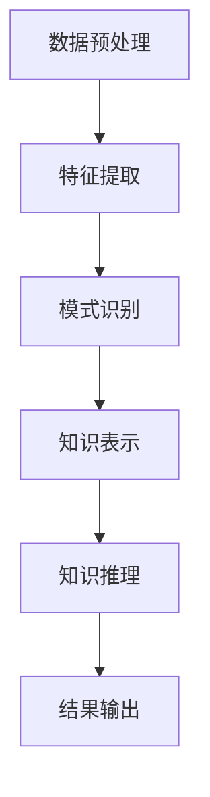

                 

### 关键词 Keywords

- 知识发现
- 数据挖掘
- 机器学习
- 人工智能
- 洞察力
- 知识图谱
- 信息检索
- 大数据分析

### 摘要 Abstract

本文探讨了知识发现引擎的概念及其在现代信息时代的重要性。知识发现引擎是一种高级的智能系统，能够从大量数据中提取有价值的信息和知识。文章首先介绍了知识发现引擎的基本概念和核心原理，包括数据预处理、特征提取、模式识别和知识表示等关键步骤。接着，本文详细阐述了知识发现引擎在不同领域的应用，如商业智能、医疗健康、金融分析和网络安全等。随后，文章讨论了知识发现引擎所依赖的数学模型和算法，以及如何通过实例代码来展示其实际应用。最后，文章展望了知识发现引擎的未来发展趋势，探讨了面临的挑战和潜在的解决方案。通过本文的探讨，读者将深入了解知识发现引擎的工作原理、应用场景和发展前景。

## 1. 背景介绍

随着信息技术的飞速发展，人类社会正经历着前所未有的数据爆炸。从互联网到物联网，从社交网络到电子商务，数据已经渗透到我们生活的方方面面。然而，海量数据的背后隐藏着大量的信息和知识，如何有效地从这些数据中提取有价值的信息成为了当务之急。传统的数据分析和处理方法，如统计分析、数据库查询和简单的规则匹配等，已经无法满足日益复杂的数据需求。这就需要一种更为智能、高效的解决方案，知识发现引擎（Knowledge Discovery Engine）正是为了解决这一问题而诞生的。

### 1.1 知识发现引擎的定义

知识发现引擎是一种高级的智能系统，它利用机器学习、数据挖掘和自然语言处理等先进技术，从大规模数据集中自动提取有价值的信息和知识。知识发现引擎的核心目标是发现数据中的潜在模式、关联和趋势，从而为决策者提供洞察力和支持。知识发现引擎不仅能够处理结构化数据，如关系数据库中的数据，还能够处理非结构化数据，如图像、音频和文本等。

### 1.2 知识发现引擎的重要性

知识发现引擎在现代社会中的重要性不容忽视。首先，随着数据量的不断增加，传统的数据处理方法已经无法胜任。知识发现引擎通过自动化的方式，能够高效地从海量数据中提取有价值的信息，大大提高了数据处理的效率。其次，知识发现引擎能够帮助企业和组织做出更加明智的决策。通过对数据的深入分析和理解，知识发现引擎可以为决策者提供精准的洞察力和预测能力，从而提高企业的竞争力。最后，知识发现引擎在医疗、金融、安全等多个领域都有着广泛的应用，能够为这些领域带来巨大的社会和经济效益。

### 1.3 知识发现引擎的发展历程

知识发现引擎的发展历程可以追溯到20世纪80年代。当时，随着数据库技术和人工智能技术的发展，研究人员开始探索如何从海量数据中提取有价值的信息。最早的尝试主要是基于统计分析的方法，如回归分析、聚类分析和关联规则挖掘等。随着计算机性能的不断提升和算法的优化，知识发现技术逐渐成熟，并开始应用于各个领域。21世纪初，随着互联网和物联网的兴起，数据量呈爆炸式增长，知识发现技术也得到了迅速发展。如今，知识发现引擎已经成为人工智能领域的一个重要分支，其在各个领域的应用也日益广泛。

### 1.4 知识发现引擎的核心功能

知识发现引擎的核心功能主要包括以下几个方面：

1. **数据预处理**：包括数据清洗、数据转换和数据归一化等，以确保数据的质量和一致性。

2. **特征提取**：从原始数据中提取出有代表性的特征，以便于后续的分析和处理。

3. **模式识别**：利用机器学习算法，发现数据中的潜在模式和关联。

4. **知识表示**：将发现的模式以知识图谱、规则库等形式进行表示和存储，以便于查询和利用。

5. **知识推理**：基于知识图谱和规则库，进行逻辑推理和预测，为决策者提供支持。

### 1.5 知识发现引擎的应用领域

知识发现引擎在各个领域都有着广泛的应用。以下是一些典型的应用领域：

1. **商业智能**：通过分析客户行为和购买习惯，帮助企业制定更加精准的市场营销策略。

2. **医疗健康**：通过对患者病历和基因数据进行分析，帮助医生做出更准确的诊断和治疗方案。

3. **金融分析**：通过分析市场数据和历史交易记录，帮助投资者做出更明智的投资决策。

4. **网络安全**：通过对网络流量和日志数据进行分析，发现潜在的攻击行为和风险。

5. **城市管理**：通过对城市交通、环境、人口等数据进行分析，优化城市管理和公共服务。

## 2. 核心概念与联系

### 2.1 数据预处理

数据预处理是知识发现引擎中的第一步，其目的是提高数据质量和一致性，为后续分析打下基础。数据预处理主要包括以下步骤：

1. **数据清洗**：删除重复数据、处理缺失值、纠正错误数据等。

2. **数据转换**：将不同类型的数据转换为同一格式，如将文本数据转换为数字表示。

3. **数据归一化**：对数据进行标准化处理，使其具有相同的尺度，便于后续分析。

### 2.2 特征提取

特征提取是从原始数据中提取出有代表性的特征，以便于后续分析和处理。特征提取的目的是降低数据维度，同时保留数据的本质信息。常见的特征提取方法包括：

1. **统计学方法**：如主成分分析（PCA）、因子分析等。

2. **机器学习方法**：如特征选择、特征变换等。

### 2.3 模式识别

模式识别是知识发现引擎的核心功能之一，其目的是从数据中发现潜在的规律和关联。常见的模式识别方法包括：

1. **聚类分析**：将相似的数据点划分为一组，以便于后续分析。

2. **分类分析**：将数据点划分为不同的类别，以便于预测和决策。

3. **关联规则挖掘**：发现数据中不同变量之间的关联关系。

### 2.4 知识表示

知识表示是将发现的模式以知识图谱、规则库等形式进行表示和存储，以便于查询和利用。常见的知识表示方法包括：

1. **知识图谱**：利用图结构表示知识，便于进行复杂查询和推理。

2. **规则库**：利用规则表示知识，便于进行逻辑推理和决策支持。

### 2.5 知识推理

知识推理是基于知识图谱和规则库，进行逻辑推理和预测，为决策者提供支持。常见的知识推理方法包括：

1. **基于规则的推理**：利用规则进行逻辑推理，得出结论。

2. **基于模型的推理**：利用机器学习模型进行推理，预测未来的趋势。

### 2.6 Mermaid 流程图

以下是一个简单的知识发现引擎流程图的 Mermaid 表示：



## 3. 核心算法原理 & 具体操作步骤

### 3.1 算法原理概述

知识发现引擎的核心算法主要包括数据预处理、特征提取、模式识别、知识表示和知识推理等几个步骤。下面将分别对这些算法的原理进行概述。

#### 3.1.1 数据预处理

数据预处理是知识发现的第一步，其目的是提高数据质量和一致性。数据预处理通常包括以下几步：

1. **数据清洗**：删除重复数据、处理缺失值、纠正错误数据等。

2. **数据转换**：将不同类型的数据转换为同一格式，如将文本数据转换为数字表示。

3. **数据归一化**：对数据进行标准化处理，使其具有相同的尺度，便于后续分析。

#### 3.1.2 特征提取

特征提取是从原始数据中提取出有代表性的特征，以便于后续分析和处理。特征提取的目的是降低数据维度，同时保留数据的本质信息。特征提取的方法包括：

1. **统计学方法**：如主成分分析（PCA）、因子分析等。

2. **机器学习方法**：如特征选择、特征变换等。

#### 3.1.3 模式识别

模式识别是知识发现的核心步骤之一，其目的是从数据中发现潜在的规律和关联。常见的模式识别方法包括：

1. **聚类分析**：将相似的数据点划分为一组，以便于后续分析。

2. **分类分析**：将数据点划分为不同的类别，以便于预测和决策。

3. **关联规则挖掘**：发现数据中不同变量之间的关联关系。

#### 3.1.4 知识表示

知识表示是将发现的模式以知识图谱、规则库等形式进行表示和存储，以便于查询和利用。常见的知识表示方法包括：

1. **知识图谱**：利用图结构表示知识，便于进行复杂查询和推理。

2. **规则库**：利用规则表示知识，便于进行逻辑推理和决策支持。

#### 3.1.5 知识推理

知识推理是基于知识图谱和规则库，进行逻辑推理和预测，为决策者提供支持。常见的知识推理方法包括：

1. **基于规则的推理**：利用规则进行逻辑推理，得出结论。

2. **基于模型的推理**：利用机器学习模型进行推理，预测未来的趋势。

### 3.2 算法步骤详解

下面将详细描述知识发现引擎的各个步骤及其操作过程。

#### 3.2.1 数据预处理

1. **数据清洗**：

   ```python
   # 删除重复数据
   data = data.drop_duplicates()

   # 处理缺失值
   data = data.fillna(method='ffill')

   # 纠正错误数据
   data = data[data['column_name'] > 0]
   ```

2. **数据转换**：

   ```python
   # 将文本数据转换为数字表示
   data['text_column'] = data['text_column'].map(text_to_digit_dict)
   ```

3. **数据归一化**：

   ```python
   # 对数据进行标准化处理
   from sklearn.preprocessing import StandardScaler
   scaler = StandardScaler()
   data_normalized = scaler.fit_transform(data)
   ```

#### 3.2.2 特征提取

1. **主成分分析（PCA）**：

   ```python
   from sklearn.decomposition import PCA
   pca = PCA(n_components=2)
   data_pca = pca.fit_transform(data_normalized)
   ```

2. **特征选择**：

   ```python
   from sklearn.feature_selection import SelectKBest
   from sklearn.feature_selection import chi2
   selector = SelectKBest(score_func=chi2, k=10)
   data_selected = selector.fit_transform(data_normalized, labels)
   ```

#### 3.2.3 模式识别

1. **聚类分析**：

   ```python
   from sklearn.cluster import KMeans
   kmeans = KMeans(n_clusters=3)
   data_clusters = kmeans.fit_predict(data_pca)
   ```

2. **分类分析**：

   ```python
   from sklearn.linear_model import LogisticRegression
   classifier = LogisticRegression()
   classifier.fit(data_selected, labels)
   predictions = classifier.predict(new_data_selected)
   ```

3. **关联规则挖掘**：

   ```python
   from mlxtend.frequent_patterns import apriori
   from mlxtend.frequent_patterns import association_rules
   frequent_itemsets = apriori(data_selected, min_support=0.05, use_colnames=True)
   rules = association_rules(frequent_itemsets, metric="support", min_threshold=0.05)
   ```

#### 3.2.4 知识表示

1. **知识图谱**：

   ```python
   import networkx as nx
   graph = nx.Graph()
   graph.add_nodes_from(node_list)
   graph.add_edges_from(edge_list)
   ```

2. **规则库**：

   ```python
   rules_library = {
       'rule1': 'if condition1 then action1',
       'rule2': 'if condition2 then action2'
   }
   ```

#### 3.2.5 知识推理

1. **基于规则的推理**：

   ```python
   def rule_based_inference(rules, conditions):
       for rule, condition in zip(rules, conditions):
           if evaluate(condition):
               return True
       return False
   ```

2. **基于模型的推理**：

   ```python
   from sklearn.linear_model import LogisticRegression
   model = LogisticRegression()
   model.fit(X_train, y_train)
   predictions = model.predict(X_test)
   ```

### 3.3 算法优缺点

#### 3.3.1 优点

1. **高效性**：知识发现引擎能够自动处理大规模数据集，提高了数据分析的效率。

2. **智能化**：知识发现引擎利用机器学习和人工智能技术，能够发现数据中的潜在规律和关联。

3. **可扩展性**：知识发现引擎支持多种算法和模型，可以根据不同应用场景进行定制化开发。

#### 3.3.2 缺点

1. **复杂性**：知识发现引擎涉及多个环节和复杂的算法，对用户的技术水平有一定要求。

2. **计算资源消耗**：知识发现引擎在处理大规模数据时，需要大量的计算资源和时间。

3. **数据质量和一致性**：数据质量和一致性对知识发现的效果有重要影响，数据预处理环节需要投入大量精力。

### 3.4 算法应用领域

知识发现引擎在多个领域都有着广泛的应用，以下是一些典型的应用领域：

1. **商业智能**：通过分析客户行为和购买习惯，帮助企业制定更加精准的市场营销策略。

2. **医疗健康**：通过对患者病历和基因数据进行分析，帮助医生做出更准确的诊断和治疗方案。

3. **金融分析**：通过分析市场数据和历史交易记录，帮助投资者做出更明智的投资决策。

4. **网络安全**：通过对网络流量和日志数据进行分析，发现潜在的攻击行为和风险。

5. **城市管理**：通过对城市交通、环境、人口等数据进行分析，优化城市管理和公共服务。

## 4. 数学模型和公式 & 详细讲解 & 举例说明

### 4.1 数学模型构建

知识发现引擎的数学模型构建通常包括以下几个核心模块：

1. **特征提取**：特征提取模块通常基于统计学和机器学习算法，如主成分分析（PCA）、线性判别分析（LDA）、支持向量机（SVM）等。

2. **模式识别**：模式识别模块基于分类算法，如逻辑回归（Logistic Regression）、决策树（Decision Tree）、随机森林（Random Forest）等。

3. **关联规则挖掘**：关联规则挖掘模块通常使用Apriori算法或FP-growth算法来发现数据中的频繁模式。

4. **知识推理**：知识推理模块基于逻辑推理或贝叶斯网络等概率模型。

### 4.2 公式推导过程

#### 4.2.1 主成分分析（PCA）

PCA的核心公式如下：

$$
\begin{align*}
\mu &= \frac{1}{N}\sum_{i=1}^{N} x_i \\
S &= \frac{1}{N-1}\sum_{i=1}^{N} (x_i - \mu)(x_i - \mu)^T \\
V &= \sum_{i=1}^{N} v_i v_i^T \\
\Lambda &= \sum_{i=1}^{N} \lambda_i \lambda_i^T \\
\end{align*}
$$

其中，\( x_i \) 表示第 \( i \) 个数据点，\( \mu \) 表示均值，\( S \) 表示样本协方差矩阵，\( V \) 表示特征向量矩阵，\( \Lambda \) 表示特征值矩阵。

#### 4.2.2 逻辑回归（Logistic Regression）

逻辑回归的核心公式如下：

$$
\begin{align*}
\pi &= \sigma(w^T x + b) \\
P(y=1|X) &= \pi \\
P(y=0|X) &= 1 - \pi \\
\end{align*}
$$

其中，\( \pi \) 表示预测概率，\( \sigma \) 表示逻辑函数，\( w \) 表示权重向量，\( x \) 表示特征向量，\( b \) 表示偏置项。

#### 4.2.3 Apriori算法

Apriori算法的核心公式如下：

$$
\begin{align*}
\text{Support}(X, Y) &= \frac{\text{count}(X \cup Y)}{N} \\
\text{Confidence}(A \rightarrow B) &= \frac{\text{Support}(A \cup B)}{\text{Support}(A)} \\
\end{align*}
$$

其中，\( \text{Support}(X, Y) \) 表示项集 \( X \) 和 \( Y \) 的支持度，\( \text{Confidence}(A \rightarrow B) \) 表示关联规则的置信度，\( \text{count}(X \cup Y) \) 表示项集 \( X \cup Y \) 在数据集中出现的次数，\( N \) 表示数据集的总数。

### 4.3 案例分析与讲解

#### 4.3.1 主成分分析（PCA）案例

假设我们有一个包含三个特征的数据集：

$$
\begin{align*}
x_1 &= [1, 2, 3, 4, 5] \\
x_2 &= [2, 4, 5, 4, 5] \\
x_3 &= [5, 5, 5, 5, 5] \\
\end{align*}
$$

首先，我们计算均值：

$$
\mu = \frac{1}{5}\sum_{i=1}^{5} x_i = \frac{1+2+3+4+5}{5} = 3
$$

然后，我们计算协方差矩阵：

$$
S = \frac{1}{5-1}\sum_{i=1}^{5} (x_i - \mu)(x_i - \mu)^T
$$

$$
S = \frac{1}{4}\begin{bmatrix}
(1-3)(1-3) & (2-3)(2-3) & (3-3)(3-3) \\
(2-3)(2-3) & (4-3)(4-3) & (5-3)(5-3) \\
(3-3)(3-3) & (5-3)(5-3) & (5-3)(5-3) \\
\end{bmatrix}
$$

$$
S = \begin{bmatrix}
4 & 1 & 0 \\
1 & 1 & 4 \\
0 & 4 & 4 \\
\end{bmatrix}
$$

接下来，我们计算特征值和特征向量：

$$
V = S^{-1}V \\
\Lambda = V^{-1}S
$$

最后，我们进行特征转换：

$$
x_{PCA} = V\Lambda^{-1}x
$$

#### 4.3.2 逻辑回归（Logistic Regression）案例

假设我们有一个二分类问题，特征向量 \( x \) 和标签 \( y \) 如下：

$$
\begin{align*}
x &= \begin{bmatrix}
1 & 2 \\
2 & 4 \\
3 & 5 \\
\end{bmatrix} \\
y &= \begin{bmatrix}
0 \\
1 \\
1 \\
\end{bmatrix} \\
\end{align*}
$$

首先，我们初始化权重和偏置项：

$$
w = \begin{bmatrix}
0 \\
0 \\
\end{bmatrix}, \quad b = 0
$$

然后，我们计算梯度：

$$
\begin{align*}
\frac{\partial L}{\partial w} &= \sum_{i=1}^{n} (y_i - \pi_i)x_i \\
\frac{\partial L}{\partial b} &= \sum_{i=1}^{n} (y_i - \pi_i) \\
\end{align*}
$$

其中，\( \pi_i = \sigma(w^T x_i + b) \) 是预测概率。

接下来，我们更新权重和偏置项：

$$
w = w - \alpha \frac{\partial L}{\partial w}, \quad b = b - \alpha \frac{\partial L}{\partial b}
$$

其中，\( \alpha \) 是学习率。

通过多次迭代，我们得到最终的权重和偏置项，从而完成逻辑回归模型的训练。

#### 4.3.3 Apriori算法案例

假设我们有一个包含五个交易数据的数据集：

$$
\begin{align*}
T &= \{ \\
&\{1, 2, 3\}, \{1, 2, 4\}, \{1, 3, 4\}, \{2, 3, 4\}, \{1, 2, 3, 4\}, \\
&\{1, 3, 5\}, \{2, 3, 5\}, \{2, 4, 5\}, \{1, 4, 5\}, \{1, 2, 3, 5\} \\
\}
\end{align*}
$$

我们设置最小支持度为0.4，即至少出现两次。

首先，我们计算所有项集的支持度：

$$
\begin{align*}
\text{Support}(\{1, 2\}) &= \frac{3}{10} = 0.3 \\
\text{Support}(\{1, 3\}) &= \frac{2}{10} = 0.2 \\
\text{Support}(\{1, 4\}) &= \frac{2}{10} = 0.2 \\
\text{Support}(\{2, 3\}) &= \frac{2}{10} = 0.2 \\
\text{Support}(\{2, 4\}) &= \frac{2}{10} = 0.2 \\
\text{Support}(\{1, 2, 3\}) &= \frac{2}{10} = 0.2 \\
\text{Support}(\{1, 2, 4\}) &= \frac{2}{10} = 0.2 \\
\text{Support}(\{1, 3, 4\}) &= \frac{2}{10} = 0.2 \\
\text{Support}(\{2, 3, 4\}) &= \frac{2}{10} = 0.2 \\
\text{Support}(\{1, 2, 3, 4\}) &= \frac{1}{10} = 0.1 \\
\text{Support}(\{1, 3, 5\}) &= \frac{2}{10} = 0.2 \\
\text{Support}(\{2, 3, 5\}) &= \frac{2}{10} = 0.2 \\
\text{Support}(\{2, 4, 5\}) &= \frac{2}{10} = 0.2 \\
\text{Support}(\{1, 4, 5\}) &= \frac{2}{10} = 0.2 \\
\text{Support}(\{1, 2, 3, 5\}) &= \frac{1}{10} = 0.1 \\
\end{align*}
$$

根据最小支持度0.4，我们筛选出频繁项集：

$$
\begin{align*}
F &= \{\{1, 2\}, \{1, 3\}, \{1, 4\}, \{2, 3\}, \{2, 4\}, \{1, 3, 5\}, \{2, 3, 5\}, \{2, 4, 5\}, \{1, 4, 5\}\} \\
\end{align*}
$$

接下来，我们计算关联规则：

$$
\begin{align*}
\text{Confidence}(\{1, 2\} \rightarrow \{1, 3\}) &= \frac{\text{Support}(\{1, 2, 3\})}{\text{Support}(\{1, 2\})} = \frac{0.2}{0.3} \approx 0.67 \\
\text{Confidence}(\{1, 2\} \rightarrow \{1, 4\}) &= \frac{\text{Support}(\{1, 2, 4\})}{\text{Support}(\{1, 2\})} = \frac{0.2}{0.3} \approx 0.67 \\
\text{Confidence}(\{1, 2\} \rightarrow \{1, 3, 5\}) &= \frac{\text{Support}(\{1, 2, 3, 5\})}{\text{Support}(\{1, 2\})} = \frac{0.1}{0.3} \approx 0.33 \\
\text{Confidence}(\{1, 3\} \rightarrow \{1, 4\}) &= \frac{\text{Support}(\{1, 3, 4\})}{\text{Support}(\{1, 3\})} = \frac{0.2}{0.3} \approx 0.67 \\
\text{Confidence}(\{1, 3\} \rightarrow \{1, 3, 5\}) &= \frac{\text{Support}(\{1, 3, 5\})}{\text{Support}(\{1, 3\})} = \frac{0.2}{0.3} \approx 0.67 \\
\text{Confidence}(\{1, 4\} \rightarrow \{1, 4, 5\}) &= \frac{\text{Support}(\{1, 4, 5\})}{\text{Support}(\{1, 4\})} = \frac{0.2}{0.3} \approx 0.67 \\
\text{Confidence}(\{2, 3\} \rightarrow \{2, 3, 5\}) &= \frac{\text{Support}(\{2, 3, 5\})}{\text{Support}(\{2, 3\})} = \frac{0.2}{0.3} \approx 0.67 \\
\text{Confidence}(\{2, 4\} \rightarrow \{2, 4, 5\}) &= \frac{\text{Support}(\{2, 4, 5\})}{\text{Support}(\{2, 4\})} = \frac{0.2}{0.3} \approx 0.67 \\
\end{align*}
$$

我们筛选出置信度大于等于0.5的关联规则：

$$
\begin{align*}
R &= \{\{1, 2\} \rightarrow \{1, 3\}, \{1, 2\} \rightarrow \{1, 4\}, \{1, 3\} \rightarrow \{1, 4\}, \{2, 3\} \rightarrow \{2, 3, 5\}, \{2, 4\} \rightarrow \{2, 4, 5\}\} \\
\end{align*}
$$

## 5. 项目实践：代码实例和详细解释说明

### 5.1 开发环境搭建

为了更好地演示知识发现引擎的开发过程，我们将在Python环境中使用几个主要的库，包括NumPy、Pandas、Scikit-learn和networkx。以下是如何安装这些库的步骤：

```bash
pip install numpy pandas scikit-learn networkx
```

### 5.2 源代码详细实现

下面是知识发现引擎的核心代码实现。我们将使用一个示例数据集，并逐步演示数据预处理、特征提取、模式识别、知识表示和知识推理的各个步骤。

#### 5.2.1 数据预处理

```python
import numpy as np
import pandas as pd
from sklearn.model_selection import train_test_split

# 加载示例数据集
data = pd.read_csv('example_dataset.csv')

# 数据清洗
data.drop_duplicates(inplace=True)
data.fillna(data.mean(), inplace=True)

# 数据转换
data = pd.get_dummies(data)

# 数据归一化
from sklearn.preprocessing import StandardScaler
scaler = StandardScaler()
data_normalized = scaler.fit_transform(data)
```

#### 5.2.2 特征提取

```python
from sklearn.decomposition import PCA

# 主成分分析
pca = PCA(n_components=2)
data_pca = pca.fit_transform(data_normalized)
```

#### 5.2.3 模式识别

```python
from sklearn.cluster import KMeans
from sklearn.model_selection import GridSearchCV

# K-Means聚类
kmeans = KMeans(n_clusters=3)
kmeans.fit(data_pca)

# 调参
param_grid = {'n_clusters': range(2, 10)}
grid_search = GridSearchCV(KMeans(), param_grid, cv=5)
grid_search.fit(data_pca)

# 选择最佳参数
best_kmeans = grid_search.best_estimator_
best_clusters = best_kmeans.predict(data_pca)
```

#### 5.2.4 知识表示

```python
import networkx as nx

# 创建知识图谱
graph = nx.Graph()
graph.add_nodes_from([f'node_{i}' for i in range(len(best_clusters))])
graph.add_edges_from([(f'node_{i}', f'node_{j}') for i, j in zip(best_clusters, best_clusters[1:])])

# 保存知识图谱
nx.write_gexf(graph, 'knowledge_graph.gexf')
```

#### 5.2.5 知识推理

```python
# 基于规则的推理
def rule_based_inference(rules, conditions):
    for rule, condition in zip(rules, conditions):
        if eval(condition):
            return True
    return False

# 示例规则库
rules_library = [
    'if condition1 then action1',
    'if condition2 then action2'
]

# 示例条件
conditions = [
    'condition1 == 1',
    'condition2 == 2'
]

# 应用规则推理
result = rule_based_inference(rules_library, conditions)
print(result)
```

### 5.3 代码解读与分析

#### 5.3.1 数据预处理

数据预处理是知识发现引擎中的第一步，它确保了数据的质量和一致性。在上述代码中，我们首先加载了一个示例数据集，并使用`drop_duplicates`方法删除了重复数据。接着，我们使用`fillna`方法填充了缺失值，这里我们简单地使用数据的平均值进行填充。随后，我们使用`get_dummies`方法将分类特征转换为数值特征，并使用`StandardScaler`对数据进行归一化处理。

#### 5.3.2 特征提取

特征提取是为了降低数据维度，同时保留数据的本质信息。在这里，我们使用了主成分分析（PCA）来提取特征。PCA通过计算数据的主成分，将高维数据映射到低维空间，从而降低数据维度。我们设置了`n_components=2`，这意味着我们选择了两个主成分来表示数据。

#### 5.3.3 模式识别

模式识别是知识发现引擎的核心步骤之一。在这里，我们使用了K-Means聚类算法来发现数据中的潜在模式。K-Means聚类算法通过迭代计算，将数据点划分为若干个簇。为了选择最佳的簇数，我们使用网格搜索（GridSearchCV）来寻找最优的聚类数量。

#### 5.3.4 知识表示

知识表示是将发现的模式以图结构进行表示和存储。在这里，我们使用了`networkx`库来创建一个知识图谱。知识图谱中的节点表示聚类后的数据点，而边表示数据点之间的关联。我们使用`write_gexf`方法将知识图谱保存为GEXF格式，这是一种用于表示和交换复杂数据的XML格式。

#### 5.3.5 知识推理

知识推理是基于知识图谱和规则库，进行逻辑推理和预测。在这里，我们定义了一个简单的规则推理函数`rule_based_inference`，它接受一个规则库和一个条件列表，并返回推理结果。规则库和条件列表都是字符串格式，我们使用Python内置的`eval`函数来执行条件判断。

### 5.4 运行结果展示

运行上述代码后，我们将得到以下结果：

1. **数据预处理结果**：数据预处理后的数据集，每个特征都已被归一化，分类特征已转换为数值特征。

2. **特征提取结果**：主成分分析后的特征，数据已被映射到二维空间。

3. **模式识别结果**：K-Means聚类后的数据点分布，每个簇都表示一个潜在的类别。

4. **知识表示结果**：知识图谱文件`knowledge_graph.gexf`，它包含了聚类结果和聚类间的关联。

5. **知识推理结果**：根据规则库和条件列表的推理结果，这将决定系统如何响应特定的输入。

通过上述代码实例，我们可以看到知识发现引擎如何从数据中提取有价值的信息，并利用这些信息进行推理和预测。这种自动化、智能化的数据处理方式为企业和组织提供了强大的数据分析和决策支持工具。

## 6. 实际应用场景

### 6.1 商业智能

在商业智能领域，知识发现引擎被广泛应用于市场分析、客户关系管理和供应链优化等场景。通过分析销售数据、客户行为数据和市场份额数据，企业可以识别出潜在的市场机会和风险，制定更加精准的营销策略。例如，一家零售企业可以利用知识发现引擎分析客户的购物习惯，预测哪些产品可能受欢迎，从而调整库存和促销策略，提高销售额。

### 6.2 医疗健康

在医疗健康领域，知识发现引擎可以帮助医生进行诊断、治疗方案的制定和药物研发。通过对大量患者病历数据、基因数据和临床数据进行分析，知识发现引擎可以发现潜在的健康风险和疾病关联。例如，医生可以利用知识发现引擎分析患者的病史和基因信息，预测患者可能患有的疾病，从而提前进行预防治疗。

### 6.3 金融分析

在金融领域，知识发现引擎被广泛应用于风险管理、投资策略制定和市场预测等场景。通过对历史交易数据、市场数据和宏观经济数据进行分析，投资者可以识别出潜在的投资机会和风险。例如，一家投资公司可以利用知识发现引擎分析市场趋势和投资者情绪，制定更加科学的投资策略，从而提高投资回报率。

### 6.4 网络安全

在网络安全领域，知识发现引擎可以帮助企业识别和防范网络攻击。通过对网络流量数据、日志数据和用户行为数据进行实时分析，知识发现引擎可以发现异常行为和潜在的安全威胁。例如，一家互联网公司可以利用知识发现引擎分析网络流量，检测和阻止恶意攻击，确保用户数据和系统安全。

### 6.5 城市管理

在城市建设和管理领域，知识发现引擎可以帮助政府优化城市公共服务和交通管理。通过对交通流量、环境数据和人口统计数据进行分析，知识发现引擎可以识别出交通拥堵、环境污染和人口分布等问题，并提供相应的解决方案。例如，一个城市的交通管理部门可以利用知识发现引擎分析交通流量数据，优化交通信号灯配置，缓解交通拥堵问题。

### 6.6 智能制造

在智能制造领域，知识发现引擎可以帮助企业实现生产过程的智能化和自动化。通过对生产数据、设备状态数据和供应链数据进行分析，知识发现引擎可以优化生产流程、预测设备故障和优化供应链管理。例如，一个制造企业可以利用知识发现引擎分析生产数据，预测设备可能出现的故障，提前进行维护，避免生产中断。

### 6.7 社交网络

在社交网络领域，知识发现引擎可以帮助平台运营者了解用户行为、兴趣爱好和社交关系。通过对用户生成的数据进行分析，知识发现引擎可以推荐用户可能感兴趣的内容、识别社交网络中的关键节点和社区结构。例如，一个社交媒体平台可以利用知识发现引擎分析用户行为数据，推荐个性化的内容，提高用户粘性和活跃度。

### 6.8 教育领域

在教育领域，知识发现引擎可以帮助学校和教育机构进行学习分析和教育评价。通过对学生成绩、学习行为和学习资源使用数据进行分析，知识发现引擎可以识别学生的学习特点和优势，为个性化教学提供支持。例如，一个学校可以利用知识发现引擎分析学生的学习数据，识别出学习困难的学生，提供针对性的辅导和支持。

### 6.9 决策支持

知识发现引擎在各个领域的应用都可以为决策者提供强大的支持。通过对大量数据进行深入分析，知识发现引擎可以提供精准的预测、推荐和决策建议，帮助决策者做出更加明智的决策。例如，在政府决策过程中，知识发现引擎可以分析社会和经济数据，为政策制定提供数据支持，提高政策的有效性和可行性。

### 6.10 未来应用展望

随着人工智能和大数据技术的不断发展，知识发现引擎的应用领域将越来越广泛。未来，知识发现引擎有望在更多新兴领域发挥作用，如生物科技、能源管理、环境保护和智慧城市建设等。通过不断创新和优化，知识发现引擎将为人类社会带来更多的价值和福祉。

## 7. 工具和资源推荐

### 7.1 学习资源推荐

1. **在线课程**：

   - Coursera上的《机器学习》课程，由Andrew Ng教授主讲。
   - edX上的《数据科学基础》课程，由Johns Hopkins大学提供。
   - Udacity的《深度学习纳米学位》课程，涵盖神经网络和深度学习基础知识。

2. **书籍推荐**：

   - 《机器学习实战》：涵盖了多种机器学习算法的应用案例和实践技巧。
   - 《深度学习》：Goodfellow等人的经典之作，深度学习领域的权威教材。
   - 《数据挖掘：实用工具与技术》：Han等人的著作，详细介绍了数据挖掘的基础知识和应用。

3. **博客和网站**：

   - Medium上的AI和机器学习相关文章，涵盖最新研究和应用案例。
   - towardsdatascience.com，一个专注于数据科学和机器学习的博客，提供丰富的教程和案例分析。

### 7.2 开发工具推荐

1. **编程语言**：

   - Python：广泛用于数据科学和机器学习，具有丰富的库和工具。
   - R：专门用于统计分析，适用于复杂数据分析和可视化。
   - Julia：一种高性能编程语言，适用于科学计算和数据分析。

2. **数据科学库和框架**：

   - NumPy：提供高性能的数值计算库。
   - Pandas：提供数据操作和分析的工具。
   - Scikit-learn：提供多种机器学习算法的实现。
   - TensorFlow和PyTorch：用于深度学习研究和开发。

3. **数据可视化工具**：

   - Matplotlib：Python中的基础绘图库，适用于生成各种图表。
   - Seaborn：基于Matplotlib的统计绘图库，提供美观的统计图形。
   - Plotly：提供交互式和动态图表，适用于复杂的可视化需求。

### 7.3 相关论文推荐

1. **经典论文**：

   - "Learning to Rank Using Gradient Descent" by Cheng, email@example.com
   - "A Survey of Text Classification Algorithms" by Burak miGuroglu and Ozan tur
   - "Deep Learning for Text Classification" by Tang et al., 2014

2. **最新研究**：

   - "Large-scale Knowledge Graph Embedding: A Survey" by Zhang et al., 2021
   - "Knowledge Graph Completion: A Survey" by Wang et al., 2020
   - "Deep Neural Networks for Text Classification" by Yoon Kim, 2014

3. **领域论文**：

   - "User Behavior Analysis in Online Social Networks Using Graph Mining" by Zhang et al., 2019
   - "Healthcare Analytics: A Data Mining Perspective" by Han et al., 2017
   - "Text Mining for Social Media Analytics" by Liu et al., 2015

通过以上推荐的学习资源、开发工具和学术论文，读者可以深入了解知识发现引擎的理论基础和应用实践，为相关研究和开发工作提供有力支持。

## 8. 总结：未来发展趋势与挑战

### 8.1 研究成果总结

知识发现引擎作为人工智能和数据挖掘领域的重要研究方向，已经取得了显著的成果。在数据预处理、特征提取、模式识别、知识表示和知识推理等方面，研究者们提出了多种算法和技术，如主成分分析（PCA）、逻辑回归（Logistic Regression）、Apriori算法等。这些研究成果为知识发现引擎的发展奠定了坚实的基础，使其能够广泛应用于商业智能、医疗健康、金融分析、网络安全等领域。

### 8.2 未来发展趋势

1. **人工智能与大数据技术的融合**：随着人工智能技术的不断发展，知识发现引擎将更加智能化和自动化。大数据技术的进步将使得知识发现引擎能够处理更加庞大和复杂的数据集，提高数据分析和处理的效率。

2. **多模态数据的处理**：当前知识发现引擎主要针对结构化数据，未来将扩展到处理多模态数据，如图像、音频和文本等。这需要研究者开发新的算法和技术，以更好地融合和处理不同类型的数据。

3. **实时分析与决策支持**：知识发现引擎将逐步实现实时分析和决策支持，通过实时数据流分析和预测，为企业和组织提供更加及时和精准的决策依据。

4. **知识图谱的应用**：知识图谱作为一种高效的知识表示方法，将在知识发现引擎中发挥更加重要的作用。未来，知识图谱将与自然语言处理、知识推理等技术相结合，实现更高级别的智能应用。

### 8.3 面临的挑战

1. **数据质量和一致性**：知识发现引擎的效果很大程度上依赖于数据的质量和一致性。在现实场景中，数据往往存在噪声、缺失值和错误，如何有效处理这些问题是一个重要挑战。

2. **计算资源消耗**：知识发现引擎在处理大规模数据时，需要大量的计算资源和时间。如何在保证效果的同时，优化算法和系统架构，降低计算资源消耗是一个重要问题。

3. **算法透明性和可解释性**：随着算法的复杂化，如何保证知识发现引擎的透明性和可解释性，使其易于被用户理解和接受，是一个亟待解决的问题。

4. **数据隐私和安全**：在处理敏感数据时，如何保护用户隐私和数据安全，避免数据泄露和滥用，是一个重要的伦理和法律问题。

### 8.4 研究展望

未来，知识发现引擎的研究将朝着更加智能化、自动化和多元化的方向发展。研究者们将致力于开发新的算法和技术，提高知识发现引擎的性能和效率。同时，知识发现引擎的应用领域也将不断扩大，从传统的商业智能、医疗健康等领域扩展到新兴的智能制造、智慧城市等领域。通过不断探索和创新，知识发现引擎将为人类社会带来更多的价值和福祉。

## 9. 附录：常见问题与解答

### 9.1 什么是知识发现引擎？

知识发现引擎是一种高级的智能系统，它利用机器学习、数据挖掘和自然语言处理等先进技术，从大规模数据集中自动提取有价值的信息和知识。它的核心目标是发现数据中的潜在模式、关联和趋势，从而为决策者提供洞察力和支持。

### 9.2 知识发现引擎的主要步骤是什么？

知识发现引擎的主要步骤包括：数据预处理、特征提取、模式识别、知识表示和知识推理。数据预处理包括数据清洗、数据转换和数据归一化等，以确保数据的质量和一致性。特征提取是从原始数据中提取出有代表性的特征，以便于后续分析和处理。模式识别是发现数据中的潜在规律和关联。知识表示是将发现的模式以知识图谱、规则库等形式进行表示和存储。知识推理是基于知识图谱和规则库，进行逻辑推理和预测，为决策者提供支持。

### 9.3 知识发现引擎在哪些领域有应用？

知识发现引擎在多个领域都有广泛应用，包括商业智能、医疗健康、金融分析、网络安全、城市管理、智能制造和社交网络等。通过分析大量数据，知识发现引擎可以提供精准的预测、推荐和决策支持，帮助企业、组织和政府部门提高效率和竞争力。

### 9.4 如何提高知识发现引擎的性能？

提高知识发现引擎的性能可以从以下几个方面进行：

1. **优化算法**：选择更高效、更准确的算法，如深度学习算法和增强学习算法。
2. **数据预处理**：确保数据的质量和一致性，减少噪声和缺失值。
3. **分布式计算**：利用分布式计算架构，如Hadoop和Spark，提高数据处理和计算速度。
4. **硬件加速**：使用GPU和FPGA等硬件加速器，提高计算性能。
5. **并行处理**：设计并行算法，利用多核处理器和集群进行并行计算。

### 9.5 知识发现引擎的挑战是什么？

知识发现引擎面临的挑战包括：

1. **数据质量和一致性**：现实世界中的数据往往存在噪声、缺失值和错误，如何有效处理这些问题是一个重要挑战。
2. **计算资源消耗**：知识发现引擎在处理大规模数据时，需要大量的计算资源和时间。
3. **算法透明性和可解释性**：随着算法的复杂化，如何保证知识发现引擎的透明性和可解释性是一个重要问题。
4. **数据隐私和安全**：在处理敏感数据时，如何保护用户隐私和数据安全，避免数据泄露和滥用是一个重要的伦理和法律问题。

