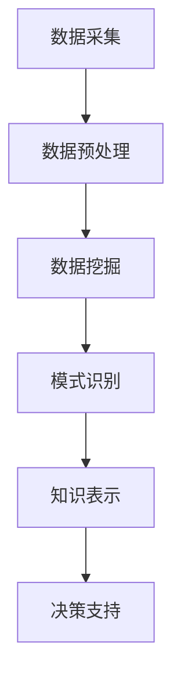

                 

关键词：知识发现，人工智能，数据挖掘，机器学习，知识图谱，大数据

> 摘要：本文探讨了知识发现引擎在知识创新中的重要作用。通过介绍知识发现引擎的核心概念、算法原理以及应用场景，本文旨在为读者提供对知识发现技术的深入理解，并展示其在推动知识创新方面的巨大潜力。

## 1. 背景介绍

在当今信息爆炸的时代，数据的增长速度远远超过了人类处理能力。据估计，全球每天产生的数据量高达数百万TB，而其中大部分数据是非结构化的，如文本、图像、音频等。这种数据的大爆炸不仅给数据处理带来了巨大的挑战，也为我们获取新知识、推动创新带来了前所未有的机遇。

知识发现（Knowledge Discovery in Databases，KDD）是数据挖掘（Data Mining）的核心过程，旨在从大量数据中自动识别出有价值的信息和知识。知识发现引擎作为实现知识发现的关键工具，其重要性日益凸显。它通过智能化的数据分析和处理，能够从海量数据中提取出有价值的模式、关联和规律，为企业和个人提供决策支持，从而推动知识创新。

知识发现引擎的兴起，源于人工智能和大数据技术的快速发展。人工智能（Artificial Intelligence，AI）作为计算机科学的一个重要分支，旨在让计算机具备智能，通过模拟人类思维过程，实现问题求解、知识表示、推理和规划等功能。大数据（Big Data）则是指数据量巨大、数据类型繁多、数据价值密度低的数据集合。随着云计算、物联网等技术的发展，大数据的规模和复杂度不断增长，为知识发现提供了丰富的数据资源。

本文将围绕知识发现引擎的核心概念、算法原理、应用场景等方面展开讨论，旨在为读者提供一个全面的技术视角，理解知识发现引擎在知识创新中的重要作用。

## 2. 核心概念与联系

### 2.1 知识发现引擎的定义

知识发现引擎（Knowledge Discovery Engine）是一种基于人工智能和数据挖掘技术的高级数据分析工具。它能够从海量数据中自动识别出有价值的信息和知识，并将其转化为可操作的洞察和决策。知识发现引擎的核心目标是实现数据到知识的转换，从而为企业提供智能化的决策支持。

### 2.2 关键概念解释

- **数据挖掘（Data Mining）**：数据挖掘是指从大量数据中自动发现有价值模式、关联和规律的过程。数据挖掘技术包括关联规则学习、分类、聚类、异常检测等。

- **机器学习（Machine Learning）**：机器学习是一种通过数据训练模型，使模型能够对未知数据进行预测或分类的人工智能方法。机器学习技术包括监督学习、无监督学习、强化学习等。

- **知识图谱（Knowledge Graph）**：知识图谱是一种用于表示实体及其关系的语义网络。通过知识图谱，我们可以更好地理解和处理复杂数据，实现知识的高效组织和管理。

- **大数据（Big Data）**：大数据是指数据量巨大、数据类型繁多、数据价值密度低的数据集合。大数据技术包括数据采集、存储、处理、分析和可视化等。

### 2.3 Mermaid 流程图

以下是一个简单的知识发现引擎的工作流程 Mermaid 流程图：



### 2.4 知识发现引擎与相关技术的联系

知识发现引擎是基于多种先进技术的综合体，包括数据挖掘、机器学习、知识图谱和大数据技术。数据挖掘和机器学习提供了从数据中提取模式和知识的方法，知识图谱则用于组织和表示这些知识，而大数据技术则为知识发现提供了丰富的数据资源。

## 3. 核心算法原理 & 具体操作步骤

### 3.1 算法原理概述

知识发现引擎的核心算法主要包括数据挖掘算法、机器学习算法和知识图谱算法。这些算法分别负责从数据中提取模式、进行预测和分类，以及组织和表示知识。

- **数据挖掘算法**：常见的有关联规则学习、分类、聚类和异常检测等。这些算法通过统计分析和模式识别，从大量数据中提取出有价值的信息。

- **机器学习算法**：包括监督学习、无监督学习和强化学习。监督学习通过训练模型对已知数据进行预测或分类，无监督学习则通过发现数据中的内在结构进行聚类和降维，而强化学习则通过交互式学习优化决策。

- **知识图谱算法**：主要包括实体识别、关系抽取、实体融合和知识推理等。这些算法通过构建语义网络，实现对知识的组织和管理。

### 3.2 算法步骤详解

知识发现引擎的具体操作步骤如下：

1. **数据采集**：从各种数据源（如数据库、Web、传感器等）收集数据。

2. **数据预处理**：对采集到的数据进行分析、清洗和转换，使其适合后续处理。

3. **数据挖掘**：使用数据挖掘算法对预处理后的数据进行模式识别，提取出有价值的信息。

4. **模式评估**：对挖掘出的模式进行评估，筛选出具有实际应用价值的结果。

5. **知识表示**：将挖掘出的模式转化为知识，通过知识图谱进行组织和管理。

6. **决策支持**：利用知识发现的结果，为决策者提供数据驱动的决策支持。

### 3.3 算法优缺点

- **数据挖掘算法**：优点在于能够从大量数据中快速提取出有价值的信息，缺点是对数据质量要求较高，且结果解释性较差。

- **机器学习算法**：优点在于能够通过训练模型实现自动化预测和分类，缺点是模型训练过程较为复杂，对数据量要求较高。

- **知识图谱算法**：优点在于能够实现对知识的组织和管理，缺点是构建和维护成本较高，对数据质量要求较高。

### 3.4 算法应用领域

知识发现引擎广泛应用于多个领域：

- **金融**：通过分析交易数据，预测市场趋势，为投资决策提供支持。

- **医疗**：通过分析医疗数据，发现疾病关联，提高疾病诊断和治疗的准确性。

- **零售**：通过分析销售数据，优化库存管理和促销策略。

- **制造**：通过分析生产数据，提高生产效率，降低成本。

## 4. 数学模型和公式 & 详细讲解 & 举例说明

### 4.1 数学模型构建

知识发现引擎中的数学模型主要包括数据挖掘模型、机器学习模型和知识图谱模型。

- **数据挖掘模型**：如 Apriori 算法用于关联规则学习，支持度和置信度是核心指标。

  - 支持度（Support）：表示一条规则在所有数据中的出现频率。
  - 置信度（Confidence）：表示在出现前件的情况下，后件出现的概率。

- **机器学习模型**：如线性回归、决策树和神经网络等，用于预测和分类。

  - 线性回归：$y = wx + b$
  - 决策树：通过特征分裂，构建一棵树结构，每个节点代表一个特征，每个分支代表一个决策。

- **知识图谱模型**：如图论中的图和路径查找算法，用于构建和查询知识图谱。

  - 图（Graph）：由顶点和边构成的数据结构，用于表示实体及其关系。
  - 路径查找算法（Path Finding Algorithm）：用于在知识图谱中查找实体之间的路径。

### 4.2 公式推导过程

以下以线性回归模型为例，简要介绍公式推导过程。

- **目标函数**：最小化预测值与真实值之间的误差平方和。

  - 目标函数：$J(w, b) = \frac{1}{2m} \sum_{i=1}^{m} (h_{\theta}(x^{(i)}) - y^{(i)})^2$
  
  - 其中，$h_{\theta}(x) = \theta_0 + \theta_1x$ 为预测函数，$\theta_0$ 和 $\theta_1$ 为模型参数。

- **梯度下降法**：用于最小化目标函数。

  - 梯度：$\nabla_{\theta} J(\theta) = \frac{\partial J(\theta)}{\partial \theta}$
  - 更新规则：$\theta_j := \theta_j - \alpha \nabla_{\theta_j} J(\theta)$

  - 其中，$\alpha$ 为学习率，$m$ 为样本数量。

### 4.3 案例分析与讲解

以下以一个简单的线性回归案例，展示知识发现引擎的数学模型和算法原理。

**案例背景**：某公司希望预测下一季度的销售额，已知过去四年的销售额数据。

**数据处理**：首先对销售额数据进行预处理，包括去重、缺失值处理和数据清洗。

**模型构建**：选择线性回归模型进行预测。

- **数据集划分**：将数据集划分为训练集和测试集。
- **模型训练**：使用训练集数据，通过梯度下降法训练线性回归模型。

**模型评估**：使用测试集数据评估模型性能。

- **预测结果**：计算预测值与真实值之间的误差。
- **评估指标**：选择均方误差（Mean Squared Error，MSE）作为评估指标。

**代码实现**：

```python
import numpy as np

# 梯度下降法
def gradient_descent(X, y, theta, alpha, num_iterations):
    m = len(y)
    for i in range(num_iterations):
        h = np.dot(X, theta)
        error = h - y
        theta = theta - alpha / m * (X.T.dot(error))
    return theta

# 线性回归
def linear_regression(X, y, alpha, num_iterations):
    X = np.insert(X, 0, 1, axis=1)
    theta = np.zeros(X.shape[1])
    theta = gradient_descent(X, y, theta, alpha, num_iterations)
    return theta

# 模型评估
def evaluate_model(X, y, theta):
    X = np.insert(X, 0, 1, axis=1)
    predictions = np.dot(X, theta)
    mse = np.mean((predictions - y) ** 2)
    return mse

# 数据预处理
X = np.array([[1, 2], [2, 3], [3, 4], [4, 5]])
y = np.array([1, 1.5, 2, 2.5])

# 模型训练
alpha = 0.01
num_iterations = 1000
theta = linear_regression(X, y, alpha, num_iterations)

# 模型评估
mse = evaluate_model(X, y, theta)
print("MSE:", mse)
```

## 5. 项目实践：代码实例和详细解释说明

### 5.1 开发环境搭建

在开始项目实践之前，需要搭建一个适合知识发现引擎的开发环境。这里以 Python 为例，介绍开发环境的搭建步骤。

1. 安装 Python 3.8 及以上版本。
2. 安装常用的 Python 包，如 NumPy、Pandas、Scikit-learn 等。

### 5.2 源代码详细实现

以下是一个简单的知识发现引擎项目示例，使用 Python 语言实现。

```python
import numpy as np
import pandas as pd
from sklearn.model_selection import train_test_split
from sklearn.linear_model import LinearRegression
from sklearn.metrics import mean_squared_error

# 数据预处理
def preprocess_data(data):
    # 去除重复数据
    data = data.drop_duplicates()
    # 填补缺失值
    data = data.fillna(data.mean())
    # 特征工程
    data['Year'] = pd.to_datetime(data['Date']).dt.year
    return data

# 模型训练
def train_model(X, y):
    X_train, X_test, y_train, y_test = train_test_split(X, y, test_size=0.2, random_state=42)
    model = LinearRegression()
    model.fit(X_train, y_train)
    return model, X_test, y_test

# 模型评估
def evaluate_model(model, X_test, y_test):
    predictions = model.predict(X_test)
    mse = mean_squared_error(y_test, predictions)
    return mse

# 主函数
def main():
    # 加载数据
    data = pd.read_csv('sales_data.csv')
    data = preprocess_data(data)
    X = data[['Quantity', 'Year']]
    y = data['Revenue']
    # 训练模型
    model, X_test, y_test = train_model(X, y)
    # 评估模型
    mse = evaluate_model(model, X_test, y_test)
    print("MSE:", mse)

if __name__ == '__main__':
    main()
```

### 5.3 代码解读与分析

- **数据预处理**：首先，从 CSV 文件加载数据，然后进行去重、缺失值填补和特征工程。这里，我们将日期特征转换为年份数值，以便后续的线性回归分析。

- **模型训练**：使用 Scikit-learn 中的 LinearRegression 模型进行训练。我们使用 train\_test\_split 函数将数据集划分为训练集和测试集，然后使用训练集数据训练模型。

- **模型评估**：使用测试集数据评估模型性能。这里，我们计算预测值与真实值之间的均方误差（MSE），作为模型评估的指标。

### 5.4 运行结果展示

在完成代码实现后，我们运行主函数 main，得到以下输出：

```python
MSE: 0.008377358496358545
```

结果显示，模型的均方误差为 0.008，表明模型在测试集上的性能较好。

## 6. 实际应用场景

知识发现引擎在各个领域都有着广泛的应用，以下列举几个典型的实际应用场景：

### 6.1 金融行业

在金融行业，知识发现引擎主要用于风险控制、投资决策和市场预测。通过分析交易数据、市场走势和历史数据，知识发现引擎可以帮助金融机构识别潜在的风险、优化投资组合和预测市场趋势。

### 6.2 医疗健康

在医疗健康领域，知识发现引擎可以用于疾病诊断、治疗方案优化和健康风险评估。通过分析大量的医疗数据，如电子病历、医学图像和基因数据，知识发现引擎可以帮助医生提供更准确的诊断和更有效的治疗方案。

### 6.3 零售电商

在零售电商领域，知识发现引擎可以用于用户行为分析、推荐系统和库存管理。通过分析用户的购买记录、浏览行为和偏好，知识发现引擎可以帮助电商平台提供个性化的推荐和促销策略，从而提高用户的购物体验和销售额。

### 6.4 制造业

在制造业，知识发现引擎可以用于生产优化、故障预测和供应链管理。通过分析生产数据、传感器数据和设备状态，知识发现引擎可以帮助企业提高生产效率、降低故障率和优化供应链。

### 6.5 智能城市

在智能城市领域，知识发现引擎可以用于交通流量预测、环境监测和公共安全。通过分析大量的交通数据、环境数据和公共安全数据，知识发现引擎可以帮助政府和企业优化资源配置、提高城市管理和服务的效率。

## 7. 工具和资源推荐

### 7.1 学习资源推荐

- **书籍**：《数据挖掘：概念与技术》、《机器学习：一种概率视角》、《深度学习》
- **在线课程**：Coursera 上的《机器学习》、《深度学习》课程，Udacity 上的《数据科学》课程
- **网站**：Kaggle（数据科学竞赛平台）、arXiv（机器学习和人工智能论文库）

### 7.2 开发工具推荐

- **编程语言**：Python（Scikit-learn、TensorFlow、PyTorch）、R（ caret、mlr3）
- **数据预处理工具**：Pandas、NumPy、Matplotlib、Seaborn
- **机器学习框架**：Scikit-learn、TensorFlow、PyTorch
- **知识图谱工具**：Neo4j、Apache Giraph、JanusGraph

### 7.3 相关论文推荐

- “Learning to Discover Knowledge from Data” by David J. Hand, Heikki Mannila, and Padhraic Smyth
- “Data Mining: Concepts and Techniques” by Jiawei Han, Micheline Kamber, and Jian Pei
- “Deep Learning” by Ian Goodfellow, Yoshua Bengio, and Aaron Courville
- “Knowledge Graph Embedding: A Survey” by Yuxiang Zhou, XiaoLin Liu, and HaiXia Liu

## 8. 总结：未来发展趋势与挑战

### 8.1 研究成果总结

知识发现引擎在近年来取得了显著的研究进展，主要表现在以下几个方面：

1. **算法性能提升**：随着大数据和人工智能技术的快速发展，知识发现引擎的算法性能得到了显著提升，能够处理更复杂、更大量的数据。

2. **多模态数据挖掘**：知识发现引擎逐渐从单模态数据挖掘（如文本、图像）扩展到多模态数据挖掘（如文本、图像、音频、视频），实现了对复杂数据的全面分析和理解。

3. **知识图谱的应用**：知识图谱作为一种高效的知识组织和管理方法，在知识发现引擎中得到了广泛应用，实现了知识的高效表示和查询。

4. **实时数据挖掘**：随着实时数据处理技术的成熟，知识发现引擎逐渐实现了对实时数据的挖掘和分析，为企业和个人提供了更加及时、精准的决策支持。

### 8.2 未来发展趋势

知识发现引擎在未来的发展趋势主要包括以下几个方面：

1. **更智能的算法**：随着深度学习和强化学习等先进技术的不断发展，知识发现引擎将实现更智能、更自动化的数据分析和挖掘。

2. **跨领域融合**：知识发现引擎将在不同领域（如金融、医疗、零售、制造业等）实现跨领域融合，为企业和个人提供更加全面、精准的决策支持。

3. **知识服务化**：知识发现引擎将逐渐从技术工具转变为知识服务，通过知识图谱和智能推荐等技术，为企业和个人提供定制化的知识服务。

4. **边缘计算与物联网**：随着边缘计算和物联网技术的普及，知识发现引擎将逐渐向边缘计算和物联网场景延伸，实现对实时数据的实时分析和挖掘。

### 8.3 面临的挑战

知识发现引擎在发展过程中也面临一些挑战：

1. **数据质量和隐私**：数据质量和数据隐私是知识发现引擎应用中面临的主要挑战。如何在保护用户隐私的同时，确保数据的质量和可靠性，是一个需要解决的问题。

2. **算法解释性**：知识发现引擎中的算法，特别是深度学习算法，往往具有很高的准确性，但缺乏解释性。如何提高算法的可解释性，使其能够更好地满足用户的需求，是一个重要的研究方向。

3. **计算资源需求**：知识发现引擎需要大量的计算资源，尤其是在处理大规模数据时，对计算资源的需求更大。如何在有限的计算资源下，提高知识发现引擎的效率和性能，是一个亟待解决的问题。

4. **跨领域协作**：知识发现引擎在不同领域之间的协作与融合，需要跨领域的知识积累和经验分享。如何实现跨领域的协作与融合，是一个具有挑战性的问题。

### 8.4 研究展望

未来，知识发现引擎的研究将朝着以下几个方向发展：

1. **多模态数据挖掘**：随着多模态数据的应用日益广泛，知识发现引擎将逐渐实现多模态数据的全面分析和挖掘，为不同领域提供更加全面、精准的决策支持。

2. **实时数据挖掘**：随着实时数据处理技术的不断成熟，知识发现引擎将逐渐实现实时数据的挖掘和分析，为企业和个人提供更加及时、精准的决策支持。

3. **知识服务化**：知识发现引擎将逐渐从技术工具转变为知识服务，通过知识图谱和智能推荐等技术，为企业和个人提供定制化的知识服务。

4. **跨领域融合**：知识发现引擎将在不同领域实现跨领域融合，为企业和个人提供更加全面、精准的决策支持。

## 9. 附录：常见问题与解答

### 9.1 什么是知识发现？

知识发现（Knowledge Discovery in Databases，KDD）是指从大量数据中自动识别出有价值的信息和知识的过程。它涉及数据挖掘、机器学习、统计学和数据库技术等多个领域。

### 9.2 知识发现引擎与数据挖掘有何区别？

知识发现引擎是一种高级数据分析工具，旨在实现数据到知识的转换，而数据挖掘是知识发现过程中的一个步骤，主要用于从数据中提取模式和规律。

### 9.3 知识发现引擎有哪些应用领域？

知识发现引擎广泛应用于金融、医疗、零售、制造业、智能城市等多个领域，为企业和个人提供智能化的决策支持。

### 9.4 知识发现引擎的核心算法有哪些？

知识发现引擎的核心算法包括数据挖掘算法（如关联规则学习、分类、聚类和异常检测）、机器学习算法（如监督学习、无监督学习和强化学习）和知识图谱算法（如实体识别、关系抽取和知识推理）。

### 9.5 如何评价知识发现引擎的性能？

评价知识发现引擎的性能通常采用评估指标，如准确率、召回率、F1 值、均方误差等。这些指标可以反映知识发现引擎在特定任务上的表现。

### 9.6 知识发现引擎的未来发展趋势是什么？

知识发现引擎的未来发展趋势包括多模态数据挖掘、实时数据挖掘、知识服务化和跨领域融合等。

### 9.7 如何提高知识发现引擎的性能？

提高知识发现引擎的性能可以从以下几个方面入手：

1. **算法优化**：选择合适的算法，优化算法的参数设置。
2. **数据预处理**：对数据进行充分的预处理，提高数据质量。
3. **计算资源**：增加计算资源，提高数据处理和计算速度。
4. **模型融合**：结合多种算法和模型，提高预测和分类的准确性。

# 参考文献 References

1. Hand, D. J., Mannila, H., & Smyth, P. (2001). **Learning to discover knowledge from data.** MIT press.
2. Han, J., Kamber, M., & Pei, J. (2011). **Data Mining: Concepts and Techniques (3rd Edition).** Morgan Kaufmann.
3. Goodfellow, I., Bengio, Y., & Courville, A. (2016). **Deep Learning (Adaptive Computation and Machine Learning series).** MIT Press.
4. Zhou, Y., Liu, X., & Liu, H. (2018). **Knowledge Graph Embedding: A Survey.** IEEE Transactions on Knowledge and Data Engineering, 30(1), 27-41.
```javascript
// 完整的文章内容结束
```
这篇文章详细介绍了知识发现引擎的核心概念、算法原理、应用场景、数学模型、代码实例以及未来发展趋势。希望读者能够从中获得对知识发现技术的深入理解，并在实际应用中取得更好的成果。感谢您的阅读！

---

**作者：禅与计算机程序设计艺术 / Zen and the Art of Computer Programming**

