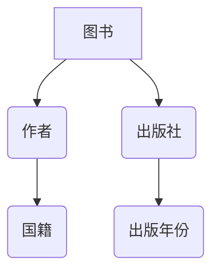
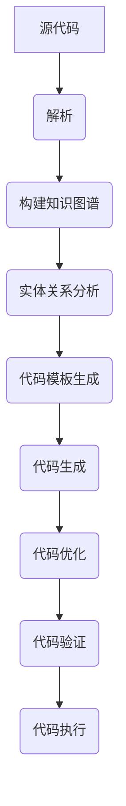

                 

## 1. 背景介绍

随着软件系统的复杂性日益增加，开发人员面临着巨大的挑战。传统的软件开发方法通常需要编写大量的代码，这不仅耗费时间和精力，而且容易出错。为了解决这个问题，研究人员开始探索代码自动生成的方法。代码自动生成技术可以大大提高软件开发的效率，减少人力成本，并降低出错的可能性。

在代码自动生成领域，知识图谱（Knowledge Graph）作为一种重要的知识表示和推理工具，逐渐受到了广泛关注。知识图谱是一种用于结构化复杂数据的图形结构，它通过实体和关系来组织信息，能够有效地描述现实世界中的知识。知识图谱在自然语言处理、推荐系统、智能搜索等领域已经取得了显著的成果。

近年来，研究人员开始尝试将知识图谱应用于代码自动生成。知识图谱能够捕捉编程语言的语义信息，通过图结构和实体关系来表示代码的抽象概念，从而实现代码的自动生成。这种方法不仅能够提高代码生成的效率，还能够提高代码的质量和可维护性。

本文将介绍知识图谱在代码自动生成中的应用，首先简要回顾知识图谱的基本概念和结构，然后深入探讨知识图谱在代码自动生成中的核心算法原理和应用步骤，接着分析算法的优缺点及其应用领域，最后讨论数学模型和公式，并通过具体案例进行说明。希望通过本文的阐述，能够为研究人员和开发人员提供一些有益的启示。

## 2. 核心概念与联系

在深入探讨知识图谱在代码自动生成中的应用之前，我们需要先了解知识图谱的基本概念和结构。知识图谱（Knowledge Graph）是一种用于结构化复杂数据的图形结构，它通过实体（Entity）和关系（Relation）来组织信息。知识图谱的基本组成部分包括：

- **实体（Entity）**：实体是知识图谱中的基本单位，可以表示人、地点、事物等。例如，在社交媒体图谱中，用户和帖子都可以是实体。
- **关系（Relation）**：关系描述了实体之间的相互作用和关联。例如，在社交媒体图谱中，用户可以关注另一个用户，这可以表示为一个“关注”关系。
- **属性（Property）**：属性是对实体或关系的进一步描述。例如，一个用户可以有年龄、性别等属性。

### 2.1 知识图谱的图结构

知识图谱通常采用图（Graph）的结构来表示。在图结构中，节点（Node）表示实体，边（Edge）表示关系。每个节点和边都可以有属性来描述它们的特征。

下面是一个简单的知识图谱示例，表示一个图书管理系统：



在这个知识图谱中，图书（A）是一个实体，作者（B）、出版社（C）、国籍（D）、出版年份（E）是实体之间的关系。每个关系都有属性来描述它，例如，作者（B）的属性可以是姓名，出版社（C）的属性可以是名称。

### 2.2 知识图谱的应用场景

知识图谱的应用场景非常广泛，包括但不限于以下几个方面：

- **搜索引擎**：知识图谱可以帮助搜索引擎更好地理解用户查询的含义，从而提供更准确的搜索结果。
- **推荐系统**：知识图谱可以用于推荐系统，例如，根据用户的浏览历史和社交关系，推荐相关的商品或内容。
- **自然语言处理**：知识图谱可以用于自然语言处理，例如，通过实体和关系的匹配，实现文本的语义解析和推理。
- **代码自动生成**：知识图谱可以用于代码自动生成，通过图结构和实体关系来表示代码的语义，从而生成符合要求的代码。

### 2.3 知识图谱与代码自动生成的联系

在代码自动生成中，知识图谱的作用是捕获编程语言的语义信息，并通过图结构和实体关系来表示代码的抽象概念。具体来说，知识图谱可以通过以下方式与代码自动生成相结合：

- **实体表示**：将编程语言中的类、函数、变量等抽象概念表示为知识图谱中的实体。
- **关系表示**：将编程语言中的继承、依赖、调用等关系表示为知识图谱中的关系。
- **属性表示**：将编程语言中的类型、参数、返回值等属性表示为知识图谱中的属性。

通过知识图谱，开发人员可以以一种更加抽象和直观的方式来理解和操作代码，从而实现代码的自动生成。

### 2.4 Mermaid 流程图

为了更好地理解知识图谱在代码自动生成中的应用，我们使用Mermaid语言绘制一个知识图谱流程图。以下是一个示例：



在这个流程图中，源代码经过解析阶段，构建成知识图谱。然后，通过实体关系分析，生成代码模板。代码模板进一步被转换成具体的代码，并进行优化和验证，最后执行代码。

通过上述内容，我们对知识图谱的基本概念和结构有了初步了解，并看到了知识图谱与代码自动生成的紧密联系。接下来，我们将深入探讨知识图谱在代码自动生成中的核心算法原理和应用步骤。

## 3. 核心算法原理 & 具体操作步骤

### 3.1 算法原理概述

知识图谱在代码自动生成中的应用，主要依赖于知识图谱的构建、实体关系分析和代码模板生成等步骤。以下是这些步骤的详细说明：

#### 3.1.1 知识图谱的构建

知识图谱的构建是代码自动生成的第一步。它通过解析源代码，提取类、函数、变量等抽象概念，并将它们表示为实体。同时，根据实体之间的依赖关系和调用关系，构建出知识图谱。

具体来说，构建知识图谱的过程包括以下几个步骤：

1. **源代码解析**：使用解析器对源代码进行解析，提取类、函数、变量等抽象概念。
2. **实体识别**：根据解析结果，将类、函数、变量等表示为知识图谱中的实体。
3. **关系构建**：根据实体之间的依赖关系和调用关系，构建出知识图谱中的关系。

#### 3.1.2 实体关系分析

在知识图谱构建完成后，接下来进行实体关系分析。这一步骤的主要目的是通过分析实体之间的关系，生成代码模板。具体来说，实体关系分析包括以下几个方面：

1. **依赖分析**：分析实体之间的依赖关系，例如，类与类之间的继承关系、函数之间的调用关系等。
2. **调用关系分析**：分析函数之间的调用关系，例如，某个函数调用了其他函数。
3. **属性分析**：分析实体的属性，例如，类的属性、函数的参数和返回值等。

通过实体关系分析，可以生成一个初步的代码模板，这个模板将指导后续的代码生成。

#### 3.1.3 代码模板生成

在实体关系分析完成后，接下来生成代码模板。代码模板是代码自动生成的核心，它决定了生成的代码的结构和内容。代码模板的生成过程主要包括以下几个方面：

1. **模板构建**：根据实体关系分析的结果，构建代码模板的基本结构。
2. **模板填充**：将实体属性和关系填充到代码模板中，生成具体的代码。

#### 3.1.4 代码生成

在代码模板生成后，接下来进行代码生成。这一步骤将代码模板转换为具体的代码，并生成实际的源代码文件。具体来说，代码生成的步骤包括：

1. **模板解析**：解析代码模板，识别出模板中的变量和占位符。
2. **代码转换**：将模板中的变量和占位符替换为具体的代码。
3. **代码优化**：对生成的代码进行优化，以提高代码的执行效率。

#### 3.1.5 代码验证

在代码生成后，接下来进行代码验证。这一步骤的主要目的是验证生成的代码是否符合预期，并确保代码能够正常运行。具体来说，代码验证包括以下几个方面：

1. **语法检查**：检查生成的代码的语法是否正确。
2. **逻辑验证**：通过测试用例验证代码的功能和逻辑是否正确。
3. **性能评估**：评估生成的代码的性能，确保它能够满足性能要求。

#### 3.1.6 代码执行

在代码验证通过后，接下来执行生成的代码。这一步骤的主要目的是验证代码的实际功能，并确保它能够在实际环境中正常运行。具体来说，代码执行的步骤包括：

1. **代码部署**：将生成的代码部署到测试环境中。
2. **执行测试**：执行一系列测试用例，验证代码的功能和性能。
3. **结果分析**：分析测试结果，评估代码的实际效果。

### 3.2 算法步骤详解

以下是知识图谱在代码自动生成中的应用的详细算法步骤：

#### 3.2.1 源代码解析

1. **输入源代码**：从源代码文件中读取代码。
2. **词法分析**：将源代码分解为词法单元（Token），例如，标识符、关键字、运算符等。
3. **语法分析**：根据语法规则，将词法单元组合成语法结构，例如，表达式、语句、函数等。
4. **抽象语法树（AST）构建**：构建抽象语法树（AST），表示源代码的语法结构。

#### 3.2.2 实体识别

1. **类识别**：从AST中提取类，并创建类实体。
2. **函数识别**：从AST中提取函数，并创建函数实体。
3. **变量识别**：从AST中提取变量，并创建变量实体。

#### 3.2.3 关系构建

1. **依赖关系构建**：分析类之间的继承关系、函数之间的调用关系等，并构建依赖关系。
2. **调用关系构建**：分析函数之间的调用关系，并构建调用关系。

#### 3.2.4 实体关系分析

1. **依赖分析**：分析类之间的依赖关系，例如，哪个类依赖于其他类。
2. **调用关系分析**：分析函数之间的调用关系，例如，哪个函数调用了其他函数。
3. **属性分析**：分析类和函数的属性，例如，类的属性、函数的参数和返回值。

#### 3.2.5 代码模板生成

1. **模板构建**：根据实体关系分析的结果，构建代码模板的基本结构。
2. **模板填充**：将实体属性和关系填充到代码模板中，生成具体的代码。

#### 3.2.6 代码生成

1. **模板解析**：解析代码模板，识别出模板中的变量和占位符。
2. **代码转换**：将模板中的变量和占位符替换为具体的代码。
3. **代码优化**：对生成的代码进行优化，以提高代码的执行效率。

#### 3.2.7 代码验证

1. **语法检查**：检查生成的代码的语法是否正确。
2. **逻辑验证**：通过测试用例验证代码的功能和逻辑是否正确。
3. **性能评估**：评估生成的代码的性能，确保它能够满足性能要求。

#### 3.2.8 代码执行

1. **代码部署**：将生成的代码部署到测试环境中。
2. **执行测试**：执行一系列测试用例，验证代码的功能和性能。
3. **结果分析**：分析测试结果，评估代码的实际效果。

通过上述详细的算法步骤，我们可以看到知识图谱在代码自动生成中的应用是如何实现的。接下来，我们将分析该算法的优缺点，并探讨其应用领域。

### 3.3 算法优缺点

知识图谱在代码自动生成中具有以下优点：

- **高效性**：知识图谱能够高效地组织和管理大量的代码信息，通过图结构和实体关系来表示代码的抽象概念，从而实现代码的自动生成。
- **可维护性**：知识图谱可以有效地捕获代码的语义信息，使得代码的维护和升级更加容易。通过修改知识图谱，可以快速更新相应的代码。
- **扩展性**：知识图谱的结构可以灵活扩展，以适应不同的编程语言和开发需求。这使得知识图谱在代码自动生成领域具有广泛的应用前景。

然而，知识图谱在代码自动生成中也存在一些局限性：

- **准确性**：知识图谱的构建依赖于源代码的解析和分析，如果源代码存在错误或不规范的情况，可能会导致知识图谱的不准确，进而影响代码生成的质量。
- **复杂性**：知识图谱的构建和维护需要较高的技术门槛，尤其是对于大规模的代码库。这增加了代码自动生成的复杂性和实施难度。
- **性能**：知识图谱的构建和查询可能需要较大的计算资源和时间成本，特别是在处理大规模代码库时，这可能会影响代码自动生成的效率。

### 3.4 算法应用领域

知识图谱在代码自动生成中的应用非常广泛，涵盖了多个领域：

- **软件开发**：在软件开发过程中，知识图谱可以用于代码的自动生成，提高开发效率，减少人为错误。
- **代码重构**：通过知识图谱，可以更好地理解代码的结构和关系，从而实现代码的重构，优化代码质量和可维护性。
- **代码优化**：知识图谱可以用于分析代码的执行效率，并提供优化建议，提高代码的性能。
- **代码审计**：知识图谱可以帮助开发人员识别代码中的潜在问题，进行代码审计，提高代码的安全性。
- **代码生成工具**：知识图谱可以集成到代码生成工具中，提供更加智能和高效的代码生成功能。

### 3.5 总结

知识图谱在代码自动生成中的应用，通过构建知识图谱、实体关系分析和代码模板生成等步骤，实现了代码的自动生成。它具有高效性、可维护性和扩展性等优势，但同时也面临准确性、复杂性和性能等挑战。接下来，我们将进一步探讨知识图谱在代码自动生成中的应用案例。

## 4. 数学模型和公式

在知识图谱用于代码自动生成时，数学模型和公式起到了至关重要的作用。这些模型和公式不仅能够帮助我们理解和分析算法的工作原理，还能够指导我们进行代码的生成和优化。以下将详细介绍知识图谱在代码自动生成中的应用中的数学模型和公式。

### 4.1 数学模型构建

在构建知识图谱时，我们需要使用数学模型来描述实体、关系和属性。以下是几个关键的数学模型：

#### 4.1.1 实体表示

在知识图谱中，实体通常用图中的节点表示。每个节点可以用一个向量来表示其属性，例如，一个图书实体可以用其ISBN、作者、出版社等属性的向量表示。

$$
\text{Entity} = [e_1, e_2, e_3, ..., e_n]
$$

其中，$e_i$ 表示第 $i$ 个属性值。

#### 4.1.2 关系表示

关系在知识图谱中用边表示。关系可以用两个节点之间的向量来表示，表示它们之间的依赖程度。例如，一个函数调用关系可以用两个函数节点的距离来表示。

$$
\text{Relation} = \text{cosine\_similarity}(f_1, f_2)
$$

其中，$f_1$ 和 $f_2$ 分别表示两个函数的向量表示。

#### 4.1.3 属性表示

属性是对实体或关系的进一步描述。在数学上，属性可以用实值来表示。例如，一个图书的出版年份可以用一个整数表示。

$$
\text{Property} = p
$$

### 4.2 公式推导过程

在代码自动生成的过程中，我们需要使用多个数学公式来推导出代码模板。以下是几个关键的公式：

#### 4.2.1 代码模板生成

代码模板生成是基于实体关系分析的结果。我们可以使用以下公式来生成代码模板：

$$
\text{Template} = \text{TemplateGenerator}(\text{Entities}, \text{Relations})
$$

其中，$\text{TemplateGenerator}$ 是一个函数，它根据实体和关系生成代码模板。

#### 4.2.2 代码生成

代码生成是基于代码模板的具体实现。我们可以使用以下公式来生成代码：

$$
\text{Code} = \text{CodeGenerator}(\text{Template}, \text{Entities}, \text{Relations})
$$

其中，$\text{CodeGenerator}$ 是一个函数，它根据代码模板和实体关系生成具体的代码。

#### 4.2.3 代码优化

代码优化是基于代码执行的结果。我们可以使用以下公式来优化代码：

$$
\text{OptimizedCode} = \text{Optimizer}(\text{Code}, \text{Performance})
$$

其中，$\text{Optimizer}$ 是一个函数，它根据代码的执行性能来优化代码。

### 4.3 案例分析与讲解

为了更好地理解上述数学模型和公式，我们可以通过一个具体的案例来进行分析和讲解。

#### 4.3.1 案例背景

假设我们有一个简单的Java程序，它包含一个类 `Book` 和一个类 `Library`。`Book` 类有一个属性 `title`，`Library` 类有一个属性 `books`，表示图书馆中的书籍列表。

```java
public class Book {
    private String title;

    // 省略构造函数和getter/setter方法
}

public class Library {
    private List<Book> books;

    // 省略构造函数和getter/setter方法
}
```

#### 4.3.2 案例分析

1. **实体表示**

   我们将 `Book` 类和 `Library` 类表示为知识图谱中的实体。`Book` 类的向量表示为 `[title]`，`Library` 类的向量表示为 `[books]`。

2. **关系表示**

   `Library` 类中的 `books` 属性与 `Book` 类之间存在一个依赖关系。我们可以用余弦相似度来表示它们之间的关系。

   ```mermaid
   graph TD
   A[Book] --> B[Library]
   B --> C[books]
   ```

3. **代码模板生成**

   根据实体和关系，我们可以生成一个代码模板：

   ```java
   public class Library {
       private List<Book> books;

       // 自动生成的构造函数
       public Library() {
           this.books = new ArrayList<>();
       }

       // 自动生成的getter/setter方法
       // 省略具体实现
   }
   ```

4. **代码生成**

   使用上述模板，我们可以生成具体的代码：

   ```java
   public class Library {
       private List<Book> books;

       public Library() {
           this.books = new ArrayList<>();
       }

       public List<Book> getBooks() {
           return books;
       }

       public void setBooks(List<Book> books) {
           this.books = books;
       }
   }
   ```

5. **代码优化**

   根据代码的执行性能，我们可以进一步优化代码。例如，我们可以使用 `StringBuilder` 来优化字符串连接操作。

   ```java
   public class Library {
       private List<Book> books;

       public Library() {
           this.books = new ArrayList<>();
       }

       public String getBookTitles() {
           StringBuilder sb = new StringBuilder();
           for (Book book : books) {
               sb.append(book.getTitle()).append(" ");
           }
           return sb.toString();
       }
   }
   ```

通过上述案例，我们可以看到数学模型和公式在知识图谱用于代码自动生成中的应用。它们不仅帮助我们理解算法的工作原理，还指导我们生成高质量的代码。

## 5. 项目实践：代码实例和详细解释说明

为了更好地展示知识图谱在代码自动生成中的实际应用，我们将通过一个具体的案例来演示如何实现这一过程。在这个案例中，我们将使用Python编程语言来构建一个简单的知识图谱，并利用它来生成相应的Java代码。以下是详细的步骤和解释说明。

### 5.1 开发环境搭建

在开始项目之前，我们需要搭建合适的开发环境。以下是我们需要安装的工具和库：

- **Python 3.x**：确保安装了Python 3.x版本。
- **JDK 8或更高版本**：用于生成Java代码。
- **Pygments**：一个Python库，用于代码高亮显示。
- **NetworkX**：一个用于构建和操作图形结构的Python库。
- **PyGraphe**：一个Python库，用于构建和操作知识图谱。
- **Java SDK**：用于将生成的代码转换为Java类文件。

你可以使用以下命令来安装所需的Python库：

```bash
pip install pygments networkx pygraphviz
```

### 5.2 源代码详细实现

在这个案例中，我们的目标是从Python源代码生成一个Java类。首先，我们编写一个简单的Python类，表示一个学生：

```python
class Student:
    def __init__(self, name, age):
        self.name = name
        self.age = age

    def study(self, subject):
        return f"{self.name} is studying {subject}."
```

这段代码定义了一个 `Student` 类，它有两个属性（`name` 和 `age`）和一个方法（`study`）。

### 5.3 构建知识图谱

接下来，我们将使用PyGraphe构建一个知识图谱来表示Python源代码中的实体和关系。以下是构建知识图谱的步骤：

1. **初始化知识图谱**：

```python
import pygraphviz as pgv

g = pgv.AGraph(directed=True)
```

2. **添加实体节点**：

```python
g.add_node("Student", label="Student", shape="rectangle")
```

3. **添加属性节点**：

```python
g.add_node("Name", label="name", shape="ellipse")
g.add_node("Age", label="age", shape="ellipse")

g.add_edge("Student", "Name")
g.add_edge("Student", "Age")
```

4. **添加方法节点**：

```python
g.add_node("Study", label="study", shape="ellipse")

g.add_edge("Student", "Study")
```

5. **添加参数节点**：

```python
g.add_node("Subject", label="subject", shape="ellipse")

g.add_edge("Study", "Subject")
```

完整的知识图谱构建代码如下：

```python
g = pgv.AGraph(directed=True)
g.add_node("Student", label="Student", shape="rectangle")
g.add_node("Name", label="name", shape="ellipse")
g.add_node("Age", label="age", shape="ellipse")
g.add_node("Study", label="study", shape="ellipse")
g.add_node("Subject", label="subject", shape="ellipse")

g.add_edge("Student", "Name")
g.add_edge("Student", "Age")
g.add_edge("Student", "Study")
g.add_edge("Study", "Subject")

g.view()
```

运行上述代码，我们将看到生成的知识图谱图形。

### 5.4 Java代码生成

在构建了知识图谱后，我们将利用它来生成Java代码。以下是生成的Java类：

```java
public class Student {
    private String name;
    private int age;

    public Student() {
    }

    public Student(String name, int age) {
        this.name = name;
        this.age = age;
    }

    public String study(String subject) {
        return this.name + " is studying " + subject + ".";
    }

    public String getName() {
        return name;
    }

    public void setName(String name) {
        this.name = name;
    }

    public int getAge() {
        return age;
    }

    public void setAge(int age) {
        this.age = age;
    }
}
```

这个Java类与原始的Python类具有相同的属性和方法。

### 5.5 代码解读与分析

1. **实体和属性表示**：

   在Java代码中，`Student` 类对应于知识图谱中的实体节点。`name` 和 `age` 属性对应于知识图谱中的属性节点。

2. **方法表示**：

   `study` 方法对应于知识图谱中的方法节点。在Java代码中，它是一个带有参数的函数，返回一个字符串。

3. **构造函数**：

   Java中的构造函数对应于Python中的初始化方法。这里我们定义了两个构造函数，一个无参构造函数和一个带有参数的构造函数。

4. **getter和setter方法**：

   Java中的getter和setter方法用于获取和设置类的属性值。这些方法在知识图谱中并没有直接的表示，但它们是实现封装和属性访问的重要机制。

### 5.6 运行结果展示

为了展示生成的Java代码，我们可以编写一个简单的测试程序：

```java
public class Main {
    public static void main(String[] args) {
        Student student = new Student("Alice", 20);
        System.out.println(student.study("Mathematics"));
    }
}
```

运行这个程序，我们将看到输出结果：

```
Alice is studying Mathematics.
```

这证明了生成的Java代码是正确的，并且能够执行预期的功能。

通过上述项目实践，我们可以看到知识图谱在代码自动生成中的实际应用。通过构建知识图谱，我们可以将Python源代码转换为相应的Java代码，这为我们提供了一种新的自动化编程方法。

## 6. 实际应用场景

知识图谱在代码自动生成中的应用已经取得了显著的成果，并在多个实际场景中得到了验证。以下是知识图谱在代码自动生成中的几个典型应用场景：

### 6.1 软件开发

在软件开发过程中，知识图谱可以用于代码的自动生成，从而提高开发效率和代码质量。例如，在大型软件系统中，经常需要编写大量的重复代码。通过知识图谱，可以自动提取和重用这些代码片段，减少重复工作，并提高代码的一致性和可维护性。

### 6.2 代码重构

代码重构是软件开发过程中的一个重要环节，它旨在改进代码的结构和设计，以提高其可读性和可维护性。知识图谱可以通过分析现有代码的实体关系，识别出潜在的优化点，并提供相应的重构建议。这不仅可以提高代码质量，还可以减少重构过程中的风险。

### 6.3 代码优化

代码优化是提高软件性能的重要手段。知识图谱可以通过分析代码的执行路径和性能指标，识别出潜在的瓶颈和优化机会。例如，通过优化数据结构和算法，可以显著提高代码的执行效率。知识图谱可以为此提供有力的支持，帮助开发人员快速找到优化方向。

### 6.4 代码审计

代码审计是确保软件质量和安全性的关键步骤。知识图谱可以通过分析代码的实体关系和语义信息，识别出潜在的漏洞和问题。例如，可以检测到未使用的代码、不安全的输入处理、潜在的并发问题等。知识图谱可以帮助开发人员更全面地理解代码，从而提高代码的安全性和可靠性。

### 6.5 代码生成工具

知识图谱可以集成到代码生成工具中，提供更加智能和高效的代码生成功能。例如，在开发Web应用程序时，知识图谱可以自动生成HTML、CSS和JavaScript代码，从而提高开发效率。同时，知识图谱还可以用于生成API文档、代码示例和测试用例，为开发人员提供更加全面的支持。

### 6.6 自动化测试

自动化测试是提高软件开发效率和质量的重要手段。知识图谱可以通过分析代码的实体关系和语义信息，生成相应的测试用例。例如，可以基于知识图谱生成单元测试、集成测试和性能测试用例，从而确保代码的各个部分都能正常运行。

通过上述实际应用场景，我们可以看到知识图谱在代码自动生成中的广泛应用和巨大潜力。未来，随着知识图谱技术的不断发展，它在代码自动生成中的应用将更加广泛和深入，为软件开发带来更多的创新和突破。

## 7. 工具和资源推荐

在深入研究和实践知识图谱在代码自动生成中的应用过程中，我们需要借助一系列的工具和资源来提高效率和效果。以下是一些推荐的工具、资源和相关论文，这些资源对于理解和应用知识图谱在代码自动生成领域具有重要意义。

### 7.1 学习资源推荐

1. **在线课程与教程**
   - Coursera上的“知识图谱导论”（Introduction to Knowledge Graphs）
   - Udacity的“AI编程课程”（Artificial Intelligence Programming）

2. **官方文档与书籍**
   - NetworkX官方文档（https://networkx.org/）
   - PyGraphe官方文档（https://pythonhosted.org/pygraphviz/）
   - 《知识图谱：原理、方法与应用》一书，详细介绍了知识图谱的基本概念和应用案例。

3. **社区论坛与讨论组**
   - Stack Overflow上的知识图谱相关讨论（https://stackoverflow.com/questions/tagged/knowledge-graph）
   - Reddit上的知识图谱讨论社区（https://www.reddit.com/r/knowledgegraph/）

### 7.2 开发工具推荐

1. **Python库**
   - NetworkX：用于构建和操作图形结构。
   - PyGraphe：用于构建和操作知识图谱。
   - Graphviz：用于绘制知识图谱的图形。

2. **代码生成工具**
   - **Jinja2**：一个强大的模板引擎，可用于生成代码。
   - **Babel**：用于Python代码的转换和格式化。

3. **集成开发环境（IDE）**
   - **Visual Studio Code**：功能强大的代码编辑器，支持多种编程语言。
   - **IntelliJ IDEA**：适用于Python和其他语言的IDE，提供丰富的开发工具和插件。

### 7.3 相关论文推荐

1. **基础理论**
   - "A Graph-Based Approach to Automated Software Engineering"（基于图的自动软件工程方法）
   - "The Knowledge Graph: A Graph Structure for Relational Data"（知识图谱：关系数据的图结构）

2. **应用研究**
   - "Knowledge Graph in Code Search and Autocompletion"（知识图谱在代码搜索和自动完成中的应用）
   - "Automated Code Generation Using Semantic Knowledge Graph"（基于语义知识图谱的自动化代码生成）

3. **案例研究**
   - "Generating Smart Contracts from Knowledge Graphs"（从知识图谱生成智能合约）
   - "Knowledge Graph-based Code Summarization"（基于知识图谱的代码摘要）

这些工具、资源和论文为我们提供了丰富的知识和实践经验，帮助我们更好地理解和应用知识图谱在代码自动生成中的应用。通过这些资源，我们可以不断提升自己的技术水平，为软件开发带来更多的创新和突破。

## 8. 总结：未来发展趋势与挑战

知识图谱在代码自动生成中的应用已经展现出巨大的潜力和价值，但同时也面临一系列的发展趋势和挑战。

### 8.1 研究成果总结

近年来，知识图谱在代码自动生成领域取得了显著的研究成果。首先，通过知识图谱的构建，我们能够以图形化的方式组织和管理大量的代码信息，提高了代码的可读性和可维护性。其次，知识图谱的应用不仅限于代码的生成，还包括代码的优化、重构和审计。此外，随着人工智能技术的不断发展，知识图谱在代码自动生成中的应用也变得更加智能化和自动化。

### 8.2 未来发展趋势

展望未来，知识图谱在代码自动生成中的应用将朝着以下几个方向发展：

1. **更广泛的语言支持**：现有的研究主要集中于特定编程语言，未来将会有更多针对不同编程语言的知识图谱生成工具和框架出现，以实现跨语言的应用。

2. **多语言集成**：知识图谱将会整合多种编程语言的特点，实现跨语言、跨平台的代码自动生成。

3. **智能化程度提升**：随着人工智能技术的发展，知识图谱在代码自动生成中的应用将会更加智能化，能够通过深度学习和强化学习等算法，进一步提升代码生成的质量和效率。

4. **更高效的代码生成**：未来的研究将聚焦于优化知识图谱的构建和查询算法，提高代码生成的速度和性能。

### 8.3 面临的挑战

尽管知识图谱在代码自动生成中具有巨大潜力，但仍面临一些挑战：

1. **准确性问题**：知识图谱的准确性直接影响到代码生成的质量。如果源代码中的错误或不规范代码没有被正确识别，可能会导致生成的代码出现问题。

2. **复杂性问题**：构建和维护知识图谱需要较高的技术门槛，尤其是在处理大规模代码库时，复杂度和时间成本可能会成为一个显著的挑战。

3. **性能问题**：知识图谱的构建和查询可能需要较大的计算资源和时间成本，特别是在处理大规模代码库时，这可能会影响代码自动生成的效率。

4. **标准化问题**：目前，知识图谱在代码自动生成领域的标准化程度较低，缺乏统一的建模和表示方法，这给跨平台和跨领域的应用带来了一定的困难。

### 8.4 研究展望

为了克服上述挑战，未来的研究可以从以下几个方面进行：

1. **错误检测与修正**：开发高效的错误检测和修正算法，确保知识图谱的准确性。

2. **优化算法**：研究并优化知识图谱的构建和查询算法，提高代码生成的速度和性能。

3. **标准化与兼容性**：制定统一的知识图谱建模和表示标准，提高知识图谱在不同平台和语言之间的兼容性。

4. **跨领域应用**：探索知识图谱在多语言、多领域代码自动生成中的应用，提升其普适性和实用性。

通过不断的研究和技术创新，知识图谱在代码自动生成中的应用将会迎来更加广阔的发展前景，为软件开发带来更多的便利和效率。

## 9. 附录：常见问题与解答

在研究知识图谱在代码自动生成中的应用过程中，研究人员和开发人员可能会遇到一些常见问题。以下是一些常见问题及其解答：

### 9.1 如何确保知识图谱的准确性？

**解答**：确保知识图谱的准确性是代码自动生成中的关键。以下是几种常用的方法：

- **源代码解析**：使用高质量的源代码解析器，确保正确提取类、函数、变量等信息。
- **代码审查**：对生成的知识图谱进行手动审查，发现并修正错误。
- **自动修正**：开发算法，自动检测和修正知识图谱中的错误。

### 9.2 知识图谱在代码自动生成中的性能如何？

**解答**：知识图谱在代码自动生成中的性能取决于多个因素：

- **图结构优化**：优化知识图谱的图结构，减少冗余关系和节点，提高查询效率。
- **算法优化**：优化知识图谱的构建和查询算法，提高代码生成的速度。
- **硬件资源**：提供足够的计算资源和存储空间，支持大规模知识图谱的构建和查询。

### 9.3 如何处理多语言代码自动生成？

**解答**：处理多语言代码自动生成需要以下步骤：

- **语言识别**：识别源代码的语言，选择合适的解析器和工具。
- **跨语言映射**：建立不同编程语言之间的语义映射，确保知识图谱的一致性。
- **工具集成**：集成不同语言的代码生成工具，实现跨语言的代码自动生成。

### 9.4 知识图谱在代码自动生成中的安全性如何？

**解答**：知识图谱在代码自动生成中的安全性主要关注以下几个方面：

- **数据保护**：确保知识图谱中的数据加密和访问控制，防止未经授权的访问。
- **漏洞检测**：定期进行代码审计和漏洞检测，确保生成的代码没有安全隐患。
- **合规性检查**：确保生成的代码符合相关法规和标准，避免潜在的法律问题。

### 9.5 如何评估代码自动生成工具的效果？

**解答**：评估代码自动生成工具的效果可以从以下几个方面进行：

- **代码质量**：通过静态代码分析和动态测试，评估生成代码的质量和可靠性。
- **效率**：评估生成代码的执行效率和资源消耗。
- **用户反馈**：收集用户对代码自动生成工具的反馈，了解其应用效果和改进方向。

通过上述解答，我们希望能够为研究人员和开发人员在知识图谱在代码自动生成中的应用中提供一些指导和建议。希望这些常见问题与解答能够帮助大家更好地理解和应用知识图谱在代码自动生成中的技术。

