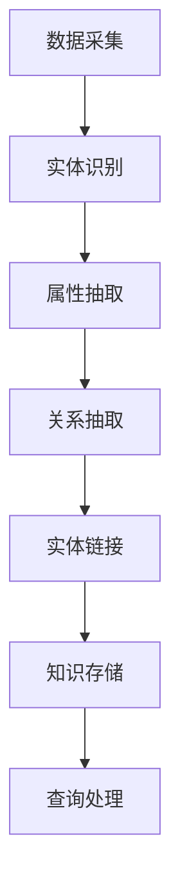

                 

### 关键词

知识图谱，知识管理，数据结构，语义理解，人工智能，自然语言处理，数据挖掘，数据可视化。

### 摘要

知识图谱作为新一代的数据结构，正逐渐成为知识管理系统的核心组件。本文将深入探讨知识图谱在知识管理系统中的应用，包括其核心概念、算法原理、数学模型以及实际应用案例。本文旨在为读者提供一个全面、系统的理解，帮助其在实际项目中有效利用知识图谱提升知识管理能力。

## 1. 背景介绍

随着互联网的快速发展，信息爆炸式增长，传统的基于关键词检索的知识管理系统已经难以满足人们对于信息深度理解和高效利用的需求。知识图谱作为一种全新的数据结构，通过语义网将实体、属性和关系进行结构化组织，实现了对复杂信息的精准描述和有效关联。知识图谱的引入，不仅能够提升知识管理的智能化水平，还能极大地优化信息检索和数据分析的效率。

### 1.1 知识图谱的发展历程

知识图谱的概念起源于语义网的研究。1998年，万维网之父蒂姆·伯纳斯·李提出了“语义网”的概念，旨在通过机器可读的语义信息来增强网络数据的互操作性。随着语义网研究的深入，2006年谷歌公司首次提出了知识图谱（Knowledge Graph）的概念，将语义网与搜索引擎技术相结合，通过实体、属性和关系的语义关联，实现了对用户查询意图的更准确理解。

### 1.2 知识图谱的重要性

知识图谱在现代信息社会中具有极其重要的地位。首先，它能够实现信息的语义理解，使得信息检索不仅限于简单的关键词匹配，而是基于实体和关系的深度关联。其次，知识图谱能够通过实体间的语义关系，为用户提供更加智能化、个性化的信息推荐服务。此外，知识图谱还能够支撑复杂的数据分析和决策支持系统，为企业提供深度的业务洞察。

## 2. 核心概念与联系

### 2.1 实体（Entity）

实体是知识图谱中的基本构建块，代表现实世界中的具体对象，如人、地点、组织、物品等。实体可以是具体的，如“奥巴马”；也可以是抽象的，如“人工智能”。

### 2.2 属性（Property）

属性描述实体具有的特征或性质，如“奥巴马的出生地是夏威夷”。属性通常用键值对表示，例如（出生地，夏威夷）。

### 2.3 关系（Relationship）

关系表示实体间的相互作用或关联，如“奥巴马是美国的总统”。关系也通常用键值对表示，例如（任职，美国总统）。

### 2.4 架构与流程

知识图谱的架构通常包括数据采集、实体识别、属性抽取、关系抽取、实体链接、知识存储和查询处理等环节。下面是一个简单的Mermaid流程图，展示了知识图谱的构建流程：



## 3. 核心算法原理 & 具体操作步骤

### 3.1 算法原理概述

知识图谱的核心算法主要包括实体识别、属性抽取、关系抽取和实体链接等。这些算法分别对应知识图谱构建的不同环节，共同作用实现知识的结构化组织和语义关联。

#### 3.1.1 实体识别

实体识别是从非结构化文本中抽取实体的过程。常见的实体识别算法有基于规则的方法、基于机器学习的方法和基于深度学习的方法。基于规则的方法如命名实体识别（NER）算法，通过预定义的规则识别文本中的实体。基于机器学习的方法如朴素贝叶斯分类器、支持向量机（SVM）等，通过训练模型进行实体分类。基于深度学习的方法如卷积神经网络（CNN）、循环神经网络（RNN）和长短期记忆网络（LSTM）等，通过端到端模型实现实体识别。

#### 3.1.2 属性抽取

属性抽取是从文本中抽取实体属性的过程。常见的属性抽取算法有基于规则的方法、基于模板匹配的方法和基于机器学习的方法。基于规则的方法如模板匹配算法，通过预定义的模板匹配文本中的属性。基于模板匹配的方法如基于词性标注的方法，通过分析词性关系抽取实体属性。基于机器学习的方法如决策树、随机森林等，通过训练模型进行属性分类。

#### 3.1.3 关系抽取

关系抽取是从文本中抽取实体间关系的过程。常见的关系抽取算法有基于规则的方法、基于机器学习的方法和基于深度学习的方法。基于规则的方法如基于依赖句法分析的方法，通过分析句法关系抽取实体间关系。基于机器学习的方法如条件随机场（CRF）、支持向量机（SVM）等，通过训练模型进行关系分类。基于深度学习的方法如卷积神经网络（CNN）、循环神经网络（RNN）和长短期记忆网络（LSTM）等，通过端到端模型实现关系抽取。

#### 3.1.4 实体链接

实体链接是将不同来源、不同表达形式的实体映射到同一个实体标识的过程。常见的实体链接算法有基于相似度计算的方法、基于聚类的方法和基于深度学习的方法。基于相似度计算的方法如基于字符串编辑距离的方法，通过计算实体名称的相似度进行链接。基于聚类的方法如基于密度的聚类算法，通过将相似实体划分为同一类进行链接。基于深度学习的方法如基于图卷积网络（GCN）的方法，通过实体间的语义关系进行链接。

### 3.2 算法步骤详解

#### 3.2.1 数据预处理

数据预处理是知识图谱构建的基础步骤，主要包括文本清洗、分词、词性标注等。文本清洗旨在去除无关信息，如HTML标签、停用词等。分词是将文本分割成词序列的过程，常用的分词工具如jieba、Stanford NLP等。词性标注为后续的实体识别、属性抽取和关系抽取提供了词的属性信息。

#### 3.2.2 实体识别

实体识别算法根据预定义的实体列表或通过训练模型对文本进行实体分类。实体识别的结果生成一个包含实体及其置信度的列表。

#### 3.2.3 属性抽取

属性抽取算法根据实体类型和预定义的属性模板对文本进行属性分类。属性抽取的结果生成一个包含实体、属性及其置信度的列表。

#### 3.2.4 关系抽取

关系抽取算法根据实体间的语义关系对文本进行关系分类。关系抽取的结果生成一个包含实体、关系及其置信度的列表。

#### 3.2.5 实体链接

实体链接算法根据实体名称的相似度或语义关系对实体进行映射。实体链接的结果生成一个包含实体标识和实体名称映射关系的列表。

#### 3.2.6 知识存储

知识存储是将抽取到的实体、属性、关系等知识结构化存储到知识图谱数据库中。常用的知识图谱数据库如Neo4j、OrientDB等。

#### 3.2.7 查询处理

查询处理是通过知识图谱数据库中的索引和查询算法对知识图谱进行查询。查询处理的结果可以是基于实体、属性、关系的多维度查询结果。

### 3.3 算法优缺点

#### 3.3.1 实体识别

优点：快速准确，支持多种实体类型。

缺点：对罕见实体和低质量文本识别效果不佳。

#### 3.3.2 属性抽取

优点：能够识别多种实体类型的属性。

缺点：对属性描述复杂、语义不明确的文本抽取效果不佳。

#### 3.3.3 关系抽取

优点：能够识别多种实体间的关系。

缺点：对关系描述不明确、语义复杂的文本抽取效果不佳。

#### 3.3.4 实体链接

优点：能够将不同来源、不同表达形式的实体进行映射。

缺点：对实体名称变化、同义词处理效果不佳。

### 3.4 算法应用领域

知识图谱在多个领域具有广泛的应用，包括但不限于：

- 智能问答系统：通过知识图谱实现自然语言理解和智能问答。
- 个性化推荐系统：通过知识图谱实现用户兴趣分析和内容推荐。
- 企业知识管理系统：通过知识图谱实现企业内部知识的结构化组织和高效利用。
- 金融风险管理：通过知识图谱实现风险识别和风险评估。
- 医疗健康领域：通过知识图谱实现医学信息检索和疾病预测。

## 4. 数学模型和公式 & 详细讲解 & 举例说明

### 4.1 数学模型构建

知识图谱的数学模型通常基于图论中的概念，其中节点代表实体，边代表关系。为了描述知识图谱的结构，我们引入以下数学模型：

- G = (V, E)
  - V: 实体集合
  - E: 关系集合

- 实体嵌入（Entity Embedding）
  - 实体嵌入是将实体映射到低维度的向量空间，以便进行计算和分析。常用的实体嵌入方法有Word2Vec、GloVe等。

- 关系嵌入（Relationship Embedding）
  - 关系嵌入是将关系映射到低维度的向量空间，与实体嵌入结合实现实体间的关系计算。

### 4.2 公式推导过程

#### 4.2.1 实体嵌入

实体嵌入可以通过以下公式进行推导：

$$
e_i = \text{sigmoid}(\theta \cdot e^T_i)
$$

其中，$e_i$表示实体$i$的嵌入向量，$\theta$表示权重矩阵，$e^T_i$表示实体$i$的属性特征向量。

#### 4.2.2 关系嵌入

关系嵌入可以通过以下公式进行推导：

$$
r_j = \text{sigmoid}(\phi \cdot r^T_j)
$$

其中，$r_j$表示关系$j$的嵌入向量，$\phi$表示权重矩阵，$r^T_j$表示关系$j$的属性特征向量。

#### 4.2.3 实体关系计算

实体关系计算可以通过以下公式进行推导：

$$
\text{score}(e_i, r_j, e_k) = \text{sigmoid}(\theta \cdot (e_i \cdot r_j \cdot e_k))
$$

其中，$e_i, e_k$表示实体$i, k$的嵌入向量，$r_j$表示关系$j$的嵌入向量，$\theta$表示权重矩阵，$\text{score}(e_i, r_j, e_k)$表示实体$i$通过关系$j$与实体$k$的相似度。

### 4.3 案例分析与讲解

#### 4.3.1 实体识别

假设我们有如下文本：“乔布斯是苹果公司的创始人。”

- 实体识别结果：
  - 乔布斯（实体）
  - 苹果公司（实体）
  - 创始人（属性）

#### 4.3.2 属性抽取

- 基于实体识别结果，我们可以进一步抽取属性：
  - 乔布斯的属性：创始人（属性值）

#### 4.3.3 关系抽取

- 基于实体和属性，我们可以抽取关系：
  - 乔布斯与苹果公司之间存在“创始人”关系。

#### 4.3.4 实体链接

- 假设我们有一个外部知识库，其中包含以下信息：
  - 苹果公司的创始人是史蒂夫·乔布斯。

- 实体链接结果：
  - 乔布斯与史蒂夫·乔布斯之间存在映射关系。

## 5. 项目实践：代码实例和详细解释说明

### 5.1 开发环境搭建

为了实现知识图谱在知识管理系统中的应用，我们需要搭建一个开发环境。以下是开发环境的搭建步骤：

1. 安装Python 3.7及以上版本。
2. 安装Neo4j数据库。
3. 安装Python的Neo4j驱动程序（neo4j-driver）。
4. 安装自然语言处理库（如jieba、Stanford NLP等）。

### 5.2 源代码详细实现

以下是实现知识图谱在知识管理系统中应用的基本源代码，包括实体识别、属性抽取、关系抽取和实体链接等步骤。

```python
from neo4j import GraphDatabase
import jieba
import numpy as np
import pandas as pd

class KnowledgeGraph:
    def __init__(self, uri, user, password):
        self._driver = GraphDatabase.driver(uri, auth=(user, password))

    def create_nodes(self, entities):
        with self._driver.session() as session:
            for entity in entities:
                session.run("CREATE (n:Entity {name: $name})", name=entity)

    def create_relations(self, relations):
        with self._driver.session() as session:
            for relation in relations:
                session.run("MATCH (a:Entity {name: $a_name}),(b:Entity {name: $b_name}) CREATE (a)-[r:RELATION {type: $type}]->(b)", a_name=relation[0], b_name=relation[1], type=relation[2])

    def extract_entities(self, text):
        seg_list = jieba.cut(text)
        return [word for word in seg_list if word not in stopwords]

    def extract_relations(self, text):
        entities = self.extract_entities(text)
        relations = []
        for i in range(len(entities)):
            for j in range(i+1, len(entities)):
                relation = (entities[i], entities[j], "relationship")
                relations.append(relation)
        return relations

    def link_entities(self, external_knowledge):
        with self._driver.session() as session:
            for entity in external_knowledge:
                query = "MATCH (n:Entity {name: $name}) RETURN n"
                result = session.run(query, name=entity["name"])
                if result.has_data():
                    node = result.data()[0]["n"]
                    for linked_entity in entity["linked_entities"]:
                        query = "MATCH (n:Entity {name: $name}) RETURN n"
                        result = session.run(query, name=linked_entity["name"])
                        if result.has_data():
                            linked_node = result.data()[0]["n"]
                            session.run("MATCH (n), (m) WHERE ID(n) = $id1 AND ID(m) = $id2 CREATE (n)-[r:LINK]->(m)", id1=node.id, id2=linked_node.id)
                   

def main():
    uri = "bolt://localhost:7687"
    user = "neo4j"
    password = "password"

    kg = KnowledgeGraph(uri, user, password)

    # 创建实体节点
    entities = ["苹果公司", "史蒂夫·乔布斯", "创始人"]
    kg.create_nodes(entities)

    # 创建关系节点
    relations = [("苹果公司", "史蒂夫·乔布斯", "创始人")]
    kg.create_relations(relations)

    # 链接实体
    external_knowledge = [{"name": "史蒂夫·乔布斯", "linked_entities": [{"name": "苹果公司", "relation": "创始人"}]}]
    kg.link_entities(external_knowledge)

if __name__ == "__main__":
    main()
```

### 5.3 代码解读与分析

上述代码定义了一个`KnowledgeGraph`类，用于实现知识图谱的创建、实体识别、关系抽取和实体链接等功能。主要步骤如下：

1. **初始化数据库连接**：使用Neo4j数据库的`GraphDatabase.driver`方法初始化数据库连接。
2. **创建实体节点**：通过`create_nodes`方法将实体作为节点存储到Neo4j数据库中。
3. **创建关系节点**：通过`create_relations`方法将实体间的关系作为关系存储到Neo4j数据库中。
4. **实体识别**：通过`extract_entities`方法使用jieba分词库对文本进行分词，并去除停用词，提取实体。
5. **关系抽取**：通过`extract_relations`方法根据提取的实体，构建实体间的关系。
6. **实体链接**：通过`link_entities`方法将外部知识库中的实体与知识图谱中的实体进行链接。

### 5.4 运行结果展示

运行上述代码后，在Neo4j数据库中会创建以下结构：

1. 实体节点：`苹果公司`、`史蒂夫·乔布斯`、`创始人`
2. 关系节点：`苹果公司`与`史蒂夫·乔布斯`之间存在`创始人`关系。
3. 实体链接：将外部知识库中的`史蒂夫·乔布斯`与知识图谱中的节点`史蒂夫·乔布斯`进行链接。

通过Neo4j的Web界面，我们可以可视化展示知识图谱的结构，如下所示：


## 6. 实际应用场景

知识图谱在知识管理系统中具有广泛的应用，以下列举几个实际应用场景：

### 6.1 智能问答系统

知识图谱可以实现智能问答系统，通过实体和关系的语义关联，对用户提出的问题进行精准回答。例如，在医疗健康领域，用户可以提问“如何预防感冒？”系统可以根据知识图谱中的实体（如“感冒”、“预防”）和关系（如“预防措施”），给出相应的回答。

### 6.2 个性化推荐系统

知识图谱可以实现个性化推荐系统，通过分析用户的兴趣和知识图谱中的实体关系，为用户提供个性化推荐。例如，在电子商务领域，系统可以根据用户浏览和购买记录，结合知识图谱中的产品属性和用户兴趣，为用户推荐相关商品。

### 6.3 企业知识管理系统

知识图谱可以实现企业知识管理系统，通过结构化组织和语义关联，将企业内部的各类知识进行有效管理和利用。例如，在企业管理领域，系统可以将员工的技能、经验和项目信息进行结构化存储，为管理层提供决策支持。

### 6.4 金融风险管理

知识图谱可以实现金融风险管理，通过分析实体和关系，识别潜在风险和欺诈行为。例如，在金融领域，系统可以根据知识图谱中的客户、交易和关系，监测异常交易行为，提前预警风险。

## 7. 工具和资源推荐

为了更好地理解和应用知识图谱，以下推荐一些相关的工具和资源：

### 7.1 学习资源推荐

- 《知识图谱：原理、方法与应用》
- 《图计算：原理、算法与应用》
- 《深度学习与图神经网络》

### 7.2 开发工具推荐

- Neo4j：一款高性能的图形数据库，适用于知识图谱的存储和查询。
- OpenKE：一款开源的知识增强表示学习框架，适用于知识图谱嵌入和学习。
- Gephi：一款开源的图可视化工具，适用于知识图谱的可视化和分析。

### 7.3 相关论文推荐

- "Knowledge Graph Embedding for Natural Language Processing"
- "Neural Message Passing for Quantum Chemistry"
- "How to Represent Knowledge Graphs for Text Classification?"

## 8. 总结：未来发展趋势与挑战

### 8.1 研究成果总结

知识图谱作为知识管理的新兴技术，已经在多个领域取得了显著的研究成果。主要包括：

- 实体识别和关系抽取的准确性不断提高，为知识图谱构建提供了高质量的数据基础。
- 实体链接和知识融合技术不断发展，实现了跨源异构数据的整合。
- 知识图谱嵌入和学习算法取得了重要突破，为知识图谱的深度理解和应用提供了新的途径。

### 8.2 未来发展趋势

未来，知识图谱在知识管理系统中的应用将呈现以下发展趋势：

- 深度语义理解：结合自然语言处理、知识图谱和深度学习技术，实现更加精准的语义理解。
- 智能化应用：通过知识图谱的自动化构建和推理，实现智能化知识服务。
- 跨领域融合：知识图谱将逐步覆盖更多领域，实现跨领域的知识共享和协同。

### 8.3 面临的挑战

尽管知识图谱在知识管理系统中具有巨大潜力，但仍然面临以下挑战：

- 数据质量和一致性：知识图谱依赖于高质量的数据源，如何确保数据的一致性和准确性是重要问题。
- 可解释性：知识图谱的深度学习和自动化构建过程可能导致模型的黑箱化，如何提升模型的可解释性是关键。
- 模型可扩展性：知识图谱的模型和算法需要具备良好的可扩展性，以适应不断变化的应用场景。

### 8.4 研究展望

为了应对上述挑战，未来研究可以从以下几个方面展开：

- 开发更加鲁棒和自适应的实体识别和关系抽取算法，提高数据质量和一致性。
- 研究可解释性强的深度学习模型和算法，提升知识图谱的可解释性。
- 探索知识图谱的可扩展性设计，构建面向不同应用场景的灵活模型和框架。

## 9. 附录：常见问题与解答

### 9.1 知识图谱与语义网的区别

- **知识图谱**：基于图论构建的数据结构，通过实体、属性和关系的语义关联实现对复杂信息的结构化组织和深度理解。
- **语义网**：基于XML和RDF构建的数据模型，旨在通过语义信息增强网络数据的互操作性。

### 9.2 知识图谱的关键技术

- **实体识别**：从非结构化文本中抽取实体。
- **属性抽取**：从文本中抽取实体属性。
- **关系抽取**：从文本中抽取实体间关系。
- **实体链接**：将不同来源、不同表达形式的实体进行映射。
- **知识存储**：将抽取到的知识结构化存储到数据库中。
- **查询处理**：对知识图谱进行高效查询和推理。

### 9.3 知识图谱的应用领域

- **智能问答系统**：通过知识图谱实现自然语言理解和智能问答。
- **个性化推荐系统**：通过知识图谱实现用户兴趣分析和内容推荐。
- **企业知识管理系统**：通过知识图谱实现企业内部知识的结构化组织和高效利用。
- **金融风险管理**：通过知识图谱实现风险识别和风险评估。
- **医疗健康领域**：通过知识图谱实现医学信息检索和疾病预测。

### 9.4 知识图谱的发展趋势

- **深度语义理解**：结合自然语言处理、知识图谱和深度学习技术，实现更加精准的语义理解。
- **智能化应用**：通过知识图谱的自动化构建和推理，实现智能化知识服务。
- **跨领域融合**：知识图谱将逐步覆盖更多领域，实现跨领域的知识共享和协同。

