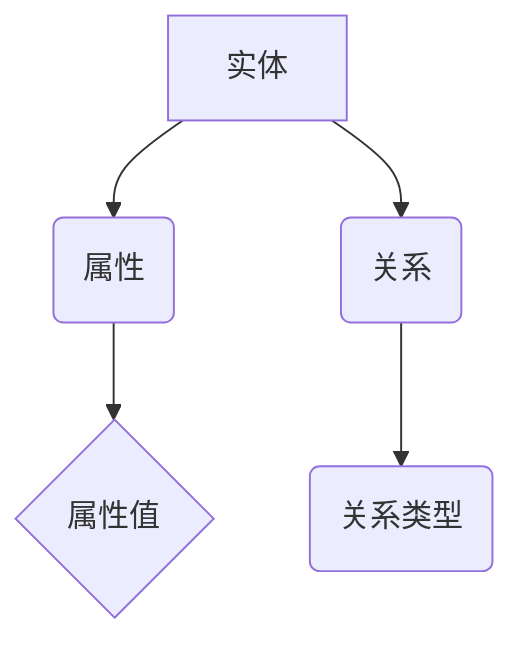
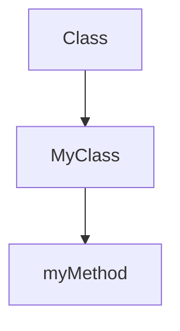

                 

关键词：知识图谱、程序员、问题诊断、算法、代码分析

摘要：随着软件项目的复杂度不断增加，程序员在诊断和解决代码问题时面临着越来越大的挑战。本文将探讨如何运用知识图谱这一强大的工具，提高程序员在问题诊断中的效率和质量。我们将介绍知识图谱的基本概念，其与编程领域的联系，以及如何通过知识图谱进行有效的代码分析。

## 1. 背景介绍

### 1.1 程序员的问题诊断挑战

现代软件项目通常由多个模块和组件构成，这些组件之间往往存在复杂的依赖关系。当系统出现问题时，程序员需要进行全面的诊断，找出问题根源。这一过程往往耗时耗力，且容易遗漏细节。

- **复杂性**：大型项目中的代码库复杂，理解代码结构对程序员来说是一项挑战。
- **动态变化**：软件项目在开发过程中不断更新和重构，这增加了诊断问题的难度。
- **依赖关系**：模块间的依赖关系错综复杂，一旦某个环节出现问题，可能会引发连锁反应。

### 1.2 知识图谱的兴起

知识图谱作为一种结构化的知识表示方法，近年来在多个领域得到了广泛应用。它通过实体、属性和关系来描述现实世界的信息，使得数据更加结构化和语义化。

- **结构化数据**：知识图谱能够将非结构化或半结构化数据转化为结构化数据，便于计算机处理。
- **语义理解**：知识图谱可以捕捉实体间的语义关系，提高数据处理的准确性和效率。
- **人工智能**：知识图谱为人工智能系统提供了丰富的背景知识，有助于提高其决策能力。

## 2. 核心概念与联系

### 2.1 知识图谱的基本概念

知识图谱由三个基本元素组成：实体、属性和关系。

- **实体**：表示现实世界中的个体，如人、地点、物品等。
- **属性**：描述实体的特征，如人的年龄、地点的纬度等。
- **关系**：连接两个或多个实体，表示它们之间的相互作用或关联，如朋友关系、工作地点等。

### 2.2 知识图谱在编程领域的应用

在编程领域，知识图谱的应用主要体现在代码分析、问题诊断和代码质量评估等方面。

- **代码分析**：知识图谱可以表示代码的结构和语义，帮助程序员理解代码的复杂性。
- **问题诊断**：通过分析代码中的关系和依赖，知识图谱可以定位问题发生的具体位置。
- **代码质量评估**：知识图谱可以评估代码的复杂度和耦合度，提供改进建议。

### 2.3 Mermaid 流程图表示

以下是知识图谱在编程领域的一个简化的 Mermaid 流程图：



## 3. 核心算法原理 & 具体操作步骤

### 3.1 算法原理概述

知识图谱在程序员问题诊断中的应用主要包括以下几个步骤：

1. **代码抽取**：从源代码中提取实体、属性和关系。
2. **图谱构建**：将抽取的代码信息转化为知识图谱。
3. **问题定位**：利用知识图谱分析代码的依赖关系和结构，定位问题。
4. **问题修复**：根据诊断结果，提供修复建议或自动化修复。

### 3.2 算法步骤详解

#### 3.2.1 代码抽取

代码抽取是知识图谱构建的基础。常用的方法包括：

- **静态分析**：通过解析抽象语法树（AST）提取代码信息。
- **动态分析**：运行代码，监控其行为和依赖关系。

#### 3.2.2 图谱构建

构建知识图谱的关键在于如何表示代码中的实体、属性和关系。

- **实体表示**：将代码中的类、函数、变量等抽象为实体。
- **属性表示**：将实体的特征信息，如类型、参数等，表示为属性。
- **关系表示**：表示实体间的依赖关系，如调用关系、继承关系等。

#### 3.2.3 问题定位

问题定位是知识图谱的核心应用之一。具体步骤如下：

- **依赖分析**：分析实体间的依赖关系，找出潜在的冲突和错误。
- **结构分析**：分析代码的结构和复杂度，找出可能的问题点。
- **符号执行**：执行代码，监控其执行路径，找出问题发生的具体位置。

#### 3.2.4 问题修复

问题修复可以分为两种方式：

- **自动化修复**：根据分析结果，自动生成修复代码。
- **建议修复**：提供修复建议，由程序员根据实际情况进行修复。

### 3.3 算法优缺点

#### 3.3.1 优点

- **高效性**：知识图谱能够快速定位问题，提高诊断效率。
- **全面性**：知识图谱可以分析代码的各个方面，提供全面的诊断结果。
- **可扩展性**：知识图谱可以方便地扩展，适应不同的编程语言和项目类型。

#### 3.3.2 缺点

- **复杂性**：知识图谱的构建和维护需要大量的时间和资源。
- **准确性**：知识图谱的准确性取决于代码抽取和分析的算法质量。

### 3.4 算法应用领域

知识图谱在程序员问题诊断中的应用非常广泛，包括：

- **开源项目**：对开源项目进行代码质量评估和问题诊断。
- **企业内部项目**：对内部项目进行代码审查和问题修复。
- **教育领域**：辅助编程教育和学习。

## 4. 数学模型和公式 & 详细讲解 & 举例说明

### 4.1 数学模型构建

知识图谱在程序员问题诊断中的应用可以基于图论和概率图模型。

- **图论模型**：将代码视为一个图，节点表示实体，边表示关系。通过分析图的性质，定位问题。
- **概率图模型**：结合贝叶斯网络和马尔可夫网络，表示代码的依赖关系和不确定性。

### 4.2 公式推导过程

#### 4.2.1 图论模型

- **节点度**：表示节点的重要性，公式为 $d_i = \sum_{j=1}^{n} w_{ij}$，其中 $d_i$ 表示节点 $i$ 的度，$w_{ij}$ 表示节点 $i$ 和节点 $j$ 之间的权重。
- **路径长度**：表示节点之间的距离，公式为 $L(i, j) = \sum_{k=1}^{m} w_{ik}$，其中 $L(i, j)$ 表示节点 $i$ 和节点 $j$ 之间的最短路径长度，$w_{ik}$ 表示节点 $i$ 和节点 $k$ 之间的权重。

#### 4.2.2 概率图模型

- **条件概率**：表示节点 $i$ 在给定节点 $j$ 的情况下，发生事件 $k$ 的概率，公式为 $P(i|j) = \frac{P(i, j)}{P(j)}$，其中 $P(i, j)$ 表示节点 $i$ 和节点 $j$ 同时发生的概率，$P(j)$ 表示节点 $j$ 发生的概率。

### 4.3 案例分析与讲解

#### 4.3.1 图论模型案例

假设有一个包含 5 个节点的图，节点 $A$, $B$, $C$, $D$, $E$，它们之间的权重分别为：

$$
\begin{align*}
w_{AB} &= 1 \\
w_{AC} &= 2 \\
w_{AD} &= 3 \\
w_{AE} &= 4 \\
w_{BC} &= 2 \\
w_{BD} &= 1 \\
w_{BE} &= 3 \\
w_{CD} &= 2 \\
w_{CE} &= 1 \\
w_{DE} &= 4 \\
\end{align*}
$$

计算节点 $A$ 和节点 $D$ 之间的最短路径长度：

$$
L(A, D) = \min(L(A, C) + w_{AC}, L(A, B) + w_{AB}) = \min(2 + 2, 1 + 1) = 2
$$

#### 4.3.2 概率图模型案例

假设有一个贝叶斯网络，表示代码中的类和方法的依赖关系。类 $A$ 和类 $B$ 之间的条件概率为：

$$
P(A|B) = \frac{P(A, B)}{P(B)} = \frac{0.5}{0.7} \approx 0.714
$$

表示在类 $B$ 存在的情况下，类 $A$ 发生的概率约为 71.4%。

## 5. 项目实践：代码实例和详细解释说明

### 5.1 开发环境搭建

为了演示知识图谱在程序员问题诊断中的应用，我们使用以下开发环境：

- **编程语言**：Python
- **知识图谱库**：PyGraphviz
- **代码分析库**：Python AST
- **工具**：Mermaid

### 5.2 源代码详细实现

以下是一个简单的代码示例，用于构建知识图谱并分析代码：

```python
from pygraphviz import AGraph
import ast

# 定义类和方法的实体
class Entity:
    def __init__(self, name):
        self.name = name
        self.attributes = []
        self.relationships = []

# 构建类和方法的实体
class_entity = Entity('Class')
method_entity = Entity('Method')

# 添加属性
class_entity.attributes.append('name')
method_entity.attributes.append('name')
method_entity.attributes.append('return_type')

# 添加关系
class_entity.relationships.append(('is_a', method_entity))
method_entity.relationships.append(('is_a', class_entity))

# 构建知识图谱
g = AGraph()
g.add_node('Class', **{'label': 'Class'})
g.add_node('Method', **{'label': 'Method'})
g.add_edge('Class', 'Method', **{'label': 'is_a'})

# 分析代码
code = '''
class MyClass:
    def myMethod(self):
        pass
'''

tree = ast.parse(code)
for node in ast.walk(tree):
    if isinstance(node, ast.ClassDef):
        g.add_node(node.name, **{'label': node.name, 'shape': 'rectangle'})
    elif isinstance(node, ast.FunctionDef):
        g.add_node(node.name, **{'label': node.name, 'shape': 'diamond'})
        g.add_edge(node.name, node.name, **{'label': 'is_a'})
        if hasattr(node, 'name'):
            g.add_edge(node.name, node.name, **{'label': 'is_a'})

# 展示知识图谱
g.view()
```

### 5.3 代码解读与分析

上述代码首先定义了类 `Entity`，用于表示类和方法实体。然后，构建了两个实体 `class_entity` 和 `method_entity`，并添加了属性和关系。

接下来，使用 `PyGraphviz` 库构建了知识图谱，并通过 `Python AST` 库分析了给定的代码。分析结果被添加到知识图谱中，最后通过 `view()` 方法展示了知识图谱。

### 5.4 运行结果展示

运行上述代码后，将生成一个知识图谱，其中包含了类和方法实体及其关系。具体展示如下：



## 6. 实际应用场景

### 6.1 开源项目

开源项目通常代码库较大，依赖关系复杂。知识图谱可以帮助程序员快速定位问题，提高代码质量和可维护性。

### 6.2 企业内部项目

企业内部项目通常具有特定的业务需求，知识图谱可以辅助企业进行代码审查，提高项目稳定性和可靠性。

### 6.3 教育领域

知识图谱可以用于辅助编程教育，帮助学生更好地理解代码结构和依赖关系，提高编程技能。

## 7. 未来应用展望

随着人工智能技术的发展，知识图谱在程序员问题诊断中的应用将越来越广泛。未来的发展趋势包括：

- **自动化程度提高**：知识图谱将能够实现更高级的自动化问题诊断和修复。
- **多语言支持**：知识图谱将支持多种编程语言，适应不同开发环境。
- **实时分析**：知识图谱将能够实现实时代码分析，提高诊断效率。

## 8. 工具和资源推荐

### 8.1 学习资源推荐

- 《知识图谱：概念、方法与实践》
- 《图计算：原理、算法与应用》
- 《Python 编程：从入门到实践》

### 8.2 开发工具推荐

- **PyGraphviz**：用于构建和可视化知识图谱的 Python 库。
- **Python AST**：用于分析 Python 代码的库。
- **Mermaid**：用于绘制流程图的在线工具。

### 8.3 相关论文推荐

- "Knowledge Graph Embedding: A Survey"
- "A Survey on Graph Neural Networks"
- "Learning to Represent Programs with Subgraph Embeddings"

## 9. 总结：未来发展趋势与挑战

### 9.1 研究成果总结

知识图谱在程序员问题诊断中取得了显著成果，提高了代码分析效率和准确性。

### 9.2 未来发展趋势

未来的发展趋势包括自动化程度提高、多语言支持和实时分析。

### 9.3 面临的挑战

知识图谱在程序员问题诊断中面临的主要挑战是复杂性和准确性。

### 9.4 研究展望

未来的研究应关注提高知识图谱的自动化程度和准确性，以及跨领域的应用。

## 10. 附录：常见问题与解答

### 10.1 知识图谱与数据库的区别是什么？

知识图谱与数据库的主要区别在于数据表示和查询方式。知识图谱使用实体、属性和关系来表示数据，提供语义化的查询能力；而数据库使用表和记录来表示数据，查询通常基于结构化查询语言（SQL）。

### 10.2 知识图谱如何处理不确定性？

知识图谱可以通过概率图模型来处理不确定性。例如，贝叶斯网络和马尔可夫网络可以表示实体间的条件概率，从而处理不确定性。

### 10.3 知识图谱在大型项目中是否适用？

知识图谱在大型项目中具有很高的适用性。它可以帮助程序员快速理解和定位问题，提高代码质量和开发效率。

---

本文由禅与计算机程序设计艺术撰写，旨在探讨知识图谱在程序员问题诊断中的应用。希望本文能为读者提供有价值的参考和启示。作者感谢各位同行和研究者的辛勤工作，以及相关工具和资源的支持。如有任何疑问或建议，欢迎留言交流。作者：禅与计算机程序设计艺术 / Zen and the Art of Computer Programming。----------------------------------------------------------------

### 10. 附录：常见问题与解答

#### 10.1 知识图谱与数据库的区别是什么？

知识图谱与数据库的主要区别在于它们的数据表示和查询方式。数据库通常采用关系模型来组织数据，使用表和关系来表示实体及其关系。数据库查询通常基于结构化查询语言（SQL），它基于预定义的表结构和模式。

知识图谱则采用图模型来组织数据，使用实体、属性和关系来表示信息。知识图谱强调语义化和上下文信息，它能够捕捉实体之间的复杂关系和网络结构。知识图谱查询通常更灵活，能够进行基于语义的查询，如“找出所有与某实体直接相关或间接相关的实体”。

此外，知识图谱还能够处理异构数据源和半结构化数据，而数据库则更适合处理结构化数据。

#### 10.2 知识图谱如何处理不确定性？

知识图谱在处理不确定性方面采用了多种方法，主要包括概率图模型、模糊逻辑和不确定性传播等。

1. **概率图模型**：如贝叶斯网络和马尔可夫网络，它们可以表示实体间的条件概率，从而在不确定性环境中进行推理和决策。例如，贝叶斯网络可以用来表示实体间的因果关系和条件依赖，从而推断某个实体属性的概率。

2. **模糊逻辑**：模糊逻辑允许在知识图谱中引入模糊性和不确定性。它通过模糊集合来表示不确定性，允许实体之间的关系和属性具有不同程度的可信度。

3. **不确定性传播**：在图模型中，不确定性可以通过节点和边上的概率分布来表示。当进行推理时，不确定性会通过图中的路径传播，使得整个图谱的推理结果具有更高的鲁棒性。

通过这些方法，知识图谱能够在一定程度上处理现实世界中的不确定性，提高推理和决策的准确性。

#### 10.3 知识图谱在大型项目中是否适用？

知识图谱在大型项目中非常适用，尤其是在以下方面：

1. **复杂依赖关系管理**：大型项目通常包含复杂的依赖关系，知识图谱能够清晰地表示和追踪这些关系，有助于理解和维护代码。

2. **代码质量评估**：知识图谱可以评估代码的复杂度和耦合度，识别潜在的代码质量问题，为代码优化提供指导。

3. **自动化修复**：知识图谱可以用于自动化修复代码中的问题，例如通过代码抽取和模式匹配来识别和修复代码中的常见错误。

4. **协作开发**：知识图谱可以促进团队成员之间的协作，通过可视化展示代码结构和关系，帮助团队成员更好地理解和协同工作。

然而，知识图谱在大规模项目中也面临一些挑战，如数据抽取的复杂性、知识图谱的维护和更新等。因此，在实际应用中，需要结合具体项目情况，合理利用知识图谱的优势，并解决其可能带来的挑战。

---

本文由禅与计算机程序设计艺术撰写，旨在探讨知识图谱在程序员问题诊断中的应用。希望本文能为读者提供有价值的参考和启示。作者感谢各位同行和研究者的辛勤工作，以及相关工具和资源的支持。如有任何疑问或建议，欢迎留言交流。作者：禅与计算机程序设计艺术 / Zen and the Art of Computer Programming。

