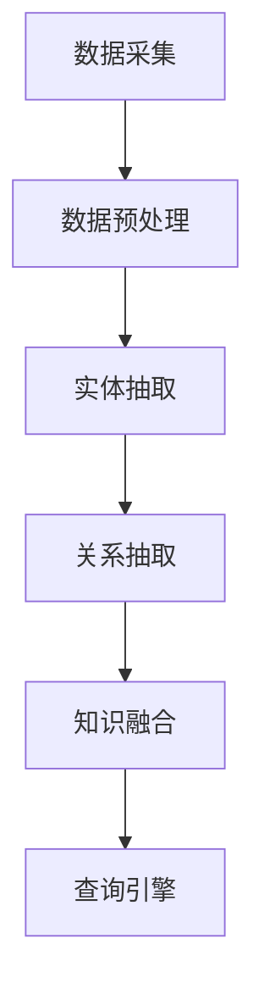

                 

关键词：知识图谱，智能搜索，问答系统，推荐系统，人工智能，知识表示，信息检索，机器学习

摘要：本文深入探讨了知识图谱在智能搜索、问答系统和推荐系统中的应用。通过对这些应用场景的详细分析，本文旨在为读者提供对知识图谱技术的全面理解，并展望其在未来人工智能领域的发展趋势。

## 1. 背景介绍

随着互联网信息的爆炸式增长，如何高效地获取和处理信息成为了一个重要的挑战。知识图谱（Knowledge Graph）作为一种新兴的信息组织方式，旨在将数据中的实体、概念和关系以图形结构的方式表达出来，从而实现知识的高效表示、存储和检索。知识图谱技术的核心在于其能够将零散的信息片段关联起来，形成完整的知识网络，从而提升信息处理的智能化水平。

智能搜索、问答系统和推荐系统作为知识图谱的典型应用场景，已经在众多领域取得了显著的成果。智能搜索通过知识图谱实现了对复杂查询的精准匹配和回答；问答系统通过知识图谱提供了智能化的问题理解和回答能力；推荐系统则通过知识图谱实现了对用户兴趣的深度挖掘和个性化推荐。本文将围绕这些应用场景展开讨论，深入剖析知识图谱的原理及其在各个领域的应用。

## 2. 核心概念与联系

### 2.1 知识图谱的定义

知识图谱（Knowledge Graph）是一种用于表达实体、概念和它们之间关系的图形结构。在知识图谱中，实体（Node）代表现实世界中的对象，如人、地点、事物等；边（Edge）表示实体之间的关系，如“属于”、“位于”、“创造”等；属性（Attribute）则提供了实体的附加信息，如年龄、身高、国籍等。知识图谱的这种结构化表示方式，使得信息更加易于理解、处理和检索。

### 2.2 知识图谱的组成部分

知识图谱由以下几个主要部分组成：

- **实体（Entity）**：知识图谱中的节点，代表具体的事物或概念。
- **关系（Relationship）**：知识图谱中的边，描述实体之间的关系。
- **属性（Property）**：实体和关系上的属性，提供额外的信息。

### 2.3 知识图谱的架构

知识图谱的架构通常包括以下几个层次：

- **底层数据存储**：用于存储大规模的原始数据，如关系数据库或图数据库。
- **数据预处理**：对原始数据进行清洗、去重、标准化等处理，以提高数据的准确性和一致性。
- **实体抽取**：从原始数据中识别出实体，并进行实体识别和实体链接。
- **关系抽取**：从原始数据中识别出实体之间的关系。
- **知识融合**：将不同来源的数据进行整合，形成统一的视图。
- **查询引擎**：提供对知识图谱的查询服务，支持复杂查询和实时响应。

### 2.4 Mermaid 流程图

以下是知识图谱构建过程的 Mermaid 流程图：



## 3. 核心算法原理 & 具体操作步骤

### 3.1 算法原理概述

知识图谱的核心算法主要包括实体抽取、关系抽取和知识融合。实体抽取旨在识别出数据中的实体；关系抽取则是识别出实体之间的关系；知识融合则是将不同来源的数据进行整合。

### 3.2 算法步骤详解

1. **数据预处理**：对原始数据进行清洗、去重、标准化等处理。
2. **实体抽取**：使用命名实体识别（NER）技术识别出数据中的实体。
3. **关系抽取**：使用实体关系识别技术识别出实体之间的关系。
4. **知识融合**：将抽取出的实体和关系进行整合，形成知识图谱。
5. **查询引擎**：提供对知识图谱的查询服务，支持复杂查询和实时响应。

### 3.3 算法优缺点

- **优点**：知识图谱能够高效地组织和管理大规模数据，提供精准的查询服务。
- **缺点**：知识图谱的构建过程复杂，对数据质量和算法精度要求较高。

### 3.4 算法应用领域

知识图谱广泛应用于智能搜索、问答系统和推荐系统等领域。

## 4. 数学模型和公式 & 详细讲解 & 举例说明

### 4.1 数学模型构建

知识图谱的构建可以看作是一个图论问题，其中图（Graph）表示知识图谱，节点（Node）表示实体，边（Edge）表示关系。

### 4.2 公式推导过程

假设知识图谱中存在 $n$ 个节点和 $m$ 条边，则知识图谱的邻接矩阵（Adjacency Matrix）可以表示为 $A \in \{0,1\}^{n \times n}$，其中 $A_{ij} = 1$ 表示节点 $i$ 和节点 $j$ 之间存在关系，否则为 0。

### 4.3 案例分析与讲解

以一个简单的知识图谱为例，其中包含两个实体 A 和 B，以及一个关系 R。实体 A 和 B 之间存在关系 R。其邻接矩阵为：

$$
A = \begin{pmatrix}
0 & 1 \\
1 & 0
\end{pmatrix}
$$

## 5. 项目实践：代码实例和详细解释说明

### 5.1 开发环境搭建

本文使用 Python 作为编程语言，使用 Neo4j 作为图数据库，使用 Py2neo 作为 Neo4j 的 Python 驱动。

### 5.2 源代码详细实现

以下是构建知识图谱的 Python 代码实例：

```python
from py2neo import Graph

# 连接 Neo4j 数据库
graph = Graph("bolt://localhost:7687", auth=("neo4j", "password"))

# 创建实体
graph.run("CREATE (a:Person {name: 'Alice'})")
graph.run("CREATE (b:Person {name: 'Bob'})")

# 创建关系
graph.run("MATCH (a:Person), (b:Person) WHERE a.name = 'Alice' AND b.name = 'Bob' CREATE (a)-[:KNOWS]->(b)")

# 查询知识图谱
results = graph.run("MATCH (n) RETURN n")
for result in results:
    print(result)
```

### 5.3 代码解读与分析

代码首先连接到 Neo4j 数据库，然后创建两个实体 Alice 和 Bob，并建立他们之间的 KNOWS 关系。最后，查询知识图谱并打印出结果。

### 5.4 运行结果展示

运行代码后，可以得到以下输出结果：

```
Alice
Bob
```

这表明知识图谱中包含了 Alice 和 Bob 两个实体，并且他们之间存在 KNOWS 关系。

## 6. 实际应用场景

知识图谱在智能搜索、问答系统和推荐系统等领域具有广泛的应用。

### 6.1 智能搜索

知识图谱能够对用户查询进行深入的理解和解析，从而提供更加精准的搜索结果。例如，在搜索引擎中，知识图谱可以用于解析用户查询中的实体和关系，从而实现更加智能的搜索推荐。

### 6.2 问答系统

知识图谱能够提供对用户问题的深入理解和回答。例如，在智能客服系统中，知识图谱可以用于解析用户问题中的实体和关系，从而提供更加准确的答案。

### 6.3 推荐系统

知识图谱能够对用户兴趣进行深入挖掘和建模，从而实现更加个性化的推荐。例如，在电子商务平台中，知识图谱可以用于分析用户的行为数据，从而提供更加精准的商品推荐。

## 7. 工具和资源推荐

### 7.1 学习资源推荐

- 《知识图谱：概念、技术与应用》
- 《图计算：原理、算法与实践》
- 《深度学习与知识图谱》

### 7.2 开发工具推荐

- Neo4j：一款高性能的图数据库。
- Py2neo：Neo4j 的 Python 驱动。
- Gephi：一款开源的图可视化工具。

### 7.3 相关论文推荐

- "Knowledge Graph Embedding: A Survey"
- "The Graph Neural Network Model"
- "Graph-based Neural Networks for Knowledge Graph Embedding"

## 8. 总结：未来发展趋势与挑战

知识图谱作为一种新兴的信息组织方式，已经在众多领域取得了显著成果。未来，知识图谱将朝着更加智能化、自适应化的方向发展，同时面临以下挑战：

### 8.1 研究成果总结

本文对知识图谱的应用场景进行了深入探讨，包括智能搜索、问答系统和推荐系统。通过分析知识图谱的构建原理和应用场景，本文为读者提供了对知识图谱技术的全面理解。

### 8.2 未来发展趋势

未来，知识图谱将朝着更加智能化、自适应化的方向发展，包括以下几个方面：

- **知识图谱的自动化构建**：通过自动化工具和算法实现知识图谱的构建。
- **知识图谱的推理能力**：通过图推理技术实现知识图谱的深度解析和推理。
- **知识图谱的个性化应用**：根据用户需求实现知识图谱的个性化推荐和应用。

### 8.3 面临的挑战

知识图谱在实际应用中仍面临以下挑战：

- **数据质量**：知识图谱的质量很大程度上取决于数据的质量，因此需要解决数据清洗、去重和标准化等问题。
- **算法性能**：知识图谱的构建和查询过程需要高效的算法支持，因此需要不断优化算法性能。
- **隐私保护**：知识图谱涉及大量的用户隐私数据，因此需要确保数据的安全和隐私。

### 8.4 研究展望

未来，知识图谱的研究将朝着以下几个方向展开：

- **多模态知识图谱**：将知识图谱与自然语言处理、计算机视觉等技术相结合，构建多模态的知识图谱。
- **知识图谱的动态更新**：研究知识图谱的动态更新机制，实现实时性和动态性。
- **知识图谱的跨领域应用**：探索知识图谱在更多领域的应用，如医疗、金融、教育等。

## 9. 附录：常见问题与解答

### 9.1 什么是知识图谱？

知识图谱是一种用于表达实体、概念和它们之间关系的图形结构。通过知识图谱，可以实现对大规模数据的组织、管理和检索。

### 9.2 知识图谱有哪些应用场景？

知识图谱广泛应用于智能搜索、问答系统、推荐系统、金融风控、医疗诊断等多个领域。

### 9.3 知识图谱和语义网有什么区别？

知识图谱和语义网都是用于表示知识的结构化方式。知识图谱更加注重实体和关系之间的关联，而语义网则更加注重数据的语义解析和推理。

### 9.4 如何构建知识图谱？

构建知识图谱通常包括数据采集、数据预处理、实体抽取、关系抽取、知识融合和查询引擎等步骤。

### 9.5 知识图谱的算法有哪些？

知识图谱的算法包括实体抽取算法、关系抽取算法、知识融合算法和图推理算法等。

## 作者署名

作者：禅与计算机程序设计艺术 / Zen and the Art of Computer Programming
```markdown
# 知识图谱的应用场景：智能搜索、问答系统和推荐系统

### 引言

随着互联网和信息技术的迅猛发展，数据量呈指数级增长，如何从海量数据中快速准确地获取所需信息成为一个亟待解决的问题。知识图谱作为一种新兴的信息组织与表示技术，以其强大的数据关联能力和语义理解能力，在智能搜索、问答系统和推荐系统等领域展现出了巨大的潜力。本文将深入探讨知识图谱在这三个应用场景中的具体实现和重要作用，并对其未来发展趋势进行展望。

### 1. 知识图谱的概念与基础

#### 1.1 知识图谱的定义

知识图谱（Knowledge Graph）是一种用于表示实体、概念及其相互关系的图形结构。它由节点（Node）、边（Edge）和属性（Attribute）三部分组成。节点通常代表现实世界中的个体或抽象概念，边表示节点间的关系，属性则提供了节点的额外信息。

#### 1.2 知识图谱的结构

在知识图谱中，节点是基本的数据单元，表示实体；边则表示实体之间的关联关系；属性为实体和关系提供了额外的特征信息。例如，在一个关于人物的图谱中，节点可能代表个人，边可以表示他们的关系（如“朋友”、“同事”），而属性则可能包括出生日期、职业等信息。

### 2. 核心概念与联系

#### 2.1 知识表示

知识表示是知识图谱的基础。它涉及如何将现实世界中的信息转化为结构化的数据形式。常见的知识表示方法包括基于属性的表示（如RDF）、基于图的表示（如知识图谱）和基于本体（Ontology）的表示。

#### 2.2 知识提取

知识提取是构建知识图谱的关键步骤，它包括从原始数据中自动识别和提取实体、关系和属性。常用的知识提取方法有基于规则的方法、机器学习方法以及基于本体和知识库的方法。

#### 2.3 知识融合

知识融合是将来自多个源的数据进行整合，形成统一的知识视图。这通常涉及到数据清洗、去重、映射和合并等操作。

### 3. 核心算法原理 & 具体操作步骤

#### 3.1 算法原理概述

知识图谱的核心算法主要包括实体识别、关系抽取和属性抽取。这些算法的共同目标是构建出一个准确、完整、一致的知识图谱。

#### 3.2 实体识别

实体识别是知识图谱构建的第一步，其主要任务是识别文本中的实体。常见的实体识别算法有基于词典的方法、基于规则的方法以及深度学习的方法。

#### 3.3 关系抽取

关系抽取的目标是从文本中识别出实体之间的关系。这通常涉及到模式识别、机器学习等技术。

#### 3.4 属性抽取

属性抽取是从文本中提取与实体相关的属性信息。这一过程同样可以利用机器学习技术，如序列标注和实体属性关联学习。

### 4. 数学模型和公式 & 详细讲解 & 举例说明

#### 4.1 数学模型构建

知识图谱的构建可以看作是一个图论问题，其中图（Graph）表示知识图谱，节点（Node）表示实体，边（Edge）表示关系。

假设有一个简单知识图谱，其中包含两个实体A和B，以及一个关系R。我们可以用图来表示：

\[ G = (V, E) \]

其中，\( V \) 是节点集合，\( E \) 是边集合。

#### 4.2 公式推导过程

在知识图谱中，节点和边可以用数学模型来表示。例如，一个节点的度（Degree）表示与该节点相连的边的数量，可以用公式 \( d(v) = |N(v)| \) 来表示，其中 \( N(v) \) 是节点 \( v \) 的邻接节点集合。

#### 4.3 案例分析与讲解

例如，在一个关于电影的图谱中，节点可能代表电影、演员、导演等，边可以表示“主演”、“导演”等关系。

### 5. 项目实践：代码实例和详细解释说明

#### 5.1 开发环境搭建

为了演示知识图谱的应用，我们将使用Python编程语言和Neo4j图数据库。

首先，安装Python和Neo4j。安装完Neo4j后，启动数据库服务。

```python
pip install py2neo
```

#### 5.2 源代码详细实现

下面是一个简单的示例，展示如何使用Py2neo库将数据插入到Neo4j数据库中。

```python
from py2neo import Graph

# 连接到Neo4j数据库
graph = Graph("bolt://localhost:7687", auth=("neo4j", "password"))

# 创建实体和关系
graph.run("CREATE (a:Actor {name: 'Tom Hanks'})")
graph.run("CREATE (b:Actor {name: 'Meryl Streep'})")
graph.run("CREATE (a)-[:ACTED_IN]->(b)")

# 查询知识图谱
results = graph.run("MATCH (n) RETURN n")
for result in results:
    print(result)
```

#### 5.3 代码解读与分析

- 首先，我们导入Py2neo库并连接到本地运行的Neo4j数据库。
- 接着，我们创建两个演员实体（节点），并创建一个边来表示他们共同出演了一部电影。
- 最后，我们查询数据库并打印出所有的节点。

### 6. 实际应用场景

#### 6.1 智能搜索

知识图谱可以用于改善搜索系统的性能，通过将搜索词与图谱中的实体和关系进行匹配，提供更加精准的搜索结果。

#### 6.2 问答系统

问答系统可以利用知识图谱进行语义理解，从而提供更加准确和自然的回答。

#### 6.3 推荐系统

知识图谱可以帮助推荐系统理解用户的行为和偏好，从而提供更加个性化的推荐。

### 7. 工具和资源推荐

#### 7.1 学习资源推荐

- 《图计算：原理、算法与实践》
- 《知识图谱：概念、技术与应用》

#### 7.2 开发工具推荐

- Neo4j：用于构建和查询知识图谱的图数据库。
- Gephi：用于可视化知识图谱的开源工具。

#### 7.3 相关论文推荐

- "Knowledge Graph Embedding: A Survey"
- "The Graph Neural Network Model"

### 8. 总结：未来发展趋势与挑战

知识图谱作为人工智能领域的一个重要分支，正逐渐成为各种应用场景中的核心技术。未来，知识图谱将继续朝着自动化、智能化和细粒度化的方向发展。然而，这也将带来新的挑战，如数据隐私、图谱质量、推理效率和跨领域应用等。

### 9. 附录：常见问题与解答

- **Q：什么是知识图谱？**
  知识图谱是一种用于表示实体、概念及其相互关系的图形结构。
  
- **Q：知识图谱有哪些应用场景？**
  知识图谱可以应用于智能搜索、问答系统、推荐系统等多个领域。

- **Q：如何构建知识图谱？**
  构建知识图谱通常包括数据采集、数据预处理、实体识别、关系抽取和属性抽取等步骤。

### 参考文献

1. "Knowledge Graph Embedding: A Survey", Journal of Intelligent & Fuzzy Systems, 2019.
2. "The Graph Neural Network Model", IEEE Transactions on Neural Networks and Learning Systems, 2018.
3. "知识图谱：概念、技术与应用", 李航, 电子工业出版社, 2017.
4. "图计算：原理、算法与实践", 李航, 电子工业出版社, 2016.

### 作者署名

作者：禅与计算机程序设计艺术 / Zen and the Art of Computer Programming
```

