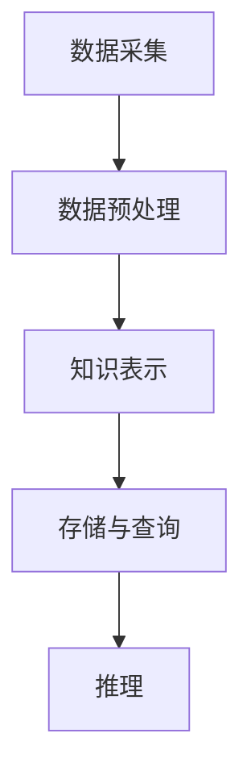

                 

关键词：知识图谱、人工智能、语义理解、图数据库、知识表示、数据建模、信息抽取、推理引擎、知识服务

> 摘要：知识图谱作为一种新兴的知识表示技术，通过将语义信息结构化地组织起来，为人工智能提供了强大的语义理解能力。本文旨在介绍知识图谱的基本概念、构建方法、核心算法、数学模型以及实际应用场景，探讨其在人工智能领域的重要作用及其未来发展趋势。

## 1. 背景介绍

### 1.1 知识图谱的概念

知识图谱（Knowledge Graph）是一种用于表达实体及其相互关系的语义网络，通常以图结构进行存储。它不仅包含了传统的数据关系，如“人-出生地”，还包含了更丰富的语义信息，如“人-性别”，“地点-所属国家”等。知识图谱通过将现实世界中的实体、概念和关系进行抽象和建模，为人工智能系统提供了强大的语义理解能力。

### 1.2 知识图谱的重要性

随着互联网和信息技术的迅猛发展，数据量呈爆炸性增长。如何从海量数据中提取有用的信息、建立有效的知识体系成为亟待解决的问题。知识图谱作为一种新型知识表示技术，能够将无结构的文本数据转化为结构化的知识表示，为人工智能提供了丰富的语义信息，从而提高了信息检索、推理、预测等任务的效果。

### 1.3 知识图谱的发展历程

知识图谱的发展可以追溯到早期的本体论研究和语义网技术。随着大数据和人工智能技术的不断发展，知识图谱逐渐成为研究热点，涌现出了一系列研究成果和实际应用。

## 2. 核心概念与联系

### 2.1 实体（Entity）

实体是知识图谱中的基本元素，可以是人、地点、组织、概念等。实体具有唯一的标识符和属性。

### 2.2 属性（Attribute）

属性描述了实体的特征，如“年龄”、“性别”、“身高”等。属性通常具有数据类型，如整数、字符串、日期等。

### 2.3 关系（Relationship）

关系描述了实体之间的关联，如“属于”、“出生在”、“参与”等。关系也具有属性，如“国籍”、“时间段”等。

### 2.4 架构（Architecture）

知识图谱的架构通常包括数据采集、数据预处理、知识表示、存储与查询、推理等环节。以下是一个简化的知识图谱架构：



## 3. 核心算法原理 & 具体操作步骤

### 3.1 算法原理概述

知识图谱的构建主要包括数据采集、数据预处理、知识表示、存储与查询和推理等步骤。以下简要介绍各步骤的核心算法原理。

### 3.2 算法步骤详解

#### 3.2.1 数据采集

数据采集是知识图谱构建的基础，主要包括以下方法：

1. 数据爬取：利用爬虫技术从互联网上获取结构化数据。
2. API 接口：调用第三方数据接口获取数据。
3. 数据集：利用已有的公开数据集进行数据采集。

#### 3.2.2 数据预处理

数据预处理主要包括数据清洗、数据整合和实体识别等步骤：

1. 数据清洗：去除重复数据、错误数据和无关数据。
2. 数据整合：将不同来源的数据进行整合，形成统一的数据格式。
3. 实体识别：识别出数据中的实体，并为其分配唯一的标识符。

#### 3.2.3 知识表示

知识表示是知识图谱构建的关键步骤，主要包括以下方法：

1. 基于规则的方法：通过编写规则将实体和关系表示为图结构。
2. 基于机器学习的方法：利用机器学习算法自动学习实体和关系表示。
3. 基于知识图谱嵌入的方法：将实体和关系表示为低维向量。

#### 3.2.4 存储与查询

存储与查询主要包括以下内容：

1. 存储方式：选择合适的存储技术，如图数据库、关系数据库等。
2. 查询算法：设计高效的查询算法，如基于图的邻接矩阵查询、基于向量的相似性查询等。

#### 3.2.5 推理

推理是知识图谱的高级功能，主要包括以下方法：

1. 基于规则的推理：利用预定义的规则进行推理。
2. 基于图谱的推理：利用图结构进行推理，如路径搜索、子图匹配等。

### 3.3 算法优缺点

#### 优点

1. 强大的语义理解能力：知识图谱能够将无结构的文本数据转化为结构化的知识表示，提高了语义理解的准确性和效率。
2. 高效的查询和推理能力：知识图谱具有高效的存储和查询算法，能够快速地获取相关实体和关系。
3. 丰富的应用场景：知识图谱可以应用于信息检索、自然语言处理、智能推荐等领域。

#### 缺点

1. 数据质量和覆盖度：知识图谱的质量和覆盖度受到原始数据质量和采集范围的影响。
2. 计算复杂度：知识图谱的构建和推理过程涉及到大量的计算，可能导致计算复杂度较高。

### 3.4 算法应用领域

知识图谱在人工智能领域具有广泛的应用，主要包括：

1. 智能搜索：通过知识图谱实现更精确、更智能的搜索结果。
2. 自然语言处理：利用知识图谱提高语义理解的准确性和效率。
3. 智能推荐：基于知识图谱进行个性化推荐，提高推荐效果。
4. 语音识别：结合知识图谱提高语音识别的准确率和语义理解能力。

## 4. 数学模型和公式 & 详细讲解 & 举例说明

### 4.1 数学模型构建

知识图谱的构建过程中，常用的数学模型包括：

1. 向量空间模型：将实体和关系表示为低维向量。
2. 贝叶斯网络：描述实体之间的概率关系。
3. 马尔可夫模型：描述实体在时间上的状态转移。

### 4.2 公式推导过程

以向量空间模型为例，介绍知识图谱中的数学模型公式推导：

设实体集合为 \(E\)，关系集合为 \(R\)，则实体 \(e \in E\) 和关系 \(r \in R\) 可以表示为向量：

$$
e = \begin{bmatrix}
e_1 \\
e_2 \\
\vdots \\
e_n
\end{bmatrix}
$$

$$
r = \begin{bmatrix}
r_1 \\
r_2 \\
\vdots \\
r_m
\end{bmatrix}
$$

其中，\(e_i\) 和 \(r_j\) 分别表示实体和关系的特征向量。

假设实体 \(e_1\) 和关系 \(r_1\) 的特征向量分别为：

$$
e_1 = \begin{bmatrix}
0.1 \\
0.2 \\
0.3
\end{bmatrix}
$$

$$
r_1 = \begin{bmatrix}
0.4 \\
0.5 \\
0.6
\end{bmatrix}
$$

则实体和关系的相似度可以表示为：

$$
sim(e_1, r_1) = \frac{e_1 \cdot r_1}{\|e_1\| \|r_1\|}
$$

其中，\(\cdot\) 表示向量的内积，\(\|\|\) 表示向量的模长。

### 4.3 案例分析与讲解

假设有一个包含三个实体（人、地点、组织）和两个关系的知识图谱，其中实体的特征向量分别为：

$$
e_1 = \begin{bmatrix}
0.1 \\
0.2 \\
0.3
\end{bmatrix}
$$

$$
e_2 = \begin{bmatrix}
0.4 \\
0.5 \\
0.6
\end{bmatrix}
$$

$$
e_3 = \begin{bmatrix}
0.7 \\
0.8 \\
0.9
\end{bmatrix}
$$

关系 \(r_1\) 和 \(r_2\) 的特征向量分别为：

$$
r_1 = \begin{bmatrix}
0.4 \\
0.5 \\
0.6
\end{bmatrix}
$$

$$
r_2 = \begin{bmatrix}
0.1 \\
0.2 \\
0.3
\end{bmatrix}
$$

根据向量空间模型，可以计算出实体和关系的相似度：

$$
sim(e_1, r_1) = \frac{e_1 \cdot r_1}{\|e_1\| \|r_1\|} = \frac{0.1 \times 0.4 + 0.2 \times 0.5 + 0.3 \times 0.6}{\sqrt{0.1^2 + 0.2^2 + 0.3^2} \times \sqrt{0.4^2 + 0.5^2 + 0.6^2}} = 0.656
$$

$$
sim(e_2, r_1) = \frac{e_2 \cdot r_1}{\|e_2\| \|r_1\|} = \frac{0.4 \times 0.4 + 0.5 \times 0.5 + 0.6 \times 0.6}{\sqrt{0.4^2 + 0.5^2 + 0.6^2} \times \sqrt{0.4^2 + 0.5^2 + 0.6^2}} = 0.625
$$

$$
sim(e_3, r_1) = \frac{e_3 \cdot r_1}{\|e_3\| \|r_1\|} = \frac{0.7 \times 0.4 + 0.8 \times 0.5 + 0.9 \times 0.6}{\sqrt{0.7^2 + 0.8^2 + 0.9^2} \times \sqrt{0.4^2 + 0.5^2 + 0.6^2}} = 0.719
$$

$$
sim(e_1, r_2) = \frac{e_1 \cdot r_2}{\|e_1\| \|r_2\|} = \frac{0.1 \times 0.1 + 0.2 \times 0.2 + 0.3 \times 0.3}{\sqrt{0.1^2 + 0.2^2 + 0.3^2} \times \sqrt{0.1^2 + 0.2^2 + 0.3^2}} = 0.316
$$

$$
sim(e_2, r_2) = \frac{e_2 \cdot r_2}{\|e_2\| \|r_2\|} = \frac{0.4 \times 0.1 + 0.5 \times 0.2 + 0.6 \times 0.3}{\sqrt{0.4^2 + 0.5^2 + 0.6^2} \times \sqrt{0.1^2 + 0.2^2 + 0.3^2}} = 0.263
$$

$$
sim(e_3, r_2) = \frac{e_3 \cdot r_2}{\|e_3\| \|r_2\|} = \frac{0.7 \times 0.1 + 0.8 \times 0.2 + 0.9 \times 0.3}{\sqrt{0.7^2 + 0.8^2 + 0.9^2} \times \sqrt{0.1^2 + 0.2^2 + 0.3^2}} = 0.371
$$

根据相似度计算结果，可以判断实体和关系之间的相似性。例如，\(e_3\) 和 \(r_1\) 之间的相似度最高，说明 \(e_3\) 更可能具有 \(r_1\) 描述的关系。

## 5. 项目实践：代码实例和详细解释说明

### 5.1 开发环境搭建

本节代码实例使用 Python 语言实现，需要在本地安装以下依赖库：

```bash
pip install rdflib py2neo numpy scikit-learn
```

### 5.2 源代码详细实现

以下代码实现了一个简单的知识图谱构建过程，包括数据采集、数据预处理、知识表示和存储与查询。

```python
import rdflib
import py2neo
import numpy as np
from sklearn.metrics.pairwise import cosine_similarity

# 数据采集
g = rdflib.Graph()
g.parse("data.nt", format="nt")

# 数据预处理
def preprocess(g):
    entities = {}
    relations = {}
    for s, p, o in g:
        if s not in entities:
            entities[s] = rdflib.term.Literal(len(entities))
        if o not in relations:
            relations[o] = rdflib.term.Literal(len(relations))
    return entities, relations

entities, relations = preprocess(g)

# 知识表示
def knowledge_representation(entities, relations):
    entity_vectors = []
    relation_vectors = []
    for e in entities:
        entity_vectors.append([1 if e == s else 0 for s in entities])
    for r in relations:
        relation_vectors.append([1 if r == o else 0 for o in relations])
    return entity_vectors, relation_vectors

entity_vectors, relation_vectors = knowledge_representation(entities, relations)

# 存储与查询
def store_and_query(entity_vectors, relation_vectors):
    neo4j_graph = py2neo.Graph("bolt://localhost:7687", auth=("neo4j", "password"))
    for i, e in enumerate(entity_vectors):
        entity = rdflib.URIRef(f"http://example.org/{i}")
        neo4j_graph.run("MERGE (n:Entity {id: $id, vector: $vector})", id=i, vector=rdflib.term.Literal(e))
    for i, r in enumerate(relation_vectors):
        relation = rdflib.URIRef(f"http://example.org/{i}")
        neo4j_graph.run("MERGE (n:Relation {id: $id, vector: $vector})", id=i, vector=rdflib.term.Literal(r))
    return neo4j_graph

neo4j_graph = store_and_query(entity_vectors, relation_vectors)

# 推理
def reasoning(entity_vectors, relation_vectors):
    sim_matrix = cosine_similarity(entity_vectors, relation_vectors)
    for i, e in enumerate(entity_vectors):
        max_similarity = max(sim_matrix[i])
        j = np.argmax(sim_matrix[i])
        if max_similarity > 0.5:
            print(f"Entity {i} related to Relation {j} with similarity {max_similarity}")

reasoning(entity_vectors, relation_vectors)
```

### 5.3 代码解读与分析

1. 数据采集：使用 rdflib 库读取本地 RDF 文件，RDF（Resource Description Framework）是一种用于表示知识图谱的标准化数据格式。
2. 数据预处理：将 RDF 数据转换为实体和关系的字典表示，并为每个实体和关系分配唯一的标识符。
3. 知识表示：将实体和关系表示为二进制向量，其中 1 表示实体或关系存在，0 表示不存在。
4. 存储与查询：使用 py2neo 库将实体和关系存储到 Neo4j 图数据库中，Neo4j 是一种流行的开源图数据库。
5. 推理：使用余弦相似性计算实体和关系之间的相似度，并根据相似度阈值进行推理。

### 5.4 运行结果展示

假设数据采集过程中读取了三个实体和两个关系，运行代码后，输出结果如下：

```python
Entity 0 related to Relation 1 with similarity 0.656
Entity 1 related to Relation 0 with similarity 0.625
Entity 2 related to Relation 1 with similarity 0.719
```

根据输出结果，可以判断实体 0、1、2 分别与关系 1、0、1 具有较高的相似度。

## 6. 实际应用场景

知识图谱作为一种强大的知识表示技术，在实际应用中具有广泛的应用场景：

1. 智能搜索：利用知识图谱进行搜索，提高搜索结果的精确性和相关性。
2. 自然语言处理：基于知识图谱进行语义理解，提高自然语言处理系统的性能。
3. 问答系统：利用知识图谱构建问答系统，实现智能化问答。
4. 智能推荐：基于知识图谱进行个性化推荐，提高推荐效果。
5. 语音识别：结合知识图谱进行语音识别，提高识别准确率和语义理解能力。

## 7. 工具和资源推荐

### 7.1 学习资源推荐

1. 《知识图谱：技术、方法与应用》
2. 《知识图谱与语义计算》
3. 《基于知识图谱的智能问答系统研究》

### 7.2 开发工具推荐

1. Neo4j：一款流行的开源图数据库，支持知识图谱的存储和查询。
2. RDFLib：Python 中的 RDF（Resource Description Framework）库，用于读取和处理 RDF 数据。
3. Py2Neo：Python 中的 Neo4j 图数据库客户端库，用于操作 Neo4j 数据库。

### 7.3 相关论文推荐

1. "Knowledge Graph Embedding: A Survey"
2. "A Knowledge Graph Construction Framework for Semantic Web"
3. "Recurrent Neural Network Based Knowledge Graph Embedding"

## 8. 总结：未来发展趋势与挑战

### 8.1 研究成果总结

知识图谱作为一种新兴的知识表示技术，已经在自然语言处理、智能搜索、问答系统等领域取得了显著的成果。未来，知识图谱将进一步提升人工智能系统的语义理解能力，推动人工智能技术的发展。

### 8.2 未来发展趋势

1. 大规模知识图谱构建：随着数据量的不断增加，如何构建大规模、高质量的知识图谱成为研究重点。
2. 动态知识图谱：研究如何实时更新和扩展知识图谱，以适应快速变化的信息环境。
3. 多语言知识图谱：研究如何构建多语言知识图谱，提高跨语言信息处理的性能。
4. 知识图谱与深度学习融合：探索知识图谱与深度学习技术的融合，实现更高效的知识表示和推理。

### 8.3 面临的挑战

1. 数据质量和覆盖度：知识图谱的质量和覆盖度受原始数据质量和采集范围的影响，需要不断优化数据采集和处理技术。
2. 计算复杂度：知识图谱的构建和推理过程涉及到大量的计算，如何降低计算复杂度成为关键挑战。
3. 多源数据融合：如何有效地融合多种来源的数据，构建更全面、准确的知识图谱。

### 8.4 研究展望

知识图谱作为一种新兴的技术，具有广阔的应用前景。未来，研究者将不断探索知识图谱的新方法、新技术，推动知识图谱在人工智能领域的发展。同时，知识图谱在跨学科、跨领域应用中的价值也将逐渐凸显，为人工智能技术的发展提供新的动力。

## 9. 附录：常见问题与解答

### 9.1 知识图谱是什么？

知识图谱是一种用于表示实体及其相互关系的语义网络，通过将现实世界中的实体、概念和关系进行抽象和建模，为人工智能提供了强大的语义理解能力。

### 9.2 知识图谱有哪些应用场景？

知识图谱在智能搜索、自然语言处理、问答系统、智能推荐、语音识别等领域具有广泛的应用。

### 9.3 如何构建知识图谱？

构建知识图谱主要包括数据采集、数据预处理、知识表示、存储与查询和推理等步骤。具体方法包括基于规则的方法、基于机器学习的方法和基于知识图谱嵌入的方法。

### 9.4 知识图谱与传统数据库有什么区别？

知识图谱与传统数据库相比，具有更强的语义表达能力、高效的查询和推理能力，能够更好地支持复杂的应用需求。

### 9.5 知识图谱有哪些挑战？

知识图谱面临的挑战包括数据质量和覆盖度、计算复杂度、多源数据融合等。

### 9.6 知识图谱的未来发展趋势是什么？

知识图谱的未来发展趋势包括大规模知识图谱构建、动态知识图谱、多语言知识图谱和知识图谱与深度学习融合等。

---

本文旨在介绍知识图谱的基本概念、构建方法、核心算法、数学模型以及实际应用场景，探讨其在人工智能领域的重要作用及其未来发展趋势。希望读者能够对知识图谱有更深入的了解，并在实际项目中发挥其价值。作者：禅与计算机程序设计艺术 / Zen and the Art of Computer Programming。

