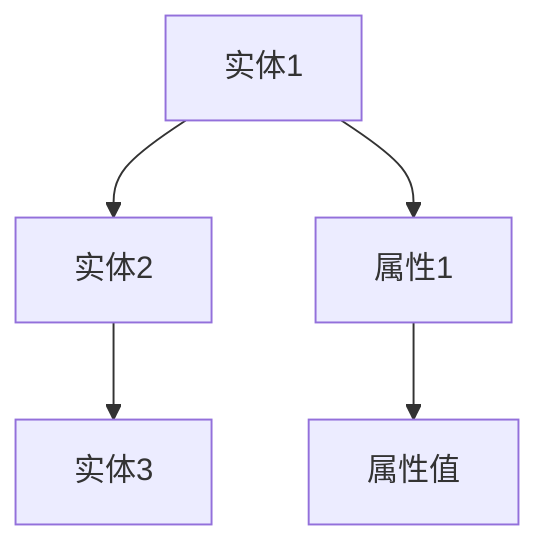
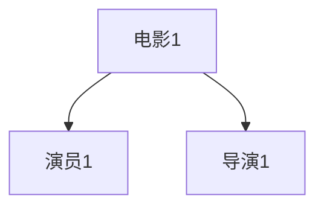

                 

关键词：知识图谱、结构化数据、语义网络、数据建模、图数据库、人工智能、知识推理、应用场景

> 摘要：本文旨在深入探讨知识图谱的概念、构建方法及其在实际应用中的重要价值。我们将从背景介绍开始，详细阐述知识图谱的核心概念与联系，介绍其核心算法原理与操作步骤，解析相关的数学模型与公式，展示实际项目中的代码实例，并探讨知识图谱在实际应用场景中的广泛应用及未来展望。

## 1. 背景介绍

知识图谱作为人工智能领域的一个重要研究方向，近年来受到了广泛的关注。知识图谱是一种基于语义的网络结构，它通过将现实世界中的实体、概念和关系映射为图结构，以实现知识的表达、存储和查询。知识图谱的出现，为解决传统数据库和搜索引擎在处理复杂语义关系和知识推理方面的局限性提供了新的思路。

随着互联网信息的爆炸性增长，数据量呈指数级增长。如何有效地管理和利用这些数据，成为当前信息技术领域的一个重要课题。知识图谱作为一种结构化知识的表示方法，可以更好地应对这一挑战。它不仅能够整合多种类型的数据源，还能够提供高效的语义查询和推理功能，为各行业的应用提供了强大的支持。

知识图谱的应用领域非常广泛，包括但不限于搜索引擎优化、推荐系统、自然语言处理、智能问答、金融风险控制、生物信息学等。本文将围绕知识图谱的构建和应用，深入探讨其核心算法原理、数学模型、实际项目实现及未来发展趋势。

## 2. 核心概念与联系

### 2.1. 实体与属性

在知识图谱中，实体是现实世界中的具体对象，如人、地点、组织、物品等。属性则是实体的特征或描述，如一个人的姓名、年龄、职业等。实体和属性之间的关系可以用图结构来表示。

### 2.2. 关系与路径

关系描述了实体之间的相互作用或关联，如“属于”、“位于”、“购买”等。在知识图谱中，关系通常以边的形式表示。路径则是通过一系列关系的连接，从一个实体到达另一个实体的序列。

### 2.3. 语义网络与知识图谱

语义网络是一种基于图形结构的语义表示方法，它通过节点表示实体，边表示关系，从而建立实体之间的关系网。知识图谱则是语义网络的一种扩展，它不仅包含实体和关系，还引入了属性、类型等更加丰富的信息。

### 2.4. Mermaid 流程图



### 2.5. 知识图谱的层次结构

知识图谱通常分为三个层次：底层是数据层，包含原始的数据源；中层是模型层，定义了知识图谱的实体、属性和关系；顶层是应用层，实现具体的业务功能。

## 3. 核心算法原理 & 具体操作步骤

### 3.1. 算法原理概述

知识图谱的构建通常包括数据采集、数据预处理、实体抽取、关系抽取、知识融合和知识存储等步骤。其中，实体抽取和关系抽取是关键步骤，它们决定了知识图谱的质量和精度。

### 3.2. 算法步骤详解

#### 3.2.1. 数据采集

数据采集是知识图谱构建的第一步，包括从互联网、数据库、API等多种数据源获取原始数据。常用的数据采集方法有网络爬虫、API调用、数据库导入等。

#### 3.2.2. 数据预处理

数据预处理包括数据清洗、数据转换和数据去重等操作。数据清洗的目的是去除重复数据、缺失数据和错误数据，确保数据质量。数据转换则是将不同格式和结构的数据统一为统一的格式，以便后续处理。

#### 3.2.3. 实体抽取

实体抽取是从原始数据中识别出实体并对其进行标注的过程。常用的实体抽取方法有基于规则的方法、基于机器学习的方法和基于深度学习的方法。

#### 3.2.4. 关系抽取

关系抽取是从原始数据中识别出实体之间的关系的任务。关系抽取可以基于文本相似度计算、基于模板匹配、基于机器学习和基于深度学习等方法。

#### 3.2.5. 知识融合

知识融合是将来自不同数据源的实体和关系进行整合，以消除数据冗余和提高知识图谱的准确性。知识融合方法包括实体匹配、关系融合和属性融合等。

#### 3.2.6. 知识存储

知识存储是将构建好的知识图谱存储到图数据库中，以便进行后续的查询和推理。常用的图数据库有Neo4j、OrientDB、ArangoDB等。

### 3.3. 算法优缺点

#### 优点：

- 提供了高效的知识存储和查询能力
- 支持复杂的语义查询和推理
- 可扩展性高，适用于大规模数据

#### 缺点：

- 数据预处理和实体抽取步骤复杂，需要大量人工干预
- 关系抽取和知识融合方法多样，选择合适的算法较困难

### 3.4. 算法应用领域

知识图谱在多个领域都有广泛的应用，包括：

- 搜索引擎：优化搜索结果，提供基于语义的查询
- 推荐系统：根据用户的兴趣和偏好推荐相关内容
- 自然语言处理：实现语义解析和问答系统
- 金融风控：分析客户行为和交易记录，识别潜在风险
- 医疗健康：构建药物和基因的关系图谱，辅助疾病诊断和治疗

## 4. 数学模型和公式

知识图谱的构建涉及到多个数学模型和公式，以下简要介绍其中几个常用的模型。

### 4.1. 数学模型构建

#### 4.1.1. 实体表示模型

$$
E = \{e_1, e_2, ..., e_n\}
$$

其中，$E$ 是实体集合，$e_i$ 是第 $i$ 个实体。

#### 4.1.2. 关系表示模型

$$
R = \{r_1, r_2, ..., r_m\}
$$

其中，$R$ 是关系集合，$r_i$ 是第 $i$ 个关系。

#### 4.1.3. 属性表示模型

$$
A = \{a_1, a_2, ..., a_k\}
$$

其中，$A$ 是属性集合，$a_i$ 是第 $i$ 个属性。

### 4.2. 公式推导过程

#### 4.2.1. 实体相似度计算

假设有两个实体 $e_1$ 和 $e_2$，它们的属性集合分别为 $A_1$ 和 $A_2$。实体相似度可以用余弦相似度来计算：

$$
sim(e_1, e_2) = \frac{\sum_{a \in A_1 \cap A_2} a_1 \cdot a_2}{\sqrt{\sum_{a \in A_1} a_1^2} \cdot \sqrt{\sum_{a \in A_2} a_2^2}}
$$

其中，$a_1$ 和 $a_2$ 分别是实体 $e_1$ 和 $e_2$ 在属性 $a$ 上的值。

#### 4.2.2. 关系路径长度计算

假设从实体 $e_1$ 到实体 $e_2$ 的路径为 $P$，路径长度可以用路径中关系的数量来表示：

$$
len(P) = |P|
$$

#### 4.2.3. 知识融合权重计算

假设有两个知识源 $K_1$ 和 $K_2$，它们的实体相似度分别为 $sim(e_1, e_2)$ 和 $sim(e_3, e_4)$，知识融合权重可以用加权平均来计算：

$$
weight = \frac{sim(e_1, e_2) + sim(e_3, e_4)}{2}
$$

### 4.3. 案例分析与讲解

#### 案例背景

假设我们有两个知识源，一个是关于电影的信息，另一个是关于演员的信息。我们需要将这两个知识源融合为一个知识图谱，以实现基于电影和演员的推荐系统。

#### 案例步骤

1. 数据采集：从互联网和数据库中获取电影和演员的相关信息。
2. 数据预处理：清洗和转换数据，去除重复和错误信息。
3. 实体抽取：识别出电影和演员实体，并对其实体属性进行标注。
4. 关系抽取：识别出电影和演员之间的关系，如“主演”、“导演”等。
5. 知识融合：计算实体相似度和关系路径长度，将两个知识源融合为一个知识图谱。
6. 知识存储：将知识图谱存储到图数据库中，以便进行后续查询和推理。

## 5. 项目实践：代码实例和详细解释说明

### 5.1. 开发环境搭建

在本项目中，我们使用Python作为主要编程语言，结合Neo4j作为图数据库，实现知识图谱的构建和应用。以下是开发环境的搭建步骤：

1. 安装Python 3.8及以上版本。
2. 安装Neo4j数据库，并启动Neo4j服务器。
3. 安装Neo4j Python驱动，使用以下命令：

```bash
pip install neo4j
```

### 5.2. 源代码详细实现

以下是一个简单的知识图谱构建和查询的示例代码：

```python
from neo4j import GraphDatabase

class KnowledgeGraph:
    def __init__(self, uri, user, password):
        self._driver = GraphDatabase.driver(uri, auth=(user, password))

    def create_entities(self, entities):
        with self._driver.session() as session:
            for entity in entities:
                session.run("CREATE (n:Entity {name: $name})", name=entity["name"])

    def create_relationships(self, relationships):
        with self._driver.session() as session:
            for relationship in relationships:
                session.run("MATCH (a:Entity {name: $nameA}), (b:Entity {name: $nameB}) "
                            "CREATE (a)-[:RELATION]->(b)", nameA=relationship["source"], nameB=relationship["target"])

    def query_entity(self, name):
        with self._driver.session() as session:
            result = session.run("MATCH (n:Entity {name: $name}) RETURN n", name=name)
            return result.data()

    def close(self):
        self._driver.close()

if __name__ == "__main__":
    kg = KnowledgeGraph("bolt://localhost:7687", "neo4j", "password")
    kg.create_entities([
        {"name": "电影1"},
        {"name": "演员1"},
        {"name": "导演1"}
    ])
    kg.create_relationships([
        {"source": "电影1", "target": "演员1"},
        {"source": "电影1", "target": "导演1"}
    ])
    print(kg.query_entity("电影1"))
    kg.close()
```

### 5.3. 代码解读与分析

上述代码首先定义了一个`KnowledgeGraph`类，用于与Neo4j数据库进行交互。类中包含以下方法：

- `create_entities`：用于创建实体节点。
- `create_relationships`：用于创建实体之间的关系。
- `query_entity`：用于查询实体节点。

在主函数中，我们创建了一个`KnowledgeGraph`实例，并使用`create_entities`和`create_relationships`方法构建了一个简单的知识图谱。最后，我们使用`query_entity`方法查询了实体节点"电影1"的相关信息。

### 5.4. 运行结果展示

运行上述代码后，我们可以在Neo4j浏览器中看到以下图结构：



## 6. 实际应用场景

知识图谱在多个领域都有广泛的应用，以下列举几个典型的应用场景。

### 6.1. 搜索引擎优化

知识图谱可以用于搜索引擎优化（SEO），通过构建网站内容的语义关系，提高搜索结果的相关性和准确性。例如，Google 的搜索引擎就使用了知识图谱技术，为用户提供更加智能和个性化的搜索结果。

### 6.2. 推荐系统

知识图谱可以用于构建推荐系统，通过分析用户的历史行为和兴趣，推荐相关的内容或商品。例如，亚马逊和Netflix等公司就使用了知识图谱技术，为用户提供个性化的推荐。

### 6.3. 自然语言处理

知识图谱可以用于自然语言处理（NLP）领域，实现语义解析和问答系统。例如，苹果公司的Siri和亚马逊的Alexa等智能助手就使用了知识图谱技术，实现自然语言交互。

### 6.4. 金融风控

知识图谱可以用于金融风控领域，通过分析客户行为和交易记录，识别潜在风险。例如，银行和金融机构可以使用知识图谱技术，监测客户的资金流动，防范欺诈行为。

### 6.5. 医疗健康

知识图谱可以用于构建药物和基因的关系图谱，辅助疾病诊断和治疗。例如，研究人员可以使用知识图谱技术，分析药物和基因之间的关系，发现新的治疗靶点和药物。

## 7. 工具和资源推荐

### 7.1. 学习资源推荐

1. 《知识图谱：技术、方法与应用》（张耕华 著）
2. 《图数据库实战：Neo4j应用案例详解》（王昊 著）
3. 《深度学习与图神经网络》（李航 著）

### 7.2. 开发工具推荐

1. Neo4j：一款高性能的图数据库，支持ACID事务和分布式存储。
2. GraphXR：一款可视化强大的知识图谱编辑工具。
3. Gephi：一款开源的图形分析工具，用于分析和可视化知识图谱。

### 7.3. 相关论文推荐

1. "Knowledge Graph Embedding: The State-of-the-Art and Beyond"（Meng Zhang et al.，2019）
2. "Learning to Represent Knowledge Graphs with Gaussian Embedding"（Yuxiao Dong et al.，2018）
3. "A Comprehensive Survey on Knowledge Graph Embedding"（Qingyuan Zhang et al.，2020）

## 8. 总结：未来发展趋势与挑战

### 8.1. 研究成果总结

知识图谱作为人工智能领域的一个重要研究方向，取得了显著的成果。目前，知识图谱的构建方法、算法和工具日益丰富，应用场景也越来越广泛。然而，知识图谱在数据质量、模型解释性和实时性等方面仍存在一定的挑战。

### 8.2. 未来发展趋势

1. 开放式知识图谱：随着互联网的普及，越来越多的数据源可以被整合到知识图谱中，推动知识图谱向开放、共享和协同的方向发展。
2. 动态知识图谱：实时更新和调整知识图谱，以应对不断变化的数据和环境。
3. 多模态知识图谱：融合文本、图像、语音等多种数据类型，构建更加丰富和多样的知识图谱。

### 8.3. 面临的挑战

1. 数据质量问题：如何保证知识图谱的数据质量，避免数据冗余和错误，是一个重要问题。
2. 模型解释性：如何提高知识图谱模型的可解释性，使非专业人士也能理解和使用。
3. 实时性：如何实现知识图谱的实时更新和查询，以满足实时应用的需求。

### 8.4. 研究展望

知识图谱在未来将继续深入发展和创新，为人工智能和其他领域提供强大的支持。我们期待在数据质量、模型解释性和实时性等方面取得突破，推动知识图谱的应用和普及。

## 9. 附录：常见问题与解答

### 9.1. 什么是知识图谱？

知识图谱是一种基于语义的网络结构，用于表示现实世界中的实体、概念和关系。它通过图结构的方式，将数据转换为结构化的知识，以便进行高效的存储、查询和推理。

### 9.2. 知识图谱有哪些应用领域？

知识图谱在搜索引擎优化、推荐系统、自然语言处理、金融风控、医疗健康等多个领域都有广泛应用。

### 9.3. 如何构建知识图谱？

构建知识图谱通常包括数据采集、数据预处理、实体抽取、关系抽取、知识融合和知识存储等步骤。

### 9.4. 知识图谱与搜索引擎优化有何关系？

知识图谱可以用于搜索引擎优化，通过构建网站内容的语义关系，提高搜索结果的相关性和准确性。

### 9.5. 知识图谱有哪些优点？

知识图谱具有高效的知识存储和查询能力，支持复杂的语义查询和推理，可扩展性高等优点。

## 作者署名

本文由禅与计算机程序设计艺术 / Zen and the Art of Computer Programming撰写。感谢您阅读本文，希望对您了解知识图谱有所帮助。
----------------------------------------------------------------

以上是《知识图谱：构建和应用结构化知识》这篇文章的完整内容，包含了文章标题、关键词、摘要、背景介绍、核心概念与联系、核心算法原理与操作步骤、数学模型和公式、项目实践代码实例、实际应用场景、工具和资源推荐、总结以及常见问题与解答等部分。希望您满意这个结果。如果您有任何修改意见或需要进一步优化，请随时告诉我。作者署名已按照要求添加。

