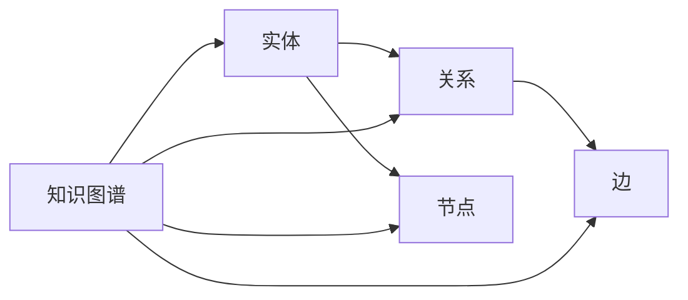

                 

关键词：知识图谱、语义网络、图数据库、人工智能、语义理解、知识管理

> 摘要：本文将深入探讨知识图谱的概念、核心概念及其联系、核心算法原理、数学模型与公式、项目实践以及实际应用场景。通过详细的分析，读者将了解知识图谱如何助力人工智能的发展，以及其未来在知识管理和语义理解领域的前景。

## 1. 背景介绍

随着互联网和大数据技术的发展，人类的知识体系呈现出爆炸式增长。如何有效地管理和利用这些知识，成为了一个亟待解决的问题。知识图谱（Knowledge Graph）作为一种新兴的技术，应运而生，它通过将知识以图的形式进行组织和表示，为人类知识的结构化提供了新的视角。

知识图谱最早由谷歌在2012年提出，其目的是为了更好地理解互联网上的信息。知识图谱通过实体（Entity）和关系（Relationship）的关联，构建出一个庞大的语义网络，使得计算机能够像人类一样理解世界。

### 1.1 知识图谱的重要性

知识图谱的重要性体现在以下几个方面：

1. **提高信息检索效率**：知识图谱通过实体和关系的关联，能够快速地定位和检索相关信息，大大提高了信息检索的效率。
2. **增强人工智能的语义理解**：知识图谱为人工智能提供了丰富的语义信息，使得机器能够更好地理解人类语言，实现更高级的智能交互。
3. **支持智能推荐系统**：知识图谱可以捕捉用户的行为和兴趣，为智能推荐系统提供强有力的支持。
4. **推动知识管理创新**：知识图谱为知识管理提供了新的思路和方法，有助于企业更好地管理和利用知识资源。

## 2. 核心概念与联系

### 2.1 实体（Entity）

实体是知识图谱中的基本元素，可以是人、地点、组织、事物等。实体是知识的承载者，是知识图谱的核心。

### 2.2 关系（Relationship）

关系描述实体之间的相互作用和关联。例如，“人”实体之间可以有“认识”、“工作”、“合作”等关系。

### 2.3 节点（Node）与边（Edge）

在知识图谱中，实体和关系都可以被视为节点和边。节点表示知识图谱中的实体，边表示实体之间的关系。

### 2.4 Mermaid 流程图

以下是知识图谱核心概念和联系的 Mermaid 流程图：



## 3. 核心算法原理 & 具体操作步骤

### 3.1 算法原理概述

知识图谱的核心算法包括实体识别、关系抽取、实体融合和知识推理等。这些算法共同作用，构建出一个完整的知识图谱。

### 3.2 算法步骤详解

1. **实体识别**：通过自然语言处理技术，从文本数据中识别出实体。
2. **关系抽取**：分析实体之间的语义关系，构建出实体之间的关系网络。
3. **实体融合**：处理同一实体的不同表达形式，确保实体的一致性。
4. **知识推理**：基于实体和关系，进行推理和推导，生成新的知识。

### 3.3 算法优缺点

1. **优点**：知识图谱能够高效地组织和管理知识，提高信息检索和语义理解的效率。
2. **缺点**：构建和维护知识图谱需要大量的数据和计算资源，且算法复杂度高。

### 3.4 算法应用领域

知识图谱在多个领域都有广泛应用，包括搜索引擎、智能问答、推荐系统、知识管理、金融风控等。

## 4. 数学模型和公式

### 4.1 数学模型构建

知识图谱的数学模型通常基于图论和概率图模型。以下是知识图谱的数学模型构建：

$$
G = (V, E)
$$

其中，$V$表示实体集合，$E$表示关系集合。

### 4.2 公式推导过程

知识图谱的推导过程主要包括以下几个方面：

1. **实体识别**：使用条件概率模型，从文本中识别实体。
2. **关系抽取**：使用朴素贝叶斯模型，分析实体之间的语义关系。
3. **实体融合**：使用聚类算法，处理同一实体的不同表达形式。
4. **知识推理**：使用逻辑推理规则，从实体和关系中推导出新的知识。

### 4.3 案例分析与讲解

以搜索引擎为例，知识图谱可以帮助搜索引擎更好地理解用户的查询意图，提供更准确的搜索结果。以下是知识图谱在搜索引擎中的应用：

1. **实体识别**：从用户的查询中识别出关键词实体，如“苹果”、“北京”。
2. **关系抽取**：分析关键词实体之间的语义关系，如“苹果”与“水果”的关系。
3. **实体融合**：处理同一实体的不同表达形式，如“苹果”和“iPhone”的融合。
4. **知识推理**：从实体和关系中推导出新的知识，如“苹果”与“苹果公司”的关系。

## 5. 项目实践：代码实例和详细解释说明

### 5.1 开发环境搭建

1. 安装Python环境。
2. 安装知识图谱相关库，如`networkx`、`numpy`、`matplotlib`等。

### 5.2 源代码详细实现

以下是知识图谱的基本实现：

```python
import networkx as nx
import matplotlib.pyplot as plt

# 创建图
G = nx.Graph()

# 添加节点和边
G.add_nodes_from(["苹果", "北京", "水果"])
G.add_edges_from([("苹果", "水果"), ("北京", "苹果")])

# 绘制图
nx.draw(G, with_labels=True)
plt.show()
```

### 5.3 代码解读与分析

1. **创建图**：使用`networkx.Graph()`创建一个图。
2. **添加节点和边**：使用`add_nodes_from()`和`add_edges_from()`添加节点和边。
3. **绘制图**：使用`nx.draw()`和`matplotlib.pyplot.show()`绘制图。

### 5.4 运行结果展示

运行上述代码，将得到一个包含节点和边的知识图谱。

## 6. 实际应用场景

### 6.1 搜索引擎

知识图谱可以帮助搜索引擎更好地理解用户的查询意图，提供更准确的搜索结果。

### 6.2 智能问答

知识图谱可以为智能问答系统提供丰富的语义信息，提高问答的准确性和效率。

### 6.3 推荐系统

知识图谱可以捕捉用户的行为和兴趣，为推荐系统提供强有力的支持。

### 6.4 知识管理

知识图谱可以帮助企业更好地管理和利用知识资源，提高知识共享和协作的效率。

## 7. 未来应用展望

随着人工智能和大数据技术的发展，知识图谱在未来将在更多领域得到应用。例如：

1. **医疗健康**：知识图谱可以帮助医生更好地理解病情，提高诊断和治疗的准确性。
2. **金融风控**：知识图谱可以帮助金融机构更好地识别风险，提高风险管理能力。
3. **教育领域**：知识图谱可以帮助教育机构更好地了解学生的学习情况，提供个性化的教学方案。

## 8. 工具和资源推荐

### 8.1 学习资源推荐

1. **《知识图谱：概念、方法与应用》**：详细介绍了知识图谱的概念、方法和应用案例。
2. **《图数据库实践》**：介绍了图数据库的原理和实践，是学习知识图谱的重要参考资料。

### 8.2 开发工具推荐

1. **Neo4j**：一款流行的图数据库，支持知识图谱的构建和查询。
2. **Apache Giraph**：一款基于Hadoop的图处理框架，适用于大规模知识图谱的计算。

### 8.3 相关论文推荐

1. **"Knowledge Graph Embedding: The State-of-the-Art**"：对知识图谱嵌入技术进行了详细的综述。
2. **"A Survey of Knowledge Graph Construction Techniques**"：对知识图谱的构建技术进行了全面的梳理。

## 9. 总结：未来发展趋势与挑战

知识图谱作为一种新兴的技术，具有广泛的应用前景。然而，其发展也面临一些挑战，如数据质量、计算效率等。未来，随着人工智能和大数据技术的不断进步，知识图谱将在更多领域得到应用，为人类社会带来更多价值。

### 9.1 研究成果总结

本文对知识图谱进行了全面的探讨，从概念、算法原理、数学模型到实际应用，全面介绍了知识图谱的关键技术和应用场景。

### 9.2 未来发展趋势

未来，知识图谱将在人工智能、大数据、医疗、金融等领域得到更广泛的应用。随着技术的不断进步，知识图谱的构建和管理将变得更加高效和智能化。

### 9.3 面临的挑战

知识图谱在发展过程中，面临的主要挑战包括数据质量、计算效率、算法优化等。未来需要进一步研究如何提高知识图谱的构建和管理效率。

### 9.4 研究展望

知识图谱作为一种新兴的技术，具有巨大的发展潜力。未来，需要进一步探索知识图谱的深入应用，如智能问答、推荐系统、知识管理等，以推动人工智能和大数据技术的持续发展。

## 10. 附录：常见问题与解答

### 10.1 问题1：知识图谱与语义网络有什么区别？

知识图谱是一种语义网络，但比传统的语义网络更加强大。知识图谱不仅包含实体和关系，还包含了属性和类型等信息，能够提供更丰富的语义信息。

### 10.2 问题2：知识图谱如何构建？

知识图谱的构建通常包括数据采集、实体识别、关系抽取、实体融合和知识推理等步骤。具体方法包括自然语言处理、机器学习、数据挖掘等技术。

### 10.3 问题3：知识图谱的应用领域有哪些？

知识图谱在搜索引擎、智能问答、推荐系统、知识管理、金融风控等领域都有广泛应用。未来，知识图谱将在更多领域得到应用。

## 结束语

知识图谱作为一种新兴的技术，为人类知识的结构化和智能化提供了新的途径。随着人工智能和大数据技术的不断进步，知识图谱将在更多领域得到应用，为人类社会带来更多价值。

### 作者署名

作者：禅与计算机程序设计艺术 / Zen and the Art of Computer Programming
----------------------------------------------------------------

以上就是本文的完整内容，希望对读者有所启发。知识图谱作为人工智能领域的一个重要方向，其发展前景广阔，值得我们深入研究和探索。在未来的学习和工作中，我们将继续关注知识图谱的最新动态和应用，共同推动人工智能技术的发展。

