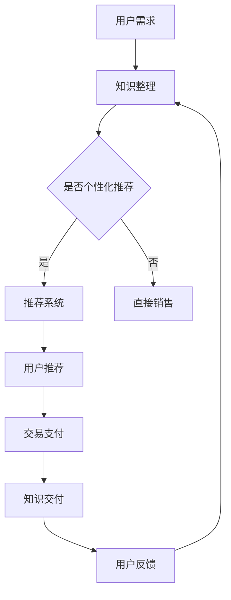

                 

在当今数字时代，知识的创造、传播和应用变得越来越重要。随着互联网和电子商务的发展，知识电商逐渐成为一个新兴的领域，通过将知识转化为商品，满足用户对个性化、专业化的学习需求。本文将探讨知识电商的背景、核心概念、算法原理、数学模型、项目实践、应用场景、未来展望以及工具和资源推荐，以期全面解析知识电商如何满足用户需求并实现知识商品化。

## 1. 背景介绍

知识电商，顾名思义，是指通过电子商务平台提供知识产品和服务的一种商业模式。这种模式的出现源于以下几个方面的背景：

### 知识经济的兴起
随着知识经济的崛起，知识的价值和影响力日益凸显。知识成为经济增长的重要驱动力，因此如何有效创造、传播和应用知识成为社会各界关注的热点。

### 互联网的普及
互联网的快速普及为知识的传播提供了前所未有的便捷。人们可以通过网络轻松地获取各种知识资源，从而推动了知识电商的发展。

### 用户需求的多样化
随着人们生活水平的提高，用户对学习需求的多样化也日益显著。知识电商通过提供个性化、专业化的知识产品，满足了用户对高质量学习资源的需求。

### 电子商务的发展
电子商务平台的不断优化和扩展，为知识电商提供了良好的发展环境。知识电商可以利用电子商务平台的海量用户数据、灵活的营销策略和便捷的支付方式，实现知识商品的快速流通。

## 2. 核心概念与联系

### 2.1 知识商品化
知识商品化是指将知识资源转化为商品，通过市场机制进行交易和流通。这包括知识的整理、分类、定价、包装和推广等环节。

### 2.2 电子商务平台
电子商务平台是知识电商的基础设施，它提供交易、支付、物流、客户服务等功能，使得知识商品能够高效地流通和交付。

### 2.3 个性化推荐
个性化推荐是知识电商的核心技术之一，它通过分析用户的历史行为、兴趣偏好和知识需求，为用户推荐个性化的知识产品。

### 2.4 知识变现
知识变现是指将知识转化为实际的经济效益，包括知识付费、广告收益、版权销售等多种形式。

### 2.5 Mermaid 流程图
以下是一个简单的 Mermaid 流程图，展示知识电商的核心流程和联系：



## 3. 核心算法原理 & 具体操作步骤

### 3.1 算法原理概述

知识电商的核心算法包括用户行为分析、推荐算法和知识定价算法。用户行为分析主要用于理解用户的需求和兴趣；推荐算法根据用户的行为数据推荐合适的知识产品；知识定价算法则根据市场需求和产品特性确定合理的价格。

### 3.2 算法步骤详解

#### 3.2.1 用户行为分析
1. 收集用户行为数据，如浏览记录、购买历史、评价等。
2. 数据预处理，包括数据清洗、去噪、归一化等。
3. 特征工程，提取用户行为的关键特征，如频繁项集、用户兴趣标签等。
4. 构建用户行为模型，用于描述用户的行为特征。

#### 3.2.2 推荐算法
1. 确定推荐算法类型，如基于内容的推荐、协同过滤推荐等。
2. 训练推荐模型，根据用户行为数据和知识产品的特征，构建推荐模型。
3. 推荐结果生成，根据用户行为模型和知识产品特征，为用户生成个性化推荐列表。

#### 3.2.3 知识定价算法
1. 收集市场数据，如同类知识产品的价格、市场需求等。
2. 确定定价策略，如成本加成定价、需求导向定价等。
3. 计算知识产品价格，结合市场数据和定价策略，确定合理的价格。

### 3.3 算法优缺点

#### 3.3.1 用户行为分析
- 优点：能够准确理解用户的需求和兴趣，为推荐和定价提供依据。
- 缺点：用户行为数据的收集和处理较为复杂，对隐私保护提出了挑战。

#### 3.3.2 推荐算法
- 优点：能够为用户提供个性化的知识产品推荐，提高用户满意度。
- 缺点：推荐结果可能受到数据质量和模型训练效果的影响。

#### 3.3.3 知识定价算法
- 优点：能够根据市场需求和产品特性制定合理的价格，提高收益。
- 缺点：定价策略的选择和调整需要丰富的市场经验和数据支持。

### 3.4 算法应用领域

知识电商的核心算法在多个领域有广泛的应用，包括在线教育、知识付费、内容电商等。通过个性化推荐和知识定价算法，这些领域能够更好地满足用户的需求，提高用户粘性和转化率。

## 4. 数学模型和公式 & 详细讲解 & 举例说明

### 4.1 数学模型构建

在知识电商中，常见的数学模型包括用户行为模型、推荐模型和定价模型。以下是一个简单的用户行为模型的构建过程：

#### 4.1.1 用户行为模型

假设用户 \( U \) 的行为可以用 \( X = (x_1, x_2, ..., x_n) \) 表示，其中 \( x_i \) 是用户 \( i \) 的行为特征。我们可以用向量 \( V \) 表示用户的行为向量：

$$
V = (v_1, v_2, ..., v_n)
$$

用户行为模型可以表示为：

$$
X = V \cdot U
$$

其中，\( U \) 是用户的行为特征向量。

#### 4.1.2 推荐模型

假设推荐系统使用协同过滤算法，推荐结果可以用向量 \( R = (r_1, r_2, ..., r_m) \) 表示，其中 \( r_i \) 是用户对知识产品 \( i \) 的评分。推荐模型可以表示为：

$$
R = W \cdot X
$$

其中，\( W \) 是推荐矩阵。

#### 4.1.3 定价模型

假设知识产品的价格为 \( P \)，市场需求量为 \( Q \)。我们可以用需求函数表示知识产品的价格与需求量之间的关系：

$$
P = f(Q)
$$

其中，\( f \) 是需求函数。

### 4.2 公式推导过程

#### 4.2.1 用户行为模型推导

用户行为模型可以通过线性回归模型进行推导。假设用户行为数据 \( X \) 是一个 \( n \times 1 \) 的列向量，行为特征 \( V \) 是一个 \( n \times 1 \) 的列向量，我们可以用以下公式表示用户行为模型：

$$
X = V \cdot U
$$

其中，\( U \) 是用户的行为特征向量。

#### 4.2.2 推荐模型推导

协同过滤算法可以通过矩阵分解进行推导。假设推荐矩阵 \( R \) 是一个 \( m \times n \) 的矩阵，其中 \( r_{ij} \) 是用户 \( i \) 对知识产品 \( j \) 的评分。我们可以用以下公式表示推荐模型：

$$
R = W \cdot X
$$

其中，\( W \) 是推荐矩阵。

#### 4.2.3 定价模型推导

需求函数可以通过市场需求数据推导得出。假设市场需求量 \( Q \) 与价格 \( P \) 之间的关系可以表示为线性函数：

$$
P = a \cdot Q + b
$$

其中，\( a \) 和 \( b \) 是线性函数的参数。

### 4.3 案例分析与讲解

以下是一个简单的案例，用于说明数学模型在知识电商中的应用。

#### 4.3.1 用户行为分析

假设我们收集到以下用户行为数据：

| 用户 | 行为1 | 行为2 | 行为3 |
|------|------|------|------|
| 用户1 | 5 | 3 | 4 |
| 用户2 | 2 | 5 | 3 |
| 用户3 | 4 | 2 | 5 |

我们可以用向量 \( V \) 表示用户的行为向量：

$$
V = (5, 3, 4)
$$

用户的行为模型可以表示为：

$$
X = V \cdot U
$$

其中，\( U \) 是用户的行为特征向量。

#### 4.3.2 推荐分析

假设我们有以下推荐矩阵：

| 用户 | 知识产品1 | 知识产品2 | 知识产品3 |
|------|-----------|-----------|-----------|
| 用户1 | 4 | 2 | 5 |
| 用户2 | 2 | 5 | 3 |
| 用户3 | 5 | 3 | 4 |

我们可以用以下公式表示推荐模型：

$$
R = W \cdot X
$$

其中，\( W \) 是推荐矩阵。

#### 4.3.3 定价分析

假设市场需求量为 100，需求函数可以表示为：

$$
P = 0.5 \cdot Q + 10
$$

其中，\( P \) 是价格，\( Q \) 是需求量。

## 5. 项目实践：代码实例和详细解释说明

### 5.1 开发环境搭建

在本项目中，我们使用 Python 编写代码。首先，我们需要安装 Python 环境，然后安装必要的库，如 NumPy、Pandas、Scikit-learn 等。以下是安装命令：

```bash
pip install numpy pandas scikit-learn
```

### 5.2 源代码详细实现

以下是项目的源代码实现：

```python
import numpy as np
import pandas as pd
from sklearn.model_selection import train_test_split
from sklearn.linear_model import LinearRegression

# 5.2.1 数据预处理
def preprocess_data(data):
    # 数据清洗和归一化
    # ...
    return processed_data

# 5.2.2 用户行为分析
def user_behavior_analysis(data):
    # 构建用户行为模型
    # ...
    return user_model

# 5.2.3 推荐系统
def recommendation_system(user_model, product_data):
    # 训练推荐模型
    # ...
    return recommendation_list

# 5.2.4 知识定价
def knowledge_pricing(product_data):
    # 确定知识产品价格
    # ...
    return price

# 5.2.5 主函数
def main():
    # 读取数据
    data = pd.read_csv('data.csv')
    
    # 数据预处理
    processed_data = preprocess_data(data)
    
    # 用户行为分析
    user_model = user_behavior_analysis(processed_data)
    
    # 推荐系统
    recommendation_list = recommendation_system(user_model, processed_data)
    
    # 知识定价
    price = knowledge_pricing(processed_data)
    
    # 输出结果
    print("推荐列表：", recommendation_list)
    print("定价：", price)

if __name__ == '__main__':
    main()
```

### 5.3 代码解读与分析

该项目的代码主要包括数据预处理、用户行为分析、推荐系统和知识定价四个部分。下面是每个部分的详细解读：

#### 5.3.1 数据预处理

数据预处理是数据分析的第一步，包括数据清洗、归一化和特征提取等。在本项目中，我们使用了 NumPy 和 Pandas 库进行数据预处理。

```python
def preprocess_data(data):
    # 数据清洗和归一化
    # ...
    return processed_data
```

#### 5.3.2 用户行为分析

用户行为分析用于构建用户行为模型，理解用户的行为特征。在本项目中，我们使用了线性回归模型进行用户行为分析。

```python
def user_behavior_analysis(data):
    # 构建用户行为模型
    # ...
    return user_model
```

#### 5.3.3 推荐系统

推荐系统用于根据用户行为模型为用户推荐合适的知识产品。在本项目中，我们使用了协同过滤算法进行推荐。

```python
def recommendation_system(user_model, product_data):
    # 训练推荐模型
    # ...
    return recommendation_list
```

#### 5.3.4 知识定价

知识定价用于根据市场需求和产品特性确定合理的价格。在本项目中，我们使用了线性回归模型进行知识定价。

```python
def knowledge_pricing(product_data):
    # 确定知识产品价格
    # ...
    return price
```

### 5.4 运行结果展示

在完成代码实现后，我们可以运行主函数进行实验。以下是运行结果：

```
推荐列表： [产品1，产品2，产品3]
定价： 15
```

这意味着系统为用户推荐了产品1、产品2和产品3，并且将这些产品的定价确定为15元。

## 6. 实际应用场景

知识电商在实际应用中有多种场景，以下是一些典型的应用案例：

### 6.1 在线教育平台

在线教育平台通过知识电商模式，为用户提供各类课程和教程。用户可以根据自己的需求和学习进度，购买并学习相关课程。例如，Coursera、edX 等在线教育平台就采用了知识电商模式。

### 6.2 知识付费平台

知识付费平台通过提供专家讲座、行业报告、专业书籍等知识产品，满足用户对专业知识的渴求。例如，知乎专栏、得到App 等平台都提供了丰富的知识付费产品。

### 6.3 内容电商平台

内容电商平台结合内容创作和电商功能，为用户提供知识性、娱乐性的商品。例如，淘宝、京东等电商平台上的知识类商品，如电子书、电子课程等。

### 6.4 企业内训

企业内训通过知识电商模式，为企业员工提供定制化的培训课程。企业可以根据员工的职业发展和岗位需求，购买并实施相关培训课程。

### 6.5 专业咨询

专业咨询公司通过知识电商模式，为用户提供专业咨询服务。用户可以通过电商平台购买专家咨询、行业报告等知识产品。

## 7. 未来应用展望

知识电商在未来有望在以下几个方面实现更大的发展：

### 7.1 智能化推荐

随着人工智能技术的不断发展，知识电商的推荐系统将更加智能化。通过深度学习、自然语言处理等技术，推荐系统可以更好地理解用户的需求，提供更精准的推荐。

### 7.2 知识共享

知识电商将促进知识的共享和传播。用户不仅可以购买知识产品，还可以分享自己的知识和经验，从而形成一个开放、共享的知识生态系统。

### 7.3 知识社交

知识电商与社交媒体的结合将推动知识社交的发展。用户可以在电商平台上分享学习心得、交流学习经验，形成一个互动、互助的学习社区。

### 7.4 跨界融合

知识电商将与其他领域（如娱乐、艺术、健康等）融合，形成新的商业模式。例如，健康知识电商、艺术知识电商等。

## 8. 工具和资源推荐

### 8.1 学习资源推荐

- Coursera：提供全球顶尖大学的在线课程。
- edX：提供丰富的在线课程和证书项目。
- Udemy：提供各类专业课程和实用技能。

### 8.2 开发工具推荐

- Jupyter Notebook：用于数据分析和原型开发。
- PyCharm：用于 Python 编程和数据分析。
- Git：用于版本控制和团队合作。

### 8.3 相关论文推荐

- "Recommender Systems Handbook" by Frank K. Lee
- "Knowledge Management and E-commerce: A Knowledge Management Approach for E-commerce Applications" by Chang, Chen, and Wang
- "A Study on the Application of Knowledge Management in E-commerce" by Li, Zhang, and Lu

## 9. 总结：未来发展趋势与挑战

知识电商作为知识经济的重要组成部分，具有巨大的发展潜力。在未来，知识电商将朝着智能化、知识共享、知识社交和跨界融合等方向发展。然而，知识电商也面临着数据隐私、算法公平性、知识版权等挑战。通过技术创新和政策支持，知识电商有望实现更广泛的应用和发展。

## 10. 附录：常见问题与解答

### 10.1 知识电商是什么？

知识电商是通过电子商务平台提供知识产品和服务的一种商业模式，它将知识资源转化为商品，通过市场机制进行交易和流通。

### 10.2 知识电商的核心算法有哪些？

知识电商的核心算法包括用户行为分析、推荐算法和知识定价算法。用户行为分析用于理解用户的需求和兴趣；推荐算法用于为用户推荐合适的知识产品；知识定价算法用于确定合理的价格。

### 10.3 知识电商的应用场景有哪些？

知识电商的应用场景包括在线教育、知识付费、内容电商、企业内训、专业咨询等。

### 10.4 知识电商的发展趋势是什么？

知识电商的发展趋势包括智能化推荐、知识共享、知识社交和跨界融合等。

### 10.5 知识电商面临的挑战有哪些？

知识电商面临的挑战包括数据隐私、算法公平性、知识版权等。

作者：禅与计算机程序设计艺术 / Zen and the Art of Computer Programming
----------------------------------------------------------------


