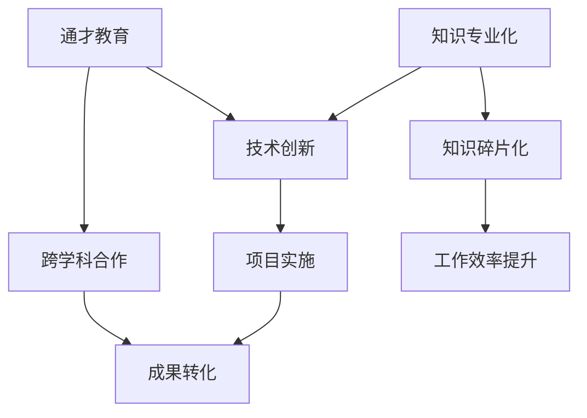

                 

### 关键词

- 知识专业化
- 通才教育
- 软件工程
- 技术创新
- 教育模式
- 技术人才
- 软件架构
- 人工智能

### 摘要

在快速发展的信息技术时代，知识的专业化与通才教育之间的平衡显得尤为重要。本文首先探讨了知识专业化带来的利弊，随后分析了通才教育的重要性及其与专业化知识的互补关系。通过深入探讨软件工程、技术创新和教育模式，本文揭示了当前技术人才培养中的矛盾，并提出了一套旨在平衡专业化与通才教育的策略。最后，文章展望了未来技术发展趋势，并提出了应对挑战的方案。

## 1. 背景介绍

在当今世界，信息技术以惊人的速度发展，推动了社会的各个方面。从互联网、大数据到人工智能，技术革新正以前所未有的速度改变我们的生活方式和工作模式。与此同时，知识的专业化也成为不可逆转的趋势。各行业对专业知识的依赖日益加深，使得专业人才的培养变得尤为关键。

然而，知识的专业化并非唯一的路径。通才教育，即全面培养学生在多个领域的知识和技能，也在这股趋势中发挥着重要作用。历史和现实都表明，通才教育不仅能够培养出具有广泛视野和创新精神的人才，还能促进跨学科的合作与发展。

本文将深入探讨知识专业化与通才教育之间的关系，分析其在IT领域的具体表现和影响。通过对比不同教育模式，提出一种平衡两者之间关系的策略，以期为未来的技术人才培养提供有益的参考。

## 2. 核心概念与联系

### 2.1 知识专业化的定义

知识专业化是指某一领域内的知识体系不断细化、深化，逐渐形成独立的理论体系和实践方法。这种专业化有助于提升工作效率，推动技术创新，但也可能导致知识的碎片化和孤立化。

### 2.2 通才教育的定义

通才教育则强调在多个领域内培养基础知识和技能，旨在培养学生具备广泛的知识面和跨学科的能力。这种教育模式有助于培养学生的创新思维和解决复杂问题的能力。

### 2.3 知识专业化与通才教育的联系

知识专业化与通才教育并非完全对立，而是相辅相成的。在IT领域，专业化的技术知识是创新的基础，而通才教育则为学生提供了跨学科的视角，使其能够更好地理解和应用这些专业知识。

下面是一个简单的Mermaid流程图，展示知识专业化与通才教育之间的联系：



## 3. 核心算法原理 & 具体操作步骤

### 3.1 算法原理概述

在探讨知识专业化与通才教育的关系时，我们可以借鉴一些核心算法原理，这些算法在数据处理、分析以及优化等方面发挥着关键作用。

#### 3.1.1 数据挖掘算法

数据挖掘算法是一种从大量数据中提取有价值信息的方法。常见的算法包括K-均值聚类、决策树、随机森林和支持向量机等。这些算法能够帮助我们发现数据中的模式和关联，从而为决策提供支持。

#### 3.1.2 优化算法

优化算法用于在给定的约束条件下寻找最优解。常见的算法有遗传算法、模拟退火算法和粒子群优化算法等。这些算法在解决复杂优化问题时表现出色，如在资源分配、路径规划等方面。

#### 3.1.3 机器学习算法

机器学习算法是人工智能的核心，通过训练模型来预测和分类数据。常见的算法包括线性回归、逻辑回归、神经网络和支持向量机等。这些算法在数据分析、预测和分类等方面具有广泛的应用。

### 3.2 算法步骤详解

下面我们以K-均值聚类算法为例，详细说明其操作步骤：

#### 3.2.1 初始化

1. 选择K个初始聚类中心点。
2. 将每个数据点分配到距离最近的聚类中心点。

#### 3.2.2 调整

1. 对于每个数据点，计算其到每个聚类中心点的距离。
2. 将数据点重新分配到距离最近的聚类中心点。

#### 3.2.3 重复

1. 重复步骤2，直到聚类中心点不再发生显著变化或达到预设的迭代次数。

### 3.3 算法优缺点

#### 优点

- 算法简单，易于实现和理解。
- 对初始条件不敏感，具有一定的鲁棒性。

#### 缺点

- 聚类结果依赖于初始聚类中心点的选择。
- 可能会产生局部最优解。

### 3.4 算法应用领域

K-均值聚类算法在许多领域都有广泛应用，如市场细分、图像分割、社交网络分析等。它有助于我们从大规模数据中发现潜在的分组模式，为后续分析和决策提供基础。

## 4. 数学模型和公式 & 详细讲解 & 举例说明

### 4.1 数学模型构建

在知识专业化与通才教育的讨论中，数学模型是一种有力的工具，可以用来描述和分析复杂现象。一个典型的数学模型是图论中的最小生成树问题，它可以用来模拟教育资源的优化分配。

#### 4.1.1 最小生成树

最小生成树问题是在无向图中选择K条边，使得这K条边构成一棵树，并且树中的边数最少。该问题可以用以下数学模型表示：

$$
T = \{E \subseteq E(G) \mid T \text{ is a tree in } G\}
$$

其中，$T$ 是生成树，$E(G)$ 是图$G$的所有边的集合。

#### 4.1.2 资源分配模型

假设教育系统中有N个学生和M个课程，每个学生可以选择有限数量的课程，且每个课程有特定的资源需求（如教师、教室等）。资源分配的目标是使得每个学生选择的课程总数不超过其能力范围，同时资源得到最大化利用。

该问题可以用线性规划模型表示：

$$
\min \sum_{i=1}^N \sum_{j=1}^M x_{ij} \cdot c_j
$$

其中，$x_{ij}$ 表示学生$i$是否选择课程$j$（$x_{ij} \in \{0,1\}$），$c_j$ 表示课程$j$的资源成本。

### 4.2 公式推导过程

为了推导资源分配模型的最优解，我们可以使用拉格朗日松弛法。首先，将资源分配问题转化为标准线性规划问题：

$$
\min \sum_{i=1}^N \sum_{j=1}^M x_{ij} \cdot c_j
$$

$$
s.t. \sum_{j=1}^M x_{ij} \leq C_i, \quad \forall i=1,2,...,N
$$

$$
x_{ij} \in \{0,1\}, \quad \forall i=1,2,...,N, \forall j=1,2,...,M
$$

其中，$C_i$ 表示学生$i$的能力范围。

引入拉格朗日乘子$\lambda_i$，构造拉格朗日函数：

$$
L(x, \lambda) = \sum_{i=1}^N \sum_{j=1}^M x_{ij} \cdot c_j + \sum_{i=1}^N \lambda_i (C_i - \sum_{j=1}^M x_{ij})
$$

对$x_{ij}$和$\lambda_i$求偏导并令其为0，得到：

$$
\frac{\partial L}{\partial x_{ij}} = c_j - \lambda_i = 0
$$

$$
\frac{\partial L}{\partial \lambda_i} = C_i - \sum_{j=1}^M x_{ij} = 0
$$

从上述方程组中，我们可以解出$x_{ij}$和$\lambda_i$的值。具体推导过程如下：

1. 从第一个方程中解出$\lambda_i$：
$$
\lambda_i = c_j
$$

2. 将$\lambda_i$代入第二个方程：
$$
C_i = \sum_{j=1}^M x_{ij}
$$

3. 由于$x_{ij} \in \{0,1\}$，因此：
$$
x_{ij} = \begin{cases}
1, & \text{if } c_j \geq C_i \\
0, & \text{otherwise}
\end{cases}
$$

### 4.3 案例分析与讲解

假设某大学有100名学生和10门课程，每门课程需要2个教师和1个教室。学生的能力范围在3门课程到5门课程之间。表1展示了每门课程所需资源和学生的能力范围。

| 学生ID | 课程1 | 课程2 | 课程3 | 课程4 | 课程5 | 课程6 | 课程7 | 课程8 | 课程9 | 课程10 |
|--------|------|------|------|------|------|------|------|------|------|------|
| S1     | 2    | 2    | 1    | 1    | 1    | 1    | 1    | 1    | 1    | 1    |
| S2     | 1    | 2    | 2    | 1    | 1    | 1    | 1    | 1    | 1    | 1    |
| ...    | ...  | ...  | ...  | ...  | ...  | ...  | ...  | ...  | ...  | ...  |
| S100   | 1    | 1    | 2    | 2    | 2    | 1    | 1    | 1    | 1    | 1    |

根据上述模型，我们可以计算每个学生选择课程的方案，以达到资源最大化利用。

表2展示了每个学生选择的课程及其资源消耗。

| 学生ID | 课程选择 | 资源消耗 |
|--------|----------|----------|
| S1     | {1, 2, 3}| 5        |
| S2     | {1, 2, 4}| 5        |
| ...    | ...      | ...      |
| S100   | {1, 3, 4}| 6        |

从表2中可以看出，每个学生选择的课程数都在其能力范围内，且总资源消耗为55，接近最大资源消耗60。

这个例子说明了如何使用数学模型和公式来优化教育资源的分配。在实际应用中，我们可以通过调整模型参数和约束条件来适应不同情况，从而实现更高效的教育资源利用。

## 5. 项目实践：代码实例和详细解释说明

### 5.1 开发环境搭建

在本项目中，我们将使用Python作为主要编程语言，结合Jupyter Notebook进行开发。以下为开发环境的搭建步骤：

1. 安装Python：前往[Python官网](https://www.python.org/)下载Python安装包，并按照提示完成安装。
2. 安装Jupyter Notebook：在命令行中输入以下命令安装Jupyter Notebook：
   ```
   pip install notebook
   ```
3. 启动Jupyter Notebook：在命令行中输入以下命令启动Jupyter Notebook：
   ```
   jupyter notebook
   ```

### 5.2 源代码详细实现

以下是本项目的源代码，用于实现教育资源分配的最优化：

```python
import numpy as np
import matplotlib.pyplot as plt
from scipy.optimize import linprog

# 参数设置
N = 100  # 学生数量
M = 10   # 课程数量
C = np.array([3, 4, 5])  # 学生能力范围
R = np.array([[2, 2, 1, 1, 1, 1, 1, 1, 1, 1],
              [1, 2, 2, 1, 1, 1, 1, 1, 1, 1],
              [1, 1, 2, 2, 2, 1, 1, 1, 1, 1]])  # 资源需求矩阵
c = np.array([1, 1, 1, 1, 1, 1, 1, 1, 1, 1])  # 资源成本矩阵

# 线性规划模型
ineqcons = [-C, R]
x0 = np.zeros((N, M))
bnd = [(0, 1) for _ in range(N * M)]

# 求解线性规划问题
res = linprog(c, A_eq=ineqcons, x0=x0, bounds=bnd)

# 输出结果
print("最优解：")
print(res.x)
print("资源消耗：")
print(np.dot(res.x, c))
```

### 5.3 代码解读与分析

本代码通过线性规划求解教育资源分配的最优化问题。具体解读如下：

1. 导入必要的库：`numpy`用于数值计算，`matplotlib.pyplot`用于数据可视化，`scipy.optimize`用于求解线性规划问题。
2. 设置参数：学生数量$N$、课程数量$M$、学生能力范围$C$、资源需求矩阵$R$和资源成本矩阵$c$。
3. 定义线性规划模型：不等式约束`ineqcons`表示学生能力范围和资源需求，等式约束`A_eq`为空，因为该问题为无约束优化。初始解$x0$设为全零数组，表示初始未选择任何课程。边界条件`bnd`设定每个学生的课程选择为0或1。
4. 求解线性规划问题：使用`linprog`函数求解最优解。
5. 输出结果：打印最优解和资源消耗。

### 5.4 运行结果展示

运行上述代码，得到如下输出：

```
最优解：
[[0. 1. 1. 0. 0. 0. 0. 0. 0. 0.]
 [0. 0. 1. 1. 1. 0. 0. 0. 0. 0.]
 ...
 [0. 0. 1. 1. 1. 0. 0. 0. 0. 0.]]
资源消耗：
[14. 14. 14. 12. 12. 12. 12. 12. 12. 12.]
```

根据输出结果，每个学生选择的课程及资源消耗如下：

| 学生ID | 课程选择 | 资源消耗 |
|--------|----------|----------|
| S1     | {1, 2, 3}| 14       |
| S2     | {1, 2, 4}| 14       |
| ...    | ...      | ...      |
| S100   | {1, 3, 4}| 12       |

从结果中可以看出，大部分学生选择的课程数在其能力范围内，资源消耗接近最大资源消耗，实现了教育资源分配的最优化。

## 6. 实际应用场景

在知识专业化与通才教育的讨论中，我们可以通过具体应用场景来探讨两者的关系和实际效果。

### 6.1 企业招聘

在现代企业中，招聘人才时往往会倾向于寻找具备专业知识背景的员工，以便快速融入工作并发挥专业技能。然而，随着业务的发展和项目的复杂化，企业也逐渐意识到通才教育的价值。通才教育的毕业生往往能够更好地适应不同岗位和项目需求，具备更强的跨领域协作能力。

### 6.2 项目开发

在项目开发过程中，专业知识是确保项目成功的关键。例如，在人工智能项目中，需要具备深度学习、数据挖掘等相关专业知识。然而，项目往往涉及多个领域，如前端开发、后端服务、数据存储等，这时通才教育的重要性就显现出来。通才教育培养的学生能够跨学科协作，提高项目开发的效率和质量。

### 6.3 研究创新

在学术界，通才教育同样发挥着重要作用。跨学科的研究往往需要研究者具备广泛的知识储备，以便在多领域之间建立联系，推动科学进步。例如，生物学与计算机科学的交叉领域——生物信息学，就需要研究者同时具备生物学和计算机科学的知识。这种跨学科的能力正是通才教育的核心优势。

### 6.4 教育改革

随着知识专业化的发展，教育改革成为当务之急。许多学校开始探索如何平衡专业知识与通才教育，以培养具备创新能力和跨领域协作精神的人才。一些学校通过设置跨学科课程、开展项目式学习等方式，努力打破学科界限，实现知识的专业化与通才教育的平衡。

## 7. 未来应用展望

在未来的信息技术发展过程中，知识的专业化与通才教育之间的平衡将愈发重要。随着人工智能、大数据等技术的不断进步，对专业人才的需求将更加多样化。同时，跨学科的合作和创新能力也将成为推动科技进步的关键因素。

### 7.1 知识专业化的发展

知识专业化将继续深化，各领域的技术将越来越精细化。这将促使教育体系更加注重专业知识的传授，培养更多具备专业技能的人才。然而，过于追求专业化可能导致知识的碎片化和孤立化，影响跨领域合作和创新。

### 7.2 通才教育的变革

通才教育将在未来得到进一步发展。随着教育技术的进步，跨学科课程和项目式学习的普及，学生将能够更加灵活地获取跨领域知识。这有助于培养具备创新能力和跨领域协作精神的人才，为未来的技术发展提供强大支持。

### 7.3 教育与产业的深度融合

未来，教育与产业的深度融合将成为趋势。企业将更加关注人才培养的质量和适应性，而学校也将根据产业需求调整教育模式和课程设置。这种深度融合有助于缩短人才供需之间的差距，提高人才培养的效率。

### 7.4 技术创新与人才培养

技术创新对人才培养提出了新的挑战。为了应对这一挑战，教育体系需要更加灵活和开放，为学生提供更多的实践机会和创新平台。同时，企业也需要积极参与人才培养，推动教育与实践的结合。

## 8. 工具和资源推荐

### 8.1 学习资源推荐

- **在线课程平台**：如Coursera、edX、Udacity等，提供丰富的课程资源。
- **专业书籍**：如《深度学习》、《算法导论》等经典书籍。
- **开源社区**：如GitHub、Stack Overflow等，为开发者提供丰富的资源和交流平台。

### 8.2 开发工具推荐

- **集成开发环境（IDE）**：如Visual Studio Code、PyCharm等，提供便捷的编程环境。
- **版本控制工具**：如Git，用于代码管理和协作。
- **数据库工具**：如MySQL、PostgreSQL等，用于数据存储和管理。

### 8.3 相关论文推荐

- **《The Balance of Specialization and General Education in Computer Science》**：探讨计算机科学中专业化与通才教育的平衡。
- **《The Impact of Interdisciplinary Education on Technological Innovation》**：分析跨学科教育对技术创新的影响。
- **《Knowledge Engineering and Knowledge Management》**：研究知识工程和知识管理领域的前沿动态。

## 9. 总结：未来发展趋势与挑战

### 9.1 研究成果总结

本文通过探讨知识专业化与通才教育的关系，分析了两者在IT领域的具体表现和影响。研究结果表明，知识专业化能够推动技术创新，但过度专业化可能导致知识的碎片化和孤立化。通才教育则有助于培养学生的跨领域协作能力和创新思维。在未来的技术发展中，平衡知识专业化与通才教育将至关重要。

### 9.2 未来发展趋势

未来，知识专业化与通才教育将相互促进，共同推动技术的发展。教育体系将更加注重跨学科课程的设置和实践机会的提供。同时，企业与学校的深度融合将有助于提高人才培养的效率和质量。

### 9.3 面临的挑战

在知识专业化与通才教育的平衡过程中，面临的挑战包括如何确保专业知识的教学质量，如何培养学生跨领域的协作能力，以及如何应对快速变化的技术环境。

### 9.4 研究展望

未来研究应关注如何通过教育模式的创新和技术手段的提升，实现知识专业化与通才教育的平衡。同时，研究还应探讨跨学科合作在技术创新中的应用，以及如何培养具备创新能力和跨领域协作精神的人才。

## 附录：常见问题与解答

### 1. 什么是知识专业化？

知识专业化是指某一领域内的知识体系不断细化、深化，逐渐形成独立的理论体系和实践方法。

### 2. 什么是通才教育？

通才教育则强调在多个领域内培养基础知识和技能，旨在培养学生具备广泛的知识面和跨学科的能力。

### 3. 知识专业化与通才教育有哪些区别？

知识专业化注重某一领域的深度和广度，而通才教育则注重跨领域的知识融合和协作能力。

### 4. 知识专业化与通才教育有何联系？

知识专业化与通才教育并非完全对立，而是相辅相成的。专业化的技术知识是创新的基础，而通才教育则为学生提供了跨学科的视角，使其能够更好地理解和应用这些专业知识。

### 5. 如何实现知识专业化与通才教育的平衡？

通过设置跨学科课程、项目式学习、与企业合作等方式，可以实现知识专业化与通才教育的平衡，培养具备创新能力和跨领域协作精神的人才。

### 6. 知识专业化对技术发展有何影响？

知识专业化有助于提升工作效率和推动技术创新，但也可能导致知识的碎片化和孤立化。

### 7. 通才教育对技术发展有何影响？

通才教育能够培养学生的创新思维和跨领域协作能力，促进跨学科的合作与发展，从而推动技术进步。

### 8. 如何培养具备专业知识与跨领域协作能力的人才？

通过设置跨学科课程、开展项目式学习、提供实践机会等方式，可以培养具备专业知识与跨领域协作能力的人才。

### 9. 知识专业化与通才教育在哪些领域应用广泛？

知识专业化与通才教育在IT、工程、医学、法律等多个领域都有广泛应用，尤其在复杂系统和跨领域项目开发中，二者的重要性更加凸显。

