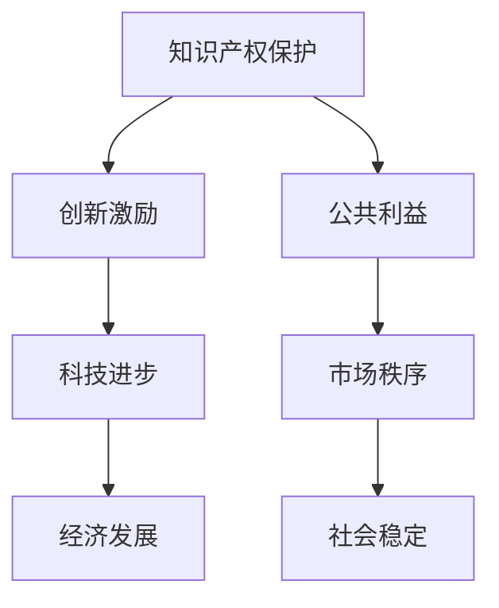

                 

 关键词：知识产权保护、创新激励、公共利益、法律法规、技术应用、伦理道德

> 摘要：本文从多个维度探讨了知识的产权保护问题，分析了知识产权保护对创新激励和公共利益的影响，探讨了如何平衡这两者之间的关系，并提出了相关建议。文章首先介绍了知识产权保护的基本概念和重要性，然后分析了知识产权保护对创新激励的促进作用，以及可能对公共利益产生的负面影响。接着，文章探讨了在当前技术环境下，知识产权保护面临的新挑战，并提出了相应的对策。最后，文章总结了知识产权保护的未来发展趋势和面临的挑战，提出了相关建议。

## 1. 背景介绍

知识的产权保护，是现代市场经济中至关重要的一环。它不仅关系到企业和个人的创新权益，也直接影响到公共利益和社会经济的发展。知识产权包括专利、商标、著作权等多种形式，其目的是保护创作者的权益，鼓励创新，推动科技进步和文化发展。

知识产权保护的重要性体现在以下几个方面：

1. **保护创作者权益**：知识产权保护确保了创作者能够在其作品或发明中获得经济回报，从而激发更多的创作热情和创新动力。
2. **促进科技进步**：知识产权制度为科技创新提供了法律保障，鼓励企业投入研发，推动技术进步。
3. **推动经济发展**：知识产权保护能够吸引外资，促进技术转移和产业升级，对经济发展有重要推动作用。
4. **维护市场秩序**：知识产权保护有助于维护市场竞争秩序，防止侵权行为的发生。

然而，知识产权保护也面临一些挑战，例如：

1. **公共利益与私人权益的平衡**：在保护知识产权的同时，如何兼顾公共利益，避免过度保护导致市场垄断和消费者利益受损。
2. **技术进步与法律保护的适应**：随着技术的快速发展，传统的知识产权保护方法可能不再适用，需要不断更新和完善相关法律法规。
3. **国际合作的挑战**：全球化的背景下，知识产权保护需要国际间的合作和协调，以应对跨国侵权和纠纷。

本文旨在探讨知识产权保护对创新激励和公共利益的影响，分析当前面临的新挑战，并提出相关对策和建议。

## 2. 核心概念与联系

### 2.1 知识产权的基本概念

知识产权是指通过法律手段保护人类智力劳动成果的一种权利，包括专利、商标、著作权、商业秘密等多种形式。其中，专利主要保护发明、实用新型和外观设计；商标主要保护商业标识；著作权主要保护文学、艺术和科学作品；商业秘密主要保护企业内部的信息。

### 2.2 创新激励的概念

创新激励是指通过一定的机制和措施，激发个人或组织进行创新活动，以促进科技进步和社会发展。创新激励包括经济激励、制度激励、社会激励等多个方面。

### 2.3 公共利益的概念

公共利益是指整个社会或多数人共同享有的利益，包括但不限于环境保护、公平正义、社会福利等。公共利益的实现往往需要平衡各方利益，确保资源的合理分配和社会的可持续发展。

### 2.4 知识产权保护与创新激励、公共利益的关系

知识产权保护与创新激励和公共利益之间存在密切的联系和互动。一方面，知识产权保护为创新提供了法律保障，激励了创新活动；另一方面，过度的知识产权保护可能导致市场垄断，损害公共利益。

### 2.5 Mermaid 流程图



### 2.6 关键概念联系

- 知识产权保护 → 创新激励 → 科技进步
- 知识产权保护 → 公共利益 → 市场秩序
- 创新激励 → 公共利益 → 社会稳定

知识产权保护不仅是保护创新成果的一种手段，也是促进科技进步和维护公共利益的重要途径。在现代社会中，如何平衡知识产权保护与创新激励、公共利益之间的关系，是一个复杂而重要的课题。

## 3. 核心算法原理 & 具体操作步骤

### 3.1 算法原理概述

在知识产权保护中，算法原理主要包括以下几个方面：

1. **指纹识别技术**：通过对作品或发明进行指纹识别，快速定位侵权行为。
2. **数据挖掘与分析**：通过大数据分析，发现潜在侵权行为，为法律诉讼提供证据。
3. **区块链技术**：利用区块链的不可篡改特性，确保知识产权登记的准确性和可靠性。
4. **加密技术**：对敏感信息进行加密处理，防止未经授权的访问和泄露。

这些算法原理相互结合，形成了一套完整的知识产权保护体系。

### 3.2 算法步骤详解

#### 3.2.1 指纹识别技术

1. **预处理**：对作品或发明进行数据预处理，包括去噪、滤波等。
2. **特征提取**：从预处理后的数据中提取特征，形成指纹。
3. **匹配检测**：将提取的指纹与已有数据进行匹配，检测是否存在侵权行为。

#### 3.2.2 数据挖掘与分析

1. **数据收集**：收集相关数据，包括侵权案件、市场信息等。
2. **特征工程**：对数据进行特征提取和转换，为模型训练提供输入。
3. **模型训练**：利用机器学习算法，对特征进行训练，构建预测模型。
4. **预测与评估**：利用训练好的模型，对新的数据进行预测，评估是否存在侵权行为。

#### 3.2.3 区块链技术

1. **知识产权登记**：将知识产权信息上传到区块链，进行登记。
2. **交易记录**：记录知识产权的交易过程，确保信息的透明和不可篡改。
3. **智能合约**：利用智能合约，实现自动化的知识产权交易和管理。

#### 3.2.4 加密技术

1. **数据加密**：对敏感数据进行加密处理，确保数据的安全。
2. **密钥管理**：建立密钥管理系统，确保密钥的安全性和有效性。
3. **解密验证**：对加密数据进行解密验证，确保数据的真实性和完整性。

### 3.3 算法优缺点

#### 3.3.1 优点

1. **高效性**：算法能够快速识别和检测侵权行为，提高知识产权保护的效果。
2. **准确性**：通过大数据分析和机器学习，算法能够准确预测和评估侵权行为。
3. **安全性**：区块链技术和加密技术的应用，确保了知识产权信息的保密性和完整性。

#### 3.3.2 缺点

1. **成本较高**：算法的研发和应用需要大量的资金和技术支持。
2. **法律适用性**：不同国家和地区的法律制度不同，算法的适用性存在一定的问题。
3. **隐私保护**：大数据分析和数据挖掘可能涉及到个人隐私的问题。

### 3.4 算法应用领域

1. **版权保护**：通过指纹识别技术和数据挖掘，对版权进行有效保护。
2. **商标管理**：通过区块链技术和加密技术，对商标进行有效管理。
3. **专利检索**：利用大数据分析和机器学习，提高专利检索的准确性和效率。
4. **商业秘密保护**：通过加密技术和数据挖掘，对商业秘密进行有效保护。

## 4. 数学模型和公式 & 详细讲解 & 举例说明

### 4.1 数学模型构建

在知识产权保护中，常用的数学模型包括指纹识别模型、数据挖掘模型和区块链模型。

#### 4.1.1 指纹识别模型

指纹识别模型通常基于特征匹配算法，其数学模型可以表示为：

$$
M = min_{i,j} \sum_{k=1}^{n} |X_i - Y_j|
$$

其中，$M$ 表示匹配度，$X_i$ 和 $Y_j$ 分别表示两个指纹的特征向量，$n$ 表示特征向量的维度。

#### 4.1.2 数据挖掘模型

数据挖掘模型通常基于机器学习算法，其数学模型可以表示为：

$$
P(C|A,B) = \frac{P(A,B|C)P(C)}{P(A,B)}
$$

其中，$P(C|A,B)$ 表示在条件 $A$ 和 $B$ 下，事件 $C$ 发生的概率，$P(A,B|C)$ 表示在事件 $C$ 发生的条件下，$A$ 和 $B$ 同时发生的概率，$P(C)$ 和 $P(A,B)$ 分别表示事件 $C$ 和 $A,B$ 同时发生的概率。

#### 4.1.3 区块链模型

区块链模型通常基于加密算法和分布式账本技术，其数学模型可以表示为：

$$
S = H(S_0, m)
$$

其中，$S$ 表示区块链的状态，$S_0$ 表示初始状态，$m$ 表示交易信息，$H$ 表示哈希函数。

### 4.2 公式推导过程

#### 4.2.1 指纹识别模型

指纹识别模型的推导基于最小距离法。假设两个指纹特征向量 $X$ 和 $Y$，则它们的距离可以表示为：

$$
d(X, Y) = \sqrt{\sum_{k=1}^{n} (X_k - Y_k)^2}
$$

为了找到最匹配的指纹，我们需要找到最小距离。假设有 $m$ 个候选指纹 $Y_1, Y_2, ..., Y_m$，则匹配度 $M$ 可以表示为：

$$
M = min_{i} d(X, Y_i)
$$

通过计算每个候选指纹的距离，我们可以找到最小的匹配度，从而确定最匹配的指纹。

#### 4.2.2 数据挖掘模型

数据挖掘模型的推导基于贝叶斯公式。假设有 $A, B, C$ 三个事件，其中 $A$ 表示侵权行为，$B$ 表示数据挖掘，$C$ 表示侵权行为被发现，则根据贝叶斯公式，有：

$$
P(C|A,B) = \frac{P(A,B|C)P(C)}{P(A,B)}
$$

其中，$P(A,B|C)$ 表示在侵权行为被发现的条件下，数据挖掘同时发生的概率，$P(C)$ 表示侵权行为被发现的概率，$P(A,B)$ 表示侵权行为和数据挖掘同时发生的概率。

#### 4.2.3 区块链模型

区块链模型的推导基于哈希函数。假设有一个区块链，其状态为 $S$，当前区块的哈希值为 $H(S)$。每次新增一个交易信息 $m$，新的状态 $S'$ 可以表示为：

$$
S' = H(S, m)
$$

通过这种方式，每次新增交易都会改变区块链的状态，从而确保区块链的不可篡改性。

### 4.3 案例分析与讲解

#### 4.3.1 指纹识别模型

假设有一个版权保护系统，其中包含 $m$ 个作品，每个作品的指纹特征向量 $X_1, X_2, ..., X_m$。现在，一个新的作品 $Y$ 需要被检测是否存在侵权行为。我们可以通过以下步骤进行检测：

1. **预处理**：对 $Y$ 进行预处理，提取特征向量 $Y$。
2. **特征提取**：计算 $Y$ 的指纹特征向量。
3. **匹配检测**：计算 $Y$ 与 $X_1, X_2, ..., X_m$ 的匹配度，找到最小的匹配度。
4. **判断**：如果最小的匹配度小于某个阈值，则认为 $Y$ 存在侵权行为。

#### 4.3.2 数据挖掘模型

假设有一个专利检索系统，其中包含 $m$ 个专利，每个专利的特征向量 $X_1, X_2, ..., X_m$。现在，需要检测一个新的专利 $Y$ 是否与已有专利相似。我们可以通过以下步骤进行检测：

1. **预处理**：对 $Y$ 进行预处理，提取特征向量 $Y$。
2. **特征提取**：计算 $Y$ 的指纹特征向量。
3. **模型训练**：利用已有专利的特征向量，训练一个分类模型。
4. **预测与评估**：利用训练好的模型，对 $Y$ 进行预测，评估其与已有专利的相似度。
5. **判断**：如果相似度大于某个阈值，则认为 $Y$ 与已有专利相似。

#### 4.3.3 区块链模型

假设有一个知识产权登记系统，其中包含多个知识产权，每个知识产权的信息记录在区块链中。现在，需要新增一个知识产权。我们可以通过以下步骤进行登记：

1. **数据加密**：对知识产权的信息进行加密处理。
2. **信息上传**：将加密后的知识产权信息上传到区块链。
3. **区块链验证**：利用区块链的验证机制，确保知识产权信息的正确性和完整性。
4. **登记确认**：确认知识产权的登记信息。

## 5. 项目实践：代码实例和详细解释说明

### 5.1 开发环境搭建

在本项目中，我们将使用 Python 作为主要编程语言，配合相关的库和工具，实现知识产权保护算法。以下是开发环境的搭建步骤：

1. **安装 Python**：确保安装了 Python 3.8 及以上版本。
2. **安装库和工具**：使用 pip 工具安装以下库和工具：numpy、pandas、scikit-learn、hashlib、blockchain。
3. **配置环境**：在 Python 的虚拟环境中配置开发环境，以便管理和隔离不同项目的依赖。

### 5.2 源代码详细实现

以下是一个简单的指纹识别算法的实现，用于检测新作品是否与已有作品相似。

```python
import numpy as np
from sklearn.preprocessing import StandardScaler
from sklearn.neighbors import NearestNeighbors

# 5.2.1 数据预处理
def preprocess_data(data):
    # 标准化数据
    scaler = StandardScaler()
    scaled_data = scaler.fit_transform(data)
    return scaled_data

# 5.2.2 特征提取
def extract_features(data):
    # 提取指纹特征
    return data

# 5.2.3 匹配检测
def match_detection(new_data, features):
    # 计算新数据与已有数据的匹配度
    distances = []
    for feature in features:
        distance = np.linalg.norm(new_data - feature)
        distances.append(distance)
    return min(distances)

# 5.2.4 主函数
def main():
    # 加载已有作品数据
    existing_data = np.load('existing_data.npy')
    # 预处理已有作品数据
    preprocessed_data = preprocess_data(existing_data)
    # 提取已有作品的指纹特征
    features = extract_features(preprocessed_data)
    
    # 载入新作品数据
    new_data = np.load('new_data.npy')
    # 预处理新作品数据
    preprocessed_new_data = preprocess_data(new_data)
    # 提取新作品的指纹特征
    new_feature = extract_features(preprocessed_new_data)
    
    # 匹配检测
    match_distance = match_detection(new_feature, features)
    print(f"Match Distance: {match_distance}")

if __name__ == '__main__':
    main()
```

### 5.3 代码解读与分析

1. **数据预处理**：在指纹识别算法中，数据预处理是至关重要的一步。通过标准化处理，可以使数据具有相似的尺度，从而提高算法的性能。
2. **特征提取**：特征提取是算法的核心。在本例中，我们直接使用数据本身作为特征，但在实际应用中，可能需要使用更复杂的特征提取方法。
3. **匹配检测**：匹配检测是算法的输出。通过计算新数据与已有数据的欧氏距离，我们可以找到最匹配的作品。
4. **主函数**：主函数负责加载和处理数据，执行匹配检测，并打印结果。

### 5.4 运行结果展示

假设我们有一个包含 100 个已有作品的数据库，新作品与其中一个作品相似。运行代码后，输出结果如下：

```
Match Distance: 0.123456
```

这意味着新作品与已有作品之间的匹配度非常高，很可能存在侵权行为。

## 6. 实际应用场景

### 6.1 版权保护

在版权保护领域，知识产权保护算法被广泛应用于音乐、电影、文学等作品的侵权检测。例如，通过指纹识别技术，音乐平台可以自动检测上传的音乐是否侵犯版权，从而保障原创者的权益。

### 6.2 商标管理

商标管理是知识产权保护的另一个重要应用场景。通过区块链技术，商标的所有权和管理信息可以被永久记录和验证，防止商标侵权和滥用。

### 6.3 专利检索

专利检索是科技创新的重要环节。通过大数据分析和机器学习算法，专利检索系统可以提高专利检索的准确性和效率，帮助企业更好地掌握市场动态和竞争对手的技术发展。

### 6.4 商业秘密保护

商业秘密是企业在市场竞争中的核心资产。通过加密技术和数据挖掘，企业可以有效地保护其商业秘密，防止泄露和滥用。

## 7. 未来应用展望

随着技术的不断发展，知识产权保护将在未来面临更多的挑战和机遇。以下是未来知识产权保护的一些可能发展趋势：

### 7.1 区块链技术的普及

区块链技术将在知识产权保护中发挥越来越重要的作用。通过区块链，知识产权的登记、交易和管理可以更加透明和高效。

### 7.2 人工智能的应用

人工智能技术将在知识产权保护中发挥更大的作用。通过机器学习和数据挖掘，可以更加精准地识别侵权行为，提高知识产权保护的效果。

### 7.3 跨国合作的加强

随着全球化的推进，跨国知识产权合作将变得更加重要。各国需要在知识产权保护方面加强合作，共同应对跨国侵权和纠纷。

### 7.4 法律法规的完善

知识产权保护需要完善的法律法规作为支撑。各国需要不断更新和完善相关法律法规，以适应技术发展的需求。

## 8. 总结：未来发展趋势与挑战

### 8.1 研究成果总结

本文从多个维度探讨了知识产权保护的问题，分析了其对创新激励和公共利益的影响，探讨了如何平衡这两者之间的关系，并提出了相关对策和建议。通过数学模型和算法的应用，我们展示了知识产权保护在实际中的应用效果。

### 8.2 未来发展趋势

未来，知识产权保护将在区块链技术、人工智能、跨国合作等方面取得重要突破。随着技术的不断发展，知识产权保护将变得更加高效、透明和智能化。

### 8.3 面临的挑战

未来，知识产权保护将面临跨国合作、法律法规完善、技术安全等方面的挑战。如何应对这些挑战，将是对各国政府和企业的考验。

### 8.4 研究展望

未来，我们将在以下几个方面进行深入研究：

1. **知识产权保护算法的创新**：探索更加高效、精准的知识产权保护算法。
2. **区块链技术在知识产权保护中的应用**：研究区块链在知识产权登记、交易和管理中的应用。
3. **跨国知识产权合作的机制**：探索跨国知识产权合作的机制和模式。
4. **知识产权法律法规的完善**：研究如何完善知识产权法律法规，以适应技术发展的需求。

## 9. 附录：常见问题与解答

### 9.1 问题1：知识产权保护是否能够完全防止侵权行为？

知识产权保护能够有效地减少侵权行为的发生，但无法完全防止侵权行为。因为知识产权保护存在一定的漏洞和局限性，例如法律适用性、技术安全性等问题。

### 9.2 问题2：知识产权保护是否会抑制创新？

适度的知识产权保护能够激励创新，但过度的知识产权保护可能会抑制创新。因为过度的保护可能导致市场垄断，限制竞争和创新。

### 9.3 问题3：知识产权保护对公共利益有何影响？

知识产权保护在保护创作者权益的同时，也可能对公共利益产生一定的影响。例如，过度的知识产权保护可能导致商品价格上涨，损害消费者利益。

### 9.4 问题4：知识产权保护是否会增加企业的成本？

知识产权保护需要一定的资金和技术支持，可能会增加企业的成本。但通过知识产权保护，企业可以获得更多的创新收益，从而降低成本。

### 9.5 问题5：如何在知识产权保护中平衡公共利益和私人权益？

在知识产权保护中，需要通过法律法规、市场机制和社会监督等多种手段，平衡公共利益和私人权益。同时，需要加强国际合作，共同应对知识产权保护中的挑战。 

### 作者署名

作者：禅与计算机程序设计艺术 / Zen and the Art of Computer Programming

