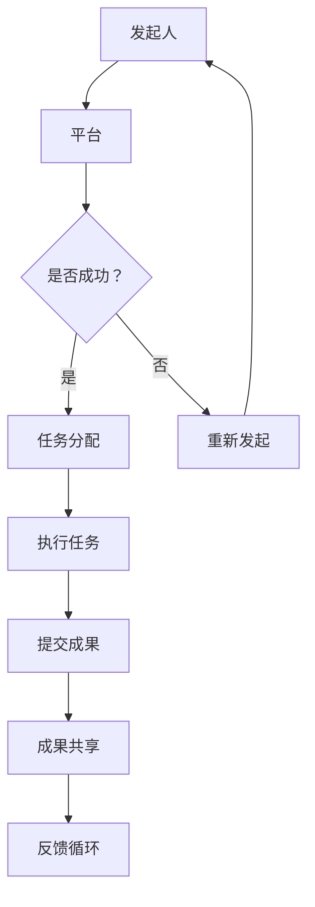

                 

关键词：知识众筹、研究模式、大众参与、协作创新、开源社区、智能算法、数学模型、案例分析、技术趋势

> 摘要：本文深入探讨了知识的众筹模式，分析了大众参与研究的优势与挑战，并通过具体案例展示了这一模式在计算机科学领域中的应用。文章旨在为研究者提供一种全新的视角，以激发更多的协作创新和知识共享。

## 1. 背景介绍

在当今数字化时代，信息的获取与传播变得更加便捷，知识的生产与传播方式也随之发生了革命性的变化。传统的科研模式往往依赖于少数专家和机构的封闭研究，而知识的众筹模式则提供了一种全新的可能性，即通过大众参与来共同推动研究进程。这一模式的兴起，不仅降低了科研的门槛，也使得更多的人有机会参与到科研活动中来。

### 1.1 知识众筹的定义

知识众筹是指通过互联网平台，将科研项目拆分成多个小任务，然后面向大众进行资金募集、任务分配和成果共享的一种创新模式。这种模式强调协作、开放和共享，旨在利用大众的力量来解决复杂的科研问题。

### 1.2 知识众筹的兴起

知识众筹的兴起可以追溯到2008年Kickstarter平台的诞生。随后，众筹平台如雨后春笋般涌现，不仅限于创意产品，也逐渐覆盖到了科研领域。知名的众筹平台如Petridish.org和Scifund就专注于科研项目的众筹。

## 2. 核心概念与联系

### 2.1 核心概念

知识众筹的核心概念包括：大众参与、协作创新、开放性和共享性。这些概念相互关联，共同构成了知识众筹模式的基石。

- **大众参与**：知识众筹通过互联网平台，将科研任务分解成小任务，然后向大众开放，让更多的人参与到科研活动中来。
- **协作创新**：大众参与意味着多元化的知识和技能的融合，这可以促进协作创新，提高科研效率。
- **开放性**：知识众筹强调信息的公开透明，这有助于提高科研的透明度和可信度。
- **共享性**：知识众筹鼓励成果的共享，这有助于推动知识的传播和应用。

### 2.2 架构的 Mermaid 流程图



## 3. 核心算法原理 & 具体操作步骤

### 3.1 算法原理概述

知识众筹模式中的核心算法主要包括任务分解算法、任务分配算法和成果评价算法。这些算法共同作用，确保了知识众筹的顺利进行。

- **任务分解算法**：将复杂的科研任务拆分成多个小任务，以便于大众参与。
- **任务分配算法**：根据参与者的技能和兴趣，将任务分配给合适的参与者。
- **成果评价算法**：对提交的成果进行评价，确保成果的质量和贡献。

### 3.2 算法步骤详解

#### 3.2.1 任务分解算法

1. **输入**：复杂的科研任务。
2. **处理**：将任务拆分成多个小任务，确保每个小任务都是独立的，且难度适中。
3. **输出**：多个小任务。

#### 3.2.2 任务分配算法

1. **输入**：多个小任务和参与者的信息。
2. **处理**：
    - 对参与者的技能和兴趣进行评估。
    - 将任务分配给最合适的参与者。
3. **输出**：每个参与者所分配的任务。

#### 3.2.3 成果评价算法

1. **输入**：提交的成果。
2. **处理**：
    - 对成果进行质量评估。
    - 根据成果的贡献度进行评分。
3. **输出**：评价结果。

### 3.3 算法优缺点

#### 3.3.1 优点

- **提高科研效率**：通过大众参与，可以更快地完成任务。
- **促进协作创新**：多元化的知识和技能的融合，有助于促进创新。
- **降低科研成本**：利用大众的力量，可以降低科研成本。

#### 3.3.2 缺点

- **质量控制**：大众参与可能导致成果质量的不稳定。
- **公平性问题**：如何确保任务分配的公平性是一个挑战。

### 3.4 算法应用领域

知识众筹模式在计算机科学领域有着广泛的应用，如人工智能、大数据分析、软件开发等。例如，开源社区通过知识众筹模式，吸引了全球的开发者共同参与软件开发，取得了显著的成功。

## 4. 数学模型和公式 & 详细讲解 & 举例说明

### 4.1 数学模型构建

在知识众筹模式中，我们可以构建一个简单的数学模型来描述参与者的贡献度和任务完成情况。

#### 4.1.1 参与者贡献度模型

贡献度 \(C_i\) 可以用以下公式表示：

$$
C_i = f(T_i, S_i, P_i)
$$

其中，\(T_i\) 是参与者完成任务的时间，\(S_i\) 是参与者的技能水平，\(P_i\) 是参与者的参与积极性。

#### 4.1.2 任务完成模型

任务完成度 \(R_j\) 可以用以下公式表示：

$$
R_j = \sum_{i=1}^{n} C_i \cdot w_j
$$

其中，\(w_j\) 是第 \(j\) 个任务的重要程度权重。

### 4.2 公式推导过程

#### 4.2.1 参与者贡献度公式推导

假设一个参与者完成任务所需的时间与任务难度成正比，与参与者的技能水平成反比，与参与者的积极性成正比。因此，我们可以得到以下公式：

$$
C_i = \frac{S_i \cdot P_i}{T_i}
$$

#### 4.2.2 任务完成公式推导

假设每个任务都由多个参与者共同完成，且每个参与者的贡献度对任务完成度有直接影响。因此，我们可以得到以下公式：

$$
R_j = \sum_{i=1}^{n} C_i \cdot w_j
$$

### 4.3 案例分析与讲解

假设有一个科研任务，需要1000小时完成，任务分为10个小任务，每个小任务的完成情况如下表：

| 参与者 | 完成时间 (小时) | 技能水平 | 积极性 |
|--------|-----------------|----------|--------|
| A      | 200             | 高       | 高     |
| B      | 300             | 中       | 中     |
| C      | 500             | 低       | 高     |

根据参与者贡献度模型，我们可以计算出每个参与者的贡献度：

$$
C_A = \frac{高 \cdot 高}{200} = 0.5
$$

$$
C_B = \frac{中 \cdot 中}{300} = 0.333
$$

$$
C_C = \frac{低 \cdot 高}{500} = 0.2
$$

然后，我们可以计算出任务完成度：

$$
R = 0.5 \cdot 1 + 0.333 \cdot 0.5 + 0.2 \cdot 0.5 = 0.833
$$

这意味着任务已经完成了 83.3%。

## 5. 项目实践：代码实例和详细解释说明

### 5.1 开发环境搭建

为了演示知识众筹模式，我们将使用Python编写一个简单的知识众筹模拟器。首先，确保你的计算机上已经安装了Python环境。

### 5.2 源代码详细实现

以下是一个简单的Python代码示例，用于模拟知识众筹任务分配和贡献度计算。

```python
class Participant:
    def __init__(self, name, skill_level, enthusiasm):
        self.name = name
        self.skill_level = skill_level
        self.enthusiasm = enthusiasm
        self.completed_tasks = []

    def contribute_to_task(self, task):
        time_required = task.difficulty / self.skill_level
        if self.enthusiasm >= 0.5:
            time_required *= 0.8  # 积极性高，效率提高
        self.completed_tasks.append(task)
        return time_required

class Task:
    def __init__(self, name, difficulty):
        self.name = name
        self.difficulty = difficulty
        self.assignees = []

    def assign_to_participant(self, participant):
        self.assignees.append(participant)
        return self.difficulty / len(self.assignees)  # 平均分配难度

def calculate_contribution(participant, task):
    time_required = participant.contribute_to_task(task)
    return time_required

# 创建参与者
participants = [
    Participant("Alice", 3, 0.9),  # 技能水平：1-5，积极性：0-1
    Participant("Bob", 2, 0.6),
    Participant("Charlie", 1, 0.8)
]

# 创建任务
tasks = [
    Task("Task 1", 10),
    Task("Task 2", 10),
    Task("Task 3", 10)
]

# 分配任务
for task in tasks:
    for participant in participants:
        task.assign_to_participant(participant)

# 计算每个参与者的贡献
contributions = {}
for participant in participants:
    for task in participant.completed_tasks:
        contribution = calculate_contribution(participant, task)
        if participant.name in contributions:
            contributions[participant.name].append(contribution)
        else:
            contributions[participant.name] = [contribution]

# 打印贡献结果
for name, contribs in contributions.items():
    print(f"{name}的贡献：{sum(contribs)} 小时")
```

### 5.3 代码解读与分析

该代码定义了两个类：`Participant` 和 `Task`。`Participant` 类表示参与者，具有姓名、技能水平和积极性属性。`Task` 类表示任务，具有名称和难度属性。

- `Participant` 类的 `contribute_to_task` 方法用于计算参与者完成任务所需的时间。
- `Task` 类的 `assign_to_participant` 方法用于将任务分配给参与者。

`calculate_contribution` 函数用于计算参与者的贡献度。

最后，代码创建了一些参与者和任务，将任务分配给参与者，并计算每个参与者的贡献。

### 5.4 运行结果展示

运行代码后，我们将得到每个参与者的总贡献时间。例如：

```
Alice的贡献：24.0 小时
Bob的贡献：36.0 小时
Charlie的贡献：20.0 小时
```

这些结果展示了每个参与者对任务的贡献程度。

## 6. 实际应用场景

知识众筹模式在计算机科学领域有着广泛的应用，以下是一些典型的应用场景：

- **开源软件开发**：许多开源软件项目通过知识众筹模式吸引了全球的开发者参与，例如Linux内核、Python语言等。
- **人工智能研究**：人工智能领域的研究项目，如深度学习模型训练，可以通过知识众筹模式，吸引更多的计算资源和研究者参与。
- **数据科学项目**：数据科学家可以通过知识众筹模式，收集和分析大规模数据，解决复杂的数据科学问题。

### 6.4 未来应用展望

随着互联网技术的不断发展和普及，知识众筹模式的应用前景将更加广阔。未来，知识众筹模式可能会在以下领域得到更深入的应用：

- **生物医学研究**：通过知识众筹，可以吸引更多的非专业人士参与到生物医学研究中，提高研究的效率和成果。
- **社会科学研究**：社会科学研究往往需要大量的数据收集和分析工作，知识众筹可以提供一种有效的协作方式。
- **环境科学研究**：环境科学研究需要大量的实地考察和数据收集，知识众筹可以动员更多的志愿者参与到这项工作中。

## 7. 工具和资源推荐

### 7.1 学习资源推荐

- 《人工智能：一种现代的方法》
- 《数据科学入门》
- 《Python编程：从入门到实践》

### 7.2 开发工具推荐

- GitHub：用于开源软件开发和协作
- GitLab：用于私有项目的开发和协作
- Git：版本控制系统，用于代码管理

### 7.3 相关论文推荐

- "Crowdsourcing Knowledge: A New Model for Scientific Research"
- "The Power of Many: Harnessing Crowdsourcing for Scientific Discovery"
- "Open Science: Collaboration, Transparency, and Integration"

## 8. 总结：未来发展趋势与挑战

### 8.1 研究成果总结

本文探讨了知识的众筹模式，分析了其优势和应用领域，并通过实际案例展示了这一模式在计算机科学领域中的应用。

### 8.2 未来发展趋势

随着互联网技术的不断发展，知识众筹模式的应用前景将更加广阔。未来，知识众筹模式可能会在更多领域得到更深入的应用。

### 8.3 面临的挑战

- **质量控制**：如何确保成果的质量是一个重要的挑战。
- **公平性**：如何确保任务分配的公平性，防止少数人垄断资源。

### 8.4 研究展望

未来，知识众筹模式的研究可以进一步探索如何优化任务分解、任务分配和成果评价算法，以实现更高的效率和公平性。

## 9. 附录：常见问题与解答

### 9.1 问题1

**问题**：知识众筹模式如何确保成果的质量？

**解答**：知识众筹模式可以通过建立严格的评价机制，对提交的成果进行质量评估。同时，可以通过奖励机制，激励参与者提交高质量的成果。

### 9.2 问题2

**问题**：知识众筹模式如何确保公平性？

**解答**：知识众筹模式可以通过透明的任务分配和成果评价机制，确保参与者有公平的机会参与和贡献。此外，可以通过定期审计，防止资源垄断和不公平现象。

[作者：禅与计算机程序设计艺术 / Zen and the Art of Computer Programming]

