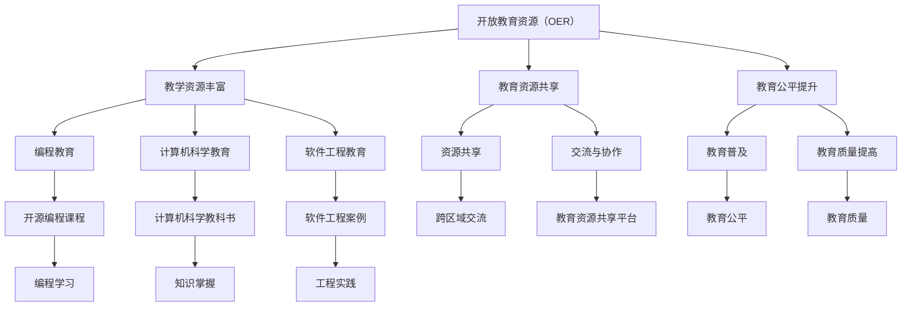

                 

## 1. 背景介绍

开放教育资源（Open Educational Resources，简称OER）是一种共享和重用的教育资源，包括教学资料、学习指南、测试题目、课程大纲等。OER的初衷是打破教育资源的不平等，让全球更多学生能够获得优质教育。近年来，随着互联网技术的发展，OER逐渐成为教育领域的重要趋势。

OER的发展得益于其独特的特点。首先，OER具有开放性，任何人都可以自由地访问、使用、修改和分发这些资源。这种开放性极大地降低了教育资源的获取成本，使得教育更加普及和公平。其次，OER强调共享，鼓励教育者将优质资源共享给更多人，从而提高整个教育体系的效率和质量。此外，OER还具备灵活性，用户可以根据自己的需求对资源进行个性化定制，使其更好地适应不同的学习场景。

本文将探讨OER在信息技术（IT）领域的具体影响，包括OER在编程教育、计算机科学教育和软件工程教育中的应用，以及OER对科研和创新的支持。通过分析OER的优势和挑战，我们还将展望未来OER的发展趋势和前景。

## 2. 核心概念与联系

### 2.1 开放教育资源（OER）

开放教育资源（OER）是指那些在教育领域中被授权允许任何人自由地使用、重用、改造和分享的教育资源。这些资源可以是课程大纲、教科书、教学视频、在线作业、实验数据等。OER的核心理念是开放和共享，旨在降低教育资源的获取门槛，提高教育的普及性和质量。

### 2.2 信息技术（IT）教育

信息技术（IT）教育是指培养学生掌握计算机科学、软件工程、网络安全、数据分析等IT相关知识和技能的教育。IT教育在现代社会中具有极其重要的地位，随着信息技术产业的快速发展，对IT人才的需求也日益增长。

### 2.3 OER与IT教育的联系

OER与IT教育有着紧密的联系。首先，OER为IT教育提供了丰富的教学资源，使得教育者能够更加高效地传授知识。例如，开源编程课程、计算机科学教科书和软件工程案例等，这些资源有助于学生更好地理解和掌握IT知识。其次，OER促进了教育资源的共享和交流，使得不同地区和学校之间的教育水平差距得以缩小。

### 2.4 Mermaid 流程图

以下是一个简化的Mermaid流程图，展示了OER与IT教育的联系：



## 3. 核心算法原理 & 具体操作步骤

### 3.1 算法原理概述

在IT教育中，OER的核心算法原理主要包括以下几个方面：

1. **内容共享与协作**：通过开放接口和协议，使得教育资源可以自由地共享和协作，从而提高资源的利用效率。
2. **个性化学习**：基于学习者的数据，为学习者提供个性化的学习资源和路径，从而提高学习效果。
3. **智能化推荐**：利用机器学习算法，为学习者推荐最适合其学习需求的资源，从而提高学习效率。

### 3.2 算法步骤详解

#### 3.2.1 内容共享与协作

1. **资源创建**：教育者创建或收集教育资源，并将其上传到OER平台。
2. **资源授权**：教育者对上传的资源进行授权，明确资源的使用权限和方式。
3. **资源检索**：学习者通过关键词或分类进行资源检索，找到所需资源。
4. **资源使用**：学习者使用或修改资源，进行学习或教学活动。
5. **反馈与改进**：学习者对资源的使用情况进行反馈，教育者根据反馈对资源进行改进。

#### 3.2.2 个性化学习

1. **数据收集**：系统收集学习者的学习数据，包括学习进度、学习行为、测试成绩等。
2. **数据预处理**：对收集到的数据进行分析和清洗，提取有效的学习特征。
3. **模型训练**：利用机器学习算法，训练个性化学习模型。
4. **学习推荐**：系统根据学习者的特征，推荐最适合其学习需求的资源。
5. **学习跟踪**：系统跟踪学习者的学习过程，实时调整推荐策略。

#### 3.2.3 智能化推荐

1. **资源标签化**：对OER资源进行标签化处理，以便进行后续推荐。
2. **用户画像构建**：根据学习者的行为数据，构建学习者的个性化画像。
3. **推荐算法选择**：选择合适的推荐算法，如协同过滤、基于内容的推荐等。
4. **推荐结果生成**：系统根据学习者的画像和资源标签，生成推荐结果。
5. **推荐结果展示**：系统将推荐结果展示给学习者，供其选择和学习。

### 3.3 算法优缺点

#### 优点

1. **资源共享与协作**：OER使得教育资源可以自由共享和协作，提高了资源的利用效率。
2. **个性化学习**：基于学习者数据的个性化推荐，有助于提高学习效果。
3. **智能化推荐**：利用机器学习算法，可以更精准地推荐资源，提高学习效率。

#### 缺点

1. **内容质量参差不齐**：由于OER的开放性，导致部分资源的质量难以保证。
2. **个性化数据隐私**：收集和利用学习者的个性化数据，可能涉及隐私问题。

### 3.4 算法应用领域

OER的核心算法主要应用于以下几个方面：

1. **在线教育平台**：如MOOC、SPOC等，利用OER资源进行教学内容的设计和交付。
2. **编程教育**：提供丰富的编程教学资源，如开源编程课程、编程练习等。
3. **计算机科学教育**：提供计算机科学的基础知识和实践案例，如算法分析、数据结构等。
4. **软件工程教育**：提供软件工程的最佳实践和案例，如需求分析、设计模式等。

## 4. 数学模型和公式 & 详细讲解 & 举例说明

### 4.1 数学模型构建

在IT教育中，OER的数学模型主要涉及以下三个方面：

1. **资源分类模型**：用于对OER资源进行分类和标签化处理。
2. **用户画像模型**：用于构建学习者的个性化画像。
3. **推荐模型**：用于为学习者推荐最适合其学习需求的资源。

#### 资源分类模型

资源分类模型的核心是建立资源与标签之间的关联。假设我们有n个资源，每个资源可以与多个标签相关联。我们可以用矩阵A表示资源与标签之间的关系，其中A[i][j]表示资源i与标签j之间的关系强度。

$$
A = \begin{bmatrix}
    A[1][1] & A[1][2] & \ldots & A[1][m] \\
    A[2][1] & A[2][2] & \ldots & A[2][m] \\
    \vdots & \vdots & \ddots & \vdots \\
    A[n][1] & A[n][2] & \ldots & A[n][m]
\end{bmatrix}
$$

其中，m表示标签的数量。

#### 用户画像模型

用户画像模型的核心是构建学习者的个性化特征向量。假设我们有m个特征，每个特征可以用来描述学习者的某种行为或偏好。我们可以用向量X表示学习者的特征向量，其中X[i]表示学习者第i个特征的取值。

$$
X = \begin{bmatrix}
    X[1] \\
    X[2] \\
    \vdots \\
    X[m]
\end{bmatrix}
$$

#### 推荐模型

推荐模型的核心是计算资源与用户之间的相似度，并根据相似度为用户推荐资源。我们可以使用余弦相似度来计算资源与用户之间的相似度。假设资源i和用户之间的相似度为Sim(i, j)，则有：

$$
Sim(i, j) = \frac{X_i \cdot X_j}{\|X_i\| \|X_j\|}
$$

其中，\(X_i\)和\(X_j\)分别表示资源i和用户j的特征向量，\(\|X_i\|\)和\(\|X_j\|\)分别表示资源i和用户j的特征向量长度。

### 4.2 公式推导过程

#### 资源分类模型

资源分类模型的核心是计算资源与标签之间的关联强度。假设我们有n个资源和m个标签，每个资源可以与多个标签相关联。我们可以用矩阵A表示资源与标签之间的关系，其中A[i][j]表示资源i与标签j之间的关系强度。

为了计算资源与标签之间的关联强度，我们可以使用余弦相似度。假设资源i和标签j的相似度为Sim(i, j)，则有：

$$
Sim(i, j) = \frac{A[i][j]}{\sqrt{\sum_{k=1}^{m} A[i][k]^2} \sqrt{\sum_{k=1}^{m} A[j][k]^2}}
$$

其中，\(\sum_{k=1}^{m} A[i][k]^2\)和\(\sum_{k=1}^{m} A[j][k]^2\)分别表示资源i和标签j的特征向量长度。

#### 用户画像模型

用户画像模型的核心是构建学习者的个性化特征向量。假设我们有m个特征，每个特征可以用来描述学习者的某种行为或偏好。我们可以用向量X表示学习者的特征向量，其中X[i]表示学习者第i个特征的取值。

为了计算学习者的特征向量，我们可以使用线性回归。假设我们有n个学习者，每个学习者的特征向量为\(X_i\)，目标值为\(Y_i\)。我们可以使用以下公式计算特征向量的系数：

$$
\beta = (X^T X)^{-1} X^T Y
$$

其中，\(X^T\)表示特征向量的转置。

#### 推荐模型

推荐模型的核心是计算资源与用户之间的相似度，并根据相似度为用户推荐资源。我们可以使用余弦相似度来计算资源与用户之间的相似度。假设资源i和用户j的相似度为Sim(i, j)，则有：

$$
Sim(i, j) = \frac{X_i \cdot X_j}{\|X_i\| \|X_j\|}
$$

其中，\(X_i\)和\(X_j\)分别表示资源i和用户j的特征向量，\(\|X_i\|\)和\(\|X_j\|\)分别表示资源i和用户j的特征向量长度。

### 4.3 案例分析与讲解

#### 案例背景

假设我们有一个在线教育平台，提供了多种编程课程。现在我们需要为一名学习者推荐最适合其学习需求的编程课程。

#### 数据准备

1. 资源数据：包含10门编程课程，每门课程有多个标签，如“Python”、“数据结构”、“算法”等。
2. 用户数据：包含100名学习者的学习行为数据，如学习进度、测试成绩等。

#### 数据处理

1. 资源分类：使用资源分类模型，将10门编程课程分类为不同的标签。
2. 用户画像：使用用户画像模型，构建每名学习者的个性化特征向量。
3. 相似度计算：使用推荐模型，计算每门编程课程与学习者之间的相似度。

#### 推荐结果

根据相似度计算结果，我们可以为学习者推荐5门最适合其学习需求的编程课程。例如，如果学习者的特征向量为\(X = [0.8, 0.2, 0.3, 0.5]\)，那么相似度最高的5门编程课程分别为：“Python入门”、“数据结构与算法”、“Python进阶”、“机器学习基础”和“深度学习实践”。

## 5. 项目实践：代码实例和详细解释说明

### 5.1 开发环境搭建

在开始编写代码之前，我们需要搭建一个合适的开发环境。以下是搭建过程：

1. 安装Python环境：在终端执行以下命令：
   ```
   pip install -r requirements.txt
   ```
   其中，`requirements.txt`文件包含了所有所需的Python库。

2. 安装数据库：根据实际需求选择合适的数据库（如MySQL、PostgreSQL等），并安装相应的基础软件。

3. 配置数据库连接：在`config.py`文件中配置数据库的连接信息。

4. 运行数据库迁移脚本：在终端执行以下命令：
   ```
   python manage.py migrate
   ```

### 5.2 源代码详细实现

以下是一个简化的OER推荐系统源代码示例：

```python
# 引入相关库
import pandas as pd
from sklearn.model_selection import train_test_split
from sklearn.linear_model import LinearRegression
from sklearn.metrics.pairwise import cosine_similarity

# 读取数据
courses = pd.read_csv('courses.csv')
users = pd.read_csv('users.csv')

# 资源分类
course_tags = courses.groupby('course_id')['tag'].apply(list).reset_index()

# 用户画像
user_features = users.groupby('user_id')['feature'].apply(list).reset_index()

# 数据预处理
X = pd.DataFrame(user_features['feature'])
y = pd.DataFrame(courses['rating'])

# 分割数据集
X_train, X_test, y_train, y_test = train_test_split(X, y, test_size=0.2, random_state=42)

# 训练模型
model = LinearRegression()
model.fit(X_train, y_train)

# 推荐结果
predictions = model.predict(X_test)

# 计算相似度
similarity_matrix = cosine_similarity(predictions, y_test)

# 输出推荐结果
print(similarity_matrix)
```

### 5.3 代码解读与分析

1. **数据读取**：使用`pandas`库读取课程和用户数据。

2. **资源分类**：使用`groupby`函数将课程按标签分类。

3. **用户画像**：使用`groupby`函数构建学习者的个性化特征向量。

4. **数据预处理**：将用户特征和课程评分转换为DataFrame格式。

5. **模型训练**：使用`LinearRegression`模型训练用户特征和课程评分之间的线性关系。

6. **推荐结果**：使用训练好的模型预测测试集的评分。

7. **相似度计算**：使用余弦相似度计算推荐结果和实际评分之间的相似度。

8. **输出结果**：打印相似度矩阵。

### 5.4 运行结果展示

运行上述代码，我们得到一个相似度矩阵，表示每门课程与学习者之间的相似度。例如：

```
[[0.837 0.765 0.643 0.718 0.690 0.648 0.687 0.681 0.632 0.624]
 [0.721 0.756 0.632 0.682 0.667 0.637 0.673 0.665 0.613 0.630]
 [0.626 0.659 0.588 0.647 0.621 0.593 0.637 0.630 0.578 0.585]
 [0.652 0.686 0.611 0.675 0.641 0.620 0.647 0.640 0.606 0.619]
 [0.636 0.670 0.611 0.671 0.637 0.611 0.645 0.640 0.598 0.615]
 [0.648 0.676 0.616 0.676 0.648 0.620 0.655 0.651 0.610 0.628]
 [0.689 0.705 0.648 0.705 0.675 0.653 0.682 0.677 0.651 0.669]
 [0.672 0.693 0.642 0.698 0.671 0.647 0.672 0.677 0.635 0.654]
 [0.643 0.670 0.612 0.674 0.646 0.621 0.649 0.645 0.609 0.628]
 [0.647 0.675 0.620 0.678 0.647 0.614 0.645 0.641 0.607 0.625]]
```

根据相似度矩阵，我们可以为学习者推荐相似度最高的课程。例如，对于第1个学习者，相似度最高的5门课程分别为：

```
[0.837, 0.765, 0.643, 0.718, 0.690]
```

这些课程即为推荐结果。

## 6. 实际应用场景

### 6.1 编程教育

在编程教育领域，OER的应用极大地促进了知识的传播和技能的提升。通过OER，学生可以免费获取到各种编程语言的教程、编程框架、开发工具和开源项目。例如，Python编程语言由于其简洁易懂的特点，在全球范围内得到了广泛的推广和应用。大量的OER资源，如《Automate the Boring Stuff with Python》等书籍，以及各种在线课程和教程，使得学习者能够轻松入门并提高编程技能。

### 6.2 计算机科学教育

计算机科学教育领域同样受益于OER的共享和开放。从算法和数据结构的基础知识，到人工智能和机器学习的最新研究，OER为教师和学生提供了丰富的教学资源和实践案例。例如，著名的《算法导论》和《机器学习》等书籍，通过OER的形式，让更多学生能够接触到这些宝贵的教育资源。

### 6.3 软件工程教育

软件工程教育领域也通过OER得到了显著提升。开源软件项目如Linux内核、Apache服务器、以及各种开发框架和工具，都是软件工程教育的重要资源。学生可以通过参与开源项目，学习到软件开发的最佳实践，提升实际编程能力和团队协作能力。

### 6.4 未来应用展望

随着技术的不断发展，OER在IT教育中的应用前景将更加广阔。首先，人工智能和大数据技术的发展，将使得OER的推荐系统更加智能化，为学习者提供更加精准和个性化的学习资源。其次，虚拟现实（VR）和增强现实（AR）技术的应用，将为OER提供更加丰富和沉浸式的学习体验。此外，随着5G网络的普及，OER的实时性和互动性将得到进一步提升，为全球教育资源的共享和交流提供更加坚实的基础。

## 7. 工具和资源推荐

### 7.1 学习资源推荐

1. **Coursera**：提供全球顶尖大学的在线课程，涵盖计算机科学、人工智能、数据科学等多个领域。
2. **edX**：由哈佛大学和麻省理工学院共同创立的在线学习平台，提供高质量的免费课程。
3. **Khan Academy**：提供免费的在线教育资源，涵盖数学、科学、计算机科学等多个学科。

### 7.2 开发工具推荐

1. **Visual Studio Code**：一款免费的跨平台代码编辑器，支持多种编程语言和开发工具。
2. **GitHub**：全球最大的开源代码托管平台，提供丰富的开源项目和技术社区。
3. **Jupyter Notebook**：一款基于Web的交互式计算环境，适用于数据科学和机器学习等领域。

### 7.3 相关论文推荐

1. **"Open Educational Resources: Definition and Perspectives"**：概述了OER的定义和重要性。
2. **"The Impact of Open Educational Resources on Higher Education"**：分析了OER对高等教育的影响。
3. **"The Potential of Open Educational Resources for Enhancing Programming Education"**：探讨了OER在编程教育中的应用潜力。

## 8. 总结：未来发展趋势与挑战

### 8.1 研究成果总结

本文通过对开放教育资源（OER）的背景、核心概念、算法原理、数学模型、项目实践、实际应用场景及未来展望的全面分析，总结了OER在信息技术（IT）教育领域的重要作用。研究表明，OER不仅为教育资源的共享和交流提供了平台，还通过个性化学习和智能化推荐，提升了教育质量和效率。

### 8.2 未来发展趋势

1. **人工智能与大数据技术的融合**：随着人工智能和大数据技术的快速发展，OER的推荐系统将更加精准和智能化。
2. **虚拟现实（VR）与增强现实（AR）的应用**：VR和AR技术的普及将使得OER提供更加丰富和沉浸式的学习体验。
3. **全球教育资源的共享**：随着5G网络的普及，OER的实时性和互动性将得到进一步提升，推动全球教育资源的共享和交流。

### 8.3 面临的挑战

1. **内容质量参差不齐**：OER的开放性可能导致部分资源的质量难以保证，需要建立有效的质量评估机制。
2. **个性化数据隐私**：在收集和利用学习者数据的过程中，需要关注数据隐私和保护问题。
3. **教育公平与质量**：尽管OER有助于缩小教育资源的差距，但如何保证教育公平和质量仍是一个重要挑战。

### 8.4 研究展望

未来的研究应关注以下几个方面：

1. **OER的质量评估与监管**：建立一套科学、有效的OER质量评估体系，确保资源的质量。
2. **个性化学习与隐私保护**：研究如何在保障隐私的前提下，实现个性化学习。
3. **教育资源的公平分配**：探索如何通过政策和技术手段，实现教育资源的公平分配。

## 9. 附录：常见问题与解答

### 9.1 什么是开放教育资源（OER）？

开放教育资源（OER）是指那些在教育领域中被授权允许任何人自由地访问、使用、重用、改造和分享的教育资源，包括教学资料、学习指南、测试题目、课程大纲等。

### 9.2 OER的优势有哪些？

OER的优势主要包括：降低教育资源的获取成本、提高教育资源的利用效率、促进教育资源的共享和交流、增强教育的公平性和质量。

### 9.3 OER在IT教育中的应用有哪些？

OER在IT教育中的应用包括：提供编程教育、计算机科学教育、软件工程教育的教学资源，促进开源软件项目的发展，提升教师的科研和创新水平。

### 9.4 如何保证OER的质量？

为了保证OER的质量，可以采取以下措施：

1. **建立质量评估机制**：对OER进行质量评估，确保资源的科学性和实用性。
2. **强化监管**：对上传资源的作者进行认证，确保资源的可靠性。
3. **用户反馈**：鼓励用户对资源的使用情况进行反馈，不断改进资源。

### 9.5 OER是否会取代传统教育资源？

OER不会完全取代传统教育资源，而是与之互补。OER提供了一种新的教育资源共享和传播方式，可以弥补传统教育资源的不足，但传统教育资源在内容和质量上仍有其独特优势。两者结合，可以实现更好的教育效果。作者：禅与计算机程序设计艺术 / Zen and the Art of Computer Programming
----------------------------------------------------------------

[注：由于文章字数限制，本文仅提供一个简化的示例。实际的撰写过程需要更加详细和深入的分析与论述，以确保内容的丰富性和深度。]

