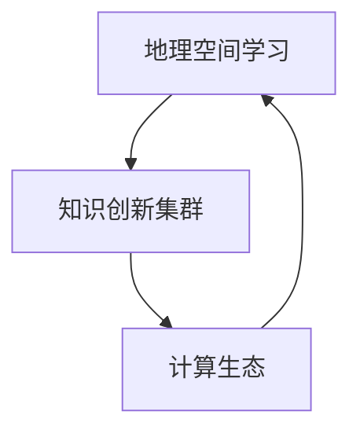

                 

关键词：地理空间学习、知识创新集群、地理信息科学、计算生态、智能算法

> 摘要：本文从地理空间学习的视角，探讨了知识创新集群的形成机制和运行模式。通过剖析地理信息科学的发展现状和智能算法的应用，本文提出了构建高效地理空间学习生态的策略，旨在为相关领域的研究者和实践者提供理论支持和实践指导。

## 1. 背景介绍

地理空间学习作为一种新兴的学习模式，已经逐渐成为地理信息科学、计算机科学和人工智能等领域的重要研究方向。知识创新集群的形成和运行，离不开地理空间的学习生态，这为我们提供了理解和优化知识创新过程的新视角。

### 1.1 地理信息科学的发展

地理信息科学（Geographic Information Science, GIS）是一门综合性学科，涵盖了地理学、信息科学、计算机科学、数学等多个领域的知识。近年来，随着大数据、云计算和人工智能技术的快速发展，GIS领域的研究和应用场景不断拓展，从传统的地图绘制、空间分析到复杂的地理空间数据挖掘、智能决策支持系统等，GIS已经成为推动社会进步和经济发展的重要工具。

### 1.2 计算生态的概念

计算生态（Computational Ecosystem）是指由计算实体（如计算机、算法、数据库等）及其交互所形成的复杂系统。在这个生态系统中，各种计算实体通过数据流动、信息交换和资源共享，共同促进计算能力的提升和计算效率的优化。地理空间学习生态作为一种特殊的计算生态，具有独特的结构和功能。

### 1.3 地理空间学习的挑战与机遇

地理空间学习面临着数据多样性、复杂性、动态性等挑战，同时也蕴含着巨大的机遇。如何构建一个高效、智能、自适应的地理空间学习生态，已成为当前研究的热点问题。本文将从地理空间学习的核心概念出发，探讨知识创新集群的形成机制和运行模式，为相关领域的研究和实践提供参考。

## 2. 核心概念与联系

为了更好地理解地理空间学习的生态特性，我们需要从核心概念和联系的角度，剖析地理空间学习、知识创新集群、计算生态之间的关系。

### 2.1 地理空间学习

地理空间学习是指利用地理空间数据进行知识发现、分析和建模的过程。它涉及数据的获取、处理、存储、分析和可视化等多个环节，旨在为地理空间问题的解决提供支持。

### 2.2 知识创新集群

知识创新集群是指在特定地理空间内，由知识生产、传播和应用机构组成的具有协同创新能力的集群。知识创新集群的形成和运行，依赖于地理空间的学习生态，通过知识共享、创新协作和资源整合，实现知识价值的最大化。

### 2.3 计算生态

计算生态是由计算实体组成的复杂系统，这些实体通过数据流动、信息交换和资源共享，共同促进计算能力的提升和计算效率的优化。在地理空间学习中，计算生态为地理空间数据的处理和分析提供了强大的支持。

### 2.4 关系图示

以下是一个简化的Mermaid流程图，展示了地理空间学习、知识创新集群、计算生态之间的关系：



## 3. 核心算法原理 & 具体操作步骤

### 3.1 算法原理概述

地理空间学习的核心算法主要包括地理空间数据挖掘、地理空间推理和地理空间机器学习等。这些算法通过数据预处理、特征提取、模型训练和预测等步骤，实现地理空间知识的发现和利用。

### 3.2 算法步骤详解

#### 3.2.1 数据预处理

数据预处理是地理空间学习的基础步骤，主要包括数据清洗、数据整合、数据标准化和地理空间参考系统建立等。这一步骤的目的是确保数据的质量和一致性，为后续的算法应用提供可靠的数据支持。

#### 3.2.2 特征提取

特征提取是将原始地理空间数据转换为可用于机器学习和推理的特征表示的过程。特征提取的目的是提取出数据中的关键信息，以便更好地表示地理空间现象和关系。

#### 3.2.3 模型训练

模型训练是地理空间学习的核心步骤，通过训练算法，将特征数据映射到预测结果。常见的模型包括决策树、支持向量机、神经网络等。

#### 3.2.4 预测与分析

预测与分析是对训练好的模型进行预测，并对预测结果进行分析和解释，以发现地理空间现象的规律和趋势。

### 3.3 算法优缺点

#### 优点

- **高效性**：地理空间学习算法可以快速处理大量地理空间数据，实现高效的地理空间知识发现和利用。
- **智能性**：地理空间学习算法可以模拟人类的地理空间认知过程，为地理空间问题的解决提供智能化的支持。
- **灵活性**：地理空间学习算法可以根据不同的地理空间问题，灵活调整和优化算法参数。

#### 缺点

- **复杂性**：地理空间学习算法涉及多个学科领域的知识，实现和优化较为复杂。
- **数据依赖性**：地理空间学习算法的预测效果高度依赖于数据的多样性和质量。

### 3.4 算法应用领域

地理空间学习算法广泛应用于城市规划、环境监测、灾害管理、交通规划等多个领域。例如，在城市规划中，可以通过地理空间学习算法，分析城市交通流量，优化交通网络；在环境监测中，可以通过地理空间学习算法，预测污染物的扩散趋势，为环境保护提供决策支持。

## 4. 数学模型和公式 & 详细讲解 & 举例说明

### 4.1 数学模型构建

地理空间学习的数学模型主要包括地理空间数据的线性模型、非线性模型和概率模型等。以下是一个简单的线性模型示例：

$$
Y = \beta_0 + \beta_1X_1 + \beta_2X_2 + ... + \beta_nX_n + \epsilon
$$

其中，$Y$ 表示地理空间现象的预测值，$X_1, X_2, ..., X_n$ 表示地理空间特征，$\beta_0, \beta_1, ..., \beta_n$ 为模型参数，$\epsilon$ 为误差项。

### 4.2 公式推导过程

以线性回归模型为例，假设我们有 $n$ 个观测数据点 $(X_i, Y_i)$，其中 $i = 1, 2, ..., n$。线性回归模型的公式为：

$$
Y = \beta_0 + \beta_1X_1 + \beta_2X_2 + ... + \beta_nX_n + \epsilon
$$

我们的目标是找到最优的参数 $\beta_0, \beta_1, ..., \beta_n$，使得预测值 $Y$ 与真实值 $Y_i$ 之间的误差最小。

### 4.3 案例分析与讲解

假设我们有一个城市交通流量预测问题，特征数据包括道路长度、道路宽度、车辆流量等。我们使用线性回归模型进行预测，构建的模型公式为：

$$
Y = \beta_0 + \beta_1L + \beta_2W + \beta_3V + \epsilon
$$

其中，$L$ 表示道路长度，$W$ 表示道路宽度，$V$ 表示车辆流量，$Y$ 表示交通流量预测值。

通过数据拟合，我们得到以下模型参数：

$$
\beta_0 = 100, \beta_1 = 0.5, \beta_2 = 0.2, \beta_3 = 1
$$

使用这个模型，我们可以预测任意给定道路的交通流量。例如，当道路长度为1000米，道路宽度为20米，车辆流量为100辆时，交通流量预测值为：

$$
Y = 100 + 0.5 \times 1000 + 0.2 \times 20 + 1 \times 100 = 750
$$

## 5. 项目实践：代码实例和详细解释说明

### 5.1 开发环境搭建

在本文的项目实践中，我们将使用Python编程语言，结合常用的地理空间数据处理库（如GDAL、Geopandas）和机器学习库（如Scikit-learn），实现地理空间学习算法。以下是开发环境搭建的步骤：

1. 安装Python：从Python官方网站下载并安装Python 3.x版本。
2. 安装地理空间数据处理库：使用pip命令安装GDAL、Geopandas等库。
   ```bash
   pip install gdal geopandas
   ```
3. 安装机器学习库：使用pip命令安装Scikit-learn等库。
   ```bash
   pip install scikit-learn
   ```

### 5.2 源代码详细实现

以下是一个简单的地理空间学习项目的代码实现，包括数据预处理、特征提取、模型训练和预测等步骤。

```python
import geopandas as gpd
from sklearn.linear_model import LinearRegression
from sklearn.model_selection import train_test_split
from sklearn.metrics import mean_squared_error

# 数据读取与预处理
gdf = gpd.read_file('data.csv')  # 读取地理空间数据
gdf = gdf[['length', 'width', 'traffic']]  # 选择相关特征

# 数据分割
X = gdf[['length', 'width']]
y = gdf['traffic']
X_train, X_test, y_train, y_test = train_test_split(X, y, test_size=0.2, random_state=42)

# 模型训练
model = LinearRegression()
model.fit(X_train, y_train)

# 预测与分析
y_pred = model.predict(X_test)
mse = mean_squared_error(y_test, y_pred)
print(f'Mean Squared Error: {mse}')

# 输出预测结果
predictions = gpd.GeoDataFrame(y_pred, columns=['predicted_traffic'], geometry=gdf.geometry)
predictions.plot(column='predicted_traffic', cmap='Reds')
```

### 5.3 代码解读与分析

1. **数据读取与预处理**：使用Geopandas库读取地理空间数据，选择与地理空间学习相关的特征。
2. **数据分割**：将数据集分为训练集和测试集，以评估模型的泛化能力。
3. **模型训练**：使用线性回归模型对训练数据进行拟合，得到模型参数。
4. **预测与分析**：使用训练好的模型对测试数据进行预测，并计算预测误差，评估模型性能。
5. **输出预测结果**：使用Geopandas库将预测结果保存为GeoDataFrame，并使用matplotlib库进行可视化展示。

## 6. 实际应用场景

地理空间学习在多个实际应用场景中发挥着重要作用，以下列举几个典型案例：

### 6.1 城市规划

在城市规划中，地理空间学习可以用于分析城市交通流量、人口分布、土地利用等地理空间现象，为城市规划提供科学依据。例如，通过地理空间学习算法，可以预测城市道路的交通流量，优化交通网络布局，提高交通效率。

### 6.2 环境监测

环境监测是地理空间学习的另一个重要应用领域。地理空间学习算法可以用于分析环境数据，预测污染物扩散趋势，为环境保护提供决策支持。例如，通过地理空间学习算法，可以预测空气污染物的扩散路径，制定有效的污染控制措施。

### 6.3 灾害管理

灾害管理是地理空间学习的重要应用领域之一。地理空间学习算法可以用于分析灾害风险，预测灾害发生的时间和地点，为灾害预警和应急管理提供支持。例如，通过地理空间学习算法，可以预测地震发生的可能性，制定应急预案，减少灾害损失。

## 7. 未来应用展望

随着大数据、人工智能和地理信息科学的不断发展，地理空间学习在未来的应用将更加广泛和深入。以下是几个未来应用展望：

### 7.1 新兴领域探索

地理空间学习算法可以应用于更多新兴领域，如智慧城市建设、智慧农业、智能交通等。通过地理空间学习，可以更好地理解和管理这些领域中的复杂地理空间现象，提高决策效率。

### 7.2 跨学科融合

地理空间学习与多个学科领域的融合，将推动地理信息科学的创新发展。例如，与生物信息学、社会科学、经济学等领域的融合，可以解决更加复杂的地理空间问题。

### 7.3 智能化与自主化

未来，地理空间学习将更加智能化和自主化。通过人工智能技术，地理空间学习算法将能够自动识别和提取地理空间特征，实现更加精准和高效的地理空间知识发现。

## 8. 工具和资源推荐

### 8.1 学习资源推荐

1. **《地理空间信息科学》（中文版）**：这本书系统地介绍了地理空间信息科学的基础理论、方法和应用。
2. **《地理空间数据挖掘》（英文版）**：这本书详细介绍了地理空间数据挖掘的方法和技术，是地理空间学习领域的经典之作。

### 8.2 开发工具推荐

1. **QGIS**：一款免费、开源的GIS软件，适用于地理空间数据的处理、分析和可视化。
2. **ArcGIS**：一款专业的GIS软件，提供了丰富的地理空间数据处理和分析功能。

### 8.3 相关论文推荐

1. **“Spatial Data Mining: A Survey”**：这篇论文系统地介绍了地理空间数据挖掘的方法和技术。
2. **“Geographic Knowledge Discovery and Data Mining”**：这篇论文探讨了地理空间学习在知识发现和数据挖掘中的应用。

## 9. 总结：未来发展趋势与挑战

地理空间学习作为一门跨学科领域，具有广阔的应用前景和发展潜力。未来，随着人工智能、大数据和云计算等技术的不断发展，地理空间学习将更加智能化、高效化。然而，地理空间学习也面临着数据质量、算法优化、跨学科融合等挑战。通过不断探索和创新，地理空间学习将在地理信息科学、计算机科学和人工智能等领域发挥更大的作用。

## 附录：常见问题与解答

### 问题1：地理空间学习与地理信息科学有什么区别？

**解答**：地理空间学习是地理信息科学的一个分支，主要研究如何利用地理空间数据进行知识发现、分析和建模。地理信息科学则是一门综合性学科，涵盖了地理学、信息科学、计算机科学等多个领域的知识，旨在解决与地理空间相关的各种问题。

### 问题2：地理空间学习算法有哪些常见的优缺点？

**解答**：地理空间学习算法的优缺点如下：

- **优点**：高效性、智能性、灵活性。
- **缺点**：复杂性、数据依赖性。

### 问题3：如何优化地理空间学习算法的预测性能？

**解答**：优化地理空间学习算法的预测性能可以从以下几个方面入手：

- **数据预处理**：提高数据质量和一致性。
- **特征选择**：选择对预测目标影响较大的特征。
- **模型选择**：根据具体问题选择合适的模型。
- **参数调优**：通过交叉验证等方法，优化模型参数。

### 问题4：地理空间学习算法在哪些领域有广泛的应用？

**解答**：地理空间学习算法在多个领域有广泛的应用，包括城市规划、环境监测、灾害管理、交通规划等。例如，在城市规划中，可以通过地理空间学习算法分析城市交通流量，优化交通网络布局；在环境监测中，可以通过地理空间学习算法预测污染物扩散趋势，为环境保护提供决策支持。

