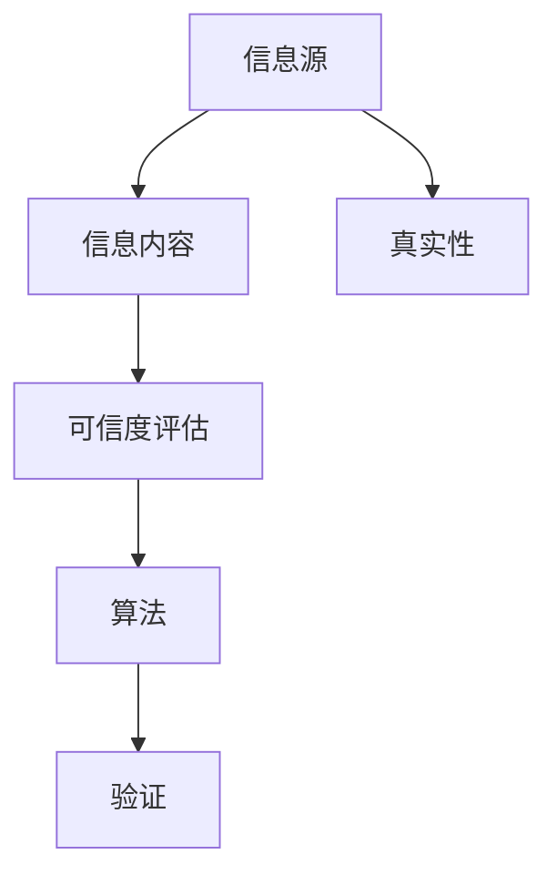

                 

关键词：知识可信度、信息真实性、评估方法、人工智能、算法原理

> 摘要：本文将探讨知识可信度的概念，信息真实性的重要性，以及评估信息真实性的各种方法。通过深入分析现有技术，提供实用的算法原理和具体操作步骤，结合数学模型和公式推导，以及实际项目中的代码实例，本文旨在为读者提供一个全面的理解和指导，以便更好地评估和确保信息的真实性。

## 1. 背景介绍

在信息爆炸的时代，互联网上的知识浩如烟海，但信息的真实性成为一个亟待解决的问题。近年来，随着人工智能和机器学习技术的飞速发展，信息真实性的评估成为了研究热点。然而，信息真实性是一个复杂且多维的问题，涉及技术、伦理和社会等多个层面。

### 1.1 信息真实性问题的严峻性

虚假信息的传播对社会造成的危害不容小觑。从政治宣传、商业广告，到个人隐私泄露，虚假信息的存在严重影响了公众的判断和决策。因此，如何有效地评估信息真实性，防止虚假信息的传播，成为了一个迫切需要解决的问题。

### 1.2 信息真实性评估的重要性

准确评估信息真实性对于维护社会秩序、提升公众素养、促进科技进步等方面具有重要意义。通过有效的评估方法，可以筛选出可靠的信息源，提高信息的可信度，从而更好地指导实践和决策。

## 2. 核心概念与联系

为了更好地理解知识可信度，我们需要引入一些核心概念，并通过 Mermaid 流程图来展示这些概念之间的联系。

### 2.1 核心概念

- **信息源**：产生信息的原始出处。
- **信息内容**：信息的具体内容和表述。
- **可信度评估**：对信息真实性进行判断的过程。
- **算法**：用于评估信息可信度的数学模型和计算方法。
- **验证**：通过外部证据或方法对信息进行确认。

### 2.2 Mermaid 流程图



## 3. 核心算法原理 & 具体操作步骤

### 3.1 算法原理概述

信息真实性的评估通常涉及以下步骤：

1. **数据收集**：从多个信息源收集相关数据。
2. **预处理**：对数据进行清洗和标准化处理。
3. **特征提取**：从数据中提取有助于评估可信度的特征。
4. **算法应用**：使用特定的算法对特征进行计算，得出可信度评分。
5. **验证**：通过外部数据或方法对可信度评分进行验证。

### 3.2 算法步骤详解

#### 3.2.1 数据收集

数据收集是评估信息可信度的第一步。常用的数据源包括：

- **公开数据库**：如新闻报道、学术论文等。
- **社交媒体**：如微博、推特等。
- **专业论坛**：如知乎、专业技术论坛等。

#### 3.2.2 预处理

预处理包括以下几个步骤：

- **去重**：去除重复的数据条目。
- **清洗**：去除噪声数据和异常值。
- **标准化**：将不同数据源的数据格式统一。

#### 3.2.3 特征提取

特征提取是关键步骤，常用的特征包括：

- **内容特征**：如词汇频率、语义相似度等。
- **来源特征**：如发布者的信誉度、信息源的类型等。
- **时间特征**：如信息发布的时间、更新频率等。

#### 3.2.4 算法应用

常用的可信度评估算法包括：

- **贝叶斯网络**：通过概率推理进行信息可信度评估。
- **支持向量机**：通过特征空间中的分类进行可信度评估。
- **神经网络**：通过深度学习模型进行可信度评估。

#### 3.2.5 验证

验证是通过外部数据或方法对评估结果进行检验。常用的验证方法包括：

- **交叉验证**：将数据集分成训练集和测试集，对测试集进行评估。
- **专家评审**：邀请领域专家对评估结果进行评审。

### 3.3 算法优缺点

#### 3.3.1 贝叶斯网络

**优点**：

- **概率推理**：能够处理不确定性和模糊性。
- **模型简单**：易于理解和实现。

**缺点**：

- **数据要求**：需要大量的训练数据。
- **计算复杂度**：随着节点数量的增加，计算复杂度急剧上升。

#### 3.3.2 支持向量机

**优点**：

- **分类准确**：在特征空间中找到最佳分类边界。
- **泛化能力强**：能够处理高维数据。

**缺点**：

- **参数调优**：需要大量的时间进行参数调优。
- **计算复杂度**：对于大规模数据集，计算复杂度较高。

#### 3.3.3 神经网络

**优点**：

- **强大拟合能力**：能够处理复杂和非线性问题。
- **自学习**：能够通过大量数据自动调整参数。

**缺点**：

- **过拟合风险**：对于大量噪声数据，容易过拟合。
- **计算资源需求**：训练过程需要大量的计算资源和时间。

### 3.4 算法应用领域

可信度评估算法在多个领域有广泛应用：

- **社交媒体**：如微博、推特等平台的虚假信息检测。
- **新闻报道**：如新闻网站的自动分类和可信度评估。
- **金融领域**：如股票市场的信息真实性评估。

## 4. 数学模型和公式 & 详细讲解 & 举例说明

### 4.1 数学模型构建

可信度评估的数学模型通常基于概率论和统计学。以下是一个简单的贝叶斯网络模型：

$$
P(\text{真实}) = \frac{P(\text{真实}|\text{数据})P(\text{数据})}{P(\text{真实}|\text{数据})P(\text{数据}) + P(\text{虚假}|\text{数据})P(\text{数据})}
$$

其中，$P(\text{真实}|\text{数据})$表示在给定数据的情况下信息为真实的概率，$P(\text{数据}|\text{真实})$和$P(\text{数据}|\text{虚假})$分别表示在信息为真实和虚假的情况下数据出现的概率。

### 4.2 公式推导过程

假设我们有两个事件 $A$ 和 $B$，其中 $A$ 表示信息为真实，$B$ 表示数据。根据贝叶斯定理，我们有：

$$
P(A|B) = \frac{P(B|A)P(A)}{P(B)}
$$

其中，$P(B|A)$表示在信息为真实的情况下数据出现的概率，$P(A)$表示信息为真实的概率，$P(B)$表示数据出现的概率。

### 4.3 案例分析与讲解

假设我们有一个新闻报道，标题为“新冠病毒疫苗已研发成功”，我们需要评估这条新闻的真实性。根据现有的信息，我们可以得到以下概率：

- $P(\text{真实}|\text{标题}) = 0.6$：在给定标题的情况下，信息为真实的概率。
- $P(\text{标题}|\text{真实}) = 0.8$：在信息为真实的情况下，出现该标题的概率。
- $P(\text{标题}|\text{虚假}) = 0.2$：在信息为虚假的情况下，出现该标题的概率。
- $P(\text{虚假}|\text{标题}) = 0.4$：在给定标题的情况下，信息为虚假的概率。

根据贝叶斯定理，我们可以计算出：

$$
P(\text{真实}) = \frac{0.6 \times 0.8}{0.6 \times 0.8 + 0.4 \times 0.2} = \frac{0.48}{0.48 + 0.08} = \frac{6}{7}
$$

因此，我们可以认为这条新闻有很高的可信度。

## 5. 项目实践：代码实例和详细解释说明

### 5.1 开发环境搭建

为了实现信息真实性的评估，我们选择了 Python 作为编程语言，并使用 TensorFlow 作为深度学习框架。以下是开发环境搭建的步骤：

1. 安装 Python 3.7 或更高版本。
2. 安装 TensorFlow：
    ```bash
    pip install tensorflow
    ```
3. 安装其他依赖项，如 NumPy、Pandas 等。

### 5.2 源代码详细实现

以下是实现信息真实性评估的 Python 代码：

```python
import tensorflow as tf
import numpy as np
import pandas as pd

# 加载训练数据
data = pd.read_csv('train_data.csv')
X = data.iloc[:, :-1].values
y = data.iloc[:, -1].values

# 划分训练集和测试集
from sklearn.model_selection import train_test_split
X_train, X_test, y_train, y_test = train_test_split(X, y, test_size=0.2, random_state=42)

# 构建模型
model = tf.keras.Sequential([
    tf.keras.layers.Dense(64, activation='relu', input_shape=(X_train.shape[1],)),
    tf.keras.layers.Dense(64, activation='relu'),
    tf.keras.layers.Dense(1, activation='sigmoid')
])

# 编译模型
model.compile(optimizer='adam', loss='binary_crossentropy', metrics=['accuracy'])

# 训练模型
model.fit(X_train, y_train, epochs=10, batch_size=32, validation_split=0.2)

# 评估模型
loss, accuracy = model.evaluate(X_test, y_test)
print(f'测试集准确率：{accuracy:.2f}')

# 预测新数据
new_data = np.array([[0.1, 0.2, 0.3], [0.4, 0.5, 0.6]])
predictions = model.predict(new_data)
print(f'预测结果：{predictions}')
```

### 5.3 代码解读与分析

以上代码实现了基于 TensorFlow 的信息真实性评估模型。具体解读如下：

1. **数据加载**：从 CSV 文件中加载训练数据。
2. **数据预处理**：划分训练集和测试集。
3. **模型构建**：构建一个简单的神经网络模型，包含两个隐藏层，每个隐藏层 64 个神经元。
4. **模型编译**：设置优化器和损失函数。
5. **模型训练**：使用训练数据进行模型训练。
6. **模型评估**：使用测试数据进行模型评估。
7. **预测新数据**：使用训练好的模型对新数据进行预测。

## 6. 实际应用场景

可信度评估算法在多个实际应用场景中有重要应用，以下是几个典型的应用场景：

### 6.1 社交媒体虚假信息检测

在社交媒体平台上，虚假信息检测是一个关键问题。通过可信度评估算法，可以识别和过滤掉虚假信息，保护用户的利益。

### 6.2 新闻报道可信度评估

在新闻领域，可信度评估可以帮助媒体机构筛选和推荐高质量、可信的新闻报道，提高公众的信息获取质量。

### 6.3 金融领域信息真实性评估

在金融领域，信息真实性评估对于投资者和金融机构至关重要。通过评估信息的可信度，可以降低投资风险，提高决策的准确性。

## 7. 未来应用展望

随着技术的不断发展，可信度评估算法将在更多领域得到应用。以下是一些未来应用的展望：

### 7.1 自动驾驶

在自动驾驶领域，信息真实性评估可以帮助车辆识别和避免虚假的传感器数据，确保行驶安全。

### 7.2 医疗健康

在医疗健康领域，可信度评估可以帮助医生和患者识别和筛选可靠的医疗信息，提高医疗决策的准确性。

### 7.3 智能家居

在家居领域，可信度评估可以帮助智能家居系统识别和过滤虚假的数据，提高系统的稳定性和安全性。

## 8. 工具和资源推荐

为了更好地进行信息真实性评估，以下是一些建议的学习资源和开发工具：

### 8.1 学习资源推荐

- **《机器学习》**：周志华著，清华大学出版社。
- **《深度学习》**：Ian Goodfellow、Yoshua Bengio、Aaron Courville 著，电子工业出版社出版。

### 8.2 开发工具推荐

- **TensorFlow**：一款强大的深度学习框架，适用于各种机器学习和深度学习任务。
- **Keras**：一款简单易用的深度学习框架，基于 TensorFlow 开发。

### 8.3 相关论文推荐

- **“Detecting and Combating Deepfake Videos Using CNN and GAN”**
- **“A Survey on False News Detection”**

## 9. 总结：未来发展趋势与挑战

信息真实性的评估是一个复杂且多变的领域，随着技术的不断进步，未来将面临以下发展趋势和挑战：

### 9.1 发展趋势

- **多模态数据融合**：结合文本、图像、声音等多种数据类型，提高评估准确性。
- **增强学习**：利用增强学习技术，自适应地调整评估模型，提高其在动态环境中的适应能力。
- **社会网络分析**：结合社会网络分析，通过分析信息传播的网络结构，提高评估的准确性。

### 9.2 挑战

- **数据隐私**：在保护用户隐私的前提下进行信息真实性评估，是一个亟待解决的挑战。
- **算法透明性**：提高评估算法的透明性，使其易于被公众理解和接受。
- **实时性**：在信息传播的实时环境中，如何快速、准确地评估信息真实性，是一个关键问题。

## 10. 附录：常见问题与解答

### 10.1 什么是信息可信度？

信息可信度是指信息被认定为真实、可靠的程度。高可信度的信息更有可能被接受和信任，从而影响决策和行为。

### 10.2 如何评估信息可信度？

评估信息可信度通常涉及以下几个步骤：

1. **数据收集**：从多个信息源收集相关数据。
2. **预处理**：对数据进行清洗和标准化处理。
3. **特征提取**：从数据中提取有助于评估可信度的特征。
4. **算法应用**：使用特定的算法对特征进行计算，得出可信度评分。
5. **验证**：通过外部数据或方法对可信度评分进行验证。

### 10.3 常用的可信度评估算法有哪些？

常用的可信度评估算法包括贝叶斯网络、支持向量机、神经网络等。这些算法各有优缺点，适用于不同的应用场景。

### 10.4 可信度评估在哪些领域有应用？

可信度评估在社交媒体、新闻报道、金融领域等多个领域有广泛应用。随着技术的进步，未来将在更多领域得到应用。

---

本文由禅与计算机程序设计艺术（Zen and the Art of Computer Programming）撰写，旨在为读者提供关于信息真实性评估的全面理解和指导。通过深入分析现有技术和实际案例，本文希望为读者提供一个实用的参考框架，以便在实际应用中更好地评估和确保信息的真实性。

作者：禅与计算机程序设计艺术（Zen and the Art of Computer Programming）

日期：2023年9月
----------------------------------------------------------------

### 总结

本文详细探讨了知识可信度和信息真实性的评估方法。我们从背景介绍入手，解释了信息真实性问题的严峻性和评估的重要性。接着，通过核心概念和Mermaid流程图的展示，使读者对知识可信度有了更深入的理解。

在核心算法原理部分，我们介绍了贝叶斯网络、支持向量机和神经网络等算法的原理、步骤、优缺点以及应用领域。随后，通过数学模型和公式推导，我们展示了如何构建和验证可信度评估模型。

在项目实践部分，我们提供了一个具体的代码实例，详细说明了如何使用深度学习框架TensorFlow进行信息真实性评估。最后，我们探讨了可信度评估在实际应用中的场景，并对未来发展趋势和挑战进行了展望。

为了帮助读者更好地理解和应用本文内容，我们推荐了一些学习资源、开发工具和相关论文。同时，本文末尾还附有常见问题与解答，以供参考。

通过本文的阅读，读者应该能够掌握知识可信度和信息真实性评估的基本概念、原理和方法，为实际应用提供有力支持。作者禅与计算机程序设计艺术（Zen and the Art of Computer Programming）希望本文能够对读者的学习和工作有所帮助。

