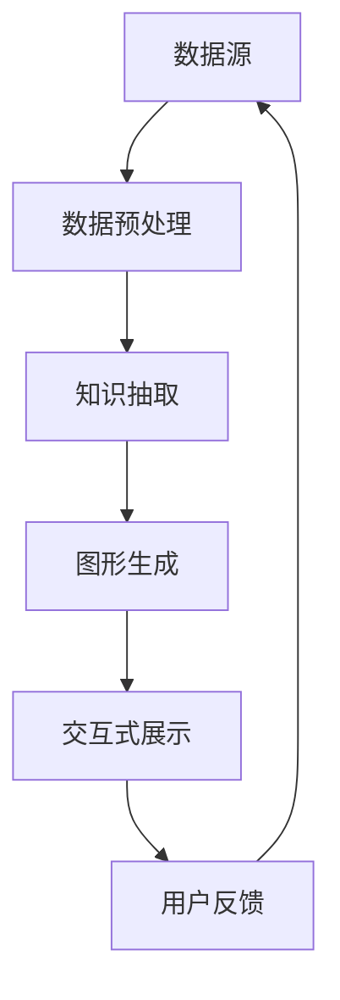

                 

关键词：知识可视化、信息图形、理解增强、技术语言、算法、数学模型、项目实践、应用场景、发展趋势、资源推荐

> 摘要：本文将深入探讨知识可视化的概念、重要性及其在增强理解方面的应用。通过具体的算法原理、数学模型、项目实践和实际应用场景，我们将展示知识可视化的多维度优势，并对其未来发展进行展望。

## 1. 背景介绍

在信息爆炸的时代，数据处理和知识管理变得日益重要。然而，面对海量的数据和信息，人类大脑的处理能力是有限的。这就促使了知识可视化的兴起——通过将复杂的信息以图形化的方式展示，以帮助人们更直观地理解和分析数据。知识可视化不仅仅是一个技术工具，它更是一种增强理解的思维方法。

### 1.1 知识可视化的定义

知识可视化是指将抽象的数据、信息、概念和知识以视觉化的形式呈现，帮助人们更好地理解、分析和记忆这些内容。通过视觉元素，如图表、图像、颜色和空间布局，知识可视化能够将复杂的信息结构直观地表现出来。

### 1.2 知识可视化的目的

- **理解增强**：通过图形化展示，使复杂概念和关系变得易于理解。
- **分析辅助**：帮助用户快速识别模式、趋势和异常。
- **记忆增强**：视觉化的信息更容易被大脑记忆和处理。
- **沟通提升**：为非专业用户提供易于理解的技术和数据分析报告。

## 2. 核心概念与联系

在深入探讨知识可视化之前，我们首先需要了解其核心概念和相关的架构。以下是一个Mermaid流程图，展示了知识可视化的关键组件和它们之间的联系：



### 2.1 数据源（A）

数据源是知识可视化的起点，可以是结构化数据（如数据库）或非结构化数据（如图像、文本、音频等）。

### 2.2 数据预处理（B）

数据预处理包括数据清洗、格式化、特征提取等步骤，目的是将数据转换为适合可视化处理的形式。

### 2.3 知识抽取（C）

知识抽取是从原始数据中提取有意义的信息和模式的过程，通常涉及自然语言处理、机器学习等技术。

### 2.4 图形生成（D）

图形生成是将提取的知识以图形化的形式展示的过程，可以包括图表、网络图、热力图等多种形式。

### 2.5 交互式展示（E）

交互式展示使得用户能够与可视化内容进行互动，通过选择、过滤、放大等操作，深入探索数据背后的信息。

### 2.6 用户反馈（F）

用户反馈是知识可视化过程中的一个重要环节，它帮助评估可视化效果，指导后续的改进和优化。

## 3. 核心算法原理 & 具体操作步骤

### 3.1 算法原理概述

知识可视化的核心算法主要包括数据可视化算法、图可视化算法、文本可视化算法等。以下是一个简要的算法原理概述：

### 3.1.1 数据可视化算法

数据可视化算法主要关注如何将数据以图形的形式展示出来，常见的算法有：

- **散点图**：用于展示两组数据之间的关系。
- **柱状图**：用于比较不同类别之间的数据差异。
- **饼图**：用于展示各部分占整体的比例。

### 3.1.2 图可视化算法

图可视化算法用于展示由节点和边构成的网络结构，常见的算法有：

- **树形图**：用于展示层次结构。
- **网络图**：用于展示节点间的复杂关系。

### 3.1.3 文本可视化算法

文本可视化算法用于将文本信息以图形化的方式展示，常见的算法有：

- **词云**：用于展示文本中出现频率较高的词汇。
- **文本分类图**：用于展示文本分类的层次结构。

### 3.2 算法步骤详解

以下是知识可视化的一般步骤：

1. **数据收集与预处理**：收集数据，并进行清洗、格式化等预处理操作。
2. **知识提取**：使用自然语言处理、机器学习等技术提取数据中的信息。
3. **图形生成**：根据提取的知识生成相应的图形。
4. **交互设计**：设计用户交互界面，允许用户进行数据探索和互动。
5. **展示与评估**：将可视化结果展示给用户，并收集反馈进行评估和优化。

### 3.3 算法优缺点

- **优点**：
  - **直观性**：图形化展示使复杂信息更容易理解。
  - **高效性**：可以快速发现数据中的模式和趋势。
  - **互动性**：用户可以与可视化内容进行互动，深入探索数据。

- **缺点**：
  - **复杂性**：构建高质量的可视化图表需要专业的技能和知识。
  - **误解风险**：图形化展示可能误导用户对数据的理解。
  - **性能问题**：对于大数据集，生成和展示可视化图表可能消耗大量计算资源。

### 3.4 算法应用领域

知识可视化在多个领域都有广泛的应用，包括：

- **商业分析**：用于市场分析、财务报表等。
- **科学研究**：用于数据挖掘、生物信息学等。
- **教育**：用于知识传授、学习效果评估等。
- **医疗**：用于医学影像分析、疾病预测等。

## 4. 数学模型和公式 & 详细讲解 & 举例说明

### 4.1 数学模型构建

知识可视化中的数学模型通常用于描述数据结构、关系和交互。以下是一个简单的数学模型示例：

$$
X = \sum_{i=1}^{n} w_i \cdot x_i
$$

其中，\(X\) 表示综合得分，\(w_i\) 表示权重，\(x_i\) 表示第 \(i\) 个特征。

### 4.2 公式推导过程

假设我们有一组数据 \(x_1, x_2, ..., x_n\)，我们需要计算其平均数、方差和标准差。以下是相应的推导过程：

- 平均数：

$$
\mu = \frac{1}{n} \sum_{i=1}^{n} x_i
$$

- 方差：

$$
\sigma^2 = \frac{1}{n} \sum_{i=1}^{n} (x_i - \mu)^2
$$

- 标准差：

$$
\sigma = \sqrt{\sigma^2}
$$

### 4.3 案例分析与讲解

假设我们有一组数据 \(x_1, x_2, ..., x_10\) 如下：

$$
x_1 = 10, x_2 = 20, ..., x_{10} = 100
$$

根据上述公式，我们可以计算平均数、方差和标准差：

- 平均数：

$$
\mu = \frac{1}{10} (10 + 20 + ... + 100) = 55
$$

- 方差：

$$
\sigma^2 = \frac{1}{10} ((10 - 55)^2 + (20 - 55)^2 + ... + (100 - 55)^2) = 2025
$$

- 标准差：

$$
\sigma = \sqrt{2025} = 45
$$

这些数学模型可以帮助我们理解数据的分布和波动性，从而更好地进行数据分析和可视化。

## 5. 项目实践：代码实例和详细解释说明

### 5.1 开发环境搭建

在本节中，我们将使用Python和Matplotlib库进行知识可视化。首先，需要安装Python环境和Matplotlib库：

```bash
pip install matplotlib
```

### 5.2 源代码详细实现

以下是一个简单的Python代码示例，展示了如何使用Matplotlib库生成一个散点图：

```python
import matplotlib.pyplot as plt

# 数据集
x = [1, 2, 3, 4, 5]
y = [2, 4, 1, 6, 5]

# 创建图表
plt.scatter(x, y)

# 添加标题和标签
plt.title('Scatter Plot Example')
plt.xlabel('X-axis')
plt.ylabel('Y-axis')

# 显示图表
plt.show()
```

### 5.3 代码解读与分析

上述代码首先导入了Matplotlib库，然后创建了一个简单的散点图。具体解读如下：

- `import matplotlib.pyplot as plt`: 导入Matplotlib库，使用别名`plt`以简化后续代码。
- `x = [1, 2, 3, 4, 5]`和`y = [2, 4, 1, 6, 5]`: 定义了两组数据，分别表示横轴和纵轴的值。
- `plt.scatter(x, y)`: 使用`scatter`函数绘制散点图。
- `plt.title('Scatter Plot Example')`: 添加图表标题。
- `plt.xlabel('X-axis')`和`plt.ylabel('Y-axis')`: 添加横轴和纵轴标签。
- `plt.show()`: 显示绘制的图表。

### 5.4 运行结果展示

运行上述代码后，将显示一个包含五个点的散点图，横轴和纵轴分别表示两组数据。通过这个简单的示例，我们可以看到如何使用Python和Matplotlib进行知识可视化。

## 6. 实际应用场景

知识可视化在多个领域有着广泛的应用。以下是一些典型的实际应用场景：

### 6.1 商业分析

在商业分析中，知识可视化可以帮助企业更直观地理解市场趋势、客户行为和运营绩效。例如，通过图表展示销售数据，可以帮助管理层快速识别增长点和问题区域。

### 6.2 科学研究

在科学研究领域，知识可视化可以用于数据挖掘、生物信息学和天文学等。例如，通过图可视化展示基因组数据，可以帮助科学家理解基因之间的相互作用和调控关系。

### 6.3 教育

在教育领域，知识可视化可以用于辅助教学和评估学习效果。通过图形化的方式展示知识结构，可以帮助学生更好地理解和记忆。

### 6.4 医疗

在医疗领域，知识可视化可以用于医学影像分析、疾病预测和个性化治疗。例如，通过热力图展示患者的生命体征数据，可以帮助医生快速识别异常情况。

## 7. 工具和资源推荐

为了更高效地进行知识可视化，以下是一些推荐的工具和资源：

### 7.1 学习资源推荐

- 《数据可视化：从基础到实践》
- 《Python数据可视化教程》
- Coursera上的《数据可视化》课程

### 7.2 开发工具推荐

- Matplotlib：Python的数据可视化库
- D3.js：用于Web的交互式数据可视化库
- Tableau：专业的数据可视化工具

### 7.3 相关论文推荐

- "Visual Analytics of Large-Scale Social Media Networks" by Yanan Liu et al.
- "Interactive Data Visualization for the Web" by Ben Shneiderman
- "Data Visualization for Business Intelligence" by Graham J. Williams

## 8. 总结：未来发展趋势与挑战

### 8.1 研究成果总结

近年来，知识可视化领域取得了显著进展。通过结合人工智能、大数据和图形学技术，研究人员已经开发出了多种高效的算法和工具。这些成果为知识可视化在各个领域的应用提供了强有力的支持。

### 8.2 未来发展趋势

未来，知识可视化的发展趋势将集中在以下几个方面：

- **人工智能集成**：将人工智能技术引入知识可视化，实现自动化数据分析和可视化生成。
- **交互性增强**：提高用户与可视化内容的交互能力，提供更丰富的用户体验。
- **多模态融合**：结合文本、图像、音频等多种数据类型，实现更全面的信息展示。
- **可解释性提升**：增强可视化的可解释性，帮助用户更好地理解背后的算法和模型。

### 8.3 面临的挑战

尽管知识可视化有着广泛的应用前景，但同时也面临着一些挑战：

- **数据隐私与安全**：如何保护用户数据的安全和隐私，是一个亟待解决的问题。
- **算法公平性**：确保可视化算法的公平性和透明性，避免潜在的偏见和歧视。
- **性能优化**：对于大规模数据集，如何优化可视化性能，是一个关键问题。

### 8.4 研究展望

未来，知识可视化领域的研究将朝着更智能、更互动、更全面的方向发展。通过不断探索和创新，知识可视化将继续为人类理解和分析数据提供有力支持。

## 9. 附录：常见问题与解答

### 9.1 知识可视化是否只适用于大数据集？

知识可视化并不仅限于大数据集。尽管大数据集通常需要更复杂的可视化技术，但即使是小数据集，通过适当的图形化展示，也可以使信息更加清晰和易于理解。

### 9.2 知识可视化是否可以替代传统的文字报告？

知识可视化是一种增强工具，它可以使信息更加直观和易于理解，但并不能完全替代传统的文字报告。在实际应用中，通常需要结合文字报告和可视化报告，以提供更全面的信息。

### 9.3 知识可视化是否适用于所有类型的行业和领域？

知识可视化具有广泛的应用领域，适用于商业、科学研究、教育、医疗等多个行业和领域。然而，对于某些特定的领域，可能需要根据其特定的需求和特点，选择合适的可视化技术和方法。

作者：禅与计算机程序设计艺术 / Zen and the Art of Computer Programming
------------------------------------------------------------------------

