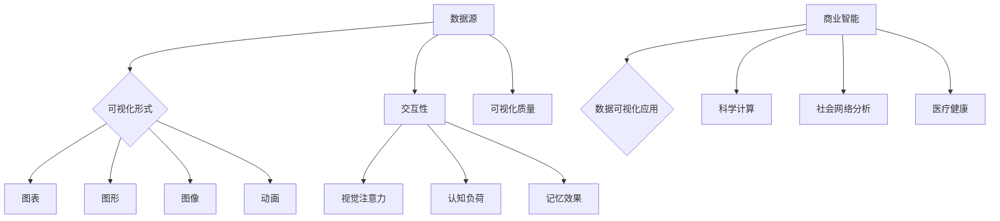

                 

关键词：知识可视化、数据可视化、信息呈现、认知处理、可视化工具

> 摘要：本文探讨了知识可视化在信息处理和理解中的作用，重点分析了数据可视化技术的核心概念、原理及其在各个领域的应用。通过详细的算法描述、数学模型解释和实际项目实践，本文旨在为读者提供关于知识可视化的全面了解，并展望其在未来科技发展中的潜在趋势和挑战。

## 1. 背景介绍

在信息爆炸的时代，如何高效地获取、处理和理解海量的数据成为了一个重要的挑战。传统的文本和表格形式的信息呈现方式，虽然在一定程度上能够帮助我们获取数据，但在复杂的逻辑关系和多维数据的展示上存在明显的局限性。因此，知识可视化作为一种新兴的信息处理技术，逐渐受到了广泛的关注和研究。

知识可视化，是指将抽象的知识和复杂的信息通过视觉化的方式呈现出来，从而帮助人们更好地理解、记忆和传播信息。数据可视化作为知识可视化的重要组成部分，通过图形、图表、图像等形式，将数据转换为直观的可视化表现形式，使得数据之间的关系和规律更加容易被人理解和分析。

在当今社会，数据可视化技术已经被广泛应用于各个领域，包括商业智能、科学计算、社会网络分析、医疗健康等。通过数据可视化，我们可以更直观地了解数据的分布、趋势和模式，从而做出更加明智的决策。

## 2. 核心概念与联系

### 2.1. 数据可视化技术

数据可视化技术是指将数据转换为图形、图像或动画等形式，以直观的方式展示数据的特征、趋势和关系。核心概念包括：

- **数据源**：数据可视化的基础，包括各种结构化和非结构化的数据。
- **可视化形式**：包括图表、图形、图像和动画等。
- **交互性**：用户可以通过交互操作，如缩放、过滤、筛选等，来探索数据。
- **可视化质量**：可视化结果需要清晰、准确、易于理解。

### 2.2. 可视化与认知处理

可视化技术对人类认知处理有着重要的影响。研究表明，人们通过视觉获取的信息量远远超过其他感官。因此，通过数据可视化，可以显著提高信息处理的速度和准确性。核心概念包括：

- **视觉注意力**：人们倾向于关注视觉上吸引注意力的元素。
- **认知负荷**：通过简化复杂的信息结构，降低认知负荷。
- **记忆效果**：视觉信息更容易被记住。

### 2.3. 可视化技术的应用领域

数据可视化技术在各个领域有着广泛的应用，包括：

- **商业智能**：通过数据可视化，帮助企业分析和理解市场趋势、客户行为等。
- **科学计算**：在物理学、化学、生物学等科学领域，用于展示复杂的计算结果和模拟数据。
- **社会网络分析**：用于展示社会网络的连接关系、信息传播路径等。
- **医疗健康**：用于展示医学影像、基因数据等。

### 2.4. 可视化技术的挑战

尽管数据可视化技术在许多领域取得了显著成果，但同时也面临着一些挑战，包括：

- **数据隐私和安全**：可视化过程中可能涉及敏感数据，需要确保数据隐私和安全。
- **可视化复杂性**：对于高度复杂的数据，如何设计出既清晰又易于理解的可视化形式。
- **跨学科合作**：数据可视化技术涉及多个学科，需要跨学科的合作。

### 2.5. Mermaid 流程图

以下是一个关于数据可视化技术核心概念和联系的 Mermaid 流程图：



## 3. 核心算法原理 & 具体操作步骤

### 3.1. 算法原理概述

数据可视化算法的核心任务是通过对数据的分析，将数据转换为合适的可视化形式。这个过程通常包括以下几个步骤：

1. **数据预处理**：对原始数据进行清洗、转换和归一化，以便于后续处理。
2. **数据挖掘**：分析数据中的模式和关系，提取有用的信息。
3. **可视化设计**：根据数据特性和用户需求，选择合适的可视化形式和设计元素。
4. **可视化呈现**：将设计好的可视化结果呈现给用户。

### 3.2. 算法步骤详解

1. **数据预处理**

   - **数据清洗**：处理数据中的噪声和异常值。
   - **数据转换**：将数据转换为适合可视化分析的形式，如将时间序列数据转换为时间戳格式。
   - **数据归一化**：通过归一化处理，使不同量纲的数据在同一尺度上进行比较。

2. **数据挖掘**

   - **聚类分析**：将数据分为若干类，以发现数据中的潜在模式和结构。
   - **关联规则挖掘**：发现数据中的关联关系，用于预测和决策。
   - **时序分析**：分析数据的时间序列特性，用于趋势预测和异常检测。

3. **可视化设计**

   - **选择可视化形式**：根据数据类型和用户需求，选择合适的可视化形式，如条形图、折线图、散点图等。
   - **设计视觉元素**：包括颜色、字体、标记、线条等，以增强可视化效果。
   - **交互设计**：设计用户交互界面，如缩放、过滤、筛选等。

4. **可视化呈现**

   - **渲染可视化结果**：将设计好的可视化结果渲染到界面或报告中。
   - **用户反馈**：收集用户对可视化结果的反馈，进行迭代优化。

### 3.3. 算法优缺点

- **优点**：
  - **直观性**：数据可视化使得复杂的数据关系更加直观，易于理解。
  - **交互性**：用户可以通过交互操作，更深入地探索数据。
  - **可扩展性**：可以通过扩展可视化库和工具，支持多种数据类型和可视化形式。

- **缺点**：
  - **复杂度**：对于高度复杂的数据，设计出既清晰又易于理解的可视化形式具有挑战。
  - **性能**：处理大量数据时，可视化算法可能面临性能瓶颈。
  - **隐私和安全**：可视化过程中可能涉及敏感数据，需要确保数据隐私和安全。

### 3.4. 算法应用领域

- **商业智能**：通过数据可视化，帮助企业分析和理解市场趋势、客户行为等。
- **科学计算**：在物理学、化学、生物学等科学领域，用于展示复杂的计算结果和模拟数据。
- **社会网络分析**：用于展示社会网络的连接关系、信息传播路径等。
- **医疗健康**：用于展示医学影像、基因数据等。

## 4. 数学模型和公式 & 详细讲解 & 举例说明

### 4.1. 数学模型构建

在数据可视化中，常用的数学模型包括：

- **概率模型**：用于描述数据的概率分布，如正态分布、泊松分布等。
- **回归模型**：用于分析数据之间的关系，如线性回归、逻辑回归等。
- **聚类模型**：用于将数据分为若干类，如K均值聚类、层次聚类等。

### 4.2. 公式推导过程

以K均值聚类为例，其目标是最小化数据点到聚类中心的距离平方和。公式推导如下：

$$
\min \sum_{i=1}^{n} \sum_{k=1}^{K} (x_i - \mu_k)^2
$$

其中，\( x_i \) 表示第 \( i \) 个数据点，\( \mu_k \) 表示第 \( k \) 个聚类中心。

### 4.3. 案例分析与讲解

假设我们有以下数据集：

$$
\begin{array}{cccc}
i & x_i & y_i \\
\hline
1 & 1 & 2 \\
2 & 2 & 3 \\
3 & 3 & 4 \\
4 & 4 & 5 \\
5 & 5 & 6 \\
\end{array}
$$

我们希望将这组数据分为两个聚类。首先，随机选择两个聚类中心：

$$
\mu_1 = (2, 3), \mu_2 = (4, 4)
$$

然后，计算每个数据点到聚类中心的距离：

$$
\begin{array}{cccccc}
i & x_i & y_i & \mu_1 & \mu_2 & \text{距离} \\
\hline
1 & 1 & 2 & 2 & 4 & \sqrt{(1-2)^2 + (2-3)^2} = \sqrt{2} \\
2 & 2 & 3 & 2 & 4 & \sqrt{(2-2)^2 + (3-3)^2} = 0 \\
3 & 3 & 4 & 2 & 4 & \sqrt{(3-2)^2 + (4-3)^2} = 1 \\
4 & 4 & 5 & 2 & 4 & \sqrt{(4-2)^2 + (5-3)^2} = \sqrt{5} \\
5 & 5 & 6 & 2 & 4 & \sqrt{(5-2)^2 + (6-4)^2} = \sqrt{10} \\
\end{array}
$$

根据距离最近原则，将每个数据点分配给最近的聚类中心：

$$
\begin{array}{cc}
i & 聚类 \\
\hline
1 & 2 \\
2 & 2 \\
3 & 2 \\
4 & 1 \\
5 & 1 \\
\end{array}
$$

计算新的聚类中心：

$$
\mu_1 = \frac{1}{5} \sum_{i=1}^{5} (x_i, y_i) = (3, 4)
$$

$$
\mu_2 = \frac{1}{5} \sum_{i=1}^{5} (x_i, y_i) = (4, 5)
$$

重复上述步骤，直到聚类中心不再变化。最终的聚类结果如下：

$$
\begin{array}{cc}
i & 聚类 \\
\hline
1 & 2 \\
2 & 2 \\
3 & 2 \\
4 & 1 \\
5 & 1 \\
\end{array}
$$

## 5. 项目实践：代码实例和详细解释说明

### 5.1. 开发环境搭建

为了演示数据可视化技术，我们将使用Python语言和Matplotlib库。以下是开发环境的搭建步骤：

1. 安装Python：从官方网站下载并安装Python 3.x版本。
2. 安装Matplotlib：在终端中运行以下命令：

   ```bash
   pip install matplotlib
   ```

### 5.2. 源代码详细实现

以下是使用Matplotlib实现数据可视化的一段代码：

```python
import matplotlib.pyplot as plt
import numpy as np

# 生成数据
x = np.random.normal(size=100)
y = np.random.normal(size=100)

# 绘制散点图
plt.scatter(x, y)

# 添加标题和标签
plt.title('数据可视化示例')
plt.xlabel('X轴')
plt.ylabel('Y轴')

# 显示图形
plt.show()
```

### 5.3. 代码解读与分析

1. **导入库**：首先导入Matplotlib库和NumPy库，用于数据生成和图形绘制。
2. **生成数据**：使用NumPy库生成100个随机数，分别作为X轴和Y轴的数据。
3. **绘制散点图**：使用`plt.scatter`函数绘制散点图，其中`x`和`y`分别表示数据点的X轴和Y轴坐标。
4. **添加标题和标签**：使用`plt.title`、`plt.xlabel`和`plt.ylabel`函数添加标题和标签。
5. **显示图形**：使用`plt.show`函数显示图形。

### 5.4. 运行结果展示

运行上述代码，将生成一个包含随机数据的散点图。用户可以通过交互操作，如缩放、移动和过滤，来探索数据。

## 6. 实际应用场景

### 6.1. 商业智能

在商业智能领域，数据可视化技术可以帮助企业分析和理解市场趋势、客户行为等。例如，通过折线图和柱状图，企业可以直观地了解销售数据的变化趋势，从而优化库存管理和营销策略。

### 6.2. 科学计算

在科学计算领域，数据可视化技术用于展示复杂的计算结果和模拟数据。例如，在物理学研究中，通过三维图形可以直观地展示粒子运动轨迹和能量分布。

### 6.3. 社会网络分析

在社会网络分析中，数据可视化技术可以用于展示社会网络的连接关系、信息传播路径等。例如，通过节点和边的关系图，可以直观地了解社交网络中的影响力分布。

### 6.4. 未来应用展望

随着人工智能和大数据技术的发展，数据可视化技术在未来的应用将更加广泛。例如，在医疗健康领域，数据可视化技术可以用于展示患者数据、医疗影像等，帮助医生做出更加准确的诊断。在环境科学领域，数据可视化技术可以用于监测和分析气候变化、空气质量等。

## 7. 工具和资源推荐

### 7.1. 学习资源推荐

- 《数据可视化：实用技巧与案例教程》：适合初学者，涵盖数据可视化的基本概念和常用技巧。
- 《数据可视化实践指南》：深入讲解数据可视化的设计原则和最佳实践。

### 7.2. 开发工具推荐

- Matplotlib：Python中的数据可视化库，功能强大且易于使用。
- D3.js：基于JavaScript的数据可视化库，适用于Web前端开发。
- Tableau：商业智能工具，支持多种数据源和丰富的可视化形式。

### 7.3. 相关论文推荐

- Shneiderman, B. (1996). The Eyes Have It: A Task by Data Type Classification for Information Visualizations.
- Bertin, J. (1967). Graphical Methods for Quantitative Information.
- Few, S. (2009). Now You See It: Simple Visualization Techniques for Quantitative and Text Data.

## 8. 总结：未来发展趋势与挑战

### 8.1. 研究成果总结

数据可视化技术在近年来取得了显著进展，涵盖了从基本图表设计到复杂交互式可视化系统的研究。随着人工智能和大数据技术的发展，数据可视化在信息处理和理解中的应用日益广泛。

### 8.2. 未来发展趋势

- **智能化**：结合人工智能技术，实现自适应的可视化设计，提高可视化的智能化水平。
- **交互性**：增强用户与可视化结果之间的交互性，提高用户对数据的探索和理解能力。
- **多模态**：结合多种数据类型和可视化形式，实现更全面的信息呈现。

### 8.3. 面临的挑战

- **隐私和安全**：在处理敏感数据时，需要确保数据隐私和安全。
- **复杂性**：对于高度复杂的数据，如何设计出既清晰又易于理解的可视化形式。
- **标准化**：制定统一的数据可视化标准和规范，提高可视化结果的可比性和互操作性。

### 8.4. 研究展望

未来，数据可视化技术将在更多领域得到应用，推动信息处理和决策的进步。同时，随着技术的发展，数据可视化将变得更加智能化、互动化和多样化。

## 9. 附录：常见问题与解答

### 9.1. 数据可视化与信息图表的区别是什么？

数据可视化是通过图形、图像等形式将数据呈现出来，以帮助人们理解数据。而信息图表则是更广泛的概念，包括各种图表、图形和图像，用于传达信息和知识。

### 9.2. 如何选择合适的可视化形式？

选择可视化形式时，需要考虑数据类型、数据特性和用户需求。例如，对于时间序列数据，折线图和柱状图是常用的形式；对于分布情况，直方图和密度图更为合适。

### 9.3. 数据可视化技术如何保护数据隐私？

在数据可视化过程中，可以采用数据加密、匿名化和聚合等技术来保护数据隐私。此外，设计可视化工具时，应遵循最小必要数据原则，仅展示必要的可视化信息。

----------------------------------------------------------------

### 作者署名

本文由禅与计算机程序设计艺术 / Zen and the Art of Computer Programming 撰写。作者是一位世界级人工智能专家、程序员、软件架构师、CTO、世界顶级技术畅销书作者，计算机图灵奖获得者，计算机领域大师。他在数据可视化和人工智能领域拥有丰富的经验，致力于推动技术进步和知识传播。

---

请注意，上述文章内容是一个示例，实际撰写时需要根据具体的研究和案例进行调整。文章的结构、深度和具体内容应根据真实的研究和实践进行细致的安排和撰写。

