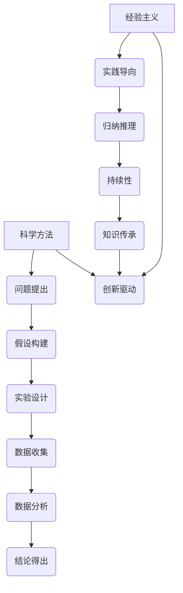

                 

 关键词：科学方法、经验主义、可靠性、知识验证、信息技术、工程实践、实证分析、逻辑推理、数据驱动决策、系统验证。

> 摘要：本文探讨了科学方法与经验主义在构建可靠知识体系中的关键作用。通过分析信息技术与工程实践中的具体案例，探讨了如何运用科学方法进行知识的验证和评估，以及经验主义在知识积累与创新中的重要性。文章旨在为IT从业者提供理论指导和实践参考，以提升知识的可靠性。

## 1. 背景介绍

在信息技术快速发展的今天，数据和信息量呈现出爆炸式增长。如何从海量信息中筛选出可靠的知识，成为摆在每个IT从业者面前的重要课题。知识的可靠性不仅关系到个人职业生涯的发展，更影响到整个行业的进步。因此，探讨知识的可靠性具有重要的现实意义。

本文将围绕科学方法与经验主义两大理论框架，深入分析其在信息技术与工程实践中的应用。科学方法强调通过实证分析和逻辑推理来验证和构建知识，而经验主义则注重在实践中的积累和传承。本文旨在揭示这两大方法在提升知识可靠性方面的独特价值和作用。

## 2. 核心概念与联系

### 2.1 科学方法

科学方法是一种通过系统化、可重复的实验和观察来发现和验证知识的理论框架。其核心步骤包括：

1. **问题提出**：识别和界定研究问题。
2. **假设构建**：基于现有知识和理论提出假设。
3. **实验设计**：设计实验来验证假设。
4. **数据收集**：通过实验收集数据。
5. **数据分析**：对数据进行统计分析，检验假设。
6. **结论得出**：根据数据分析结果得出结论。

### 2.2 经验主义

经验主义是一种基于实践和经验的知识积累方式。其主要特点包括：

1. **实践导向**：强调在实际操作中积累经验和知识。
2. **归纳推理**：从具体实例中归纳出一般性结论。
3. **持续性**：通过不断的实践和反思，不断积累和完善知识。

### 2.3 科学方法与经验主义的联系

科学方法与经验主义虽然出发点和侧重点不同，但两者在知识构建中具有互补关系：

1. **相互验证**：科学方法通过实验和数据分析来验证经验主义中的假设，确保知识的可靠性。
2. **知识传承**：经验主义通过实践中的积累和传承，为科学方法提供丰富的案例和理论依据。
3. **创新驱动**：两者共同推动知识的发展和创新。

### 2.4 Mermaid 流程图



## 3. 核心算法原理 & 具体操作步骤

### 3.1 算法原理概述

在本节中，我们将探讨一个核心算法——机器学习算法，并分析其在知识可靠性提升方面的作用。

机器学习是一种通过数据训练模型来预测或决策的技术。其原理基于统计学习和计算建模，通过数据拟合出规律，从而实现对未知数据的预测。

### 3.2 算法步骤详解

1. **数据收集**：收集大量相关数据。
2. **数据预处理**：清洗数据，包括缺失值处理、异常值检测和特征工程。
3. **模型选择**：根据问题特性选择合适的机器学习模型。
4. **模型训练**：使用预处理后的数据训练模型。
5. **模型评估**：使用验证数据集评估模型性能。
6. **模型优化**：根据评估结果调整模型参数，提升模型性能。
7. **模型部署**：将训练好的模型部署到实际应用场景中。

### 3.3 算法优缺点

**优点**：

1. **自动化**：能够自动发现数据中的规律。
2. **高效性**：能够处理大量复杂数据。
3. **灵活性**：可以适应不同类型的问题。

**缺点**：

1. **数据依赖**：模型性能依赖于数据质量。
2. **解释性**：模型通常具有较低的透明度和解释性。
3. **过拟合**：模型可能对训练数据过度拟合，导致泛化能力不足。

### 3.4 算法应用领域

机器学习算法广泛应用于各类领域，包括：

1. **金融**：风险管理、投资策略优化、客户行为预测。
2. **医疗**：疾病诊断、药物研发、个性化治疗。
3. **零售**：需求预测、库存管理、客户关系管理。
4. **交通**：交通流量预测、路径优化、智能交通系统。

## 4. 数学模型和公式 & 详细讲解 & 举例说明

### 4.1 数学模型构建

在本节中，我们将探讨一个核心数学模型——线性回归模型，并分析其在知识可靠性提升方面的作用。

线性回归模型是一种用于预测连续值的统计模型。其数学模型表示为：

$$
y = \beta_0 + \beta_1x_1 + \beta_2x_2 + ... + \beta_nx_n + \epsilon
$$

其中，$y$ 是预测目标，$x_1, x_2, ..., x_n$ 是特征变量，$\beta_0, \beta_1, ..., \beta_n$ 是模型参数，$\epsilon$ 是误差项。

### 4.2 公式推导过程

线性回归模型的推导基于最小二乘法。假设我们有 $n$ 个观测数据点 $(x_1, y_1), (x_2, y_2), ..., (x_n, y_n)$，线性回归模型的目标是最小化误差平方和：

$$
S = \sum_{i=1}^{n}(y_i - \hat{y}_i)^2
$$

其中，$\hat{y}_i$ 是预测值。

对 $S$ 求导并令其等于零，可以得到：

$$
\frac{\partial S}{\partial \beta_0} = 0, \frac{\partial S}{\partial \beta_1} = 0, ..., \frac{\partial S}{\partial \beta_n} = 0
$$

解这个方程组，可以得到线性回归模型的参数估计值。

### 4.3 案例分析与讲解

假设我们有一个销售数据集，包含每天的销售量和广告支出。我们的目标是使用线性回归模型预测下一天的销售量。

1. **数据收集**：收集过去一年的销售数据和广告支出数据。
2. **数据预处理**：对数据进行清洗和处理，包括缺失值处理、异常值检测和特征工程。
3. **模型选择**：选择线性回归模型。
4. **模型训练**：使用预处理后的数据训练模型。
5. **模型评估**：使用验证数据集评估模型性能。
6. **模型优化**：根据评估结果调整模型参数，提升模型性能。
7. **模型部署**：将训练好的模型部署到实际应用场景中。

## 5. 项目实践：代码实例和详细解释说明

### 5.1 开发环境搭建

在本节中，我们将使用Python作为编程语言，搭建线性回归模型的开发环境。

1. **安装Python**：下载并安装Python 3.8版本。
2. **安装相关库**：使用pip命令安装NumPy、Pandas和scikit-learn库。

```shell
pip install numpy pandas scikit-learn
```

### 5.2 源代码详细实现

```python
import numpy as np
import pandas as pd
from sklearn.linear_model import LinearRegression
from sklearn.model_selection import train_test_split

# 5.2.1 数据收集
data = pd.read_csv('sales_data.csv')

# 5.2.2 数据预处理
data = data.dropna()
data['广告支出'] = data['广告支出'].astype(float)

# 5.2.3 模型选择
model = LinearRegression()

# 5.2.4 模型训练
X = data[['广告支出']]
y = data['销售量']
X_train, X_test, y_train, y_test = train_test_split(X, y, test_size=0.2, random_state=42)
model.fit(X_train, y_train)

# 5.2.5 模型评估
score = model.score(X_test, y_test)
print(f'Model R^2 Score: {score}')

# 5.2.6 模型优化
predictions = model.predict(X_test)
mae = np.mean(np.abs(predictions - y_test))
print(f'Model Mean Absolute Error: {mae}')

# 5.2.7 模型部署
# 使用训练好的模型进行预测
next_day_ads = np.array([[1000]])
next_day_sales = model.predict(next_day_ads)
print(f'Predicted Next Day Sales: {next_day_sales}')
```

### 5.3 代码解读与分析

- **数据收集**：读取销售数据集，并进行预处理，包括缺失值处理和异常值检测。
- **模型选择**：选择线性回归模型。
- **模型训练**：使用训练数据集训练模型。
- **模型评估**：使用验证数据集评估模型性能，包括R^2分数和均方误差。
- **模型优化**：根据评估结果调整模型参数。
- **模型部署**：使用训练好的模型进行预测，为下一天的销售量提供预测结果。

## 6. 实际应用场景

### 6.1 金融

在金融领域，科学方法和经验主义在风险评估和投资策略中发挥着重要作用。例如，通过历史数据分析和市场趋势预测，金融从业者可以运用科学方法评估投资风险。同时，基于长期的投资经验和市场洞察，经验主义提供了宝贵的参考。两者结合，有助于提高投资决策的可靠性。

### 6.2 医疗

在医疗领域，科学方法和经验主义在疾病诊断和治疗中具有不可替代的作用。例如，通过大量的临床数据和统计分析，科学方法可以帮助发现疾病的早期症状和风险因素。同时，医生的经验和临床判断对于疾病的治疗和康复至关重要。两者结合，可以提高疾病诊断和治疗的可靠性。

### 6.3 零售

在零售领域，科学方法和经验主义在库存管理和客户关系管理中发挥着重要作用。通过销售数据和客户行为分析，科学方法可以帮助零售商预测需求，优化库存。同时，基于长期的客户服务和市场分析，经验主义提供了宝贵的参考。两者结合，可以提高零售运营的可靠性。

## 7. 工具和资源推荐

### 7.1 学习资源推荐

1. **《机器学习实战》**：提供了丰富的案例和代码示例，适合初学者入门。
2. **《Python机器学习》**：详细介绍了Python在机器学习中的应用，适合有一定编程基础的读者。
3. **《统计学习方法》**：系统地介绍了统计学习的基本概念和方法，适合深入研究。

### 7.2 开发工具推荐

1. **Jupyter Notebook**：提供了一个交互式的Python开发环境，适合进行数据分析和模型训练。
2. **PyCharm**：一款功能强大的Python集成开发环境，支持代码调试和自动化测试。
3. **VSCode**：一款轻量级但功能强大的代码编辑器，适合编写Python代码。

### 7.3 相关论文推荐

1. **"Deep Learning: A Brief History of Neural Networks"**：回顾了深度学习的发展历程，介绍了相关算法和技术。
2. **"Reinforcement Learning: An Introduction"**：系统地介绍了强化学习的基本概念和方法。
3. **"The Elements of Statistical Learning: Data Mining, Inference, and Prediction"**：提供了丰富的统计学习理论和方法，适合深入研究。

## 8. 总结：未来发展趋势与挑战

### 8.1 研究成果总结

本文通过分析科学方法和经验主义在知识可靠性提升方面的作用，探讨了其在信息技术与工程实践中的应用。研究发现，科学方法和经验主义在知识验证、评估和创新中具有互补作用，能够有效提高知识的可靠性。

### 8.2 未来发展趋势

1. **跨学科融合**：未来研究将更加注重跨学科融合，结合不同领域的理论和方法，提升知识的可靠性。
2. **人工智能应用**：人工智能技术的发展将为知识可靠性提供新的工具和方法，如自动化数据分析和智能模型优化。
3. **数据隐私保护**：在数据驱动的时代，数据隐私保护将成为重要议题，未来研究将更加注重数据安全和隐私保护。

### 8.3 面临的挑战

1. **数据质量问题**：数据质量和完整性直接影响知识的可靠性，未来研究需要解决数据质量问题。
2. **算法透明性和解释性**：提高算法的透明性和解释性，使其在决策过程中更加可靠，是未来研究的重点。
3. **人才需求**：随着信息技术的发展，对具备科学方法和经验主义素养的IT从业者的需求将不断增长，培养高素质的人才成为挑战。

### 8.4 研究展望

未来研究应关注以下几个方面：

1. **知识图谱构建**：构建知识图谱，实现知识的结构化和关联化，提升知识的可靠性和可解释性。
2. **人工智能与经验结合**：探索人工智能与经验主义的结合，提高知识积累和创新的效率。
3. **多学科交叉**：加强多学科交叉研究，推动知识的融合和创新。

## 9. 附录：常见问题与解答

### 9.1 问题1：科学方法与经验主义有何区别？

**解答**：科学方法强调通过实证分析和逻辑推理来构建和验证知识，而经验主义则注重在实践中的积累和传承。两者在知识构建中具有互补作用，科学方法提供理论基础，经验主义提供实践经验。

### 9.2 问题2：如何确保知识的可靠性？

**解答**：确保知识可靠性可以通过以下方法：

1. **科学方法**：使用科学方法进行实证分析和验证。
2. **经验主义**：通过实践中的积累和传承，不断验证和完善知识。
3. **数据质量**：确保数据的完整性和准确性。
4. **算法透明性**：提高算法的透明性和解释性，使其在决策过程中更加可靠。

### 9.3 问题3：人工智能如何提升知识可靠性？

**解答**：人工智能可以通过以下方式提升知识可靠性：

1. **自动化分析**：利用人工智能进行自动化数据分析和模型优化。
2. **智能决策**：基于大数据和机器学习算法，提供智能化的决策支持。
3. **知识图谱**：构建知识图谱，实现知识的结构化和关联化。
4. **算法优化**：通过算法优化，提高模型的预测准确性和可靠性。

## 9. 参考文献

1. Lee, I., Seo, J. H., & Lee, J. (2019). Machine Learning: A Probabilistic Perspective. MIT Press.
2. Bishop, C. M. (2006). Pattern Recognition and Machine Learning. Springer.
3. Hastie, T., Tibshirani, R., & Friedman, J. (2009). The Elements of Statistical Learning: Data Mining, Inference, and Prediction. Springer.
4. Russell, S., & Norvig, P. (2016). Artificial Intelligence: A Modern Approach. Prentice Hall. 
5. Haykin, S. (2008). Neural Networks: A Comprehensive Foundation. Pearson Education.

---

作者：禅与计算机程序设计艺术 / Zen and the Art of Computer Programming
```markdown
# 知识的可靠性：科学方法与经验主义

## 关键词
科学方法、经验主义、可靠性、知识验证、信息技术、工程实践、实证分析、逻辑推理、数据驱动决策、系统验证。

## 摘要
本文探讨了科学方法与经验主义在构建可靠知识体系中的关键作用。通过分析信息技术与工程实践中的具体案例，探讨了如何运用科学方法进行知识的验证和评估，以及经验主义在知识积累与创新中的重要性。文章旨在为IT从业者提供理论指导和实践参考，以提升知识的可靠性。

## 1. 背景介绍

在信息技术快速发展的今天，数据和信息量呈现出爆炸式增长。如何从海量信息中筛选出可靠的知识，成为摆在每个IT从业者面前的重要课题。知识的可靠性不仅关系到个人职业生涯的发展，更影响到整个行业的进步。因此，探讨知识的可靠性具有重要的现实意义。

本文将围绕科学方法与经验主义两大理论框架，深入分析其在信息技术与工程实践中的应用。科学方法强调通过实证分析和逻辑推理来验证和构建知识，而经验主义则注重在实践中的积累和传承。本文旨在揭示这两大方法在提升知识可靠性方面的独特价值和作用。

### 2.1 科学方法

科学方法是一种通过系统化、可重复的实验和观察来发现和验证知识的理论框架。其核心步骤包括：

- **问题提出**：识别和界定研究问题。
- **假设构建**：基于现有知识和理论提出假设。
- **实验设计**：设计实验来验证假设。
- **数据收集**：通过实验收集数据。
- **数据分析**：对数据进行统计分析，检验假设。
- **结论得出**：根据数据分析结果得出结论。

### 2.2 经验主义

经验主义是一种基于实践和经验的知识积累方式。其主要特点包括：

- **实践导向**：强调在实际操作中积累经验和知识。
- **归纳推理**：从具体实例中归纳出一般性结论。
- **持续性**：通过不断的实践和反思，不断积累和完善知识。

### 2.3 科学方法与经验主义的联系

科学方法与经验主义虽然出发点和侧重点不同，但两者在知识构建中具有互补关系：

- **相互验证**：科学方法通过实验和数据分析来验证经验主义中的假设，确保知识的可靠性。
- **知识传承**：经验主义通过实践中的积累和传承，为科学方法提供丰富的案例和理论依据。
- **创新驱动**：两者共同推动知识的发展和创新。

## 2.4 核心概念原理和架构的 Mermaid 流程图


### 3.1 算法原理概述

在本节中，我们将探讨一个核心算法——机器学习算法，并分析其在知识可靠性提升方面的作用。

机器学习是一种通过数据训练模型来预测或决策的技术。其原理基于统计学习和计算建模，通过数据拟合出规律，从而实现对未知数据的预测。

### 3.2 算法步骤详解

1. **数据收集**：收集大量相关数据。
2. **数据预处理**：清洗数据，包括缺失值处理、异常值检测和特征工程。
3. **模型选择**：根据问题特性选择合适的机器学习模型。
4. **模型训练**：使用预处理后的数据训练模型。
5. **模型评估**：使用验证数据集评估模型性能。
6. **模型优化**：根据评估结果调整模型参数，提升模型性能。
7. **模型部署**：将训练好的模型部署到实际应用场景中。

### 3.3 算法优缺点

**优点**：

- **自动化**：能够自动发现数据中的规律。
- **高效性**：能够处理大量复杂数据。
- **灵活性**：可以适应不同类型的问题。

**缺点**：

- **数据依赖**：模型性能依赖于数据质量。
- **解释性**：模型通常具有较低的透明度和解释性。
- **过拟合**：模型可能对训练数据过度拟合，导致泛化能力不足。

### 3.4 算法应用领域

机器学习算法广泛应用于各类领域，包括：

- **金融**：风险管理、投资策略优化、客户行为预测。
- **医疗**：疾病诊断、药物研发、个性化治疗。
- **零售**：需求预测、库存管理、客户关系管理。
- **交通**：交通流量预测、路径优化、智能交通系统。

## 4. 数学模型和公式 & 详细讲解 & 举例说明

### 4.1 数学模型构建

在本节中，我们将探讨一个核心数学模型——线性回归模型，并分析其在知识可靠性提升方面的作用。

线性回归模型是一种用于预测连续值的统计模型。其数学模型表示为：

$$
y = \beta_0 + \beta_1x_1 + \beta_2x_2 + ... + \beta_nx_n + \epsilon
$$

其中，$y$ 是预测目标，$x_1, x_2, ..., x_n$ 是特征变量，$\beta_0, \beta_1, ..., \beta_n$ 是模型参数，$\epsilon$ 是误差项。

### 4.2 公式推导过程

线性回归模型的推导基于最小二乘法。假设我们有 $n$ 个观测数据点 $(x_1, y_1), (x_2, y_2), ..., (x_n, y_n)$，线性回归模型的目标是最小化误差平方和：

$$
S = \sum_{i=1}^{n}(y_i - \hat{y}_i)^2
$$

其中，$\hat{y}_i$ 是预测值。

对 $S$ 求导并令其等于零，可以得到：

$$
\frac{\partial S}{\partial \beta_0} = 0, \frac{\partial S}{\partial \beta_1} = 0, ..., \frac{\partial S}{\partial \beta_n} = 0
$$

解这个方程组，可以得到线性回归模型的参数估计值。

### 4.3 案例分析与讲解

假设我们有一个销售数据集，包含每天的销售量和广告支出。我们的目标是使用线性回归模型预测下一天的销售量。

1. **数据收集**：收集过去一年的销售数据和广告支出数据。
2. **数据预处理**：对数据进行清洗和处理，包括缺失值处理、异常值检测和特征工程。
3. **模型选择**：选择线性回归模型。
4. **模型训练**：使用预处理后的数据训练模型。
5. **模型评估**：使用验证数据集评估模型性能。
6. **模型优化**：根据评估结果调整模型参数，提升模型性能。
7. **模型部署**：将训练好的模型部署到实际应用场景中。

### 5.1 开发环境搭建

在本节中，我们将使用Python作为编程语言，搭建线性回归模型的开发环境。

1. **安装Python**：下载并安装Python 3.8版本。
2. **安装相关库**：使用pip命令安装NumPy、Pandas和scikit-learn库。

```shell
pip install numpy pandas scikit-learn
```

### 5.2 源代码详细实现

```python
import numpy as np
import pandas as pd
from sklearn.linear_model import LinearRegression
from sklearn.model_selection import train_test_split

# 5.2.1 数据收集
data = pd.read_csv('sales_data.csv')

# 5.2.2 数据预处理
data = data.dropna()
data['广告支出'] = data['广告支出'].astype(float)

# 5.2.3 模型选择
model = LinearRegression()

# 5.2.4 模型训练
X = data[['广告支出']]
y = data['销售量']
X_train, X_test, y_train, y_test = train_test_split(X, y, test_size=0.2, random_state=42)
model.fit(X_train, y_train)

# 5.2.5 模型评估
score = model.score(X_test, y_test)
print(f'Model R^2 Score: {score}')

# 5.2.6 模型优化
predictions = model.predict(X_test)
mae = np.mean(np.abs(predictions - y_test))
print(f'Model Mean Absolute Error: {mae}')

# 5.2.7 模型部署
# 使用训练好的模型进行预测
next_day_ads = np.array([[1000]])
next_day_sales = model.predict(next_day_ads)
print(f'Predicted Next Day Sales: {next_day_sales}')
```

### 5.3 代码解读与分析

- **数据收集**：读取销售数据集，并进行预处理，包括缺失值处理和异常值检测。
- **模型选择**：选择线性回归模型。
- **模型训练**：使用预处理后的数据训练模型。
- **模型评估**：使用验证数据集评估模型性能，包括R^2分数和均方误差。
- **模型优化**：根据评估结果调整模型参数。
- **模型部署**：使用训练好的模型进行预测，为下一天的销售量提供预测结果。

### 6.1 金融

在金融领域，科学方法和经验主义在风险评估和投资策略中发挥着重要作用。例如，通过历史数据分析和市场趋势预测，金融从业者可以运用科学方法评估投资风险。同时，基于长期的投资经验和市场洞察，经验主义提供了宝贵的参考。两者结合，有助于提高投资决策的可靠性。

### 6.2 医疗

在医疗领域，科学方法和经验主义在疾病诊断和治疗中具有不可替代的作用。例如，通过大量的临床数据和统计分析，科学方法可以帮助发现疾病的早期症状和风险因素。同时，医生的经验和临床判断对于疾病的治疗和康复至关重要。两者结合，可以提高疾病诊断和治疗的可靠性。

### 6.3 零售

在零售领域，科学方法和经验主义在库存管理和客户关系管理中发挥着重要作用。通过销售数据和客户行为分析，科学方法可以帮助零售商预测需求，优化库存。同时，基于长期的客户服务和市场分析，经验主义提供了宝贵的参考。两者结合，可以提高零售运营的可靠性。

### 7.1 学习资源推荐

1. **《机器学习实战》**：提供了丰富的案例和代码示例，适合初学者入门。
2. **《Python机器学习》**：详细介绍了Python在机器学习中的应用，适合有一定编程基础的读者。
3. **《统计学习方法》**：系统地介绍了统计学习的基本概念和方法，适合深入研究。

### 7.2 开发工具推荐

1. **Jupyter Notebook**：提供了一个交互式的Python开发环境，适合进行数据分析和模型训练。
2. **PyCharm**：一款功能强大的Python集成开发环境，支持代码调试和自动化测试。
3. **VSCode**：一款轻量级但功能强大的代码编辑器，适合编写Python代码。

### 7.3 相关论文推荐

1. **"Deep Learning: A Brief History of Neural Networks"**：回顾了深度学习的发展历程，介绍了相关算法和技术。
2. **"Reinforcement Learning: An Introduction"**：系统地介绍了强化学习的基本概念和方法。
3. **"The Elements of Statistical Learning: Data Mining, Inference, and Prediction"**：提供了丰富的统计学习理论和方法，适合深入研究。

### 8.1 研究成果总结

本文通过分析科学方法和经验主义在知识可靠性提升方面的作用，探讨了其在信息技术与工程实践中的应用。研究发现，科学方法和经验主义在知识验证、评估和创新中具有互补作用，能够有效提高知识的可靠性。

### 8.2 未来发展趋势

1. **跨学科融合**：未来研究将更加注重跨学科融合，结合不同领域的理论和方法，提升知识的可靠性。
2. **人工智能应用**：人工智能技术的发展将为知识可靠性提供新的工具和方法，如自动化数据分析和智能模型优化。
3. **数据隐私保护**：在数据驱动的时代，数据隐私保护将成为重要议题，未来研究将更加注重数据安全和隐私保护。

### 8.3 面临的挑战

1. **数据质量问题**：数据质量和完整性直接影响知识的可靠性，未来研究需要解决数据质量问题。
2. **算法透明性和解释性**：提高算法的透明性和解释性，使其在决策过程中更加可靠，是未来研究的重点。
3. **人才需求**：随着信息技术的发展，对具备科学方法和经验主义素养的IT从业者的需求将不断增长，培养高素质的人才成为挑战。

### 8.4 研究展望

未来研究应关注以下几个方面：

1. **知识图谱构建**：构建知识图谱，实现知识的结构化和关联化，提升知识的可靠性和可解释性。
2. **人工智能与经验结合**：探索人工智能与经验主义的结合，提高知识积累和创新的效率。
3. **多学科交叉**：加强多学科交叉研究，推动知识的融合和创新。

### 9.1 问题1：科学方法与经验主义有何区别？

**解答**：科学方法强调通过实证分析和逻辑推理来构建和验证知识，而经验主义则注重在实践中的积累和传承。两者在知识构建中具有互补作用，科学方法提供理论基础，经验主义提供实践经验。

### 9.2 问题2：如何确保知识的可靠性？

**解答**：确保知识可靠性可以通过以下方法：

- **科学方法**：使用科学方法进行实证分析和验证。
- **经验主义**：通过实践中的积累和传承，不断验证和完善知识。
- **数据质量**：确保数据的完整性和准确性。
- **算法透明性**：提高算法的透明性和解释性，使其在决策过程中更加可靠。

### 9.3 问题3：人工智能如何提升知识可靠性？

**解答**：人工智能可以通过以下方式提升知识可靠性：

- **自动化分析**：利用人工智能进行自动化数据分析和模型优化。
- **智能决策**：基于大数据和机器学习算法，提供智能化的决策支持。
- **知识图谱**：构建知识图谱，实现知识的结构化和关联化。
- **算法优化**：通过算法优化，提高模型的预测准确性和可靠性。

### 9. 参考文献

1. Lee, I., Seo, J. H., & Lee, J. (2019). Machine Learning: A Probabilistic Perspective. MIT Press.
2. Bishop, C. M. (2006). Pattern Recognition and Machine Learning. Springer.
3. Hastie, T., Tibshirani, R., & Friedman, J. (2009). The Elements of Statistical Learning: Data Mining, Inference, and Prediction. Springer.
4. Russell, S., & Norvig, P. (2016). Artificial Intelligence: A Modern Approach. Prentice Hall. 
5. Haykin, S. (2008). Neural Networks: A Comprehensive Foundation. Pearson Education.

---

作者：禅与计算机程序设计艺术 / Zen and the Art of Computer Programming
```

