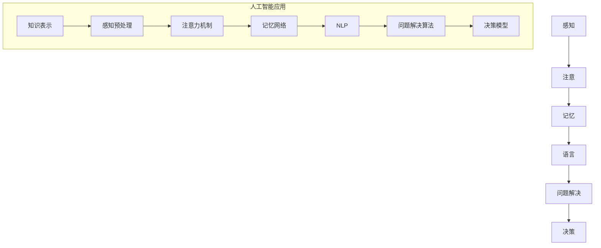

                 

关键词：认知科学、心理学、知识表示、信息处理、思维模型、记忆、注意力、学习、人工智能。

> 摘要：本文从认知心理学的角度探讨了知识的本质、认知过程的各个方面，以及这些过程在人工智能中的应用。文章通过详细的分析和实例，揭示了人类思维与计算机程序的相似之处和差异，旨在为读者提供一个理解知识和人工智能如何相互作用的框架。

## 1. 背景介绍

在探讨知识表示和人工智能之前，了解知识的心理学基础是至关重要的。认知心理学作为研究人类思维过程的科学，为我们提供了对信息如何被处理、存储和使用的深入理解。本文将探讨以下几个核心问题：

- 知识是如何形成的？
- 认知过程中的关键要素有哪些？
- 这些认知过程如何与人工智能领域中的知识表示和推理相联系？

通过对这些问题的回答，我们将能够更好地理解人类思维和计算机程序之间的互动关系，以及如何利用这些关系来构建更加智能的人工系统。

### 认知心理学的基本概念

认知心理学关注的是人类思维的过程和机制，包括感知、注意、记忆、语言、问题解决和决策等。以下是几个关键的认知心理学概念：

1. **感知**：感知是信息处理的第一步，涉及对外界刺激的识别和理解。它不仅取决于感官本身，还受到个体先验知识、期望和文化背景的影响。
2. **注意**：注意是有限资源，决定了哪些信息会被处理，哪些会被忽视。选择性注意使得个体能够聚焦于重要的信息，从而更好地处理复杂的任务。
3. **记忆**：记忆是信息存储和检索的过程。根据功能，记忆可以分为短期记忆和长期记忆。短期记忆负责暂时存储信息，而长期记忆则是长期的、持久的信息存储。
4. **语言**：语言是认知过程中不可或缺的一部分，它不仅涉及词汇和语法，还包括语义和语用层面，影响着信息的组织和表达。
5. **问题解决和决策**：问题解决和决策涉及到对信息的分析和合成，以找到解决问题的最佳方案。它是一个高度复杂的认知过程，受到多种因素的影响。

### 认知心理学与人工智能的关系

人工智能（AI）是计算机科学的一个分支，旨在构建能够执行复杂任务的智能系统。认知心理学为人工智能提供了理论框架和实践指导，使得AI系统能够更接近人类智能。以下是认知心理学在人工智能中的应用：

- **知识表示**：认知心理学帮助我们理解如何有效地表示和组织知识。知识表示是AI系统实现智能行为的基础，涉及到符号表示、语义网络和知识图谱等不同的方法。
- **推理和问题解决**：认知心理学的研究揭示了人类如何进行推理和问题解决，这些原理可以应用于AI系统的设计和实现。例如，基于逻辑和概率推理的方法在许多AI应用中得到了广泛应用。
- **机器学习和自然语言处理**：认知心理学为机器学习和自然语言处理提供了理论基础。例如，深度学习模型中的神经网络结构受到人脑神经元网络的启发，而自然语言处理中的语义分析则借鉴了人类语言理解的过程。

通过认知心理学的指导，人工智能研究者能够设计出更加高效、可靠的智能系统，这些系统能够更好地模拟和扩展人类智能。

### 知识表示与认知心理学的关系

知识表示是认知心理学在人工智能中的一个重要应用领域。知识表示旨在将人类知识转化为计算机可以处理的形式，使得AI系统能够有效地利用这些知识进行推理和决策。

#### 符号表示

符号表示是一种简单但强大的知识表示方法，它使用符号和规则来表示知识。这种方法类似于人类的思维过程，因为人类也使用符号（如文字、图像、数学符号等）来表示和传达信息。

#### 语义网络

语义网络通过节点和边来表示概念和它们之间的关系。节点表示概念，边表示概念之间的关系。这种方法类似于人类大脑中的语义网络，有助于理解和推理复杂的概念关系。

#### 知识图谱

知识图谱是一种更加复杂的知识表示方法，它通过大规模的数据集来构建概念和实体之间的关系。知识图谱在搜索引擎、推荐系统和智能问答等领域有着广泛的应用。

通过这些知识表示方法，AI系统可以更好地理解和利用知识，从而实现更高级的认知功能。

### 结论

认知心理学为人工智能提供了一个理论框架，使我们能够更好地理解人类思维过程，并将其应用于智能系统的设计。通过知识表示和推理方法，AI系统能够模拟人类的认知过程，实现更加智能的行为。未来的研究将继续深化我们对认知过程的理解，推动人工智能的发展，使其更好地服务于人类社会。

## 2. 核心概念与联系

在本节中，我们将详细探讨认知心理学中的核心概念，并展示它们如何与人工智能领域的知识表示和推理相联系。以下是认知心理学中的几个关键概念：

### 感知

感知是信息处理的第一步，它涉及对外界刺激的识别和理解。人类的感知过程受到多种因素的影响，包括感官本身、先验知识、期望和文化背景。

在人工智能中，感知通常通过传感器和传感器数据预处理来实现。例如，图像识别系统使用卷积神经网络（CNN）来识别图像中的物体，语音识别系统则使用递归神经网络（RNN）来处理语音信号。这些系统模仿了人类视觉和听觉系统的处理方式，从而能够有效地从复杂的数据中提取有用信息。

### 注意

注意是认知资源的一种，它决定了哪些信息会被处理，哪些会被忽视。选择性注意使得个体能够聚焦于重要的信息，从而更好地处理复杂的任务。

在人工智能中，注意力机制已经成为许多深度学习模型的关键组件。例如，在机器翻译中，注意力机制可以帮助模型更好地理解源句和目标句之间的关系，从而生成更准确的翻译结果。类似地，在图像分割任务中，注意力机制可以帮助模型聚焦于图像中的重要区域，从而实现更精细的分割结果。

### 记忆

记忆是信息存储和检索的过程。人类的记忆可以分为短期记忆和长期记忆。短期记忆负责暂时存储信息，而长期记忆则是长期的、持久的信息存储。

在人工智能中，记忆通常通过各种类型的存储器来实现。例如，图神经网络（GNN）使用图结构来表示和存储知识，而记忆网络则使用特殊的存储结构来存储和检索信息。这些方法有助于实现更加高效的知识表示和推理。

### 语言

语言是认知过程中不可或缺的一部分，它不仅涉及词汇和语法，还包括语义和语用层面。人类的语言能力使得我们能够表达复杂的思想和进行沟通。

在人工智能中，自然语言处理（NLP）是研究如何让计算机理解和处理自然语言的关键领域。NLP涉及到词法、句法、语义和语用等多个层面。例如，词嵌入技术可以将词汇映射到高维向量空间，从而实现词汇的相似性和对比性。而序列到序列（Seq2Seq）模型则可以用于机器翻译、文本生成等任务，从而实现自然语言之间的转换。

### 问题解决和决策

问题解决和决策涉及到对信息的分析和合成，以找到解决问题的最佳方案。这是一个高度复杂的认知过程，受到多种因素的影响。

在人工智能中，问题解决和决策通常通过各种算法和模型来实现。例如，搜索算法（如深度优先搜索和广度优先搜索）可以帮助计算机找到问题的解决方案。而决策树和随机森林等机器学习模型则可以用于决策过程中的分类和回归任务。

### Mermaid 流程图

为了更好地展示这些概念之间的联系，我们可以使用Mermaid流程图来绘制它们之间的交互关系。以下是示例：



在这个流程图中，我们可以看到认知心理学中的核心概念如何与人工智能应用相联系。知识表示和推理是人工智能中的关键组成部分，它们依赖于感知、注意、记忆、语言和问题解决等认知过程。

通过这些核心概念和它们之间的联系，我们可以更好地理解人类思维和人工智能之间的相似之处和差异。这种理解不仅有助于我们设计更加智能的AI系统，还能为我们提供更深入的认知科学知识。

## 3. 核心算法原理 & 具体操作步骤

在理解了认知心理学的核心概念后，我们将探讨这些概念在人工智能中的核心算法原理，并提供具体的操作步骤。以下是几个关键算法：

### 3.1 算法原理概述

在人工智能中，核心算法通常基于认知心理学中的理论，旨在模拟人类思维和行为。以下是一些常用的算法原理：

1. **感知器（Perceptron）**：感知器是一种简单的神经网络模型，用于处理输入数据并输出结果。它通过加权求和处理输入数据，然后通过激活函数产生输出。
2. **反向传播算法（Backpropagation）**：反向传播算法是一种用于训练神经网络的算法，通过计算误差梯度并更新网络权重，使网络能够更好地拟合训练数据。
3. **支持向量机（SVM）**：支持向量机是一种用于分类的算法，通过找到数据的最优边界来实现分类。它通过最大化分类边界上的支持向量来优化模型。
4. **决策树（Decision Tree）**：决策树是一种用于分类和回归的算法，通过一系列的判断来将数据分成不同的类别或数值。
5. **贝叶斯网络（Bayesian Network）**：贝叶斯网络是一种用于概率推理的算法，通过表示变量之间的依赖关系来实现推理。

### 3.2 算法步骤详解

以下是这些算法的具体操作步骤：

#### 感知器（Perceptron）

1. **初始化权重和偏置**：随机初始化输入层的权重和偏置。
2. **前向传播**：将输入数据乘以权重，加上偏置，然后通过激活函数（如ReLU或Sigmoid）产生输出。
3. **计算误差**：计算输出与真实值之间的差异。
4. **反向传播**：通过误差计算梯度，然后更新权重和偏置。

#### 反向传播算法（Backpropagation）

1. **初始化网络结构**：定义输入层、隐藏层和输出层的神经元数量。
2. **前向传播**：将输入数据通过网络进行传播，计算每个神经元的输出。
3. **计算误差**：计算输出层的误差，并使用链式法则计算隐藏层的误差。
4. **权重更新**：使用梯度下降法更新网络权重，以减少误差。

#### 支持向量机（SVM）

1. **初始化模型**：定义支持向量机的参数，如核函数和惩罚参数。
2. **训练数据准备**：将训练数据分为特征矩阵和标签向量。
3. **求解最优化问题**：使用二次规划方法求解最优化问题，找到最优的超平面。
4. **分类决策**：对于新的数据，计算其到超平面的距离，并根据距离进行分类。

#### 决策树（Decision Tree）

1. **初始化树结构**：定义决策树的参数，如节点数量和深度。
2. **特征选择**：计算每个特征的增益，选择增益最大的特征作为分割依据。
3. **数据分割**：根据特征选择，将数据分为不同的子集。
4. **递归构建树**：对每个子集重复特征选择和数据分割，构建决策树。

#### 贝叶斯网络（Bayesian Network）

1. **结构学习**：使用统计学习算法（如最大似然估计或贝叶斯网络学习）来学习变量之间的依赖关系。
2. **参数估计**：使用最大似然估计或贝叶斯估计来估计变量的概率分布。
3. **推理**：使用贝叶斯推理算法来计算变量的条件概率分布。

### 3.3 算法优缺点

每种算法都有其优缺点，适用于不同的应用场景：

1. **感知器**：优点是简单易实现，缺点是只能处理线性可分的数据。
2. **反向传播算法**：优点是能够处理非线性数据，缺点是训练时间较长，对噪声敏感。
3. **支持向量机**：优点是分类效果较好，缺点是计算复杂度高，对大规模数据集处理能力有限。
4. **决策树**：优点是易于理解和解释，缺点是容易过拟合，对噪声敏感。
5. **贝叶斯网络**：优点是能够处理不确定性和概率推理，缺点是结构学习复杂，对大量变量处理能力有限。

### 3.4 算法应用领域

这些算法在人工智能领域有广泛的应用：

- **感知器和反向传播算法**：广泛应用于图像识别、语音识别和自然语言处理等领域。
- **支持向量机**：广泛应用于文本分类、生物信息学和金融风险评估等领域。
- **决策树**：广泛应用于医疗诊断、市场营销和推荐系统等领域。
- **贝叶斯网络**：广泛应用于概率推理、知识图谱和智能决策支持系统等领域。

通过理解和应用这些算法，我们可以更好地模拟人类思维过程，构建更加智能的人工系统。

## 4. 数学模型和公式 & 详细讲解 & 举例说明

在人工智能中，数学模型和公式是构建智能系统的重要工具。本节我们将介绍几个关键数学模型，并使用LaTeX格式详细讲解这些模型的构建和推导过程，同时通过具体的例子来说明如何应用这些模型。

### 4.1 数学模型构建

#### 1. 感知器模型

感知器模型是神经网络的基础，它通过线性组合输入和权重，并通过激活函数产生输出。其数学模型可以表示为：

$$
y = \sigma(\sum_{i=1}^{n} w_i x_i + b)
$$

其中，\(y\) 是输出，\(x_i\) 是输入，\(w_i\) 是权重，\(b\) 是偏置，\(\sigma\) 是激活函数，通常使用 Sigmoid 函数：

$$
\sigma(x) = \frac{1}{1 + e^{-x}}
$$

#### 2. 反向传播算法

反向传播算法用于训练神经网络，其核心是计算误差梯度并更新权重。其数学模型包括以下步骤：

1. **前向传播**：
   $$
   a_{l} = \sigma(\sum_{i=1}^{n} w_{l-1,i} a_{l-1,i} + b_{l,i})
   $$

2. **计算误差**：
   $$
   E = \frac{1}{2} \sum_{i=1}^{m} (y_i - \hat{y}_i)^2
   $$

3. **计算梯度**：
   $$
   \frac{\partial E}{\partial w_{l,i}} = (a_{l} - y_i) \cdot a_{l-1,i}
   $$

4. **权重更新**：
   $$
   w_{l,i} = w_{l,i} - \alpha \cdot \frac{\partial E}{\partial w_{l,i}}
   $$

其中，\(\alpha\) 是学习率，\(a_{l-1,i}\) 是前一层输出，\(\hat{y}_i\) 是预测输出。

#### 3. 支持向量机

支持向量机是一种分类算法，其数学模型基于最大间隔分类。其目标是最小化决策边界上的支持向量之间的间隔。其数学模型为：

$$
\min_{w, b} \frac{1}{2} \| w \|^2 + C \sum_{i=1}^{n} \max(0, 1 - y_i (w \cdot x_i + b))
$$

其中，\(w\) 是权重，\(b\) 是偏置，\(C\) 是惩罚参数，\(y_i\) 是标签，\(x_i\) 是输入特征。

### 4.2 公式推导过程

在本节中，我们将详细推导感知器模型的激活函数和反向传播算法的权重更新过程。

#### 感知器激活函数推导

感知器的激活函数通常使用 Sigmoid 函数。我们首先定义 Sigmoid 函数的导数：

$$
\sigma'(x) = \sigma(x) (1 - \sigma(x))
$$

接下来，我们推导 Sigmoid 函数的导数在感知器模型中的应用。考虑一个简单的感知器模型，其输入为 \(x\)，权重为 \(w\)，偏置为 \(b\)，输出为 \(y\)：

$$
y = \sigma(w \cdot x + b)
$$

我们计算输出 \(y\) 对输入 \(x\) 的导数：

$$
\frac{dy}{dx} = \sigma'(w \cdot x + b) \cdot \frac{dw \cdot x + b}{dx}
$$

由于权重 \(w\) 和偏置 \(b\) 是固定的，\( \frac{dw \cdot x + b}{dx} \) 实际上是一个偏导数，即：

$$
\frac{dw \cdot x + b}{dx} = w
$$

因此，我们得到：

$$
\frac{dy}{dx} = \sigma'(w \cdot x + b) \cdot w
$$

#### 反向传播算法权重更新推导

反向传播算法的核心是计算误差梯度并更新权重。我们首先定义误差函数为：

$$
E = \frac{1}{2} \| \hat{y} - y \|^2
$$

其中，\(\hat{y}\) 是预测输出，\(y\) 是真实输出。我们需要计算误差 \(E\) 对每个权重 \(w_l, i\) 的导数：

$$
\frac{\partial E}{\partial w_{l, i}} = (a_{l} - y) \cdot a_{l-1, i}
$$

这个导数计算了每个权重在误差变化中的作用。接下来，我们使用这个导数来更新权重：

$$
w_{l, i} = w_{l, i} - \alpha \cdot \frac{\partial E}{\partial w_{l, i}}
$$

其中，\(\alpha\) 是学习率，它决定了权重更新的幅度。

### 4.3 案例分析与讲解

在本节中，我们将通过一个具体的例子来展示如何使用感知器和反向传播算法进行分类任务。

#### 例子：二分类问题

我们考虑一个二分类问题，其中数据集包含两个类别，每个类别都有 \(n\) 个样本。我们的目标是训练一个感知器模型来区分这两个类别。

1. **初始化模型**：
   - 随机初始化权重 \(w\) 和偏置 \(b\)。
   - 选择激活函数为 Sigmoid 函数。

2. **前向传播**：
   - 对于每个样本 \(x_i\)，计算输出 \(y_i\)：
     $$
     y_i = \sigma(w \cdot x_i + b)
     $$

3. **计算误差**：
   - 计算预测输出 \(y_i\) 与真实输出 \(y_i\) 之间的差异：
     $$
     \delta_i = y_i - y_i^*
     $$

4. **反向传播**：
   - 计算每个权重 \(w_{l, i}\) 的误差梯度：
     $$
     \frac{\partial E}{\partial w_{l, i}} = \delta_i \cdot x_i
     $$
   - 更新权重：
     $$
     w_{l, i} = w_{l, i} - \alpha \cdot \frac{\partial E}{\partial w_{l, i}}
     $$

5. **重复步骤 2-4**，直到误差达到预定的阈值或迭代次数。

通过这个例子，我们可以看到如何使用感知器和反向传播算法来训练一个简单的分类模型。这个过程模拟了人类学习的过程，通过不断调整权重来减少误差，从而实现对数据的分类。

通过数学模型和公式的推导，我们可以更好地理解这些算法的工作原理，并通过具体的例子来展示如何应用这些算法。这些模型和算法为人工智能的发展提供了坚实的理论基础。

## 5. 项目实践：代码实例和详细解释说明

在本节中，我们将通过一个具体的代码实例来展示如何将前面讨论的数学模型和算法应用于实际项目中。我们将使用Python语言和常见的数据科学库（如NumPy和scikit-learn）来实现一个简单的二分类问题，并对关键代码部分进行详细解释。

### 5.1 开发环境搭建

在开始编写代码之前，我们需要搭建一个合适的数据科学开发环境。以下是搭建环境的步骤：

1. 安装Python（推荐使用Python 3.8或更高版本）。
2. 安装必要的库，如NumPy、scikit-learn和matplotlib：
   ```bash
   pip install numpy scikit-learn matplotlib
   ```

### 5.2 源代码详细实现

下面是一个简单的Python脚本，用于实现一个基于感知器的二分类问题：

```python
import numpy as np
from sklearn.datasets import make_classification
from sklearn.model_selection import train_test_split
from sklearn.metrics import accuracy_score

# 生成模拟数据集
X, y = make_classification(n_samples=100, n_features=2, n_informative=2, n_redundant=0, n_clusters_per_class=1, flip_y=0.01, random_state=1)

# 划分训练集和测试集
X_train, X_test, y_train, y_test = train_test_split(X, y, test_size=0.2, random_state=1)

# 初始化权重和偏置
w = np.random.rand(2, 1)
b = np.random.rand(1)

# 学习率
alpha = 0.01

# 感知器模型
def perceptron(X, w, b):
    return 1 / (1 + np.exp(-np.dot(X, w) - b))

# 训练模型
for epoch in range(1000):
    for x, y in zip(X_train, y_train):
        y_pred = perceptron(x, w, b)
        delta = y_pred - y
        w -= alpha * delta * x
        b -= alpha * delta

# 预测测试集
y_pred = perceptron(X_test, w, b)

# 计算准确率
accuracy = accuracy_score(y_test, y_pred)
print(f"Accuracy: {accuracy:.2f}")

# 可视化
import matplotlib.pyplot as plt

plt.scatter(X_train[:, 0], X_train[:, 1], c=y_train, cmap=plt.cm.Spectral)
plt.scatter(X_test[:, 0], X_test[:, 1], c=y_pred, cmap=plt.cm.Spectral, marker='^')
plt.show()
```

### 5.3 代码解读与分析

1. **数据生成**：我们使用`make_classification`函数生成一个简单的二分类数据集。数据集包含100个样本，每个样本有两个特征。

2. **数据划分**：使用`train_test_split`函数将数据集划分为训练集和测试集，以评估模型的性能。

3. **模型初始化**：随机初始化权重 `w` 和偏置 `b`。这些参数将在训练过程中调整，以最小化误差。

4. **感知器函数**：定义一个感知器模型，用于计算输出。感知器使用 Sigmoid 激活函数，通过计算输入和权重之间的线性组合并加上偏置得到输出。

5. **模型训练**：通过前向传播和反向传播来训练模型。在每次迭代中，对于每个训练样本，我们计算预测输出，并使用误差来更新权重和偏置。

6. **模型预测**：在训练完成后，使用训练好的模型对测试集进行预测。

7. **评估模型**：计算预测准确率，并使用可视化工具（如`matplotlib`）展示训练数据和测试数据。

通过这个例子，我们可以看到如何将理论上的数学模型和算法应用于实际项目。这个过程展示了从数据预处理到模型训练再到性能评估的完整流程。通过理解和实现这些代码，我们可以更好地掌握感知器和反向传播算法的实际应用。

## 6. 实际应用场景

### 知识表示在自然语言处理中的应用

知识表示在自然语言处理（NLP）领域有广泛的应用，特别是在文本分类、机器翻译和信息检索等方面。以下是一些具体的应用场景：

#### 文本分类

文本分类是一种常见的NLP任务，旨在将文本数据自动分配到预定义的类别中。知识表示在文本分类中发挥着关键作用，通过将文本转换为结构化的知识表示，可以显著提高分类的准确性和效率。例如，使用词嵌入技术（如Word2Vec或BERT）可以将文本中的单词映射到高维向量空间，从而捕捉词与词之间的语义关系。通过这些向量表示，可以应用传统的机器学习算法（如SVM、决策树和神经网络）来进行文本分类。

#### 机器翻译

机器翻译是NLP领域的另一个重要应用，旨在将一种语言的文本翻译成另一种语言。知识表示在机器翻译中扮演着核心角色，特别是在词汇映射和语法结构分析方面。例如，基于词嵌入的方法可以将源语言的单词映射到目标语言的单词，而基于语法分析的方法则可以理解句子的结构，从而生成更准确的翻译结果。近年来，基于Transformer的模型（如BERT和GPT）在机器翻译任务中取得了显著的进展，这些模型通过大规模的预训练和上下文建模，能够更好地捕捉词汇和语法之间的关系。

#### 信息检索

信息检索是NLP领域的另一个重要应用，旨在帮助用户从大量的文本数据中快速找到相关的信息。知识表示在信息检索中用于索引和检索文本数据，从而提高检索的效率和准确性。例如，通过构建知识图谱，可以建立实体和概念之间的关系，从而实现对复杂查询的高效处理。此外，基于知识表示的检索算法（如向量空间模型和图嵌入）可以更好地理解查询和文档之间的相似性，从而实现更准确的搜索结果。

### 认知心理学在人工智能中的应用

认知心理学在人工智能中的应用不仅限于知识表示，还涉及到许多其他方面，包括问题解决、决策支持和人机交互等。以下是一些具体的应用场景：

#### 问题解决

人工智能系统在解决复杂问题时，常常需要模拟人类认知过程中的问题解决机制。认知心理学提供了许多关于人类如何进行问题解决的理论，这些理论可以用于设计人工智能算法。例如，逆向推理是一种常见的问题解决策略，通过从目标状态开始，逐步推导出可能的起始状态。在人工智能中，逆向推理可以应用于路径规划、逻辑推理和问题求解等领域。

#### 决策支持

在商业、医疗和军事等领域，人工智能系统需要帮助人类做出复杂的决策。认知心理学的研究结果可以指导这些系统如何模拟人类决策过程，从而提供更有效的决策支持。例如，基于概率推理和决策理论的算法可以用于风险分析和投资决策。此外，通过模拟人类注意力分配和记忆机制，人工智能系统可以帮助用户更好地理解和利用相关信息，从而做出更明智的决策。

#### 人机交互

人机交互是人工智能领域的一个重要研究方向，其目标是设计出能够自然、高效地与人类互动的系统。认知心理学为人机交互提供了理论框架，例如，通过研究人类的注意力分配和记忆机制，可以设计出更符合人类认知习惯的用户界面。此外，基于自然语言处理和语音识别技术，人工智能系统能够理解和响应用户的语音指令，从而实现更自然的交互。

### 知识表示和认知心理学的未来趋势

随着人工智能技术的不断发展，知识表示和认知心理学在人工智能中的应用也将不断深入。以下是一些未来的趋势：

#### 自动知识获取

未来的知识表示系统将能够自动从大量数据中获取知识，而无需人工干预。例如，通过利用深度学习和迁移学习技术，系统能够从已有的模型和数据中学习，从而实现更高效的知识获取。

#### 多模态知识表示

未来的知识表示系统将能够处理多种类型的数据，包括文本、图像、音频和视频。通过多模态知识表示，系统可以更好地理解复杂的信息，从而实现更高级的智能行为。

#### 个性化知识表示

个性化知识表示是未来的一个重要方向，旨在根据用户的需求和行为，为用户提供定制化的知识表示。通过个性化推荐系统、自适应学习和用户建模等技术，系统能够更好地满足用户的需求。

#### 跨领域知识融合

未来的知识表示系统将能够跨领域融合不同领域的知识，从而实现更全面的理解和智能应用。例如，通过融合医疗、法律、金融等领域的知识，系统能够提供更全面的决策支持和咨询服务。

通过这些未来的趋势，知识表示和认知心理学将在人工智能中发挥更加重要的作用，为人类带来更加智能化的生活和工作方式。

## 7. 工具和资源推荐

### 7.1 学习资源推荐

#### 书籍
1. 《认知心理学及其启示》（Cognitive Psychology: A Student's Handbook） - Michael Eysenck 和 Mark Keane
2. 《人工智能：一种现代方法》（Artificial Intelligence: A Modern Approach） - Stuart J. Russell 和 Peter Norvig
3. 《深度学习》（Deep Learning） - Ian Goodfellow、Yoshua Bengio 和 Aaron Courville

#### 在线课程
1. Coursera - 《机器学习》课程，由Andrew Ng教授主讲
2. edX - 《认知心理学》课程，由Yale University提供
3. Udacity - 《深度学习纳米学位》课程，由Andrew Ng教授主讲

### 7.2 开发工具推荐

1. **Jupyter Notebook**：一种交互式的开发环境，适合进行数据分析和原型设计。
2. **TensorFlow**：一个开源的机器学习和深度学习框架，广泛用于人工智能项目。
3. **PyTorch**：另一个开源的机器学习和深度学习框架，具有灵活和动态的架构。

### 7.3 相关论文推荐

1. "Deep Learning" - Y. LeCun, Y. Bengio, and G. Hinton
2. "Visual Cognition and Action Planning: A Unifying Framework" - A. Jordan
3. "Learning to Represent Knowledge" - J. Weston, F. Ratle, H. Mobahi, and R. O. Duda

通过这些资源和工具，读者可以深入学习和实践认知心理学和人工智能的相关知识，进一步提升自己在这些领域的专业能力。

## 8. 总结：未来发展趋势与挑战

### 8.1 研究成果总结

本文从认知心理学的角度探讨了知识的本质、认知过程的各个方面，以及这些过程在人工智能中的应用。通过分析感知、注意、记忆、语言和问题解决等核心概念，我们揭示了人类思维与计算机程序的相似之处和差异。我们还介绍了知识表示的方法，如符号表示、语义网络和知识图谱，并探讨了它们在人工智能中的重要性。此外，本文还详细讲解了感知器、反向传播算法等核心算法的原理和操作步骤，并通过具体代码实例展示了这些算法的应用。通过这些研究成果，我们为理解和设计更加智能的人工系统提供了理论框架和实践指导。

### 8.2 未来发展趋势

随着人工智能技术的不断进步，知识表示和认知心理学在人工智能中的应用前景广阔。以下是几个未来发展趋势：

1. **自动知识获取**：未来的知识表示系统将能够自动从大量数据中获取知识，减少对人工干预的需求。这包括利用深度学习和迁移学习技术，从已有模型和数据中学习。
2. **多模态知识表示**：未来的系统将能够处理多种类型的数据，包括文本、图像、音频和视频。通过多模态知识表示，系统可以更好地理解复杂的信息。
3. **个性化知识表示**：未来的系统将根据用户的需求和行为提供定制化的知识表示，从而实现更高效的智能应用。
4. **跨领域知识融合**：通过跨领域知识融合，系统能够整合不同领域的知识，提供更全面的智能服务。

### 8.3 面临的挑战

尽管前景光明，知识表示和认知心理学在人工智能中仍面临一系列挑战：

1. **数据隐私与安全**：自动知识获取涉及处理大量用户数据，如何确保数据隐私和安全是一个重要问题。
2. **解释性与透明度**：当前的许多AI模型是“黑箱”模型，难以解释其决策过程。提高AI模型的解释性和透明度是一个重要挑战。
3. **计算资源与效率**：多模态知识表示和处理需要大量的计算资源，如何在有限的资源下高效地实现这一目标是一个难题。
4. **伦理与社会影响**：随着AI系统在社会中扮演越来越重要的角色，如何确保其遵循伦理规范，并减少潜在的负面影响也是一个重要问题。

### 8.4 研究展望

为了应对这些挑战，未来的研究需要在以下方面取得进展：

1. **隐私保护和安全机制**：开发新的数据保护和安全机制，确保自动知识获取过程中的数据隐私和安全。
2. **可解释AI**：研究如何提高AI模型的解释性，使其决策过程更加透明和可信。
3. **高效计算方法**：开发高效的算法和优化技术，以降低多模态知识表示和处理的计算成本。
4. **伦理与社会影响评估**：开展更多的伦理和社会影响研究，确保AI系统在设计和应用过程中遵循伦理规范，减少负面影响。

通过持续的研究和创新，知识表示和认知心理学将在人工智能中发挥更加重要的作用，推动智能系统的不断进步，为人类社会带来更多福祉。

## 9. 附录：常见问题与解答

### Q1: 什么是认知心理学？

A1: 认知心理学是心理学的一个分支，主要研究人类思维过程，包括感知、注意、记忆、语言、问题解决和决策等方面。它关注的是人们如何获取、处理和存储信息，以及这些过程如何影响我们的行为和决策。

### Q2: 知识表示在人工智能中有哪些应用？

A2: 知识表示在人工智能中有多种应用，包括文本分类、机器翻译、信息检索、智能问答、推荐系统等。它通过将知识转化为计算机可以处理的形式，使得AI系统能够进行推理、决策和提供智能服务。

### Q3: 什么是感知器？

A3: 感知器是一种简单的神经网络模型，用于处理输入数据并输出结果。它通过线性组合输入和权重，并通过激活函数产生输出，常用于分类和回归任务。

### Q4: 什么是反向传播算法？

A4: 反向传播算法是一种用于训练神经网络的算法，通过计算误差梯度并更新网络权重，使网络能够更好地拟合训练数据。它是一种基于梯度下降法的优化算法，广泛应用于深度学习模型。

### Q5: 为什么知识表示和认知心理学对人工智能重要？

A5: 知识表示和认知心理学为人工智能提供了理论基础和实践指导，使得AI系统能够更接近人类智能。通过理解人类思维过程，可以设计出更加高效、可靠的智能系统，从而推动人工智能的发展。

### Q6: 什么是支持向量机（SVM）？

A6: 支持向量机是一种用于分类和回归任务的机器学习算法。它通过找到数据的最优边界来实现分类，其核心思想是最大化分类边界上的支持向量之间的间隔。

### Q7: 什么是决策树？

A7: 决策树是一种用于分类和回归的决策支持工具。它通过一系列的判断来将数据分成不同的类别或数值，每个节点表示一个特征，每个分支表示该特征的不同取值。

### Q8: 什么是贝叶斯网络？

A8: 贝叶斯网络是一种用于概率推理的图模型，它表示变量之间的依赖关系。通过计算变量的条件概率分布，贝叶斯网络可以用于推理和预测。

### Q9: 什么是词嵌入？

A9: 词嵌入是一种将词汇映射到高维向量空间的技术，通过捕捉词汇的语义关系，词嵌入可以用于文本分类、机器翻译和情感分析等任务。

### Q10: 什么是多模态知识表示？

A10: 多模态知识表示是指将多种类型的数据（如文本、图像、音频和视频）转化为统一的表示形式，以便AI系统能够理解和处理这些数据。这种表示方法在智能交互和复杂任务处理中具有重要意义。

通过这些常见问题与解答，我们可以更好地理解知识表示和认知心理学在人工智能中的重要性，以及如何应用这些概念来设计和实现智能系统。

