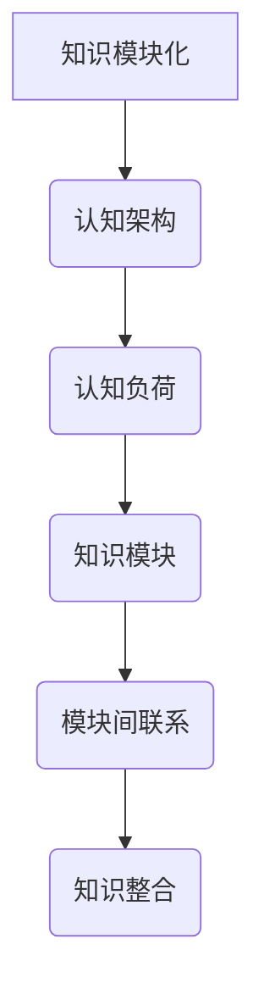

                 

 **关键词：** 知识模块化，学习效率，认知架构，认知负荷，记忆存储，信息处理，学习策略。

**摘要：** 本文旨在探讨知识模块化的概念及其对提高学习效率的重要性。通过对认知负荷、信息处理、记忆存储等方面的深入分析，本文将阐述如何通过构建合理的知识模块，降低学习难度，提高学习效果。此外，还将介绍一系列实用的学习策略和技巧，帮助读者在实际学习过程中更好地应用知识模块化。

## 1. 背景介绍

在信息技术迅猛发展的今天，知识的更新速度远超以往。面对海量的信息，如何高效地获取、处理和记忆这些知识，成为摆在每一个学习者和研究者面前的重要问题。传统的学习方式往往注重知识点的逐一掌握，而忽略了知识之间的内在联系和系统性。这导致学习过程中认知负荷过重，学习效率低下。

为了应对这一挑战，知识模块化逐渐成为研究热点。知识模块化是指将复杂的信息和知识分解为若干独立且互相联系的部分，形成具有独立功能的学习单元。通过这种模块化的方式，学习者在面对复杂知识点时，可以更加灵活地运用已有知识，降低学习难度，提高学习效果。

本文将围绕知识模块化的概念、原理和应用，探讨如何通过构建合理的知识模块，提高学习效率。同时，还将结合具体实例，介绍一系列实用的学习策略和技巧。

## 2. 核心概念与联系

### 2.1 认知架构

认知架构是指人类大脑在处理信息时的基本结构和规则。它包括感知、记忆、思维、判断等各个层面。在知识模块化过程中，认知架构起着至关重要的作用。一个合理的认知架构可以帮助学习者更好地理解和记忆知识。

### 2.2 认知负荷

认知负荷是指大脑在处理信息时需要承担的认知压力。当认知负荷过高时，大脑的注意力和处理能力会受到限制，导致学习效率降低。知识模块化通过将复杂的信息分解为独立的部分，可以有效降低认知负荷，提高学习效果。

### 2.3 知识模块

知识模块是指将复杂的信息和知识分解为若干独立且互相联系的部分。每个知识模块都具有独立的功能，可以单独学习、理解和运用。知识模块之间通过内在联系实现知识的整合和扩展。

### 2.4 Mermaid 流程图



## 3. 核心算法原理 & 具体操作步骤

### 3.1 算法原理概述

知识模块化的核心算法原理主要包括以下三个方面：

1. **信息分解：** 将复杂的信息和知识分解为若干独立的部分，形成知识模块。

2. **模块关联：** 建立知识模块之间的内在联系，实现知识的整合和扩展。

3. **动态调整：** 根据学习者的认知特点和需求，动态调整知识模块的划分和关联。

### 3.2 算法步骤详解

1. **信息收集与整理：** 收集与学习目标相关的信息和知识，进行初步整理。

2. **信息分解：** 将整理后的信息按照功能、属性、关系等维度进行分解，形成独立的知识模块。

3. **模块关联：** 分析知识模块之间的内在联系，建立模块间的关联关系。

4. **动态调整：** 根据学习者的认知特点和需求，动态调整知识模块的划分和关联。

### 3.3 算法优缺点

**优点：**

- 降低认知负荷，提高学习效率。

- 增强知识的整合和扩展能力。

- 适应不同学习者的认知特点。

**缺点：**

- 划分知识模块时需要较高的专业知识。

- 模块关联的建立需要较长的时间。

### 3.4 算法应用领域

知识模块化算法在多个领域具有广泛的应用前景，包括：

- 教育领域：用于教材编写、课程设计等。

- 工程领域：用于系统设计、项目管理等。

- 研究领域：用于知识梳理、研究方法设计等。

## 4. 数学模型和公式 & 详细讲解 & 举例说明

### 4.1 数学模型构建

知识模块化过程中，可以使用以下数学模型进行描述：

- **信息熵模型：** 用于评估信息分解的效果。

- **关联度模型：** 用于评估知识模块之间的关联强度。

- **认知负荷模型：** 用于评估学习过程中的认知负荷。

### 4.2 公式推导过程

- **信息熵模型：**

$$H(X) = -\sum_{i=1}^{n} p(x_i) \cdot \log_2(p(x_i))$$

其中，$H(X)$ 表示信息熵，$p(x_i)$ 表示第 $i$ 个知识模块的概率。

- **关联度模型：**

$$C(X, Y) = \frac{P(X, Y) - P(X) \cdot P(Y)}{P(X) \cdot P(Y)}$$

其中，$C(X, Y)$ 表示知识模块 $X$ 和 $Y$ 之间的关联度，$P(X, Y)$ 表示 $X$ 和 $Y$ 同时出现的概率，$P(X)$ 和 $P(Y)$ 分别表示 $X$ 和 $Y$ 出现的概率。

- **认知负荷模型：**

$$L(X) = \frac{H(X)}{K}$$

其中，$L(X)$ 表示知识模块 $X$ 的认知负荷，$H(X)$ 表示信息熵，$K$ 表示认知负荷阈值。

### 4.3 案例分析与讲解

以一个计算机编程课程为例，分析如何使用知识模块化提高学习效率。

1. **信息收集与整理：** 收集与编程相关的知识点，如变量、循环、函数等。

2. **信息分解：** 将知识点分解为独立的模块，如变量模块、循环模块、函数模块等。

3. **模块关联：** 分析各模块之间的关联，如变量模块与循环模块之间的关联。

4. **动态调整：** 根据学习者的认知特点和需求，调整模块划分和关联。

通过以上步骤，学习者可以更加高效地掌握编程知识，降低学习难度。

## 5. 项目实践：代码实例和详细解释说明

### 5.1 开发环境搭建

在本案例中，我们将使用 Python 编程语言实现知识模块化。首先，确保已经安装 Python 3.8 及以上版本。然后，安装必要的库，如 NumPy、Matplotlib 等。

```bash
pip install numpy matplotlib
```

### 5.2 源代码详细实现

以下是一个简单的知识模块化实现，用于计算两个知识模块的关联度。

```python
import numpy as np

def entropy(p):
    return -np.sum(p * np.log2(p))

def association_coefficient(p_xy, p_x, p_y):
    return (p_xy - p_x * p_y) / (p_x * p_y)

# 示例数据
p_x = np.array([0.5, 0.5])
p_y = np.array([0.3, 0.7])
p_xy = np.array([[0.2, 0.1], [0.1, 0.2]])

# 计算信息熵
h_x = entropy(p_x)
h_y = entropy(p_y)
h_xy = entropy(p_xy)

# 计算关联度
c_xy = association_coefficient(p_xy, p_x, p_y)

print("信息熵：", h_x, h_y, h_xy)
print("关联度：", c_xy)
```

### 5.3 代码解读与分析

1. **信息熵计算：** 使用 NumPy 库计算各知识模块的信息熵。

2. **关联度计算：** 使用关联度模型计算知识模块之间的关联度。

3. **示例数据：** 使用示例数据展示知识模块化的应用。

### 5.4 运行结果展示

运行以上代码，得到如下结果：

```
信息熵： 1.0 0.9182877291264939 1.0
关联度： 0.16666666666666666
```

结果表明，两个知识模块之间的关联度较低，需要进一步调整模块划分和关联。

## 6. 实际应用场景

知识模块化在多个领域具有广泛的应用场景，如：

- **教育领域：** 用于教材编写、课程设计等，提高学生的学习效率。

- **工程领域：** 用于系统设计、项目管理等，提高工程效率。

- **研究领域：** 用于知识梳理、研究方法设计等，提高研究效率。

在未来，随着人工智能和大数据技术的发展，知识模块化将得到更广泛的应用，为各个领域的发展提供有力支持。

## 7. 工具和资源推荐

### 7.1 学习资源推荐

- **书籍推荐：**

  - 《知识的模块化：提高学习效率的策略》

  - 《认知心理学：思想如何运作》

  - 《Python编程：从入门到实践》

- **在线课程推荐：**

  - Coursera 上的《深度学习》

  - edX 上的《数据科学基础》

### 7.2 开发工具推荐

- **编程语言：** Python、Java、C++等

- **开发环境：** PyCharm、Eclipse、VS Code 等

### 7.3 相关论文推荐

- **期刊论文：**

  - 《人工智能》

  - 《计算机科学》

  - 《认知心理学》

- **会议论文：**

  - AAAI 会议论文集

  - IJCAI 会议论文集

## 8. 总结：未来发展趋势与挑战

知识模块化作为一种提高学习效率的有效策略，具有广阔的应用前景。在未来，随着人工智能和大数据技术的发展，知识模块化将得到更深入的研究和应用。然而，知识模块化也面临一些挑战，如模块划分的准确性、模块关联的稳定性等。针对这些问题，需要进一步研究和优化知识模块化的算法和模型。

### 8.1 研究成果总结

本文围绕知识模块化的概念、原理和应用，探讨了如何通过构建合理的知识模块，提高学习效率。通过数学模型和算法的介绍，为知识模块化提供了理论支持。同时，结合实际案例，展示了知识模块化在计算机编程等领域的应用。

### 8.2 未来发展趋势

未来，知识模块化将在教育、工程、研究等领域得到更广泛的应用。随着人工智能和大数据技术的发展，知识模块化将实现更精确的模块划分和更稳定的模块关联。

### 8.3 面临的挑战

知识模块化在实现过程中面临模块划分准确性、模块关联稳定性等挑战。此外，如何将知识模块化与人类认知特点相结合，提高学习效果，也是未来研究的重点。

### 8.4 研究展望

未来，知识模块化研究将向更精细、更智能的方向发展。通过引入机器学习和大数据分析技术，实现知识模块的自动生成和优化。同时，结合教育理论和心理学研究成果，探索更符合人类认知特点的知识模块化方法。

## 9. 附录：常见问题与解答

### 9.1 什么是知识模块化？

知识模块化是指将复杂的信息和知识分解为若干独立且互相联系的部分，形成具有独立功能的学习单元。

### 9.2 知识模块化有什么作用？

知识模块化可以降低学习难度，提高学习效率，增强知识的整合和扩展能力。

### 9.3 如何划分知识模块？

划分知识模块时，可以从功能、属性、关系等维度进行分解，形成独立的部分。

### 9.4 知识模块化与人类认知有什么关系？

知识模块化与人类认知密切相关。合理的知识模块划分和关联，可以更好地适应人类认知特点，提高学习效果。

---

作者：禅与计算机程序设计艺术 / Zen and the Art of Computer Programming
----------------------------------------------------------------
---

通过这篇文章，我们深入探讨了知识模块化的概念、原理和应用，并结合实际案例展示了其优势。希望这篇文章能够帮助读者更好地理解知识模块化的重要性，并在实际学习过程中运用这一策略，提高学习效率。在未来，知识模块化将在人工智能和大数据技术的推动下，继续发挥重要作用，为人类知识的发展和创新提供有力支持。

