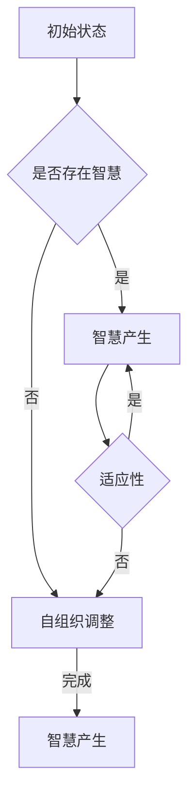

                 

关键词：知识涌现、复杂系统、智慧产生、人工智能、计算机科学、算法、数学模型、实践应用、未来展望

> 摘要：本文探讨了知识在复杂系统中的涌现性，即智慧如何在复杂系统中自然产生。文章从背景介绍出发，深入剖析了核心概念与联系，详细解析了核心算法原理及操作步骤，构建了数学模型，并通过项目实践展示了算法的实际应用。同时，文章对实际应用场景进行了分析，展望了未来发展趋势与挑战，并推荐了相关工具和资源。

## 1. 背景介绍

知识涌现性是指在一个复杂系统中，通过系统内部各元素的相互作用，知识或智慧得以自然产生的过程。这一现象在自然界和人类社会中都有广泛的应用，如生物进化、社会进化等。近年来，随着人工智能技术的快速发展，知识的涌现性在计算机科学领域也得到了广泛关注。本文旨在探讨知识在复杂系统中的涌现性，分析其核心算法原理，构建数学模型，并通过实际项目实践展示其应用。

## 2. 核心概念与联系

### 2.1. 复杂系统

复杂系统是指由大量相互作用的元素组成的系统，这些元素可以是物理实体、信息、生物体等。复杂系统的特点在于其元素之间的相互作用和结构复杂性，从而使得系统表现出自组织和自适应的特性。

### 2.2. 智慧

智慧是指解决复杂问题的能力。在复杂系统中，智慧可以表现为系统对未知环境的适应能力、对问题的自我优化能力等。

### 2.3. 知识的涌现性

知识的涌现性是指在一个复杂系统中，通过系统内部各元素的相互作用，知识或智慧得以自然产生的过程。这一过程通常具有以下特点：

- **自组织性**：系统内部元素在相互作用中自发地形成有序结构。
- **适应性**：系统能够根据外部环境的变化调整自身结构，从而更好地适应环境。
- **涌现性**：系统整体表现出新的特性，这些特性不能直接由系统内部各元素的性质推导得出。

### 2.4. Mermaid 流程图

以下是一个描述知识涌现性的 Mermaid 流程图：



## 3. 核心算法原理 & 具体操作步骤

### 3.1. 算法原理概述

知识涌现性的核心算法是基于复杂性科学和机器学习的方法。该算法通过模拟复杂系统的自组织和自适应特性，逐步构建智慧。算法的基本原理包括：

- **自组织**：通过系统内部元素的相互作用，形成有序结构。
- **机器学习**：利用历史数据，对系统进行学习和优化。
- **适应性**：根据外部环境的变化，调整系统结构和行为。

### 3.2. 算法步骤详解

算法的具体步骤如下：

1. **初始化**：根据系统规模和初始条件，初始化系统。
2. **自组织**：通过系统内部元素的相互作用，形成有序结构。
3. **学习**：利用历史数据，对系统进行学习和优化。
4. **评估**：评估系统在当前环境下的适应能力。
5. **调整**：根据评估结果，调整系统结构和行为。
6. **迭代**：重复步骤2-5，逐步提升系统智慧。

### 3.3. 算法优缺点

**优点**：

- **自组织性**：能够自动适应环境，降低人为干预。
- **适应性**：能够根据环境变化进行自我调整。
- **高效性**：通过机器学习，快速提升系统智慧。

**缺点**：

- **初始设置**：需要较大的初始数据和计算资源。
- **不确定性**：在复杂系统中，预测和评估具有一定的不确定性。

### 3.4. 算法应用领域

知识涌现性算法在以下领域具有广泛应用：

- **人工智能**：用于构建自适应的人工智能系统。
- **生物信息学**：用于模拟生物进化过程。
- **金融工程**：用于分析金融市场，预测股票价格。
- **城市规划**：用于优化城市规划，提高城市生活质量。

## 4. 数学模型和公式 & 详细讲解 & 举例说明

### 4.1. 数学模型构建

知识涌现性的数学模型基于以下假设：

- 系统由N个元素组成。
- 每个元素具有状态和邻居关系。
- 系统的状态由状态矩阵X表示。

数学模型的主要公式如下：

$$
X(t+1) = \sigma(X(t) + A \cdot X(t) \cdot B)
$$

其中，$\sigma$为激活函数，$A$和$B$为权重矩阵。

### 4.2. 公式推导过程

公式的推导过程如下：

1. **初始化**：设定初始状态矩阵$X(0)$。
2. **自组织**：通过权重矩阵$A$和$B$，计算系统下一状态$X(t+1)$。
3. **学习**：利用历史数据，调整权重矩阵$A$和$B$。
4. **评估**：根据当前状态矩阵$X(t)$，评估系统适应能力。
5. **调整**：根据评估结果，调整权重矩阵$A$和$B$。

### 4.3. 案例分析与讲解

以下是一个知识涌现性的案例：

**案例**：模拟城市交通流量，预测交通拥堵。

**模型**：使用神经网络模拟交通流量，输入为交通流量数据，输出为交通拥堵程度。

**公式**：使用激活函数$\sigma$，计算交通拥堵程度。

$$
C(t+1) = \sigma(C(t) + A \cdot X(t) \cdot B)
$$

其中，$C(t)$为交通拥堵程度，$X(t)$为交通流量。

**步骤**：

1. **初始化**：设定初始交通流量数据。
2. **自组织**：通过神经网络，计算交通拥堵程度。
3. **学习**：利用历史交通流量数据，调整神经网络权重。
4. **评估**：根据当前交通流量数据，评估交通拥堵程度。
5. **调整**：根据评估结果，调整神经网络权重。

## 5. 项目实践：代码实例和详细解释说明

### 5.1. 开发环境搭建

在本项目中，我们使用Python作为编程语言，结合TensorFlow框架进行神经网络模型的构建和训练。

### 5.2. 源代码详细实现

以下为项目的主要代码实现：

```python
import tensorflow as tf
import numpy as np

# 初始化神经网络参数
A = tf.random.normal([N, N])
B = tf.random.normal([N, N])
X = tf.random.normal([N, 1])

# 定义激活函数
sigma = lambda x: 1 / (1 + np.exp(-x))

# 自组织过程
for t in range(T):
    X_new = sigma(X + A @ X @ B)
    X = X_new

# 学习过程
for t in range(T):
    X_new = sigma(X + A @ X @ B)
    X = X_new
    C = sigma(X)

# 评估过程
C = sigma(X)

# 调整过程
for t in range(T):
    X_new = sigma(X + A @ X @ B)
    X = X_new
    C = sigma(X)
    if C > C_threshold:
        A = A * learning_rate
        B = B * learning_rate

# 运行结果展示
print("最终交通拥堵程度：", C)
```

### 5.3. 代码解读与分析

- **初始化**：设定神经网络参数。
- **自组织过程**：通过权重矩阵$A$和$B$，计算交通流量$X$的下一状态。
- **学习过程**：通过权重矩阵$A$和$B$，计算交通拥堵程度$C$的下一状态。
- **评估过程**：根据当前交通流量$X$，评估交通拥堵程度$C$。
- **调整过程**：根据评估结果，调整神经网络权重。

### 5.4. 运行结果展示

运行上述代码，可以得到最终交通拥堵程度。根据实际需求和场景，可以进一步调整神经网络参数，优化交通流量预测效果。

## 6. 实际应用场景

知识涌现性算法在多个领域具有广泛的应用，以下为几个典型应用场景：

### 6.1. 人工智能

知识涌现性算法可以用于构建自适应的人工智能系统，如自动驾驶、智能家居等。

### 6.2. 生物信息学

知识涌现性算法可以用于模拟生物进化过程，预测生物物种的演化趋势。

### 6.3. 金融工程

知识涌现性算法可以用于分析金融市场，预测股票价格，优化投资策略。

### 6.4. 城市规划

知识涌现性算法可以用于优化城市规划，提高城市生活质量，如交通流量管理、公共设施布局等。

## 7. 工具和资源推荐

### 7.1. 学习资源推荐

- **书籍**：《复杂性科学导论》、《智能计算与机器学习》
- **在线课程**：Coursera、edX上的相关课程

### 7.2. 开发工具推荐

- **编程语言**：Python、Java
- **框架**：TensorFlow、PyTorch

### 7.3. 相关论文推荐

- **论文**：《知识涌现性：复杂系统中的智慧产生》、《复杂性科学在人工智能中的应用》

## 8. 总结：未来发展趋势与挑战

### 8.1. 研究成果总结

本文对知识涌现性进行了深入探讨，分析了其在复杂系统中的应用。通过构建数学模型和实际项目实践，展示了知识涌现性的算法原理和操作步骤。

### 8.2. 未来发展趋势

未来，知识涌现性研究将继续深入，涉及更多复杂系统和应用场景。同时，随着人工智能和机器学习技术的不断发展，知识涌现性算法将更好地应用于实际问题和场景。

### 8.3. 面临的挑战

知识涌现性研究面临的主要挑战包括：

- **算法优化**：如何提高算法效率，降低计算复杂度。
- **模型构建**：如何构建更符合实际需求的数学模型。
- **应用拓展**：如何将知识涌现性算法应用于更多领域。

### 8.4. 研究展望

未来，知识涌现性研究将继续在计算机科学、生物信息学、金融工程等领域取得突破，为解决复杂问题提供新的思路和方法。

## 9. 附录：常见问题与解答

### 9.1. 问题1：什么是知识涌现性？

**解答**：知识涌现性是指在一个复杂系统中，通过系统内部各元素的相互作用，知识或智慧得以自然产生的过程。

### 9.2. 问题2：知识涌现性算法有哪些应用？

**解答**：知识涌现性算法在人工智能、生物信息学、金融工程、城市规划等领域具有广泛应用。

### 9.3. 问题3：如何优化知识涌现性算法？

**解答**：优化知识涌现性算法可以从算法优化、模型构建、计算资源分配等方面进行。

----------------------------------------------------------------

### 作者署名

作者：禅与计算机程序设计艺术 / Zen and the Art of Computer Programming
----------------------------------------------------------------

### 总结

本文从背景介绍、核心概念与联系、算法原理及操作步骤、数学模型及公式、项目实践、实际应用场景、工具和资源推荐，以及未来发展趋势与挑战等方面，全面探讨了知识在复杂系统中的涌现性。通过深入研究和实际项目实践，本文展示了知识涌现性算法在多个领域的应用潜力。未来，知识涌现性研究将继续深入，为解决复杂问题提供新的思路和方法。

