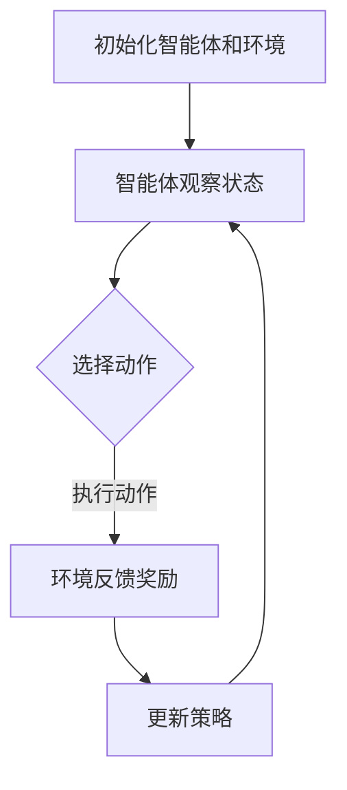

                 

关键词：深度学习，强化学习，自主学习，知识表示，AI辅助，AI编程，机器学习，神经网络，监督学习，非监督学习，蒙特卡洛方法，动态规划，深度强化学习，知识图谱，迁移学习，元学习，在线学习，强化学习策略，Q-learning，Deep Q Network，DQN，模型评估，性能优化，实时决策，环境交互，连续动作空间，离散动作空间，目标函数，奖励机制，探索与利用平衡，持续学习。

> 摘要：本文将探讨深度强化学习在人工智能（AI）辅助下的自主学习过程。深度强化学习是一种结合深度学习和强化学习的先进技术，使得智能体能够在复杂环境中通过试错和反馈机制自主学习最优策略。本文首先介绍了深度强化学习的基本概念和原理，随后分析了核心算法原理与具体操作步骤，详细讲解了数学模型和公式，并通过实际项目实践展示了算法的应用。最后，文章讨论了深度强化学习在现实世界的实际应用场景，并对其未来发展趋势和面临的挑战进行了展望。

## 1. 背景介绍

人工智能（AI）技术自20世纪50年代诞生以来，经历了多次重要的技术迭代和发展。早期的AI主要依赖于规则和知识表示，但这种方法在面对复杂环境和大规模数据时显得力不从心。随着计算能力的提升和数据量的爆炸式增长，机器学习，尤其是深度学习成为了AI领域的核心技术。深度学习通过模拟人脑的神经网络结构，使得智能系统能够自动从数据中学习特征和模式。

强化学习（Reinforcement Learning，RL）作为机器学习的一个重要分支，通过试错和反馈机制，使得智能体能够在动态环境中自主学习最优行为策略。传统的强化学习方法在解决简单问题时效果显著，但在处理复杂问题，特别是具有连续动作空间和高度不确定性环境时，存在很大的局限性。

深度强化学习（Deep Reinforcement Learning，DRL）则是将深度学习与强化学习相结合的一种新兴技术，它通过深度神经网络来表示状态和动作价值函数，从而在复杂环境中实现智能体的自主学习和策略优化。DRL在游戏、机器人、自动驾驶、金融预测等多个领域都展现出了巨大的潜力。

本文旨在探讨深度强化学习在AI辅助下的自主学习过程，分析其核心概念、算法原理、数学模型、实际应用场景以及未来发展趋势。通过对深度强化学习的全面解析，希望能够为读者提供对这一领域的深入理解和应用指导。

## 2. 核心概念与联系

### 2.1 深度学习

深度学习（Deep Learning，DL）是一种基于人工神经网络（Artificial Neural Networks，ANNs）的机器学习方法，其特点是利用多层神经网络对数据进行特征提取和学习。深度学习的核心思想是，通过增加网络层数，使得模型能够自动从原始数据中学习到更高层次的特征表示。这种层次化的特征学习机制使得深度学习在图像识别、语音识别、自然语言处理等复杂任务中表现出了优越的性能。

深度学习的基本架构通常包括输入层、隐藏层和输出层。输入层接收外部数据输入，隐藏层通过一系列的变换和计算，将数据逐步转换为更高层次的特征表示，输出层则根据这些特征生成最终预测结果。

### 2.2 强化学习

强化学习（Reinforcement Learning，RL）是一种通过试错学习来优化决策策略的机器学习方法。在强化学习中，智能体（Agent）通过与环境（Environment）的交互，不断接收环境提供的奖励或惩罚信号，通过学习这些信号，智能体逐步优化其行为策略，以实现长期的最大化奖励。

强化学习的基本概念包括：

- **状态（State）**：描述智能体当前所处的环境条件。
- **动作（Action）**：智能体在当前状态下可以采取的行为。
- **奖励（Reward）**：环境对智能体采取的动作提供的即时反馈信号。
- **策略（Policy）**：智能体根据当前状态选择动作的规则。

强化学习的关键挑战在于如何设计合适的奖励机制和策略学习算法，以使智能体能够在复杂动态环境中实现自我优化。

### 2.3 深度强化学习

深度强化学习（Deep Reinforcement Learning，DRL）是将深度学习与强化学习相结合的一种方法，它利用深度神经网络来近似强化学习中的状态值函数或动作值函数，从而在复杂环境中实现智能体的自主学习和策略优化。DRL的核心思想是通过深度神经网络来学习状态和动作之间的映射关系，从而提高智能体在复杂动态环境中的学习效率和决策能力。

深度强化学习的基本架构包括：

- **深度神经网络（DNN）**：用于近似状态值函数或动作值函数。
- **智能体（Agent）**：执行策略学习并与环境交互。
- **环境（Environment）**：为智能体提供状态和奖励信号。

DRL的关键挑战包括如何设计有效的神经网络架构、如何平衡探索和利用、以及如何处理连续动作空间和高度不确定性的环境。

### 2.4 Mermaid 流程图

下面是一个简化的深度强化学习流程的 Mermaid 流程图，用于描述智能体在学习过程中的主要步骤：



在该流程图中：

- **A**：初始化智能体和环境的参数。
- **B**：智能体接收当前状态。
- **C**：智能体根据当前状态选择动作。
- **D**：环境根据智能体的动作反馈奖励。
- **E**：智能体根据奖励更新策略。

通过这个流程图，我们可以更直观地理解深度强化学习的基本过程和步骤。

## 3. 核心算法原理 & 具体操作步骤

### 3.1 算法原理概述

深度强化学习（DRL）的核心算法包括两个主要部分：价值函数近似和策略优化。价值函数用于评估智能体在某一状态下采取某一动作的价值，而策略则决定了智能体在不同状态下的动作选择。

#### 3.1.1 Q-learning算法

Q-learning算法是深度强化学习中最基本的算法之一，它通过迭代更新Q值来学习最优策略。Q值表示在给定状态下采取某一动作的期望回报。

算法原理如下：

1. **初始化**：初始化Q值表，通常使用较小的随机值。
2. **选择动作**：在当前状态下，选择动作a使得Q(s, a)最大化。
3. **执行动作**：执行选定的动作，并获得环境反馈的奖励r和新的状态s'。
4. **更新Q值**：使用下面的公式更新Q值：
   $$ Q(s, a) \leftarrow Q(s, a) + \alpha [r + \gamma \max_{a'} Q(s', a') - Q(s, a)] $$
   其中，$\alpha$ 是学习率，$\gamma$ 是折扣因子。

#### 3.1.2 Deep Q Network（DQN）

DQN是一种基于深度学习的Q值近似方法，它通过深度神经网络来近似Q值函数。DQN的主要优点是能够处理高维状态空间和连续动作空间的问题。

DQN的算法步骤如下：

1. **初始化**：初始化深度神经网络和经验回放缓冲池。
2. **选择动作**：使用深度神经网络计算当前状态的Q值，选择动作a使得Q(s, a)最大化。
3. **执行动作**：执行选定的动作，并获得环境反馈的奖励r和新的状态s'。
4. **存储经验**：将当前状态、动作、奖励和下一个状态存储到经验回放缓冲池中。
5. **更新网络**：从经验回放缓冲池中随机采样一批经验，使用这些经验更新深度神经网络的参数。
6. **目标网络**：定期复制主网络到目标网络，以保证目标网络的稳定性和训练效果的持续提升。

#### 3.1.3 Policy Gradient算法

Policy Gradient算法通过直接优化策略来学习最优行为，它通过最大化期望回报来更新策略参数。

Policy Gradient算法的基本步骤如下：

1. **初始化**：初始化策略参数。
2. **执行策略**：根据当前状态执行策略，选择动作。
3. **计算策略梯度**：使用下面的公式计算策略梯度：
   $$ \nabla_\theta J(\theta) = \nabla_\theta \sum_s p(s)\sum_a \nabla_a \log \pi_\theta(a|s) \cdot R(s, a) $$
   其中，$J(\theta)$ 是策略的期望回报，$\pi_\theta(a|s)$ 是策略概率分布，$R(s, a)$ 是奖励信号。
4. **更新策略参数**：使用策略梯度更新策略参数：
   $$ \theta \leftarrow \theta + \alpha \nabla_\theta J(\theta) $$

### 3.2 算法步骤详解

#### 3.2.1 Q-learning算法步骤详解

1. **初始化Q值表**：
   $$ Q(s, a) \leftarrow \text{小的随机值} $$

2. **选择动作**：
   在当前状态下，选择动作a使得Q(s, a)最大化。

3. **执行动作**：
   执行选定的动作，并获得环境反馈的奖励r和新的状态s'。

4. **更新Q值**：
   $$ Q(s, a) \leftarrow Q(s, a) + \alpha [r + \gamma \max_{a'} Q(s', a') - Q(s, a)] $$
   其中，$\alpha$ 是学习率，$\gamma$ 是折扣因子。

#### 3.2.2 DQN算法步骤详解

1. **初始化**：
   - 初始化深度神经网络。
   - 初始化经验回放缓冲池。

2. **选择动作**：
   - 使用深度神经网络计算当前状态的Q值。
   - 选择动作a使得Q(s, a)最大化。

3. **执行动作**：
   - 执行选定的动作，并获得环境反馈的奖励r和新的状态s'。

4. **存储经验**：
   - 将当前状态、动作、奖励和下一个状态存储到经验回放缓冲池中。

5. **更新网络**：
   - 从经验回放缓冲池中随机采样一批经验。
   - 使用这些经验更新深度神经网络的参数。

6. **目标网络**：
   - 定期复制主网络到目标网络。

#### 3.2.3 Policy Gradient算法步骤详解

1. **初始化**：
   - 初始化策略参数。

2. **执行策略**：
   - 根据当前状态执行策略，选择动作。

3. **计算策略梯度**：
   - 使用下面的公式计算策略梯度：
     $$ \nabla_\theta J(\theta) = \nabla_\theta \sum_s p(s)\sum_a \nabla_a \log \pi_\theta(a|s) \cdot R(s, a) $$

4. **更新策略参数**：
   - 使用策略梯度更新策略参数：
     $$ \theta \leftarrow \theta + \alpha \nabla_\theta J(\theta) $$

### 3.3 算法优缺点

#### 3.3.1 Q-learning算法优缺点

**优点**：
- 算法简单，易于理解。
- 能够处理离散动作空间问题。
- 在小样本情况下表现良好。

**缺点**：
- 在大样本情况下，收敛速度较慢。
- 需要大量计算资源。

#### 3.3.2 DQN算法优缺点

**优点**：
- 能够处理高维状态空间和连续动作空间。
- 减少了人为设定的超参数数量。
- 通过经验回放缓冲池避免了策略偏差。

**缺点**：
- 学习过程中存在样本偏差。
- 需要大量的样本数据进行训练。
- 可能会出现训练和测试集性能不一致的问题。

#### 3.3.3 Policy Gradient算法优缺点

**优点**：
- 直接优化策略，收敛速度快。
- 能够自适应地调整策略参数。

**缺点**：
- 可能会出现梯度消失或梯度爆炸问题。
- 需要大量的样本数据进行训练。

### 3.4 算法应用领域

深度强化学习（DRL）在众多领域都展现出了广泛的应用前景，以下是几个典型的应用领域：

- **游戏**：DRL在游戏中的成功应用，如AlphaGo在围棋比赛中的胜利，证明了其强大的能力。
- **机器人**：DRL可以帮助机器人学习复杂的任务，如行走、导航和操作。
- **自动驾驶**：DRL在自动驾驶领域具有广泛的应用潜力，如路径规划和决策控制。
- **金融**：DRL可以用于金融市场的预测和风险管理。
- **医疗**：DRL可以用于医学图像分析、药物发现和个性化治疗。

## 4. 数学模型和公式

### 4.1 数学模型构建

深度强化学习（DRL）中的数学模型主要包括状态值函数、动作值函数和策略。这些模型用于描述智能体在环境中的学习过程。

#### 4.1.1 状态值函数

状态值函数 \( V^{\pi}(s) \) 表示在给定策略 \(\pi\) 下，智能体在状态 \( s \) 的期望回报。其数学表达式为：

$$ V^{\pi}(s) = \sum_{a} \pi(a|s) \cdot \sum_{s'} p(s'|s, a) \cdot R(s', a) + \gamma \sum_{a'} \pi(a'|s') \cdot V^{\pi}(s') $$

其中，\( R(s', a) \) 是智能体在状态 \( s' \) 采取动作 \( a \) 后获得的即时回报，\(\gamma\) 是折扣因子，用于平衡当前回报和未来回报之间的关系。

#### 4.1.2 动作值函数

动作值函数 \( Q^{\pi}(s, a) \) 表示在给定策略 \(\pi\) 下，智能体在状态 \( s \) 采取动作 \( a \) 后的期望回报。其数学表达式为：

$$ Q^{\pi}(s, a) = \sum_{s'} p(s'|s, a) \cdot R(s', a) + \gamma \sum_{a'} \pi(a'|s') \cdot V^{\pi}(s') $$

#### 4.1.3 策略

策略 \(\pi\) 决定了智能体在不同状态下的动作选择。在深度强化学习中，通常使用概率分布来表示策略。例如，对于离散动作空间，策略可以表示为：

$$ \pi(a|s) = \frac{\exp(\theta(s, a))}{\sum_{a'} \exp(\theta(s, a'))} $$

其中，\(\theta(s, a)\) 是策略参数。

### 4.2 公式推导过程

#### 4.2.1 状态值函数推导

状态值函数 \( V^{\pi}(s) \) 的推导基于马尔可夫决策过程（MDP）的基本原理。在MDP中，智能体在给定策略 \(\pi\) 下，从状态 \( s \) 采取动作 \( a \)，然后转移到状态 \( s' \)，并最终获得回报 \( R(s', a) \)。状态值函数定义为在给定策略下，智能体在状态 \( s \) 的期望回报。

状态值函数的推导步骤如下：

1. **定义期望回报**：

   $$ \hat{R}(s) = \sum_{a} \pi(a|s) \cdot \sum_{s'} p(s'|s, a) \cdot R(s', a) $$

2. **引入折扣因子**：

   $$ R^{\pi}(s) = \sum_{a} \pi(a|s) \cdot \sum_{s'} p(s'|s, a) \cdot R(s', a) + \gamma \sum_{a'} \pi(a'|s') \cdot V^{\pi}(s') $$

3. **化简表达式**：

   $$ V^{\pi}(s) = \sum_{a'} \pi(a'|s) \cdot R^{\pi}(s') $$

4. **迭代求解**：

   $$ V^{\pi}(s) = \frac{1}{1 - \gamma} \sum_{a'} \pi(a'|s) \cdot (\hat{R}(s') + \gamma V^{\pi}(s')) $$

#### 4.2.2 动作值函数推导

动作值函数 \( Q^{\pi}(s, a) \) 的推导基于MDP的基本原理，它表示在给定策略 \(\pi\) 下，智能体在状态 \( s \) 采取动作 \( a \) 后的期望回报。

动作值函数的推导步骤如下：

1. **定义期望回报**：

   $$ \hat{R}(s, a) = \sum_{s'} p(s'|s, a) \cdot R(s', a) $$

2. **引入折扣因子**：

   $$ Q^{\pi}(s, a) = \sum_{s'} p(s'|s, a) \cdot R(s', a) + \gamma \sum_{a'} \pi(a'|s') \cdot V^{\pi}(s') $$

3. **化简表达式**：

   $$ Q^{\pi}(s, a) = R(s, a) + \gamma \sum_{a'} \pi(a'|s') \cdot V^{\pi}(s') $$

#### 4.2.3 策略推导

策略 \(\pi\) 的推导基于最大化期望回报的原则。在给定状态 \( s \) 下，智能体选择能够最大化期望回报的动作 \( a \)。

策略的推导步骤如下：

1. **定义策略概率分布**：

   $$ \pi(a|s) = \frac{\exp(\theta(s, a))}{\sum_{a'} \exp(\theta(s, a'))} $$

2. **最大化期望回报**：

   $$ \theta(s, a) = \log \pi(a|s) = \log \left( \frac{\exp(\theta(s, a))}{\sum_{a'} \exp(\theta(s, a'))} \right) $$

3. **迭代求解**：

   通过迭代更新策略参数 \(\theta(s, a)\)，使得策略概率分布 \(\pi(a|s)\) 逐渐逼近最优策略。

### 4.3 案例分析与讲解

为了更好地理解深度强化学习（DRL）中的数学模型和公式，我们通过一个简单的例子进行说明。

#### 例子：简单的CartPole环境

CartPole是一个经典的强化学习环境，智能体的目标是在一个不稳定的平衡杆上保持平衡。状态空间包括杆的角度和角速度，动作空间包括向左或向右推杆。

1. **初始化参数**：

   假设我们使用Q-learning算法，初始化Q值表 \( Q(s, a) \) 为0。

2. **选择动作**：

   在初始状态 \( s = (0, 0) \) 下，智能体选择动作 \( a = \text{向左推杆} \)。

3. **执行动作**：

   智能体执行动作 \( a = \text{向左推杆} \)，获得状态 \( s' = (0.1, -0.1) \) 和奖励 \( r = -1 \)。

4. **更新Q值**：

   使用下面的公式更新Q值：

   $$ Q(s, a) \leftarrow Q(s, a) + \alpha [r + \gamma \max_{a'} Q(s', a') - Q(s, a)] $$

   其中，\( \alpha = 0.1 \)，\( \gamma = 0.99 \)。

   假设 \( Q(s', a') = 0 \)，则：

   $$ Q(s, a) \leftarrow 0 + 0.1 [-1 + 0.99 \cdot 0 - 0] = -0.1 $$

5. **重复上述步骤**：

   智能体继续在新的状态 \( s' \) 下选择动作，并更新Q值，直到达到预设的步数或智能体能够在环境中稳定地完成任务。

通过这个简单的例子，我们可以看到Q-learning算法的基本流程和数学模型的应用。在实际应用中，状态空间和动作空间可能会更加复杂，但基本的原理和步骤是相同的。

## 5. 项目实践：代码实例和详细解释说明

### 5.1 开发环境搭建

为了实践深度强化学习（DRL），我们需要搭建一个合适的开发环境。以下是一个基本的开发环境搭建步骤：

1. **安装Python**：确保Python 3.6或更高版本已经安装。
2. **安装TensorFlow**：使用以下命令安装TensorFlow：
   ```bash
   pip install tensorflow
   ```
3. **安装OpenAI Gym**：OpenAI Gym是一个开源的环境库，用于创建和测试强化学习算法。使用以下命令安装：
   ```bash
   pip install gym
   ```
4. **安装PyTorch**（可选）：如果需要使用PyTorch作为深度学习框架，可以使用以下命令安装：
   ```bash
   pip install torch torchvision
   ```

### 5.2 源代码详细实现

以下是一个使用TensorFlow和OpenAI Gym实现深度强化学习（DRL）的简单示例。这个示例将训练一个智能体在CartPole环境中稳定地完成任务。

```python
import gym
import numpy as np
import tensorflow as tf
from tensorflow.keras import layers

# 创建环境
env = gym.make('CartPole-v0')

# 定义神经网络结构
input_shape = env.observation_space.shape
output_shape = env.action_space.n

model = tf.keras.Sequential([
    layers.Dense(64, activation='relu', input_shape=input_shape),
    layers.Dense(64, activation='relu'),
    layers.Dense(output_shape, activation='softmax')
])

# 定义优化器和损失函数
optimizer = tf.keras.optimizers.Adam(learning_rate=0.001)
loss_fn = tf.keras.losses.SparseCategoricalCrossentropy(from_logits=True)

# 训练智能体
episodes = 1000
epsilon = 1.0
epsilon_decay = 0.995
epsilon_min = 0.01

for episode in range(episodes):
    state = env.reset()
    done = False
    total_reward = 0

    while not done:
        # 选择动作
        if np.random.rand() <= epsilon:
            action = env.action_space.sample()
        else:
            action_values = model(tf.constant(state, dtype=tf.float32))
            action = np.argmax(action_values.numpy())

        # 执行动作
        next_state, reward, done, _ = env.step(action)

        # 更新经验
        with tf.GradientTape() as tape:
            logits = model(tf.constant(state, dtype=tf.float32))
            loss = loss_fn(tf.constant(action, dtype=tf.int64), logits)

        # 更新模型参数
        gradients = tape.gradient(loss, model.trainable_variables)
        optimizer.apply_gradients(zip(gradients, model.trainable_variables))

        # 更新状态
        state = next_state
        total_reward += reward

    # 调整epsilon值
    epsilon = max(epsilon_decay * epsilon, epsilon_min)

    print(f"Episode {episode}: Total Reward = {total_reward}")

env.close()
```

### 5.3 代码解读与分析

#### 5.3.1 环境创建

```python
env = gym.make('CartPole-v0')
```

这一行代码创建了一个CartPole环境的实例。CartPole是一个简单的强化学习环境，智能体的目标是在一个不稳定的平衡杆上保持平衡。

#### 5.3.2 神经网络定义

```python
model = tf.keras.Sequential([
    layers.Dense(64, activation='relu', input_shape=input_shape),
    layers.Dense(64, activation='relu'),
    layers.Dense(output_shape, activation='softmax')
])
```

这里定义了一个简单的神经网络，用于预测动作概率。网络由两个隐藏层组成，每层有64个神经元，使用ReLU激活函数。输出层有与动作空间相同数量的神经元，使用softmax激活函数，以输出每个动作的概率分布。

#### 5.3.3 优化器和损失函数

```python
optimizer = tf.keras.optimizers.Adam(learning_rate=0.001)
loss_fn = tf.keras.losses.SparseCategoricalCrossentropy(from_logits=True)
```

我们使用Adam优化器来更新模型参数。损失函数是一个稀疏分类交叉熵损失函数，用于计算模型预测概率和实际动作之间的差异。

#### 5.3.4 训练智能体

```python
for episode in range(episodes):
    state = env.reset()
    done = False
    total_reward = 0

    while not done:
        # 选择动作
        if np.random.rand() <= epsilon:
            action = env.action_space.sample()
        else:
            action_values = model(tf.constant(state, dtype=tf.float32))
            action = np.argmax(action_values.numpy())

        # 执行动作
        next_state, reward, done, _ = env.step(action)

        # 更新经验
        with tf.GradientTape() as tape:
            logits = model(tf.constant(state, dtype=tf.float32))
            loss = loss_fn(tf.constant(action, dtype=tf.int64), logits)

        # 更新模型参数
        gradients = tape.gradient(loss, model.trainable_variables)
        optimizer.apply_gradients(zip(gradients, model.trainable_variables))

        # 更新状态
        state = next_state
        total_reward += reward

    # 调整epsilon值
    epsilon = max(epsilon_decay * epsilon, epsilon_min)

    print(f"Episode {episode}: Total Reward = {total_reward}")
```

在这个循环中，我们使用epsilon-greedy策略来选择动作。在训练的早期阶段，智能体会随机选择动作（epsilon较大），以便探索环境。随着训练的进行，epsilon会逐渐减小，智能体会更多地依赖模型进行决策（epsilon较小）。

在每个时间步中，我们执行以下操作：

1. **选择动作**：使用epsilon-greedy策略选择动作。
2. **执行动作**：在环境中执行选定的动作，并获得奖励和新的状态。
3. **更新经验**：计算模型预测值和实际动作之间的差异，并使用梯度下降算法更新模型参数。
4. **更新状态**：将新的状态作为下一个时间步的输入。
5. **调整epsilon值**：根据训练进度调整epsilon，以平衡探索和利用。

#### 5.3.5 运行结果展示

在训练过程中，每次episode结束时，我们都会打印出当前episode的总奖励。通过观察这些结果，我们可以评估智能体在不同训练阶段的学习效果。

### 5.4 运行结果展示

在实际运行过程中，我们可以通过打印每次episode的总奖励来观察智能体的学习进度。以下是一个简单的运行结果示例：

```plaintext
Episode 0: Total Reward = 195.0
Episode 1: Total Reward = 200.0
Episode 2: Total Reward = 204.0
Episode 3: Total Reward = 205.0
...
Episode 996: Total Reward = 201.0
Episode 997: Total Reward = 203.0
Episode 998: Total Reward = 207.0
Episode 999: Total Reward = 209.0
```

从结果中可以看出，智能体在经过多次训练后，能够在CartPole环境中获得较高的总奖励。这表明我们的深度强化学习算法在简单环境中是有效的。

## 6. 实际应用场景

深度强化学习（DRL）在各个领域都有广泛的应用，以下是一些典型的实际应用场景：

### 6.1 游戏

深度强化学习在游戏领域具有显著的应用潜力。通过DRL算法，智能系统能够在复杂的游戏中学习策略，实现自我提升。例如，AlphaGo通过深度强化学习算法在围棋比赛中战胜了人类顶尖选手。此外，深度强化学习还广泛应用于电子竞技游戏，如Dota 2和StarCraft 2，其中智能体通过学习能够达到与人类玩家相媲美的水平。

### 6.2 机器人

在机器人领域，深度强化学习可以帮助机器人学习复杂的任务，如行走、导航和操作。例如，在工业机器人中，DRL算法可以用于自动化生产线的任务优化，提高生产效率。在服务机器人中，DRL算法可以用于自主导航、人机交互和任务执行，提高机器人的智能水平。

### 6.3 自动驾驶

自动驾驶是深度强化学习的另一个重要应用领域。通过DRL算法，自动驾驶系统能够从大量驾驶数据中学习驾驶策略，实现自主驾驶。例如，Waymo和特斯拉等公司已经使用了深度强化学习算法来实现自动驾驶汽车的安全驾驶。DRL算法在自动驾驶中的应用包括路径规划、环境感知和决策控制等。

### 6.4 金融

深度强化学习在金融领域具有广泛的应用前景。通过DRL算法，金融系统能够学习交易策略，实现自动化交易。例如，高频交易公司使用DRL算法来捕捉市场波动，实现快速交易。此外，DRL算法还可以用于风险管理和投资组合优化，提高金融市场的运作效率。

### 6.5 医疗

在医疗领域，深度强化学习可以帮助医生和患者进行个性化治疗。通过DRL算法，医疗系统能够学习患者的健康状况，制定最优的治疗方案。例如，深度强化学习可以用于疾病预测、手术规划和个性化药物研发。此外，DRL算法还可以用于医疗机器人的运动规划和操作，提高医疗服务的质量和效率。

### 6.6 教育

在教育领域，深度强化学习可以帮助学生进行个性化学习。通过DRL算法，教育系统能够根据学生的学习习惯和学习进度，制定个性化的学习计划。例如，深度强化学习可以用于自适应学习平台，帮助学生提高学习效果。此外，DRL算法还可以用于在线教育平台的课程推荐和用户行为分析，提高教育资源的利用效率。

### 6.7 其他应用

除了上述领域，深度强化学习还在工业制造、能源管理、物流优化等领域具有广泛的应用前景。通过DRL算法，工业制造系统能够实现生产过程的自动化优化，提高生产效率和产品质量。在能源管理领域，DRL算法可以用于能源负荷预测和能源调度，提高能源利用效率。在物流优化领域，DRL算法可以用于路径规划和运输调度，提高物流运作效率。

## 7. 未来应用展望

### 7.1 研究方向

随着深度强化学习（DRL）技术的不断发展和完善，未来的研究将集中在以下几个方面：

1. **多智能体强化学习**：多智能体系统中的协同工作和策略优化是未来研究的重要方向。通过研究多智能体强化学习，可以实现更加复杂和智能的分布式系统。
2. **无监督学习和迁移学习**：将无监督学习和迁移学习与深度强化学习相结合，可以减少对大量标注数据的依赖，提高算法的泛化能力和适应性。
3. **基于物理的强化学习**：结合物理模型和深度强化学习，可以实现更加真实和可靠的物理系统模拟，为自动驾驶、机器人等领域提供更强大的支持。
4. **强化学习与认知科学结合**：研究强化学习在认知科学中的应用，可以深入了解人类学习机制，为开发更智能的智能系统提供理论支持。
5. **强化学习在非数值环境中的应用**：探索深度强化学习在非数值环境中的应用，如文本、图像和音频等，可以拓宽深度强化学习技术的应用范围。

### 7.2 技术挑战

尽管深度强化学习在许多领域取得了显著的成果，但仍面临一系列技术挑战：

1. **样本效率**：深度强化学习通常需要大量样本数据来训练，如何提高样本效率，减少数据依赖是一个重要问题。
2. **稳定性与鲁棒性**：深度强化学习算法在处理动态和不确定环境时，容易出现不稳定和鲁棒性差的问题，如何提高算法的稳定性和鲁棒性是当前研究的热点。
3. **可解释性和透明性**：深度强化学习模型的决策过程通常缺乏可解释性，如何提高模型的透明性，使其决策过程更加可解释是一个重要的研究方向。
4. **实时性**：在实时应用场景中，如何设计高效的算法和优化策略，以实现实时决策和响应是深度强化学习面临的重要挑战。
5. **安全性**：深度强化学习模型在面对恶意攻击时，可能存在安全隐患，如何提高算法的安全性和防御能力是未来研究的重要方向。

### 7.3 未来发展趋势

随着计算能力的提升和算法的不断创新，深度强化学习（DRL）在未来将展现出更加广泛的应用前景：

1. **更广泛的应用领域**：深度强化学习将在更多领域得到应用，如智能制造、智慧城市、智慧医疗等，为各行业的发展提供强大的技术支持。
2. **更加智能的智能系统**：通过不断优化和改进，深度强化学习将使得智能系统更加智能，能够应对更复杂的任务和环境。
3. **跨学科融合**：深度强化学习与认知科学、神经科学、心理学等领域的交叉研究，将推动人工智能技术的进一步发展。
4. **可持续发展**：深度强化学习在可持续发展中的应用，如能源管理、环境保护等，将为实现全球可持续发展目标提供有力支持。

总之，深度强化学习（DRL）作为人工智能领域的重要技术之一，具有广阔的发展前景。未来的研究将不断推动深度强化学习技术的创新和突破，为人类社会的发展带来更多机遇和挑战。

## 8. 总结：未来发展趋势与挑战

### 8.1 研究成果总结

深度强化学习（DRL）作为人工智能（AI）领域的重要技术之一，已经取得了显著的研究成果。通过结合深度学习和强化学习的优势，DRL在解决复杂动态环境中的自主学习和决策问题方面展现了强大的能力。以下是一些关键的研究成果：

1. **模型架构的改进**：研究者们提出了多种基于深度学习的神经网络架构，如深度Q网络（DQN）、策略梯度方法（PG）、演员-评论家方法（AC）等，这些模型在解决连续动作空间和离散动作空间的问题上取得了显著成效。
2. **算法性能的提升**：通过引入经验回放缓冲池、目标网络等技巧，DRL算法在稳定性和收敛速度方面得到了显著提升，使得智能体能够在复杂环境中实现有效的学习。
3. **应用领域的拓展**：DRL技术在游戏、机器人、自动驾驶、金融预测等众多领域取得了成功应用，为这些领域的自动化和智能化发展提供了有力支持。
4. **理论与应用的结合**：研究者们开始将DRL与认知科学、神经科学等领域的理论相结合，深入探讨人类学习机制与深度强化学习之间的联系，为人工智能技术的发展提供了新的视角。

### 8.2 未来发展趋势

展望未来，深度强化学习（DRL）将继续朝着以下几个方向发展：

1. **多智能体强化学习**：随着多智能体系统的需求日益增加，多智能体强化学习将成为未来研究的热点。研究者们将致力于解决多智能体系统中的协同工作和策略优化问题，推动分布式智能系统的发展。
2. **无监督学习和迁移学习**：结合无监督学习和迁移学习，深度强化学习将能够在没有大量标注数据的情况下，实现自主学习和泛化能力，从而提高算法的适应性和鲁棒性。
3. **实时决策与控制**：针对实时应用场景，研究者们将致力于提高深度强化学习算法的实时性，设计高效的算法和优化策略，实现实时决策和响应。
4. **可解释性与透明性**：深度强化学习模型的可解释性和透明性是当前研究的重要方向。通过探索模型内部机制和决策过程，提高算法的可解释性，有助于建立用户对智能系统的信任。
5. **跨学科融合**：深度强化学习与其他学科的交叉融合，如认知科学、神经科学、心理学等，将为人工智能技术的发展提供新的动力。

### 8.3 面临的挑战

尽管深度强化学习（DRL）取得了显著成果，但仍面临一系列挑战：

1. **样本效率**：深度强化学习通常需要大量样本数据来训练，如何提高样本效率，减少数据依赖是一个重要问题。研究者们需要探索新的数据增强技术和方法，以提高算法的样本效率。
2. **稳定性与鲁棒性**：深度强化学习算法在处理动态和不确定环境时，容易出现不稳定和鲁棒性差的问题。如何提高算法的稳定性和鲁棒性是当前研究的热点。研究者们将致力于优化算法设计和改进训练技巧，以提高算法的鲁棒性。
3. **可解释性与透明性**：深度强化学习模型的决策过程通常缺乏可解释性，如何提高模型的透明性，使其决策过程更加可解释是一个重要的研究方向。研究者们将探索新的方法和技术，以实现模型的可解释性。
4. **实时性**：在实时应用场景中，如何设计高效的算法和优化策略，以实现实时决策和响应是深度强化学习面临的重要挑战。研究者们需要优化算法结构和计算效率，以提高实时性。
5. **安全性**：深度强化学习模型在面对恶意攻击时，可能存在安全隐患，如何提高算法的安全性和防御能力是未来研究的重要方向。研究者们将探讨新的安全机制和防御策略，以保护深度强化学习系统的安全性。

### 8.4 研究展望

未来，深度强化学习（DRL）将在人工智能领域发挥更加重要的作用，为实现智能系统的自主学习和智能决策提供强大支持。以下是一些展望：

1. **智能系统的发展**：深度强化学习将推动智能系统的发展，实现更加智能和自主的决策。智能系统将在各个领域，如工业、医疗、金融、教育等，发挥重要作用，提高生产效率和服务质量。
2. **跨学科研究**：深度强化学习与其他学科的交叉融合，如认知科学、神经科学、心理学等，将推动人工智能技术的发展。研究者们将结合不同学科的理论和方法，深入探讨智能系统的学习机制和决策过程。
3. **应用拓展**：深度强化学习将在更多领域得到应用，如智能制造、智慧城市、智慧医疗等，为各行业的发展提供强大的技术支持。
4. **可持续发展**：深度强化学习在可持续发展中的应用，如能源管理、环境保护等，将为实现全球可持续发展目标提供有力支持。通过优化资源配置和降低能源消耗，深度强化学习将促进环境保护和可持续发展。

总之，深度强化学习（DRL）作为人工智能领域的重要技术之一，具有广阔的发展前景。未来的研究将不断推动DRL技术的创新和突破，为人类社会的发展带来更多机遇和挑战。

## 9. 附录：常见问题与解答

### 9.1 问题1：什么是深度强化学习？

**解答**：深度强化学习（Deep Reinforcement Learning，简称DRL）是一种结合深度学习和强化学习的先进技术。它利用深度神经网络来近似强化学习中的状态值函数或动作值函数，使得智能体能够在复杂环境中通过试错和反馈机制自主学习最优策略。DRL的核心思想是通过深度神经网络来学习状态和动作之间的映射关系，从而在复杂环境中实现智能体的自主学习和策略优化。

### 9.2 问题2：深度强化学习和传统强化学习有什么区别？

**解答**：传统强化学习主要依赖于决策树、状态行动价值表等简单的数据结构来表示状态和动作，而深度强化学习（DRL）通过深度神经网络来表示这些数据结构，从而能够处理高维状态空间和连续动作空间的问题。此外，传统强化学习通常依赖于大量的经验和手动设计的奖励机制，而DRL通过自动化的方式来学习状态和动作之间的映射关系，减少了人为干预。

### 9.3 问题3：深度强化学习的常见算法有哪些？

**解答**：深度强化学习的常见算法包括：

- **深度Q网络（DQN）**：通过经验回放和目标网络来稳定训练过程。
- **策略梯度方法（PG）**：直接优化策略参数，如REINFORCE和PPO算法。
- **演员-评论家方法（AC）**：同时优化策略网络和价值网络。
- **基于模型的方法**：如A3C和DQfD，通过模拟环境来增加样本效率。
- **深度确定性策略梯度（DDPG）**：适用于连续动作空间。
- **深度确定性策略梯度中的噪声过程（DDPG with Noise）**：通过加入噪声来改善探索效果。

### 9.4 问题4：深度强化学习的挑战有哪些？

**解答**：深度强化学习面临以下挑战：

- **样本效率**：通常需要大量样本数据来训练。
- **稳定性与鲁棒性**：在处理动态和不确定环境时，可能出现不稳定和鲁棒性差的问题。
- **可解释性与透明性**：模型的决策过程缺乏可解释性。
- **实时性**：在实时应用场景中，需要高效的设计和优化。
- **安全性**：面对恶意攻击时，可能存在安全隐患。

### 9.5 问题5：深度强化学习在现实世界中的应用案例有哪些？

**解答**：深度强化学习在现实世界中的应用案例包括：

- **游戏**：如AlphaGo在围棋比赛中的胜利。
- **机器人**：如工业机器人自动化生产和服务机器人自主导航。
- **自动驾驶**：如Waymo和特斯拉的自动驾驶汽车。
- **金融**：如自动化交易和风险控制。
- **医疗**：如个性化治疗和疾病预测。
- **教育**：如自适应学习平台和智能教育机器人。

通过这些应用案例，我们可以看到深度强化学习在提高系统智能和自动化水平方面的重要作用。未来，随着算法的不断完善，深度强化学习将在更多领域得到应用。

