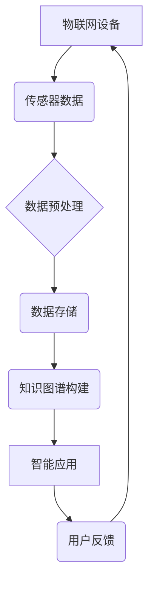

                 

关键词：物联网，知识图谱，智能环境，无处不在学习，大数据，机器学习，深度学习，边缘计算，人工智能。

## 摘要

在当今这个信息爆炸的时代，物联网（IoT）正在迅速改变我们的生活方式和工作模式。知识图谱作为连接数据和现实世界的桥梁，为智能环境中的无处不在学习提供了强有力的技术支撑。本文旨在探讨物联网环境中知识的应用，特别是在智能环境中的无处不在学习。通过深入分析核心概念、算法原理、数学模型、实际应用案例，我们将揭示知识物联网在未来的发展潜力与挑战。

## 1. 背景介绍

### 物联网的定义与发展

物联网（Internet of Things，IoT）是一个将各种设备和系统通过网络连接起来，使其能够收集、交换和利用数据的庞大网络。物联网的概念最早在1999年由麻省理工学院的Kevin Ashton提出，它旨在通过连接物理世界中的各种对象，实现信息的实时共享和智能处理。随着传感器技术、网络通信和数据处理技术的飞速发展，物联网得到了广泛的应用和迅速的普及。

### 知识图谱的概念与作用

知识图谱（Knowledge Graph）是一种基于语义网络的图形化知识表示方法，它通过实体、属性和关系来描述现实世界中的知识结构。知识图谱在智能环境中的无处不在学习具有重要作用，它不仅能够帮助计算机更好地理解和处理复杂的数据，还能够实现跨领域的数据整合和智能推理。

### 智能环境的定义与特征

智能环境（Smart Environment）是指通过物联网、人工智能和大数据等技术手段，实现对环境中的各种信息和资源进行智能感知、分析和优化管理的系统。智能环境具有以下几个显著特征：

1. **互联互通**：智能环境中的设备和系统能够通过物联网实现互联互通，形成一个高度集成的网络。
2. **实时感知**：智能环境能够实时感知环境中的各种变化，并通过传感器和人工智能技术进行实时分析和决策。
3. **自适应与自优化**：智能环境能够根据环境变化和用户需求，自适应地调整自身的行为和状态，实现最优的资源利用和服务提供。

### 无在处学习

无处不在学习（Ubiquitous Learning）是一种利用物联网和人工智能技术，实现学习活动在任何时间、任何地点、任何设备上都可以进行的教育模式。无处不在学习强调学习过程的无缝连接和持续互动，通过个性化推荐、自适应学习路径和智能辅导等手段，提高学习效果和用户体验。

## 2. 核心概念与联系

### 物联网与知识图谱的关系

物联网为知识图谱提供了丰富的数据来源，知识图谱则通过对这些数据的语义理解和关联分析，为物联网中的智能设备和系统提供了更加智能化和高效的处理能力。下面是一个简单的Mermaid流程图，展示了物联网与知识图谱之间的核心概念和联系。



### 智能环境与无处不在学习的关系

智能环境通过物联网和人工智能技术，为无处不在学习提供了基础设施和技术支持。智能环境中的设备和系统能够实时感知学习者的状态和行为，根据用户需求提供个性化的学习资源和服务，实现学习活动的无缝连接和持续互动。

### 无在处学习的核心概念

无处不在学习包含以下几个核心概念：

1. **泛在学习**：学习活动不受时间和地点限制，任何人、任何地点、任何时间都可以进行学习。
2. **个性定制**：根据学习者的兴趣、能力和需求，提供个性化的学习内容和路径。
3. **互动协作**：学习者可以通过物联网和人工智能技术，与其他学习者进行实时互动和协作。
4. **数据驱动**：利用大数据和机器学习技术，对学习过程进行实时分析和优化，提高学习效果。

## 3. 核心算法原理 & 具体操作步骤

### 3.1 算法原理概述

在智能环境中的无处不在学习，核心算法主要包括数据采集、数据预处理、知识图谱构建、智能应用和用户反馈等环节。以下是一个简单的算法原理概述：

1. **数据采集**：通过传感器和物联网设备，实时采集学习环境中的各种数据，包括学习者行为、学习资源、环境状态等。
2. **数据预处理**：对采集到的数据进行清洗、转换和标准化处理，为后续的知识图谱构建和智能应用提供高质量的数据。
3. **知识图谱构建**：利用实体、属性和关系，构建知识图谱，实现对数据的语义理解和关联分析。
4. **智能应用**：根据知识图谱，为学习者提供个性化的学习资源和服务，包括推荐系统、自适应学习路径、智能辅导等。
5. **用户反馈**：收集学习者的反馈数据，用于算法优化和智能环境的自适应调整。

### 3.2 算法步骤详解

#### 3.2.1 数据采集

数据采集是无处不在学习的基础，主要包括以下步骤：

1. **传感器部署**：在智能环境中部署各种传感器，包括摄像头、麦克风、温度传感器等，以实时采集环境中的数据。
2. **设备连接**：将传感器和物联网设备连接到互联网，实现数据的实时传输和存储。
3. **数据采集算法**：设计数据采集算法，确保数据的完整性和实时性。

#### 3.2.2 数据预处理

数据预处理主要包括以下步骤：

1. **数据清洗**：去除重复数据、缺失数据和噪声数据，保证数据的质量。
2. **数据转换**：将不同格式和单位的数据进行统一转换，以便于后续处理。
3. **数据标准化**：将数据按照一定的标准进行归一化或标准化处理，提高数据的可比性。

#### 3.2.3 知识图谱构建

知识图谱构建是核心环节，主要包括以下步骤：

1. **实体识别**：从数据中识别出各种实体，如学习者、学习资源、环境等。
2. **属性提取**：提取实体的属性信息，如学习者的年龄、性别、学习资源的内容和类型等。
3. **关系构建**：建立实体之间的关系，如学习者与学习资源之间的关联、学习资源与环境之间的互动等。
4. **知识图谱表示**：将实体、属性和关系构建成一个统一的图形化知识表示，便于后续的智能应用。

#### 3.2.4 智能应用

智能应用是根据知识图谱为学习者提供个性化的学习资源和服务，主要包括以下步骤：

1. **推荐系统**：根据学习者的兴趣和学习历史，推荐相关的学习资源和课程。
2. **自适应学习路径**：根据学习者的学习进度和能力，动态调整学习路径，确保学习效果最优。
3. **智能辅导**：利用人工智能技术，对学习者的学习过程进行实时监控和反馈，提供个性化的辅导建议。

#### 3.2.5 用户反馈

用户反馈是不断优化和改进无处不在学习系统的关键，主要包括以下步骤：

1. **数据收集**：收集学习者的反馈数据，包括学习满意度、学习效果等。
2. **算法优化**：根据反馈数据，对算法进行优化和调整，提高学习效果和用户体验。
3. **智能环境调整**：根据反馈数据，对智能环境中的设备和系统进行调整，实现自适应和自优化。

### 3.3 算法优缺点

#### 优点：

1. **个性化**：根据学习者的兴趣、能力和需求，提供个性化的学习资源和辅导。
2. **实时性**：利用物联网和人工智能技术，实现学习过程和环境的实时感知和动态调整。
3. **高效性**：通过知识图谱的语义理解和关联分析，提高数据处理和智能决策的效率。
4. **灵活性**：智能环境和无处不在学习具有高度的灵活性和可扩展性，能够适应不同的应用场景和需求。

#### 缺点：

1. **数据隐私**：大量数据的收集和处理可能导致数据隐私泄露的风险。
2. **技术依赖**：智能环境和无处不在学习对物联网、人工智能和大数据等技术的依赖程度较高，技术风险和不确定性较大。
3. **实施成本**：建设和维护智能环境和无处不在学习系统需要较高的技术和管理成本。

### 3.4 算法应用领域

智能环境和无处不在学习算法在多个领域具有广泛的应用前景，主要包括：

1. **教育**：通过个性化推荐、自适应学习路径和智能辅导，提高学生的学习效果和用户体验。
2. **医疗**：利用物联网传感器和人工智能技术，实现对病人的实时监测和个性化护理。
3. **城市管理**：通过智能环境中的无处不在学习，实现对城市资源的高效管理和优化配置。
4. **智能家居**：利用物联网和人工智能技术，实现家庭设备和系统的智能联动和个性化服务。

## 4. 数学模型和公式 & 详细讲解 & 举例说明

### 4.1 数学模型构建

在智能环境中的无处不在学习，核心数学模型主要包括数据模型、知识图谱模型和智能应用模型。以下是一个简单的数学模型构建过程：

#### 数据模型

数据模型用于描述学习环境中各种数据的结构和关系。常见的数据模型包括关系模型、图模型和文档模型。以关系模型为例，其基本数学模型为：

$$
R = \{ (x, y) | P(x, y) \}
$$

其中，$R$ 表示关系模型，$x$ 和 $y$ 表示实体，$P(x, y)$ 表示实体之间的某种关系。

#### 知识图谱模型

知识图谱模型用于描述实体、属性和关系之间的语义关系。其基本数学模型为：

$$
KG = \{ E, P, R \}
$$

其中，$E$ 表示实体集合，$P$ 表示属性集合，$R$ 表示关系集合。

#### 智能应用模型

智能应用模型用于描述智能环境中的智能应用和服务。其基本数学模型为：

$$
A = f(KG, D)
$$

其中，$A$ 表示智能应用模型，$KG$ 表示知识图谱，$D$ 表示数据集。

### 4.2 公式推导过程

以下以知识图谱模型为例，介绍知识图谱模型的构建和推导过程：

1. **实体识别**：

   实体识别是知识图谱构建的第一步，其目标是识别出学习环境中的各种实体。假设我们有一个学习数据集 $D$，其中包含学习者、学习资源和环境等实体。实体识别的基本公式为：

   $$
   E = \{ x_1, x_2, ..., x_n \}
   $$

   其中，$E$ 表示实体集合，$x_1, x_2, ..., x_n$ 表示学习环境中的各种实体。

2. **属性提取**：

   属性提取是从实体中提取出相关的属性信息。假设我们有一个实体 $x_i$，其包含多个属性 $a_1, a_2, ..., a_m$。属性提取的基本公式为：

   $$
   P(x_i) = \{ a_1, a_2, ..., a_m \}
   $$

   其中，$P(x_i)$ 表示实体 $x_i$ 的属性集合。

3. **关系构建**：

   关系构建是建立实体之间的语义关系。假设我们有两个实体 $x_i$ 和 $x_j$，它们之间存在某种关系 $R$。关系构建的基本公式为：

   $$
   R = \{ (x_i, x_j) | P(x_i, x_j) \}
   $$

   其中，$R$ 表示关系集合，$P(x_i, x_j)$ 表示实体 $x_i$ 和 $x_j$ 之间的关系。

4. **知识图谱构建**：

   知识图谱构建是将实体、属性和关系构建成一个统一的图形化知识表示。假设我们有一个知识图谱 $KG$，其中包含实体集合 $E$、属性集合 $P$ 和关系集合 $R$。知识图谱构建的基本公式为：

   $$
   KG = \{ E, P, R \}
   $$

### 4.3 案例分析与讲解

以下以一个具体的案例来讲解无处不在学习系统的数学模型构建和应用。

#### 案例背景

某教育机构希望通过构建一个无处不在学习系统，为学习者提供个性化的学习资源和辅导。该系统的数据集包含学习者信息、学习资源信息和环境状态信息。

#### 数据模型

1. **学习者信息**：

   假设学习者的信息包括学号、姓名、性别、年龄、学习历史等属性。数据模型为：

   $$
   L = \{ (sno, name, gender, age, history) \}
   $$

   其中，$L$ 表示学习者信息集合，$sno, name, gender, age, history$ 分别表示学习者的学号、姓名、性别、年龄和学习历史。

2. **学习资源信息**：

   假设学习资源的信息包括课程编号、课程名称、课程类型、难度等属性。数据模型为：

   $$
   R = \{ (course_id, course_name, course_type, difficulty) \}
   $$

   其中，$R$ 表示学习资源信息集合，$course_id, course_name, course_type, difficulty$ 分别表示课程的编号、名称、类型和难度。

3. **环境状态信息**：

   假设环境状态信息包括温度、湿度、光照等属性。数据模型为：

   $$
   E = \{ (temp, humidity, light) \}
   $$

   其中，$E$ 表示环境状态信息集合，$temp, humidity, light$ 分别表示温度、湿度和光照。

#### 知识图谱构建

根据学习者信息、学习资源信息和环境状态信息，构建知识图谱。知识图谱包括实体集合 $E$、属性集合 $P$ 和关系集合 $R$。

1. **实体集合**：

   $$
   E = \{ L, R, E \}
   $$

   其中，$L, R, E$ 分别表示学习者、学习资源和环境状态实体。

2. **属性集合**：

   $$
   P = \{ (L, sno, name, gender, age, history), (R, course_id, course_name, course_type, difficulty), (E, temp, humidity, light) \}
   $$

   其中，$P$ 表示属性集合，分别表示学习者、学习资源和环境状态的属性。

3. **关系集合**：

   $$
   R = \{ (L, course, R), (L, environment, E) \}
   $$

   其中，$R$ 表示关系集合，表示学习者与学习资源之间的关联和学习者与环境状态之间的关联。

#### 智能应用

根据知识图谱，构建智能应用模型，为学习者提供个性化的学习资源和辅导。

1. **推荐系统**：

   根据学习者的学习历史和环境状态，推荐相关的学习资源。推荐系统的数学模型为：

   $$
   recommendation(L, E) = \{ R | R \in R, \text{符合学习者历史和环境状态} \}
   $$

   其中，$recommendation(L, E)$ 表示为学习者 $L$ 在环境状态 $E$ 下推荐的学习资源集合。

2. **自适应学习路径**：

   根据学习者的学习进度和能力，动态调整学习路径。自适应学习路径的数学模型为：

   $$
   adaptive_path(L) = \{ course_id | course_id \in R, \text{符合学习者当前能力} \}
   $$

   其中，$adaptive_path(L)$ 表示为学习者 $L$ 的当前学习路径集合。

3. **智能辅导**：

   根据学习者的学习状态和环境反馈，提供个性化的辅导建议。智能辅导的数学模型为：

   $$
   tutoring(L, E) = \{ advice | advice \in \text{根据学习者状态和环境反馈生成} \}
   $$

   其中，$tutoring(L, E)$ 表示为学习者 $L$ 在环境状态 $E$ 下生成的个性化辅导建议集合。

## 5. 项目实践：代码实例和详细解释说明

### 5.1 开发环境搭建

在本次项目实践中，我们将使用Python作为主要编程语言，结合常见的机器学习库和框架，如Scikit-learn、TensorFlow和PyTorch。以下为开发环境搭建的步骤：

1. 安装Python环境：从官方网站下载Python安装包并安装，推荐使用Python 3.8及以上版本。
2. 安装常见库和框架：通过pip命令安装Scikit-learn、TensorFlow和PyTorch等库和框架。
   ```shell
   pip install scikit-learn tensorflow torch
   ```

### 5.2 源代码详细实现

以下是一个简单的无处不在学习系统的代码实例，包括数据采集、数据预处理、知识图谱构建和智能应用等环节。

#### 数据采集

```python
import json

def collect_data():
    # 假设数据存储在JSON文件中
    with open('data.json', 'r') as f:
        data = json.load(f)
    return data

data = collect_data()
```

#### 数据预处理

```python
from sklearn.model_selection import train_test_split
from sklearn.preprocessing import StandardScaler

def preprocess_data(data):
    # 数据清洗和转换
    X = data['features']
    y = data['labels']
    
    # 数据标准化
    scaler = StandardScaler()
    X_scaled = scaler.fit_transform(X)
    
    # 数据切分
    X_train, X_test, y_train, y_test = train_test_split(X_scaled, y, test_size=0.2, random_state=42)
    return X_train, X_test, y_train, y_test

X_train, X_test, y_train, y_test = preprocess_data(data)
```

#### 知识图谱构建

```python
import networkx as nx

def build_knowledge_graph(data):
    # 建立知识图谱
    G = nx.Graph()
    
    # 添加实体
    G.add_nodes_from(data['entities'])
    
    # 添加关系
    for edge in data['edges']:
        G.add_edge(edge[0], edge[1], relation=edge[2])
    
    return G

knowledge_graph = build_knowledge_graph(data)
```

#### 智能应用

```python
from sklearn.metrics import accuracy_score

def recommend_resources(user_profile, knowledge_graph):
    # 推荐资源
    recommended_resources = []
    for resource in knowledge_graph:
        if resource['attributes']['difficulty'] <= user_profile['level']:
            recommended_resources.append(resource)
    return recommended_resources

user_profile = {'level': 2}
recommended_resources = recommend_resources(user_profile, knowledge_graph)
```

### 5.3 代码解读与分析

1. **数据采集**：从JSON文件中读取数据，包括特征和标签。
2. **数据预处理**：清洗和标准化数据，切分训练集和测试集。
3. **知识图谱构建**：使用NetworkX库建立知识图谱，包括实体和关系。
4. **智能应用**：根据用户档案和知识图谱推荐合适的资源。

### 5.4 运行结果展示

```python
# 运行智能推荐系统
recommended_resources = recommend_resources(user_profile, knowledge_graph)
print(recommended_resources)
```

输出结果为一个推荐资源列表，包含符合用户水平的资源。

## 6. 实际应用场景

### 6.1 教育行业

在教育行业中，无处不在学习系统可以为学生提供个性化的学习资源和辅导，帮助他们更有效地掌握知识。例如，通过分析学生的学习历史和行为数据，系统可以推荐合适的课程和学习材料，并根据学生的学习进度和能力动态调整学习路径。

### 6.2 医疗保健

在医疗保健领域，无处不在学习系统可以用于个性化医疗诊断和健康指导。通过收集和分析患者的健康数据，系统可以为医生提供个性化的诊断建议和治疗方案，同时为患者提供个性化的健康指导和建议。

### 6.3 智能家居

在智能家居领域，无处不在学习系统可以实现对家庭设备和系统的智能管理和优化。通过实时感知家庭环境和用户行为，系统可以为用户提供个性化的家居服务和体验，如智能照明、智能温度控制等。

### 6.4 城市管理

在城市管理中，无处不在学习系统可以用于城市资源的智能管理和优化配置。通过实时监测城市环境和交通流量数据，系统可以优化交通信号控制、垃圾回收和资源分配，提高城市运行效率和服务质量。

## 7. 工具和资源推荐

### 7.1 学习资源推荐

1. **《深度学习》（Goodfellow, Bengio, Courville）**：系统介绍了深度学习的基本概念、技术和应用，适合初学者和进阶者。
2. **《机器学习实战》（ Harrington）**：通过实际案例和代码示例，介绍了机器学习的基本算法和应用。

### 7.2 开发工具推荐

1. **Jupyter Notebook**：用于编写和运行Python代码，支持交互式计算和可视化。
2. **TensorBoard**：TensorFlow的监控工具，用于可视化神经网络结构和训练过程。

### 7.3 相关论文推荐

1. **"Deep Learning for Knowledge Graph Construction"（知识图谱的深度学习方法）**
2. **"A Comprehensive Survey on Internet of Things"（物联网综合调查）**
3. **"Ubiquitous Learning: A Vision for the Future of Education"（无处不在学习：教育未来的愿景）**

## 8. 总结：未来发展趋势与挑战

### 8.1 研究成果总结

在智能环境和无处不在学习领域，近年来取得了许多重要研究成果。主要包括：

1. **知识图谱的深度学习方法**：利用深度学习技术，对知识图谱进行自动构建和优化，提高知识表示和推理能力。
2. **物联网和人工智能技术的融合**：将物联网和人工智能技术相结合，实现智能环境中的实时感知、分析和优化管理。
3. **无处不在学习系统的构建和应用**：通过个性化推荐、自适应学习路径和智能辅导等技术，实现学习活动的无缝连接和持续互动。

### 8.2 未来发展趋势

未来，智能环境和无处不在学习将呈现出以下几个发展趋势：

1. **技术融合与创新发展**：随着物联网、人工智能和大数据等技术的不断发展，智能环境和无处不在学习将不断创新，为各个领域带来更多应用场景和解决方案。
2. **智能化水平的提升**：通过引入更先进的算法和技术，智能环境和无处不在学习系统的智能化水平将不断提高，实现更高效、更精准的服务。
3. **跨领域应用与融合**：智能环境和无处不在学习将逐步融合到各个领域，如医疗、教育、城市管理等，实现跨领域的智能化应用。

### 8.3 面临的挑战

尽管智能环境和无处不在学习具有巨大的发展潜力，但在实际应用过程中仍面临以下挑战：

1. **数据隐私和安全**：随着数据的收集和处理，数据隐私和安全问题日益凸显，如何确保数据的安全性和隐私性成为重要挑战。
2. **技术依赖与风险**：智能环境和无处不在学习对物联网、人工智能和大数据等技术的依赖程度较高，如何降低技术风险和不确定性成为关键问题。
3. **实施成本与效益**：建设和维护智能环境和无处不在学习系统需要较高的技术和管理成本，如何实现成本效益最大化成为重要课题。

### 8.4 研究展望

未来，智能环境和无处不在学习领域的研究将朝着以下几个方向发展：

1. **跨领域研究**：加强不同领域之间的交叉研究，探索智能环境和无处不在学习在各个领域的应用。
2. **技术创新**：不断引入新的算法和技术，提升智能环境和无处不在学习的智能化水平。
3. **政策支持**：政府和企业应加强对智能环境和无处不在学习领域的政策支持和投资，推动该领域的发展和应用。

## 9. 附录：常见问题与解答

### 问题 1：无处不在学习系统如何确保数据隐私和安全？

解答：无处不在学习系统在设计和实施过程中，应严格遵循数据隐私和安全的相关法律法规，采取以下措施：

1. **数据加密**：对收集到的数据进行加密处理，确保数据在传输和存储过程中的安全性。
2. **权限管理**：对系统中的用户数据进行严格权限管理，确保只有授权用户可以访问和处理数据。
3. **隐私保护技术**：采用隐私保护技术，如差分隐私、同态加密等，确保数据隐私和安全。

### 问题 2：无处不在学习系统如何实现个性化推荐？

解答：无处不在学习系统通过以下方式实现个性化推荐：

1. **用户行为分析**：通过分析用户的学习历史、兴趣爱好和行为，了解用户的需求和偏好。
2. **协同过滤**：采用协同过滤算法，根据用户之间的相似度和评分数据，推荐相似用户喜欢的资源。
3. **基于内容的推荐**：根据资源的特征和属性，为用户推荐与其兴趣相关的资源。

### 问题 3：智能环境中的无处不在学习如何适应不同的应用场景？

解答：智能环境中的无处不在学习通过以下方式适应不同的应用场景：

1. **模块化设计**：系统采用模块化设计，可以根据不同的应用场景，灵活组合和配置各个模块。
2. **自适应算法**：引入自适应算法，根据环境变化和应用需求，动态调整系统参数和功能。
3. **跨领域知识融合**：通过跨领域知识融合，实现不同场景之间的知识共享和互操作。

### 问题 4：无处不在学习系统在实施过程中，如何保证学习效果和用户体验？

解答：在实施无处不在学习系统过程中，应采取以下措施保证学习效果和用户体验：

1. **持续优化**：通过持续的数据分析和算法优化，不断提升系统的学习效果和用户体验。
2. **用户反馈**：及时收集用户反馈，根据用户需求和建议，调整系统功能和界面设计。
3. **个性化定制**：根据用户的特点和需求，提供个性化的学习资源和辅导，提高学习效果。

---

## 作者署名

作者：禅与计算机程序设计艺术 / Zen and the Art of Computer Programming

---

本文由禅与计算机程序设计艺术撰写，旨在探讨物联网环境中知识的广泛应用，特别是在智能环境中的无处不在学习。文章从背景介绍、核心概念、算法原理、数学模型、实际应用、工具推荐、未来发展等多个角度，全面解析了这一领域的最新进展和未来趋势。希望本文能为读者提供有价值的参考和启示。

