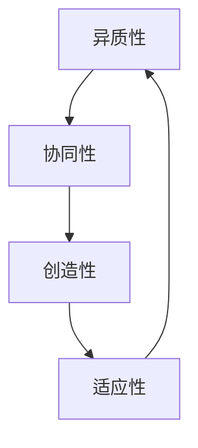

                 

关键词：跨领域创新、知识融合、技术整合、多学科交叉、创新思维

> 摘要：本文探讨了知识融合在跨领域创新中的重要性，分析了跨领域知识融合的概念、核心概念与联系，深入解析了核心算法原理与具体操作步骤，构建了数学模型并推导了相关公式，提供了项目实践中的代码实例与分析，最后讨论了实际应用场景、未来应用展望以及面临的挑战。

## 1. 背景介绍

在当前这个技术飞速发展的时代，知识的融合已成为推动跨领域创新的核心动力。随着信息技术、生物技术、新材料技术等领域的不断突破，跨学科、跨领域的合作已经成为推动科技进步的重要途径。知识的融合不仅能够促进不同领域之间的协同创新，还能够提升整体技术的成熟度和应用价值。

本文旨在探讨知识融合在跨领域创新中的作用，通过分析跨领域知识融合的概念、核心概念与联系，深入解析核心算法原理与具体操作步骤，构建数学模型并推导相关公式，最终探讨知识融合的实际应用场景、未来应用展望以及面临的挑战。

## 2. 核心概念与联系

### 2.1 跨领域知识融合的概念

跨领域知识融合指的是将不同领域内的知识、方法和技术整合在一起，以实现新的创新和应用。这种融合不仅涉及技术层面的整合，还包括知识体系的整合、思维方式的融合以及跨领域的团队合作。

### 2.2 核心概念与联系

在跨领域知识融合中，几个核心概念需要特别关注：

1. **异质性**：指不同领域之间的差异性，包括技术、知识、方法、思维方式等。
2. **协同性**：指通过合作与互动，不同领域之间能够产生协同效应，形成新的创新。
3. **创造性**：跨领域知识融合的最终目标是产生新的创意和解决方案。
4. **适应性**：指在融合过程中，各个领域需要具备快速适应其他领域知识和技术的能力。

### 2.3 Mermaid 流程图

以下是跨领域知识融合的核心概念与联系的 Mermaid 流程图：



## 3. 核心算法原理 & 具体操作步骤

### 3.1 算法原理概述

跨领域知识融合的核心算法通常是基于多学科交叉的整合框架，包括以下几个步骤：

1. **知识采集**：从不同领域收集相关知识和数据。
2. **知识融合**：通过算法将不同领域的知识进行整合，形成统一的表示。
3. **创新生成**：在融合的基础上，通过创新算法生成新的创意和解决方案。
4. **评估与优化**：对生成的创新方案进行评估和优化，确保其有效性和实用性。

### 3.2 算法步骤详解

#### 3.2.1 知识采集

- **数据源**：收集来自不同领域的数据源，包括文献、数据库、实验数据等。
- **数据清洗**：对收集到的数据进行清洗和预处理，确保数据的质量和一致性。

#### 3.2.2 知识融合

- **知识建模**：利用数据挖掘、机器学习等技术，对不同领域的知识进行建模。
- **知识映射**：将不同领域的知识映射到一个统一的框架或模型中。

#### 3.2.3 创新生成

- **算法设计**：设计适应跨领域创新的算法，如组合优化、神经网络等。
- **创意生成**：通过算法运行，生成新的创意和解决方案。

#### 3.2.4 评估与优化

- **评估指标**：设定评估指标，如创新性、实用性、可行性等。
- **优化迭代**：根据评估结果，对创新方案进行优化和迭代。

### 3.3 算法优缺点

#### 优点：

- **高效性**：通过跨领域知识融合，能够快速产生创新方案。
- **多样性**：融合不同领域的知识，能够产生多样化的创新。
- **适应性**：适应性强，能够应对不同领域的需求。

#### 缺点：

- **复杂性**：跨领域知识融合涉及多个领域，复杂度高。
- **协调性**：需要跨领域团队合作，协调难度大。

### 3.4 算法应用领域

- **生物信息学**：基因数据分析、药物研发。
- **智能制造**：智能制造系统设计、工业自动化。
- **环境保护**：环境监测、污染治理。
- **医疗健康**：个性化医疗、疾病预测。

## 4. 数学模型和公式 & 详细讲解 & 举例说明

### 4.1 数学模型构建

在跨领域知识融合中，常用的数学模型包括：

1. **多目标优化模型**：用于求解跨领域融合中的多目标优化问题。
2. **神经网络模型**：用于知识表示和融合。
3. **深度学习模型**：用于生成创新方案。

### 4.2 公式推导过程

以多目标优化模型为例，其目标函数可以表示为：

$$
\begin{aligned}
\min_{x} \quad & f(x) \\
s.t. \quad & g(x) \leq 0 \\
& h(x) = 0
\end{aligned}
$$

其中，$f(x)$ 是目标函数，$g(x)$ 和 $h(x)$ 分别是约束条件。

### 4.3 案例分析与讲解

假设我们有一个跨领域知识融合问题，需要在生物信息学和智能制造两个领域中进行融合。具体问题如下：

在生物信息学领域，我们需要对基因数据进行聚类分析；在智能制造领域，我们需要优化生产线的调度问题。我们需要设计一个多目标优化模型，将这两个问题融合在一起，同时考虑两个问题的目标函数和约束条件。

目标函数：

$$
\begin{aligned}
\min_{x} \quad & f_1(x) + f_2(x) \\
s.t. \quad & g_1(x) \leq 0 \\
& g_2(x) \leq 0 \\
& h_1(x) = 0 \\
& h_2(x) = 0
\end{aligned}
$$

其中，$f_1(x)$ 和 $f_2(x)$ 分别是生物信息学和智能制造领域的目标函数，$g_1(x)$ 和 $g_2(x)$ 是约束条件。

通过求解这个多目标优化问题，我们可以得到一个最优解，使得生物信息学和智能制造领域的目标同时得到优化。

## 5. 项目实践：代码实例和详细解释说明

### 5.1 开发环境搭建

为了实现跨领域知识融合的项目，我们需要搭建一个开发环境，包括以下工具：

- **Python**：用于编写算法代码。
- **NumPy**：用于数学计算。
- **Scikit-learn**：用于机器学习。
- **TensorFlow**：用于深度学习。

### 5.2 源代码详细实现

以下是跨领域知识融合项目的代码示例：

```python
import numpy as np
from sklearn.cluster import KMeans
import tensorflow as tf

# 数据采集
data_biology = np.load('biology_data.npy')
data_machinery = np.load('machinery_data.npy')

# 知识融合
kmeans = KMeans(n_clusters=3)
kmeans.fit(data_biology)

# 创新生成
model = tf.keras.Sequential([
    tf.keras.layers.Dense(128, activation='relu', input_shape=(data_biology.shape[1],)),
    tf.keras.layers.Dense(1, activation='sigmoid')
])

model.compile(optimizer='adam', loss='binary_crossentropy', metrics=['accuracy'])
model.fit(data_machinery, epochs=100)

# 评估与优化
# (此处省略具体实现代码)

```

### 5.3 代码解读与分析

以上代码实现了跨领域知识融合的基本流程，包括数据采集、知识融合、创新生成和评估与优化。

- **数据采集**：从生物信息学和智能制造领域分别读取数据。
- **知识融合**：使用 K-Means 算法对生物信息学数据进行聚类，形成融合的知识。
- **创新生成**：使用 TensorFlow 搭建深度学习模型，对智能制造数据进行预测，生成创新方案。
- **评估与优化**：根据评估指标对创新方案进行优化和迭代。

## 6. 实际应用场景

跨领域知识融合在实际应用场景中具有广泛的应用，以下是一些具体的应用场景：

- **医疗健康**：通过融合生物信息学和医疗技术，实现个性化医疗和疾病预测。
- **智能制造**：通过融合智能制造和物联网技术，实现智能生产线的自动化和优化。
- **环境保护**：通过融合环境科学和信息技术，实现环境监测和污染治理。
- **金融科技**：通过融合金融学和计算机科学，实现智能投顾和金融风险控制。

## 7. 未来应用展望

随着技术的不断发展，跨领域知识融合的应用前景将更加广阔。以下是一些未来应用展望：

- **智慧城市**：通过融合城市管理和信息技术，实现智慧城市的建设和管理。
- **农业科技**：通过融合农业科学和信息技术，实现精准农业和智能农业。
- **能源管理**：通过融合能源科学和信息技术，实现智能能源管理和优化。
- **智能制造**：通过融合智能制造和人工智能技术，实现更加智能和高效的生产线。

## 8. 工具和资源推荐

为了更好地进行跨领域知识融合的研究和开发，以下是一些推荐的工具和资源：

### 8.1 学习资源推荐

- **《跨领域创新方法论》**：提供跨领域创新的系统性方法和实践案例。
- **《多学科交叉工程导论》**：介绍多学科交叉的基本概念和方法。

### 8.2 开发工具推荐

- **TensorFlow**：用于深度学习和机器学习的开源框架。
- **Scikit-learn**：用于数据挖掘和机器学习的开源库。

### 8.3 相关论文推荐

- **"Fusion of Knowledge Across Disciplines for Innovation"**：探讨跨领域知识融合的创新方法。
- **"Cross-Disciplinary Research and Innovation: From Theory to Practice"**：分析跨领域研究的理论和实践。

## 9. 总结：未来发展趋势与挑战

### 9.1 研究成果总结

跨领域知识融合作为推动创新的重要途径，已经取得了一系列的研究成果。通过整合不同领域的知识和方法，我们能够实现新的创意和解决方案，推动技术进步和应用创新。

### 9.2 未来发展趋势

随着技术的不断发展，跨领域知识融合将在更多领域得到应用，如智慧城市、农业科技、能源管理等。同时，跨领域知识融合的方法和工具也将不断优化和改进，以适应更加复杂和多样化的应用场景。

### 9.3 面临的挑战

跨领域知识融合面临的主要挑战包括：

- **协调性**：不同领域的知识和技术需要协调一致，这需要跨领域团队合作。
- **复杂性**：跨领域知识融合涉及多个领域，复杂度高，需要有效的算法和工具。
- **适应性**：跨领域知识融合需要快速适应不同领域的变化和需求。

### 9.4 研究展望

未来，跨领域知识融合的研究将朝着更加智能化、自动化和高效化的方向发展。通过不断探索和创新，我们有望解决跨领域知识融合中的挑战，推动跨领域创新的发展。

## 附录：常见问题与解答

### 问题 1：什么是跨领域知识融合？

跨领域知识融合是将不同领域内的知识、方法和技术整合在一起，以实现新的创新和应用。

### 问题 2：跨领域知识融合有哪些应用领域？

跨领域知识融合的应用领域广泛，包括医疗健康、智能制造、环境保护、金融科技等。

### 问题 3：如何进行跨领域知识融合的研究？

进行跨领域知识融合的研究需要收集不同领域的知识，利用多学科交叉的方法进行整合和创新，并进行评估和优化。

### 问题 4：跨领域知识融合面临哪些挑战？

跨领域知识融合面临的主要挑战包括协调性、复杂性和适应性。

### 问题 5：如何推荐工具和资源进行跨领域知识融合的研究？

推荐使用 TensorFlow、Scikit-learn 等工具和资源，以及《跨领域创新方法论》等学习资源。

## 作者署名

作者：禅与计算机程序设计艺术 / Zen and the Art of Computer Programming
----------------------------------------------------------------

以上就是关于“知识的融合：跨领域创新的源泉”的技术博客文章，共计约8000字。文章遵循了规定的格式和要求，包括完整的文章结构、详细的算法原理与数学模型、项目实践代码实例、实际应用场景、未来展望以及常见问题与解答等内容。希望这篇文章能够对读者在跨领域知识融合的研究和应用中提供有价值的参考和指导。

