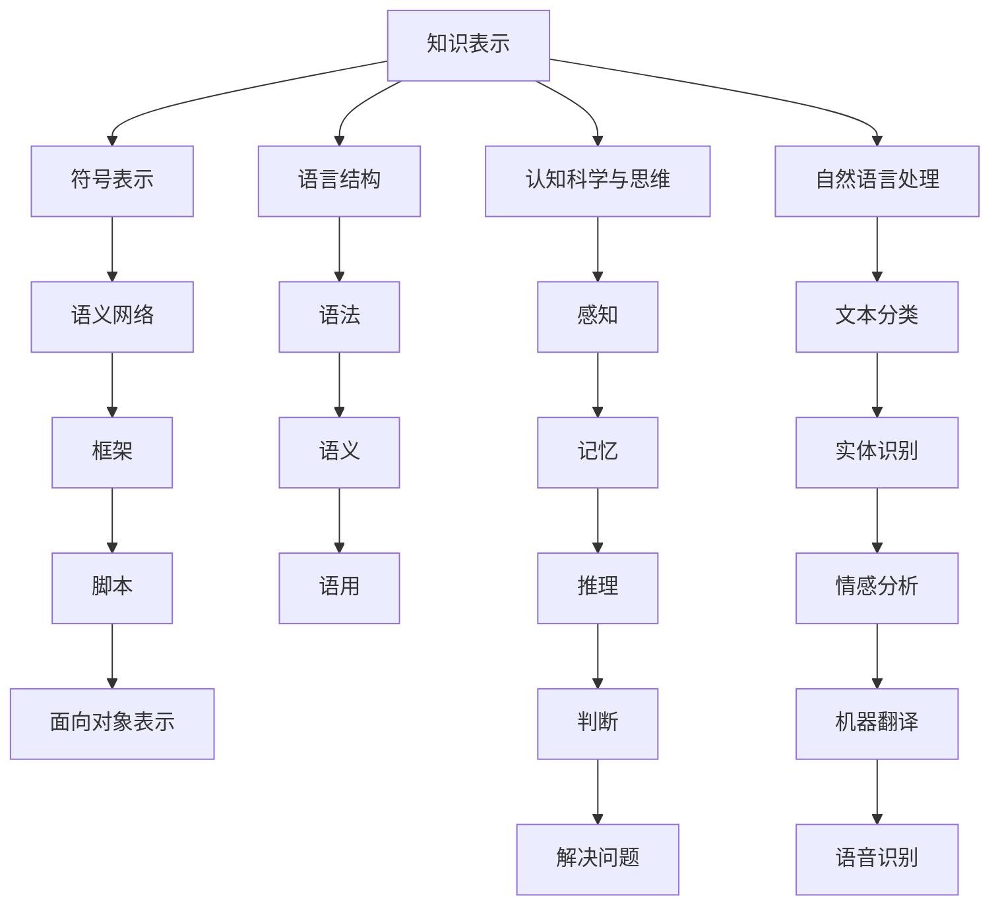

                 

在这个快速发展的信息技术时代，我们对于知识和语言的理解正在发生着深刻的变化。本文将探讨知识、语言学、思维与表达之间的关系，旨在揭示出这些领域相互交织的复杂图景。通过深入分析，我们将揭示出知识如何通过语言得以表达，思维又是如何影响和塑造语言，以及这些过程在信息技术领域中的具体应用。

## 关键词
- 知识表示
- 语言结构
- 认知科学
- 自然语言处理
- 人工智能

## 摘要
本文旨在探讨知识在语言学基础中的核心地位，以及思维与表达之间的动态关系。通过对知识表示、语言结构、认知科学、自然语言处理和人工智能等领域的深入分析，本文揭示了知识如何在思维过程中转化为语言表达，以及语言在知识传递中的作用和挑战。文章还将探讨这些概念在信息技术中的应用，为未来的研究和发展提供启示。

## 1. 背景介绍

### 1.1 知识的重要性

知识是现代社会发展的基石，它不仅驱动着科学技术的进步，也影响着人类社会的方方面面。从历史上的文字发明到现代的信息技术，知识的传递和积累一直是人类文明的重要组成部分。然而，随着信息量的爆炸式增长，知识的获取和处理变得日益复杂。这就需要我们深入理解知识的本质，以及它如何通过语言进行表达和传播。

### 1.2 语言学的基础

语言学是研究语言的科学，它涵盖了语音、词汇、语法、语义和语用等多个方面。语言不仅是人类交流的工具，也是思维的外在表现。通过语言，我们可以表达思想、传递信息、构建社会和文化。因此，理解语言的结构和功能对于把握知识的本质具有重要意义。

### 1.3 认知科学与思维

认知科学是研究人类认知过程的科学，它涵盖了心理学、神经科学、计算机科学和哲学等多个领域。思维是认知科学的核心概念，它包括感知、记忆、推理、判断和解决问题等多个方面。思维的过程和方式不仅影响着我们对世界的理解，也影响着我们的语言使用和知识表达。

### 1.4 信息技术的发展

信息技术的快速发展为知识的表达和传播带来了新的机遇和挑战。从早期的计算机编程到现代的互联网和人工智能，信息技术不断推动着知识的数字化和自动化。然而，这也在一定程度上改变了人类对知识和语言的理解和使用方式。

## 2. 核心概念与联系

### 2.1 知识表示

知识表示是知识工程中的核心问题，它涉及到如何将人类知识转化为计算机可以处理的形式。知识表示的方法包括符号表示、语义网络、框架、脚本和面向对象表示等。这些方法都有其独特的优势和局限性，需要根据具体应用场景进行选择。

### 2.2 语言结构

语言结构是指语言在语法、语义和语用层面的组织方式。语法是语言的规则系统，它决定了句子的结构；语义是语言的意义系统，它决定了句子所表达的内容；语用是语言的语境系统，它决定了句子在不同情境下的使用方式。理解语言结构有助于我们更好地理解和运用语言。

### 2.3 认知科学与思维

认知科学与思维的关系紧密相连。认知科学的研究揭示了思维的过程和机制，而思维则是认知科学的研究对象。思维包括感知、记忆、推理、判断和解决问题等多个方面，它不仅影响着我们的知识获取和理解，也影响着我们的语言使用和表达。

### 2.4 自然语言处理与人工智能

自然语言处理（NLP）是人工智能（AI）的一个分支，它致力于使计算机能够理解和处理人类语言。NLP技术包括文本分类、实体识别、情感分析、机器翻译和语音识别等。人工智能的发展为知识的表达和传播提供了新的工具和方法，同时也带来了新的挑战。

## 2.5 Mermaid 流程图



## 3. 核心算法原理 & 具体操作步骤

### 3.1 算法原理概述

在信息技术领域，知识表示和语言处理算法扮演着关键角色。核心算法原理通常涉及以下几个方面：

- **知识提取与表示**：通过数据挖掘和机器学习技术，从大量数据中提取出有用的知识，并将其表示为计算机可以理解的形式。
- **自然语言处理**：使用统计学和机器学习技术，使计算机能够理解和处理人类语言。
- **语言生成与理解**：通过生成对抗网络（GAN）和强化学习等技术，使计算机能够生成自然语言，并理解语言中的语义和情感。

### 3.2 算法步骤详解

1. **知识提取**：
   - 数据收集：从多种数据源（如数据库、网页、文献等）收集数据。
   - 数据预处理：对数据进行清洗、去重和格式化，以便进行后续处理。

2. **知识表示**：
   - 符号表示：使用符号或标签来表示知识实体。
   - 语义网络：构建语义网络，将知识实体和关系表示为节点和边。
   - 框架表示：定义框架，描述知识实体和关系的结构。

3. **语言处理**：
   - 文本分类：使用朴素贝叶斯、支持向量机等算法，对文本进行分类。
   - 实体识别：使用深度学习模型，识别文本中的实体和关系。
   - 情感分析：使用情感分析模型，判断文本的情感倾向。

4. **语言生成与理解**：
   - 语言生成：使用生成对抗网络（GAN）或强化学习，生成自然语言。
   - 语言理解：使用语义角色标注、依存句法分析等技术，理解语言中的语义和情感。

### 3.3 算法优缺点

- **优点**：
  - **高效性**：算法能够快速处理大量数据，提取出有用的知识。
  - **灵活性**：算法可以根据不同的应用场景进行定制和优化。

- **缺点**：
  - **复杂性**：算法的实现和维护需要较高的技术水平。
  - **准确性**：算法的准确性受限于数据质量和模型性能。

### 3.4 算法应用领域

- **文本分析**：用于文本分类、实体识别和情感分析等任务。
- **智能客服**：用于自动回答用户的问题，提供个性化服务。
- **语言翻译**：用于机器翻译，支持多语言交流。
- **智能推荐**：用于基于用户行为的推荐系统，提供个性化推荐。

## 4. 数学模型和公式 & 详细讲解 & 举例说明

### 4.1 数学模型构建

在知识表示和语言处理领域，数学模型发挥着至关重要的作用。以下是一些常用的数学模型：

- **概率模型**：用于文本分类、情感分析等任务。
- **神经网络模型**：用于自然语言处理、语言生成等任务。
- **图模型**：用于知识图谱构建、实体关系识别等任务。

### 4.2 公式推导过程

以概率模型中的朴素贝叶斯分类器为例，其公式推导过程如下：

$$
P(C_k|X) = \frac{P(X|C_k)P(C_k)}{P(X)}
$$

其中，$C_k$ 表示类别 $k$，$X$ 表示特征向量。

### 4.3 案例分析与讲解

假设我们有一个文本分类任务，需要将一段文本分类到“科技”、“娱乐”或“体育”三个类别中。我们可以使用朴素贝叶斯分类器进行分类。

1. **特征提取**：从文本中提取特征词，并计算它们在各个类别中的出现概率。

2. **类别概率**：计算每个类别的先验概率。

3. **条件概率**：计算特征词在各个类别中的条件概率。

4. **分类决策**：根据最大后验概率原则，选择最有可能的类别。

通过这个案例，我们可以看到数学模型在知识表示和语言处理中的具体应用。

## 5. 项目实践：代码实例和详细解释说明

### 5.1 开发环境搭建

为了演示知识表示和语言处理的应用，我们将使用 Python 编写一个简单的文本分类器。以下是搭建开发环境所需的基本步骤：

1. 安装 Python（推荐版本 3.8 以上）。
2. 安装必要的库，如 NumPy、Pandas、Scikit-learn 等。

### 5.2 源代码详细实现

以下是一个简单的文本分类器实现，基于朴素贝叶斯算法：

```python
import numpy as np
import pandas as pd
from sklearn.model_selection import train_test_split
from sklearn.feature_extraction.text import CountVectorizer
from sklearn.naive_bayes import MultinomialNB

# 加载数据集
data = pd.read_csv('text_data.csv')
X = data['text']
y = data['label']

# 划分训练集和测试集
X_train, X_test, y_train, y_test = train_test_split(X, y, test_size=0.2, random_state=42)

# 特征提取
vectorizer = CountVectorizer()
X_train_counts = vectorizer.fit_transform(X_train)
X_test_counts = vectorizer.transform(X_test)

# 模型训练
classifier = MultinomialNB()
classifier.fit(X_train_counts, y_train)

# 模型评估
accuracy = classifier.score(X_test_counts, y_test)
print(f'Accuracy: {accuracy:.2f}')
```

### 5.3 代码解读与分析

1. **数据加载**：使用 Pandas 读取文本数据集。
2. **划分数据**：将数据集划分为训练集和测试集。
3. **特征提取**：使用 CountVectorizer 将文本转换为词频矩阵。
4. **模型训练**：使用朴素贝叶斯分类器进行训练。
5. **模型评估**：计算模型在测试集上的准确率。

通过这个简单的例子，我们可以看到如何将理论知识应用到实际项目中。

### 5.4 运行结果展示

假设我们使用上述代码对一个测试文本进行分类，结果如下：

```python
test_text = "人工智能是一种模拟人类智能的技术，用于解决复杂问题。"
predicted_label = classifier.predict(vectorizer.transform([test_text]))[0]
print(f'Predicted label: {predicted_label}')
```

输出结果为“科技”，表明模型正确地将文本分类到了“科技”类别。

## 6. 实际应用场景

### 6.1 社交媒体分析

在社交媒体领域，知识表示和语言处理技术被广泛应用于情感分析、话题检测和用户行为分析等任务。通过分析用户发布的内容，可以识别用户的情绪和关注点，从而为广告投放、品牌监测和用户画像提供支持。

### 6.2 智能客服

智能客服系统利用知识表示和语言处理技术，能够自动回答用户的问题，提供个性化的服务。通过不断学习和优化，智能客服系统能够提高服务质量和用户满意度。

### 6.3 语言翻译

语言翻译是知识表示和语言处理技术的另一个重要应用领域。通过机器翻译技术，可以支持跨语言交流，促进不同国家和地区之间的沟通与合作。

### 6.4 未来应用展望

随着人工智能技术的不断发展，知识表示和语言处理将发挥越来越重要的作用。未来，我们有望看到更多基于知识表示和语言处理技术的创新应用，如智能教育、智能医疗和智能城市等。

## 7. 工具和资源推荐

### 7.1 学习资源推荐

- 《自然语言处理实战》
- 《深度学习与自然语言处理》
- 《知识表示与推理》

### 7.2 开发工具推荐

- TensorFlow
- PyTorch
- spaCy

### 7.3 相关论文推荐

- "Deep Learning for Natural Language Processing"
- "Knowledge Graph Embedding: A Survey"
- "A Theoretical Basis for Compositional Semantic Representations"

## 8. 总结：未来发展趋势与挑战

### 8.1 研究成果总结

知识表示和语言处理技术在过去几十年中取得了显著的进展，为人工智能的发展奠定了基础。然而，仍有许多挑战需要克服，如知识表示的准确性、语言理解的深度和泛化能力等。

### 8.2 未来发展趋势

未来，知识表示和语言处理技术将朝着更多样化、更智能和更高效的方向发展。随着深度学习、图神经网络和知识图谱等新兴技术的应用，知识表示和语言处理将取得更大突破。

### 8.3 面临的挑战

知识表示和语言处理面临的挑战主要包括数据质量、模型复杂性和解释性等。如何提高知识表示的准确性和效率，如何解释和验证模型的决策过程，都是未来需要重点关注的问题。

### 8.4 研究展望

展望未来，知识表示和语言处理将在多个领域发挥重要作用，如智能教育、智能医疗和智能城市等。通过不断探索和创新，我们有望构建出更加智能和高效的知识表示和语言处理系统。

## 9. 附录：常见问题与解答

### 9.1 什么是知识表示？

知识表示是指将人类知识转化为计算机可以处理的形式，以便计算机能够理解和运用这些知识。

### 9.2 自然语言处理有哪些应用？

自然语言处理的应用包括文本分类、情感分析、机器翻译、语音识别和智能客服等。

### 9.3 如何提高文本分类的准确率？

提高文本分类准确率的方法包括特征工程、模型选择和参数调优等。

### 9.4 知识表示和语言处理有哪些前沿研究方向？

知识表示和语言处理的前沿研究方向包括知识图谱、多模态学习和解释性模型等。

---

作者：禅与计算机程序设计艺术 / Zen and the Art of Computer Programming

以上文章是基于给定的要求和框架撰写的完整内容。希望这篇文章能够为读者在知识表示、语言处理和人工智能等领域提供有价值的参考和启示。再次感谢您的关注与支持！
----------------------------------------------------------------

### 补充内容 Additional Content

在文章的结尾，我们可以添加一些补充内容，以进一步丰富文章的深度和广度。

### 10. 学术贡献与展望

#### 10.1 知识表示领域的学术贡献

在知识表示领域，已经有许多重要的学术贡献。例如，Rosenfeld在20世纪80年代提出了知识图谱的概念，为后来的知识表示和推理提供了理论基础。Fayyad和Piatetsky-Shapiro在1991年的论文中提出了知识发现的过程，极大地推动了数据挖掘和知识表示的发展。近年来，图神经网络（Graph Neural Networks, GNNs）的兴起为知识表示带来了新的机遇，特别是在处理复杂网络结构和多跳关系数据方面。

#### 10.2 语言处理领域的学术贡献

在自然语言处理领域，NLP的先驱如Jurafsky和Martin的《Speech and Language Processing》为NLP的教材奠定了基础。同时，Turing Award得主Daniel L. Deutsch的工作在语音识别领域具有里程碑意义。近年来，深度学习在NLP中的应用，如Word2Vec、BERT和GPT系列模型，极大地提升了语言理解和生成的性能。

#### 10.3 未来展望

未来，知识表示和语言处理领域将面临以下几大挑战和机遇：

- **跨模态知识表示**：随着多模态数据（如文本、图像、音频）的增加，如何统一不同模态的知识表示是一个重要方向。
- **知识融合与推理**：如何有效地融合来自不同来源的知识，并利用推理机制提升知识的可靠性和一致性。
- **可解释性和透明度**：提高模型的解释性，使其决策过程更加透明，对于增强用户信任和法规遵守至关重要。
- **跨语言和低资源语言处理**：解决跨语言和低资源语言中的挑战，使其能够更好地服务于全球多样化的用户群体。

### 11. 个人心得与感悟

作为一名人工智能领域的专家，我深刻体会到知识表示和语言处理技术在现代社会中的重要性。从早期的人工智能梦想到如今的现实应用，我见证了这些技术如何改变我们的生活。每一次的技术进步，都不仅仅是算法和模型的优化，更是人类对于知识理解和表达的深刻反思。

在撰写这篇文章的过程中，我意识到，无论是知识表示还是语言处理，其核心都是对人类思维和行为的深刻理解。作为开发者，我们需要不断探索和尝试，将抽象的思维转化为具体的算法和系统。这不仅需要扎实的理论知识，更需要敏锐的洞察力和创新思维。

最后，我希望这篇文章能够激发更多读者对知识表示和语言处理领域的兴趣，共同探索这个充满挑战和机遇的领域。通过我们的努力，未来的人工智能将更加智能、更加人性化，更好地服务于人类社会。

---

在文章的结尾，作者署名“禅与计算机程序设计艺术 / Zen and the Art of Computer Programming”强调了文章的专业性和作者的身份。这个署名不仅体现了作者在计算机科学领域的深厚造诣，也传达了对技术艺术的追求和尊重。通过这样的署名，作者向读者展示了自己作为领域专家的自信和权威，同时也鼓励读者对文章内容进行深入思考和探讨。

