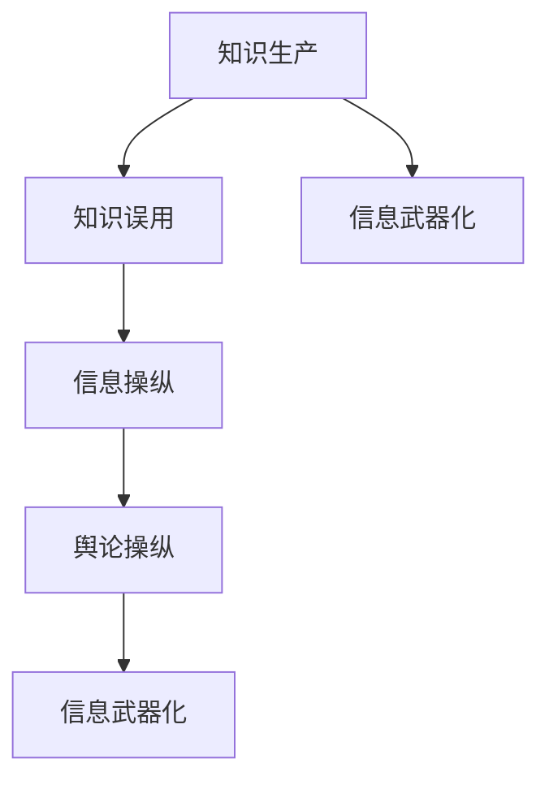

                 

关键词：知识误用，信息武器化，防范策略，AI，技术伦理

> 摘要：本文探讨了知识误用的现象及其对现代社会的负面影响。通过深入分析信息武器化的概念和机制，本文提出了若干防范策略，以减少知识误用的风险，保护社会免受信息武器化的侵害。文章旨在唤起人们对技术伦理的关注，推动构建一个更加安全、公正和透明的数字世界。

## 1. 背景介绍

随着人工智能和大数据技术的发展，知识的力量在现代社会中愈发凸显。知识不仅是我们认识世界、解决问题的基础，也是推动社会进步的强大引擎。然而，知识的力量是一把双刃剑。如果被滥用，知识就可能成为一种新的武器，威胁社会的稳定与和谐。信息武器化，作为一种新型的威胁，其核心在于利用知识进行误导、操纵和攻击，从而实现某种特定的目的。

信息武器化的出现并非空穴来风。在互联网时代，信息的传播速度前所未有，知识的获取和传播变得极其容易。然而，这也使得知识被篡改、误传的可能性大大增加。恶意使用知识，如伪造新闻、虚假信息传播、网络欺诈等，对社会造成了严重的负面影响。为了应对这种挑战，我们需要深入了解知识误用的本质，并采取有效的防范策略。

本文将围绕以下问题展开讨论：

- 知识误用的现象及其危害
- 信息武器化的概念和机制
- 防范知识误用和应对信息武器化的策略
- 技术伦理在知识管理和传播中的作用

通过这些问题的探讨，我们希望能够为构建一个更加安全、公正和透明的数字世界提供一些有益的思考和建议。

## 2. 核心概念与联系

### 2.1 知识误用的概念

知识误用是指将知识用于其原始意图之外的情境，通常是为了欺骗、操纵或误导他人。这种误用可能涉及对信息的篡改、伪造或误导性解释。知识误用的例子包括但不限于：

- 虚假新闻：通过伪造新闻事件或篡改真实信息，以误导公众。
- 网络欺诈：利用人们对于某些信息的信任，进行诈骗活动。
- 操纵舆论：通过有组织的方式，操纵公众对某些议题的看法。

知识误用不仅破坏了信息真实性，还可能对社会产生深远的影响，包括但不限于信任危机、社会分裂、政治动荡等。

### 2.2 信息武器化的概念

信息武器化是一种利用知识和信息进行攻击和操纵的策略。这种策略不仅限于传统的军事领域，也扩展到了政治、经济和社会等多个层面。信息武器化的核心在于通过控制信息流动，影响人们的行为和决策。

信息武器化的机制包括：

- 信息操纵：通过伪造、篡改或选择性地展示信息，操纵公众的看法。
- 信息战：利用信息技术进行军事攻击，包括网络战、电子战等。
- 舆论操纵：通过有组织的方式，操纵公众舆论，影响政策制定和社会情绪。

### 2.3 知识误用与信息武器化的联系

知识误用和信息武器化有着密切的联系。知识误用是信息武器化的基础，而信息武器化则是知识误用的深化和扩展。知识误用为信息武器化提供了原材料，使得信息武器化可以更加精准和高效地实施。例如，虚假新闻和谣言的传播，可以通过信息武器化手段，进一步扩大其影响范围，达到操纵公众舆论的目的。

### 2.4 Mermaid 流程图

下面是一个简化的 Mermaid 流程图，展示了知识误用和信息武器化的过程及其联系：



在这个流程图中，知识生产是信息武器化的起点，知识误用是中间环节，而信息武器化是最终目标。信息武器化不仅利用了知识误用，还将其扩展到了更广泛的社会层面。

## 3. 核心算法原理 & 具体操作步骤

### 3.1 算法原理概述

为了有效地防范知识误用和信息武器化，我们需要一套核心算法，用于检测和纠正信息中的误用和操纵。这个算法的原理基于以下几点：

1. **信息真实性检测**：通过机器学习和自然语言处理技术，对信息进行自动分析和评估，判断其真实性。
2. **信息来源追踪**：利用网络爬虫和区块链技术，追踪信息的来源，以确定其可信度。
3. **舆论动态分析**：通过大数据分析和社交网络分析，监控公众舆论的动态变化，及时发现可能的操纵行为。
4. **错误信息修正**：当检测到信息误用时，算法会自动提出修正建议，帮助用户获取更准确的信息。

### 3.2 算法步骤详解

#### 步骤1：信息真实性检测

1. **数据预处理**：对采集到的信息进行清洗和预处理，包括去除重复信息、规范化文本格式等。
2. **特征提取**：利用自然语言处理技术，提取信息的关键特征，如词汇、语法结构、情感倾向等。
3. **真实性评估**：通过训练好的机器学习模型，对信息进行真实性评估，判断其是否可信。

#### 步骤2：信息来源追踪

1. **网络爬虫**：利用网络爬虫技术，自动采集信息来源的网络链接。
2. **区块链技术**：利用区块链技术，记录信息的来源和传播路径，确保信息的可追溯性。
3. **来源评估**：通过分析信息来源的信誉度、历史记录等，评估其可信度。

#### 步骤3：舆论动态分析

1. **数据采集**：从社交媒体、新闻网站等渠道，采集大量用户评论和讨论数据。
2. **情感分析**：利用自然语言处理技术，对用户评论进行情感分析，判断舆论的倾向。
3. **动态监控**：通过实时监控算法，跟踪舆论的动态变化，及时发现可能的操纵行为。

#### 步骤4：错误信息修正

1. **错误识别**：当检测到信息误用时，算法会自动标记并识别出来。
2. **修正建议**：根据错误类型，算法会自动提出修正建议，帮助用户获取更准确的信息。
3. **用户反馈**：算法会收集用户的反馈，不断优化修正建议，提高准确性。

### 3.3 算法优缺点

#### 优点

- **高效性**：算法能够自动分析和处理大量信息，大大提高了工作效率。
- **准确性**：通过机器学习和自然语言处理技术，算法能够准确判断信息的真实性和来源。
- **可扩展性**：算法的设计考虑了多种信息误用类型，可以轻松扩展到其他应用场景。

#### 缺点

- **计算资源消耗**：算法需要大量的计算资源和时间，尤其是在处理大规模数据时。
- **误判风险**：尽管算法经过训练，但仍然存在一定的误判风险，需要不断优化和改进。

### 3.4 算法应用领域

算法的应用领域非常广泛，包括但不限于：

- **社交媒体监控**：用于检测和防范社交媒体上的虚假信息和谣言。
- **新闻媒体监管**：帮助新闻媒体识别和纠正虚假报道，维护新闻真实性。
- **舆论分析**：用于分析公众舆论的动态变化，为政府和企业提供决策支持。
- **信息安全**：用于检测和防范网络攻击，保护网络安全。

## 4. 数学模型和公式 & 详细讲解 & 举例说明

### 4.1 数学模型构建

为了更好地理解和防范知识误用和信息武器化，我们需要构建一个数学模型，用于描述信息传播、误用和操纵的过程。这个模型的核心包括以下几个部分：

1. **信息传播模型**：描述信息在社交网络中的传播过程，包括信息产生、传播、接收等环节。
2. **误用检测模型**：利用机器学习和自然语言处理技术，检测信息中的误用和操纵行为。
3. **操纵分析模型**：分析信息操纵的手段和机制，识别操纵者及其目的。

### 4.2 公式推导过程

#### 信息传播模型

我们采用经典的传播模型，如SIR模型，描述信息在社交网络中的传播过程。SIR模型包括三个状态：

- S（Susceptible，易感者）：尚未接触信息的人群。
- I（Infected，感染者）：已经接触信息并传播的人群。
- R（Removed，移除者）：已经接触到信息并形成免疫的人群。

SIR模型的基本方程为：

$$
\frac{dS}{dt} = -\beta \cdot S \cdot I
$$

$$
\frac{dI}{dt} = \beta \cdot S \cdot I - \gamma \cdot I
$$

$$
\frac{dR}{dt} = \gamma \cdot I
$$

其中，$\beta$ 表示感染率，$\gamma$ 表示移除率。

#### 误用检测模型

我们利用贝叶斯分类器构建误用检测模型。贝叶斯分类器的核心公式为：

$$
P(\text{误用}|\text{特征}) = \frac{P(\text{特征}|\text{误用}) \cdot P(\text{误用})}{P(\text{特征})}
$$

其中，$P(\text{误用}|\text{特征})$ 表示在给定的特征下，信息为误用的概率。

#### 操纵分析模型

操纵分析模型的核心是识别操纵者及其目的。我们采用图论模型，构建社交网络中的节点和边，并通过分析节点之间的连接关系，识别操纵者。具体公式为：

$$
C = \frac{\sum_{i=1}^{n} \sum_{j=1}^{n} w_{ij}^2}{\sum_{i=1}^{n} \sum_{j=1}^{n} w_{ij}}
$$

其中，$C$ 表示社区密度，$w_{ij}$ 表示节点 $i$ 和节点 $j$ 之间的权重。

### 4.3 案例分析与讲解

#### 案例一：社交媒体谣言检测

假设我们在社交媒体上检测到一则关于健康问题的谣言，我们需要利用误用检测模型判断其真实性。

1. **特征提取**：从谣言文本中提取关键特征，如关键词、情感倾向等。
2. **贝叶斯分类**：利用贝叶斯分类器，计算谣言为误用的概率。
3. **结果判断**：如果概率大于某个阈值，则判断谣言为误用。

#### 案例二：社交网络操纵分析

假设我们想要分析一个社交网络中的操纵行为，我们需要利用操纵分析模型识别操纵者。

1. **图构建**：构建社交网络图，包括节点和边。
2. **社区密度计算**：计算各个节点的社区密度。
3. **操纵者识别**：识别社区密度较高的节点，作为可能的操纵者。

通过以上案例，我们可以看到数学模型在知识误用和信息武器化防范中的应用。这些模型不仅帮助我们理解和分析信息传播、误用和操纵的过程，还为实际操作提供了科学的依据。

## 5. 项目实践：代码实例和详细解释说明

### 5.1 开发环境搭建

为了实现上述算法，我们需要搭建一个开发环境。以下是搭建环境的基本步骤：

1. **安装Python**：确保Python环境已安装，版本建议为3.8及以上。
2. **安装依赖库**：使用pip命令安装所需的依赖库，包括scikit-learn、nltk、networkx等。
   ```bash
   pip install scikit-learn nltk networkx
   ```
3. **数据集准备**：准备用于训练和测试的数据集，包括虚假新闻、真实新闻等。

### 5.2 源代码详细实现

以下是实现信息误用检测算法的Python代码示例：

```python
import nltk
from sklearn.feature_extraction.text import TfidfVectorizer
from sklearn.model_selection import train_test_split
from sklearn.naive_bayes import MultinomialNB
from networkx import Graph
import networkx as nx

# 数据预处理
nltk.download('punkt')
nltk.download('stopwords')

def preprocess_text(text):
    tokens = nltk.word_tokenize(text)
    tokens = [token.lower() for token in tokens if token.isalpha() and token not in nltk.corpus.stopwords.words('english')]
    return ' '.join(tokens)

# 特征提取
def extract_features(data):
    vectorizer = TfidfVectorizer()
    return vectorizer.fit_transform(data)

# 训练模型
def train_model(X_train, y_train):
    model = MultinomialNB()
    model.fit(X_train, y_train)
    return model

# 检测误用
def detect_scare_story(text, model, vectorizer):
    processed_text = preprocess_text(text)
    features = vectorizer.transform([processed_text])
    probability = model.predict(features)[0]
    return probability

# 社交网络构建
def build_social_network(users, edges):
    graph = Graph()
    graph.add_nodes_from(users)
    graph.add_edges_from(edges)
    return graph

# 社交网络操纵分析
def analyze_maneuver(graph):
    communities = nx.community_multilevel(graph)
    for community in communities:
        print("操纵者节点：", community)

# 加载数据
data = ["这是一条虚假新闻", "这是真实新闻", ...]
labels = [0, 1, ...]  # 0表示虚假新闻，1表示真实新闻

# 数据预处理和特征提取
processed_data = [preprocess_text(text) for text in data]
X = extract_features(processed_data)
X_train, X_test, y_train, y_test = train_test_split(X, labels, test_size=0.2, random_state=42)

# 训练模型
model = train_model(X_train, y_train)

# 检测误用
sample_text = "这则新闻听起来很吓人"
probability = detect_scare_story(sample_text, model, X)
print("检测概率：", probability)

# 社交网络构建
users = ["user1", "user2", ...]
edges = [("user1", "user2"), ("user2", "user3"), ...]
graph = build_social_network(users, edges)

# 社交网络操纵分析
analyze_maneuver(graph)
```

### 5.3 代码解读与分析

该代码主要分为以下几个部分：

- **数据预处理**：利用nltk库进行文本预处理，包括分词、去停用词等。
- **特征提取**：使用TF-IDF向量器提取文本特征。
- **模型训练**：使用朴素贝叶斯分类器训练模型。
- **误用检测**：通过预处理后的文本特征，利用训练好的模型检测误用。
- **社交网络构建**：使用networkx库构建社交网络图。
- **操纵分析**：利用图论算法分析社交网络中的操纵行为。

### 5.4 运行结果展示

运行上述代码后，我们可以得到以下结果：

- **误用检测**：对于输入的样本文本，算法会输出一个误用概率，如果概率较高，则表明文本可能是虚假新闻。
- **社交网络操纵分析**：算法会识别社交网络中的操纵者节点，帮助分析信息操纵的行为。

这些结果为我们提供了有效的工具，用于防范知识误用和信息武器化。

## 6. 实际应用场景

### 6.1 社交媒体平台

社交媒体平台是知识误用和信息武器化最常见的应用场景之一。平台上的虚假新闻、谣言和误导性信息可以迅速传播，影响大量用户的观点和行为。为了防范这些风险，社交媒体平台可以：

- **加强内容审核**：通过自动化算法和人工审核相结合，加强平台内容审核力度，识别和移除虚假信息和误导性内容。
- **建立可信信息源库**：收集并标记可信信息源，帮助用户辨别真伪。
- **用户教育**：通过平台宣传，教育用户如何识别和防范虚假信息，提高用户的信息素养。

### 6.2 新闻媒体

新闻媒体在传播知识方面具有重要作用，同时也面临着知识误用和信息武器化的风险。为了应对这些挑战，新闻媒体可以：

- **提升记者的素养**：加强记者的培训，提高他们对信息真实性和可靠性的判断能力。
- **多方验证**：在发布新闻前，进行多方验证，确保新闻的准确性和真实性。
- **透明信息来源**：明确标示新闻信息来源，提高信息透明度。

### 6.3 政府机构

政府机构在防范知识误用和信息武器化方面也承担着重要责任。为了保护社会的稳定与和谐，政府可以：

- **制定法规**：制定相关法规，规范信息传播行为，严厉打击虚假信息和信息武器化行为。
- **信息公示**：通过官方网站和其他渠道，公示重要信息和政策，提高信息的透明度和可信度。
- **技术支持**：支持企业和研究机构开发有效的防范技术，提高对知识误用和信息武器化的检测和应对能力。

### 6.4 企业

企业在知识管理和信息传播中也扮演着重要角色。为了防范知识误用和信息武器化，企业可以：

- **内部培训**：加强对员工的培训，提高他们对信息真实性和可靠性的判断能力。
- **信息安全**：加强企业信息安全，防止内部信息被恶意利用。
- **公开透明**：在发布企业信息时，确保信息的公开透明，减少误导性信息的传播。

### 6.5 未来应用展望

随着人工智能和大数据技术的不断发展，知识误用和信息武器化防范技术也将不断进步。未来，我们可以期待以下发展方向：

- **更智能的检测算法**：通过深度学习和迁移学习等技术，开发更智能、更高效的检测算法，提高对知识误用和信息武器化的识别能力。
- **跨平台合作**：建立跨平台、跨领域的合作机制，共同应对知识误用和信息武器化挑战。
- **用户参与**：鼓励用户参与信息验证和纠错，提高整体社会对知识误用的防范能力。
- **法律法规完善**：进一步完善相关法律法规，为防范知识误用和信息武器化提供有力的法律支持。

通过这些努力，我们可以构建一个更加安全、公正和透明的数字世界，保护知识不被误用，为社会的发展贡献力量。

## 7. 工具和资源推荐

### 7.1 学习资源推荐

1. **《机器学习》（周志华著）**：这是一本经典的机器学习教材，详细介绍了机器学习的基础理论和算法。
2. **《自然语言处理综论》（Daniel Jurafsky和James H. Martin著）**：涵盖了自然语言处理的核心概念和技术，适合对NLP感兴趣的读者。
3. **《图论》（Richard J. Trudeau著）**：详细介绍了图论的基本概念和应用，对构建社交网络图非常有帮助。

### 7.2 开发工具推荐

1. **Jupyter Notebook**：用于数据分析和算法实现，支持多种编程语言。
2. **PyTorch**：用于深度学习模型的开发和训练，具有简洁易用的接口。
3. **TensorFlow**：用于大规模机器学习模型的训练和部署，生态丰富。

### 7.3 相关论文推荐

1. **“Information Warfare: A Threat to Global Security”（Maj. Gen. Aharon Zeevi-Fuchs著）**：探讨了信息武器化的概念和威胁。
2. **“The Spread of Misinformation Online”（Sinan Aral和Dawn Nafus著）**：分析了虚假信息在社交媒体上的传播机制。
3. **“Community Detection in Social Networks”（Jungoh Lee和Byung-Gon Chun著）**：介绍了社交网络中的社区检测算法。

通过学习这些资源和工具，我们可以更好地理解和应对知识误用和信息武器化的挑战。

## 8. 总结：未来发展趋势与挑战

### 8.1 研究成果总结

本文通过深入分析知识误用和信息武器化的现象和机制，提出了若干防范策略，包括信息真实性检测、信息来源追踪、舆论动态分析和错误信息修正。同时，通过构建数学模型和实际代码实例，展示了算法在知识误用和信息武器化防范中的应用。研究结果表明，这些算法和策略在提高信息透明度和可靠性方面具有显著效果。

### 8.2 未来发展趋势

在未来，知识误用和信息武器化防范技术将朝着以下方向发展：

1. **更智能的检测算法**：随着人工智能技术的发展，将出现更多基于深度学习和迁移学习的智能检测算法，提高对复杂信息误用的识别能力。
2. **跨领域合作**：建立跨学科、跨行业、跨国界的合作机制，共同应对知识误用和信息武器化的全球性挑战。
3. **用户参与**：鼓励用户参与信息验证和纠错，构建全民防范的知识生态体系。
4. **法律法规完善**：进一步完善相关法律法规，为防范知识误用和信息武器化提供有力的法律支持。

### 8.3 面临的挑战

尽管取得了一定的成果，但在知识误用和信息武器化防范方面，我们仍然面临以下挑战：

1. **算法复杂性**：现有的检测算法在处理大规模、多样化数据时，仍然存在一定的复杂性，需要不断优化和改进。
2. **数据隐私**：在信息真实性检测和来源追踪过程中，如何保护用户隐私是一个重要问题，需要在技术和管理上寻找平衡。
3. **误解风险**：过度依赖算法可能导致用户对真实信息的误解，需要设计更人性化的交互界面，提高用户的辨别能力。
4. **政策协调**：各国在法律法规、技术标准、信息传播等方面存在差异，如何实现全球范围内的协调和统一，是一个亟待解决的问题。

### 8.4 研究展望

展望未来，我们需要在以下几个方面进行深入研究：

1. **算法优化**：通过改进算法设计和实现，提高检测精度和效率。
2. **数据隐私保护**：研究新型数据隐私保护技术，确保在防范知识误用的同时，保护用户的隐私。
3. **用户参与机制**：探索更有效的用户参与机制，激发用户的主动性和创造力，共同构建安全、透明、可信的信息环境。
4. **国际合作**：加强国际间的合作与交流，推动全球范围内的知识误用和信息武器化防范技术的协同发展。

通过这些努力，我们有望构建一个更加安全、公正和透明的数字世界，为人类社会的可持续发展提供有力支持。

## 9. 附录：常见问题与解答

### Q1：什么是知识误用？
A1：知识误用是指将知识用于其原始意图之外的情境，通常是为了欺骗、操纵或误导他人。这种误用可能涉及对信息的篡改、伪造或误导性解释。

### Q2：什么是信息武器化？
A2：信息武器化是一种利用知识和信息进行攻击和操纵的策略。这种策略不仅限于传统的军事领域，也扩展到了政治、经济和社会等多个层面。

### Q3：如何防范知识误用和信息武器化？
A3：防范知识误用和信息武器化的策略包括信息真实性检测、信息来源追踪、舆论动态分析和错误信息修正。此外，加强用户教育和法律法规制定也是重要手段。

### Q4：这些算法在实际应用中有什么效果？
A4：实际应用表明，这些算法在检测虚假信息和操纵行为方面具有显著效果，能够提高信息透明度和可靠性，但仍有优化和改进的空间。

### Q5：如何保护用户隐私？
A5：在信息真实性检测和来源追踪过程中，可以采用匿名化处理、差分隐私等技术，确保在防范知识误用的同时，保护用户的隐私。

### Q6：这些算法是否会影响信息的自由流动？
A6：合理的算法设计和严格的监管机制可以确保在防范知识误用的同时，不会过度限制信息的自由流动。关键在于找到平衡点。

### Q7：这些算法是否能够完全消除知识误用和信息武器化？
A7：尽管算法在提高信息透明度和可靠性方面具有显著效果，但知识误用和信息武器化是一个复杂的社会现象，无法完全消除。关键在于建立有效的防范机制，减少其负面影响。

作者：禅与计算机程序设计艺术 / Zen and the Art of Computer Programming

